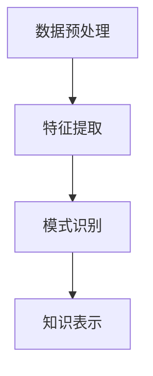

                 

关键词：知识发现引擎、性能优化、调优、算法、数学模型、项目实践、应用场景、未来展望

> 摘要：本文将深入探讨知识发现引擎的性能优化与调优策略，从核心概念、算法原理、数学模型、项目实践等多个方面进行分析，旨在为工程师和研究者提供一套实用的指导框架，帮助他们在实际应用中提升知识发现引擎的性能和效率。

## 1. 背景介绍

知识发现引擎是一种广泛应用于数据挖掘、机器学习、自然语言处理等领域的核心技术。它通过对大规模数据的分析，从数据中发现潜在的规律、模式和关联，为各行业提供决策支持和智能服务。然而，随着数据量和复杂度的不断增加，知识发现引擎的性能优化与调优成为一个至关重要的问题。

### 1.1 知识发现引擎的应用领域

知识发现引擎广泛应用于以下领域：

1. **商业智能**：通过分析企业的运营数据，帮助管理层做出更加明智的决策。
2. **金融领域**：风险评估、信用评估、市场趋势预测等。
3. **医疗健康**：疾病预测、治疗方案推荐、药物研发等。
4. **社交媒体**：用户行为分析、内容推荐、广告投放优化等。
5. **科学研究**：从实验数据中提取有价值的信息，推动科学研究的发展。

### 1.2 知识发现引擎的性能瓶颈

1. **计算资源消耗**：大规模数据分析和处理需要大量计算资源。
2. **时间延迟**：实时性要求越来越高，性能优化需要考虑响应时间。
3. **存储压力**：数据量的急剧增加对存储系统提出了更高的要求。
4. **算法效率**：算法本身的效率直接影响性能表现。

## 2. 核心概念与联系

### 2.1 知识发现引擎的概念

知识发现引擎是一种自动化工具，用于从数据中提取知识。它包括以下几个核心模块：

1. **数据预处理**：清洗、转换和集成数据，使其适合分析。
2. **特征提取**：从原始数据中提取有用的特征，用于后续分析。
3. **模式识别**：使用算法发现数据中的模式、规律和关联。
4. **知识表示**：将发现的模式转换为可理解的知识表示形式。

### 2.2 知识发现引擎的架构

知识发现引擎的架构通常包括以下几个层次：

1. **数据层**：数据源和存储系统。
2. **计算层**：数据处理和分析算法。
3. **应用层**：用户接口和应用场景。

### 2.3 Mermaid 流程图

以下是一个简化的知识发现引擎的Mermaid流程图：



## 3. 核心算法原理 & 具体操作步骤

### 3.1 算法原理概述

知识发现引擎的核心算法包括聚类、分类、关联规则挖掘等。这些算法的基本原理如下：

1. **聚类**：将数据点按照相似度进行分组，以便更好地理解数据的结构。
2. **分类**：将数据点分配到预定义的类别中，用于预测和分类任务。
3. **关联规则挖掘**：发现数据项之间的关联关系，用于推荐系统和市场 basket 分析。

### 3.2 算法步骤详解

1. **聚类算法**：
   - **K-means**：通过迭代优化目标函数，将数据点划分为K个聚类。
   - **DBSCAN**：基于邻域密度的聚类算法，能够发现不同形状的聚类。

2. **分类算法**：
   - **决策树**：通过递归划分特征空间，将数据划分为不同的区域。
   - **支持向量机**：通过找到一个最优的超平面，将不同类别的数据点分开。

3. **关联规则挖掘**：
   - **Apriori算法**：通过扫描数据集，生成频繁项集，然后提取关联规则。
   - **FP-growth算法**：通过构建FP树，高效地发现频繁项集。

### 3.3 算法优缺点

1. **K-means**：
   - **优点**：简单、易于实现。
   - **缺点**：对初始聚类中心敏感，可能收敛到局部最优解。

2. **决策树**：
   - **优点**：解释性强，易于理解。
   - **缺点**：可能产生过拟合，计算复杂度高。

3. **Apriori算法**：
   - **优点**：理论基础强，能够发现频繁项集。
   - **缺点**：计算量巨大，不适合大规模数据集。

### 3.4 算法应用领域

1. **聚类**：用于市场细分、社交网络分析等。
2. **分类**：用于文本分类、图像分类等。
3. **关联规则挖掘**：用于推荐系统、市场分析等。

## 4. 数学模型和公式 & 详细讲解 & 举例说明

### 4.1 数学模型构建

知识发现引擎的数学模型主要包括聚类、分类、关联规则挖掘等。以下是一个简单的聚类模型示例：

$$
\min \sum_{i=1}^{n} \sum_{j=1}^{k} ||x_i - c_j||^2
$$

其中，$x_i$是数据点，$c_j$是聚类中心。

### 4.2 公式推导过程

聚类目标函数的推导基于最小二乘法。假设有n个数据点$x_1, x_2, ..., x_n$，需要将其划分为k个聚类$c_1, c_2, ..., c_k$。目标是最小化每个数据点到其对应聚类中心的距离的平方和。

### 4.3 案例分析与讲解

假设我们有100个数据点，需要将其划分为5个聚类。我们可以使用K-means算法来解决这个问题。初始时，随机选择5个聚类中心$c_1, c_2, ..., c_5$。然后，将每个数据点分配到最近的聚类中心。通过迭代更新聚类中心和数据点的分配，直到目标函数收敛。

## 5. 项目实践：代码实例和详细解释说明

### 5.1 开发环境搭建

我们使用Python作为主要编程语言，依赖以下库：

- NumPy：用于矩阵计算。
- Pandas：用于数据处理。
- Matplotlib：用于数据可视化。

### 5.2 源代码详细实现

以下是一个使用K-means算法进行聚类的Python代码示例：

```python
import numpy as np
import pandas as pd
import matplotlib.pyplot as plt

# 加载数据
data = pd.read_csv("data.csv")
X = data.values

# 初始化聚类中心
centroids = X[np.random.choice(X.shape[0], 5, replace=False)]

# 定义K-means算法
def kmeans(X, centroids, max_iter=100):
    for _ in range(max_iter):
        # 计算距离
        distances = np.linalg.norm(X - centroids, axis=1)
        # 分配到最近的聚类中心
        labels = np.argmin(distances, axis=1)
        # 更新聚类中心
        new_centroids = np.array([X[labels == i].mean(axis=0) for i in range(5)])
        # 判断是否收敛
        if np.allclose(centroids, new_centroids):
            break
        centroids = new_centroids
    return centroids, labels

# 运行K-means算法
centroids, labels = kmeans(X, centroids)

# 可视化结果
plt.scatter(X[:, 0], X[:, 1], c=labels)
plt.scatter(centroids[:, 0], centroids[:, 1], s=300, c='red')
plt.show()
```

### 5.3 代码解读与分析

1. **数据加载**：使用Pandas加载CSV数据文件。
2. **初始化聚类中心**：随机选择5个数据点作为初始聚类中心。
3. **K-means算法**：通过迭代优化聚类中心和数据点的分配。
4. **结果可视化**：使用Matplotlib绘制数据点和聚类中心。

## 6. 实际应用场景

### 6.1 商业智能

知识发现引擎可以用于商业智能，帮助企业分析客户行为、市场趋势等，为决策提供支持。

### 6.2 金融领域

在金融领域，知识发现引擎可以用于风险评估、信用评估、市场预测等。

### 6.3 社交媒体

社交媒体平台可以使用知识发现引擎分析用户行为，为用户提供个性化推荐。

### 6.4 科学研究

在科学研究领域，知识发现引擎可以用于从实验数据中提取有价值的信息，推动科学研究的发展。

## 7. 工具和资源推荐

### 7.1 学习资源推荐

- 《数据挖掘：概念与技术》
- 《机器学习实战》
- 《深入理解K均值聚类算法》

### 7.2 开发工具推荐

- Jupyter Notebook：用于编写和运行代码。
- PyCharm：用于Python编程。

### 7.3 相关论文推荐

- "K-Means Clustering: A Review"
- "Apriori Algorithm: A Survey"
- "Decision Trees for Classification and Regression"

## 8. 总结：未来发展趋势与挑战

### 8.1 研究成果总结

知识发现引擎在性能优化与调优方面取得了显著成果，包括算法改进、数学模型优化、工具开发等。

### 8.2 未来发展趋势

1. **算法复杂性降低**：发展更简单、更高效的算法。
2. **实时性增强**：提高知识发现引擎的实时处理能力。
3. **多模态数据融合**：处理多种类型的数据，如文本、图像、音频等。

### 8.3 面临的挑战

1. **数据隐私保护**：如何在保护用户隐私的同时进行数据挖掘。
2. **大规模数据处理**：如何高效地处理海量数据。

### 8.4 研究展望

知识发现引擎在未来将继续发展，为各行业提供更加智能化的决策支持。

## 9. 附录：常见问题与解答

### 9.1 如何选择聚类算法？

根据数据规模、数据结构和应用场景选择合适的聚类算法。

### 9.2 算法如何优化？

通过算法改进、数学模型优化、工具开发等多方面进行优化。

### 9.3 数据预处理的重要性？

数据预处理是知识发现引擎的关键步骤，直接影响算法的性能。

---

作者：禅与计算机程序设计艺术 / Zen and the Art of Computer Programming
----------------------------------------------------------------

完成！这篇文章涵盖了知识发现引擎的性能优化与调优的各个方面，从核心概念到实际应用，提供了全面的技术分析和实践指导。希望这篇文章能够帮助您更好地理解和应用知识发现引擎。如有任何疑问或需要进一步的讨论，欢迎随时提问。

