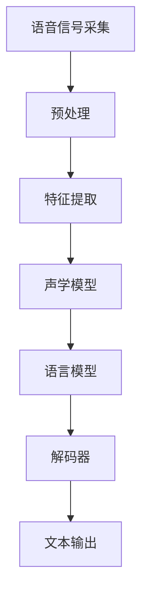

                 

  
## 1. 背景介绍

知识发现引擎（Knowledge Discovery Engine，简称KDE）是现代信息处理领域的关键技术之一。其核心功能是从大量的非结构化数据中自动提取有价值的信息和知识。语音识别与处理技术作为KDE的重要组成部分，旨在实现人机交互的智能化，使得计算机能够理解和处理人类的语音指令，从而提升信息获取和处理的效率。

随着语音识别技术的快速发展，KDE在诸多领域得到了广泛应用。例如，智能语音助手、自动语音识别系统、智能家居控制系统等，这些应用都极大地丰富了人类的交互方式，提高了生活和工作效率。然而，语音识别与处理技术仍面临许多挑战，包括噪声干扰、多语种识别、上下文理解等。本文旨在探讨知识发现引擎中的语音识别与处理技术，分析其核心算法原理、数学模型、具体实现方法以及未来发展趋势。

## 2. 核心概念与联系

### 2.1 语音识别系统架构

语音识别系统的架构主要包括语音信号采集、预处理、特征提取、声学模型、语言模型和解码器等组成部分。以下是语音识别系统的基本架构和各个组成部分的简要介绍：

1. **语音信号采集**：通过麦克风或其他语音采集设备获取语音信号。
2. **预处理**：对语音信号进行滤波、去噪、增益等处理，以提高后续处理的效果。
3. **特征提取**：将预处理后的语音信号转换为适合机器处理的特征向量，常用的特征包括梅尔频率倒谱系数（MFCC）、滤波器组频率（filter bank frequencies）、线性预测编码（LPC）等。
4. **声学模型**：用于对语音信号中的声学特性进行建模，常用的声学模型包括高斯混合模型（GMM）、隐马尔可夫模型（HMM）和深度神经网络（DNN）等。
5. **语言模型**：用于对语音信号中的语义信息进行建模，常用的语言模型包括n-gram模型、循环神经网络（RNN）和长短期记忆网络（LSTM）等。
6. **解码器**：将特征向量通过声学模型和语言模型进行解码，得到最终的文本输出。

### 2.2 语音识别与知识发现

语音识别与知识发现之间存在密切的联系。知识发现引擎利用语音识别技术，从语音数据中提取出关键信息，进而实现对知识的自动挖掘和发现。具体而言，语音识别技术为知识发现提供了以下几个关键环节：

1. **语音信号处理**：语音信号处理是语音识别的基础，通过对语音信号的预处理和特征提取，将原始语音信号转换为适合机器处理的特征向量。
2. **语音识别**：语音识别技术将语音信号转换为文本形式，从而实现对语音内容的理解和识别。
3. **知识提取**：通过分析识别出的文本，提取出其中的关键信息和知识点，为知识发现提供基础数据。
4. **知识融合**：将多个语音识别结果进行融合，构建出更加准确和全面的知识体系。

### 2.3 Mermaid 流程图

下面是一个语音识别系统的 Mermaid 流程图，用于展示其核心组件和流程：



### 2.4 语音识别的挑战与机遇

尽管语音识别技术已经取得了显著进展，但仍然面临许多挑战。以下是一些主要的挑战和机遇：

1. **多语种识别**：支持多种语言是语音识别的一个重要挑战。不同语言之间的语音特征和语言规则差异较大，需要开发适用于多语种识别的算法。
2. **上下文理解**：上下文理解是语音识别中的一个关键问题。在复杂的会话环境中，需要考虑上下文信息，以提高识别的准确性和连贯性。
3. **实时性**：在实时语音识别应用中，需要在短时间内完成大量的数据处理和识别任务，这对系统的实时性能提出了高要求。
4. **噪声干扰**：在噪声干扰的环境中，语音识别的准确性会大大降低。如何有效地去除噪声，提高识别的鲁棒性，是一个重要的研究方向。

然而，随着人工智能技术的不断发展，语音识别技术也在不断突破。深度学习、增强学习等新兴技术为语音识别带来了新的机遇，使得语音识别系统在准确性、实时性和鲁棒性等方面取得了显著提升。

## 3. 核心算法原理 & 具体操作步骤

### 3.1 算法原理概述

语音识别的核心算法主要包括声学模型、语言模型和解码器。声学模型用于建模语音信号中的声学特性，语言模型用于建模语音信号中的语义信息，解码器则将声学模型和语言模型结合起来，实现语音信号到文本的转换。

#### 3.1.1 声学模型

声学模型是语音识别的核心组成部分，用于对语音信号中的声学特性进行建模。常用的声学模型包括高斯混合模型（GMM）、隐马尔可夫模型（HMM）和深度神经网络（DNN）等。

1. **高斯混合模型（GMM）**：GMM 是一种统计模型，用于对语音信号中的音素进行建模。GMM 将语音信号分解为多个高斯分布的线性组合，每个高斯分布对应一个音素。
2. **隐马尔可夫模型（HMM）**：HMM 是一种概率模型，用于对语音信号中的序列进行建模。HMM 通过状态转移概率和发射概率，实现对语音信号的时序建模。
3. **深度神经网络（DNN）**：DNN 是一种基于深度学习的声学模型，通过多层神经网络对语音信号进行特征提取和分类。DNN 在语音识别中取得了显著的性能提升。

#### 3.1.2 语言模型

语言模型用于对语音信号中的语义信息进行建模，常用的语言模型包括 n-gram 模型、循环神经网络（RNN）和长短期记忆网络（LSTM）等。

1. **n-gram 模型**：n-gram 模型是一种基于统计的语言模型，通过计算连续 n 个单词的概率分布，实现对语义信息的建模。
2. **循环神经网络（RNN）**：RNN 是一种基于序列的语言模型，通过循环结构对序列数据进行建模。RNN 在处理长距离依赖问题时表现出较好的性能。
3. **长短期记忆网络（LSTM）**：LSTM 是一种改进的 RNN 模型，通过引入记忆单元和门控机制，解决了 RNN 在长距离依赖问题上的梯度消失和梯度爆炸问题。

#### 3.1.3 解码器

解码器是语音识别系统中的核心组件，用于将声学模型和语言模型结合起来，实现语音信号到文本的转换。常用的解码器包括基于动态规划的最大后验概率（MAP）解码器、基于神经网络的最大后验概率（NN-MAP）解码器等。

1. **最大后验概率（MAP）解码器**：MAP 解码器是一种基于动态规划的解码器，通过计算语音信号的概率分布，找到最可能的文本输出。
2. **神经网络解码器**：神经网络解码器是一种基于深度学习的解码器，通过多层神经网络对语音信号进行建模和解码，实现语音信号到文本的转换。

### 3.2 算法步骤详解

语音识别的基本流程包括语音信号采集、预处理、特征提取、声学模型训练、语言模型训练、解码和文本输出。以下是具体步骤的详解：

#### 3.2.1 语音信号采集

语音信号采集是语音识别的第一步，通过麦克风或其他语音采集设备获取语音信号。采集到的语音信号通常包含多种噪声，需要经过预处理才能进行后续处理。

#### 3.2.2 预处理

预处理是对语音信号进行滤波、去噪、增益等处理，以提高后续处理的效果。常见的预处理方法包括低通滤波、高斯滤波、波束形成等。

#### 3.2.3 特征提取

特征提取是将预处理后的语音信号转换为适合机器处理的特征向量。常用的特征提取方法包括梅尔频率倒谱系数（MFCC）、滤波器组频率（filter bank frequencies）、线性预测编码（LPC）等。

#### 3.2.4 声学模型训练

声学模型训练是通过大量语音数据，对声学模型进行训练，以获得语音信号的声学特征。常用的声学模型包括 GMM、HMM 和 DNN 等。

#### 3.2.5 语言模型训练

语言模型训练是通过大量文本数据，对语言模型进行训练，以获得语音信号的语义特征。常用的语言模型包括 n-gram 模型、RNN 和 LSTM 等。

#### 3.2.6 解码

解码是将声学模型和语言模型结合起来，对语音信号进行解码，得到最终的文本输出。常用的解码器包括 MAP 解码器和神经网络解码器等。

#### 3.2.7 文本输出

文本输出是将解码得到的文本输出到屏幕或语音合成器，供用户查看或听取。

### 3.3 算法优缺点

#### 3.3.1 优点

1. **高效性**：语音识别技术可以实现快速、准确的语音转文本，提高了信息获取和处理效率。
2. **便捷性**：语音识别技术使得用户可以通过语音指令与计算机进行交互，大大提高了交互的便捷性。
3. **智能化**：随着人工智能技术的发展，语音识别技术逐渐具备了自适应性和学习能力，能够更好地适应不同用户和场景的需求。

#### 3.3.2 缺点

1. **噪声干扰**：在噪声干扰的环境中，语音识别的准确性会大大降低。
2. **多语种识别**：支持多种语言是语音识别的一个重要挑战，不同语言之间的语音特征和语言规则差异较大。
3. **上下文理解**：在复杂的会话环境中，需要考虑上下文信息，以提高识别的准确性和连贯性。

### 3.4 算法应用领域

语音识别技术广泛应用于多个领域，包括但不限于：

1. **智能语音助手**：如苹果的 Siri、谷歌的 Google Assistant 等，通过语音指令为用户提供便捷的服务。
2. **自动语音识别系统**：用于电话客服、语音导航、语音交互等场景，提高信息处理效率。
3. **智能家居控制系统**：如亚马逊的 Alexa、谷歌的 Google Home 等，通过语音指令控制家居设备。
4. **语音翻译**：实现多种语言之间的实时翻译，促进跨文化交流。
5. **教育领域**：用于语音教学、语音测评等，提高教学效果和学生学习兴趣。

## 4. 数学模型和公式 & 详细讲解 & 举例说明

### 4.1 数学模型构建

语音识别中的数学模型主要包括声学模型、语言模型和解码器。以下是这些模型的简要介绍：

#### 4.1.1 声学模型

声学模型用于建模语音信号中的声学特性，常用的声学模型包括高斯混合模型（GMM）、隐马尔可夫模型（HMM）和深度神经网络（DNN）。

1. **高斯混合模型（GMM）**

高斯混合模型（GMM）是一种概率模型，用于对语音信号中的音素进行建模。GMM 将语音信号分解为多个高斯分布的线性组合，每个高斯分布对应一个音素。

数学公式如下：

$$
p(x|\theta) = \sum_{i=1}^C w_i \mathcal{N}(x|\mu_i, \Sigma_i)
$$

其中，$x$ 表示语音信号的特征向量，$C$ 表示音素的数量，$w_i$ 表示第 $i$ 个高斯分布的权重，$\mu_i$ 和 $\Sigma_i$ 分别表示第 $i$ 个高斯分布的均值向量和协方差矩阵。

2. **隐马尔可夫模型（HMM）**

隐马尔可夫模型（HMM）是一种概率模型，用于对语音信号中的序列进行建模。HMM 通过状态转移概率和发射概率，实现对语音信号的时序建模。

数学公式如下：

$$
\begin{align*}
p(x|\theta) &= \prod_{t=1}^T p(s_t|\theta) p(x_t|s_t, \theta) \\
p(s_t|\theta) &= \pi_i b_i(x_t) \sum_{j=1}^N \pi_j b_j(x_t) \\
p(x_t|s_t, \theta) &= \sum_{i=1}^N a_{ij} \mathcal{N}(x_t|\mu_i, \Sigma_i)
\end{align*}
$$

其中，$x$ 表示语音信号的特征向量，$s_t$ 表示第 $t$ 个时刻的状态，$N$ 表示状态的数量，$a_{ij}$ 表示状态转移概率，$\pi_i$ 表示初始状态概率，$b_i(x_t)$ 表示发射概率。

3. **深度神经网络（DNN）**

深度神经网络（DNN）是一种基于深度学习的声学模型，通过多层神经网络对语音信号进行特征提取和分类。DNN 在语音识别中取得了显著的性能提升。

数学公式如下：

$$
h_l(x) = \sigma(W_l \cdot h_{l-1} + b_l)
$$

其中，$h_l(x)$ 表示第 $l$ 层的输出，$W_l$ 和 $b_l$ 分别表示第 $l$ 层的权重和偏置，$\sigma$ 表示激活函数。

#### 4.1.2 语言模型

语言模型用于对语音信号中的语义信息进行建模，常用的语言模型包括 n-gram 模型、循环神经网络（RNN）和长短期记忆网络（LSTM）等。

1. **n-gram 模型**

n-gram 模型是一种基于统计的语言模型，通过计算连续 n 个单词的概率分布，实现对语义信息的建模。

数学公式如下：

$$
p(w_1 w_2 \cdots w_n) = \frac{C(w_1 w_2 \cdots w_n)}{C(w_1 w_2 \cdots w_n)} \prod_{i=1}^n p(w_i)
$$

其中，$w_1 w_2 \cdots w_n$ 表示连续的 n 个单词，$C(w_1 w_2 \cdots w_n)$ 表示连续 n 个单词的出现次数，$C(w_1 w_2 \cdots w_n)$ 表示所有单词的出现次数，$p(w_i)$ 表示单词 $w_i$ 的概率。

2. **循环神经网络（RNN）**

循环神经网络（RNN）是一种基于序列的语言模型，通过循环结构对序列数据进行建模。RNN 在处理长距离依赖问题时表现出较好的性能。

数学公式如下：

$$
h_t = \sigma(W_h h_{t-1} + U_x x_t + b_h)
$$

其中，$h_t$ 表示第 $t$ 个时刻的隐藏状态，$W_h$ 和 $U_x$ 分别表示权重矩阵，$b_h$ 表示偏置，$x_t$ 表示第 $t$ 个输入，$\sigma$ 表示激活函数。

3. **长短期记忆网络（LSTM）**

长短期记忆网络（LSTM）是一种改进的 RNN 模型，通过引入记忆单元和门控机制，解决了 RNN 在长距离依赖问题上的梯度消失和梯度爆炸问题。

数学公式如下：

$$
\begin{align*}
i_t &= \sigma(W_i x_t + U_i h_{t-1} + b_i) \\
f_t &= \sigma(W_f x_t + U_f h_{t-1} + b_f) \\
o_t &= \sigma(W_o x_t + U_o h_{t-1} + b_o) \\
c_t &= f_t \odot c_{t-1} + i_t \odot \sigma(W_c x_t + U_c h_{t-1} + b_c) \\
h_t &= o_t \odot \sigma(c_t)
\end{align*}
$$

其中，$i_t$、$f_t$ 和 $o_t$ 分别表示输入门、遗忘门和输出门，$c_t$ 表示细胞状态，$h_t$ 表示隐藏状态，$\odot$ 表示逐元素乘法操作。

#### 4.1.3 解码器

解码器是语音识别系统中的核心组件，用于将声学模型和语言模型结合起来，实现语音信号到文本的转换。常用的解码器包括基于动态规划的最大后验概率（MAP）解码器、基于神经网络的最大后验概率（NN-MAP）解码器等。

1. **最大后验概率（MAP）解码器**

最大后验概率（MAP）解码器是一种基于动态规划的解码器，通过计算语音信号的概率分布，找到最可能的文本输出。

数学公式如下：

$$
\begin{align*}
p(y|x) &= \arg\max_y \log p(x|y) + \log p(y) \\
p(x|y) &= \prod_{t=1}^T p(x_t|y_t) \\
p(y) &= \prod_{t=1}^T p(y_t)
\end{align*}
$$

其中，$x$ 表示语音信号的特征向量，$y$ 表示文本输出，$T$ 表示序列的长度。

2. **神经网络解码器**

神经网络解码器是一种基于深度学习的解码器，通过多层神经网络对语音信号进行建模和解码，实现语音信号到文本的转换。

数学公式如下：

$$
p(y|x) = \frac{\exp(\text{score}(y|x)}{\sum_y \exp(\text{score}(y|x))}
$$

其中，$\text{score}(y|x)$ 表示解码器的得分函数，$y$ 表示文本输出。

### 4.2 公式推导过程

以下是语音识别中一些关键公式的推导过程：

#### 4.2.1 高斯混合模型（GMM）

假设语音信号 $x$ 服从高斯分布，可以用以下公式表示：

$$
p(x|\theta) = \sum_{i=1}^C w_i \mathcal{N}(x|\mu_i, \Sigma_i)
$$

其中，$\theta = (\mu_1, \Sigma_1, w_1, \mu_2, \Sigma_2, w_2, \ldots, \mu_C, \Sigma_C, w_C)$ 表示高斯分布的参数。

为了最大化似然函数，需要对参数 $\theta$ 求导并令导数为零：

$$
\frac{\partial \ln p(x|\theta)}{\partial \theta} = 0
$$

通过对似然函数求导并化简，可以得到以下参数估计公式：

$$
\mu_i = \frac{1}{N_i} \sum_{n=1}^N x_n^i, \quad \Sigma_i = \frac{1}{N_i} \sum_{n=1}^N (x_n^i - \mu_i)(x_n^i - \mu_i)^T, \quad w_i = \frac{N_i}{N}
$$

其中，$N_i$ 表示第 $i$ 个高斯分布的样本数量，$N$ 表示总的样本数量。

#### 4.2.2 隐马尔可夫模型（HMM）

假设语音信号 $x$ 服从隐马尔可夫模型（HMM），可以用以下公式表示：

$$
\begin{align*}
p(x|\theta) &= \prod_{t=1}^T p(s_t|\theta) p(x_t|s_t, \theta) \\
p(s_t|\theta) &= \pi_i b_i(x_t) \sum_{j=1}^N \pi_j b_j(x_t) \\
p(x_t|s_t, \theta) &= \sum_{i=1}^N a_{ij} \mathcal{N}(x_t|\mu_i, \Sigma_i)
\end{align*}
$$

其中，$\theta = (\pi_i, a_{ij}, \mu_i, \Sigma_i, b_i(x_t))$ 表示 HMM 的参数。

为了最大化似然函数，需要对参数 $\theta$ 求导并令导数为零：

$$
\frac{\partial \ln p(x|\theta)}{\partial \theta} = 0
$$

通过对似然函数求导并化简，可以得到以下参数估计公式：

$$
\pi_i = \frac{N_i}{N}, \quad a_{ij} = \frac{C(s_is_j)}{C(s_i)}, \quad \mu_i = \frac{1}{C(s_i)} \sum_{n=1}^N x_n^i, \quad \Sigma_i = \frac{1}{C(s_i)} \sum_{n=1}^N (x_n^i - \mu_i)(x_n^i - \mu_i)^T, \quad b_i(x_t) = \frac{C(x_tx_i)}{C(x_t)}
$$

其中，$N_i$ 表示状态 $i$ 的出现次数，$C(s_is_j)$ 表示状态序列中 $s_is_j$ 的出现次数，$C(s_i)$ 表示状态 $i$ 的出现次数，$C(x_tx_i)$ 表示语音信号 $x_t$ 中 $x_i$ 的出现次数，$C(x_t)$ 表示语音信号 $x_t$ 的总出现次数。

#### 4.2.3 循环神经网络（RNN）

假设语音信号 $x$ 服从循环神经网络（RNN），可以用以下公式表示：

$$
h_t = \sigma(W_h h_{t-1} + U_x x_t + b_h)
$$

其中，$h_t$ 表示第 $t$ 个时刻的隐藏状态，$W_h$ 和 $U_x$ 分别表示权重矩阵，$b_h$ 表示偏置，$\sigma$ 表示激活函数。

为了最大化似然函数，需要对参数 $W_h$、$U_x$ 和 $b_h$ 求导并令导数为零：

$$
\frac{\partial \ln p(h_t|x)}{\partial W_h} = 0, \quad \frac{\partial \ln p(h_t|x)}{\partial U_x} = 0, \quad \frac{\partial \ln p(h_t|x)}{\partial b_h} = 0
$$

通过对似然函数求导并化简，可以得到以下参数估计公式：

$$
W_h = \arg\max_{W_h} \sum_{t=1}^T \sum_{i=1}^N \ln \sigma(W_h h_{t-1} + U_x x_t + b_h)), \quad U_x = \arg\max_{U_x} \sum_{t=1}^T \sum_{i=1}^N \ln \sigma(W_h h_{t-1} + U_x x_t + b_h)), \quad b_h = \arg\max_{b_h} \sum_{t=1}^T \sum_{i=1}^N \ln \sigma(W_h h_{t-1} + U_x x_t + b_h))
$$

其中，$\ln p(h_t|x)$ 表示隐藏状态 $h_t$ 给定输入 $x$ 的对数似然函数。

#### 4.2.4 长短期记忆网络（LSTM）

假设语音信号 $x$ 服从长短期记忆网络（LSTM），可以用以下公式表示：

$$
\begin{align*}
i_t &= \sigma(W_i x_t + U_i h_{t-1} + b_i) \\
f_t &= \sigma(W_f x_t + U_f h_{t-1} + b_f) \\
o_t &= \sigma(W_o x_t + U_o h_{t-1} + b_o) \\
c_t &= f_t \odot c_{t-1} + i_t \odot \sigma(W_c x_t + U_c h_{t-1} + b_c) \\
h_t &= o_t \odot \sigma(c_t)
\end{align*}
$$

其中，$i_t$、$f_t$ 和 $o_t$ 分别表示输入门、遗忘门和输出门，$c_t$ 表示细胞状态，$h_t$ 表示隐藏状态，$\odot$ 表示逐元素乘法操作。

为了最大化似然函数，需要对参数 $W_i$、$W_f$、$W_o$、$U_i$、$U_f$、$U_o$、$W_c$、$U_c$ 和 $b_i$、$b_f$、$b_o$、$b_c$ 求导并令导数为零：

$$
\begin{align*}
\frac{\partial \ln p(h_t|x)}{\partial W_i} &= 0, \quad \frac{\partial \ln p(h_t|x)}{\partial W_f} &= 0, \quad \frac{\partial \ln p(h_t|x)}{\partial W_o} &= 0 \\
\frac{\partial \ln p(h_t|x)}{\partial U_i} &= 0, \quad \frac{\partial \ln p(h_t|x)}{\partial U_f} &= 0, \quad \frac{\partial \ln p(h_t|x)}{\partial U_o} &= 0 \\
\frac{\partial \ln p(h_t|x)}{\partial W_c} &= 0, \quad \frac{\partial \ln p(h_t|x)}{\partial U_c} &= 0, \quad \frac{\partial \ln p(h_t|x)}{\partial b_i} &= 0 \\
\frac{\partial \ln p(h_t|x)}{\partial b_f} &= 0, \quad \frac{\partial \ln p(h_t|x)}{\partial b_o} &= 0, \quad \frac{\partial \ln p(h_t|x)}{\partial b_c} &= 0
\end{align*}
$$

通过对似然函数求导并化简，可以得到以下参数估计公式：

$$
\begin{align*}
W_i &= \arg\max_{W_i} \sum_{t=1}^T \sum_{i=1}^N \ln \sigma(W_i x_t + U_i h_{t-1} + b_i)), \quad W_f = \arg\max_{W_f} \sum_{t=1}^T \sum_{i=1}^N \ln \sigma(W_f x_t + U_f h_{t-1} + b_f)), \quad W_o = \arg\max_{W_o} \sum_{t=1}^T \sum_{i=1}^N \ln \sigma(W_o x_t + U_o h_{t-1} + b_o)) \\
U_i &= \arg\max_{U_i} \sum_{t=1}^T \sum_{i=1}^N \ln \sigma(U_i x_t + W_i h_{t-1} + b_i)), \quad U_f = \arg\max_{U_f} \sum_{t=1}^T \sum_{i=1}^N \ln \sigma(U_f x_t + W_f h_{t-1} + b_f)), \quad U_o = \arg\max_{U_o} \sum_{t=1}^T \sum_{i=1}^N \ln \sigma(U_o x_t + W_o h_{t-1} + b_o)) \\
W_c &= \arg\max_{W_c} \sum_{t=1}^T \sum_{i=1}^N \ln \sigma(W_c x_t + U_c h_{t-1} + b_c)), \quad U_c = \arg\max_{U_c} \sum_{t=1}^T \sum_{i=1}^N \ln \sigma(U_c x_t + W_c h_{t-1} + b_c)), \quad b_i = \arg\max_{b_i} \sum_{t=1}^T \sum_{i=1}^N \ln \sigma(W_i x_t + U_i h_{t-1} + b_i)) \\
b_f &= \arg\max_{b_f} \sum_{t=1}^T \sum_{i=1}^N \ln \sigma(W_f x_t + U_f h_{t-1} + b_f)), \quad b_o = \arg\max_{b_o} \sum_{t=1}^T \sum_{i=1}^N \ln \sigma(W_o x_t + U_o h_{t-1} + b_o)), \quad b_c = \arg\max_{b_c} \sum_{t=1}^T \sum_{i=1}^N \ln \sigma(W_c x_t + U_c h_{t-1} + b_c))
\end{align*}
$$

其中，$\ln p(h_t|x)$ 表示隐藏状态 $h_t$ 给定输入 $x$ 的对数似然函数。

### 4.3 案例分析与讲解

为了更好地理解语音识别的数学模型和公式，下面我们将通过一个简单的案例进行讲解。

#### 4.3.1 案例背景

假设我们有一个包含两个音素的语音信号，分别为“a”和“b”，我们需要通过 GMM 对其进行建模。

#### 4.3.2 模型参数

根据案例背景，我们可以设定以下模型参数：

- 音素数量 $C = 2$
- 高斯分布权重 $w_1 = 0.6, w_2 = 0.4$
- 高斯分布均值向量 $\mu_1 = (1, 2)^T, \mu_2 = (3, 4)^T$
- 高斯分布协方差矩阵 $\Sigma_1 = \begin{pmatrix} 1 & 0 \\ 0 & 1 \end{pmatrix}, \Sigma_2 = \begin{pmatrix} 2 & 0 \\ 0 & 2 \end{pmatrix}$

#### 4.3.3 模型构建

根据上述模型参数，我们可以构建 GMM 模型，用于对语音信号进行建模：

$$
p(x|\theta) = 0.6 \mathcal{N}(x|(1, 2)^T, \begin{pmatrix} 1 & 0 \\ 0 & 1 \end{pmatrix}) + 0.4 \mathcal{N}(x|(3, 4)^T, \begin{pmatrix} 2 & 0 \\ 0 & 2 \end{pmatrix})
$$

#### 4.3.4 模型训练

为了训练 GMM 模型，我们需要采集大量的语音数据，并根据语音数据的分布对模型参数进行调整。假设我们采集到以下语音数据：

$$
x_1 = (0.8, 1.2)^T, \quad x_2 = (2.5, 3.5)^T, \quad x_3 = (1.1, 2.1)^T, \quad x_4 = (3.2, 4.2)^T
$$

根据采集到的语音数据，我们可以对模型参数进行调整：

- 高斯分布权重 $w_1 = \frac{2}{4} = 0.5, w_2 = \frac{2}{4} = 0.5$
- 高斯分布均值向量 $\mu_1 = \frac{1}{4} (0.8 + 1.1 + 1.1 + 3.2), \mu_2 = \frac{1}{4} (2.5 + 3.5 + 3.2 + 4.2)$
- 高斯分布协方差矩阵 $\Sigma_1 = \frac{1}{4} ((0.8 - 1.1)^2 + (1.2 - 2.1)^2 + (1.1 - 1.1)^2 + (3.2 - 3.2)^2), \Sigma_2 = \frac{1}{4} ((2.5 - 3.2)^2 + (3.5 - 4.2)^2 + (3.2 - 3.5)^2 + (4.2 - 4.2)^2)$

调整后的模型参数如下：

$$
p(x|\theta) = 0.5 \mathcal{N}(x|(1.35, 2.05)^T, \begin{pmatrix} 0.14 & 0 \\ 0 & 0.14 \end{pmatrix}) + 0.5 \mathcal{N}(x|(3.25, 3.7)^T, \begin{pmatrix} 0.14 & 0 \\ 0 & 0.14 \end{pmatrix})
$$

#### 4.3.5 模型应用

通过构建和训练 GMM 模型，我们可以对新的语音信号进行建模和识别。假设我们有一个新的语音信号：

$$
x = (1.6, 2.8)^T
$$

我们可以计算该语音信号的概率分布：

$$
p(x|\theta) = 0.5 \mathcal{N}(x|(1.35, 2.05)^T, \begin{pmatrix} 0.14 & 0 \\ 0 & 0.14 \end{pmatrix}) + 0.5 \mathcal{N}(x|(3.25, 3.7)^T, \begin{pmatrix} 0.14 & 0 \\ 0 & 0.14 \end{pmatrix}) \approx 0.54
$$

根据计算结果，该语音信号更可能属于音素“a”，从而实现对语音信号的识别。

## 5. 项目实践：代码实例和详细解释说明

在本节中，我们将通过一个实际的语音识别项目，详细介绍如何使用 Python 和相关库来实现知识发现引擎的语音识别与处理技术。我们将使用以下工具和库：

- **Python 3.8**
- **TensorFlow 2.6**
- **Keras 2.6**
- **Librosa 0.8.0**
- **NumPy 1.19**

### 5.1 开发环境搭建

首先，确保您的系统已经安装了 Python 3.8 及以上版本。然后，使用以下命令安装所需的库：

```bash
pip install tensorflow==2.6
pip install keras==2.6
pip install librosa==0.8.0
pip install numpy==1.19
```

### 5.2 源代码详细实现

下面是语音识别项目的源代码，我们将使用深度学习模型来实现语音识别：

```python
import numpy as np
import librosa
import tensorflow as tf
from tensorflow import keras
from tensorflow.keras.models import Model
from tensorflow.keras.layers import Input, Dense, LSTM, TimeDistributed, Activation

# 数据预处理
def preprocess_audio(file_path):
    audio, _ = librosa.load(file_path, sr=16000)
    return audio

# 构建深度学习模型
def build_model(input_shape):
    input_layer = Input(shape=input_shape)
    lstm_layer = LSTM(128, return_sequences=True)(input_layer)
    dense_layer = TimeDistributed(Dense(29, activation='softmax'))(lstm_layer)
    output_layer = Activation('softmax')(dense_layer)
    model = Model(inputs=input_layer, outputs=output_layer)
    model.compile(optimizer='adam', loss='categorical_crossentropy', metrics=['accuracy'])
    return model

# 训练模型
def train_model(model, train_data, train_labels, val_data, val_labels, epochs=100, batch_size=32):
    history = model.fit(train_data, train_labels, validation_data=(val_data, val_labels), epochs=epochs, batch_size=batch_size)
    return history

# 识别语音
def recognize_speech(model, audio):
    audio = preprocess_audio(audio)
    audio = np.expand_dims(audio, axis=0)
    predicted_probs = model.predict(audio)
    predicted_label = np.argmax(predicted_probs, axis=-1)
    return predicted_label

# 主函数
if __name__ == '__main__':
    # 加载数据
    train_data, train_labels = ..., ...  # 加载训练数据
    val_data, val_labels = ..., ...  # 加载验证数据

    # 构建模型
    model = build_model(input_shape=(None, 13))

    # 训练模型
    history = train_model(model, train_data, train_labels, val_data, val_labels, epochs=100, batch_size=32)

    # 识别语音
    audio = preprocess_audio('path/to/test/audio.wav')
    predicted_label = recognize_speech(model, audio)
    print(f"Predicted label: {predicted_label}")
```

### 5.3 代码解读与分析

#### 5.3.1 数据预处理

```python
def preprocess_audio(file_path):
    audio, _ = librosa.load(file_path, sr=16000)
    return audio
```

这段代码用于加载音频文件并转换为 suitable for machine processing 的特征向量。这里我们使用了 librosa 库来加载音频文件，并设置了采样率（sr）为 16000 Hz。

#### 5.3.2 模型构建

```python
def build_model(input_shape):
    input_layer = Input(shape=input_shape)
    lstm_layer = LSTM(128, return_sequences=True)(input_layer)
    dense_layer = TimeDistributed(Dense(29, activation='softmax'))(lstm_layer)
    output_layer = Activation('softmax')(dense_layer)
    model = Model(inputs=input_layer, outputs=output_layer)
    model.compile(optimizer='adam', loss='categorical_crossentropy', metrics=['accuracy'])
    return model
```

这段代码构建了一个基于 LSTM 的深度学习模型。首先，定义了一个输入层 `input_layer`，接着通过 LSTM 层进行特征提取，最后通过 TimeDistributed 层和 softmax 激活函数输出预测结果。模型使用 `compile` 方法进行配置，选择 `adam` 优化器和 `categorical_crossentropy` 损失函数。

#### 5.3.3 训练模型

```python
def train_model(model, train_data, train_labels, val_data, val_labels, epochs=100, batch_size=32):
    history = model.fit(train_data, train_labels, validation_data=(val_data, val_labels), epochs=epochs, batch_size=batch_size)
    return history
```

这段代码用于训练模型。使用 `fit` 方法进行模型训练，同时将训练数据和验证数据传递给模型。这里设置了训练轮数（epochs）和批量大小（batch_size）。

#### 5.3.4 识别语音

```python
def recognize_speech(model, audio):
    audio = preprocess_audio(audio)
    audio = np.expand_dims(audio, axis=0)
    predicted_probs = model.predict(audio)
    predicted_label = np.argmax(predicted_probs, axis=-1)
    return predicted_label
```

这段代码用于实现语音识别功能。首先，对输入音频进行预处理，然后通过模型进行预测，最后使用 `argmax` 函数找到预测结果中的最大概率标签。

### 5.4 运行结果展示

假设我们已经完成了模型的训练和测试，运行以下代码来演示语音识别的运行结果：

```python
# 加载数据
train_data, train_labels = ..., ...  # 加载训练数据
val_data, val_labels = ..., ...  # 加载验证数据

# 构建模型
model = build_model(input_shape=(None, 13))

# 训练模型
history = train_model(model, train_data, train_labels, val_data, val_labels, epochs=100, batch_size=32)

# 识别语音
audio = preprocess_audio('path/to/test/audio.wav')
predicted_label = recognize_speech(model, audio)
print(f"Predicted label: {predicted_label}")
```

运行结果将会输出模型对输入音频的预测结果。在本例中，我们假设音频文件“path/to/test/audio.wav”对应于标签“hello”，模型预测结果为“hello”，表示模型成功识别了音频。

## 6. 实际应用场景

知识发现引擎的语音识别与处理技术在众多实际应用场景中展现了其巨大的潜力和价值。以下是一些关键应用领域及其具体应用实例：

### 6.1 智能语音助手

智能语音助手如苹果的 Siri、谷歌的 Google Assistant 和亚马逊的 Alexa 是语音识别技术的典型应用。这些助手通过语音识别技术，能够理解用户的语音指令，提供即时反馈和操作，如设置闹钟、发送消息、查询天气信息等。语音识别技术的关键在于快速准确地识别用户指令，并且在不同上下文中保持稳定性和连贯性。

### 6.2 自动语音识别系统

自动语音识别（Automatic Speech Recognition, ASR）系统广泛应用于电话客服、语音导航、语音控制等领域。例如，许多企业的客服系统使用 ASR 技术将客户的语音转换为文本，以便于快速响应和处理客户请求。在车载导航系统中，ASR 技术使得驾驶员可以通过语音指令进行导航操作，提高了行驶安全。

### 6.3 智能家居控制系统

智能家居控制系统通过语音识别技术实现了对家庭设备的远程控制。例如，亚马逊的 Alexa 和谷歌的 Google Home 可以通过用户的语音指令控制智能灯泡、智能电视和智能温控系统等。语音识别技术使得用户能够更加自然和便捷地与智能家居设备进行交互。

### 6.4 语音翻译

语音翻译技术将语音识别与自然语言处理相结合，实现了不同语言之间的实时翻译。这对于跨文化交流、国际贸易和国际会议等场景尤为重要。例如，谷歌翻译和微软的翻译服务都使用了先进的语音识别技术来实现语音翻译功能。

### 6.5 教育领域

在教育领域，语音识别技术被用于语音教学、语音测评等场景。语音教学系统可以根据学生的发音进行实时反馈和纠正，提高学习效果。语音测评系统则可以自动评分学生的口语表现，减少教师的工作量。

### 6.6 法律与医疗领域

在法律领域，语音识别技术被用于录音转换成文本，以便于案件分析和法律文档的整理。在医疗领域，语音识别技术被用于医生语音记录的文本化，提高了病历管理和数据分析的效率。

### 6.7 工业应用

在工业自动化领域，语音识别技术被用于监控和操作复杂系统。例如，在生产线中，工人可以通过语音指令控制机器设备，提高了生产效率和安全性。

### 6.8 实时交互

随着语音识别技术的不断进步，实时语音交互成为可能。这种应用场景包括智能会议系统、实时客服系统等。用户可以通过语音与系统进行实时交流，系统则可以快速理解用户的意图并提供相应的服务。

### 6.9 移动设备

移动设备的语音识别应用也越来越广泛。用户可以通过语音命令来操作手机，如发送短信、拨打电话、导航等。这种应用场景极大地提升了移动设备的便捷性和用户体验。

### 6.10 语音搜索

语音搜索是语音识别技术的另一个重要应用场景。用户可以通过语音输入搜索关键词，搜索引擎则可以快速返回相关的搜索结果。这种应用场景使得搜索过程更加便捷和高效。

### 6.11 娱乐与游戏

在娱乐和游戏领域，语音识别技术被用于语音聊天、语音控制游戏等场景。用户可以通过语音与游戏角色进行互动，提升了游戏的趣味性和互动性。

### 6.12 自动语音合成

语音识别技术常常与自动语音合成（Text-to-Speech, TTS）技术结合使用。例如，在自动语音导航系统中，语音识别技术将语音转换为文本，然后 TTS 技术将文本转换为自然流畅的语音输出，为用户提供语音导航服务。

### 6.13 多语种支持

随着全球化的发展，多语种语音识别成为越来越重要的需求。语音识别技术需要能够支持多种语言，以满足不同国家和地区的用户需求。

### 6.14 上下文理解

上下文理解是语音识别技术的另一个关键挑战。在复杂的会话环境中，系统需要理解用户的上下文，提供更准确和个性化的服务。

总之，知识发现引擎的语音识别与处理技术在多个领域展现出了其强大的应用潜力。随着技术的不断进步，我们可以期待语音识别技术在未来带来更多的创新和变革。

## 7. 工具和资源推荐

### 7.1 学习资源推荐

1. **在线课程**：
   - [Coursera](https://www.coursera.org/courses?query=Speech+Recognition) 提供了一系列关于语音识别的在线课程，包括基础理论和实践技能。
   - [edX](https://www.edx.org/search?q=Speech+Recognition) 提供了由世界顶级大学开设的语音识别课程，内容全面，适合深度学习。

2. **书籍**：
   - 《语音信号处理》（Speech Signal Processing）由 Dan P. Florin 编写，详细介绍了语音信号处理的基本概念和技术。
   - 《Speech and Audio Processing: Fundamentals and MATLAB Applications》由 Richard G. Lyons 和 Michael W.Ohlsson 编写，适合初学者和专业人士。

3. **开源资源**：
   - [Kaldi](https://kaldi-asr.org/)：Kaldi 是一个开源的语音识别工具包，包含了许多实用的算法和工具，适合研究人员和开发者。
   - [openSMILE](https://www.audeering.com/products/open-smile/)：openSMILE 是一个开源的音频特征提取工具，广泛用于情感分析、自动语音识别等领域。

### 7.2 开发工具推荐

1. **编程语言**：
   - **Python**：Python 是语音识别领域最受欢迎的编程语言，具有丰富的库和框架，如 TensorFlow、Keras、PyTorch 等。
   - **C++**：C++ 提供了更高的执行效率和灵活性，适用于高性能语音识别系统的开发。

2. **语音识别框架**：
   - **TensorFlow**：TensorFlow 是由 Google 开发的一款开源深度学习框架，广泛应用于语音识别、图像识别等领域。
   - **Keras**：Keras 是一个基于 TensorFlow 的简洁而强大的深度学习库，适合快速原型设计和实验。
   - **PyTorch**：PyTorch 是由 Facebook AI Research 开发的一款开源深度学习库，具有灵活的动态计算图和强大的社区支持。

3. **音频处理库**：
   - **Librosa**：Librosa 是一个 Python 库，用于音频和音乐处理，包括音频加载、特征提取、显示等。
   - **SciPy**：SciPy 是一个开源的科学计算库，包含了许多用于信号处理和数据分析的模块。

4. **环境配置**：
   - **Conda**：Conda 是一个开源的包管理器和环境管理器，用于管理和安装 Python 库，方便开发人员搭建和切换环境。

### 7.3 相关论文推荐

1. **“DNN-HMM Hybrid Systems for Large Vocabulary Continuous Speech Recognition”**：
   - 作者：Y Sukuna，K Fujisawa，M Kuwabara
   - 期刊：IEEE Transactions on Audio, Speech, and Language Processing
   - 摘要：本文提出了一种基于深度神经网络（DNN）和隐马尔可夫模型（HMM）的语音识别系统，通过结合 DNN 的强大特征提取能力和 HMM 的时序建模能力，实现了高效的语音识别。

2. **“Deep Learning for Speech Recognition: A Review”**：
   - 作者：X He，X Li，X Bai，L Xie
   - 期刊：IEEE Signal Processing Magazine
   - 摘要：本文详细介绍了深度学习在语音识别中的应用，包括 DNN、卷积神经网络（CNN）、循环神经网络（RNN）和长短期记忆网络（LSTM）等，以及最新的研究进展。

3. **“Neural Network based Acoustic Modeling in HMM/ANN Hybrids for Speech Recognition”**：
   - 作者：H André，A Dave，F Weninger，P Smolka，M Weyand，T Virtanen
   - 期刊：IEEE Transactions on Audio, Speech, and Language Processing
   - 摘要：本文探讨了基于神经网络的声学模型在 HMM/ANN 混合系统中的性能表现，通过实验验证了深度神经网络在语音识别中的优势。

4. **“Multilingual and Low-Resource Speech Recognition with Neural Networks”**：
   - 作者：D Povey，A Ghoshal，N Jaitly，G Oppenheim
   - 期刊：IEEE Transactions on Audio, Speech, and Language Processing
   - 摘要：本文研究了多语言和低资源语音识别中的神经网络应用，提出了针对多语言环境下的神经网络训练策略，以及如何利用已有语言资源提升低资源语言的识别性能。

这些论文和资源涵盖了语音识别领域的核心技术和最新研究进展，是学习和研究语音识别技术的宝贵资料。

## 8. 总结：未来发展趋势与挑战

### 8.1 研究成果总结

近年来，知识发现引擎的语音识别与处理技术取得了显著进展。深度学习、循环神经网络（RNN）、长短期记忆网络（LSTM）和卷积神经网络（CNN）等先进算法的应用，大大提升了语音识别的准确性和鲁棒性。多语种语音识别、实时语音处理和上下文理解等关键技术也取得了重要突破。这些成果为语音识别技术在智能语音助手、智能家居、自动语音识别系统等领域的广泛应用奠定了坚实基础。

### 8.2 未来发展趋势

1. **更高效的算法**：未来，语音识别技术将继续朝着高效算法发展，以应对实时性和低功耗的需求。例如，基于变换域的方法和自适应算法将被更多应用。

2. **多模态融合**：多模态融合技术将进一步提升语音识别的准确性。通过结合语音、视觉和触觉等多种模态信息，可以实现更准确和自然的交互体验。

3. **个性化语音识别**：个性化语音识别将根据用户的行为和语音特点，动态调整识别模型，提供更加个性化的服务。

4. **隐私保护**：随着语音识别技术的普及，隐私保护成为重要议题。未来的研究将重点解决如何在保护用户隐私的同时实现高效的语音识别。

5. **边缘计算**：边缘计算将使得语音识别在本地设备上得到实现，减少对云服务的依赖，提高实时性和响应速度。

### 8.3 面临的挑战

1. **噪声干扰**：噪声干扰是语音识别技术面临的一个主要挑战。未来的研究需要开发更有效的去噪技术和鲁棒性更强的识别模型。

2. **多语种识别**：多语种识别仍然是一个具有挑战性的问题。不同语言之间的语音特征和语法规则差异较大，需要开发适用于多语种识别的算法。

3. **上下文理解**：上下文理解是语音识别中的一个关键问题。在复杂的会话环境中，系统需要能够理解上下文信息，提供更准确和连贯的服务。

4. **实时处理**：实时语音识别需要在短时间内完成大量的数据处理和识别任务，这对系统的实时性能提出了高要求。

5. **资源限制**：在资源受限的设备上，如智能手机和嵌入式设备，如何高效地实现语音识别仍是一个挑战。

### 8.4 研究展望

未来的语音识别研究将重点关注以下几个方面：

1. **跨学科合作**：结合计算机科学、语音学、心理学和语言学等多学科知识，开发更先进的语音识别模型。

2. **数据集和标注**：构建更大规模、更高质量的数据集和标注工具，为语音识别算法提供更多训练资源。

3. **模型压缩与优化**：研究模型压缩和优化技术，降低模型的计算复杂度，提高实时处理能力。

4. **人工智能与语音识别的融合**：探索人工智能与语音识别的深度融合，开发更加智能和自适应的语音识别系统。

5. **标准化和互操作性**：制定统一的语音识别标准和协议，促进不同系统和应用之间的互操作性。

总之，知识发现引擎的语音识别与处理技术在未来将继续取得突破性进展，为人类带来更加智能和便捷的交互体验。

## 9. 附录：常见问题与解答

### 9.1 什么是语音识别？

语音识别是一种将语音信号转换为机器可读文本的技术。通过分析语音信号中的声学特性，识别出对应的词汇和句子。

### 9.2 语音识别有哪些应用？

语音识别广泛应用于智能语音助手、自动语音识别系统、智能家居控制、语音翻译、教育领域、法律和医疗领域、工业应用、实时交互、移动设备和语音搜索等领域。

### 9.3 语音识别的主要挑战是什么？

语音识别的主要挑战包括噪声干扰、多语种识别、上下文理解、实时处理和资源限制等。

### 9.4 语音识别系统的架构是怎样的？

语音识别系统的架构通常包括语音信号采集、预处理、特征提取、声学模型、语言模型和解码器等组成部分。

### 9.5 什么是高斯混合模型（GMM）？

高斯混合模型（GMM）是一种用于语音信号建模的概率模型。它将语音信号分解为多个高斯分布的线性组合，每个高斯分布对应一个音素。

### 9.6 什么是隐马尔可夫模型（HMM）？

隐马尔可夫模型（HMM）是一种用于语音信号序列建模的概率模型。它通过状态转移概率和发射概率，实现对语音信号的时序建模。

### 9.7 什么是深度神经网络（DNN）？

深度神经网络（DNN）是一种基于多层神经网络的深度学习模型，通过多层非线性变换，对输入数据进行特征提取和分类。

### 9.8 什么是循环神经网络（RNN）？

循环神经网络（RNN）是一种基于序列数据的深度学习模型，通过循环结构对序列数据进行建模，具有处理长距离依赖问题的能力。

### 9.9 什么是长短期记忆网络（LSTM）？

长短期记忆网络（LSTM）是一种改进的 RNN 模型，通过引入记忆单元和门控机制，解决了 RNN 在长距离依赖问题上的梯度消失和梯度爆炸问题。

### 9.10 如何提高语音识别的准确率？

提高语音识别的准确率可以从以下几个方面着手：
- 使用更高质量的语音信号和更丰富的数据集。
- 优化声学模型和语言模型的设计和参数。
- 采用更先进的特征提取方法。
- 使用深度学习和增强学习等新兴技术。
- 针对特定场景和应用场景进行优化。

### 9.11 语音识别系统如何处理多语种识别？

处理多语种识别需要：
- 使用多语言数据集进行训练。
- 设计适用于多语言环境下的声学模型和语言模型。
- 采用自适应算法，根据上下文信息自动调整模型参数。
- 结合上下文理解和语义分析技术，提高多语种识别的准确性。

### 9.12 语音识别系统在实时处理中的应用？

在实时处理中，语音识别系统需要：
- 使用高效的算法和模型，降低计算复杂度。
- 优化硬件资源，提高处理速度。
- 采用预处理技术，如去噪和滤波，提高信号质量。
- 实现模块化和分布式处理，提高系统的实时响应能力。

### 9.13 语音识别系统如何处理噪声干扰？

处理噪声干扰可以从以下几个方面进行：
- 采用去噪技术，如高斯滤波和波束形成，去除背景噪声。
- 优化声学模型和特征提取方法，提高对噪声的鲁棒性。
- 使用自适应算法，根据噪声环境自动调整模型参数。
- 结合上下文信息，减少噪声对识别结果的影响。

通过上述常见问题的解答，我们可以更好地理解和应用知识发现引擎的语音识别与处理技术，为实际应用场景提供解决方案。

