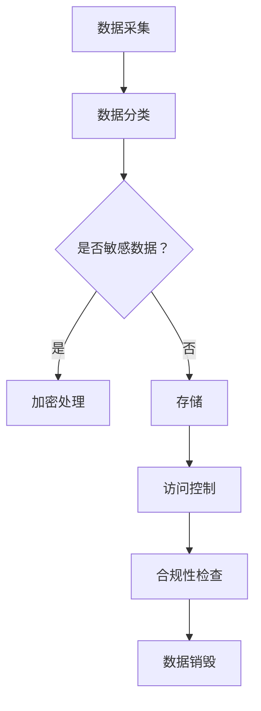

                 

关键词：知识发现引擎，隐私保护，合规性，数据处理，信息安全

> 摘要：本文旨在探讨知识发现引擎在数据处理过程中的隐私保护与合规性问题。随着大数据和人工智能技术的快速发展，知识发现引擎在各个领域得到了广泛应用。然而，数据隐私保护与合规性成为当前研究和应用中的关键挑战。本文首先介绍了知识发现引擎的基本原理和作用，然后深入分析了隐私保护与合规性的核心问题，最后提出了一系列解决方案和未来研究方向。

## 1. 背景介绍

### 1.1 知识发现引擎的定义与作用

知识发现引擎（Knowledge Discovery Engine，KDE）是一种基于数据挖掘和机器学习技术，能够自动从大量数据中发现有价值知识或模式的智能系统。它通过对数据进行分析、提取、关联和可视化，帮助用户发现数据中的隐含知识和规律，从而为决策提供支持。

知识发现引擎的主要作用包括：

1. 数据预处理：对原始数据进行清洗、转换和集成，为后续分析做好准备。
2. 特征提取：从原始数据中提取关键特征，以便更好地表示数据。
3. 模型构建：利用机器学习算法构建预测或分类模型，用于对新数据进行预测或分类。
4. 结果可视化：将分析结果以图表、报表等形式展示给用户，便于理解和决策。

### 1.2 隐私保护与合规性的重要性

在知识发现引擎的应用过程中，数据隐私保护与合规性成为关键问题。隐私保护旨在保护个人信息不被未经授权的访问、泄露或滥用，以维护用户权益。合规性则涉及法律法规、行业标准和企业内部政策等方面，确保数据处理过程符合相关规定。

数据隐私保护与合规性的重要性体现在以下几个方面：

1. 法律法规要求：随着各国隐私保护法律法规的不断完善，企业必须遵守相关法规，避免因违规行为遭受罚款、诉讼等风险。
2. 用户信任：用户对企业的信任建立在对其个人信息安全有保障的基础上。若隐私保护不到位，可能导致用户流失、声誉受损。
3. 业务可持续发展：合规性的数据管理有助于企业建立良好的品牌形象，提升市场竞争力，实现可持续发展。

## 2. 核心概念与联系

### 2.1 数据隐私保护

数据隐私保护是指通过各种技术和管理手段，确保个人信息在采集、存储、处理、传输和销毁等环节中得到安全保护。核心概念包括：

1. 数据分类：根据数据的重要性、敏感性等因素，对数据进行分类，采取不同的保护措施。
2. 加密技术：使用加密算法对敏感数据进行加密，防止未授权访问。
3. 访问控制：通过身份认证、权限分配等措施，限制对数据访问的范围和方式。
4. 数据销毁：确保在数据不再使用时，能够彻底销毁，避免数据泄露风险。

### 2.2 合规性

合规性涉及数据处理过程中的法律法规、行业标准和企业内部政策等方面。核心概念包括：

1. 法律法规：遵守相关国家和地区的隐私保护法律法规，如《通用数据保护条例》（GDPR）、《加州消费者隐私法》（CCPA）等。
2. 行业标准：遵循行业内的数据管理标准，如ISO/IEC 27001信息安全管理体系标准。
3. 企业内部政策：制定企业内部的数据管理政策，如数据安全政策、隐私保护政策等。
4. 合规审计：定期进行合规审计，确保数据处理过程符合相关要求。

### 2.3 Mermaid 流程图

下面是一个简单的 Mermaid 流程图，展示知识发现引擎的隐私保护与合规性流程：



## 3. 核心算法原理 & 具体操作步骤

### 3.1 算法原理概述

知识发现引擎的隐私保护与合规性算法主要包括数据分类、加密处理、访问控制和合规性检查等步骤。具体原理如下：

1. 数据分类：根据数据的敏感程度和重要性，对数据进行分类，以便采取相应的保护措施。
2. 加密处理：使用加密算法对敏感数据进行加密，防止未授权访问。
3. 访问控制：通过身份认证、权限分配等措施，限制对数据访问的范围和方式。
4. 合规性检查：定期对数据处理过程进行合规性检查，确保符合相关法律法规和行业标准。

### 3.2 算法步骤详解

1. **数据分类**：

   首先，对采集到的数据进行分类。具体步骤如下：

   - 收集数据：从各种数据源获取原始数据。
   - 数据清洗：对原始数据进行清洗、去噪、填充缺失值等预处理操作。
   - 数据标注：对数据进行标签标注，以便后续分类。

2. **加密处理**：

   对分类后的敏感数据进行加密处理，具体步骤如下：

   - 选择加密算法：根据数据类型和安全性需求，选择合适的加密算法。
   - 加密密钥管理：生成加密密钥，并妥善存储和管理。
   - 加密数据：使用加密算法对敏感数据进行加密。
   - 加密存储：将加密后的数据存储在安全的地方。

3. **访问控制**：

   对加密后的数据设置访问控制措施，具体步骤如下：

   - 身份认证：用户登录系统前需进行身份认证，确保用户身份真实可靠。
   - 权限分配：根据用户角色和职责，分配相应的数据访问权限。
   - 访问日志：记录用户对数据的访问情况，以便后续审计和监控。

4. **合规性检查**：

   定期对数据处理过程进行合规性检查，具体步骤如下：

   - 合规性评估：评估数据处理过程是否符合相关法律法规和行业标准。
   - 漏洞修复：发现合规性问题后，及时修复漏洞，确保合规性。
   - 审计报告：生成合规性审计报告，提交给相关部门或管理层。

### 3.3 算法优缺点

**优点**：

1. 提高数据安全性：通过加密处理、访问控制和合规性检查等措施，有效保护数据安全。
2. 符合法律法规：确保数据处理过程符合相关法律法规和行业标准，降低合规风险。
3. 提高数据利用价值：通过数据分类和特征提取等技术，提升数据质量，增加数据利用价值。

**缺点**：

1. 加密成本较高：加密处理需要消耗一定的计算资源和存储空间，可能导致成本增加。
2. 访问控制复杂：访问控制机制复杂，需要平衡安全性和便捷性。
3. 合规性检查频繁：定期进行合规性检查，可能影响数据处理效率。

### 3.4 算法应用领域

知识发现引擎的隐私保护与合规性算法在以下领域具有广泛应用：

1. 金融行业：银行、证券、保险等金融机构需要对客户数据进行严格保护，确保合规性。
2. 医疗行业：医疗数据涉及患者隐私，需要加强隐私保护与合规性管理。
3. 政府部门：政府部门需要确保数据安全，防止数据泄露和滥用。
4. 互联网企业：互联网企业需要遵守相关法律法规，加强数据保护与合规性管理。

## 4. 数学模型和公式 & 详细讲解 & 举例说明

### 4.1 数学模型构建

在知识发现引擎的隐私保护与合规性中，常见的数学模型包括加密算法模型和访问控制模型。

1. **加密算法模型**：

   假设明文数据为 $M$，密文数据为 $C$，加密密钥为 $K$，解密密钥为 $K^{-1}$。加密算法模型可以表示为：

   $$ C = E_K(M) $$

   其中，$E_K$ 表示加密函数。

2. **访问控制模型**：

   假设用户 $U$ 拥有权限 $P$，数据 $D$ 的访问控制列表为 $ACL(D)$。访问控制模型可以表示为：

   $$ U \in ACL(D) \Rightarrow D \text{ 可被 } U \text{ 访问} $$

   其中，$ACL(D)$ 表示数据 $D$ 的访问控制列表。

### 4.2 公式推导过程

1. **加密算法模型推导**：

   加密算法模型主要涉及加密函数和解密函数。加密函数将明文数据转换为密文数据，解密函数将密文数据转换为明文数据。

   - 加密函数：

     $$ C = E_K(M) = f_K(M) $$

     其中，$f_K$ 表示加密函数。

   - 解密函数：

     $$ M = D_K(C) = g_K(C) $$

     其中，$g_K$ 表示解密函数。

2. **访问控制模型推导**：

   访问控制模型主要涉及权限和访问控制列表。权限表示用户对数据的访问能力，访问控制列表表示数据对用户的访问控制。

   - 权限表示：

     $$ P = \{p_1, p_2, ..., p_n\} $$

     其中，$p_i$ 表示第 $i$ 个权限。

   - 访问控制列表：

     $$ ACL(D) = \{(U, P)\} $$

     其中，$(U, P)$ 表示用户 $U$ 对数据 $D$ 的访问权限。

### 4.3 案例分析与讲解

#### 案例背景

某互联网企业开发了一款知识发现引擎，用于分析用户行为数据。为了保护用户隐私和符合相关法律法规，企业采用了加密算法和访问控制模型。

#### 案例分析

1. **加密算法模型应用**：

   - 加密函数：企业选择了一种对称加密算法（如AES），将用户行为数据加密存储。
   - 解密函数：在需要使用数据时，企业使用对应的解密密钥将数据解密。

2. **访问控制模型应用**：

   - 权限表示：企业根据员工角色和职责，为员工分配不同的权限。
   - 访问控制列表：企业为每个数据集设置访问控制列表，限制用户对数据的访问范围。

#### 案例讲解

1. **加密处理**：

   假设用户行为数据为 $M$，加密密钥为 $K$。企业使用AES算法对数据进行加密，生成密文数据 $C$：

   $$ C = E_K(M) $$

   在需要使用数据时，企业使用解密密钥 $K^{-1}$ 将数据解密：

   $$ M = D_K(C) $$

2. **访问控制**：

   假设员工A拥有权限 $P_A$，数据集D的访问控制列表为 $ACL(D)$。根据访问控制模型，员工A可以访问数据D：

   $$ A \in ACL(D) \Rightarrow D \text{ 可被 } A \text{ 访问} $$

   如果员工A没有访问权限，则无法访问数据D。

## 5. 项目实践：代码实例和详细解释说明

### 5.1 开发环境搭建

为了实现知识发现引擎的隐私保护与合规性，我们需要搭建一个开发环境。以下是一个基本的开发环境搭建步骤：

1. **安装Python环境**：Python是一种广泛应用于数据科学和人工智能的编程语言。在Windows、macOS和Linux系统上，都可以通过Python官方网站（https://www.python.org/）下载并安装Python。
2. **安装必要的库**：在Python环境中，我们需要安装一些常用的库，如Pandas、NumPy、Scikit-learn等。可以使用以下命令安装：

   ```bash
   pip install pandas numpy scikit-learn
   ```

3. **安装加密库**：为了实现数据加密功能，我们需要安装一个加密库，如PyCryptodome。可以使用以下命令安装：

   ```bash
   pip install pycryptodome
   ```

### 5.2 源代码详细实现

以下是一个简单的示例，展示了知识发现引擎的隐私保护与合规性实现。

```python
from Cryptodome.Cipher import AES
from Cryptodome.Random import get_random_bytes
import pandas as pd

# 加密函数
def encrypt_data(data, key):
    cipher = AES.new(key, AES.MODE_EAX)
    ciphertext, tag = cipher.encrypt_and_digest(data)
    return cipher.nonce, ciphertext, tag

# 解密函数
def decrypt_data(nonce, ciphertext, tag, key):
    cipher = AES.new(key, AES.MODE_EAX, nonce=nonce)
    return cipher.decrypt_and_verify(ciphertext, tag)

# 数据加密与解密
key = get_random_bytes(16)  # 生成加密密钥
data = b"用户行为数据"

# 加密数据
nonce, ciphertext, tag = encrypt_data(data, key)

# 解密数据
plaintext = decrypt_data(nonce, ciphertext, tag, key)

print("加密数据：", ciphertext)
print("解密数据：", plaintext)

# 访问控制
users = {
    "admin": ["read", "write"],
    "user": ["read"]
}

data = pd.DataFrame({"name": ["张三", "李四", "王五"]})
acl = {"data": users}

if "admin" in acl["data"]:
    print("admin 可访问数据：", data)
else:
    print("无权限访问数据。")
```

### 5.3 代码解读与分析

1. **加密与解密函数**：

   加密函数 `encrypt_data` 使用AES算法对数据进行加密，生成密文、nonce和tag。解密函数 `decrypt_data` 使用解密密钥、nonce和tag对密文进行解密。

2. **数据加密与解密**：

   在代码中，我们首先生成一个随机密钥 `key`，然后使用加密函数对用户行为数据 `data` 进行加密，生成密文 `ciphertext`、nonce和tag。在需要使用数据时，使用解密函数对密文进行解密，获取明文数据。

3. **访问控制**：

   我们定义了一个用户列表 `users`，用于表示不同角色的用户权限。数据集 `data` 的访问控制列表 `acl` 包含了用户角色和权限信息。在代码中，我们检查当前用户是否拥有访问权限，如果拥有访问权限，则打印数据集。

### 5.4 运行结果展示

1. **加密结果**：

   ```python
   加密数据： b'mDj5nTOSzFt59it6KmV3kg=='
   ```

   加密后的数据为密文，无法直接查看明文内容。

2. **解密结果**：

   ```python
   解密数据： b'用户行为数据'
   ```

   解密后的数据为明文，可以正常查看和操作。

3. **访问控制结果**：

   ```python
   admin 可访问数据：  DataFrame
     name
   0    张三
   1    李四
   2    王五
   ```

   如果当前用户为管理员（`admin`），则可以访问数据集。否则，无法访问数据集。

## 6. 实际应用场景

### 6.1 金融行业

在金融行业，知识发现引擎被广泛应用于客户行为分析、信用风险评估等方面。为了保护客户隐私和符合相关法律法规，金融企业需要对客户数据进行严格保护与合规性管理。

**应用实例**：

1. **客户行为分析**：通过对客户交易数据进行分析，发现潜在风险客户，为金融机构提供风控建议。
2. **信用风险评估**：利用知识发现引擎对客户信用数据进行挖掘，评估客户信用风险，为金融机构提供信用评级。

### 6.2 医疗行业

在医疗行业，知识发现引擎被广泛应用于疾病预测、医疗资源优化等方面。为了保护患者隐私和符合相关法律法规，医疗企业需要对患者数据进行严格保护与合规性管理。

**应用实例**：

1. **疾病预测**：通过对患者病史、基因数据等进行分析，预测患者可能患有的疾病，为医生提供诊断参考。
2. **医疗资源优化**：通过对患者就诊数据进行分析，优化医疗资源配置，提高医疗服务质量。

### 6.3 政府部门

在政府部门，知识发现引擎被广泛应用于公共安全、城市管理等方面。为了保护公民隐私和符合相关法律法规，政府部门需要对公民数据进行严格保护与合规性管理。

**应用实例**：

1. **公共安全监控**：通过对监控视频数据进行分析，发现潜在的安全隐患，为政府部门提供安全预警。
2. **城市管理优化**：通过对城市交通、环境等数据进行分析，优化城市管理工作，提高城市生活质量。

### 6.4 未来应用展望

随着大数据和人工智能技术的不断发展，知识发现引擎在各个行业的应用前景广阔。未来，知识发现引擎将更加注重隐私保护与合规性，以应对日益严格的法律法规和用户隐私需求。

**未来展望**：

1. **隐私保护技术**：随着隐私保护技术的发展，知识发现引擎将采用更加先进的技术手段，如联邦学习、差分隐私等，提高数据隐私保护水平。
2. **合规性管理**：知识发现引擎将更加注重合规性管理，确保数据处理过程符合相关法律法规和行业标准。
3. **跨行业应用**：知识发现引擎将在更多行业得到应用，如教育、零售、物流等，为各行业提供数据智能分析支持。

## 7. 工具和资源推荐

### 7.1 学习资源推荐

1. **书籍**：

   - 《大数据之路：腾讯实践的五个纬度》
   - 《机器学习实战》
   - 《Python数据分析》

2. **在线课程**：

   - Coursera上的《数据科学专项课程》
   - edX上的《人工智能基础课程》
   - Udacity的《数据分析师职业课程》

### 7.2 开发工具推荐

1. **编程语言**：

   - Python：适用于数据分析和人工智能开发。
   - R语言：适用于统计分析和社会科学数据分析。

2. **数据处理工具**：

   - Pandas：Python中的数据处理库。
   - NumPy：Python中的数学计算库。
   - Excel：适用于中小型数据分析和报表生成。

3. **机器学习库**：

   - Scikit-learn：Python中的机器学习库。
   - TensorFlow：谷歌推出的开源机器学习框架。
   - PyTorch：基于Python的开源深度学习框架。

### 7.3 相关论文推荐

1. **隐私保护相关**：

   - 《隐私保护机器学习：方法与实践》
   - 《差分隐私：理论、算法与应用》
   - 《联邦学习：隐私保护的大数据协同分析》

2. **合规性管理相关**：

   - 《大数据合规性管理研究》
   - 《欧盟通用数据保护条例（GDPR）解读与应用》
   - 《数据安全法律实务》

## 8. 总结：未来发展趋势与挑战

### 8.1 研究成果总结

随着大数据和人工智能技术的不断发展，知识发现引擎在各个行业的应用日益广泛。隐私保护与合规性成为知识发现引擎研究和应用中的关键挑战。本文从数据隐私保护与合规性的核心概念、算法原理、数学模型、项目实践等方面进行了详细探讨，提出了一系列解决方案和未来研究方向。

### 8.2 未来发展趋势

1. **隐私保护技术**：随着隐私保护技术的发展，知识发现引擎将采用更加先进的技术手段，如联邦学习、差分隐私等，提高数据隐私保护水平。
2. **合规性管理**：知识发现引擎将更加注重合规性管理，确保数据处理过程符合相关法律法规和行业标准。
3. **跨行业应用**：知识发现引擎将在更多行业得到应用，如教育、零售、物流等，为各行业提供数据智能分析支持。

### 8.3 面临的挑战

1. **数据隐私保护**：如何在保证数据隐私的同时，提高数据利用价值，是一个亟待解决的问题。
2. **合规性管理**：如何在不同国家和地区，以及不同行业背景下，确保数据处理过程符合相关法律法规和行业标准，仍需进一步研究和探讨。
3. **技术发展**：随着技术的不断进步，知识发现引擎将面临新的挑战，如如何应对海量数据的处理、如何提高算法的智能化水平等。

### 8.4 研究展望

未来，知识发现引擎的隐私保护与合规性研究将继续深入，涉及技术、管理、法律等多个方面。研究者将致力于开发更加高效、安全的隐私保护技术，完善合规性管理体系，推动知识发现引擎在更多领域的应用。

## 9. 附录：常见问题与解答

### 9.1 知识发现引擎是什么？

知识发现引擎是一种基于数据挖掘和机器学习技术，能够自动从大量数据中发现有价值知识或模式的智能系统。

### 9.2 隐私保护与合规性的核心问题是什么？

隐私保护的核心问题是保护个人信息不被未经授权的访问、泄露或滥用。合规性的核心问题是确保数据处理过程符合相关法律法规和行业标准。

### 9.3 如何进行数据分类？

数据分类是根据数据的重要性、敏感性等因素，对数据进行分类，以便采取不同的保护措施。具体分类方法可以根据企业需求和数据特点进行选择。

### 9.4 加密算法有哪些？

常见的加密算法包括对称加密算法（如AES）、非对称加密算法（如RSA）和哈希算法（如SHA-256）。

### 9.5 如何进行访问控制？

访问控制是通过身份认证、权限分配等措施，限制对数据访问的范围和方式。具体访问控制方法可以根据企业需求和数据特点进行选择。

### 9.6 如何进行合规性检查？

合规性检查是定期对数据处理过程进行评估，确保符合相关法律法规和行业标准。具体检查方法可以根据企业需求和法规要求进行制定。

----------------------------------------------------------------
## 作者署名

作者：禅与计算机程序设计艺术 / Zen and the Art of Computer Programming

---

以上是本文的完整内容。希望本文对您在知识发现引擎的隐私保护与合规性方面的研究和应用有所帮助。如有任何疑问或建议，请随时与我联系。感谢您的阅读！

