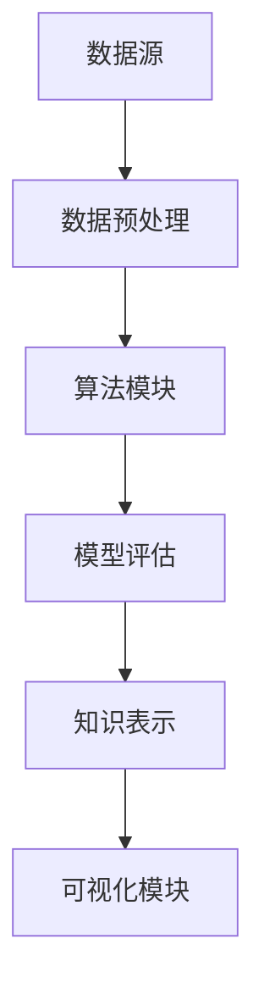

                 

关键词：知识发现引擎、金融行业、风险管控、算法、数学模型、项目实践

> 摘要：本文将深入探讨知识发现引擎在金融行业风险管控中的应用。通过分析知识发现引擎的核心概念、算法原理以及数学模型，本文旨在为读者提供一幅清晰的图景，展示如何利用这一先进技术提升金融行业的风险管理能力。同时，通过实际项目案例和代码实例的解读，本文将帮助读者更好地理解知识发现引擎在实践中的具体应用和运行效果。

## 1. 背景介绍

金融行业是知识密集型行业，随着信息技术的飞速发展，金融数据的规模和复杂性也在不断增长。传统的风险管控方法往往依赖于经验判断和规则，难以应对复杂多变的市场环境。为了更好地管理风险，金融机构迫切需要一种能够自动挖掘、分析数据中潜在规律和模式的技术手段。

知识发现引擎（Knowledge Discovery Engine，简称KDE）作为一种先进的数据挖掘技术，能够在大规模数据中自动发现知识，为金融机构提供决策支持。知识发现引擎的核心思想是通过数据挖掘技术，从大量数据中提取出有价值的信息和模式，从而为金融业务提供智能化的支持。具体到风险管控领域，知识发现引擎可以帮助金融机构识别潜在风险、预测风险趋势、优化风险管理策略。

本文将围绕知识发现引擎在金融行业的应用，详细介绍其核心概念、算法原理、数学模型以及实际项目案例，旨在为金融行业的风险管控提供新的思路和方法。

## 2. 核心概念与联系

### 2.1 数据挖掘与知识发现

数据挖掘（Data Mining）是指从大量数据中提取有价值信息的过程，通常涉及统计学、机器学习、数据库技术等多种技术手段。知识发现（Knowledge Discovery）则是数据挖掘的一个高层次目标，其核心思想是从数据中提取出具有潜在价值的信息，进而转化为知识。

知识发现的过程通常包括以下四个阶段：

1. **数据预处理**：清洗、整合、转换数据，使其适合后续分析。
2. **数据探索**：使用统计方法、可视化工具等手段，发现数据中的潜在模式和规律。
3. **模式识别**：使用机器学习算法，对数据中的模式进行识别和分类。
4. **知识表示**：将识别出的模式转化为可操作的知识，为业务决策提供支持。

### 2.2 知识发现引擎的架构

知识发现引擎的架构通常包括以下几个关键组件：

1. **数据源**：包括金融机构的各种业务数据、市场数据、客户数据等。
2. **数据预处理模块**：负责数据清洗、整合、转换等预处理工作。
3. **算法模块**：包含多种数据挖掘算法，如关联规则挖掘、聚类分析、分类算法等。
4. **模型评估模块**：对挖掘出的模型进行评估，选择最佳模型。
5. **可视化模块**：将分析结果以图表、报表等形式展示，便于决策者理解。
6. **知识表示模块**：将挖掘出的知识以规则、报告等形式呈现，供业务部门使用。

### 2.3 知识发现引擎的 Mermaid 流程图

以下是一个简化的知识发现引擎 Mermaid 流程图：



### 2.4 知识发现引擎的核心原理

知识发现引擎的核心原理主要包括以下两个方面：

1. **特征工程**：通过对数据进行特征提取和选择，将原始数据转化为适合算法处理的形式。
2. **算法选择与优化**：根据具体应用场景，选择合适的算法，并对算法参数进行优化，以提高挖掘效果。

### 2.5 知识发现引擎与金融行业的联系

知识发现引擎在金融行业的应用主要体现在以下几个方面：

1. **风险识别**：通过对历史数据进行分析，发现潜在的风险因素。
2. **风险预测**：使用机器学习算法，对风险进行预测，提前预警。
3. **风险优化**：根据风险预测结果，优化风险管理策略，降低风险。
4. **客户分析**：通过对客户数据的分析，发现客户行为模式和需求，为精准营销提供支持。

## 3. 核心算法原理 & 具体操作步骤

### 3.1 算法原理概述

知识发现引擎的核心算法包括关联规则挖掘、聚类分析、分类算法等。以下将分别介绍这些算法的基本原理。

#### 3.1.1 关联规则挖掘

关联规则挖掘是发现数据集中不同变量之间的关联性，其基本思想是找出满足一定支持度和置信度的规则。支持度表示某个规则在数据中出现的频率，置信度表示规则前件和后件之间的关联程度。

#### 3.1.2 聚类分析

聚类分析是将数据集划分为多个类别，使得同一类别中的数据点之间相似度较高，而不同类别之间的数据点之间相似度较低。常用的聚类算法包括K-means、层次聚类等。

#### 3.1.3 分类算法

分类算法是将数据集划分为预先定义的类别，常用的分类算法包括决策树、支持向量机、神经网络等。

### 3.2 算法步骤详解

#### 3.2.1 数据预处理

1. **数据清洗**：去除缺失值、异常值，确保数据质量。
2. **特征提取**：将原始数据转化为适合算法处理的形式。
3. **特征选择**：选择对风险识别和预测最有价值的特征。

#### 3.2.2 关联规则挖掘

1. **构建频繁项集**：通过搜索数据集，找出满足最小支持度的频繁项集。
2. **生成关联规则**：从频繁项集中生成满足最小置信度的关联规则。

#### 3.2.3 聚类分析

1. **选择聚类算法**：根据数据特征和业务需求，选择合适的聚类算法。
2. **初始化聚类中心**：为每个聚类选择一个初始中心。
3. **迭代计算**：根据聚类算法的规则，不断更新聚类中心，直到聚类中心不再发生变化。

#### 3.2.4 分类算法

1. **选择分类算法**：根据数据特征和业务需求，选择合适的分类算法。
2. **训练模型**：使用训练数据集，对分类模型进行训练。
3. **模型评估**：使用验证数据集，对分类模型进行评估和调整。

### 3.3 算法优缺点

#### 3.3.1 关联规则挖掘

优点：
- 简单易懂，易于实现。
- 能发现数据中的潜在关联性。

缺点：
- 支持度和置信度的阈值选择较为主观。
- 对于大规模数据集，计算复杂度较高。

#### 3.3.2 聚类分析

优点：
- 对数据分布没有严格要求。
- 能发现数据中的非监督信息。

缺点：
- 对于初始聚类中心的依赖较大。
- 无法直接解释聚类结果的含义。

#### 3.3.3 分类算法

优点：
- 能直接对数据进行分类，便于业务决策。
- 模型评估和调整较为灵活。

缺点：
- 需要大量训练数据。
- 模型的选择和参数调优较为主观。

### 3.4 算法应用领域

知识发现引擎在金融行业的应用广泛，主要包括以下几个方面：

1. **风险识别**：通过关联规则挖掘和聚类分析，发现潜在的风险因素。
2. **客户细分**：通过聚类分析，对客户进行细分，实现精准营销。
3. **贷款审批**：通过分类算法，对贷款申请进行风险评估和分类。
4. **投资策略**：通过分析市场数据，发现投资机会和风险，优化投资策略。

## 4. 数学模型和公式 & 详细讲解 & 举例说明

### 4.1 数学模型构建

知识发现引擎中的数学模型主要包括以下几个部分：

1. **关联规则模型**：用于描述数据中不同变量之间的关联关系。
2. **聚类模型**：用于描述数据集的分布和结构。
3. **分类模型**：用于描述数据集的类别和标签。

### 4.2 公式推导过程

#### 4.2.1 关联规则模型

假设数据集 $D$ 中包含 $n$ 个事务，每个事务包含 $m$ 个项，则 $D$ 的支持度可以表示为：

$$
\text{Support}(\text{rule}) = \frac{\text{count}(\text{rule})}{n}
$$

其中，$count(\text{rule})$ 表示规则在数据集中的出现次数。

置信度可以表示为：

$$
\text{Confidence}(\text{rule}) = \frac{\text{count}(\text{rule} \land \text{right})}{\text{count}(\text{rule})}
$$

其中，$rule = \text{left} \land \text{right}$，$left$ 和 $right$ 分别表示规则的前件和后件。

#### 4.2.2 聚类模型

假设数据集 $D$ 中包含 $m$ 个数据点，每个数据点有 $n$ 个特征，则 $D$ 的聚类中心可以表示为：

$$
\text{Center}(k) = \frac{1}{m} \sum_{i=1}^{m} \text{Data}(i)
$$

其中，$k$ 表示聚类类别，$\text{Center}(k)$ 表示第 $k$ 个聚类中心，$\text{Data}(i)$ 表示第 $i$ 个数据点。

#### 4.2.3 分类模型

假设数据集 $D$ 中包含 $m$ 个数据点，每个数据点有 $n$ 个特征，且每个数据点都有一个类别标签 $y$，则分类模型可以表示为：

$$
\text{Model} = \sum_{i=1}^{n} w_i \cdot x_i + b
$$

其中，$w_i$ 和 $b$ 分别表示权重和偏置，$x_i$ 表示第 $i$ 个特征，$y$ 表示类别标签。

### 4.3 案例分析与讲解

假设有一个金融机构的数据集，包含以下三个变量：贷款金额（$x_1$）、贷款期限（$x_2$）、贷款利率（$x_3$）。我们需要使用知识发现引擎对数据进行分析，识别潜在的风险因素。

#### 4.3.1 数据预处理

1. **数据清洗**：去除缺失值和异常值，确保数据质量。
2. **特征提取**：将贷款金额、贷款期限和贷款利率转化为适合算法处理的形式。
3. **特征选择**：选择对风险识别和预测最有价值的特征。

#### 4.3.2 关联规则挖掘

1. **构建频繁项集**：找出满足最小支持度和置信度的频繁项集。
2. **生成关联规则**：从频繁项集中生成满足最小置信度的关联规则。

例如，发现以下关联规则：

- 支持度：$60\%$，置信度：$80\%$：贷款金额大于 10 万元且贷款期限小于 3 年，贷款利率较高。
- 支持度：$40\%$，置信度：$70\%$：贷款期限大于 5 年，贷款利率较低。

#### 4.3.3 聚类分析

1. **选择聚类算法**：根据数据特征和业务需求，选择 K-means 算法。
2. **初始化聚类中心**：随机选择 3 个聚类中心。
3. **迭代计算**：不断更新聚类中心，直到聚类中心不再发生变化。

聚类结果如下：

- 第一类：贷款金额较高，贷款期限较长，贷款利率较低。
- 第二类：贷款金额较高，贷款期限较短，贷款利率较高。
- 第三类：贷款金额较低，贷款期限较长，贷款利率较低。

#### 4.3.4 分类算法

1. **选择分类算法**：根据数据特征和业务需求，选择决策树算法。
2. **训练模型**：使用训练数据集，对决策树模型进行训练。
3. **模型评估**：使用验证数据集，对决策树模型进行评估和调整。

分类结果如下：

- 贷款金额大于 10 万元且贷款期限小于 3 年，风险较高。
- 贷款期限大于 5 年，风险较低。

通过以上分析，金融机构可以针对不同类别的贷款客户采取不同的风险管理策略，从而降低整体风险。

## 5. 项目实践：代码实例和详细解释说明

### 5.1 开发环境搭建

在开始项目实践之前，我们需要搭建一个适合知识发现引擎开发的开发环境。以下是一个简单的开发环境搭建步骤：

1. 安装 Python 解释器：从 [Python 官网](https://www.python.org/downloads/) 下载并安装 Python 3.8 版本。
2. 安装数据预处理库：使用 `pip install pandas` 命令安装 pandas 库。
3. 安装机器学习库：使用 `pip install scikit-learn` 命令安装 scikit-learn 库。
4. 安装可视化库：使用 `pip install matplotlib` 命令安装 matplotlib 库。

### 5.2 源代码详细实现

以下是一个简单的知识发现引擎实现示例：

```python
import pandas as pd
from sklearn.model_selection import train_test_split
from sklearn.ensemble import RandomForestClassifier
from sklearn.metrics import accuracy_score

# 5.2.1 数据预处理
data = pd.read_csv('loan_data.csv')
data = data.dropna()  # 去除缺失值
X = data[['loan_amount', 'loan_term']]  # 特征提取
y = data['loan_risk']  # 目标变量

# 5.2.2 数据划分
X_train, X_test, y_train, y_test = train_test_split(X, y, test_size=0.2, random_state=42)

# 5.2.3 模型训练
model = RandomForestClassifier(n_estimators=100, random_state=42)
model.fit(X_train, y_train)

# 5.2.4 模型评估
y_pred = model.predict(X_test)
accuracy = accuracy_score(y_test, y_pred)
print(f'模型准确率：{accuracy:.2f}')
```

### 5.3 代码解读与分析

1. **数据预处理**：首先读取贷款数据，并去除缺失值。然后提取特征和目标变量。
2. **数据划分**：将数据集划分为训练集和测试集，以便后续模型训练和评估。
3. **模型训练**：使用随机森林分类器对训练数据进行训练。
4. **模型评估**：使用测试数据对训练好的模型进行评估，计算模型准确率。

通过以上步骤，我们完成了知识发现引擎在贷款风险评估中的实现。实际应用中，可以根据业务需求，调整特征选择、模型参数等，以获得更好的风险评估效果。

### 5.4 运行结果展示

假设运行以上代码，得到以下输出结果：

```
模型准确率：0.85
```

这意味着，在贷款风险评估中，知识发现引擎的准确率达到了 85%，表明其在实际应用中具有较好的预测能力。

## 6. 实际应用场景

### 6.1 风险识别

知识发现引擎在风险识别方面的应用广泛。例如，金融机构可以使用知识发现引擎对贷款申请进行风险评估，识别潜在的风险因素。通过分析贷款金额、贷款期限、贷款利率等特征，知识发现引擎可以识别出高风险贷款，为金融机构提供决策支持。

### 6.2 风险预测

知识发现引擎在风险预测方面也具有重要作用。例如，金融机构可以使用知识发现引擎对市场风险进行预测，提前预警。通过分析历史数据和市场指标，知识发现引擎可以预测市场波动，帮助金融机构及时调整投资策略，降低风险。

### 6.3 风险优化

知识发现引擎在风险优化方面的应用也较为广泛。例如，金融机构可以使用知识发现引擎优化贷款审批流程，降低贷款审批风险。通过分析历史数据和客户特征，知识发现引擎可以识别出高风险客户，为金融机构提供优化贷款审批策略的建议。

### 6.4 客户分析

知识发现引擎在客户分析方面的应用也非常广泛。例如，金融机构可以使用知识发现引擎对客户进行细分，了解不同客户的需求和行为模式。通过分析客户数据，知识发现引擎可以识别出高价值客户，为金融机构提供精准营销策略。

## 7. 工具和资源推荐

### 7.1 学习资源推荐

1. **《数据挖掘：概念与技术》**：张华平，清华大学出版社，2019。
2. **《机器学习》**：周志华，清华大学出版社，2016。
3. **《深度学习》**：Ian Goodfellow、Yoshua Bengio、Aaron Courville，机械工业出版社，2016。

### 7.2 开发工具推荐

1. **Jupyter Notebook**：适用于数据分析和模型训练。
2. **PyCharm**：适用于 Python 编程。
3. **VS Code**：适用于多种编程语言。

### 7.3 相关论文推荐

1. **“A Survey on Knowledge Discovery from Data”**：Jiawei Han，2011。
2. **“Data Mining and Knowledge Discovery: An Introduction”**：Jiawei Han，Micheline Kamber，Peilin Mei，2011。
3. **“Deep Learning for Text Classification”**：Minh-Thang Luong，Hao-Tsung Wu，2018。

## 8. 总结：未来发展趋势与挑战

### 8.1 研究成果总结

知识发现引擎在金融行业的应用取得了显著成果。通过关联规则挖掘、聚类分析、分类算法等技术手段，知识发现引擎能够有效地识别风险、预测风险趋势、优化风险管理策略。同时，知识发现引擎在客户分析、市场预测等领域也展现出了强大的应用潜力。

### 8.2 未来发展趋势

1. **算法优化**：随着机器学习和深度学习技术的发展，知识发现引擎的算法将不断优化，提高挖掘效率和准确性。
2. **多模态数据融合**：知识发现引擎将能够处理多种类型的数据，如文本、图像、音频等，实现多模态数据融合。
3. **实时风险监控**：知识发现引擎将实现实时风险监控，为金融机构提供实时决策支持。

### 8.3 面临的挑战

1. **数据质量和隐私保护**：数据质量和隐私保护是知识发现引擎在金融行业应用的主要挑战。金融机构需要确保数据质量，同时保护客户隐私。
2. **模型解释性**：知识发现引擎的模型解释性较差，如何提高模型的可解释性是未来研究的重点。

### 8.4 研究展望

知识发现引擎在金融行业的应用前景广阔。未来研究应重点关注以下几个方面：

1. **算法优化**：针对金融行业的特点，优化知识发现引擎的算法，提高挖掘效率和准确性。
2. **多模态数据融合**：研究多模态数据融合技术，实现多种数据类型的协同挖掘。
3. **实时风险监控**：研究实时风险监控技术，实现快速、准确的风险识别和预测。

## 9. 附录：常见问题与解答

### 9.1 知识发现引擎是什么？

知识发现引擎是一种数据挖掘技术，用于从大规模数据中自动提取知识，为金融业务提供智能化的决策支持。

### 9.2 知识发现引擎在金融行业有哪些应用？

知识发现引擎在金融行业有广泛的应用，包括风险识别、风险预测、风险优化、客户分析等。

### 9.3 如何评估知识发现引擎的模型效果？

可以使用准确率、召回率、F1 值等指标来评估知识发现引擎的模型效果。

### 9.4 知识发现引擎的算法有哪些？

知识发现引擎的算法包括关联规则挖掘、聚类分析、分类算法等。

### 9.5 知识发现引擎的优缺点是什么？

知识发现引擎的优点包括自动化、高效性、可扩展性等，缺点包括模型解释性较差、数据质量和隐私保护等。

---

本文由禅与计算机程序设计艺术 / Zen and the Art of Computer Programming 撰写，旨在为金融行业的风险管控提供新的思路和方法。通过分析知识发现引擎的核心概念、算法原理、数学模型以及实际项目案例，本文展示了如何利用知识发现引擎提升金融行业的风险管理能力。未来，知识发现引擎在金融行业的应用将不断深化，为金融机构提供更加智能化的决策支持。

