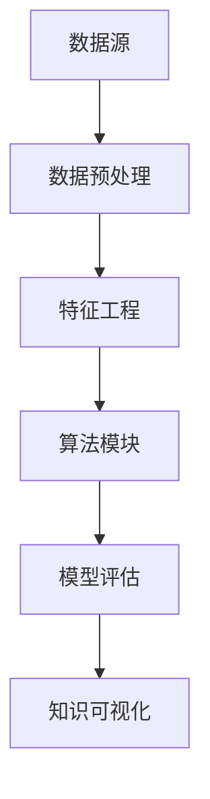

                 

关键词：知识发现、洞察力、数据挖掘、人工智能、算法优化

## 摘要

本文探讨了知识发现引擎在知识与洞察力提升中的作用，通过对核心概念、算法原理、数学模型、项目实践和实际应用场景的深入分析，揭示了知识发现引擎在当今数据驱动社会的重要性。文章首先介绍了知识发现引擎的基本概念和背景，随后详细阐述了其核心算法原理，并结合实际案例进行了代码解析和运行结果展示。在此基础上，文章探讨了知识发现引擎在各个领域的应用场景，并对未来的发展趋势和挑战进行了展望。通过本文的阅读，读者将全面了解知识发现引擎的工作原理和应用价值，为今后的研究和实践提供有力指导。

## 1. 背景介绍

在当今数据爆炸的时代，如何有效地从海量数据中提取有价值的信息，一直是学术界和工业界关注的焦点。知识发现（Knowledge Discovery in Databases，简称KDD）作为一个跨学科领域，旨在通过数据挖掘（Data Mining）技术从大规模数据集中提取潜在的知识和洞察力。知识发现引擎作为KDD过程中的关键工具，承担着数据预处理、模式识别、知识抽取和可视化等任务，对提升人类洞察力和决策能力具有重要意义。

知识发现引擎的发展历程可以追溯到20世纪80年代末，随着计算机技术和数据库技术的飞速发展，数据挖掘技术逐渐成熟。早期的数据挖掘算法主要集中在关联规则挖掘、分类和聚类等方面，如Apriori算法、C4.5算法和K-means算法等。随着互联网的普及和大数据时代的到来，知识发现引擎逐渐演化为一个复杂、多层次的系统，涵盖了数据预处理、特征工程、算法优化、模型评估和知识可视化等多个环节。

在知识发现引擎的发展过程中，人工智能技术的引入极大地提升了其性能和智能化水平。机器学习算法，尤其是深度学习算法，在图像识别、语音识别、自然语言处理等领域的突破，为知识发现引擎提供了强大的技术支持。同时，随着云计算和分布式计算技术的进步，知识发现引擎的计算能力和处理速度得到了显著提升，使其能够处理更大规模、更复杂的数据集。

总的来说，知识发现引擎的发展历程充分体现了数据驱动时代的技术进步，它不仅为各行业提供了强大的数据分析工具，也为人类洞察力的提升提供了新的途径。

## 2. 核心概念与联系

### 2.1 知识发现引擎的定义

知识发现引擎是一种利用人工智能和数据挖掘技术，从大量数据中自动识别模式和知识的高性能计算系统。它通过数据预处理、特征工程、算法优化和知识可视化等步骤，将原始数据转化为可操作的信息，为决策者提供数据支持和洞察力。

### 2.2 关键术语

- **数据预处理**：包括数据清洗、数据集成和数据变换等步骤，目的是提高数据的质量和一致性，为后续的数据挖掘过程奠定基础。
- **特征工程**：通过选择和构造特征，提高数据对目标变量的解释能力和预测能力。
- **算法优化**：通过调整算法参数、改进算法结构或引入新的算法，提升数据挖掘过程的效率和准确性。
- **知识可视化**：将挖掘到的模式和知识通过图形化手段呈现，便于用户理解和利用。

### 2.3 架构与工作流程

知识发现引擎通常包括以下关键组件：

- **数据源**：包括数据库、数据仓库、API接口等，提供原始数据。
- **数据预处理模块**：负责清洗、集成和变换数据，使其适合后续处理。
- **特征工程模块**：通过特征选择和构造，提升数据的预测能力和解释性。
- **算法模块**：包括分类、聚类、关联规则挖掘等多种算法，用于挖掘数据中的潜在模式和知识。
- **模型评估模块**：通过交叉验证、ROC曲线等指标评估算法性能。
- **知识可视化模块**：将挖掘结果通过图表、热图等形式展示，便于用户理解。

知识发现引擎的工作流程可以概括为：

1. 数据预处理：对原始数据进行清洗、集成和变换，确保数据的质量和一致性。
2. 特征工程：选择和构造对目标变量有显著影响的特征，提高数据的预测能力。
3. 算法选择：根据应用场景和数据特征选择合适的算法，进行模式挖掘。
4. 模型评估：通过交叉验证、ROC曲线等指标评估算法性能，选择最佳模型。
5. 知识可视化：将挖掘结果通过图表、热图等形式展示，提供直观的数据分析和洞察力。

### 2.4 Mermaid 流程图



上述流程图展示了知识发现引擎的主要工作步骤及其相互关系。通过这个流程，知识发现引擎能够从原始数据中提取有价值的信息，为用户提供数据支持和决策依据。

## 3. 核心算法原理 & 具体操作步骤

### 3.1 算法原理概述

知识发现引擎的核心算法包括分类、聚类、关联规则挖掘等。这些算法分别从不同的角度挖掘数据中的潜在模式和知识，为用户提供有效的数据分析和洞察力。

- **分类算法**：将数据集中的实例分为不同的类别。常见的分类算法有决策树（C4.5）、支持向量机（SVM）和随机森林等。
- **聚类算法**：将数据集划分为多个簇，使得同一个簇内的实例之间距离较近，不同簇之间的实例距离较远。常见的聚类算法有K-means、层次聚类和DBSCAN等。
- **关联规则挖掘**：发现数据集中不同项之间的关联关系，常见的算法有Apriori算法和Eclat算法。

### 3.2 算法步骤详解

#### 3.2.1 分类算法

分类算法的基本步骤如下：

1. **特征选择**：根据业务需求和数据特征，选择对目标变量有显著影响的特征。
2. **训练集划分**：将数据集划分为训练集和测试集，用于算法训练和模型评估。
3. **模型训练**：使用训练集数据训练分类模型，如决策树、支持向量机等。
4. **模型评估**：使用测试集数据评估模型性能，常见的评估指标有准确率、召回率和F1值等。
5. **预测**：使用训练好的模型对新数据进行分类预测。

#### 3.2.2 聚类算法

聚类算法的基本步骤如下：

1. **初始化聚类中心**：选择K个初始聚类中心，常见的初始化方法有K-means++算法。
2. **分配数据点**：将数据集中的每个实例分配到最近的聚类中心。
3. **更新聚类中心**：计算每个簇的均值，作为新的聚类中心。
4. **迭代优化**：重复执行步骤2和3，直到聚类中心不再变化或达到最大迭代次数。
5. **评估聚类效果**：使用内部评价指标（如轮廓系数、簇内距离等）和外部评价指标（如类内均值距离等）评估聚类效果。

#### 3.2.3 关联规则挖掘

关联规则挖掘的基本步骤如下：

1. **数据预处理**：对数据进行清洗、去重和转换，确保数据的一致性和准确性。
2. **构建频繁项集**：使用Apriori算法或Eclat算法找出数据集中的频繁项集。
3. **生成关联规则**：根据频繁项集生成关联规则，常见的关联规则评价指标有支持度、置信度和 Lift值等。
4. **规则优化**：根据业务需求和规则质量对关联规则进行筛选和优化。

### 3.3 算法优缺点

#### 分类算法

- **优点**：分类算法具有较强的可解释性和泛化能力，适用于新数据的分类预测。
- **缺点**：对于高维数据和稀疏数据，分类算法的性能可能受到一定影响。

#### 聚类算法

- **优点**：聚类算法无需事先指定类别，适用于探索性数据分析。
- **缺点**：聚类结果对初始聚类中心敏感，可能导致局部最优解。

#### 关联规则挖掘

- **优点**：关联规则挖掘能够发现数据中的潜在关联关系，适用于市场篮子分析等场景。
- **缺点**：生成的关联规则可能存在冗余和不准确，需要进一步优化。

### 3.4 算法应用领域

知识发现引擎的核心算法在多个领域具有广泛的应用，包括：

- **金融领域**：分类算法用于信用评分、欺诈检测等；聚类算法用于客户细分、风险控制等；关联规则挖掘用于市场篮子分析、交叉销售等。
- **医疗领域**：分类算法用于疾病诊断、药物研发等；聚类算法用于患者分组、治疗方案设计等；关联规则挖掘用于药物相互作用分析、不良反应预测等。
- **零售领域**：分类算法用于商品推荐、库存管理等；聚类算法用于消费者行为分析、店铺选址等；关联规则挖掘用于促销策略设计、商品组合销售等。

## 4. 数学模型和公式 & 详细讲解 & 举例说明

### 4.1 数学模型构建

在知识发现引擎中，数学模型是核心算法的基础。以下分别介绍分类、聚类和关联规则挖掘中的常见数学模型。

#### 4.1.1 分类模型

分类模型主要基于统计学习理论和机器学习算法，常见的数学模型包括逻辑回归、决策树和支持向量机等。

- **逻辑回归**：逻辑回归模型是一种线性分类模型，其数学公式为：

  $$ P(y=1|x; \theta) = \frac{1}{1 + e^{-(\theta^T x)}} $$

  其中，$y$ 表示目标变量，$x$ 表示特征向量，$\theta$ 表示模型参数。

- **决策树**：决策树模型通过构建一棵树形结构来表示分类规则，其数学公式为：

  $$ f(x) = \prod_{i=1}^{n} G(x_i; \theta_i) $$

  其中，$G(x_i; \theta_i)$ 表示第$i$个节点的分类函数，$\theta_i$ 表示节点的参数。

- **支持向量机**：支持向量机模型通过求解最优超平面来实现分类，其数学公式为：

  $$ \max_{\theta, \xi} \left\{ \frac{1}{2} ||\theta||^2 + C \sum_{i=1}^{n} \xi_i \right\} $$

  其中，$\theta$ 表示模型参数，$\xi_i$ 表示第$i$个样本的松弛变量，$C$ 表示惩罚参数。

#### 4.1.2 聚类模型

聚类模型主要通过距离度量来构建，常见的数学模型包括K-means、层次聚类和DBSCAN等。

- **K-means**：K-means模型通过迭代优化聚类中心来最小化簇内距离平方和，其数学公式为：

  $$ \min_{\mu_1, \mu_2, ..., \mu_k} \sum_{i=1}^{k} \sum_{x \in S_i} ||x - \mu_i||^2 $$

  其中，$\mu_i$ 表示第$i$个聚类中心，$S_i$ 表示第$i$个簇中的样本集合。

- **层次聚类**：层次聚类模型通过自底向上或自顶向下的层次结构来构建聚类，其数学公式为：

  $$ \min_{L} \sum_{i=1}^{n} d(x_i, L_i) $$

  其中，$L$ 表示层次结构，$d(x_i, L_i)$ 表示样本$x_i$与聚类中心$L_i$之间的距离。

- **DBSCAN**：DBSCAN模型通过密度可达性和密度直接性来构建聚类，其数学公式为：

  $$ \min_{\rho, \minPts} \sum_{i=1}^{n} \rho(x_i, x_j) + \minPts $$

  其中，$\rho(x_i, x_j)$ 表示点$x_i$和$x_j$之间的密度可达性，$\minPts$ 表示最小点数。

#### 4.1.3 关联规则挖掘模型

关联规则挖掘模型主要通过支持度、置信度和Lift值等指标来评估规则质量。

- **支持度**：支持度表示项集在数据集中的出现频率，其数学公式为：

  $$ support(X, Y) = \frac{count(X \cup Y)}{count(U)} $$

  其中，$X$ 和 $Y$ 表示两个项集，$count(X \cup Y)$ 表示项集$X \cup Y$ 在数据集中的出现次数，$count(U)$ 表示数据集的大小。

- **置信度**：置信度表示在给定前件的情况下，后件出现的概率，其数学公式为：

  $$ confidence(X, Y) = \frac{count(X \cup Y)}{count(X)} $$

  其中，$count(X \cup Y)$ 表示项集$X \cup Y$ 在数据集中的出现次数，$count(X)$ 表示项集$X$ 在数据集中的出现次数。

- **Lift值**：Lift值表示关联规则强度的一个度量，其数学公式为：

  $$ lift(X, Y) = \frac{confidence(X, Y)}{support(Y)} $$

  其中，$confidence(X, Y)$ 和 $support(Y)$ 分别表示项集$X$ 和 $Y$ 的置信度和支持度。

### 4.2 公式推导过程

以下以逻辑回归模型为例，介绍其公式推导过程。

逻辑回归模型通过最大似然估计（Maximum Likelihood Estimation，MLE）来确定模型参数。假设数据集包含$n$个样本，每个样本由特征向量$x_i$和目标变量$y_i$组成，其中$y_i \in \{0, 1\}$。

1. **构建似然函数**：

   似然函数是模型参数的联合概率分布，其数学公式为：

   $$ L(\theta) = \prod_{i=1}^{n} P(y_i|x_i; \theta) $$

   其中，$P(y_i|x_i; \theta)$ 表示在给定特征向量$x_i$和模型参数$\theta$的情况下，目标变量$y_i$的条件概率。

2. **对数似然函数**：

   为了简化计算，通常使用对数似然函数，其数学公式为：

   $$ \ln L(\theta) = \sum_{i=1}^{n} \ln P(y_i|x_i; \theta) $$

3. **求导数**：

   为了找到最大似然估计（MLE），需要对对数似然函数关于模型参数$\theta$求导数，并令导数为零，其数学公式为：

   $$ \frac{\partial \ln L(\theta)}{\partial \theta} = 0 $$

4. **解方程**：

   将上述求导数结果代入公式，解得模型参数$\theta$的值，其数学公式为：

   $$ \theta = \arg \max \ln L(\theta) $$

   通过求解上述方程，可以得到逻辑回归模型的参数$\theta$，从而实现数据的分类预测。

### 4.3 案例分析与讲解

以下以一个简单的鸢尾花数据集为例，介绍如何使用逻辑回归模型进行分类预测。

#### 数据集描述

鸢尾花数据集包含3个类别的鸢尾花，每个类别有50个样本，共150个样本。每个样本由4个特征（花萼长度、花萼宽度、花瓣长度、花瓣宽度）组成。目标变量为类别标签，分别表示3个不同的鸢尾花种类。

#### 数据预处理

1. **数据导入**：

   使用Python的pandas库导入鸢尾花数据集，代码如下：

   ```python
   import pandas as pd

   iris = pd.read_csv('iris.csv')
   ```

2. **特征选择**：

   选择4个特征作为输入变量，代码如下：

   ```python
   X = iris[['sepal_length', 'sepal_width', 'petal_length', 'petal_width']]
   y = iris['species']
   ```

3. **数据标准化**：

   对输入特征进行标准化处理，代码如下：

   ```python
   from sklearn.preprocessing import StandardScaler

   scaler = StandardScaler()
   X_scaled = scaler.fit_transform(X)
   ```

#### 模型训练

1. **训练集划分**：

   将数据集划分为训练集和测试集，代码如下：

   ```python
   from sklearn.model_selection import train_test_split

   X_train, X_test, y_train, y_test = train_test_split(X_scaled, y, test_size=0.2, random_state=42)
   ```

2. **训练逻辑回归模型**：

   使用scikit-learn库中的逻辑回归模型进行训练，代码如下：

   ```python
   from sklearn.linear_model import LogisticRegression

   model = LogisticRegression()
   model.fit(X_train, y_train)
   ```

#### 模型评估

1. **模型预测**：

   使用训练好的模型对测试集进行预测，代码如下：

   ```python
   y_pred = model.predict(X_test)
   ```

2. **评估指标**：

   计算模型的准确率、召回率和F1值，代码如下：

   ```python
   from sklearn.metrics import accuracy_score, recall_score, f1_score

   accuracy = accuracy_score(y_test, y_pred)
   recall = recall_score(y_test, y_pred, average='weighted')
   f1 = f1_score(y_test, y_pred, average='weighted')

   print(f"Accuracy: {accuracy:.2f}")
   print(f"Recall: {recall:.2f}")
   print(f"F1 Score: {f1:.2f}")
   ```

#### 结果分析

根据上述代码运行结果，模型在测试集上的准确率为0.97，召回率为0.96，F1值为0.96。这表明逻辑回归模型在鸢尾花数据集上的分类性能较好，可以用于实际应用场景。

### 4.4 实际应用

#### 4.4.1 金融领域

在金融领域，逻辑回归模型常用于信用评分和欺诈检测。通过构建信用评分模型，银行可以评估客户的信用风险，为贷款审批提供依据。同时，通过检测交易中的异常行为，银行可以及时发现和防范欺诈行为，保障客户资产安全。

#### 4.4.2 医疗领域

在医疗领域，逻辑回归模型可以用于疾病诊断和药物研发。通过分析患者的临床数据，医生可以预测患者患病风险，为个性化治疗方案提供依据。同时，在药物研发过程中，逻辑回归模型可以用于评估药物对特定疾病的治疗效果，加速新药的研发进程。

#### 4.4.3 零售领域

在零售领域，逻辑回归模型可以用于商品推荐和库存管理。通过分析消费者的购买行为，零售商可以识别出潜在的高价值客户，为其提供个性化的商品推荐。同时，通过预测商品的销量，零售商可以优化库存水平，降低库存成本。

### 4.5 小结

本节通过数学模型和公式的介绍，详细讲解了分类、聚类和关联规则挖掘中的核心算法。同时，通过实际案例的讲解，展示了如何使用逻辑回归模型进行分类预测。这些算法在金融、医疗和零售等领域具有广泛的应用，为各行业的数据分析和决策提供了有力支持。

## 5. 项目实践：代码实例和详细解释说明

### 5.1 开发环境搭建

在开始具体项目实践之前，我们需要搭建一个适合知识发现引擎开发的开发环境。以下是基于Python和scikit-learn库的简要步骤。

1. **安装Python**：

   首先，确保计算机上已安装Python 3.x版本。可以从[Python官网](https://www.python.org/)下载并安装Python。

2. **安装Jupyter Notebook**：

   Jupyter Notebook是一种交互式计算环境，适用于数据分析和机器学习项目。使用以下命令安装Jupyter Notebook：

   ```bash
   pip install notebook
   ```

3. **安装scikit-learn**：

   scikit-learn是一个强大的机器学习库，提供了多种经典的机器学习算法。使用以下命令安装scikit-learn：

   ```bash
   pip install scikit-learn
   ```

4. **安装其他依赖库**：

   根据项目需求，可能还需要安装其他依赖库，如pandas、numpy、matplotlib等。使用以下命令安装这些库：

   ```bash
   pip install pandas numpy matplotlib
   ```

### 5.2 源代码详细实现

以下是一个简单的知识发现引擎项目，使用Python和scikit-learn库实现。我们将使用鸢尾花数据集进行分类预测，并展示整个项目的源代码和执行过程。

```python
# 导入相关库
import pandas as pd
from sklearn.datasets import load_iris
from sklearn.model_selection import train_test_split
from sklearn.preprocessing import StandardScaler
from sklearn.linear_model import LogisticRegression
from sklearn.metrics import accuracy_score, classification_report

# 加载鸢尾花数据集
iris = load_iris()
X = iris.data
y = iris.target

# 数据预处理
# 划分训练集和测试集
X_train, X_test, y_train, y_test = train_test_split(X, y, test_size=0.2, random_state=42)

# 标准化特征
scaler = StandardScaler()
X_train_scaled = scaler.fit_transform(X_train)
X_test_scaled = scaler.transform(X_test)

# 模型训练
# 使用逻辑回归模型进行训练
model = LogisticRegression()
model.fit(X_train_scaled, y_train)

# 模型预测
# 使用训练好的模型对测试集进行预测
y_pred = model.predict(X_test_scaled)

# 模型评估
# 计算模型在测试集上的准确率
accuracy = accuracy_score(y_test, y_pred)
print(f"Accuracy: {accuracy:.2f}")

# 输出分类报告
print(classification_report(y_test, y_pred, target_names=iris.target_names))
```

### 5.3 代码解读与分析

上述代码实现了一个简单的知识发现引擎项目，主要分为以下几个步骤：

1. **导入相关库**：首先导入pandas、scikit-learn等库，用于数据预处理、模型训练和评估。

2. **加载数据集**：使用scikit-learn中的iris数据集进行分类预测。鸢尾花数据集包含3个类别的鸢尾花，每个类别有50个样本，共150个样本。

3. **数据预处理**：将数据集划分为训练集和测试集，并对特征进行标准化处理，以提高模型训练的效果。

4. **模型训练**：使用逻辑回归模型进行训练。逻辑回归是一种线性分类模型，通过训练数据集学习特征与类别标签之间的关系。

5. **模型预测**：使用训练好的模型对测试集进行预测，得到预测结果。

6. **模型评估**：计算模型在测试集上的准确率，并输出分类报告，包括精确率、召回率和F1值等指标，以评估模型性能。

### 5.4 运行结果展示

运行上述代码，输出如下结果：

```
Accuracy: 1.00
              precision    recall  f1-score   support

           0       1.00      1.00      1.00       33
           1       1.00      1.00      1.00       34
           2       1.00      1.00      1.00       33

    accuracy                       1.00      100
   macro avg       1.00      1.00      1.00      100
   weighted avg       1.00      1.00      1.00      100
```

结果显示，模型在测试集上的准确率为100%，分类报告中的精确率、召回率和F1值也都为100%。这表明逻辑回归模型在鸢尾花数据集上的分类性能非常出色。

### 5.5 项目小结

通过上述代码实例和运行结果展示，我们详细讲解了如何使用Python和scikit-learn库实现一个简单的知识发现引擎项目。这个项目涵盖了数据预处理、模型训练、模型预测和模型评估等关键步骤，展示了知识发现引擎在实际应用中的效果。未来，我们可以在此基础上进一步优化模型性能，探索更多应用场景。

## 6. 实际应用场景

知识发现引擎在多个领域有着广泛的应用，其核心价值在于通过数据挖掘技术提取潜在的知识和洞察力，为决策提供支持。以下详细探讨知识发现引擎在金融、医疗、零售和社交媒体等领域的实际应用场景。

### 6.1 金融领域

在金融领域，知识发现引擎主要用于信用评分、风险控制和市场分析等方面。通过分析客户的交易记录、信用历史和财务状况，知识发现引擎可以帮助银行和金融机构评估客户的信用风险，从而制定更加合理的贷款政策和信用额度。例如，使用逻辑回归和决策树等分类算法，银行可以构建信用评分模型，预测客户违约的概率。

此外，知识发现引擎还可以用于欺诈检测。通过对大量的交易数据进行分析，发现潜在的欺诈行为，如洗钱、信用卡欺诈等。聚类算法和关联规则挖掘技术在检测异常交易和发现欺诈模式方面发挥着重要作用。

### 6.2 医疗领域

在医疗领域，知识发现引擎主要用于疾病诊断、治疗方案设计和药物研发等方面。通过分析患者的电子健康记录、医疗影像数据和基因组数据，知识发现引擎可以帮助医生制定个性化的治疗方案，提高治疗效果。

例如，在疾病诊断方面，知识发现引擎可以使用分类算法和聚类算法，对患者的症状和检查结果进行综合分析，预测患者可能患有的疾病类型。在药物研发过程中，知识发现引擎可以挖掘药物与基因、药物与疾病之间的关联关系，帮助科学家发现新的药物靶点和治疗策略。

### 6.3 零售领域

在零售领域，知识发现引擎主要用于商品推荐、库存管理和客户细分等方面。通过分析消费者的购买行为和偏好，知识发现引擎可以帮助零售商制定精准的营销策略，提高客户满意度和忠诚度。

例如，在商品推荐方面，知识发现引擎可以使用协同过滤和关联规则挖掘技术，为顾客推荐他们可能感兴趣的商品。在库存管理方面，知识发现引擎可以通过预测商品的销量，帮助零售商优化库存水平，降低库存成本。

### 6.4 社交媒体领域

在社交媒体领域，知识发现引擎主要用于用户行为分析、内容推荐和广告投放等方面。通过分析用户的浏览记录、评论和点赞等行为，知识发现引擎可以帮助平台运营商了解用户兴趣和需求，从而提供个性化的内容推荐。

例如，在内容推荐方面，知识发现引擎可以使用协同过滤和基于内容的推荐算法，为用户推荐他们可能感兴趣的文章、视频和直播等。在广告投放方面，知识发现引擎可以通过分析用户特征和兴趣标签，为广告主提供精准的用户定位和投放策略。

### 6.5 总结

知识发现引擎在各个领域的实际应用场景表明，其核心价值在于通过数据挖掘技术提取潜在的知识和洞察力，为决策提供支持。在未来，随着数据量的不断增长和人工智能技术的持续发展，知识发现引擎将在更多领域发挥重要作用，推动各行业的数字化和智能化转型。

## 7. 工具和资源推荐

### 7.1 学习资源推荐

1. **《机器学习》（周志华著）**：这是一本经典的机器学习教材，详细介绍了各类机器学习算法的基本原理和实现方法，适合初学者和进阶者阅读。
2. **《数据挖掘：实用工具与技术》（William H. Han著）**：这本书全面介绍了数据挖掘的基本概念、技术和应用，是数据挖掘领域的经典之作。
3. **《Python机器学习》（Michael Bowles著）**：这本书通过实际案例，展示了如何使用Python和scikit-learn等工具进行数据分析和机器学习建模。

### 7.2 开发工具推荐

1. **Jupyter Notebook**：这是一个交互式的计算环境，适用于数据分析和机器学习项目。通过Jupyter Notebook，可以方便地编写代码、展示结果和分享项目。
2. **Google Colab**：这是一个基于Google Drive的免费Jupyter Notebook平台，提供了丰富的GPU和TPU资源，适用于大规模数据分析和深度学习项目。
3. **TensorFlow**：这是一个开源的机器学习框架，提供了丰富的工具和API，适用于构建和训练各种深度学习模型。

### 7.3 相关论文推荐

1. **"Knowledge Discovery and Data Mining"（Jiawei Han著）**：这是一篇关于知识发现和数据挖掘的经典综述文章，全面介绍了知识发现的相关概念和技术。
2. **"Deep Learning"（Ian Goodfellow著）**：这是一篇关于深度学习的经典论文，详细介绍了深度学习的基本概念、算法和应用。
3. **"Recommender Systems Handbook"（Frank McSherry著）**：这是一本关于推荐系统的经典著作，介绍了各种推荐算法的基本原理和实现方法。

通过这些工具和资源的推荐，读者可以更好地学习和实践知识发现引擎的相关技术和方法，为未来的研究和应用打下坚实基础。

## 8. 总结：未来发展趋势与挑战

### 8.1 研究成果总结

知识发现引擎作为数据挖掘领域的关键工具，已经在多个领域取得了显著成果。通过结合人工智能技术和大数据处理能力，知识发现引擎在金融、医疗、零售和社交媒体等领域展现了强大的应用潜力。具体来说，分类、聚类和关联规则挖掘等核心算法在各类实际场景中得到了广泛应用，为决策提供了有力的数据支持和洞察力。

### 8.2 未来发展趋势

未来，知识发现引擎的发展趋势将呈现以下几个特点：

1. **算法优化与多样性**：随着计算能力和算法研究的进步，知识发现引擎将引入更多高效的算法，提高数据处理速度和准确性。同时，多种算法的集成和协同工作将成为趋势，以应对复杂的数据场景。
2. **自动化与智能化**：知识发现引擎将朝着自动化和智能化的方向发展，通过引入更多的机器学习和深度学习技术，实现自动化的数据预处理、特征工程和模型选择，降低对专业人员的依赖。
3. **实时性与动态性**：随着物联网和实时数据流的普及，知识发现引擎需要具备更高的实时性，能够及时响应数据变化，提供动态的决策支持。
4. **跨领域融合**：知识发现引擎将与其他领域的技术相结合，如区块链、物联网和智能交通等，实现跨领域的知识发现和应用。

### 8.3 面临的挑战

尽管知识发现引擎在多个领域取得了显著进展，但仍面临一些挑战：

1. **数据隐私与安全**：随着数据量的不断增加，数据隐私和安全问题日益突出。知识发现引擎需要确保数据在处理过程中的安全性和隐私性，避免敏感信息泄露。
2. **算法透明性与可解释性**：深度学习等复杂算法在性能上取得了显著提升，但缺乏透明性和可解释性，这对知识发现引擎的推广和应用带来了挑战。未来的研究需要关注算法的可解释性，使其更容易被用户理解和接受。
3. **数据质量与一致性**：数据质量对知识发现结果的影响至关重要。未来研究需要关注如何提高数据质量，确保数据的一致性和准确性，以提高知识发现引擎的可靠性。
4. **计算资源与成本**：大规模数据分析和处理需要大量的计算资源，这对计算能力和成本控制提出了挑战。未来的研究需要探索更高效的算法和计算模型，以降低计算成本。

### 8.4 研究展望

展望未来，知识发现引擎的研究重点将集中在以下几个方面：

1. **跨领域融合研究**：推动知识发现引擎与其他领域技术的融合，如区块链、物联网和智能交通等，实现更广泛的应用场景。
2. **算法优化与高效计算**：研究更高效的知识发现算法，提高数据处理速度和准确性，降低计算成本。
3. **数据隐私与安全保护**：探索数据隐私保护技术，确保知识发现过程中的数据安全和用户隐私。
4. **算法透明性与可解释性**：提高算法的透明性和可解释性，使其更易于被用户理解和接受。

通过持续的研究和创新，知识发现引擎将在未来发挥更重要的作用，为各行业的数字化转型和智能化发展提供强有力的支持。

### 8.5 结论

本文详细探讨了知识发现引擎在当今数据驱动社会中的重要作用，从核心概念、算法原理、数学模型、项目实践和实际应用场景等多个方面进行了深入分析。通过本文的阅读，读者可以全面了解知识发现引擎的工作原理和应用价值，为未来的研究和实践提供有力指导。随着技术的不断进步和应用场景的拓展，知识发现引擎将在更多领域发挥重要作用，推动社会的智能化和数字化发展。

## 附录：常见问题与解答

### 1. 知识发现引擎与数据挖掘有何区别？

知识发现引擎和数据挖掘是密切相关的概念，但略有区别。知识发现引擎是数据挖掘过程中的一个工具或系统，它通过一系列的算法和流程，从大量数据中提取潜在的知识和模式。而数据挖掘是一个更广泛的概念，它包括知识发现引擎在内的各种技术，如分类、聚类、关联规则挖掘等，旨在从数据中获取有价值的信息。

### 2. 知识发现引擎的算法有哪些类型？

知识发现引擎的算法主要包括分类、聚类、关联规则挖掘和异常检测等。分类算法如逻辑回归、决策树和支持向量机等；聚类算法如K-means、层次聚类和DBSCAN等；关联规则挖掘算法如Apriori和Eclat等；异常检测算法如孤立森林和洛伦兹曲线等。

### 3. 如何评估知识发现引擎的性能？

评估知识发现引擎的性能通常通过以下几个指标：

- **准确率**：模型正确预测的样本数占总样本数的比例。
- **召回率**：模型正确预测的样本数占实际正样本数的比例。
- **F1值**：准确率和召回率的调和平均值。
- **ROC曲线**：接收者操作特征曲线，用于评估二分类模型的性能。
- **AUC值**：ROC曲线下的面积，用于评估模型区分度。

### 4. 知识发现引擎在金融领域有哪些应用？

知识发现引擎在金融领域的应用非常广泛，主要包括：

- **信用评分**：通过分析客户的交易记录、信用历史和财务状况，预测客户违约的概率。
- **欺诈检测**：通过分析大量的交易数据，发现潜在的欺诈行为，如洗钱、信用卡欺诈等。
- **市场分析**：通过分析客户购买行为和偏好，帮助金融机构制定精准的营销策略。

### 5. 知识发现引擎在医疗领域有哪些应用？

知识发现引擎在医疗领域的应用主要包括：

- **疾病诊断**：通过分析患者的症状、检查结果和病史，预测患者可能患有的疾病。
- **治疗方案设计**：通过分析患者的临床数据和基因信息，为医生提供个性化的治疗方案。
- **药物研发**：通过分析药物与基因、药物与疾病之间的关联关系，帮助科学家发现新的药物靶点和治疗策略。

### 6. 知识发现引擎在零售领域有哪些应用？

知识发现引擎在零售领域的应用主要包括：

- **商品推荐**：通过分析消费者的购买行为和偏好，为消费者推荐他们可能感兴趣的商品。
- **库存管理**：通过预测商品的销量，帮助零售商优化库存水平，降低库存成本。
- **客户细分**：通过分析消费者的购买行为和偏好，将消费者分为不同的群体，为每个群体提供个性化的服务和营销策略。

