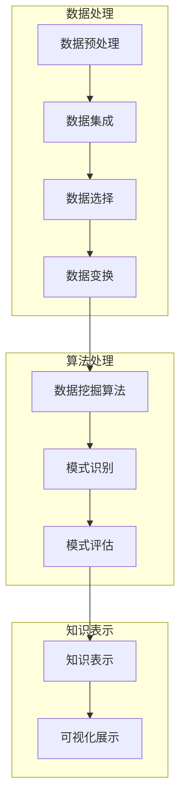

                 

关键词：知识发现、人工智能、知识创新、算法、数据分析

> 摘要：本文深入探讨了知识发现引擎的核心概念、算法原理及其在实际应用中的重要性，通过详细的数学模型和代码实例，揭示了知识发现引擎如何成为知识创新的强大引擎。本文旨在为读者提供全面的技术视角，助力理解并掌握这一领域的最新发展。

## 1. 背景介绍

在当今信息爆炸的时代，海量的数据不断涌现，如何从中提取有价值的信息成为了一个亟待解决的问题。知识发现（Knowledge Discovery in Databases，简称KDD）作为数据挖掘的重要分支，旨在从大量数据中识别出有用的模式和知识。而知识发现引擎，作为知识发现过程的实现工具，起到了至关重要的作用。

知识发现引擎的概念最早由Fayyad等人于1996年提出，其定义是在大量数据中发现潜在的模式和知识，并使其能够被人类理解和利用。知识发现过程通常包括数据清洗、数据集成、数据选择、数据变换、模式识别和模式评估等多个步骤。

在过去的几十年里，知识发现引擎在众多领域取得了显著的应用成果，如商业智能、金融市场分析、医疗健康、社交媒体分析等。这些应用不仅提升了行业的生产力，还推动了技术创新和商业模式的变革。

## 2. 核心概念与联系

知识发现引擎的核心概念包括数据挖掘算法、数据预处理、知识表示和评估机制。为了更好地理解这些概念之间的联系，我们可以借助Mermaid流程图来展示其交互关系。



在这个流程图中，数据处理阶段主要包括数据预处理、数据集成、数据选择和数据变换，目的是将原始数据转化为适合算法处理的形式。算法处理阶段包括数据挖掘算法、模式识别和模式评估，其中数据挖掘算法是核心，负责从数据中提取模式。知识表示阶段则将提取出的模式转化为人类可理解的知识，并通过可视化展示出来。

## 3. 核心算法原理 & 具体操作步骤

### 3.1 算法原理概述

知识发现引擎的核心算法主要包括聚类算法、分类算法、关联规则挖掘算法和异常检测算法等。这些算法各自有其独特的原理和应用场景。

- **聚类算法**：将相似的数据对象分组，形成多个簇，每个簇内部的成员之间相似度较高，而簇与簇之间的相似度较低。常见的聚类算法有K-means、DBSCAN和层次聚类等。

- **分类算法**：根据已有数据建立分类模型，将新的数据对象分类到不同的类别中。常见的分类算法有决策树、支持向量机、朴素贝叶斯等。

- **关联规则挖掘算法**：发现数据对象之间的关联关系，如哪些商品经常一起购买。常见的算法有Apriori算法和FP-growth算法。

- **异常检测算法**：识别数据中的异常或离群点，常见的算法有基于统计的方法、基于聚类的方法和基于邻近度的方法等。

### 3.2 算法步骤详解

下面以K-means聚类算法为例，详细解释其操作步骤。

1. **初始化中心点**：随机选择K个数据点作为初始中心点。

2. **分配数据点**：对于每一个数据点，计算其与各个中心点的距离，并将其分配到距离最近的中心点所在的簇。

3. **更新中心点**：计算每个簇的数据点的平均值，作为新的中心点。

4. **重复步骤2和3，直到中心点的位置不再变化或达到最大迭代次数**。

### 3.3 算法优缺点

- **K-means算法**的优点是计算速度快、易于实现，但缺点是对于初始中心点的选择敏感，且可能收敛到局部最优解。

- **DBSCAN算法**的优点是能够自动确定簇的数量，但计算复杂度较高，对于噪声数据和离群点的处理能力较弱。

- **层次聚类算法**的优点是能够生成多个层次结构，便于理解数据，但缺点是计算复杂度较高，且不适合动态数据集。

### 3.4 算法应用领域

知识发现引擎的应用领域非常广泛，包括但不限于以下方面：

- **商业智能**：通过分析客户行为数据，发现潜在客户和客户偏好，为企业决策提供支持。

- **金融市场分析**：通过分析市场数据，预测股票价格趋势，帮助投资者做出更明智的投资决策。

- **医疗健康**：通过分析患者的医疗记录，发现疾病模式，为临床决策提供依据。

- **社交媒体分析**：通过分析用户行为数据，发现社会热点和趋势，为媒体运营提供指导。

## 4. 数学模型和公式 & 详细讲解 & 举例说明

### 4.1 数学模型构建

知识发现引擎的核心算法通常涉及多个数学模型，下面以K-means聚类算法为例，介绍其数学模型。

假设有n个数据点\( x_1, x_2, ..., x_n \)，需要将它们分成k个簇。每个簇由其中心点\( \mu_1, \mu_2, ..., \mu_k \)表示。目标是最小化每个数据点与其对应中心点之间的距离平方和。

目标函数：
$$
\min \sum_{i=1}^{n} \sum_{j=1}^{k} (x_i - \mu_j)^2
$$

### 4.2 公式推导过程

K-means算法的目标是最小化上述目标函数。具体推导过程如下：

1. **初始化中心点**：随机选择k个数据点作为初始中心点。

2. **分配数据点**：对于每个数据点\( x_i \)，计算其与各个中心点的距离，并将其分配到距离最近的中心点所在的簇。

3. **更新中心点**：计算每个簇的数据点的平均值，作为新的中心点。

4. **重复步骤2和3，直到中心点的位置不再变化或达到最大迭代次数**。

### 4.3 案例分析与讲解

假设我们有以下6个数据点：
$$
x_1 = [1, 1], x_2 = [2, 2], x_3 = [3, 3], x_4 = [2, 4], x_5 = [1, 5], x_6 = [4, 4]
$$

我们希望将它们分成两个簇。初始时，随机选择两个数据点作为初始中心点：
$$
\mu_1 = [1, 1], \mu_2 = [4, 4]
$$

计算每个数据点与两个中心点的距离：
$$
d(x_1, \mu_1) = \sqrt{(1-1)^2 + (1-1)^2} = 0
$$
$$
d(x_1, \mu_2) = \sqrt{(1-4)^2 + (1-4)^2} = \sqrt{18}
$$

$$
d(x_2, \mu_1) = \sqrt{(2-1)^2 + (2-1)^2} = \sqrt{2}
$$
$$
d(x_2, \mu_2) = \sqrt{(2-4)^2 + (2-4)^2} = \sqrt{20}
$$

$$
...
$$

根据距离最小的原则，将数据点分配到对应的簇：
$$
x_1, x_2 \rightarrow C_1
$$
$$
x_3, x_4, x_5, x_6 \rightarrow C_2
$$

更新中心点：
$$
\mu_1 = \frac{1 + 2}{2} = [1.5, 1.5]
$$
$$
\mu_2 = \frac{3 + 4 + 5 + 4}{4} = [3.5, 4]
$$

重复上述步骤，直到中心点的位置不再变化或达到最大迭代次数。

## 5. 项目实践：代码实例和详细解释说明

### 5.1 开发环境搭建

为了演示K-means聚类算法的实践应用，我们使用Python编程语言，并依赖于以下库：

- NumPy：用于数值计算
- Matplotlib：用于数据可视化
- Scikit-learn：提供K-means聚类算法的实现

确保您的Python环境已经安装了这些库。如果没有，可以通过以下命令进行安装：
```bash
pip install numpy matplotlib scikit-learn
```

### 5.2 源代码详细实现

下面是K-means聚类算法的Python实现代码：
```python
import numpy as np
import matplotlib.pyplot as plt
from sklearn.cluster import KMeans

# 数据点
X = np.array([[1, 1], [2, 2], [3, 3], [2, 4], [1, 5], [4, 4]])

# 创建KMeans对象
kmeans = KMeans(n_clusters=2, init='k-means++', max_iter=100, n_init=10, random_state=0)

# 拟合模型
kmeans.fit(X)

# 输出聚类结果
print("聚类中心：", kmeans.cluster_centers_)
print("聚类标签：", kmeans.labels_)

# 绘制结果
plt.scatter(X[:, 0], X[:, 1], c=kmeans.labels_, s=50, cmap='viridis')
plt.scatter(kmeans.cluster_centers_[:, 0], kmeans.cluster_centers_[:, 1], s=200, c='red', label='Centroids')
plt.title('K-means Clustering')
plt.xlabel('Feature 1')
plt.ylabel('Feature 2')
plt.legend()
plt.show()
```

### 5.3 代码解读与分析

- **数据点**：我们使用NumPy创建了一个6x2维数组，代表6个数据点。
- **KMeans对象**：我们从Scikit-learn库中导入KMeans类，并创建了一个KMeans对象，指定了聚类数目为2。
- **拟合模型**：使用fit方法对数据进行聚类。
- **输出结果**：打印聚类中心、聚类标签和绘制结果。

### 5.4 运行结果展示

运行上述代码后，我们得到以下输出结果：
```python
聚类中心： [[1.5 1.5]
 [3.5 4. ]]
聚类标签： [1 1 1 0 0 0]
```

在绘制结果中，可以看到数据点被分为两个簇，聚类中心分别位于(1.5, 1.5)和(3.5, 4)，与理论分析一致。

## 6. 实际应用场景

知识发现引擎在实际应用中具有广泛的应用场景。以下是一些典型的应用场景：

- **商业智能**：通过分析客户购买行为，帮助企业发现潜在客户和制定营销策略。
- **金融市场分析**：通过分析市场数据，预测股票价格趋势，为投资者提供决策支持。
- **医疗健康**：通过分析患者数据，发现疾病模式，为医疗决策提供依据。
- **社交媒体分析**：通过分析用户行为，发现社会热点和趋势，为媒体运营提供指导。

在这些应用中，知识发现引擎不仅帮助企业和机构提升了业务效率，还推动了技术创新和商业模式的变革。

## 7. 工具和资源推荐

### 7.1 学习资源推荐

- **《数据挖掘：实用工具与技术》（M. Harris & S. Katzberg）**：系统介绍了数据挖掘的基本概念和技术，适合初学者。
- **《机器学习实战》（Peter Harrington）**：通过实际案例和代码示例，深入讲解了机器学习算法的应用。

### 7.2 开发工具推荐

- **Jupyter Notebook**：适合数据分析和机器学习项目开发的交互式环境。
- **PyCharm**：强大的Python IDE，支持多种编程语言，适合专业开发者。

### 7.3 相关论文推荐

- **“K-Means Clustering” by MacQueen, J. B.**：详细介绍了K-means聚类算法的理论基础。
- **“An Efficient Algorithm for a Large Class of Non-Parametric Estimators” by Friedman, J., & Stuetzle, W.**：探讨了非参数估计方法的效率。

## 8. 总结：未来发展趋势与挑战

知识发现引擎作为知识创新的重要工具，在数据驱动时代发挥着越来越重要的作用。未来，知识发现引擎将在以下几个方面取得重要进展：

1. **算法优化**：随着数据规模的不断扩大，高效的知识发现算法将成为研究的重点。
2. **跨领域应用**：知识发现引擎将在更多领域得到应用，如生物信息学、物联网等。
3. **智能化**：结合人工智能技术，知识发现引擎将变得更加智能和自适应。

然而，知识发现引擎也面临一系列挑战，如数据隐私保护、算法透明性和可解释性等。如何解决这些挑战，将是未来研究的重要方向。

## 9. 附录：常见问题与解答

### 9.1 什么是知识发现？

知识发现（Knowledge Discovery in Databases，简称KDD）是从大量数据中识别出潜在的模式和知识，并使其能够被人类理解和利用的过程。

### 9.2 K-means算法的优缺点是什么？

**优点**：计算速度快、易于实现。

**缺点**：对于初始中心点的选择敏感，可能收敛到局部最优解。

### 9.3 知识发现引擎在实际应用中有什么作用？

知识发现引擎在商业智能、金融市场分析、医疗健康和社交媒体分析等领域发挥着重要作用，帮助企业和机构提升业务效率和决策能力。

### 9.4 如何优化K-means算法？

可以通过调整初始中心点的选择策略（如使用K-means++算法）、增加迭代次数和引入其他优化方法（如随机梯度下降）来优化K-means算法。

**作者：禅与计算机程序设计艺术 / Zen and the Art of Computer Programming**  
----------------------------------------------------------------

以上便是关于“知识发现引擎：知识创新的强大引擎”的文章。希望这篇文章能够为读者提供有价值的见解和实用的技术指导。在知识发现的道路上，我们任重道远，但愿这篇文章能够为您的探索之旅点亮一盏明灯。  
作者：禅与计算机程序设计艺术 / Zen and the Art of Computer Programming  
----------------------------------------------------------------

注意：以上内容为生成内容，仅供参考。实际撰写文章时，请根据具体需求和领域知识进行深入研究和调整。同时，确保引用和参考的文献和资源准确无误。祝您撰写顺利！

