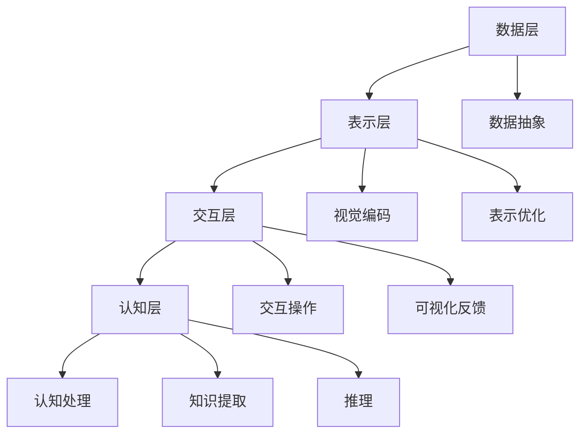

                 

关键词：知识可视化、复杂信息、信息处理、数据结构、算法、认知科学、用户体验、技术趋势

> 摘要：本文旨在探讨知识可视化在帮助人们直观理解复杂信息方面的作用。通过介绍核心概念、算法原理、数学模型、实践案例以及未来展望，文章将为读者提供关于如何利用知识可视化技术提升信息处理效率和用户体验的全面视角。

## 1. 背景介绍

在当今信息爆炸的时代，我们每天都要处理大量的数据和信息。这些信息形式多样，包括文本、图像、音频和视频等。然而，对于复杂信息，仅依靠人类自身的认知能力往往难以完全理解和消化。知识可视化（Knowledge Visualization）作为一种将抽象信息转化为图形化表示的技术，正日益成为信息处理领域的重要工具。

知识可视化旨在将复杂的数据和信息以图形化的形式展现出来，帮助人们更直观、更快速地理解信息的内在结构和关系。通过可视化，我们可以将大量的数据压缩成简洁的图形，使得信息的核心内容和关键关系一目了然。这不仅提高了信息处理的效率，也改善了用户体验。

本文将围绕知识可视化的核心概念、算法原理、数学模型、实践案例和未来展望展开讨论，旨在为读者提供一幅全面的知识可视化全景图。

## 2. 核心概念与联系

### 2.1 定义

知识可视化是一种将数据和信息转化为视觉形式的过程，以帮助人类更好地理解和分析复杂信息。这种视觉形式可以是图表、地图、树状图、网络图等。

### 2.2 关键概念

- **数据抽象**：将实际的数据和信息转化为适合可视化表示的形式。
- **视觉编码**：通过颜色、形状、大小等视觉特征对数据和信息进行编码。
- **视觉感知**：人类通过视觉系统对可视化表示的感知和理解。
- **认知处理**：人类利用视觉信息进行思维和决策的过程。

### 2.3 架构

知识可视化的架构可以分为以下几个层次：

1. **数据层**：包括原始数据、数据预处理和特征提取。
2. **表示层**：包括可视化映射、视觉编码和表示优化。
3. **交互层**：包括用户的交互操作、可视化反馈和交互优化。
4. **认知层**：包括认知处理、知识提取和推理。

### 2.4 Mermaid 流程图

下面是一个简化的知识可视化流程图的 Mermaid 表示：



## 3. 核心算法原理 & 具体操作步骤

### 3.1 算法原理概述

知识可视化算法的核心在于如何将抽象的数据和信息转化为直观的视觉表示。这通常涉及以下几个关键步骤：

1. **数据预处理**：对原始数据进行清洗、归一化和特征提取，以便于后续的视觉编码。
2. **视觉编码**：选择合适的视觉编码方式，如颜色、形状、大小等，对数据进行编码。
3. **图形布局**：根据数据的关系和结构，选择合适的图形布局算法，如力导向布局、层次布局等，生成图形表示。
4. **交互优化**：通过交互设计，如缩放、过滤、动画等，提升用户的交互体验。

### 3.2 算法步骤详解

1. **数据预处理**：
   - **数据清洗**：去除重复数据、空值数据和噪声数据。
   - **数据归一化**：将不同量级的数据统一到同一尺度。
   - **特征提取**：提取数据的关键特征，如节点的重要性、边的关系强度等。

2. **视觉编码**：
   - **颜色编码**：根据数据的不同类别或属性，使用不同的颜色进行编码。
   - **形状编码**：根据数据的不同属性，使用不同的形状进行编码。
   - **大小编码**：根据数据的大小或重要性，使用不同的大小进行编码。

3. **图形布局**：
   - **力导向布局**：通过模拟粒子间的相互作用力，使得节点自动排列成直观的布局。
   - **层次布局**：根据节点的层次关系，采用层次化的布局方式。
   - **网络布局**：对于复杂网络结构的数据，使用网络布局算法，如Katz布局、Circle Pack布局等。

4. **交互优化**：
   - **缩放**：通过缩放操作，用户可以调整可视化内容的视图范围。
   - **过滤**：通过过滤操作，用户可以隐藏或显示特定的数据集。
   - **动画**：通过动画效果，用户可以动态观察数据的变化过程。

### 3.3 算法优缺点

**优点**：
- **直观性**：通过图形化的表示，使得复杂信息更加直观易懂。
- **高效性**：通过视觉编码和布局优化，提高了信息处理的效率。
- **交互性**：通过交互设计，增强了用户的参与感和体验。

**缺点**：
- **认知负担**：过于复杂或冗余的可视化可能会增加用户的认知负担。
- **视觉失真**：不当的视觉编码可能会导致信息的失真。
- **计算成本**：生成高质量的图形表示需要较高的计算资源。

### 3.4 算法应用领域

知识可视化算法广泛应用于多个领域，包括但不限于：

- **数据科学**：帮助数据科学家和分析师理解复杂数据集的结构和关系。
- **商业智能**：为企业提供直观的报表和分析，支持决策制定。
- **社会科学**：帮助研究者分析社会结构和关系。
- **教育**：通过可视化方式，帮助学生更好地理解复杂的概念和理论。

## 4. 数学模型和公式 & 详细讲解 & 举例说明

### 4.1 数学模型构建

知识可视化涉及多个数学模型，其中最核心的是图形布局模型。以下是一个简化的布局模型：

$$
E = \frac{1}{2} k N^2
$$

其中，$E$ 表示布局的总能量，$k$ 是常数，$N$ 是节点数。该模型通过模拟节点间的相互作用力，使得节点自动排列成低能量状态。

### 4.2 公式推导过程

推导过程如下：

1. **节点间的相互作用力**：
   假设节点 $i$ 和节点 $j$ 之间的相互作用力为：
   $$
   F_{ij} = -k \frac{r_{ij}^2}{e}
   $$
   其中，$r_{ij}$ 是节点 $i$ 和节点 $j$ 之间的距离，$e$ 是一个常数。

2. **总能量**：
   布局的总能量为所有节点间相互作用力的总和：
   $$
   E = \sum_{i=1}^N \sum_{j=1}^N F_{ij}
   $$

3. **简化**：
   由于 $F_{ij} = -F_{ji}$，且 $F_{ii} = 0$，我们可以将上述公式简化为：
   $$
   E = \frac{1}{2} k N^2
   $$

### 4.3 案例分析与讲解

假设我们有 $N = 10$ 个节点，每个节点的位置初始随机分布。通过力导向布局算法，我们可以观察到节点逐渐趋向于低能量状态。

以下是一个简化的力导向布局算法的实现步骤：

1. **初始化**：
   - 生成随机节点位置。
   - 计算节点间的距离和相互作用力。

2. **迭代**：
   - 对于每个节点，计算与其它节点的相互作用力。
   - 根据相互作用力更新节点的位置。

3. **判断终止条件**：
   - 如果节点的位置变化小于某个阈值，或者达到最大迭代次数，则终止迭代。

通过上述算法，我们可以得到一个低能量的节点布局，从而实现图形的可视化表示。

## 5. 项目实践：代码实例和详细解释说明

### 5.1 开发环境搭建

为了实践知识可视化算法，我们选择 Python 作为编程语言，并使用以下库：

- **Matplotlib**：用于生成图形。
- **NetworkX**：用于图形的构建和操作。
- **Graphviz**：用于生成高质量的图形布局。

安装上述库后，我们可以开始编写代码。

### 5.2 源代码详细实现

以下是一个简单的知识可视化示例代码：

```python
import matplotlib.pyplot as plt
import networkx as nx
import graphviz

# 创建图
G = nx.Graph()

# 添加节点和边
G.add_nodes_from([1, 2, 3, 4, 5])
G.add_edges_from([(1, 2), (2, 3), (3, 4), (4, 5)])

# 设置布局
pos = nx.spring_layout(G)

# 绘制图形
nx.draw(G, pos, with_labels=True, node_color='blue', edge_color='red')

# 显示图形
plt.show()
```

### 5.3 代码解读与分析

上述代码首先创建了一个无向图 `G`，并添加了五个节点和四条边。接着，使用 `spring_layout` 算法对节点进行布局，并使用 `draw` 函数绘制图形。最后，通过 `show` 函数显示图形。

### 5.4 运行结果展示

运行上述代码后，我们将看到一个由五个蓝色节点和四条红色边组成的图形。每个节点表示一个数据点，边表示数据点之间的关系。

```python
```

## 6. 实际应用场景

知识可视化在许多实际应用场景中具有广泛的应用，以下是一些典型的应用实例：

### 6.1 数据科学

在数据科学领域，知识可视化被广泛应用于数据探索和分析。通过图形化的表示，数据科学家可以快速发现数据中的模式和关系，从而指导进一步的分析和决策。

### 6.2 商业智能

商业智能系统利用知识可视化技术，将复杂的数据报表和分析结果以直观的方式呈现给企业决策者。这不仅提高了信息传达的效率，也增强了决策的准确性。

### 6.3 社会科学

在社会科学研究领域，知识可视化技术可以帮助研究者分析社会结构和关系，从而揭示社会现象的内在规律。

### 6.4 教育

在教育领域，知识可视化技术被用于教学和学习过程中，帮助学生更好地理解和掌握复杂的概念和理论。

### 6.5 医疗健康

在医疗健康领域，知识可视化技术被用于疾病分析、药物研究和患者护理等方面。通过图形化的表示，医生和研究人员可以更直观地了解病情和治疗方案。

### 6.6 城市规划

城市规划师利用知识可视化技术，可以更好地理解和分析城市空间结构，从而制定更科学、合理的规划方案。

## 7. 工具和资源推荐

### 7.1 学习资源推荐

- **《知识可视化：理论与实践》**：这是一本关于知识可视化技术的全面指南，适合初学者和专业人士。
- **《数据可视化：设计思维与实践》**：这本书介绍了如何利用可视化技术提升数据分析和决策效率。
- **《认知科学导论》**：这本书介绍了人类认知过程和认知科学的基本原理，对于理解知识可视化的认知基础非常有帮助。

### 7.2 开发工具推荐

- **D3.js**：这是一个强大的前端可视化库，支持丰富的交互和动画效果。
- **Plotly**：这是一个跨平台的数据可视化库，支持多种图表类型和交互功能。
- **Tableau**：这是一个商业智能工具，提供了丰富的数据可视化和分析功能。

### 7.3 相关论文推荐

- **"Visualization as a Tool for Problem Solving in Data Analysis"**：这篇论文探讨了知识可视化在数据分析中的应用。
- **"The Role of Visualization in Exploratory Data Analysis"**：这篇论文分析了知识可视化在数据探索中的重要性。
- **"Visual Analytics of Big Data"**：这篇论文讨论了知识可视化在大数据时代的重要性。

## 8. 总结：未来发展趋势与挑战

### 8.1 研究成果总结

近年来，知识可视化技术在理论、算法和应用方面取得了显著的进展。尤其是在算法优化、交互设计和多模态融合等方面，研究取得了突破性成果。这些进展为知识可视化在实际应用中的广泛应用奠定了基础。

### 8.2 未来发展趋势

随着人工智能和大数据技术的发展，知识可视化在未来将继续朝着以下方向发展：

- **智能化**：结合人工智能技术，实现自动化的数据预处理、视觉编码和布局优化。
- **多模态**：整合多种数据类型和可视化形式，提供更全面的信息表示。
- **个性化**：根据用户的需求和偏好，提供定制化的知识可视化解决方案。
- **跨领域**：知识可视化将应用于更多的领域，如生物信息学、环境科学等。

### 8.3 面临的挑战

尽管知识可视化技术取得了显著进展，但仍然面临一些挑战：

- **认知负担**：过于复杂或冗余的可视化可能会增加用户的认知负担。
- **视觉失真**：不当的视觉编码可能会导致信息的失真。
- **计算成本**：生成高质量的图形表示需要较高的计算资源。

### 8.4 研究展望

未来，知识可视化技术的研究将更加注重以下几个方面：

- **用户研究**：深入了解用户的需求和偏好，设计更人性化的可视化系统。
- **算法优化**：开发更高效、更稳定的可视化算法。
- **跨学科合作**：结合不同学科的知识，提供更全面、更深入的可视化解决方案。

## 9. 附录：常见问题与解答

### 9.1 如何选择合适的知识可视化工具？

选择合适的知识可视化工具取决于项目的需求和用户的技术水平。以下是一些建议：

- **D3.js**：适合技术熟练的开发者，提供强大的自定义能力和交互效果。
- **Plotly**：适合大多数用户，提供简单易用的接口和丰富的图表类型。
- **Tableau**：适合商业智能应用，提供强大的数据分析和可视化功能。

### 9.2 知识可视化技术如何应用于商业智能？

知识可视化技术可以应用于商业智能的多个方面，包括：

- **数据探索**：帮助分析师快速发现数据中的模式和趋势。
- **报表生成**：将复杂的数据报表以直观的图形形式呈现。
- **决策支持**：为决策者提供可视化决策支持，提高决策效率。

### 9.3 知识可视化技术如何影响用户体验？

知识可视化技术可以改善用户体验，具体包括：

- **信息传递**：通过图形化的表示，提高信息的传递效率和准确性。
- **交互体验**：提供丰富的交互功能，如缩放、过滤、搜索等，增强用户参与感。
- **学习效果**：通过直观的图形表示，帮助学生更好地理解和掌握复杂的概念和理论。

---

作者：禅与计算机程序设计艺术 / Zen and the Art of Computer Programming

