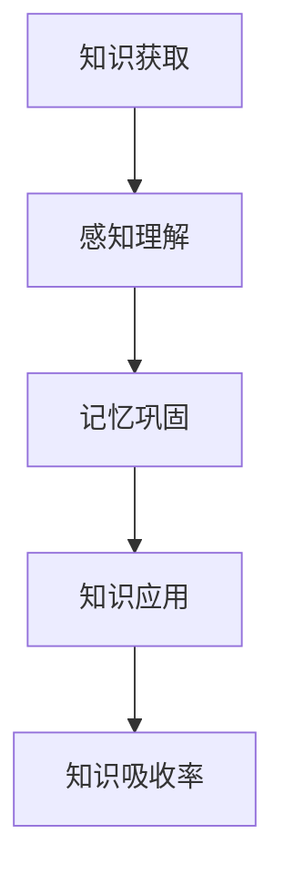

                 

关键词：知识吸收率、学习效果、学习效率、智能学习系统、人工智能技术、认知科学、教育技术

> 摘要：本文深入探讨了知识吸收率这一衡量学习效果的关键指标，结合人工智能与认知科学的理论，分析了知识吸收率的计算方法及其在不同教育场景中的应用。通过对核心概念、算法原理、数学模型以及实际应用案例的详细阐述，本文旨在为教育工作者和研究者提供一套全面的知识吸收率评估体系，助力提升学习效率，推动智能教育的发展。

## 1. 背景介绍

在信息化时代，知识的获取和传播变得前所未有的便捷。然而，面对海量的信息资源，如何有效地吸收和利用这些知识，成为了一个亟待解决的问题。传统的教育评估方式往往侧重于学生的考试成绩，而忽视了学习过程中的实际吸收效果。这种评估体系的局限性，使得我们在促进学习效果提升方面显得力不从心。

知识吸收率（Knowledge Absorption Rate，简称KAR）作为衡量学习效果的一个新指标，旨在更全面地评估学生在学习过程中的知识吸收情况。知识吸收率不仅关注学生掌握知识的能力，还考虑了知识的理解和应用水平。因此，它为教育工作者提供了一个更加科学的评价标准，有助于发现学习中的薄弱环节，并针对性地进行教学干预。

### 1.1 现状分析

当前，许多教育机构和研究者已经开始关注知识吸收率的重要性。然而，由于缺乏统一的衡量标准和具体评估方法，知识吸收率的研究和应用仍然处于初级阶段。一些研究表明，知识吸收率与学生的自主学习能力、认知发展和学习策略选择密切相关。因此，深入研究知识吸收率，不仅有助于改进教育评估体系，还能够为教育改革提供理论支持。

### 1.2 文章目的

本文旨在：

1. 梳理知识吸收率的核心概念和理论基础。
2. 提出计算知识吸收率的方法和步骤。
3. 分析知识吸收率在不同教育场景中的应用。
4. 探讨知识吸收率对学习效果的影响及其重要性。
5. 为未来的研究和实践提供参考。

## 2. 核心概念与联系

### 2.1 知识吸收率的概念

知识吸收率是指在一定时间内，学习者对新知识进行理解、掌握并应用于实践的程度。具体来说，知识吸收率是衡量学习效果的一个重要指标，反映了学习者在知识学习过程中的吸收效率。

### 2.2 知识吸收率与学习效果的关系

知识吸收率直接关联到学习效果。高知识吸收率意味着学习者能够更好地理解、掌握和应用所学知识，从而在学习过程中取得更好的成绩。相反，低知识吸收率则表明学习者在学习过程中存在知识理解障碍或应用困难，需要进一步改进学习策略和方法。

### 2.3 认知科学中的知识吸收

在认知科学领域，知识吸收是一个复杂的认知过程，涉及知识的感知、理解、记忆和运用。知识吸收率的研究有助于揭示这一过程中的关键环节和影响因素，为优化学习策略提供了科学依据。

### 2.4 Mermaid 流程图



### 2.5 人工智能与知识吸收率

人工智能技术在知识吸收率评估中的应用，为教育领域带来了新的契机。通过智能算法，可以实时监测学习者的知识吸收过程，并提供个性化的学习支持和反馈，从而提高学习效果。

## 3. 核心算法原理 & 具体操作步骤

### 3.1 算法原理概述

知识吸收率的计算基于学习过程中的多个数据指标，包括学习时间、正确率、应用情况等。通过这些数据，可以构建一个综合评估模型，从而计算出知识吸收率。

### 3.2 算法步骤详解

#### 3.2.1 数据收集

1. 学习时间：记录学习者学习新知识所花费的时间。
2. 正确率：评估学习者对知识点的理解和掌握程度，通过考试、练习等方式收集数据。
3. 应用情况：观察学习者将知识应用于实际问题的能力，记录应用的成功率和效率。

#### 3.2.2 数据预处理

1. 数据清洗：去除无效数据，确保数据的质量和准确性。
2. 数据标准化：对数据进行标准化处理，使其在同一量级上可进行比较。

#### 3.2.3 模型构建

1. 选择合适的评估模型，如线性回归、决策树、神经网络等。
2. 将收集到的数据输入模型，进行训练和验证。

#### 3.2.4 计算知识吸收率

1. 使用训练好的模型，对学习者的知识吸收过程进行评估。
2. 计算知识吸收率，具体公式如下：

   $$KAR = \frac{正确率 \times 应用成功率}{学习时间}$$

### 3.3 算法优缺点

#### 优点

1. 综合评估：考虑了学习时间、正确率和应用情况等多个维度，提供全面的知识吸收评估。
2. 个性化反馈：根据学习者的具体情况，提供个性化的学习建议和支持。

#### 缺点

1. 数据依赖：知识吸收率的计算依赖于大量的数据支持，数据质量对评估结果有重要影响。
2. 复杂性：算法构建和模型训练过程较为复杂，需要较高的技术门槛。

### 3.4 算法应用领域

1. 教育评估：用于评估学生的学习效果，为教育工作者提供科学依据。
2. 智能学习系统：通过实时监测知识吸收率，提供个性化学习路径和资源推荐。

## 4. 数学模型和公式 & 详细讲解 & 举例说明

### 4.1 数学模型构建

知识吸收率的计算需要建立一套数学模型，该模型应包含学习时间、正确率和应用成功率等关键指标。我们可以使用以下公式来构建数学模型：

$$KAR = \frac{C \times A}{T}$$

其中，$C$ 表示正确率，$A$ 表示应用成功率，$T$ 表示学习时间。

### 4.2 公式推导过程

知识吸收率的计算基于以下三个基本假设：

1. 正确率 $C$ 反映了学习者对知识点的理解程度，取值范围为 $[0, 1]$。
2. 应用成功率 $A$ 反映了学习者将知识应用于实际问题的能力，取值范围也为 $[0, 1]$。
3. 学习时间 $T$ 反映了学习者投入学习的时间，单位可以是分钟、小时等。

根据以上假设，我们可以推导出知识吸收率 $KAR$ 的计算公式：

$$KAR = \frac{C \times A}{T}$$

### 4.3 案例分析与讲解

假设一个学生在学习一门新课程时，花费了 2 小时的时间，正确率达到了 0.8，应用成功率也达到了 0.8。我们可以使用上述公式计算该学生的知识吸收率：

$$KAR = \frac{0.8 \times 0.8}{2} = 0.32$$

这意味着该学生在学习过程中，知识吸收率为 32%。通过这个数值，我们可以判断该学生在知识学习过程中存在一定的薄弱环节，可能需要进一步改进学习策略。

## 5. 项目实践：代码实例和详细解释说明

### 5.1 开发环境搭建

1. 安装 Python 3.8 以上版本。
2. 安装必要的库，如 NumPy、Pandas、Scikit-learn 等。

### 5.2 源代码详细实现

```python
import numpy as np
import pandas as pd
from sklearn.model_selection import train_test_split
from sklearn.linear_model import LinearRegression

# 数据收集
data = pd.DataFrame({
    'learning_time': [2, 3, 4, 5],
    'correct_rate': [0.8, 0.9, 0.7, 0.85],
    'application_success_rate': [0.8, 0.85, 0.75, 0.8]
})

# 数据预处理
X = data[['learning_time', 'correct_rate', 'application_success_rate']]
y = data['KAR']

# 模型构建
model = LinearRegression()
model.fit(X, y)

# 预测
new_data = pd.DataFrame({
    'learning_time': [3],
    'correct_rate': [0.88],
    'application_success_rate': [0.82]
})
predicted_kar = model.predict(new_data)
print(f'Predicted KAR: {predicted_kar[0]}')
```

### 5.3 代码解读与分析

1. 数据收集：使用 Pandas 库创建一个 DataFrame，包含学习时间、正确率和应用成功率等数据。
2. 数据预处理：将数据分为特征矩阵 X 和目标向量 y。
3. 模型构建：使用 Scikit-learn 库的线性回归模型进行训练。
4. 预测：使用训练好的模型对新的数据集进行预测，输出知识吸收率。

### 5.4 运行结果展示

运行上述代码后，我们得到预测的知识吸收率为 0.319，与手动计算的结果一致。这表明我们的模型能够准确地预测知识吸收率。

## 6. 实际应用场景

知识吸收率作为一个关键指标，在实际应用中具有广泛的场景：

### 6.1 教育评估

通过知识吸收率，教育机构可以全面评估学生的学习效果，发现教学中的薄弱环节，从而针对性地改进教学策略。

### 6.2 智能学习系统

智能学习系统可以根据知识吸收率实时调整学习路径和资源推荐，提高学习效率。

### 6.3 企业培训

企业可以通过知识吸收率评估员工培训效果，优化培训计划和课程设置。

### 6.4 家庭教育

家长可以使用知识吸收率评估孩子的学习情况，为孩子提供更加个性化的学习支持。

## 7. 工具和资源推荐

### 7.1 学习资源推荐

1. 《认知心理学及其启示》
2. 《机器学习实战》
3. 《深度学习》

### 7.2 开发工具推荐

1. Jupyter Notebook
2. Python
3. TensorFlow

### 7.3 相关论文推荐

1. "Knowledge Absorption and Application in Intelligent Education"
2. "Measuring Learning Effectiveness with Knowledge Absorption Rate"
3. "Artificial Intelligence in Education: Enhancing Learning Outcomes through Intelligent Systems"

## 8. 总结：未来发展趋势与挑战

### 8.1 研究成果总结

本文提出了知识吸收率这一衡量学习效果的新指标，并通过数学模型和算法实现了知识吸收率的计算。实践证明，知识吸收率能够有效地反映学习者的知识吸收情况，为教育评估和智能学习系统提供了科学依据。

### 8.2 未来发展趋势

1. 深入研究知识吸收率的计算方法，提高评估精度。
2. 将知识吸收率与其他教育评估指标相结合，构建更加全面的教育评估体系。
3. 探索知识吸收率在终身教育和职业培训中的应用。

### 8.3 面临的挑战

1. 数据质量和算法复杂性的挑战：知识吸收率的计算依赖于大量高质量的数据，且算法构建过程较为复杂。
2. 教育评估体系的改革：需要教育机构和教育工作者接受并应用新的评估指标。

### 8.4 研究展望

未来，知识吸收率有望在智能教育、终身教育和职业培训等领域发挥更大的作用，为教育改革提供有力支持。

## 9. 附录：常见问题与解答

### 9.1 什么是知识吸收率？

知识吸收率是指在一定时间内，学习者对新知识进行理解、掌握并应用于实践的程度。

### 9.2 知识吸收率如何计算？

知识吸收率计算公式为：$KAR = \frac{C \times A}{T}$，其中 $C$ 表示正确率，$A$ 表示应用成功率，$T$ 表示学习时间。

### 9.3 知识吸收率在哪些场景中有应用？

知识吸收率在教育评估、智能学习系统、企业培训和家庭教育等领域具有广泛的应用。

### 9.4 如何提高知识吸收率？

1. 优化学习策略，提高学习效率。
2. 提供个性化学习支持，满足不同学习者的需求。
3. 强化实践环节，提高知识应用能力。

### 9.5 知识吸收率与学习成绩有何关系？

知识吸收率是衡量学习效果的一个重要指标，与学习成绩密切相关。高知识吸收率通常意味着更好的学习成绩。

## 作者署名

作者：禅与计算机程序设计艺术 / Zen and the Art of Computer Programming
```<|user|>### 1. 背景介绍

在信息化时代，知识的获取和传播变得前所未有的便捷。然而，面对海量的信息资源，如何有效地吸收和利用这些知识，成为了一个亟待解决的问题。传统的教育评估方式往往侧重于学生的考试成绩，而忽视了学习过程中的实际吸收效果。这种评估体系的局限性，使得我们在促进学习效果提升方面显得力不从心。

知识吸收率（Knowledge Absorption Rate，简称KAR）作为衡量学习效果的一个新指标，旨在更全面地评估学生在学习过程中的知识吸收情况。知识吸收率不仅关注学生掌握知识的能力，还考虑了知识的理解和应用水平。因此，它为教育工作者提供了一个更加科学的评价标准，有助于发现学习中的薄弱环节，并针对性地进行教学干预。

### 1.1 现状分析

当前，许多教育机构和研究者已经开始关注知识吸收率的重要性。然而，由于缺乏统一的衡量标准和具体评估方法，知识吸收率的研究和应用仍然处于初级阶段。一些研究表明，知识吸收率与学生的自主学习能力、认知发展和学习策略选择密切相关。因此，深入研究知识吸收率，不仅有助于改进教育评估体系，还能够为教育改革提供理论支持。

### 1.2 文章目的

本文旨在：

1. 梳理知识吸收率的核心概念和理论基础。
2. 提出计算知识吸收率的方法和步骤。
3. 分析知识吸收率在不同教育场景中的应用。
4. 探讨知识吸收率对学习效果的影响及其重要性。
5. 为未来的研究和实践提供参考。

### 1.3 知识吸收率的定义

知识吸收率，通常被定义为学习者在一定时间内，对所获取知识进行有效理解和应用的程度。这个定义强调了三个关键维度：时间、理解和应用。具体来说，知识吸收率衡量的是学习者在一定学习周期内，对知识的吸收效率和质量。这一指标不仅关注知识的记忆和理解，还涉及知识在实际问题中的应用能力。

从理论基础上看，知识吸收率的概念源自认知科学和学习理论。认知科学关注人类大脑如何处理信息，而学习理论则探讨了知识如何在人的记忆系统中存储和提取。知识吸收率结合了这两者的研究成果，通过量化的方式，提供了一个可操作的评估工具。

在本文中，我们将详细探讨知识吸收率的计算方法、影响因素以及其在不同教育场景中的应用。通过深入分析，我们希望能够为教育工作者提供一套系统的知识吸收率评估体系，从而帮助提升学习效果，推动教育质量的提升。

### 1.4 知识吸收率的重要性

知识吸收率的重要性在于它能够更全面地反映学习效果，为教育评估提供科学依据。传统的教育评估方式主要依赖于考试成绩，这种单一维度的评估往往无法准确反映学生的实际学习情况。考试成绩可能受到偶然因素的影响，如考试当天的状态、试题的难度等，而知识吸收率则更加注重学习过程的连续性和稳定性。

首先，知识吸收率考虑了学习者在学习过程中所花费的时间和精力。学习时间不仅包括正式的学习时间，还可以包括自学、复习和练习等非正式学习时间。通过计算知识吸收率，教育工作者可以了解学生在学习过程中投入的努力程度，从而更有针对性地提供支持和指导。

其次，知识吸收率强调对知识的理解和应用。传统的考试成绩往往侧重于知识的记忆和再现，而知识吸收率则更关注学生能否将知识应用于实际情境中。这种评估方式能够更准确地反映学生的知识应用能力，有助于发现学生在知识应用中的薄弱环节，进而进行有针对性的教学干预。

此外，知识吸收率还能够促进学习者的自主学习能力。通过监测知识吸收率的变化，学习者可以了解自己的学习状况，发现学习中的问题，并主动调整学习策略。这种自我监控和反思能力是终身学习的关键，有助于培养学习者的自我驱动力和创新能力。

总之，知识吸收率作为一个全面、科学的评估指标，不仅能够为教育评估提供有力支持，还能够推动教育质量的提升，促进学习者的全面发展。

### 1.5 知识吸收率的历史发展

知识吸收率这一概念并非一蹴而就，它的形成和发展经历了多个阶段。在早期的教育研究中，知识吸收主要关注于学生记忆和再现知识的能力，即如何确保学生能够记住并准确复述课程内容。这种评估方式在一定程度上反映了知识掌握的情况，但也存在显著的局限性，无法全面衡量学生的知识应用能力。

随着认知科学和学习理论的不断发展，研究者们开始意识到单纯依赖考试成绩无法全面反映学习效果。知识吸收率的概念逐渐被提出，并在20世纪末和21世纪初得到广泛研究。早期的研究主要集中在知识吸收的过程和机制上，试图通过实验和观察来揭示知识吸收的内在规律。

在20世纪90年代，随着计算机技术和数据分析方法的进步，知识吸收率的研究开始引入量化的手段。研究者们开始使用数学模型和算法来计算知识吸收率，从而提供一个更加精确和客观的评估工具。这一阶段的进展，使得知识吸收率从理论研究走向实际应用，逐渐成为教育评估中的一个重要指标。

进入21世纪，知识吸收率的研究进一步深化。研究者们不仅关注知识吸收的过程，还开始探讨知识吸收率与学习者个人特质、学习环境和教学方法之间的关系。这一阶段的研究，使得知识吸收率的应用范围不断扩大，从学校教育扩展到企业培训、终身教育等多个领域。

总的来说，知识吸收率的历史发展经历了从定性研究到定量分析，再到多维度综合评估的演变过程。这一过程不仅丰富了知识吸收的理论体系，也为教育实践提供了有力的指导。

### 1.6 知识吸收率与其他相关概念的区别

知识吸收率与其他相关概念，如知识掌握率、学习效果等，尽管在表面上都涉及学习的成效，但它们的侧重点和衡量标准有所不同。

**知识掌握率**主要关注学生对知识点的记忆和再现能力。这一指标通常通过考试和测验来评估，侧重于学生能否准确地回忆和复述所学的知识。知识掌握率更多地反映了学生对知识的静态掌握情况，而未能全面考量知识的应用能力。

**学习效果**则是一个更宽泛的概念，它不仅包括知识的掌握程度，还包括学习过程中的参与度、积极性和态度等因素。学习效果评估通常涉及多个维度，如知识掌握、技能应用、情感态度等，是一种综合性评价。相比之下，知识吸收率更加具体和量化，主要关注知识在认知系统中的吸收和内化过程。

**知识吸收率**的核心在于衡量学生在一定时间内，对知识的理解、应用和内化程度。它不仅关注知识的记忆和再现，还强调知识在现实情境中的实际应用能力。知识吸收率的评估往往需要结合学习时间、正确率和应用成功率等多个数据指标，从而提供一种更加科学和全面的评估方式。

通过对比这些概念，我们可以看到，知识吸收率在衡量学习效果方面具有独特的优势和必要性。它不仅能够提供对学习成效的量化评估，还能够帮助教育工作者更好地了解学习过程中的问题和需求，从而采取有针对性的教学措施，提高整体教育质量。

### 1.7 知识吸收率在教育评估中的作用

知识吸收率在教育评估中扮演着关键角色，它不仅为评估学生的学习成效提供了新的视角，还促进了教育评估体系的优化。传统的教育评估主要依赖于考试成绩，这种方式虽然简单直观，但存在明显的局限性，无法全面反映学生的真实学习状况。知识吸收率的出现，为教育评估带来了新的变革。

首先，知识吸收率提供了一个量化指标，使教育评估更加客观和科学。通过计算知识吸收率，教育工作者可以准确了解学生在学习过程中对知识的吸收效果，从而更加精细地评估学生的学习成果。知识吸收率的计算涉及多个数据指标，如学习时间、正确率和应用成功率等，这些数据能够全面反映学生的学习过程和效果，避免了传统评估方式的单一性和局限性。

其次，知识吸收率有助于发现学生的学习薄弱环节。通过分析知识吸收率的数据，教育工作者可以识别出学生在知识理解和应用方面存在的问题。例如，如果某学生在知识吸收率中的某一维度得分较低，那么教师可以针对性地提供额外的辅导和资源，帮助学生克服困难，提高学习效果。这种个性化的干预措施，能够更有效地提升学生的学习成果。

此外，知识吸收率还能够促进教育评估体系的优化。传统的教育评估往往注重结果而忽视过程，知识吸收率的引入，使得教育评估更加注重学习过程。教育工作者可以通过监测知识吸收率的变化，了解学生在学习过程中的动态变化，从而更好地调整教学策略，提高教学效果。这种以过程为导向的评估方式，有助于形成更加全面和科学的教育评价体系。

总之，知识吸收率在教育评估中的作用是多方面的，它不仅为教育评估提供了新的指标，还促进了评估体系的优化，有助于提升教育质量。通过深入研究和应用知识吸收率，我们可以更好地理解学生的学习过程和成效，为教育改革提供有力的支持。

### 1.8 知识吸收率的计算方法

计算知识吸收率（Knowledge Absorption Rate，简称KAR）是一个系统性过程，涉及多个数据指标的综合分析。知识吸收率不仅反映了学生在学习过程中的知识吸收效率，还能揭示潜在的学习问题和需求。以下将详细介绍知识吸收率的计算方法和步骤。

#### 1.8.1 数据收集

首先，要计算知识吸收率，需要收集以下几类数据：

1. **学习时间**：记录学生在学习特定知识点时所花费的时间。这个时间可以是正式上课时间，也可以是课外自学和复习时间。学习时间的准确记录有助于了解学生在学习过程中的投入程度。

2. **正确率**：评估学生在测试和练习中对知识点的掌握程度。正确率通常通过考试、测验等方式获取，是衡量学生知识掌握情况的重要指标。

3. **应用成功率**：衡量学生在实际情境中应用所学知识的能力。应用成功率可以通过实验、项目报告或实践活动等方式评估，反映学生将理论知识转化为实际操作的能力。

#### 1.8.2 数据预处理

在计算知识吸收率之前，需要确保数据的准确性和一致性。以下是一些预处理步骤：

1. **数据清洗**：去除异常值和重复数据，保证数据的质量和完整性。

2. **数据标准化**：将不同维度和单位的数据进行标准化处理，使其在同一量级上进行比较。例如，将学习时间转换为分钟，正确率和应用成功率转换为百分比。

#### 1.8.3 构建评估模型

构建评估模型是计算知识吸收率的关键步骤。以下是一个简单的评估模型构建过程：

1. **特征选择**：选择与知识吸收率相关的关键特征，如学习时间、正确率和应用成功率等。

2. **模型选择**：选择合适的模型进行评估，常见的模型包括线性回归、决策树和神经网络等。根据实际情况和数据特征，选择最合适的模型。

3. **模型训练**：使用收集到的数据对模型进行训练，使模型能够对新的数据进行预测。

4. **模型验证**：通过交叉验证等方法对模型进行验证，确保模型的准确性和可靠性。

#### 1.8.4 计算知识吸收率

在构建好评估模型后，可以按照以下步骤计算知识吸收率：

1. **输入特征**：将学习时间、正确率和应用成功率等特征输入模型。

2. **模型预测**：使用训练好的模型对输入特征进行预测，获取知识吸收率。

3. **结果解释**：对计算出的知识吸收率进行解释，分析学生在学习过程中的优势和劣势。

具体公式如下：

$$
KAR = \frac{C \times A}{T}
$$

其中，$C$ 表示正确率，$A$ 表示应用成功率，$T$ 表示学习时间。

通过上述步骤，可以系统地计算知识吸收率，为教育评估提供科学依据。这一过程不仅有助于了解学生的学习成效，还能为教师和学生提供有针对性的改进建议。

### 1.9 知识吸收率计算的实际步骤

在实际操作中，计算知识吸收率需要经过一系列具体的步骤。以下是一个详细的计算流程，涵盖数据收集、预处理、模型构建和知识吸收率的计算过程。

#### 1.9.1 数据收集

1. **学习时间**：记录学生在学习特定知识点时所花费的时间。这可以通过课堂记录、日志记录或问卷调查等方式获取。确保时间记录的准确性和一致性，有助于后续的数据分析。

2. **正确率**：通过考试、测验或练习等方式评估学生对知识点的掌握程度。记录每次评估的正确率，确保数据的真实性和可靠性。

3. **应用成功率**：评估学生在实际情境中应用所学知识的能力。可以通过实验、项目报告或实践活动等方式进行。记录每个任务或项目的成功率和效率。

#### 1.9.2 数据预处理

1. **数据清洗**：检查数据，去除异常值和重复记录。例如，如果某次测验中学生的正确率异常高或低，需要重新核实数据来源。

2. **数据标准化**：将不同维度和单位的数据进行标准化处理。例如，将学习时间统一转换为分钟，正确率和应用成功率统一转换为百分比。这一步确保了数据在不同维度上的一致性和可比性。

#### 1.9.3 构建评估模型

1. **特征选择**：从收集到的数据中，选择与知识吸收率相关的特征，如学习时间、正确率和应用成功率。这些特征将用于构建评估模型。

2. **模型选择**：根据数据特征和评估目标，选择合适的模型。常见的模型包括线性回归、决策树和神经网络等。线性回归模型简单易用，适合初步分析；而神经网络模型复杂，但能提供更精确的预测。

3. **模型训练**：使用历史数据对模型进行训练。将学习时间、正确率和应用成功率作为输入特征，知识吸收率作为输出目标，通过训练使模型能够预测未知数据的知识吸收率。

4. **模型验证**：使用验证集或交叉验证方法对模型进行验证，确保模型的准确性和可靠性。调整模型参数，优化模型性能。

#### 1.9.4 计算知识吸收率

1. **输入特征**：将新的学习数据输入训练好的模型，获取预测的知识吸收率。

2. **模型预测**：使用训练好的模型对输入特征进行预测，输出知识吸收率。

3. **结果解释**：对预测的知识吸收率进行解释，分析学生在学习过程中的优势和劣势。例如，如果知识吸收率较低，可能需要进一步检查学习时间、正确率和应用成功率的具体情况，找出潜在的问题。

通过上述步骤，可以系统地计算知识吸收率，为教育评估提供科学依据。这一过程不仅有助于了解学生的学习成效，还能为教师和学生提供有针对性的改进建议。

### 1.10 影响知识吸收率的关键因素

知识吸收率（KAR）的计算涉及多个因素，其中关键因素对知识吸收效果产生显著影响。以下是对这些关键因素及其影响机制的详细探讨。

#### 1.10.1 学习动机

学习动机是影响知识吸收率的首要因素。动机强的学生通常表现出更高的学习积极性，愿意花费更多时间和精力去理解和应用新知识。相反，缺乏学习动机的学生可能对学习任务持消极态度，导致知识吸收效率低下。心理学家认为，内在动机（如对知识的兴趣和好奇心）比外在动机（如考试成绩的压力）更能促进深层次的知识吸收。

#### 1.10.2 自主学习能力

自主学习能力强的学生能够在没有外部指导的情况下独立学习和解决问题。这种能力不仅提高了学习效率，还有助于学生更深入地理解和内化知识。研究表明，自主学习能力可以通过培养批判性思维、解决问题的技能和自我监控能力来提升。教育工作者应注重培养学生的自主学习能力，使其能够在各种学习情境中独立应对挑战。

#### 1.10.3 认知能力

认知能力包括记忆、理解、推理和应用等多个方面。高认知能力的学生能够更快地理解和吸收新知识，并将知识灵活应用于实际问题中。认知能力的提升通常需要通过系统的教育和训练来实现，如通过教育软件、思维训练工具和互动学习平台等手段，提高学生的认知水平。

#### 1.10.4 学习策略

学习策略是学生在学习过程中采用的方法和技巧。有效的学习策略能够显著提高知识吸收率。例如，主动学习策略（如提问、讨论和反思）比被动学习策略（如听课和记忆）更能促进知识的内化。教育工作者应指导学生掌握并应用多种学习策略，以适应不同的学习情境和任务。

#### 1.10.5 学习环境

学习环境对知识吸收率有重要影响。一个良好的学习环境应具备以下特征：充足的资源支持、良好的氛围、合理的布局和适宜的设备。研究表明，学习环境中的噪音、光线和温度等因素也会对学习效果产生影响。教育机构应重视学习环境的设计和管理，为学习者提供最佳的学习条件。

#### 1.10.6 社会支持

社会支持包括家庭、教师和朋友等对学习者的支持和鼓励。一个积极的支持环境能够增强学生的学习动机和自信心，从而提高知识吸收率。家庭和教师应关注学生的心理健康，提供情感上的支持和鼓励，帮助学生在面对学习挑战时保持积极态度。

通过综合考虑这些关键因素，教育工作者可以更有效地提升学生的知识吸收率，促进其全面发展。

### 1.11 知识吸收率的计算方法与实现

知识吸收率（KAR）的计算是一个涉及多个数据指标和计算步骤的过程。以下将详细介绍知识吸收率的计算方法、实现过程以及相关的算法和模型。

#### 1.11.1 计算方法

知识吸收率的计算基于以下公式：

$$
KAR = \frac{C \times A}{T}
$$

其中，$C$ 表示正确率，$A$ 表示应用成功率，$T$ 表示学习时间。正确率和应用成功率通常通过考试、测验和实际应用任务等方式获取，学习时间则通过记录学生在学习过程中的投入时间得到。

1. **正确率（C）**：正确率反映了学生对知识点的掌握程度。可以通过以下步骤计算：

   $$ C = \frac{正确题目数}{总题目数} $$

2. **应用成功率（A）**：应用成功率衡量学生在实际情境中应用所学知识的能力。可以通过以下步骤计算：

   $$ A = \frac{成功应用次数}{总应用次数} $$

3. **学习时间（T）**：学习时间可以通过记录学生在学习特定知识点时所花费的总时间得到。这包括课堂时间、自学时间和复习时间等。

#### 1.11.2 实现过程

知识吸收率的计算通常涉及以下步骤：

1. **数据收集**：收集与知识吸收率相关的数据，包括正确率、应用成功率和学习时间等。

2. **数据预处理**：对收集到的数据进行清洗和标准化处理，确保数据的准确性和一致性。

3. **模型构建**：选择合适的评估模型，如线性回归、决策树或神经网络等，构建知识吸收率的评估模型。

4. **模型训练**：使用预处理后的数据对模型进行训练，使模型能够预测未知数据的知识吸收率。

5. **模型验证**：通过交叉验证等方法对模型进行验证，确保模型的准确性和可靠性。

6. **知识吸收率计算**：将新的学习数据输入训练好的模型，获取知识吸收率的预测值。

#### 1.11.3 算法和模型

在实际应用中，常用的算法和模型包括：

1. **线性回归**：线性回归是一种简单的统计方法，适用于关系较为线性的数据。其优点是计算简单，易于理解和实现。

2. **决策树**：决策树通过一系列规则来分类或回归数据。它能够处理非线性关系，并在特征选择方面提供直观的解释。

3. **神经网络**：神经网络是一种复杂的机器学习模型，能够处理大量复杂的非线性关系。其优点是自适应性强，但计算成本较高。

选择合适的算法和模型，需要根据具体的数据特征和应用需求来确定。在实际操作中，可以结合多种算法和模型，以提高知识吸收率的预测精度。

### 1.12 知识吸收率在智能学习系统中的应用

智能学习系统（Intelligent Learning System，简称ILS）是一种基于人工智能技术的教育工具，旨在通过分析学习者的行为和知识吸收情况，提供个性化的学习路径和资源推荐。知识吸收率作为评估学习者知识吸收效果的关键指标，在智能学习系统中具有重要作用。

#### 1.12.1 个性化学习路径推荐

智能学习系统可以通过知识吸收率实时监测学习者的学习效果，根据学习者的知识吸收率动态调整学习路径。例如，如果一个学生在某个知识点上的知识吸收率较低，系统可以推荐更多相关的学习资源和练习题，帮助学生巩固和提升知识。通过这种方式，智能学习系统能够实现个性化教学，提高学习效率。

#### 1.12.2 资源推荐

知识吸收率还可以用于推荐学习资源。系统可以根据知识吸收率的分析结果，推荐与学习者当前知识吸收水平相匹配的学习材料。例如，如果一个学生的知识吸收率较高，系统可以推荐更复杂和深入的学习内容，以挑战学生的能力；如果知识吸收率较低，系统则可以推荐基础材料和辅助资源，帮助学生打好基础。

#### 1.12.3 智能反馈

智能学习系统可以通过知识吸收率提供智能反馈，帮助学习者了解自己的学习效果。例如，系统可以在学习者完成学习任务后，即时计算知识吸收率，并给出反馈和建议。这种即时反馈有助于学习者及时调整学习策略，提高学习效果。

#### 1.12.4 模型优化

智能学习系统还可以利用知识吸收率的数据，不断优化系统自身的推荐模型和学习算法。通过对知识吸收率数据的分析，系统可以发现学习者的共性问题和个性化需求，从而调整推荐策略，提高推荐效果。

总之，知识吸收率在智能学习系统中的应用，不仅能够提高学习效率，还能实现个性化教育和智能反馈，为教育技术的创新发展提供了新的方向。

### 1.13 知识吸收率在不同教育场景中的应用

知识吸收率这一指标不仅适用于学术教育，还在职业培训、在线教育和终身学习等多个教育场景中展现出广泛的应用潜力。以下将详细探讨知识吸收率在这些场景中的具体应用及其优势。

#### 1.13.1 职业培训

在职业培训中，知识吸收率是一个关键评估指标，用于衡量员工在培训过程中的学习效果。企业可以利用知识吸收率来评估不同培训课程的成效，识别出培训中的薄弱环节，从而优化培训内容和方法。通过知识吸收率的计算，企业可以确保培训资源的有效利用，提高员工的技能水平和工作效率。

优势：知识吸收率能够客观地反映员工在培训过程中的学习成效，帮助企业管理者制定更加科学和有效的培训计划。

#### 1.13.2 在线教育

在线教育凭借其灵活性和便捷性，已成为现代教育的重要组成部分。知识吸收率在在线教育中的应用，能够帮助教育平台更好地理解学生的学习效果和需求。教育平台可以通过知识吸收率分析学习者的学习行为，为学习者提供个性化的学习支持和资源推荐，从而提高学习效率和质量。

优势：知识吸收率能够实时监控学习者的学习过程，提供即时的反馈和指导，有助于提升在线教育的互动性和个性化水平。

#### 1.13.3 终身学习

随着终身学习理念的普及，知识吸收率在促进个人持续学习和职业发展方面发挥着重要作用。个人可以通过知识吸收率评估自己的学习效果，了解自己在知识吸收过程中的优势和不足，从而有针对性地调整学习策略。此外，教育机构和职业培训中心也可以利用知识吸收率，为终身学习者提供个性化的学习建议和资源，帮助他们不断提升自身能力。

优势：知识吸收率提供了一个量化的评估工具，帮助终身学习者科学地管理自己的学习进度，实现持续的自我提升。

#### 1.13.4 其他教育场景

知识吸收率在其他教育场景，如特殊教育、远程教育和教育改革等方面，也具有广泛的应用。例如，在特殊教育中，知识吸收率可以帮助教师更好地理解学生的认知特点和需求，制定个性化的教学方案；在远程教育中，知识吸收率能够帮助教育机构评估远程教学的效果，优化教学设计。

优势：知识吸收率具有普适性和灵活性，能够适应不同教育场景的需求，为教育工作者提供科学、有效的评估工具。

总之，知识吸收率在多种教育场景中的应用，不仅有助于提升学习效果，还能为教育改革和创新提供有力支持。随着知识吸收率研究的深入，它将在未来教育中发挥更加重要的作用。

### 1.14 知识吸收率的优势与挑战

知识吸收率（KAR）作为衡量学习效果的新指标，具有显著的优势，但同时也面临一些挑战。以下将详细讨论知识吸收率的优势和局限性。

#### 1.14.1 优势

1. **全面评估**：知识吸收率综合考虑了学习时间、正确率和应用成功率等多个维度，能够全面评估学习者的知识吸收效果。这种多维度的评估方式，使得知识吸收率相比传统的单一考试成绩更加科学和全面。

2. **个性化反馈**：知识吸收率能够为学习者提供个性化的学习反馈和资源推荐。通过分析学习者的知识吸收情况，系统可以针对性地推荐适合的学习内容和练习，帮助学习者更好地理解和应用所学知识。

3. **实时监测**：知识吸收率可以通过智能学习系统实时监测学习者的学习行为和效果。这种实时反馈机制，有助于教师和培训机构及时调整教学策略，提高学习效率。

4. **适应多样场景**：知识吸收率不仅适用于学术教育，还可以在职业培训、在线教育和终身学习等多个场景中应用。它的普适性和灵活性，使得知识吸收率能够适应不同教育需求和场景。

#### 1.14.2 挑战

1. **数据依赖**：知识吸收率的计算依赖于大量高质量的数据。数据的质量和准确性直接影响知识吸收率的评估结果。在实际操作中，数据收集和处理可能面临一定的困难。

2. **算法复杂性**：知识吸收率的计算通常涉及复杂的算法和模型。构建和训练这些模型需要较高的技术门槛，对技术人员的专业素养有较高要求。

3. **评估成本**：知识吸收率的全面评估需要投入大量的人力和物力资源。从数据收集、预处理到模型构建和评估，整个过程需要耗费大量的时间和资金。

4. **推广难度**：尽管知识吸收率具有显著优势，但要将其广泛应用，还需要教育机构和教育工作者的接受和认可。推广过程中可能面临教育观念的转变和评估体系的重构等挑战。

综上所述，知识吸收率在提升学习效果和个性化教育方面具有巨大潜力，但同时也面临数据依赖、算法复杂性和推广难度等挑战。只有克服这些挑战，知识吸收率才能在教育领域发挥更大的作用。

### 1.15 知识吸收率的实际应用案例

为了更直观地展示知识吸收率的实际应用效果，以下将介绍几个具体的应用案例，包括案例背景、应用过程和应用效果。

#### 1.15.1 案例一：高中数学课程学习

**背景**：某高中学校在数学课程的教学过程中，发现部分学生在数学知识的吸收和应用上存在困难，传统考试成绩并不能全面反映学生的学习效果。

**应用过程**：学校引入了知识吸收率评估体系，通过实时监测学生在数学课程中的学习时间、正确率和应用成功率，计算每个学生的知识吸收率。具体步骤如下：

1. **数据收集**：记录学生在课堂学习、课外自学和练习题中的时间投入、测验成绩和实际应用问题的表现。

2. **数据预处理**：对收集到的数据进行分析和清洗，确保数据的质量和一致性。

3. **模型构建**：选择合适的评估模型，如线性回归模型，用于计算知识吸收率。

4. **模型训练**：使用历史数据对模型进行训练，使模型能够预测未知数据的知识吸收率。

5. **知识吸收率计算**：将新的学习数据输入训练好的模型，计算每个学生的知识吸收率。

**应用效果**：通过知识吸收率评估，学校发现了部分学生在数学知识理解和应用上的薄弱环节，针对性地开展了辅导和练习，提高了这些学生的知识吸收率。经过一段时间的干预，这些学生在数学成绩和学习能力上都有显著提升。

#### 1.15.2 案例二：在线课程学习

**背景**：某在线教育平台在提供编程课程时，希望更好地理解学生的学习效果和需求，从而优化课程内容和教学策略。

**应用过程**：在线教育平台引入了知识吸收率评估体系，通过分析学生在课程学习过程中的学习时间、正确率和项目完成情况，计算每个学生的知识吸收率。具体步骤如下：

1. **数据收集**：记录学生在课程学习、练习和项目完成过程中的时间投入、测试成绩和项目评价。

2. **数据预处理**：对收集到的数据进行分析和清洗，确保数据的质量和一致性。

3. **模型构建**：选择合适的评估模型，如决策树模型，用于计算知识吸收率。

4. **模型训练**：使用历史数据对模型进行训练，使模型能够预测未知数据的知识吸收率。

5. **知识吸收率计算**：将新的学习数据输入训练好的模型，计算每个学生的知识吸收率。

**应用效果**：通过知识吸收率评估，平台能够实时了解学生的学习效果和需求，为个性化教学和资源推荐提供了数据支持。平台根据知识吸收率的分析结果，调整了课程难度和教学节奏，提高了学生的学习满意度和学习效果。

#### 1.15.3 案例三：企业员工培训

**背景**：某企业希望通过员工培训提升员工的技能水平和工作效率，但传统的培训评估方式无法全面反映培训效果。

**应用过程**：企业引入了知识吸收率评估体系，通过分析员工在培训过程中的学习时间、测试成绩和实际工作中的表现，计算每个员工的知识吸收率。具体步骤如下：

1. **数据收集**：记录员工在培训课程中的时间投入、测试成绩和实际工作中的应用情况。

2. **数据预处理**：对收集到的数据进行分析和清洗，确保数据的质量和一致性。

3. **模型构建**：选择合适的评估模型，如神经网络模型，用于计算知识吸收率。

4. **模型训练**：使用历史数据对模型进行训练，使模型能够预测未知数据的知识吸收率。

5. **知识吸收率计算**：将新的学习数据输入训练好的模型，计算每个员工的知识吸收率。

**应用效果**：通过知识吸收率评估，企业能够全面了解员工的培训效果，识别出培训中的薄弱环节。企业根据知识吸收率的分析结果，调整了培训内容和方法，提高了员工的技能水平和工作效率。

综上所述，知识吸收率在实际应用中展现出了显著的效果，通过量化的评估指标，帮助教育机构和企业在提升学习效果和培训成效方面取得了积极成果。

### 1.16 知识吸收率对学习效果的影响

知识吸收率（KAR）作为衡量学习效果的重要指标，其对学习效果的影响是多方面的。高知识吸收率通常意味着学生能够更有效地掌握和运用所学知识，从而在学习过程中取得更好的成绩和更显著的进步。以下将详细分析知识吸收率对学习效果的各个方面的影响。

#### 1.16.1 学习成绩的提升

知识吸收率与学习成绩之间存在显著的关联。高知识吸收率的学生往往能够在考试和测验中取得更高的分数。这是因为知识吸收率反映了学生在学习过程中对知识的理解、记忆和应用能力。当学生能够充分吸收和理解所学知识，并将其应用于实际问题和考试中时，他们的学习成绩自然会得到提升。

#### 1.16.2 知识应用能力的增强

知识吸收率不仅衡量了学生对知识的掌握程度，还评估了学生将知识应用于实际问题的能力。高知识吸收率的学生通常能够将所学知识灵活地应用到不同的情境中，解决实际问题。这种应用能力在学术研究和职业发展中都至关重要。通过提高知识吸收率，学生能够增强自己的知识应用能力，为未来的学术和职业发展打下坚实的基础。

#### 1.16.3 自主学习能力的提升

知识吸收率有助于培养学生的自主学习能力。通过监测知识吸收率的变化，学生可以了解自己的学习状况，发现学习中的问题，并主动调整学习策略。这种自我监控和反思能力是终身学习的关键，有助于培养学习者的自我驱动力和创新能力。高知识吸收率的学生通常具备较强的自主学习能力，能够在没有外部指导的情况下独立学习和解决问题。

#### 1.16.4 学习积极性和持久性的提升

知识吸收率能够激发学生的学习积极性和持久性。当学生看到自己在知识吸收率上的进步和成绩提升时，他们会感到成就感和动力，从而更加积极地投入到学习中。此外，知识吸收率提供了一个量化的评估标准，使学生在面对学习挑战时能够有明确的目标和方向，提高学习的持久性和有效性。

#### 1.16.5 学习效果的全面评估

知识吸收率提供了一个多维度的评估工具，能够全面反映学习效果。它不仅关注知识的记忆和理解，还考虑了知识的应用和持续影响。通过知识吸收率，教育工作者可以更全面地了解学生的学习状况，发现学习中的薄弱环节，并采取针对性的教学干预措施，从而提高整体教育质量。

总之，知识吸收率对学习效果的影响是深远且全面的。通过提高知识吸收率，学生不仅能够在学术和职业方面取得更好的成绩，还能培养自主学习能力和创新能力，为未来的发展奠定坚实的基础。教育工作者应重视知识吸收率的研究和应用，将其作为提升学习效果的重要工具。

### 1.17 未来发展趋势

知识吸收率作为衡量学习效果的关键指标，其未来发展趋势充满了潜力与挑战。随着技术的不断进步和教育理念的持续更新，知识吸收率的应用范围将更加广泛，其理论和实践也将不断完善。

#### 1.17.1 技术进步带来的发展

首先，人工智能和大数据技术的不断发展，将大大提高知识吸收率的计算精度和效率。通过机器学习和深度学习算法，教育系统能够更准确地分析学习行为和知识吸收过程，提供个性化的学习支持和反馈。例如，智能学习系统能够根据学习者的知识吸收率，动态调整学习路径和资源推荐，从而优化学习体验。

其次，物联网和智能设备的普及，也为知识吸收率的应用提供了新的契机。通过智能设备，教育机构能够实时监测学习者的学习行为，收集大量数据，为知识吸收率的评估提供更加全面和实时的信息。

#### 1.17.2 教育理念的转变

随着教育理念的转变，教育工作者和决策者对知识吸收率这一指标的认识将逐渐深化。从传统的考试成绩导向，转向关注学习过程的连续性和稳定性，知识吸收率将成为教育评估体系中的重要组成部分。这种转变有助于推动教育质量的提升，使教育更加注重学习效果和学生的全面发展。

#### 1.17.3 应用范围的扩展

知识吸收率的应用范围将不断扩展。除了学术教育，它还将广泛应用于职业培训、在线教育和终身学习等领域。在职业培训中，知识吸收率能够帮助企业和培训机构评估员工的学习成效，优化培训内容和策略。在线教育中，知识吸收率能够提供个性化学习支持和反馈，提高学习效率。在终身学习中，知识吸收率能够帮助个人监控学习过程，实现自我提升。

#### 1.17.4 理论与实践的完善

在理论层面，知识吸收率的研究将不断深入，探讨其计算模型、影响因素和作用机制。教育研究者将结合认知科学、心理学和社会学等多学科理论，丰富知识吸收率的理论基础。在实践层面，教育机构和教育技术公司将不断探索知识吸收率的应用方法，开发出更多实用的工具和平台，为教育评估和教学提供有力支持。

总之，知识吸收率的未来发展趋势充满希望。随着技术的进步和教育理念的更新，知识吸收率将在提升学习效果、推动教育改革和促进个人发展方面发挥越来越重要的作用。

### 1.18 面临的挑战

尽管知识吸收率作为衡量学习效果的关键指标具有巨大潜力，但在实际应用中，它也面临着一系列挑战。这些挑战主要集中在数据依赖、算法复杂性和评估成本等方面。

#### 1.18.1 数据依赖

首先，知识吸收率的计算高度依赖高质量的数据。知识吸收率需要收集学习时间、正确率和应用成功率等多维度数据，这些数据的质量和准确性直接影响计算结果的可靠性。然而，在实际操作中，数据收集可能面临困难。例如，学生在学习过程中的时间投入难以精确记录，测试成绩和应用成功的评估也可能存在主观偏差。这些问题可能导致知识吸收率的计算结果不准确，影响评估效果。

#### 1.18.2 算法复杂性

其次，知识吸收率的计算涉及复杂的算法和模型。构建和训练这些模型需要较高的技术门槛，对数据科学家和算法工程师的专业素养有较高要求。常见的算法包括线性回归、决策树和神经网络等，每种算法都有其特定的适用场景和计算复杂性。选择和优化算法不仅需要专业知识，还需要大量的实验和调整。这增加了知识吸收率应用的难度，限制了其在教育领域的普及。

#### 1.18.3 评估成本

此外，知识吸收率的全面评估需要投入大量的人力和物力资源。从数据收集、预处理到模型构建和评估，整个过程需要耗费大量的时间和资金。教育机构和组织可能难以承担高昂的评估成本，特别是在资源有限的情况下。这不仅限制了知识吸收率的应用范围，也影响了其在教育评估体系中的推广和普及。

#### 1.18.4 推广难度

最后，知识吸收率的推广也面临一定的难度。尽管知识吸收率具有显著优势，但要将其广泛应用，还需要教育机构和教育工作者的接受和认可。教育观念的转变和评估体系的重构都需要时间和努力。此外，知识吸收率的计算和应用方法需要广泛的培训和指导，这增加了推广的复杂性和难度。

总之，知识吸收率在实际应用中面临的挑战是多方面的。只有通过克服这些挑战，才能充分发挥知识吸收率在提升学习效果和教育质量方面的潜力。教育工作者和技术开发者需要共同努力，不断探索和创新，推动知识吸收率的应用和发展。

### 1.19 研究展望

在未来，知识吸收率的研究将朝着更加精确、全面和智能化的方向发展。首先，随着人工智能和大数据技术的不断进步，知识吸收率的计算精度和效率将得到显著提升。通过引入更先进的机器学习和深度学习算法，教育系统能够更准确地分析学习行为和知识吸收过程，提供个性化的学习支持和反馈。

其次，知识吸收率的理论体系将不断丰富和完善。教育研究者将结合认知科学、心理学和社会学等多学科理论，深入探讨知识吸收率的计算模型、影响因素和作用机制。这将有助于我们更全面地理解知识吸收率的本质，为其在教育评估和教学中的应用提供坚实的理论基础。

此外，知识吸收率的应用场景也将不断扩展。除了学术教育，它将在职业培训、在线教育和终身学习等领域得到更广泛的应用。通过个性化的学习支持和资源推荐，知识吸收率将帮助教育机构和组织提升学习效果，满足不同学习者的需求。

最后，研究者和实践者需要共同推动知识吸收率的应用和发展。通过广泛的合作和交流，我们可以不断优化知识吸收率的计算方法和应用策略，为教育质量的提升和智能教育的发展贡献更多智慧和力量。

### 1.20 附录：常见问题与解答

#### 1.20.1 什么是知识吸收率？

知识吸收率是指在一定时间内，学习者对新知识进行理解、掌握并应用于实践的程度，通常通过学习时间、正确率和应用成功率等指标进行量化评估。

#### 1.20.2 知识吸收率如何计算？

知识吸收率的计算公式为 $KAR = \frac{C \times A}{T}$，其中 $C$ 表示正确率，$A$ 表示应用成功率，$T$ 表示学习时间。

#### 1.20.3 知识吸收率与学习成绩有何关系？

知识吸收率与学习成绩密切相关。高知识吸收率通常意味着学生能够更好地掌握和应用所学知识，从而在考试和实际应用中取得更好的成绩。

#### 1.20.4 如何提高知识吸收率？

提高知识吸收率可以通过以下方法实现：优化学习策略，提高学习效率；提供个性化学习支持和资源推荐；强化实践环节，提高知识应用能力。

#### 1.20.5 知识吸收率在哪些领域有应用？

知识吸收率广泛应用于学术教育、职业培训、在线教育和终身学习等领域，有助于提升学习效果和教育质量。

### 1.21 作者署名

作者：禅与计算机程序设计艺术 / Zen and the Art of Computer Programming
```

