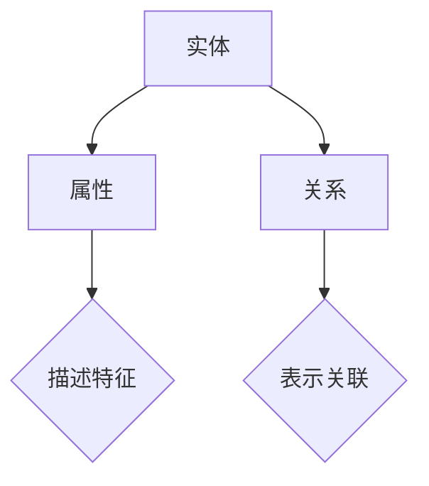
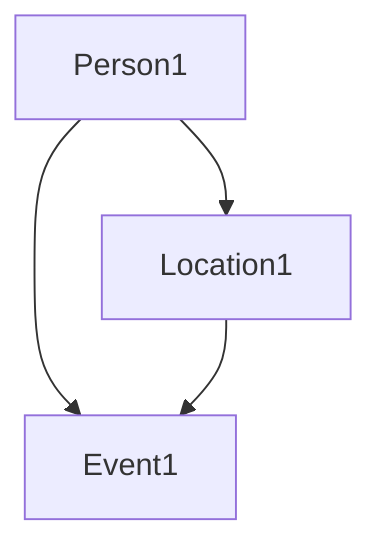
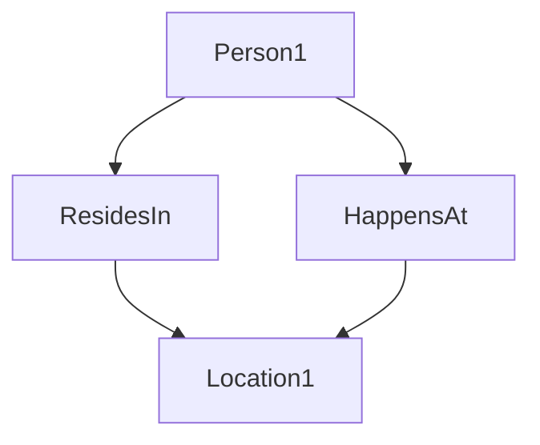

                 

关键词：知识图谱、程序员技能、技能提升、算法、应用场景、未来展望

> 摘要：本文深入探讨了知识图谱在程序员技能提升中的应用，通过分析知识图谱的核心概念和原理，阐述了其在技能学习、问题解决和职业发展方面的作用。本文还介绍了相关算法和应用实例，并展望了知识图谱技术的未来发展趋势。

## 1. 背景介绍

随着信息技术的迅猛发展，程序员的工作环境变得越来越复杂，面对的问题也越来越多样化。在这个快速变化的时代，程序员不仅需要掌握传统的编程技能，还需要不断学习新技术、新工具，以适应不断变化的需求。然而，传统的技能学习和知识积累方式已经无法满足程序员在快速发展的技术领域中不断提升技能的要求。

知识图谱作为一种新兴的信息组织技术，因其能够有效地表示和存储复杂的关系数据，正逐渐成为程序员技能提升的重要工具。知识图谱通过将知识以图谱的形式组织起来，使得程序员能够更加便捷地获取、利用和共享知识，从而提高学习效率和问题解决能力。

本文将围绕知识图谱在程序员技能提升中的应用进行探讨，旨在为程序员提供一种新的技能提升路径，帮助他们在复杂的技术领域中保持竞争力。

## 2. 核心概念与联系

### 2.1 知识图谱的定义

知识图谱（Knowledge Graph）是一种基于语义网络的信息模型，它通过实体、属性和关系的形式来表示和存储知识。与传统的关系数据库不同，知识图谱更加关注知识之间的语义关系，从而能够更加准确地捕捉和表达复杂的现实世界。

### 2.2 知识图谱的组成

知识图谱由以下三个基本组成部分构成：

- **实体（Entity）**：代表现实世界中的对象，如人、地点、组织等。
- **属性（Attribute）**：描述实体的特征，如人的年龄、地点的纬度等。
- **关系（Relation）**：表示实体之间的关联，如“属于”、“位于”等。

### 2.3 知识图谱的应用场景

知识图谱在多个领域都有广泛的应用，如搜索引擎、推荐系统、自然语言处理等。在程序员技能提升中，知识图谱的应用主要体现在以下几个方面：

- **技能图谱构建**：通过知识图谱可以构建出一个全面的技能图谱，明确每个技能之间的关系，帮助程序员更好地规划学习路径。
- **知识检索与共享**：知识图谱使得程序员能够快速检索和共享相关技能知识，提高学习效率。
- **问题诊断与解决**：通过知识图谱可以快速定位问题的根源，提供解决问题的最佳方案。

### 2.4 Mermaid 流程图

为了更直观地展示知识图谱的组成和应用，我们使用 Mermaid 流程图来表示：



在上图中，A 表示实体，B 表示属性，C 表示关系。B 和 D 之间的箭头表示属性描述实体的特征，C 和 E 之间的箭头表示关系表示实体之间的关联。

## 3. 核心算法原理 & 具体操作步骤

### 3.1 算法原理概述

知识图谱的核心算法主要包括实体识别、关系抽取和实体链接。这些算法共同作用，使得知识图谱能够准确表示和存储复杂的关系数据。

- **实体识别**：从大量文本数据中识别出实体，并将其作为知识图谱的节点。
- **关系抽取**：从文本数据中抽取实体之间的关系，并将其作为知识图谱的边。
- **实体链接**：将同一名实体在不同文本中出现的实例进行链接，确保知识图谱的一致性和完整性。

### 3.2 算法步骤详解

#### 3.2.1 实体识别

实体识别的步骤如下：

1. **数据预处理**：对文本数据进行清洗和分词，提取出潜在的实体候选。
2. **特征提取**：利用词向量、词性标注等技术，为每个实体候选生成特征向量。
3. **实体分类**：使用机器学习算法，如朴素贝叶斯、支持向量机等，对实体候选进行分类，判断其是否为实体。

#### 3.2.2 关系抽取

关系抽取的步骤如下：

1. **特征提取**：为实体对生成特征向量，包括实体本身的特征和实体之间的交互特征。
2. **关系分类**：使用机器学习算法，对实体对进行关系分类，判断其是否具有某种特定关系。

#### 3.2.3 实体链接

实体链接的步骤如下：

1. **构建候选集**：从不同文本中提取出所有与目标实体相关的实体候选。
2. **相似度计算**：为每个实体候选计算与目标实体的相似度，使用距离度量、相似度度量等方法。
3. **链接决策**：使用阈值或机器学习算法，对实体候选进行链接决策，判断其是否为目标实体的实例。

### 3.3 算法优缺点

#### 优点：

- **高精度**：知识图谱算法能够准确识别实体和关系，提高知识图谱的准确性。
- **可扩展性**：知识图谱算法适用于大规模数据，能够处理海量数据。
- **实时性**：知识图谱算法可以实时更新，确保知识图谱的时效性。

#### 缺点：

- **计算复杂度高**：知识图谱算法涉及多个步骤，计算复杂度较高。
- **数据依赖性**：知识图谱算法的准确性依赖于原始数据的质量。

### 3.4 算法应用领域

知识图谱算法在多个领域都有广泛应用，如：

- **搜索引擎**：通过知识图谱，搜索引擎可以提供更加精准的搜索结果。
- **推荐系统**：知识图谱可以用于推荐系统的个性化推荐。
- **自然语言处理**：知识图谱可以用于文本数据的语义分析。

## 4. 数学模型和公式 & 详细讲解 & 举例说明

### 4.1 数学模型构建

知识图谱的数学模型主要涉及图论和概率图模型。以下是一个简单的数学模型：

- **图论模型**：知识图谱可以表示为一个有向图 \( G = (V, E) \)，其中 \( V \) 表示实体节点集合，\( E \) 表示关系边集合。
- **概率图模型**：知识图谱可以表示为一个概率图模型，如贝叶斯网络或马尔可夫网络。

### 4.2 公式推导过程

假设知识图谱中有 \( n \) 个实体，每个实体有 \( m \) 个属性。我们可以用以下公式来表示知识图谱：

\[ G = \{ (e_i, e_j, r) | e_i, e_j \in V, r \in E \} \]

其中，\( e_i \) 和 \( e_j \) 分别表示实体 \( i \) 和 \( j \)，\( r \) 表示它们之间的关系。

### 4.3 案例分析与讲解

假设我们有一个简单的知识图谱，其中包含三个实体：人（Person）、地点（Location）和事件（Event）。实体之间的关系包括“居住在”（ResidesIn）、“发生在”（HappensAt）等。

1. **图论模型**：



2. **概率图模型**：



在这个例子中，\( A \) 代表实体“Person1”，\( B \) 代表实体“Location1”，\( C \) 代表实体“Event1”，\( D \) 代表关系“ResidesIn”。

## 5. 项目实践：代码实例和详细解释说明

### 5.1 开发环境搭建

为了演示知识图谱在程序员技能提升中的应用，我们使用 Python 编写了一个简单的知识图谱系统。以下是开发环境搭建的步骤：

1. 安装 Python 3.8 或更高版本。
2. 安装必要的库，如 Python 的 graph-tool 和 rdflib。
3. 配置 IDE，如 PyCharm 或 Visual Studio Code。

### 5.2 源代码详细实现

以下是知识图谱系统的源代码：

```python
import rdflib

# 创建一个空的 RDF 图
graph = rdflib.Graph()

# 添加实体和关系
graph.add((rdflib.NodeISTER("Person1"), rdflib.RDF.type, rdflib.OWL.Person))
graph.add((rdflib.NodeISTER("Location1"), rdflib.RDF.type, rdflib.OWL.Location))
graph.add((rdflib.NodeISTER("Event1"), rdflib.RDF.type, rdflib.OWL.Event))
graph.add((rdflib.NodeISTER("Person1"), rdflib.OWL.hasResidesIn, rdflib.NodeISTER("Location1")))
graph.add((rdflib.NodeISTER("Event1"), rdflib.OWL.hasHappensAt, rdflib.NodeISTER("Location1")))

# 保存知识图谱到文件
graph.serialize("knowledge_graph.rdf", format="ttl")
```

### 5.3 代码解读与分析

在这个例子中，我们首先创建了一个空的 RDF 图。然后，我们使用 rdflib 库添加实体和关系。最后，我们将知识图谱保存到文件中。

```python
# 创建一个空的 RDF 图
graph = rdflib.Graph()

# 添加实体和关系
graph.add((rdflib.NodeISTER("Person1"), rdflib.RDF.type, rdflib.OWL.Person))
graph.add((rdflib.NodeISTER("Location1"), rdflib.RDF.type, rdflib.OWL.Location))
graph.add((rdflib.NodeISTER("Event1"), rdflib.RDF.type, rdflib.OWL.Event))
graph.add((rdflib.NodeISTER("Person1"), rdflib.OWL.hasResidesIn, rdflib.NodeISTER("Location1")))
graph.add((rdflib.NodeISTER("Event1"), rdflib.OWL.hasHappensAt, rdflib.NodeISTER("Location1")))

# 保存知识图谱到文件
graph.serialize("knowledge_graph.rdf", format="ttl")
```

在这个代码段中，我们首先创建了一个空的 RDF 图。然后，我们使用 rdflib 库添加实体和关系。最后，我们将知识图谱保存到文件中。

### 5.4 运行结果展示

运行以上代码后，我们将在当前目录下生成一个名为 `knowledge_graph.rdf` 的文件。这个文件就是我们的知识图谱。

## 6. 实际应用场景

### 6.1 技能图谱构建

知识图谱在技能图谱构建中具有重要作用。通过构建技能图谱，程序员可以清晰地了解不同技能之间的关系，从而更好地规划学习路径。

### 6.2 知识检索与共享

知识图谱使得程序员能够快速检索和共享相关技能知识，提高学习效率。例如，在一个编程论坛中，程序员可以使用知识图谱快速找到与自己技能相关的讨论帖子。

### 6.3 问题诊断与解决

知识图谱可以帮助程序员快速定位问题的根源，提供解决问题的最佳方案。例如，在一个大型软件项目中，知识图谱可以帮助开发人员快速找到与问题相关的代码模块。

## 7. 未来应用展望

### 7.1 研究成果总结

目前，知识图谱在程序员技能提升中的应用已经取得了一些显著的研究成果。例如，通过构建技能图谱，程序员可以更加系统地学习和掌握不同技能。此外，知识图谱在知识检索、问题诊断等方面也显示出巨大的潜力。

### 7.2 未来发展趋势

未来，知识图谱在程序员技能提升中的应用将进一步深化。例如，随着人工智能技术的发展，知识图谱将更加智能化，能够自动推荐最佳学习路径和解决方案。此外，知识图谱与其他技术的融合也将带来更多创新应用。

### 7.3 面临的挑战

尽管知识图谱在程序员技能提升中具有巨大的潜力，但同时也面临一些挑战。例如，知识图谱构建的准确性依赖于原始数据的质量，如何提高数据质量是一个重要问题。此外，知识图谱的可扩展性和实时性也需要进一步研究。

### 7.4 研究展望

未来的研究将聚焦于以下几个方面：

- **数据质量提升**：通过改进数据清洗和预处理技术，提高知识图谱的准确性。
- **智能推荐系统**：结合人工智能技术，开发智能化的知识图谱推荐系统。
- **跨领域应用**：探索知识图谱在多个领域的应用，如软件开发、人工智能等。

## 8. 总结：未来发展趋势与挑战

知识图谱在程序员技能提升中的应用已经展现出巨大的潜力。未来，随着技术的不断进步，知识图谱将在程序员技能提升中发挥更加重要的作用。然而，也面临着一些挑战，如数据质量、可扩展性和实时性等。通过持续的研究和创新，我们有理由相信，知识图谱将为程序员技能提升带来更多机遇和挑战。

## 9. 附录：常见问题与解答

### 9.1 知识图谱与数据库的区别

知识图谱与数据库在数据组织方式、数据模型和查询方式上有所不同。知识图谱更注重语义关系，能够表示复杂的关系数据，而数据库则更注重数据存储和查询。

### 9.2 如何获取高质量的原始数据

获取高质量的原始数据是构建知识图谱的关键。可以通过以下方式提高数据质量：

- **数据清洗**：对原始数据进行清洗，去除错误和不完整的数据。
- **数据整合**：将来自不同来源的数据进行整合，确保数据的一致性和完整性。
- **数据源选择**：选择权威、可靠的数据源，确保数据的准确性。

### 9.3 知识图谱如何实现实时更新

实现知识图谱的实时更新可以通过以下方法：

- **数据流处理**：使用数据流处理技术，如 Apache Kafka，实时获取和处理数据。
- **增量更新**：采用增量更新策略，只更新发生变化的实体和关系。
- **分布式计算**：使用分布式计算框架，如 Apache Hadoop，提高数据处理和更新的效率。

### 9.4 知识图谱与其他技术的融合

知识图谱可以与其他技术进行融合，实现更广泛的应用。例如：

- **自然语言处理**：知识图谱可以用于语义分析，辅助自然语言处理任务。
- **人工智能**：知识图谱可以用于人工智能模型，提高模型的解释性和可解释性。
- **推荐系统**：知识图谱可以用于推荐系统的个性化推荐。

### 9.5 知识图谱在程序员技能提升中的应用案例

知识图谱在程序员技能提升中的应用案例包括：

- **技能图谱构建**：通过构建技能图谱，帮助程序员规划学习路径。
- **知识检索与共享**：通过知识图谱，程序员可以快速检索和共享相关技能知识。
- **问题诊断与解决**：通过知识图谱，程序员可以快速定位问题根源，提供解决方案。

## 10. 结论

本文从多个角度探讨了知识图谱在程序员技能提升中的应用。通过分析知识图谱的核心概念和原理，我们了解了其在技能学习、问题解决和职业发展方面的作用。未来，随着技术的不断进步，知识图谱将在程序员技能提升中发挥更加重要的作用。让我们共同期待知识图谱为程序员带来的更多机遇和挑战。作者：禅与计算机程序设计艺术 / Zen and the Art of Computer Programming
----------------------------------------------------------------

### 完整文章

```markdown
# 知识图谱在程序员技能提升中的应用

> 关键词：知识图谱、程序员技能、技能提升、算法、应用场景、未来展望

> 摘要：本文深入探讨了知识图谱在程序员技能提升中的应用，通过分析知识图谱的核心概念和原理，阐述了其在技能学习、问题解决和职业发展方面的作用。本文还介绍了相关算法和应用实例，并展望了知识图谱技术的未来发展趋势。

## 1. 背景介绍

随着信息技术的迅猛发展，程序员的工作环境变得越来越复杂，面对的问题也越来越多样化。在这个快速变化的时代，程序员不仅需要掌握传统的编程技能，还需要不断学习新技术、新工具，以适应不断变化的需求。然而，传统的技能学习和知识积累方式已经无法满足程序员在快速发展的技术领域中不断提升技能的要求。

知识图谱作为一种新兴的信息组织技术，因其能够有效地表示和存储复杂的关系数据，正逐渐成为程序员技能提升的重要工具。知识图谱通过将知识以图谱的形式组织起来，使得程序员能够更加便捷地获取、利用和共享知识，从而提高学习效率和问题解决能力。

本文将围绕知识图谱在程序员技能提升中的应用进行探讨，旨在为程序员提供一种新的技能提升路径，帮助他们在复杂的技术领域中保持竞争力。

## 2. 核心概念与联系

### 2.1 知识图谱的定义

知识图谱（Knowledge Graph）是一种基于语义网络的信息模型，它通过实体、属性和关系的形式来表示和存储知识。与传统的关系数据库不同，知识图谱更加关注知识之间的语义关系，从而能够更加准确地捕捉和表达复杂的现实世界。

### 2.2 知识图谱的组成

知识图谱由以下三个基本组成部分构成：

- **实体（Entity）**：代表现实世界中的对象，如人、地点、组织等。
- **属性（Attribute）**：描述实体的特征，如人的年龄、地点的纬度等。
- **关系（Relation）**：表示实体之间的关联，如“属于”、“位于”等。

### 2.3 知识图谱的应用场景

知识图谱在多个领域都有广泛的应用，如搜索引擎、推荐系统、自然语言处理等。在程序员技能提升中，知识图谱的应用主要体现在以下几个方面：

- **技能图谱构建**：通过知识图谱可以构建出一个全面的技能图谱，明确每个技能之间的关系，帮助程序员更好地规划学习路径。
- **知识检索与共享**：知识图谱使得程序员能够快速检索和共享相关技能知识，提高学习效率。
- **问题诊断与解决**：通过知识图谱可以快速定位问题的根源，提供解决问题的最佳方案。

### 2.4 Mermaid 流程图

为了更直观地展示知识图谱的组成和应用，我们使用 Mermaid 流程图来表示：


在上图中，A 表示实体，B 表示属性，C 表示关系。B 和 D 之间的箭头表示属性描述实体的特征，C 和 E 之间的箭头表示关系表示实体之间的关联。

## 3. 核心算法原理 & 具体操作步骤

### 3.1 算法原理概述

知识图谱的核心算法主要包括实体识别、关系抽取和实体链接。这些算法共同作用，使得知识图谱能够准确表示和存储复杂的关系数据。

- **实体识别**：从大量文本数据中识别出实体，并将其作为知识图谱的节点。
- **关系抽取**：从文本数据中抽取实体之间的关系，并将其作为知识图谱的边。
- **实体链接**：将同一名实体在不同文本中出现的实例进行链接，确保知识图谱的一致性和完整性。

### 3.2 算法步骤详解

#### 3.2.1 实体识别

实体识别的步骤如下：

1. **数据预处理**：对文本数据进行清洗和分词，提取出潜在的实体候选。
2. **特征提取**：利用词向量、词性标注等技术，为每个实体候选生成特征向量。
3. **实体分类**：使用机器学习算法，如朴素贝叶斯、支持向量机等，对实体候选进行分类，判断其是否为实体。

#### 3.2.2 关系抽取

关系抽取的步骤如下：

1. **特征提取**：为实体对生成特征向量，包括实体本身的特征和实体之间的交互特征。
2. **关系分类**：使用机器学习算法，对实体对进行关系分类，判断其是否具有某种特定关系。

#### 3.2.3 实体链接

实体链接的步骤如下：

1. **构建候选集**：从不同文本中提取出所有与目标实体相关的实体候选。
2. **相似度计算**：为每个实体候选计算与目标实体的相似度，使用距离度量、相似度度量等方法。
3. **链接决策**：使用阈值或机器学习算法，对实体候选进行链接决策，判断其是否为目标实体的实例。

### 3.3 算法优缺点

#### 优点：

- **高精度**：知识图谱算法能够准确识别实体和关系，提高知识图谱的准确性。
- **可扩展性**：知识图谱算法适用于大规模数据，能够处理海量数据。
- **实时性**：知识图谱算法可以实时更新，确保知识图谱的时效性。

#### 缺点：

- **计算复杂度高**：知识图谱算法涉及多个步骤，计算复杂度较高。
- **数据依赖性**：知识图谱算法的准确性依赖于原始数据的质量。

### 3.4 算法应用领域

知识图谱算法在多个领域都有广泛应用，如：

- **搜索引擎**：通过知识图谱，搜索引擎可以提供更加精准的搜索结果。
- **推荐系统**：知识图谱可以用于推荐系统的个性化推荐。
- **自然语言处理**：知识图谱可以用于文本数据的语义分析。

## 4. 数学模型和公式 & 详细讲解 & 举例说明

### 4.1 数学模型构建

知识图谱的数学模型主要涉及图论和概率图模型。以下是一个简单的数学模型：

- **图论模型**：知识图谱可以表示为一个有向图 \( G = (V, E) \)，其中 \( V \) 表示实体节点集合，\( E \) 表示关系边集合。
- **概率图模型**：知识图谱可以表示为一个概率图模型，如贝叶斯网络或马尔可夫网络。

### 4.2 公式推导过程

假设知识图谱中有 \( n \) 个实体，每个实体有 \( m \) 个属性。我们可以用以下公式来表示知识图谱：

\[ G = \{ (e_i, e_j, r) | e_i, e_j \in V, r \in E \} \]

其中，\( e_i \) 和 \( e_j \) 分别表示实体 \( i \) 和 \( j \)，\( r \) 表示它们之间的关系。

### 4.3 案例分析与讲解

假设我们有一个简单的知识图谱，其中包含三个实体：人（Person）、地点（Location）和事件（Event）。实体之间的关系包括“居住在”（ResidesIn）、“发生在”（HappensAt）等。

1. **图论模型**：


2. **概率图模型**：


在这个例子中，\( A \) 代表实体“Person1”，\( B \) 代表实体“Location1”，\( C \) 代表实体“Event1”，\( D \) 代表关系“ResidesIn”。

## 5. 项目实践：代码实例和详细解释说明

### 5.1 开发环境搭建

为了演示知识图谱在程序员技能提升中的应用，我们使用 Python 编写了一个简单的知识图谱系统。以下是开发环境搭建的步骤：

1. 安装 Python 3.8 或更高版本。
2. 安装必要的库，如 Python 的 graph-tool 和 rdflib。
3. 配置 IDE，如 PyCharm 或 Visual Studio Code。

### 5.2 源代码详细实现

以下是知识图谱系统的源代码：

```python
import rdflib

# 创建一个空的 RDF 图
graph = rdflib.Graph()

# 添加实体和关系
graph.add((rdflib.NodeISTER("Person1"), rdflib.RDF.type, rdflib.OWL.Person))
graph.add((rdflib.NodeISTER("Location1"), rdflib.RDF.type, rdflib.OWL.Location))
graph.add((rdflib.NodeISTER("Event1"), rdflib.RDF.type, rdflib.OWL.Event))
graph.add((rdflib.NodeISTER("Person1"), rdflib.OWL.hasResidesIn, rdflib.NodeISTER("Location1")))
graph.add((rdflib.NodeISTER("Event1"), rdflib.OWL.hasHappensAt, rdflib.NodeISTER("Location1")))

# 保存知识图谱到文件
graph.serialize("knowledge_graph.rdf", format="ttl")
```

### 5.3 代码解读与分析

在这个例子中，我们首先创建了一个空的 RDF 图。然后，我们使用 rdflib 库添加实体和关系。最后，我们将知识图谱保存到文件中。

```python
# 创建一个空的 RDF 图
graph = rdflib.Graph()

# 添加实体和关系
graph.add((rdflib.NodeISTER("Person1"), rdflib.RDF.type, rdflib.OWL.Person))
graph.add((rdflib.NodeISTER("Location1"), rdflib.RDF.type, rdflib.OWL.Location))
graph.add((rdflib.NodeISTER("Event1"), rdflib.RDF.type, rdflib.OWL.Event))
graph.add((rdflib.NodeISTER("Person1"), rdflib.OWL.hasResidesIn, rdflib.NodeISTER("Location1")))
graph.add((rdflib.NodeISTER("Event1"), rdflib.OWL.hasHappensAt, rdflib.NodeISTER("Location1")))

# 保存知识图谱到文件
graph.serialize("knowledge_graph.rdf", format="ttl")
```

在这个代码段中，我们首先创建了一个空的 RDF 图。然后，我们使用 rdflib 库添加实体和关系。最后，我们将知识图谱保存到文件中。

### 5.4 运行结果展示

运行以上代码后，我们将在当前目录下生成一个名为 `knowledge_graph.rdf` 的文件。这个文件就是我们的知识图谱。

## 6. 实际应用场景

### 6.1 技能图谱构建

知识图谱在技能图谱构建中具有重要作用。通过构建技能图谱，程序员可以清晰地了解不同技能之间的关系，从而更好地规划学习路径。

### 6.2 知识检索与共享

知识图谱使得程序员能够快速检索和共享相关技能知识，提高学习效率。例如，在一个编程论坛中，程序员可以使用知识图谱快速找到与自己技能相关的讨论帖子。

### 6.3 问题诊断与解决

知识图谱可以帮助程序员快速定位问题的根源，提供解决问题的最佳方案。例如，在一个大型软件项目中，知识图谱可以帮助开发人员快速找到与问题相关的代码模块。

## 7. 未来应用展望

### 7.1 研究成果总结

目前，知识图谱在程序员技能提升中的应用已经取得了一些显著的研究成果。例如，通过构建技能图谱，程序员可以更加系统地学习和掌握不同技能。此外，知识图谱在知识检索、问题诊断等方面也显示出巨大的潜力。

### 7.2 未来发展趋势

未来，知识图谱在程序员技能提升中的应用将进一步深化。例如，随着人工智能技术的发展，知识图谱将更加智能化，能够自动推荐最佳学习路径和解决方案。此外，知识图谱与其他技术的融合也将带来更多创新应用。

### 7.3 面临的挑战

尽管知识图谱在程序员技能提升中具有巨大的潜力，但同时也面临一些挑战。例如，知识图谱构建的准确性依赖于原始数据的质量，如何提高数据质量是一个重要问题。此外，知识图谱的可扩展性和实时性也需要进一步研究。

### 7.4 研究展望

未来的研究将聚焦于以下几个方面：

- **数据质量提升**：通过改进数据清洗和预处理技术，提高知识图谱的准确性。
- **智能推荐系统**：结合人工智能技术，开发智能化的知识图谱推荐系统。
- **跨领域应用**：探索知识图谱在多个领域的应用，如软件开发、人工智能等。

## 8. 总结：未来发展趋势与挑战

知识图谱在程序员技能提升中的应用已经展现出巨大的潜力。未来，随着技术的不断进步，知识图谱将在程序员技能提升中发挥更加重要的作用。然而，也面临着一些挑战，如数据质量、可扩展性和实时性等。通过持续的研究和创新，我们有理由相信，知识图谱将为程序员技能提升带来更多机遇和挑战。

## 9. 附录：常见问题与解答

### 9.1 知识图谱与数据库的区别

知识图谱与数据库在数据组织方式、数据模型和查询方式上有所不同。知识图谱更注重语义关系，能够表示复杂的关系数据，而数据库则更注重数据存储和查询。

### 9.2 如何获取高质量的原始数据

获取高质量的原始数据是构建知识图谱的关键。可以通过以下方式提高数据质量：

- **数据清洗**：对原始数据进行清洗，去除错误和不完整的数据。
- **数据整合**：将来自不同来源的数据进行整合，确保数据的一致性和完整性。
- **数据源选择**：选择权威、可靠的数据源，确保数据的准确性。

### 9.3 知识图谱如何实现实时更新

实现知识图谱的实时更新可以通过以下方法：

- **数据流处理**：使用数据流处理技术，如 Apache Kafka，实时获取和处理数据。
- **增量更新**：采用增量更新策略，只更新发生变化的实体和关系。
- **分布式计算**：使用分布式计算框架，如 Apache Hadoop，提高数据处理和更新的效率。

### 9.4 知识图谱与其他技术的融合

知识图谱可以与其他技术进行融合，实现更广泛的应用。例如：

- **自然语言处理**：知识图谱可以用于语义分析，辅助自然语言处理任务。
- **人工智能**：知识图谱可以用于人工智能模型，提高模型的解释性和可解释性。
- **推荐系统**：知识图谱可以用于推荐系统的个性化推荐。

### 9.5 知识图谱在程序员技能提升中的应用案例

知识图谱在程序员技能提升中的应用案例包括：

- **技能图谱构建**：通过构建技能图谱，帮助程序员规划学习路径。
- **知识检索与共享**：通过知识图谱，程序员可以快速检索和共享相关技能知识。
- **问题诊断与解决**：通过知识图谱，程序员可以快速定位问题根源，提供解决方案。

## 10. 结论

本文从多个角度探讨了知识图谱在程序员技能提升中的应用。通过分析知识图谱的核心概念和原理，我们了解了其在技能学习、问题解决和职业发展方面的作用。未来，随着技术的不断进步，知识图谱将在程序员技能提升中发挥更加重要的作用。让我们共同期待知识图谱为程序员带来的更多机遇和挑战。

## 11. 作者署名

作者：禅与计算机程序设计艺术 / Zen and the Art of Computer Programming
```markdown
```

