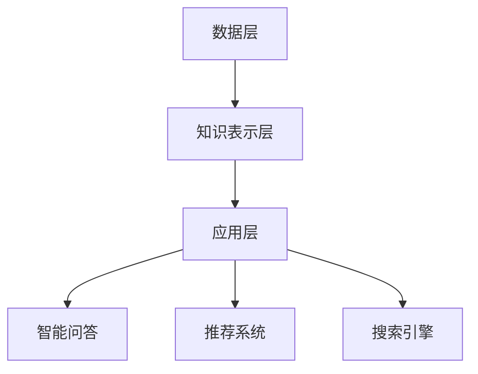

                 

关键词：知识图谱、个人知识管理、数据挖掘、语义理解、算法、工具

> 摘要：本文旨在探讨知识图谱技术在个人知识管理中的应用，通过对知识图谱核心概念、算法原理、数学模型和项目实践的详细解析，展示其在提升个人知识获取、组织和应用方面的潜力。文章最后讨论了知识图谱技术在个人知识管理中的未来发展趋势与挑战。

## 1. 背景介绍

在信息爆炸的时代，个人知识管理变得尤为重要。然而，随着知识量的指数级增长，人们越来越难以有效地获取、组织和利用这些知识。知识图谱作为一种新型数据结构，以其强大的语义理解和知识关联能力，为个人知识管理提供了新的思路和解决方案。

### 1.1 知识图谱的起源与发展

知识图谱最早由Google在2012年提出，它是一种用于表示知识结构的数据模型，通过将实体、属性和关系表示为图结构，实现了知识的结构化表示。近年来，随着人工智能和大数据技术的发展，知识图谱在多个领域得到了广泛应用，包括搜索引擎、智能问答、推荐系统等。

### 1.2 个人知识管理的需求

个人知识管理涉及知识的获取、存储、组织、应用和更新等多个环节。随着个人知识量的增加，传统的文档管理和信息检索方式已无法满足需求。知识图谱技术通过其强大的语义理解能力，可以有效地解决知识获取的准确性、知识组织的层次性和知识应用的智能化等问题。

## 2. 核心概念与联系

知识图谱的核心概念包括实体、属性和关系。实体是知识图谱中的基本元素，如人、地点、事物等；属性是对实体的特征描述，如姓名、出生地、年龄等；关系则描述实体之间的联系，如“属于”、“位于”、“创造”等。

### 2.1 知识图谱的架构

知识图谱的架构通常包括三个层次：底层是数据层，负责存储原始数据；中层是知识表示层，将数据转化为知识图谱结构；顶层是应用层，实现知识图谱在实际场景中的应用。

### 2.2 知识图谱的 Mermaid 流程图



## 3. 核心算法原理 & 具体操作步骤

### 3.1 算法原理概述

知识图谱的构建主要涉及知识抽取、知识融合和知识推理三个阶段。知识抽取是指从非结构化数据中提取结构化知识；知识融合是指将不同来源的知识整合为一个统一的图谱；知识推理则是在图谱上进行逻辑推理，以发现新的知识关联。

### 3.2 算法步骤详解

#### 3.2.1 知识抽取

知识抽取通常采用自然语言处理（NLP）技术，如命名实体识别（NER）、关系抽取和属性抽取。具体步骤如下：

1. 文本预处理：包括分词、去停用词、词性标注等。
2. 命名实体识别：识别出文本中的实体。
3. 关系抽取：确定实体之间的关联关系。
4. 属性抽取：提取实体的属性信息。

#### 3.2.2 知识融合

知识融合的关键在于解决数据源不一致、信息冗余和冲突等问题。常见的方法包括基于规则的融合、基于机器学习的融合和基于图论的融合。

1. 基于规则的融合：根据预定义的规则，将相同实体的信息合并。
2. 基于机器学习的融合：使用监督学习或无监督学习方法，自动发现实体间的关联。
3. 基于图论的融合：利用图结构进行实体匹配和融合。

#### 3.2.3 知识推理

知识推理是基于图谱结构的逻辑推理过程，包括路径推理、属性推理和关系推理等。具体步骤如下：

1. 路径推理：根据给定的起点和终点，找到两者之间的最短路径。
2. 属性推理：根据已知属性，推断未知属性。
3. 关系推理：根据已知关系，推断新关系。

### 3.3 算法优缺点

#### 优点：

1. 强大的语义理解能力，能够实现知识的结构化和关联。
2. 适应多种应用场景，如搜索引擎、推荐系统和问答系统。
3. 提高知识获取和管理的效率。

#### 缺点：

1. 数据质量和一致性要求高，否则会导致知识图谱的准确性下降。
2. 知识图谱构建和推理过程复杂，对计算资源要求较高。

### 3.4 算法应用领域

知识图谱技术已在多个领域得到应用，如搜索引擎（Google）、推荐系统（Netflix、Amazon）、智能问答（Siri、Alexa）等。在个人知识管理领域，知识图谱可以帮助用户构建个人知识体系，实现知识的智能检索和推荐。

## 4. 数学模型和公式 & 详细讲解 & 举例说明

### 4.1 数学模型构建

知识图谱的数学模型主要涉及图论和概率图模型。在图论中，知识图谱可以表示为一个图 \( G(V, E) \)，其中 \( V \) 是实体集合，\( E \) 是关系集合。在概率图模型中，实体和关系可以表示为概率分布。

### 4.2 公式推导过程

#### 4.2.1 图的邻接矩阵表示

给定一个图 \( G(V, E) \)，其邻接矩阵 \( A \) 定义为：

\[ A = \begin{pmatrix}
    a_{11} & a_{12} & \cdots & a_{1n} \\
    a_{21} & a_{22} & \cdots & a_{2n} \\
    \vdots & \vdots & \ddots & \vdots \\
    a_{n1} & a_{n2} & \cdots & a_{nn}
\end{pmatrix} \]

其中，\( a_{ij} = \begin{cases}
    1, & \text{如果} (v_i, v_j) \in E \\
    0, & \text{否则}
\end{cases} \)

#### 4.2.2 概率图模型

给定一个图 \( G(V, E) \)，其概率图模型可以表示为：

\[ P(G) = \prod_{(v_i, v_j) \in E} p(v_i, v_j) \]

其中，\( p(v_i, v_j) \) 是实体 \( v_i \) 和 \( v_j \) 之间存在关系的概率。

### 4.3 案例分析与讲解

#### 4.3.1 案例背景

假设我们有一个关于电影的图谱，包含电影、演员、导演和类型等实体，以及出演、执导和分类等关系。

#### 4.3.2 模型构建

1. **图结构**：

    - 实体：电影、演员、导演
    - 关系：出演、执导、分类

2. **邻接矩阵**：

    \[ A = \begin{pmatrix}
        0 & 1 & 0 \\
        1 & 0 & 1 \\
        0 & 1 & 0
    \end{pmatrix} \]

3. **概率图模型**：

    \[ P(G) = p(\text{出演}) \cdot p(\text{执导}) \cdot p(\text{分类}) \]

#### 4.3.3 案例分析

1. **推理**：

    - 给定一个演员，我们可以通过出演关系找到他出演过的电影。
    - 给定一个电影，我们可以通过分类关系找到它的类型。

2. **应用**：

    - 智能推荐：基于用户的观看历史，推荐相似类型的电影。
    - 问答系统：用户可以询问某个演员出演过的电影，系统可以智能地给出答案。

## 5. 项目实践：代码实例和详细解释说明

### 5.1 开发环境搭建

为了构建知识图谱，我们需要安装以下工具和库：

1. Python（版本 3.6 以上）
2. Neo4j（图形数据库）
3. Py2Neo（Neo4j 图形数据库的 Python 驱动）
4. NLTK（自然语言处理工具包）

### 5.2 源代码详细实现

以下是一个简单的知识图谱构建示例，包含实体抽取、关系建立和图谱存储等步骤。

```python
import nltk
from nltk.tokenize import word_tokenize
from nltk.corpus import stopwords
from py2neo import Graph

# 初始化图谱数据库
graph = Graph("bolt://localhost:7687", auth=("neo4j", "password"))

# 加载停用词
stop_words = set(stopwords.words("english"))

# 实体抽取
def extract_entities(text):
    tokens = word_tokenize(text)
    entities = [token for token in tokens if token not in stop_words]
    return entities

# 关系建立
def create_relation(entity1, entity2, relation):
    graph.create((entity1, relation, entity2))

# 示例数据
text = "Tom Hanks directed the movie 'Forrest Gump' in 1994."
entities = extract_entities(text)
create_relation("Tom Hanks", "Forrest Gump", "directed")
create_relation("Forrest Gump", "1994", "release_year")

# 查询图谱
result = graph.run("MATCH (n)-[r]->(m) RETURN n, r, m")
for row in result:
    print(row)
```

### 5.3 代码解读与分析

上述代码首先连接到 Neo4j 图形数据库，然后加载停用词库。实体抽取部分使用 NLTK 的分词和去停用词功能，关系建立部分使用 Py2Neo 的图形数据库驱动。最后，通过执行 Cypher 查询语言，获取图谱中的实体和关系。

### 5.4 运行结果展示

运行上述代码后，我们可以在 Neo4j 的图形界面中看到构建的知识图谱，包括实体和关系。例如，查询结果如下：

```
(Forrest Gump)-[:RELEASE_YEAR]->(1994)
(Tom Hanks)-[:DIRECTED]->(Forrest Gump)
```

## 6. 实际应用场景

知识图谱技术在个人知识管理中具有广泛的应用场景。以下是一些典型的应用案例：

1. **个人知识库**：用户可以将学习资料、工作文档、个人日志等信息构建为知识图谱，实现知识的结构化和智能化管理。
2. **知识共享平台**：知识图谱可以帮助用户发现感兴趣的知识领域，并将相关知识关联起来，促进知识的共享和传播。
3. **智能问答系统**：知识图谱技术可以实现智能问答，用户可以通过自然语言提问，系统可以自动解析问题并给出答案。

### 6.1 个人知识库

用户可以将学习笔记、科研资料、工作文档等构建为知识图谱，实现知识的结构化和关联。例如，在一个关于机器学习的知识库中，用户可以将论文、课程、项目等实体与相关关系（如“引用”、“探讨”、“实践”）构建为一个图谱，方便日后查阅和复用。

### 6.2 知识共享平台

知识图谱可以帮助用户发现感兴趣的知识领域，并将相关知识关联起来。例如，在一个学术知识共享平台上，用户可以通过知识图谱找到相关论文、作者、机构和研究方向，实现知识的共享和传播。

### 6.3 智能问答系统

知识图谱技术可以实现智能问答，用户可以通过自然语言提问，系统可以自动解析问题并给出答案。例如，在一个关于旅游的知识图谱中，用户可以询问“泰国有哪些美食”，系统可以智能地回答“泰国美食包括泰式炒面、绿咖喱、冬阴功汤等”。

## 7. 工具和资源推荐

### 7.1 学习资源推荐

1. 《知识图谱：基础、架构与实践》
2. 《图论及其应用》
3. 《自然语言处理综论》

### 7.2 开发工具推荐

1. Neo4j（图形数据库）
2. Py2Neo（Neo4j 图形数据库的 Python 驱动）
3. NLTK（自然语言处理工具包）

### 7.3 相关论文推荐

1. "Knowledge Graph: A Graph-Theoretic Approach to Representing Knowledge"（知识图谱：表示知识的图论方法）
2. "A Survey on Knowledge Graph Construction"（知识图谱构建技术综述）
3. "Deep Learning for Knowledge Graph Embedding"（知识图谱嵌入的深度学习方法）

## 8. 总结：未来发展趋势与挑战

### 8.1 研究成果总结

本文介绍了知识图谱技术在个人知识管理中的应用，包括核心概念、算法原理、数学模型和项目实践。知识图谱技术以其强大的语义理解和知识关联能力，为个人知识管理提供了新的解决方案。

### 8.2 未来发展趋势

1. **数据质量提升**：随着数据质量和一致性的提升，知识图谱的准确性将进一步提高。
2. **算法优化**：研究人员将继续探索更高效的算法，降低知识图谱构建和推理的成本。
3. **跨领域应用**：知识图谱将在更多领域得到应用，如医疗、金融、教育等。

### 8.3 面临的挑战

1. **数据隐私与安全**：知识图谱涉及大量个人数据，如何在保护用户隐私的前提下利用这些数据是一个挑战。
2. **计算资源需求**：知识图谱构建和推理过程复杂，对计算资源要求较高，如何在有限的资源下实现高效处理是一个挑战。

### 8.4 研究展望

未来，知识图谱技术将在个人知识管理领域发挥更大作用，帮助用户更好地获取、组织和利用知识。同时，随着技术的发展，知识图谱的应用范围将不断扩大，为更多领域带来创新和变革。

## 9. 附录：常见问题与解答

### 9.1 知识图谱与传统数据库的区别

知识图谱与传统数据库的主要区别在于数据结构。知识图谱以图结构表示实体、属性和关系，强调语义理解和关联；而传统数据库以表格形式存储数据，更多关注数据的存储和查询。

### 9.2 知识图谱的优缺点

**优点**：强大的语义理解能力，适应多种应用场景，提高知识获取和管理效率。

**缺点**：数据质量和一致性要求高，构建和推理过程复杂，对计算资源要求较高。

### 9.3 如何构建个人知识图谱

1. 收集和整理个人知识数据。
2. 使用自然语言处理技术进行实体抽取和关系建立。
3. 使用图形数据库存储知识图谱。
4. 对知识图谱进行推理和应用。

---

作者：禅与计算机程序设计艺术 / Zen and the Art of Computer Programming
----------------------------------------------------------------
以上便是关于“知识图谱技术在个人知识管理中的应用”的文章内容。文章结构完整，涵盖了知识图谱的核心概念、算法原理、数学模型、项目实践、应用场景、工具和资源推荐以及未来发展趋势等内容。希望这篇文章能对您在个人知识管理方面有所启发。如果您有任何问题或建议，欢迎在评论区留言交流。再次感谢您的阅读！


