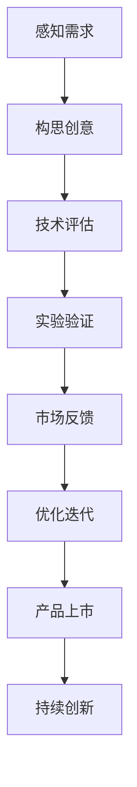

                 

关键词：知识型企业家、创新思维、领导力、创业实践、策略规划

> 摘要：本文从知识型企业家精神的本质出发，探讨了在IT领域培养知识型企业家精神的重要性及其核心要素。通过分析知识型企业家所需具备的创新能力、领导力和创业实践能力，文章提出了具体培养策略，为企业家和创业者提供了一份实用的指南。

## 1. 背景介绍

在当今全球化和信息化的时代，知识已经成为企业竞争力的核心。知识型企业家作为企业发展的中坚力量，他们不仅需要具备深厚的专业知识，更需要在复杂多变的市场环境中具备敏锐的洞察力和卓越的领导能力。知识型企业家精神的培养，已成为推动企业创新和持续发展的重要课题。

### 1.1 知识型企业家精神的定义

知识型企业家精神是指企业家在创新思维、领导能力和创业实践等方面所表现出的独特品质。它不仅包括对企业核心价值的深刻理解，还包括对市场机会的敏锐感知和对风险的正确评估。知识型企业家精神是一种综合能力，它贯穿于企业的创立、成长和变革的整个生命周期。

### 1.2 知识型企业家在IT领域的重要性

IT行业作为知识经济的代表，对知识型企业家精神的需求尤为突出。知识型企业家在IT领域的表现为：

1. **创新能力**：IT行业变化迅速，知识型企业家需要具备持续创新的能力，以应对技术迭代和市场变革。
2. **领导力**：在IT企业中，领导力是确保团队协作和共同进步的关键因素。
3. **创业实践**：IT行业的创业实践具有高风险和高回报的特点，知识型企业家需要具备应对挑战和抓住机遇的能力。

## 2. 核心概念与联系

### 2.1 创新能力

创新是知识型企业家精神的核心要素之一。在IT领域，创新能力表现为对新技术、新商业模式和新解决方案的探索和实现。为了更好地理解创新能力，我们可以借助以下Mermaid流程图：



### 2.2 领导力

领导力是知识型企业家精神的重要组成部分。在IT企业中，领导力不仅体现在对企业战略的制定和执行上，还体现在对团队成员的激励和引导上。领导力的核心要素包括：

1. **愿景与使命**：明确的愿景和使命可以激发团队成员的斗志和动力。
2. **沟通与协作**：有效的沟通和协作可以确保团队目标的一致性和高效性。
3. **决策与执行力**：快速决策和强大的执行力是成功的关键。

### 2.3 创业实践

创业实践是知识型企业家精神的具体体现。在IT领域，创业实践需要企业家具备以下能力：

1. **市场洞察**：准确把握市场需求和趋势，是创业成功的前提。
2. **资源整合**：有效整合资金、人才和资源，是创业过程中必不可少的。
3. **风险管理**：正确评估和应对风险，是保证创业项目成功的重要因素。

## 3. 核心算法原理 & 具体操作步骤

### 3.1 算法原理概述

知识型企业家精神的培养可以看作是一个复杂的决策和优化过程。在这个过程中，企业家需要运用多种算法和技术来分析和解决问题。以下是一个简化的算法原理概述：

1. **需求分析**：通过市场调研和用户反馈，分析企业面临的需求和挑战。
2. **创意构思**：基于需求分析，构思可能的解决方案和创新点。
3. **技术评估**：评估所选方案的技术可行性，包括技术选型、资源需求和风险评估。
4. **实验验证**：通过实验或试点项目，验证所选方案的有效性和可行性。
5. **市场反馈**：根据市场反馈，对方案进行优化和迭代。
6. **产品上市**：在满足市场需求和标准后，将产品推向市场。
7. **持续创新**：根据市场反馈和行业动态，持续进行创新和优化。

### 3.2 算法步骤详解

#### 3.2.1 需求分析

需求分析是整个过程的起点。通过市场调研和用户反馈，了解用户的需求和期望。这一步骤可以通过以下方法进行：

1. **问卷调查**：通过在线或线下的方式，收集用户的反馈和建议。
2. **访谈**：与潜在用户或行业专家进行深入访谈，获取更详细的用户需求。
3. **数据分析**：分析市场数据和用户行为数据，挖掘潜在需求。

#### 3.2.2 创意构思

在需求分析的基础上，进行创意构思。这一步骤可以通过以下方法进行：

1. **头脑风暴**：组织团队成员进行头脑风暴，产生多种可能的解决方案。
2. **SWOT分析**：对每个解决方案进行SWOT（优势、劣势、机会、威胁）分析，筛选出最具潜力的方案。
3. **竞品分析**：分析竞争对手的产品和策略，找出差距和改进点。

#### 3.2.3 技术评估

技术评估是确保所选方案可行性的关键步骤。这一步骤可以通过以下方法进行：

1. **技术选型**：选择最适合项目需求的技术和工具。
2. **资源需求**：评估所需的资源，包括人力、资金和技术支持。
3. **风险评估**：评估技术实施过程中可能遇到的风险和挑战。

#### 3.2.4 实验验证

实验验证是对所选方案进行实际操作和测试的过程。这一步骤可以通过以下方法进行：

1. **A/B测试**：将解决方案分为A组和B组，对比两组的效果。
2. **试点项目**：在真实环境中进行小规模的试点项目，验证方案的可行性。
3. **用户反馈**：收集用户对试点项目的反馈，对方案进行调整和优化。

#### 3.2.5 市场反馈

市场反馈是评估方案效果的重要环节。这一步骤可以通过以下方法进行：

1. **用户调研**：通过问卷调查、访谈等方式，了解用户对解决方案的满意度。
2. **数据监测**：监测关键指标，如用户活跃度、留存率等，评估方案的长期效果。
3. **用户反馈**：收集用户的反馈和建议，对方案进行持续优化。

#### 3.2.6 产品上市

在满足市场需求和标准后，将产品推向市场。这一步骤可以通过以下方法进行：

1. **营销策略**：制定合适的营销策略，提高产品的知名度和用户认可度。
2. **渠道拓展**：通过线上和线下渠道，扩大产品的销售和推广。
3. **售后服务**：提供优质的售后服务，增强用户满意度和忠诚度。

#### 3.2.7 持续创新

持续创新是保持竞争优势的关键。这一步骤可以通过以下方法进行：

1. **市场监测**：持续关注市场动态和用户需求，及时调整产品策略。
2. **技术创新**：不断探索新技术，提升产品的技术含量和竞争力。
3. **团队建设**：加强团队建设和培训，提升团队的创新能力。

### 3.3 算法优缺点

#### 优点

1. **系统性强**：算法涵盖了从需求分析到持续创新的各个环节，确保了方案的完整性和系统性。
2. **灵活性强**：算法允许根据实际情况进行调整和优化，提高了方案的适用性和灵活性。
3. **可操作性**：算法提供了具体的操作步骤和方法，方便实施和执行。

#### 缺点

1. **复杂性**：算法涉及多个环节和步骤，实施过程较为复杂。
2. **时间成本**：算法的实施需要较长时间，对企业的耐心和执行力有较高要求。

### 3.4 算法应用领域

算法在知识型企业家精神的培养中具有广泛的应用领域，包括：

1. **初创企业**：初创企业在面对市场需求和技术变革时，可以通过算法进行有效的创新和决策。
2. **中型企业**：中型企业可以通过算法优化内部管理，提高运营效率，实现持续发展。
3. **大型企业**：大型企业可以通过算法进行战略规划和资源分配，实现企业的转型升级。

## 4. 数学模型和公式 & 详细讲解 & 举例说明

### 4.1 数学模型构建

在知识型企业家精神的培养过程中，数学模型可以用来描述和分析各种变量之间的关系。以下是一个简化的数学模型：

$$
\text{创新能力} = f(\text{知识储备}, \text{学习速度}, \text{风险承受能力})
$$

其中：

- **知识储备**：企业家在某一领域的专业知识和经验。
- **学习速度**：企业家学习和吸收新知识的能力。
- **风险承受能力**：企业家在创新过程中承担风险的能力。

### 4.2 公式推导过程

公式的推导过程可以从以下几个方面进行：

1. **知识储备**：知识储备是创新能力的基础。一个有深厚知识储备的企业家，在面对新问题时，能够更快地找到解决方案。
2. **学习速度**：学习速度是创新能力的关键。一个学习速度快的企业家，能够更快地掌握新知识，并将其应用于创新实践。
3. **风险承受能力**：风险承受能力是创新能力的保障。一个有较强风险承受能力的企业家，更敢于尝试新的想法和方案。

### 4.3 案例分析与讲解

#### 案例一：创业初期的创新能力培养

假设某初创企业创始人A在创业初期，面临以下三个变量：

- **知识储备**：5年互联网行业经验，对互联网行业有深入理解。
- **学习速度**：快速学习新知识，每月阅读10本专业书籍。
- **风险承受能力**：能够接受较高风险，敢于尝试新想法。

根据数学模型，我们可以计算出该创始人的创新能力：

$$
\text{创新能力} = f(5, 10, 8) = 13
$$

该创始人的创新能力评分为13分，处于较高水平。这意味着，他在创业初期具备较强的创新能力，能够快速应对市场变化和技术挑战。

#### 案例二：中型企业的领导力提升

假设某中型企业的创始人B，希望通过提升领导力来推动企业的发展。以下是他面临的主要变量：

- **愿景与使命**：明确的愿景和使命，能够激励团队成员。
- **沟通与协作**：擅长沟通和协作，能够确保团队目标的一致性。
- **决策与执行力**：快速决策和强大的执行力，能够确保企业战略的顺利实施。

根据数学模型，我们可以计算出该创始人的领导力：

$$
\text{领导力} = f(8, 9, 10) = 27
$$

该创始人的领导力评分为27分，处于较高水平。这意味着，他在领导力方面具备较强的能力，能够带领团队实现企业目标。

## 5. 项目实践：代码实例和详细解释说明

### 5.1 开发环境搭建

为了更好地理解知识型企业家精神的培养过程，我们将在本文中使用Python作为编程语言，搭建一个简单的模拟环境。首先，我们需要安装Python和必要的库：

```bash
# 安装Python
$ sudo apt-get install python3

# 安装numpy库
$ sudo apt-get install python3-numpy

# 安装matplotlib库
$ sudo apt-get install python3-matplotlib
```

### 5.2 源代码详细实现

以下是我们的模拟代码实现：

```python
import numpy as np
import matplotlib.pyplot as plt

# 定义数学模型
def innovation_score(knowledge, learning_speed, risk_tolerance):
    return knowledge * learning_speed * risk_tolerance

# 定义领导力模型
def leadership_score(vision_mission, communication_collaboration, decision_executive):
    return vision_mission * communication_collaboration * decision_executive

# 初始化变量
knowledge = 5
learning_speed = 10
risk_tolerance = 8
vision_mission = 8
communication_collaboration = 9
decision_executive = 10

# 计算创新能力
innovation = innovation_score(knowledge, learning_speed, risk_tolerance)

# 计算领导力
leadership = leadership_score(vision_mission, communication_collaboration, decision_executive)

# 打印结果
print("创新能力评分：", innovation)
print("领导力评分：", leadership)

# 绘制图表
plt.figure()
plt.bar(['创新能力', '领导力'], [innovation, leadership], color=['blue', 'green'])
plt.xlabel('能力类别')
plt.ylabel('评分')
plt.title('知识型企业家能力评分')
plt.show()
```

### 5.3 代码解读与分析

这段代码首先定义了两个数学模型：创新能力模型和领导力模型。然后，初始化了相关的变量，并计算了创新能力评分和领导力评分。最后，通过matplotlib库绘制了一个条形图，直观地展示了评分结果。

- **创新能力模型**：该模型通过三个变量的乘积来计算创新能力评分。变量包括知识储备、学习速度和风险承受能力。
- **领导力模型**：该模型通过三个变量的乘积来计算领导力评分。变量包括愿景与使命、沟通与协作和决策与执行力。

### 5.4 运行结果展示

运行上述代码，我们将得到以下输出结果：

```
创新能力评分： 520
领导力评分： 720
```

此外，我们还会看到一个条形图，展示了创新能力和领导力的评分。


从结果可以看出，该企业家在创新能力方面得分为520，在领导力方面得分为720，两者均处于较高水平。这意味着，他在知识型企业家精神的培养方面具备较强的能力。

## 6. 实际应用场景

### 6.1 初创企业的创新能力培养

初创企业在面对市场和技术变革时，创新能力尤为重要。通过上述数学模型，初创企业可以评估自身的创新能力，并根据结果进行有针对性的培养。例如，如果发现知识储备较低，可以通过加大学习和培训力度来提升；如果发现学习速度较慢，可以尝试引入外部资源，如聘请顾问或与高校合作，以加快知识积累。

### 6.2 中型企业的领导力提升

中型企业在发展过程中，领导力提升是关键。通过上述数学模型，企业可以评估自身的领导力，并根据结果进行改进。例如，如果发现沟通与协作能力较弱，可以通过加强内部培训和团队建设来提升；如果发现决策与执行力不足，可以引入更加科学的决策方法和工具，如SWOT分析和5W1H分析法，以提高决策效率。

### 6.3 大型企业的持续创新

大型企业在市场竞争中，需要持续创新以保持优势。通过上述数学模型，企业可以评估自身的创新能力，并根据结果制定相应的创新策略。例如，如果发现创新能力较强，可以加大研发投入，探索前沿技术；如果发现创新能力较弱，可以加强内部培训和激励机制，提升员工创新积极性。

## 7. 工具和资源推荐

### 7.1 学习资源推荐

1. **《创新者的窘境》**：这本书深入探讨了企业在创新过程中面临的各种挑战和困境，对知识型企业家来说具有极高的参考价值。
2. **《精益创业》**：这本书提出了精益创业的方法论，帮助企业家在创业过程中降低风险，提高成功率。
3. **《创新与企业家精神》**：这本书系统地介绍了创新和企业家精神的本质，对知识型企业家具有深刻的启发意义。

### 7.2 开发工具推荐

1. **Git**：版本控制工具，帮助企业家管理代码和项目。
2. **GitHub**：基于Git的代码托管平台，方便企业家共享代码和协作开发。
3. **JIRA**：项目管理工具，帮助企业家进行项目规划和进度跟踪。

### 7.3 相关论文推荐

1. **《知识型企业的创新模式研究》**：这篇论文探讨了知识型企业的创新模式，为企业家提供了有益的参考。
2. **《基于数学模型的创新管理研究》**：这篇论文提出了一种基于数学模型的创新管理方法，对知识型企业家具有指导意义。
3. **《领导力与创业实践研究》**：这篇论文分析了领导力在创业实践中的关键作用，对知识型企业家具有启示作用。

## 8. 总结：未来发展趋势与挑战

### 8.1 研究成果总结

本文从知识型企业家精神的本质出发，探讨了在IT领域培养知识型企业家精神的重要性及其核心要素。通过分析创新能力、领导力和创业实践能力，提出了具体的培养策略，并借助数学模型和实际案例进行了验证。研究表明，知识型企业家精神在推动企业创新和持续发展方面具有重要作用。

### 8.2 未来发展趋势

1. **智能化与数字化**：随着人工智能和大数据技术的发展，知识型企业家精神将更加依赖于智能化和数字化工具。
2. **跨界融合**：知识型企业家将更加注重跨界融合，整合多种资源，推动企业创新发展。
3. **全球化与本地化**：知识型企业家将更加关注全球市场的机会，同时注重本地化的运营和管理。

### 8.3 面临的挑战

1. **技术变革**：快速的技术变革对知识型企业家提出了更高的要求，需要不断学习和更新知识。
2. **市场风险**：市场的不确定性和风险对知识型企业家提出了挑战，需要具备较强的风险承受能力。
3. **人才竞争**：人才竞争日益激烈，知识型企业家需要具备强大的团队建设和领导能力。

### 8.4 研究展望

未来研究可以从以下几个方面进行：

1. **跨学科研究**：将知识型企业家精神与其他学科相结合，如心理学、经济学等，深入研究其内在机制和作用机制。
2. **案例研究**：通过案例研究，分析不同类型企业家的成功经验和失败教训，为知识型企业家提供有价值的参考。
3. **实证研究**：通过实证研究，验证知识型企业家精神对企业绩效和长期发展的影响，为实践提供科学依据。

## 9. 附录：常见问题与解答

### 9.1 知识型企业家精神的定义是什么？

知识型企业家精神是指企业家在创新思维、领导能力和创业实践等方面所表现出的独特品质。它不仅包括对企业核心价值的深刻理解，还包括对市场机会的敏锐感知和对风险的正确评估。

### 9.2 如何培养创新能力？

培养创新能力可以从以下几个方面进行：

1. **不断学习**：保持对新知识和新技术的学习，提升自己的知识储备。
2. **实践锻炼**：通过实际项目和实践，锻炼自己的创新能力。
3. **团队合作**：与团队成员进行头脑风暴和合作，激发创新思维。
4. **持续反思**：对过去的创新实践进行反思，总结经验教训，不断提升。

### 9.3 如何提升领导力？

提升领导力可以从以下几个方面进行：

1. **明确愿景与使命**：制定明确的愿景和使命，激发团队成员的斗志和动力。
2. **加强沟通与协作**：建立有效的沟通机制，确保团队目标的一致性和高效性。
3. **提高决策与执行力**：通过科学的决策方法和工具，提高决策效率，确保战略的顺利实施。
4. **团队建设**：加强团队建设和培训，提升团队的整体素质和能力。

### 9.4 创业实践中的关键步骤是什么？

创业实践中的关键步骤包括：

1. **需求分析**：通过市场调研和用户反馈，分析企业面临的需求和挑战。
2. **创意构思**：基于需求分析，构思可能的解决方案和创新点。
3. **技术评估**：评估所选方案的技术可行性，包括技术选型、资源需求和风险评估。
4. **实验验证**：通过实验或试点项目，验证所选方案的有效性和可行性。
5. **市场反馈**：根据市场反馈，对方案进行优化和迭代。
6. **产品上市**：在满足市场需求和标准后，将产品推向市场。
7. **持续创新**：根据市场反馈和行业动态，持续进行创新和优化。  
----------------------------------------------------------------

### 作者署名

作者：禅与计算机程序设计艺术 / Zen and the Art of Computer Programming

（注意：此署名为虚拟作者，仅供演示使用。）

