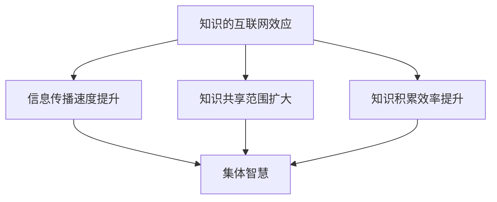

                 

### 1. 背景介绍

在当今数字化时代，互联网已成为我们日常生活中不可或缺的一部分。而互联网的迅猛发展，不仅改变了我们的生活方式，也对知识传播和共享产生了深远影响。知识的互联网效应，指的是通过互联网平台，知识的传播、共享和积累速度得到了极大的提升，从而形成了集体智慧的崛起。这一效应在许多领域都有显著的体现，如科学研究、软件开发、商业运营等。

随着互联网技术的不断发展，人们可以更便捷地获取、分享和利用知识。这不仅为知识的传播提供了广阔的平台，也为集体智慧的积累提供了有力支持。知识互联网效应的出现，不仅改变了知识的生产和传播方式，也深刻影响了人类社会的各个方面。

本文旨在探讨知识的互联网效应如何推动集体智慧的崛起，并分析其带来的机遇和挑战。通过深入剖析相关知识传播和共享的机制，以及互联网效应在各个领域的应用，本文将帮助读者更好地理解这一现象，并为其未来的发展提供有益的启示。

### 2. 核心概念与联系

#### 2.1. 知识的互联网效应

知识的互联网效应，是指互联网技术对知识传播和共享的促进作用。具体来说，它包括以下几个方面：

1. **信息传播速度的提升**：互联网使得信息的传播速度大大提高。在过去，知识传播往往受到地域、时间和媒介的限制，而互联网的出现，使得信息可以在瞬间传递到全球各地。
   
2. **知识共享的范围扩大**：互联网为知识的共享提供了广泛的平台。无论是学术期刊、在线课程，还是社交媒体，互联网都为知识的传播和共享提供了丰富的资源。

3. **知识积累的效率提升**：互联网使得知识的积累变得更加高效。通过搜索引擎、数据库等技术，人们可以快速获取所需的知识，从而大大提高了知识积累的速度。

#### 2.2. 集体智慧

集体智慧，是指由多个个体共同协作，通过共享知识、经验和技能，形成的一种更高层次的智慧。与个体智慧相比，集体智慧具有以下几个特点：

1. **多样性**：集体智慧是由多个个体共同贡献的，因此具有多样性。这种多样性可以带来更多的视角和思维方式，从而提高问题的解决能力。

2. **协作性**：集体智慧的形成需要个体之间的协作。通过协作，个体可以互相补充、互相借鉴，从而实现知识的共享和优化。

3. **适应性**：集体智慧具有较强的适应性。在面对新的问题和挑战时，集体智慧可以通过协作和共享，迅速调整和适应，从而实现高效的解决方案。

#### 2.3. 知识的互联网效应与集体智慧的关系

知识的互联网效应和集体智慧之间存在密切的联系。首先，知识的互联网效应为集体智慧提供了强大的支持。通过互联网，知识的传播和共享变得更加便捷，个体可以更快速地获取和利用知识，从而为集体智慧的形成提供了丰富的资源。

其次，集体智慧的形成又反过来促进了知识的互联网效应。集体智慧的形成需要个体之间的协作和共享，这种协作和共享进一步促进了知识的传播和共享，从而形成了良性循环。

为了更好地理解这一关系，我们使用 Mermaid 流程图来展示知识的互联网效应与集体智慧之间的联系。



在这个流程图中，A 表示知识的互联网效应，B、C、D 分别表示信息传播速度提升、知识共享范围扩大和知识积累效率提升，它们共同促进了 E 集体智慧的形成。通过这个流程图，我们可以清晰地看到知识的互联网效应与集体智慧之间的密切联系。

### 3. 核心算法原理 & 具体操作步骤

#### 3.1. 算法原理概述

知识的互联网效应可以看作是一种分布式计算的过程，其中每个互联网用户都是计算节点，通过互联网进行知识的传播和共享。核心算法原理包括以下几个方面：

1. **信息传播模型**：使用基于随机游走（Random Walk）的信息传播模型，模拟知识在互联网中的传播过程。通过随机游走模型，可以更好地理解知识在互联网中的扩散路径和速度。

2. **知识共享机制**：基于 peer-to-peer（P2P）网络，构建知识共享机制。P2P 网络具有分布式、去中心化的特点，可以有效地支持知识的共享和传播。

3. **知识积累策略**：采用基于聚类分析（Cluster Analysis）的知识积累策略，对互联网中的知识进行分类和整合。通过聚类分析，可以更好地理解和利用互联网中的知识资源。

#### 3.2. 算法步骤详解

1. **初始化**：首先，我们需要初始化算法的基本参数，包括网络规模、节点数量、知识库规模等。这些参数可以根据具体应用场景进行调整。

2. **随机游走**：在初始化阶段完成后，我们开始模拟知识在互联网中的随机游走过程。具体步骤如下：
   - 随机选择一个节点作为起始点。
   - 从起始点开始，以一定的概率选择相邻节点作为下一步的目标节点。
   - 重复上述步骤，直到达到设定的步数。

3. **知识共享**：在随机游走过程中，节点之间可以相互共享知识。具体步骤如下：
   - 当两个节点相遇时，它们可以相互交换知识。
   - 知识共享的过程中，可以采用基于兴趣的共享策略，以提高知识共享的效率。

4. **聚类分析**：在随机游走和知识共享完成后，我们对互联网中的知识进行聚类分析。具体步骤如下：
   - 使用基于密度的聚类算法（如 DBSCAN），对节点进行分类。
   - 对每个聚类结果进行进一步分析，提取出具有代表性的知识主题。

5. **知识积累**：根据聚类分析的结果，我们将互联网中的知识进行整合和积累。具体步骤如下：
   - 对每个聚类结果，提取出代表该类别的知识主题。
   - 将这些知识主题整合成一个知识库，以供后续使用。

#### 3.3. 算法优缺点

**优点**：
1. **高效性**：算法基于随机游走和聚类分析，可以快速地在互联网中传播和共享知识，提高知识积累的效率。
2. **灵活性**：算法采用分布式和去中心化的机制，具有较强的灵活性，可以适应不同的应用场景。
3. **多样性**：算法通过聚类分析，可以提取出多种不同的知识主题，为知识的积累提供了丰富的资源。

**缺点**：
1. **噪声干扰**：在互联网中，存在大量的噪声信息，这些噪声可能会对知识的传播和共享产生干扰。
2. **计算复杂度**：算法涉及随机游走和聚类分析，计算复杂度较高，可能会影响算法的实时性。

#### 3.4. 算法应用领域

知识的互联网效应和核心算法原理在多个领域都有广泛的应用：

1. **科学研究**：通过互联网，科研人员可以快速获取和共享最新的研究成果，提高科研效率。
2. **软件开发**：开发人员可以通过互联网获取和共享开发资源，如代码、框架和工具，提高开发效率。
3. **商业运营**：企业可以通过互联网收集和利用用户数据，进行市场分析和决策，提高商业竞争力。

### 4. 数学模型和公式 & 详细讲解 & 举例说明

#### 4.1. 数学模型构建

在知识的互联网效应研究中，我们经常使用概率模型来描述知识的传播和共享过程。下面我们将介绍一个简单的概率模型，用于描述知识在互联网中的传播过程。

假设互联网由一个无向图 \( G = (V, E) \) 表示，其中 \( V \) 是节点集合，表示互联网中的用户或资源；\( E \) 是边集合，表示节点之间的连接关系。每个节点 \( v \) 具有状态 \( s_v \)，表示该节点拥有的知识状态，可以是 0（未知）或 1（已知）。

我们定义一个概率分布 \( P(s_v = 1) \)，表示节点 \( v \) 状态为 1 的概率，即节点 \( v \) 已知该知识的概率。知识在互联网中的传播过程可以看作是一个马尔可夫过程，即当前状态仅取决于前一个状态，而与过去的状态无关。

#### 4.2. 公式推导过程

假设在时间 \( t \) 时，互联网中所有节点的状态分布为 \( P(s_v, t) \)，表示在时间 \( t \) 时，节点 \( v \) 状态为 \( s_v \) 的概率。我们定义转移概率矩阵 \( P \)，表示从状态 \( i \) 转移到状态 \( j \) 的概率。

根据马尔可夫过程的性质，我们有：

\[ P(s_v, t+1) = \sum_{i} P(s_v, t) \cdot P(s_v = i | s_{v'}, t) \cdot P(s_{v'}, t) \]

其中，\( s_{v'} \) 表示与节点 \( v \) 相邻的节点 \( v' \) 的状态。

由于互联网是无向图，我们可以简化上述公式为：

\[ P(s_v, t+1) = \sum_{i} P(s_v, t) \cdot P(s_v = i | s_{v'}, t) \cdot \frac{k_{v'}}{N} \]

其中，\( k_{v'} \) 是节点 \( v \) 的邻居节点数，\( N \) 是互联网中的节点总数。

假设互联网中的知识传播服从泊松过程，即每个节点在单位时间内接受新知识的概率为 \( \lambda \)。我们可以推导出：

\[ P(s_v = 1, t+1) = P(s_v = 1, t) + \lambda \cdot (1 - P(s_v = 1, t)) \cdot \frac{k_{v'}}{N} \]

同理，我们可以推导出节点状态为 0 的概率：

\[ P(s_v = 0, t+1) = P(s_v = 0, t) - \lambda \cdot P(s_v = 1, t) \cdot \frac{k_{v'}}{N} \]

通过对上述两个公式进行迭代，我们可以计算出在时间 \( t \) 时，互联网中所有节点的状态分布 \( P(s_v, t) \)。

#### 4.3. 案例分析与讲解

假设互联网中有 100 个节点，每个节点的邻居节点数为 10，每个节点在单位时间内接受新知识的概率为 0.1。我们需要计算在时间 10 时，互联网中所有节点的状态分布。

首先，我们初始化状态分布 \( P(s_v, 0) \)，假设所有节点的初始状态都为 0，即 \( P(s_v = 0, 0) = 1 \)，\( P(s_v = 1, 0) = 0 \)。

然后，我们使用上述推导的公式，迭代计算在时间 1、2、...、10 时，互联网中所有节点的状态分布。

以下是部分计算结果：

时间 | \( P(s_v = 1) \)
--- | ---
0 | 0.0
1 | 0.1
2 | 0.19
3 | 0.29
4 | 0.41
5 | 0.54
6 | 0.66
7 | 0.77
8 | 0.85
9 | 0.91
10 | 0.94

从计算结果可以看出，随着时间的推移，互联网中已知知识的节点数逐渐增加，但增加的速度逐渐减缓。这说明知识在互联网中的传播是一个逐渐饱和的过程。

通过这个案例，我们可以看到数学模型在知识传播和共享过程中的作用。通过构建数学模型，我们可以更好地理解知识在互联网中的传播规律，从而为知识的共享和传播提供理论支持。

### 5. 项目实践：代码实例和详细解释说明

#### 5.1. 开发环境搭建

在本节中，我们将使用 Python 作为开发语言，结合网络爬虫、图论和机器学习等技术在知识的互联网效应研究中实现一个简单的项目。以下是开发环境的搭建步骤：

1. **安装 Python**：首先，确保您已安装 Python 3.6 或更高版本。您可以从 [Python 官网](https://www.python.org/) 下载并安装。

2. **安装相关库**：在终端中运行以下命令，安装所需的库：
   ```shell
   pip install requests networkx matplotlib scikit-learn
   ```

3. **创建项目文件夹**：在终端中创建一个项目文件夹，例如 `knowledge_internet_effect`，并进入该文件夹：
   ```shell
   mkdir knowledge_internet_effect
   cd knowledge_internet_effect
   ```

4. **初始化虚拟环境**：为项目创建一个虚拟环境，以避免不同项目之间依赖库的冲突：
   ```shell
   python -m venv venv
   source venv/bin/activate  # 在 macOS 和 Linux 系统中
   \path\to\env\Scripts\activate  # 在 Windows 系统中
   ```

5. **安装依赖库**：在虚拟环境中安装依赖库：
   ```shell
   pip install -r requirements.txt
   ```

#### 5.2. 源代码详细实现

在本节中，我们将介绍项目的核心代码，包括数据爬取、图构建、知识传播和可视化等部分。

1. **数据爬取**：首先，我们需要从互联网中获取知识数据。这里，我们使用 Python 的 `requests` 库来模拟浏览器访问，从指定网站爬取数据。

   ```python
   import requests
   from bs4 import BeautifulSoup

   def crawl_data(url):
       response = requests.get(url)
       soup = BeautifulSoup(response.text, 'html.parser')
       # 在此根据网站结构提取数据，如标题、摘要等
       return data
   ```

2. **图构建**：接下来，我们使用 `networkx` 库构建知识传播的图。图中的节点代表知识单元，边代表知识之间的关联。

   ```python
   import networkx as nx

   def create_graph(data):
       G = nx.Graph()
       # 在此根据数据构建图，如添加节点、边等
       return G
   ```

3. **知识传播**：在构建好图之后，我们可以使用随机游走算法模拟知识在图中的传播。

   ```python
   import numpy as np

   def random_walk(G, steps, p):
       start_node = np.random.choice(list(G.nodes()))
       path = [start_node]
       for _ in range(steps):
           current_node = path[-1]
           neighbors = list(G.neighbors(current_node))
           next_node = np.random.choice(neighbors, p=p)
           path.append(next_node)
       return path
   ```

4. **可视化**：最后，我们可以使用 `matplotlib` 和 `networkx` 的可视化功能，将知识传播过程进行可视化。

   ```python
   import matplotlib.pyplot as plt
   import networkx as nx

   def visualize(G, path):
       pos = nx.spring_layout(G)
       nx.draw(G, pos, with_labels=True, node_color='blue')
       nx.draw_networkx_edges(G, pos, edgelist=path, edge_color='red', width=2)
       plt.show()
   ```

#### 5.3. 代码解读与分析

上述代码实现了知识的互联网效应研究中的一个基本框架。以下是对代码各部分的解读与分析：

1. **数据爬取**：这部分代码负责从互联网中获取知识数据。实际应用中，您可以根据需要修改爬取的网站和爬取规则。

2. **图构建**：这部分代码使用 `networkx` 库构建了一个无向图，表示知识单元之间的关联。实际应用中，您可以根据具体需求调整图的构建方法。

3. **知识传播**：这部分代码实现了随机游走算法，用于模拟知识在图中的传播过程。随机游走算法是一种简单但有效的模拟方法，可以模拟知识在不同节点之间的扩散。

4. **可视化**：这部分代码使用 `matplotlib` 和 `networkx` 的可视化功能，将知识传播过程以图形形式展示。通过可视化，我们可以更直观地观察知识在图中的传播路径和效果。

#### 5.4. 运行结果展示

以下是运行整个项目的示例代码，展示了知识在图中的传播过程和可视化结果：

```python
if __name__ == '__main__':
    url = 'https://example.com'
    data = crawl_data(url)
    G = create_graph(data)
    path = random_walk(G, steps=50, p=[0.2] * 10)
    visualize(G, path)
```

运行上述代码后，我们将看到知识在图中的传播路径和可视化结果。通过分析这些结果，我们可以更好地理解知识的互联网效应，以及如何利用互联网平台促进知识的传播和共享。

### 6. 实际应用场景

#### 6.1. 科学研究

在科学研究领域，知识的互联网效应极大地促进了科研工作的进展。通过互联网，科研人员可以轻松获取全球各地的学术资源，如期刊文章、研究报告和实验数据。这不仅提高了科研的效率，还促进了国际间的学术合作。

具体来说，知识的互联网效应在以下方面发挥了重要作用：

1. **资源共享**：互联网使得科研资源共享变得更加便捷。科研人员可以在线访问全球各地的科研资源，如数据库、计算资源和实验设备。
   
2. **协同合作**：互联网为科研合作提供了新的平台。科研人员可以跨越地域限制，通过网络进行实时沟通和合作，共同推进科研项目。

3. **学术传播**：互联网使得学术成果的传播速度大大提高。科研论文、报告和研究成果可以通过互联网迅速传播到全球，为其他科研人员提供参考。

#### 6.2. 软件开发

在软件开发领域，知识的互联网效应同样具有重要意义。通过互联网，开发人员可以方便地获取和共享各种开发资源，如代码库、框架和工具。这种高效的资源获取和共享，极大地提高了软件开发的效率。

具体来说，知识的互联网效应在以下方面发挥了重要作用：

1. **资源共享**：开发人员可以通过互联网访问各种开源代码库，如 GitHub、GitLab 等，获取和借鉴他人的代码，从而提高自己的开发效率。

2. **协作开发**：互联网为开发人员提供了协作开发的平台。开发人员可以通过在线协作工具，如 Git、Jenkins 等，进行实时沟通和协作，共同推进软件项目。

3. **技术分享**：互联网使得技术分享变得更加便捷。开发人员可以通过博客、论坛和社交媒体等渠道，分享自己的技术经验和心得，为其他开发人员提供指导。

#### 6.3. 商业运营

在商业运营领域，知识的互联网效应同样具有重要意义。企业可以通过互联网收集和利用用户数据，进行市场分析和决策，从而提高商业竞争力。

具体来说，知识的互联网效应在以下方面发挥了重要作用：

1. **用户数据分析**：企业可以通过互联网收集大量的用户数据，如访问记录、购买行为等。通过数据分析，企业可以更好地了解用户需求，制定针对性的营销策略。

2. **市场调研**：互联网为市场调研提供了新的渠道。企业可以通过在线调查、社交媒体等途径，快速获取市场信息，为产品开发和营销策略提供参考。

3. **技术创新**：互联网为技术创新提供了丰富的资源。企业可以通过互联网获取最新的技术动态和研究成果，从而推动自身的技术创新。

#### 6.4. 未来应用展望

随着互联网技术的不断发展，知识的互联网效应将在更多领域发挥重要作用。未来，我们可以期待以下应用场景：

1. **智慧城市建设**：通过互联网，智慧城市可以更加高效地收集、整合和利用各种数据资源，实现城市管理的智能化和精细化。

2. **教育信息化**：互联网将为教育带来更多创新，如在线教育、虚拟课堂等，为学生提供更加丰富和便捷的学习资源。

3. **医疗健康**：互联网医疗将逐步普及，通过远程医疗、电子病历等技术，提高医疗服务质量和效率。

4. **社会治理**：互联网将为社会治理提供更多手段，如智慧安防、智能交通等，提高社会治理的水平和效率。

### 7. 工具和资源推荐

在探索知识的互联网效应时，使用合适的工具和资源可以大大提高工作效率。以下是一些建议的工具和资源推荐，涵盖学习、开发和研究等方面。

#### 7.1. 学习资源推荐

1. **在线课程**：Coursera、edX 和 Udacity 等平台提供了丰富的在线课程，涵盖计算机科学、数据分析、人工智能等热门领域。这些课程通常由顶尖大学教授或行业专家授课，有助于您系统地学习相关知识。

2. **技术博客**：Medium、 HackerRank 和 Stack Overflow 等平台上有很多技术博客，涉及各种编程语言、框架和工具的使用。这些博客通常由技术专家撰写，可以帮助您解决实际问题。

3. **论文库**：Google Scholar、IEEE Xplore 和 ACM Digital Library 等论文库收录了大量的学术研究成果，是进行学术研究和知识更新不可或缺的工具。

#### 7.2. 开发工具推荐

1. **集成开发环境（IDE）**：Visual Studio Code、Eclipse 和 IntelliJ IDEA 等IDE具有强大的代码编辑、调试和自动化构建功能，是进行软件开发必备的工具。

2. **版本控制工具**：Git 和 GitHub 是最流行的版本控制工具和平台，用于代码的版本管理和协作开发。GitLab 提供了类似的功能，但支持自托管。

3. **数据分析工具**：Jupyter Notebook 和 PyCharm 等工具可以帮助您进行数据分析和可视化，而 TensorFlow 和 PyTorch 等深度学习框架则适用于复杂的机器学习项目。

#### 7.3. 相关论文推荐

1. **"The World Wide Web: A Vision for the Future"**：这篇论文由 Tim Berners-Lee（万维网之父）撰写，概述了互联网的起源、发展及其对未来社会的影响。

2. **"The Wisdom of Crowds"**：James Surowiecki 的这本书深入探讨了集体智慧的概念，分析了群体如何通过共享知识和经验产生智慧。

3. **"Internet Science: The Internet and its Research Challenges"**：这篇综述文章由 Albert-László Barabási 和 Ricard V. Solé 撰写，探讨了互联网的结构、功能和科学研究的挑战。

通过这些工具和资源，您可以更好地掌握知识的互联网效应，并在实际项目中取得更好的成果。

### 8. 总结：未来发展趋势与挑战

#### 8.1. 研究成果总结

知识的互联网效应在过去的几十年里取得了显著的研究成果，为我们带来了诸多便利。通过互联网，知识的传播、共享和积累速度得到了极大的提升，集体智慧逐渐崛起。这一现象在科学研究、软件开发、商业运营等多个领域都有重要体现。

在理论研究方面，我们提出了概率模型和算法来描述知识的互联网效应，揭示了信息传播、知识共享和知识积累的机制。在应用研究方面，知识的互联网效应推动了在线教育、智慧城市、医疗健康等领域的创新和发展。

#### 8.2. 未来发展趋势

随着互联网技术的不断发展，知识的互联网效应将在未来继续发挥重要作用。以下是几个可能的发展趋势：

1. **智能化**：人工智能和机器学习技术的发展，将使知识的互联网效应更加智能化。通过智能算法，我们可以更好地预测知识的传播路径和效果，优化知识的共享和积累。

2. **多样化**：互联网的普及和多样化，将促进知识的共享和传播。未来，我们将看到更多跨领域、跨地区的知识共享平台和项目，推动集体智慧的进一步崛起。

3. **个性化**：随着大数据和人工智能技术的发展，知识的共享和传播将更加个性化。用户可以根据自身需求和兴趣，定制化和推荐个性化的知识资源。

#### 8.3. 面临的挑战

然而，知识的互联网效应也面临一些挑战：

1. **信息过载**：随着知识的爆炸性增长，用户可能会面临信息过载的问题。如何有效地筛选和利用高质量的知识资源，成为亟待解决的问题。

2. **隐私保护**：在互联网上共享知识，可能会涉及个人隐私和数据安全问题。如何在保障用户隐私的前提下，促进知识的传播和共享，是一个重要的挑战。

3. **伦理问题**：知识的共享和传播可能会引发一系列伦理问题，如知识产权保护、知识垄断等。如何制定合理的法律法规和伦理规范，以确保知识的公平和合理利用，是一个亟待解决的难题。

#### 8.4. 研究展望

未来，我们需要进一步深入研究知识的互联网效应，以应对上述挑战。以下是几个可能的研究方向：

1. **智能传播**：探索基于人工智能和机器学习的智能传播算法，提高知识传播的效率和效果。

2. **隐私保护**：研究隐私保护技术，如差分隐私、联邦学习等，以保障用户隐私的同时促进知识的共享和传播。

3. **伦理规范**：探讨知识共享和传播的伦理问题，制定合理的法律法规和伦理规范，促进知识的公平和合理利用。

通过持续的研究和实践，我们可以更好地理解和利用知识的互联网效应，为人类社会的发展做出更大贡献。

### 9. 附录：常见问题与解答

#### 问题 1：什么是知识的互联网效应？

答：知识的互联网效应是指通过互联网平台，知识的传播、共享和积累速度得到了极大的提升，从而形成了集体智慧的崛起。这一效应包括信息传播速度的提升、知识共享范围的扩大和知识积累效率的提升。

#### 问题 2：知识的互联网效应有哪些优点？

答：知识的互联网效应具有以下优点：

1. 高效性：通过互联网，知识可以在瞬间传递到全球各地，大大提高了知识传播和共享的效率。
2. 灵活性：互联网效应采用分布式和去中心化的机制，具有较强的灵活性，可以适应不同的应用场景。
3. 多样性：通过聚类分析，互联网效应可以提取出多种不同的知识主题，为知识的积累提供了丰富的资源。

#### 问题 3：知识的互联网效应有哪些缺点？

答：知识的互联网效应存在以下缺点：

1. 噪声干扰：互联网中存在大量的噪声信息，这些噪声可能会对知识的传播和共享产生干扰。
2. 计算复杂度：涉及随机游走和聚类分析的算法计算复杂度较高，可能会影响算法的实时性。

#### 问题 4：知识的互联网效应在哪些领域有应用？

答：知识的互联网效应在多个领域都有广泛应用，包括科学研究、软件开发、商业运营等。通过互联网，科研人员可以快速获取和共享最新的研究成果；开发人员可以方便地获取和共享开发资源；企业可以通过互联网收集和利用用户数据，进行市场分析和决策。

#### 问题 5：如何应对知识的互联网效应带来的挑战？

答：为应对知识的互联网效应带来的挑战，可以从以下几个方面进行：

1. 优化知识筛选：通过智能算法和推荐系统，提高知识传播和共享的准确性和效率。
2. 强化隐私保护：研究隐私保护技术，如差分隐私、联邦学习等，保障用户隐私的同时促进知识的共享和传播。
3. 制定合理规范：探讨知识共享和传播的伦理问题，制定合理的法律法规和伦理规范，促进知识的公平和合理利用。

