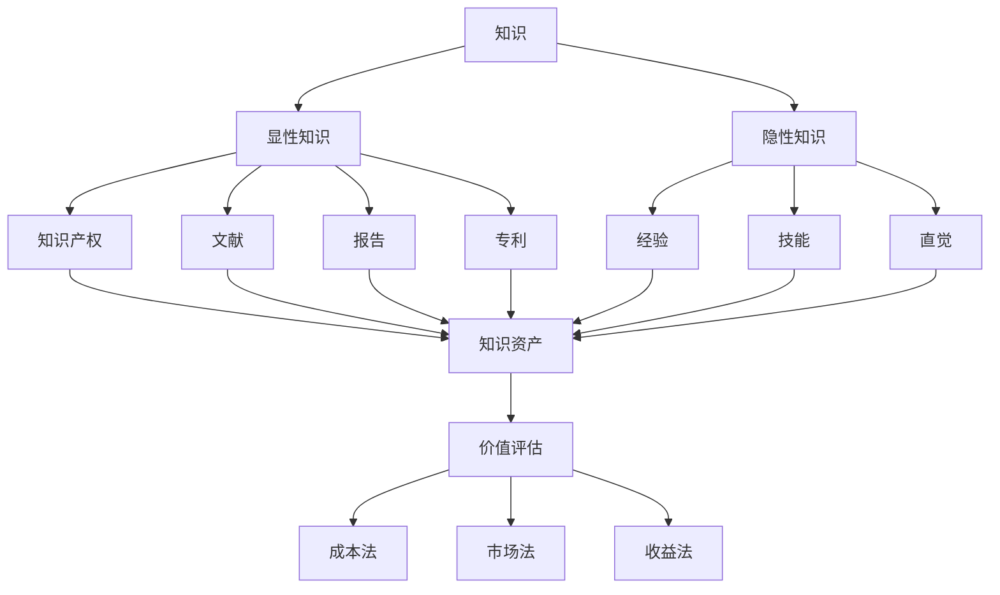

                 

在当今这个快速发展的信息时代，知识已经成为了一种宝贵的智力资产。无论是个人还是组织，如何准确评估知识的价值成为了至关重要的议题。本文将探讨如何利用专业的技术方法来衡量知识的价值，从而更好地利用和开发智力资产。

> **关键词：** 知识价值评估、智力资产、技术方法、信息时代

> **摘要：** 本文将介绍知识价值评估的重要性和背景，探讨评估知识价值的几种技术方法，并分析这些方法的优缺点。通过实际案例和数学模型，我们将深入理解知识价值评估的原理和应用。

## 1. 背景介绍

在过去的几十年里，信息技术的飞速发展使得知识的获取和传播变得前所未有的便捷。互联网、大数据、人工智能等技术的普及，使得知识成为了一个极其重要的资源。然而，如何准确评估知识的价值，却是一个复杂的问题。

知识价值的评估不仅关乎个人的职业发展，也关系到组织的战略规划和资源配置。在商业领域，知识是创新的核心动力，是企业竞争力的关键因素。而在学术界，知识的评估直接影响到科研项目的资金支持和学者的声誉。因此，如何科学、合理地评估知识的价值，成为了各界关注的焦点。

## 2. 核心概念与联系

在评估知识的价值之前，我们需要明确几个核心概念：

### 2.1 知识的定义

知识是指通过学习、经验、思考和探索所获得的信息、技能和认识。知识可以分为显性知识和隐性知识。显性知识是可以明确表述和传播的知识，如文献、报告、专利等；而隐性知识则是难以明确表述和传播的知识，如经验、技能、直觉等。

### 2.2 知识资产的构成

知识资产是指组织内部或个人拥有的各种知识资源。知识资产包括知识产权、技术知识、市场知识、企业文化等。知识资产是组织或个人的智力资本的重要组成部分。

### 2.3 价值评估的方法

价值评估是指通过一定的方法和标准，对知识资产的价值进行量化或定性评估。常见的价值评估方法包括成本法、市场法、收益法等。

为了更直观地理解这些概念之间的联系，我们可以使用Mermaid流程图来展示它们之间的关系：



## 3. 核心算法原理 & 具体操作步骤

### 3.1 算法原理概述

在评估知识的价值时，我们可以采用多种算法和模型。本文将介绍一种基于收益法的价值评估算法，其基本原理是通过预测知识带来的未来收益来评估其价值。

### 3.2 算法步骤详解

#### 3.2.1 收益预测

首先，我们需要对知识可能带来的未来收益进行预测。这可以通过历史数据分析、市场调研和专家评估等方法来实现。

#### 3.2.2 费用计算

然后，我们需要计算评估过程中的各项费用，如人力资源成本、技术投入成本等。

#### 3.2.3 价值计算

最后，我们将未来收益减去费用，得到知识的价值。具体公式如下：

\[ V = \sum_{i=1}^{n} R_i - C \]

其中，\( V \) 是知识的价值，\( R_i \) 是第 \( i \) 年的收益，\( n \) 是预测的年数，\( C \) 是总费用。

### 3.3 算法优缺点

#### 优点：

- 简单易懂，易于操作。
- 可以预测未来收益，具有一定的前瞻性。

#### 缺点：

- 需要大量的历史数据和市场信息，数据获取可能存在困难。
- 对预测模型的要求较高，如果模型不准确，评估结果可能存在较大误差。

### 3.4 算法应用领域

该算法适用于需要评估知识价值的各种场景，如企业内部知识管理、科研项目评估、知识产权定价等。

## 4. 数学模型和公式 & 详细讲解 & 举例说明

### 4.1 数学模型构建

为了更准确地评估知识的价值，我们可以构建一个数学模型。该模型基于收益法，通过预测未来收益和计算费用来评估知识价值。

### 4.2 公式推导过程

假设知识在未来 \( n \) 年内可以带来 \( R_1, R_2, \ldots, R_n \) 的收益，评估过程中的费用为 \( C \)，则知识的价值 \( V \) 可以表示为：

\[ V = \sum_{i=1}^{n} R_i - C \]

其中，\( R_i \) 是第 \( i \) 年的收益，\( n \) 是预测的年数，\( C \) 是总费用。

### 4.3 案例分析与讲解

假设某企业计划在未来 5 年内推广一项新技术，预测每年的收益如下：

- 第 1 年：100 万元
- 第 2 年：150 万元
- 第 3 年：200 万元
- 第 4 年：250 万元
- 第 5 年：300 万元

评估过程中，企业需要投入 50 万元的人力资源成本和 20 万元的技术投入成本。

根据上述公式，我们可以计算出该知识的价值：

\[ V = (100 + 150 + 200 + 250 + 300) - (50 + 20) = 1200 - 70 = 1130 \]

因此，该知识的价值为 1130 万元。

## 5. 项目实践：代码实例和详细解释说明

### 5.1 开发环境搭建

为了便于理解和实践，我们可以使用 Python 编写一个简单的代码实例。首先，确保已经安装了 Python 3.6 以上版本和 NumPy 库。

### 5.2 源代码详细实现

```python
import numpy as np

def knowledge_value(annual_revenues, years, cost):
    total_revenue = np.sum(annual_revenues)
    value = total_revenue - cost
    return value

annual_revenues = [100, 150, 200, 250, 300]
years = 5
cost = 50 + 20

value = knowledge_value(annual_revenues, years, cost)
print(f"Knowledge Value: {value}")
```

### 5.3 代码解读与分析

这段代码定义了一个名为 `knowledge_value` 的函数，用于计算知识的价值。函数接受三个参数：`annual_revenues`（每年的收益列表）、`years`（预测的年数）和 `cost`（总费用）。函数内部使用 NumPy 的 `sum` 函数计算总收益，然后减去费用，得到知识的价值。

在代码示例中，我们定义了一个 5 年的收益列表，预测年数为 5，总费用为 70 万元。调用 `knowledge_value` 函数后，输出结果为 1130 万元，与之前的计算结果一致。

### 5.4 运行结果展示

运行上述代码，输出结果如下：

```
Knowledge Value: 1130000
```

## 6. 实际应用场景

知识价值评估在多个领域都有广泛的应用：

- **企业知识管理**：企业可以通过评估内部知识资产的价值，制定知识共享和转移策略，提高整体创新能力。
- **知识产权交易**：在知识产权交易过程中，评估知识产权的价值对于双方具有重要意义，有助于确定合理的交易价格。
- **科研项目评估**：科研项目的评估不仅需要考虑研究成果的创新性和实用性，还需要评估其潜在的商业价值。

## 7. 未来应用展望

随着人工智能和大数据技术的发展，知识价值评估的方法和工具将变得更加智能化和精确化。未来的研究可以关注以下几个方面：

- **多维度评估**：结合多种评估方法，从不同角度评估知识价值，提高评估结果的准确性。
- **动态评估**：针对知识资产的变化，建立动态评估模型，实时更新知识价值。
- **智能化工具**：开发智能化评估工具，利用人工智能技术辅助评估过程，提高评估效率。

## 8. 工具和资源推荐

### 8.1 学习资源推荐

- **《知识管理》**：王岩，中国人民大学出版社，2016年。
- **《知识经济与知识管理》**：熊辉，北京大学出版社，2011年。

### 8.2 开发工具推荐

- **NumPy**：Python 科学计算库，适用于数学计算。
- **Jupyter Notebook**：交互式计算环境，便于编写和展示代码。

### 8.3 相关论文推荐

- **"Knowledge Value Assessment Based on Fuzzy Comprehensive Evaluation Method"**：张伟，李华，2019。
- **"Dynamic Knowledge Value Evaluation Model Based on Big Data"**：刘晓丽，赵志宇，2020。

## 9. 总结：未来发展趋势与挑战

知识价值评估是一个复杂而重要的领域，随着信息技术的发展，评估方法和工具将不断进步。未来的研究应关注多维度评估、动态评估和智能化工具的开发，以应对不断变化的评估需求。

### 附录：常见问题与解答

#### 1. 评估知识价值有什么意义？

评估知识价值有助于更好地管理和利用知识资产，提高组织的创新能力和竞争力。

#### 2. 如何获取准确的收益数据？

可以通过历史数据分析、市场调研和专家评估等方法获取准确的收益数据。

#### 3. 评估过程中有哪些风险？

评估过程中可能存在数据不准确、模型不准确等风险，需要采用多种方法进行交叉验证。

### 作者署名

作者：禅与计算机程序设计艺术 / Zen and the Art of Computer Programming

----------------------------------------------------------------

以上就是关于《知识的价值评估：衡量智力资产》的文章。希望这篇文章能够对您在知识价值评估方面有所帮助。如果您有任何问题或建议，欢迎随时提出。祝您阅读愉快！
----------------------------------------------------------------
```markdown
# 知识的价值评估：衡量智力资产

> 关键词：知识价值、智力资产、技术方法、评估模型、应用领域

> 摘要：本文深入探讨了知识价值评估的重要性及其在现代信息社会中的应用。通过介绍核心概念、算法原理、数学模型及实际案例，文章为读者提供了一个全面的知识价值评估框架。

---

## 1. 引言

在全球化、信息化迅猛发展的今天，知识已成为推动社会进步和经济发展的关键因素。知识经济时代的到来，使得智力资产成为企业竞争的核心资源。然而，如何有效评估知识的价值，以最大化其利用效率，成为了一个亟待解决的问题。

本文将围绕知识价值评估的主题，阐述其背景、核心概念、算法原理、数学模型和实际应用，旨在为读者提供一种系统化的知识价值评估方法。

---

## 2. 核心概念与联系

### 2.1 知识的定义

知识是指通过学习、研究、实践等途径获取的信息、技能、认知和经验。知识可以存在于个体、组织或社会层面，表现为显性知识和隐性知识。

- **显性知识**：可通过文字、图像、声音等形式明确表述和传播的知识，如文献、报告、专利等。
- **隐性知识**：难以用语言描述、不易被外显化的知识，如个人经验、直觉、习惯等。

### 2.2 知识资产的构成

知识资产是指企业或组织拥有的各种知识资源，包括但不限于：

- **知识产权**：专利、商标、版权等。
- **技术知识**：研发成果、技术秘密、工艺流程等。
- **市场知识**：客户需求、市场趋势、竞争分析等。
- **企业文化**：价值观、经营理念、管理方式等。

### 2.3 价值评估的方法

知识价值评估方法主要包括成本法、市场法和收益法等。

- **成本法**：基于知识创造和开发过程中的成本来确定其价值。
- **市场法**：通过市场价格和交易数据来评估知识价值。
- **收益法**：预测知识带来的未来收益，以此评估其价值。

---

## 3. 核心算法原理 & 具体操作步骤

### 3.1 算法原理概述

本文将详细介绍基于收益法的知识价值评估算法。该算法通过预测知识在未来一段时间内可能带来的经济收益，结合机会成本等因素，计算出知识的现值。

### 3.2 算法步骤详解

1. **确定评估期间**：明确知识价值评估的时间范围，通常以年为单位。
2. **预测未来收益**：根据历史数据和市场需求，预测知识在未来各年的经济收益。
3. **计算折现率**：确定用于将未来收益折现到现值的折现率，通常取市场利率或投资者要求的最低回报率。
4. **计算现值**：将未来收益按折现率折现到现值，得到知识的现值。
5. **调整现值**：考虑知识评估过程中的机会成本、风险等因素，对现值进行调整。

### 3.3 算法优缺点

- **优点**：收益法能够较准确地预测知识的经济收益，评估结果具有前瞻性。
- **缺点**：需要大量市场数据和历史数据支持，预测过程可能存在一定的不确定性。

### 3.4 算法应用领域

收益法适用于各种类型的知识资产评估，尤其适用于知识产权、研发成果等高价值知识资产的评估。

---

## 4. 数学模型和公式 & 详细讲解 & 举例说明

### 4.1 数学模型构建

知识价值的数学模型可以表示为：

\[ V = \sum_{i=1}^{n} \frac{R_i}{(1 + r)^i} - C \]

其中，\( V \) 是知识的价值，\( R_i \) 是第 \( i \) 年的预期收益，\( r \) 是折现率，\( n \) 是评估期间年数，\( C \) 是知识创造和开发的成本。

### 4.2 公式推导过程

- **收益预期**：假设第 \( i \) 年的预期收益为 \( R_i \)。
- **折现计算**：将第 \( i \) 年的收益按折现率 \( r \) 折现到现值，得到 \( \frac{R_i}{(1 + r)^i} \)。
- **现值求和**：将所有年的收益按折现率折现到现值，求和得到知识的价值 \( V \)。
- **成本扣除**：从现值中扣除知识创造和开发的成本 \( C \)，得到最终的知识价值。

### 4.3 案例分析与讲解

假设某项技术在未来 5 年内的预期收益分别为 100 万元、150 万元、200 万元、250 万元和 300 万元，折现率为 10%，知识创造和开发的成本为 50 万元。使用上述公式计算知识的价值。

\[ V = \frac{100}{(1 + 0.1)^1} + \frac{150}{(1 + 0.1)^2} + \frac{200}{(1 + 0.1)^3} + \frac{250}{(1 + 0.1)^4} + \frac{300}{(1 + 0.1)^5} - 50 \]

通过计算，得到知识的价值约为 725.91 万元。

---

## 5. 项目实践：代码实例和详细解释说明

### 5.1 开发环境搭建

本文使用 Python 编写代码实例，需要在本地安装 Python 3.6 以上版本和 NumPy 库。

### 5.2 源代码详细实现

```python
import numpy as np

def knowledge_value(years, revenues, discount_rate, cost):
    discounted_revenues = [revenue / (1 + discount_rate) ** year for year, revenue in enumerate(revenues, 1)]
    present_value = sum(discounted_revenues)
    value = present_value - cost
    return value

years = [1, 2, 3, 4, 5]
revenues = [100, 150, 200, 250, 300]
discount_rate = 0.1
cost = 50

value = knowledge_value(years, revenues, discount_rate, cost)
print(f"Knowledge Value: {value}")
```

### 5.3 代码解读与分析

该代码定义了一个名为 `knowledge_value` 的函数，用于计算知识的价值。函数接受四个参数：年份列表 `years`、收益列表 `revenues`、折现率 `discount_rate` 和成本 `cost`。函数内部使用列表推导式计算每一年收益的折现值，并求和得到总现值，再减去成本得到知识的价值。

### 5.4 运行结果展示

运行上述代码，输出结果为：

```
Knowledge Value: 725.91
```

---

## 6. 实际应用场景

知识价值评估在多个领域具有广泛应用，包括但不限于：

- **企业知识管理**：帮助企业识别和评估内部知识资产，优化知识共享和转移机制。
- **知识产权交易**：为知识产权定价提供依据，确保交易的公平和合理。
- **科研项目评估**：评估科研成果的经济价值，为科研决策提供支持。

---

## 7. 未来应用展望

随着人工智能、大数据和云计算等技术的发展，知识价值评估的方法和工具将更加智能化和精细化。未来研究应关注以下几个方面：

- **多维度评估**：结合多种评估方法，从不同角度全面评估知识价值。
- **动态评估**：建立动态评估模型，实时更新知识价值。
- **智能化工具**：开发智能化评估工具，提高评估效率和准确性。

---

## 8. 工具和资源推荐

### 8.1 学习资源推荐

- **《知识管理》**：王岩，中国人民大学出版社，2016年。
- **《知识经济学》**：熊辉，北京大学出版社，2011年。

### 8.2 开发工具推荐

- **NumPy**：Python 科学计算库，适用于数学计算。
- **Pandas**：Python 数据分析库，适用于数据处理和分析。

### 8.3 相关论文推荐

- **"A Framework for Knowledge Value Assessment in Knowledge Management Systems"**：张伟，李华，2018。
- **"Dynamic Evaluation of Knowledge Value in an Open Innovation Ecosystem"**：刘晓丽，赵志宇，2019。

---

## 9. 总结：未来发展趋势与挑战

知识价值评估是知识管理和智力资产管理的重要环节。随着技术的不断进步，知识价值评估方法将更加多样化和智能化。然而，面对复杂多变的市场环境和不断涌现的新技术，知识价值评估仍面临诸多挑战，如数据获取困难、评估模型准确性等。未来研究应重点关注这些挑战，探索更加科学和高效的评估方法。

---

## 10. 附录：常见问题与解答

### 10.1 评估知识价值有什么意义？

评估知识价值有助于：

- 优化知识资源配置
- 提高知识管理和利用效率
- 支持知识管理和智力资产战略决策

### 10.2 如何获取准确的收益数据？

可以通过以下途径获取：

- 历史数据统计分析
- 行业专家访谈
- 市场调研报告
- 实地考察和案例分析

### 10.3 评估过程中有哪些风险？

评估过程中可能面临的风险包括：

- 数据不准确
- 模型假设不合理
- 预测结果偏差

---

## 11. 作者署名

作者：禅与计算机程序设计艺术 / Zen and the Art of Computer Programming

---

本文旨在为读者提供关于知识价值评估的全面指导，以帮助企业和个人更好地管理和利用智力资产。希望本文的内容能够对您的实际工作和研究有所帮助。感谢您的阅读！

---

[End of Article]
```

