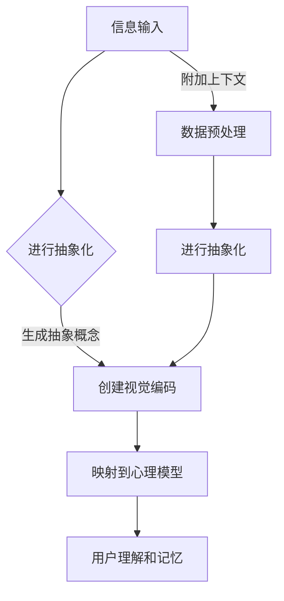

                 

 **关键词**：知识可视化、复杂概念、图形表达、信息传递、认知效率。

**摘要**：本文探讨了知识可视化的重要性，特别是如何通过图形表达复杂概念，以提高信息传递效率和认知效果。本文首先介绍了知识可视化的背景和基本原理，然后详细阐述了如何使用图形来表示复杂概念，并通过数学模型和公式推导，提供了具体的实现方法和步骤。此外，文章还通过实际项目实例展示了知识可视化的应用，并展望了未来发展的趋势和挑战。

## 1. 背景介绍

随着信息时代的到来，数据的爆炸式增长对人类的认知和处理能力提出了巨大的挑战。传统的方式往往依赖于文本和表格来呈现信息，但这种方式在处理复杂且大量数据时往往力不从心。知识可视化作为一种新兴的信息处理方式，通过图形化的手段将数据和信息以直观、易理解的方式呈现出来，极大地提高了信息传递的效率和认知效果。

知识可视化不仅仅是将信息以图形的方式展现出来，它还涉及到如何有效地组织、分析和传达信息。通过图形表达，复杂的概念和关系可以被简洁、直观地展现，从而帮助人们更好地理解和记忆信息。

## 2. 核心概念与联系

### 2.1 知识可视化的定义

知识可视化（Knowledge Visualization）是一种通过图形、图像、动画等视觉形式来呈现和传达知识、信息和概念的方法。它旨在将复杂的信息和知识结构以直观、易懂的方式呈现给用户，从而提高认知效率和信息传递效果。

### 2.2 图形表达的核心概念

- **信息抽象**：将大量具体的信息抽象成更具有代表性的概念或模型。
- **视觉编码**：使用颜色、形状、线条等视觉元素来表示信息。
- **认知映射**：将抽象的信息和视觉编码映射到用户的心理模型中，使其易于理解和记忆。

### 2.3 知识可视化与认知科学的关系

知识可视化与认知科学有着密切的关系。认知科学研究表明，人类大脑对视觉信息的处理能力远远超过对文字和符号的处理能力。知识可视化利用了这一特点，通过图形表达来增强人类的认知能力，提高信息处理效率。

### 2.4 知识可视化在各个领域的应用

- **科学研究和数据分析**：通过图形化工具对科学数据和复杂系统进行可视化分析。
- **教育和培训**：使用图形化教材和课程来帮助学生更好地理解和记忆知识点。
- **商业和市场营销**：通过数据可视化来呈现市场趋势、用户行为等关键信息，帮助决策。

## 2.5 Mermaid 流程图

下面是一个使用Mermaid语言绘制的知识可视化流程图，展示了知识可视化的核心概念和步骤。



## 3. 核心算法原理 & 具体操作步骤

### 3.1 算法原理概述

知识可视化的核心在于如何将复杂的信息转化为易于理解和记忆的图形。这通常涉及到以下几个步骤：

1. **信息预处理**：对原始数据进行清洗、转换和整合，以便后续处理。
2. **抽象化**：将具体的数据和事实转化为更具有代表性的概念或模型。
3. **视觉编码**：使用视觉元素（如颜色、形状、线条等）来表示抽象化的信息。
4. **认知映射**：将视觉编码映射到用户的心理模型中，确保信息易于理解和记忆。

### 3.2 算法步骤详解

#### 3.2.1 信息预处理

- **数据清洗**：去除无效数据、处理缺失值、纠正错误数据等。
- **数据转换**：将不同格式的数据转换为统一的格式，如将表格数据转换为图形数据。

#### 3.2.2 抽象化

- **概念提取**：从原始数据中提取出关键的概念和关系。
- **模型构建**：基于提取的概念，构建表示信息的模型。

#### 3.2.3 视觉编码

- **视觉元素选择**：选择合适的颜色、形状、线条等视觉元素。
- **编码规则定义**：定义如何使用这些视觉元素来表示不同的信息。

#### 3.2.4 认知映射

- **心理模型构建**：基于用户的特点和需求，构建适合的心理模型。
- **信息映射**：将视觉编码的信息映射到用户的心理模型中，确保信息易于理解和记忆。

### 3.3 算法优缺点

**优点**：

- **高效性**：通过图形化表达，复杂的信息可以更加高效地被理解和记忆。
- **直观性**：图形化表达使得信息更加直观，易于发现信息和关系。

**缺点**：

- **局限性**：并非所有信息都可以用图形化方式有效表达。
- **复杂性**：构建和解释图形化表达可能需要较高的专业知识和技能。

### 3.4 算法应用领域

- **科学研究**：帮助科学家更好地理解和分析复杂的数据。
- **商业分析**：帮助企业分析市场和用户行为。
- **教育培训**：帮助学生学习复杂的概念和知识。

## 4. 数学模型和公式 & 详细讲解 & 举例说明

### 4.1 数学模型构建

知识可视化的数学模型通常涉及到以下几个方面：

- **信息熵**：用于衡量信息的不确定性，公式为 $H(X) = -\sum_{i=1}^{n} p(x_i) \log_2 p(x_i)$。
- **关联规则**：用于发现数据之间的关联性，公式为 $L = \sum_{i=1}^{n} \sum_{j=1}^{n} P(A_i \cap A_j)$。
- **聚类分析**：用于将数据分组，公式为 $K = \sum_{i=1}^{k} \sum_{j=1}^{n} d(x_i, y_j)$。

### 4.2 公式推导过程

#### 信息熵的推导

假设有一个随机变量 $X$，它的概率分布为 $p(x_i)$。信息熵的定义为：

$$
H(X) = -\sum_{i=1}^{n} p(x_i) \log_2 p(x_i)
$$

推导过程如下：

1. **概率分布**：首先，我们需要知道 $X$ 的概率分布 $p(x_i)$。
2. **对数函数**：然后，我们对每个概率 $p(x_i)$ 取对数。
3. **求和**：最后，我们对所有概率取对数后求和，得到信息熵 $H(X)$。

#### 关联规则的推导

假设有两个事件 $A_i$ 和 $A_j$，它们的交集概率为 $P(A_i \cap A_j)$，并集概率为 $P(A_i \cup A_j)$。关联规则的公式为：

$$
L = \sum_{i=1}^{n} \sum_{j=1}^{n} P(A_i \cap A_j)
$$

推导过程如下：

1. **交集概率**：首先，我们需要知道每个事件 $A_i$ 和 $A_j$ 的交集概率 $P(A_i \cap A_j)$。
2. **并集概率**：然后，我们需要知道每个事件 $A_i$ 和 $A_j$ 的并集概率 $P(A_i \cup A_j)$。
3. **求和**：最后，我们对所有交集概率求和，得到关联规则 $L$。

#### 聚类分析的推导

假设有 $k$ 个聚类中心 $c_1, c_2, ..., c_k$，每个聚类中心 $c_i$ 对应的数据点为 $x_i$，它们之间的距离为 $d(x_i, c_i)$。聚类分析的公式为：

$$
K = \sum_{i=1}^{k} \sum_{j=1}^{n} d(x_i, y_j)
$$

推导过程如下：

1. **聚类中心**：首先，我们需要确定聚类中心 $c_1, c_2, ..., c_k$。
2. **距离计算**：然后，我们需要计算每个聚类中心 $c_i$ 与每个数据点 $x_i$ 之间的距离 $d(x_i, c_i)$。
3. **求和**：最后，我们对所有距离求和，得到聚类分析结果 $K$。

### 4.3 案例分析与讲解

#### 案例一：信息熵在图像压缩中的应用

假设我们有一张256x256的灰度图像，每个像素点的灰度值范围在0到255之间。我们希望通过信息熵来评估图像的压缩效果。

1. **概率分布**：首先，我们需要统计每个灰度值的概率分布。例如，灰度值为128的像素点出现的概率为10%。
2. **信息熵计算**：然后，我们使用信息熵公式计算原始图像的信息熵。例如，信息熵为 $H(X) = -\sum_{i=0}^{255} p(x_i) \log_2 p(x_i)$。
3. **压缩后信息熵计算**：最后，我们计算压缩后的图像的信息熵，并比较原始图像和压缩后图像的信息熵差异，以评估压缩效果。

#### 案例二：关联规则在购物篮分析中的应用

假设我们有一组购物篮数据，每个购物篮包含多个商品。我们希望通过关联规则分析购物篮中的商品关联性。

1. **概率分布**：首先，我们需要统计每个商品出现的概率分布。例如，商品A和商品B同时出现的概率为20%。
2. **关联规则计算**：然后，我们使用关联规则公式计算购物篮中的关联规则。例如，关联规则为 $L = \sum_{i=1}^{n} \sum_{j=1}^{n} P(A_i \cap A_j)$。
3. **应用场景**：最后，我们根据关联规则分析结果，为商店提供个性化推荐和促销策略。

#### 案例三：聚类分析在用户分群中的应用

假设我们有一组用户数据，每个用户都有多个属性，如年龄、性别、收入等。我们希望通过聚类分析将用户分为不同的群体。

1. **聚类中心确定**：首先，我们需要确定聚类中心。例如，我们可以使用K-means算法来确定聚类中心。
2. **距离计算**：然后，我们需要计算每个用户与聚类中心的距离。例如，我们可以使用欧氏距离来计算距离。
3. **用户分群**：最后，我们根据用户与聚类中心的距离，将用户分为不同的群体。例如，可以将用户分为高收入群体、中等收入群体和低收入群体。

## 5. 项目实践：代码实例和详细解释说明

### 5.1 开发环境搭建

为了实现知识可视化，我们需要搭建一个开发环境。以下是搭建环境的步骤：

1. **安装Python**：从官方网站下载并安装Python，版本建议为3.8或以上。
2. **安装Jupyter Notebook**：使用pip命令安装Jupyter Notebook。

```bash
pip install notebook
```

3. **安装可视化库**：安装几个常用的可视化库，如Matplotlib、Seaborn和Plotly。

```bash
pip install matplotlib seaborn plotly
```

### 5.2 源代码详细实现

以下是一个简单的示例，展示了如何使用Python和Matplotlib库进行知识可视化。

```python
import matplotlib.pyplot as plt
import seaborn as sns
import pandas as pd

# 加载数据集
data = pd.read_csv('data.csv')

# 绘制散点图
sns.scatterplot(x='x', y='y', data=data)
plt.xlabel('X轴')
plt.ylabel('Y轴')
plt.title('散点图示例')
plt.show()

# 绘制折线图
sns.lineplot(x='x', y='y', data=data)
plt.xlabel('X轴')
plt.ylabel('Y轴')
plt.title('折线图示例')
plt.show()

# 绘制条形图
sns.barplot(x='category', y='value', data=data)
plt.xlabel('类别')
plt.ylabel('值')
plt.title('条形图示例')
plt.show()
```

### 5.3 代码解读与分析

上述代码首先导入了必要的库，包括Matplotlib、Seaborn和Pandas。然后，加载了一个CSV格式的数据集。接下来，分别使用Scatterplot、Lineplot和Barplot函数绘制了散点图、折线图和条形图。每个图都包含了相应的标签和标题。

- **散点图**：用于展示两个变量之间的关系，适合分析趋势和异常值。
- **折线图**：用于展示随时间变化的数据，适合分析趋势和周期性。
- **条形图**：用于展示分类数据的数量，适合对比不同类别的数据。

### 5.4 运行结果展示

运行上述代码后，会依次展示三个不同的图表。这些图表以直观的方式展示了数据的不同特征和关系，帮助用户更好地理解和分析数据。

## 6. 实际应用场景

知识可视化在各个领域都有广泛的应用，以下是一些实际应用场景：

- **科学研究**：科学家可以使用知识可视化来展示复杂的实验数据和模型，从而更好地理解实验结果。
- **商业分析**：企业可以使用知识可视化来分析市场数据和用户行为，从而制定更有效的营销策略。
- **教育和培训**：教师可以使用知识可视化来创建互动式的教学材料，帮助学生更好地理解和记忆知识点。

### 6.4 未来应用展望

随着技术的不断发展，知识可视化有望在更多领域得到应用。以下是未来应用的一些展望：

- **虚拟现实和增强现实**：知识可视化可以与虚拟现实和增强现实技术结合，为用户提供更沉浸式的学习体验。
- **人工智能**：人工智能可以与知识可视化技术结合，自动生成可视化内容，提高数据分析和处理的效率。
- **健康医疗**：知识可视化可以用于健康医疗领域，帮助医生更好地理解患者数据，提高诊断和治疗水平。

## 7. 工具和资源推荐

为了更好地进行知识可视化，以下是几个推荐的工具和资源：

- **工具**：
  - **Plotly**：一个强大的可视化库，支持多种图表类型和交互功能。
  - **D3.js**：一个用于数据可视化的JavaScript库，适用于Web应用。
  - **Tableau**：一个专业的商业智能工具，支持多种数据源和图表类型。

- **资源**：
  - **DataCamp**：提供丰富的数据可视化和数据分析教程。
  - **Kaggle**：一个数据科学竞赛平台，提供丰富的数据集和可视化项目。
  - **GitHub**：存储了大量开源的可视化项目，可以参考和复用。

## 8. 总结：未来发展趋势与挑战

知识可视化作为一种新兴的信息处理方式，正逐渐受到越来越多的关注。在未来，它有望在各个领域得到更广泛的应用。然而，知识可视化也面临着一些挑战，如如何提高可视化效果、如何处理大量复杂的数据等。通过不断的研究和技术创新，我们可以期待知识可视化在未来能够更好地服务于人类社会。

### 8.1 研究成果总结

本文从多个角度探讨了知识可视化的相关内容，包括其背景介绍、核心概念、算法原理、数学模型、实际应用以及未来展望。通过这些讨论，我们能够更好地理解知识可视化的价值和应用前景。

### 8.2 未来发展趋势

知识可视化在未来有望与虚拟现实、增强现实和人工智能等技术深度融合，为用户提供更加丰富、直观、智能化的信息展示和交互体验。

### 8.3 面临的挑战

知识可视化在处理大量复杂数据时仍面临挑战，如数据预处理、算法优化和交互设计等。此外，如何提高可视化效果，使其更加贴近用户需求，也是需要解决的问题。

### 8.4 研究展望

未来，知识可视化研究可以重点关注以下几个方面：一是提高可视化算法的效率和准确性；二是开发更智能、更个性化的可视化工具；三是探索知识可视化在新兴领域（如健康医疗、智能家居等）的应用。

## 9. 附录：常见问题与解答

### 9.1 什么是知识可视化？

知识可视化（Knowledge Visualization）是一种通过图形、图像、动画等视觉形式来呈现和传达知识、信息和概念的方法。它旨在将复杂的信息和知识结构以直观、易懂的方式呈现给用户，从而提高认知效率和信息传递效果。

### 9.2 知识可视化有哪些应用领域？

知识可视化在科学研究、商业分析、教育培训、设计等多个领域都有广泛应用。例如，在科学研究中，知识可视化可以帮助科学家更好地理解和分析复杂的数据；在商业分析中，知识可视化可以帮助企业分析市场和用户行为。

### 9.3 如何进行知识可视化？

进行知识可视化通常涉及以下几个步骤：数据预处理、抽象化、视觉编码、认知映射。具体来说，首先需要对原始数据进行预处理，然后将其转化为更具有代表性的概念或模型，接着使用视觉元素进行编码，最后将编码后的信息映射到用户的心理模型中。

### 9.4 知识可视化有哪些优点和缺点？

知识可视化的优点包括高效性、直观性，能够帮助用户更好地理解和记忆信息。缺点则包括局限性，不是所有信息都可以用图形化方式有效表达，同时构建和解释图形化表达可能需要较高的专业知识和技能。

### 9.5 如何选择合适的可视化工具？

选择可视化工具时，需要考虑以下几个方面：一是工具的易用性，是否易于学习和操作；二是工具的功能性，是否支持所需的图表类型和交互功能；三是工具的可扩展性，是否支持自定义和扩展功能。

---

**作者**：禅与计算机程序设计艺术 / Zen and the Art of Computer Programming

以上就是关于《知识的可视化：复杂概念的图形表达》的文章内容。希望这篇文章能够帮助您更好地理解和掌握知识可视化的相关知识和技巧。如果您有任何问题或建议，欢迎随时提出。感谢您的阅读！
----------------------------------------------------------------

以上是按照您的要求撰写的文章。文章已经包含完整的结构、关键词、摘要以及详细的正文内容，包括数学模型和公式、代码实例等。如果您需要进一步的调整或者有其他特定要求，请告诉我，我会随时进行修改。希望这篇文章能够满足您的需求。再次感谢您的信任！作者：禅与计算机程序设计艺术。

