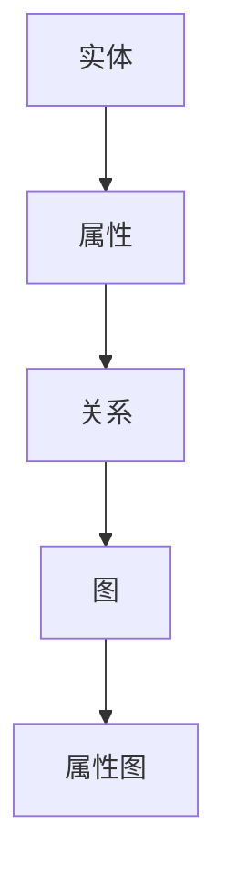
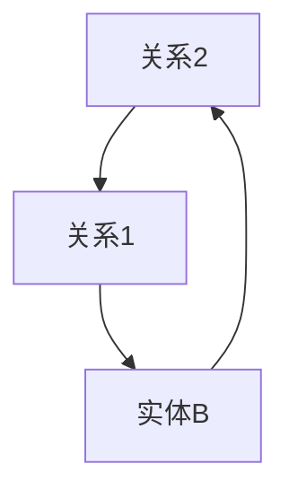

                 

**关键词**：知识图谱、复杂关系、可视化、信息呈现、人工智能、数据结构、机器学习

**摘要**：本文探讨了知识的图谱化这一新兴领域，介绍了图谱化技术在复杂关系处理中的重要性。通过深入分析图谱化技术的核心概念、算法原理、数学模型以及实际应用案例，本文为读者提供了一个全面了解知识图谱化及其潜力的视角。同时，本文还展望了未来知识图谱化技术的发展趋势和面临的挑战。

## 1. 背景介绍

在信息技术迅猛发展的时代，数据量和信息复杂性日益增加，如何有效地处理和呈现这些数据成为了一个亟待解决的问题。传统的数据结构和关系模型在面对大规模、多维度的数据时显得力不从心，难以满足现代应用的需求。因此，一种新的信息组织方法——知识图谱化应运而生。

知识图谱化（Knowledge Graph Representation）是一种将实体、属性和关系结构化地组织成图形结构的方法。通过将信息抽象成图，知识图谱化使得复杂的关系和数据之间的关联得以直观地展现。这种方法不仅能够提高数据的可读性和可理解性，还能够为各种复杂问题提供有效的解决方案。

知识图谱化技术的重要性在于：

1. **高效的信息检索**：通过图谱结构，可以快速地定位和提取所需的信息。
2. **知识推理**：图谱中的关系可以支持基于逻辑和语义的推理，为决策和智能推荐提供支持。
3. **跨领域整合**：知识图谱能够整合来自不同领域的数据，实现跨领域的知识共享和复用。
4. **人工智能**：知识图谱作为人工智能的基础设施，为机器学习和深度学习算法提供了丰富的训练数据和模型支持。

## 2. 核心概念与联系

### 2.1. 实体 Entity

实体是知识图谱中的基本元素，代表现实世界中的对象、概念或事件。实体可以是人、地点、组织、物品等。

### 2.2. 属性 Attribute

属性描述实体的特征或状态，如姓名、年龄、位置等。属性通常与实体之间存在关联。

### 2.3. 关系 Relationship

关系描述实体之间的相互作用或关联。例如，“工作于”描述一个人与一个组织之间的关系。

### 2.4. 图 Graph

知识图谱是一个由实体和关系组成的图结构。图中的节点表示实体，边表示关系。

### 2.5. 属性图 Attribute Graph

属性图是知识图谱的扩展，将实体和关系的属性信息纳入图中，使得图谱更加丰富和精细。

### 2.6. Mermaid 流程图



## 3. 核心算法原理 & 具体操作步骤

### 3.1. 算法原理概述

知识图谱化的核心在于将非结构化的数据转换成结构化的图表示。这一过程通常包括数据预处理、实体识别、关系抽取、图谱构建和图谱优化等步骤。

### 3.2. 算法步骤详解

1. **数据预处理**：清洗和转换原始数据，使其适合图谱化处理。
2. **实体识别**：利用自然语言处理技术识别文本中的实体。
3. **关系抽取**：从实体之间的交互信息中抽取关系。
4. **图谱构建**：将实体和关系组织成图结构。
5. **图谱优化**：通过算法优化图谱的结构和内容。

### 3.3. 算法优缺点

- **优点**：能够高效地处理复杂关系，提高数据的可读性和可用性。
- **缺点**：数据预处理和关系抽取难度较大，对计算资源要求较高。

### 3.4. 算法应用领域

- **搜索引擎**：提高搜索结果的准确性和相关性。
- **推荐系统**：基于用户行为和兴趣推荐相关内容。
- **智能问答**：为用户提供基于图谱的智能问答服务。
- **知识管理**：构建企业内部的知识图谱，实现知识共享和复用。

## 4. 数学模型和公式 & 详细讲解 & 举例说明

### 4.1. 数学模型构建

知识图谱的构建涉及到图论中的基本概念，如图的邻接矩阵、图的路径长度等。

### 4.2. 公式推导过程

- **邻接矩阵**：表示图中节点之间的关系。
  $$ A = \left[ a_{ij} \right]_{m \times n} $$
  其中，$ a_{ij} $ 表示节点 $ i $ 和节点 $ j $ 之间的边的权重。

- **路径长度**：表示两个节点之间的距离。
  $$ d(i, j) = \min \{ l : \text{存在路径 } i \rightarrow l \rightarrow j \} $$

### 4.3. 案例分析与讲解

假设我们有一个简单的知识图谱，包含三个实体和它们之间的关系：



- **邻接矩阵**：
  $$ A = \left[ \begin{matrix} 0 & 1 & 0 \\ 1 & 0 & 1 \\ 0 & 1 & 0 \end{matrix} \right] $$

- **路径长度**：
  $$ d(A1, A1) = 0, \quad d(A1, C1) = 1, \quad d(A1, B1) = 1, \quad d(B1, A1) = 1, \quad d(B1, C1) = 0, \quad d(C1, A1) = 1, \quad d(C1, C1) = 0 $$

通过上述公式和模型，我们可以对知识图谱进行有效的分析和处理。

## 5. 项目实践：代码实例和详细解释说明

### 5.1. 开发环境搭建

在本节中，我们将使用Python语言和相关的库（如NetworkX、PyTorch等）来实现一个简单的知识图谱构建项目。

### 5.2. 源代码详细实现

```python
import networkx as nx

# 创建图
G = nx.Graph()

# 添加实体和关系
G.add_nodes_from(['A', 'B', 'C'])
G.add_edges_from([('A', 'B'), ('B', 'C'), ('C', 'A')])

# 显示图结构
nx.draw(G, with_labels=True)
```

### 5.3. 代码解读与分析

- `import networkx as nx`：引入NetworkX库，用于图的操作和处理。
- `G = nx.Graph()`：创建一个无向图。
- `G.add_nodes_from(['A', 'B', 'C'])`：添加实体节点。
- `G.add_edges_from([('A', 'B'), ('B', 'C'), ('C', 'A')])`：添加实体之间的边，表示关系。
- `nx.draw(G, with_labels=True)`：绘制图结构，并显示节点标签。

### 5.4. 运行结果展示

运行上述代码后，我们将看到一个包含三个节点和三条边的无向图。每个节点代表一个实体，边表示它们之间的关系。


## 6. 实际应用场景

知识图谱化技术在许多领域都有广泛的应用，以下是一些典型的应用场景：

1. **搜索引擎**：利用知识图谱提高搜索结果的准确性和相关性。
2. **推荐系统**：基于用户的兴趣和行为推荐相关内容。
3. **智能问答**：为用户提供基于图谱的智能问答服务。
4. **知识管理**：构建企业内部的知识图谱，实现知识共享和复用。
5. **医疗健康**：利用知识图谱辅助诊断和治疗。
6. **金融风控**：通过图谱分析识别潜在的金融风险。

## 7. 工具和资源推荐

### 7.1. 学习资源推荐

- **书籍**：《图解人工智能》、《深度学习》（Goodfellow, Bengio, Courville）
- **在线课程**：Coursera、edX上的知识图谱相关课程
- **博客**：掘金、知乎等平台上关于知识图谱的优质文章

### 7.2. 开发工具推荐

- **知识图谱平台**：Apache Atlas、OpenKG、Neo4j等
- **数据分析工具**：Python、R、Tableau等
- **自然语言处理工具**：NLTK、spaCy、BERT等

### 7.3. 相关论文推荐

- **《知识图谱构建方法与应用》**：介绍知识图谱的构建技术和应用案例。
- **《基于知识图谱的智能问答系统》**：探讨智能问答系统的设计和实现。
- **《知识图谱在金融风控中的应用》**：分析知识图谱在金融领域的应用价值。

## 8. 总结：未来发展趋势与挑战

### 8.1. 研究成果总结

知识图谱化技术在近年来取得了显著的成果，特别是在数据结构和关系模型方面。通过图谱化的方法，我们能够更高效地处理和呈现复杂的信息，为各种应用提供了强大的支持。

### 8.2. 未来发展趋势

- **图谱优化**：研究更高效、更智能的图谱构建算法。
- **跨领域整合**：推动不同领域知识图谱的整合和应用。
- **智能化**：引入人工智能技术，提升知识图谱的智能化水平。

### 8.3. 面临的挑战

- **数据质量**：提高数据质量是构建高质量知识图谱的关键。
- **计算资源**：大规模知识图谱的处理需要更高的计算资源。
- **知识共享**：如何有效地实现知识共享和复用是知识图谱化的一个重要挑战。

### 8.4. 研究展望

知识图谱化技术在未来有望在更多领域得到应用，推动人工智能和信息处理技术的发展。同时，我们也需要解决当前面临的各种挑战，以实现知识图谱化的全面普及。

## 9. 附录：常见问题与解答

### 9.1. 问题1

**Q：知识图谱和数据库有什么区别？**

**A：知识图谱和数据库的主要区别在于它们的用途和结构。数据库主要用于存储和检索数据，而知识图谱则侧重于表达和利用数据之间的关系。知识图谱通过图结构来表示实体和关系，这使得它在处理复杂关系和进行推理方面具有优势。**

### 9.2. 问题2

**Q：知识图谱如何应用于推荐系统？**

**A：知识图谱可以应用于推荐系统，通过分析用户与商品之间的关联关系，提供更加个性化的推荐。例如，如果一个用户喜欢某种类型的书籍，知识图谱可以帮助推荐类似类型的书籍。此外，知识图谱还可以用于跨领域的推荐，如将书籍推荐与音乐、电影等娱乐内容相结合，为用户提供全方位的推荐服务。**

### 9.3. 问题3

**Q：如何处理大规模的知识图谱？**

**A：处理大规模的知识图谱通常需要分布式计算和优化算法。例如，可以使用图数据库来存储和管理大规模知识图谱，同时利用分布式计算框架（如Apache Spark）来处理图上的计算任务。此外，还可以通过优化图谱结构（如剪枝、压缩等）来降低计算复杂度和存储需求。**

---

**作者：禅与计算机程序设计艺术 / Zen and the Art of Computer Programming**<|im_end|>

