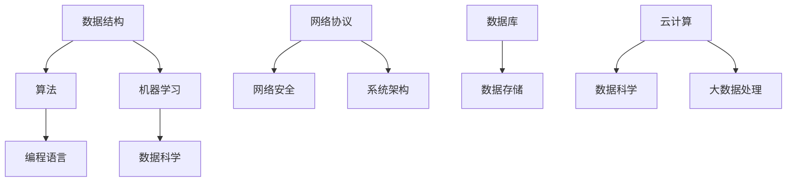

                 

在当今快速发展的技术世界中，知识的积累和应用显得尤为重要。对于IT行业而言，将理论知识转化为实际操作不仅能够提升个人技能，更是推动整个行业进步的关键。本文旨在探讨如何搭建一座从理论到实践的桥梁，通过深入分析核心概念、算法原理、数学模型和实际项目实践，为大家提供一套系统化、可操作的知识应用方法论。本文将分为以下几个部分：

## 1. 背景介绍

知识的应用并非一个新鲜话题，然而在信息爆炸和技术迭代加速的今天，其重要性愈发凸显。从计算机科学到软件开发，从算法研究到数据科学，理论知识的应用贯穿了整个技术链条。然而，如何有效地将抽象的理论转化为具体的实践，成为了每一个技术工作者必须面对的挑战。

本文旨在通过以下几个方面的探讨，帮助读者搭建知识应用的理论与实践之间的桥梁：

- **核心概念与联系**：通过Mermaid流程图，直观展示关键概念和原理的架构。
- **核心算法原理**：详细解释核心算法的运作机制和操作步骤。
- **数学模型与公式**：结合具体案例，推导和讲解重要的数学模型和公式。
- **项目实践**：提供实际代码实例，展示从理论到实践的转化过程。
- **应用场景**：分析不同领域中的实际应用，探讨未来发展趋势。
- **工具和资源推荐**：介绍学习和开发过程中有用的工具和资源。
- **总结与展望**：总结研究成果，展望未来发展趋势和面临的挑战。

## 2. 核心概念与联系

### 2.1. 理论知识的重要性

在IT行业中，理论知识是理解技术本质和解决复杂问题的基石。它不仅帮助我们掌握编程语言和工具，更深入地理解算法和数据结构的内在原理。以下是几组关键概念和其相互联系：

- **数据结构与算法**：数据结构提供了组织数据的方式，而算法则是处理数据的方法。两者相互依存，共同构成了程序设计的基础。
- **机器学习与数据科学**：机器学习依赖于大量的数据来训练模型，而数据科学则通过统计学和概率论等数学工具，分析和解释这些数据。
- **网络与安全**：网络通信是现代IT系统的基础，而安全则是保护数据和系统的关键。网络安全依赖于对网络协议和安全漏洞的深入理解。

### 2.2. Mermaid流程图

为了更直观地展示这些概念之间的联系，我们可以使用Mermaid流程图来构建一个知识体系：



通过这个流程图，我们可以清晰地看到不同概念之间的相互关系，为后续内容的深入探讨提供了结构化的视角。

## 3. 核心算法原理 & 具体操作步骤

### 3.1. 算法原理概述

算法是计算机解决问题的步骤集合，其核心在于高效地处理数据和问题。以下介绍几个重要的算法及其原理：

- **排序算法**：包括冒泡排序、快速排序、归并排序等，用于将一组数据按照特定顺序排列。
- **查找算法**：如二分查找、哈希查找等，用于在数据结构中快速定位特定数据。
- **动态规划**：用于解决最优子结构问题，通过记录子问题的最优解来避免重复计算。

### 3.2. 算法步骤详解

#### 3.2.1. 冒泡排序

冒泡排序的基本原理是通过重复遍历要排序的数列，一次比较两个元素，如果它们的顺序错误就把它们交换过来。遍历数列的工作是重复地进行，直到没有再需要交换，也就是说该数列已经排序完成。

具体步骤如下：

1. 比较相邻的元素，如果第一个比第二个大（假设是升序排序），就交换它们两个。
2. 对每一对相邻元素做同样的工作，从开始第一对到结尾的最后一对。
3. 遍历数列的工作是重复地进行，直到没有再需要交换，也就是说该数列已经排序完成。

#### 3.2.2. 二分查找

二分查找算法的基本思想是：若有序数组中要查找的元素为x，先取中间的元素mid与x比较，如果mid等于x，则查找成功；如果mid大于x，则在mid的左侧查找；如果mid小于x，则在mid的右侧查找。

具体步骤如下：

1. 找到中间的元素mid。
2. 如果mid等于x，查找成功。
3. 如果mid大于x，则在mid的左侧子数组递归查找。
4. 如果mid小于x，则在mid的右侧子数组递归查找。
5. 如果子数组为空，查找失败。

#### 3.2.3. 动态规划

动态规划是一种在数学、管理科学、计算机科学、经济学和生物信息学中使用的，通过把原问题分解为相对简单的子问题的方式求解复杂问题的方法。

具体步骤如下：

1. 定义子问题的值。
2. 递归地解子问题。
3. 记录并重新利用子问题的解，避免重复计算。

### 3.3. 算法优缺点

- **冒泡排序**：优点是简单易懂，但效率较低，不适合大数据量排序。
- **二分查找**：优点是效率高，但要求数据已排序，且不适合小数据量查找。
- **动态规划**：优点是能够解决最优子结构问题，但实现较为复杂。

### 3.4. 算法应用领域

- **排序算法**：广泛应用于数据库和Web应用程序中，用于数据的快速排序。
- **查找算法**：用于数据库查询和Web搜索等场景，以实现快速数据检索。
- **动态规划**：常用于路径规划、资源分配和生物信息学等领域。

## 4. 数学模型和公式 & 详细讲解 & 举例说明

### 4.1. 数学模型构建

数学模型是抽象地表示现实世界中的具体问题的一种数学结构。构建数学模型通常需要以下几个步骤：

1. **问题定义**：明确要解决的问题，并确定问题的目标。
2. **变量定义**：确定影响问题解决的因素，并定义相关变量。
3. **公式推导**：根据问题定义和变量定义，推导出解决该问题的数学公式。
4. **模型验证**：通过实际数据和案例验证模型的准确性和有效性。

### 4.2. 公式推导过程

以线性回归模型为例，其基本公式为：

$$ Y = \beta_0 + \beta_1X + \varepsilon $$

其中，$Y$ 是因变量，$X$ 是自变量，$\beta_0$ 和 $\beta_1$ 是模型的参数，$\varepsilon$ 是误差项。

推导过程如下：

1. **问题定义**：假设我们要预测某个变量$Y$的值，并认为这个值受到另一个变量$X$的影响。
2. **变量定义**：设$Y$为因变量，$X$为自变量，$\beta_0$为截距，$\beta_1$为斜率。
3. **公式推导**：根据问题定义和变量定义，我们可以得到上述线性回归模型的基本公式。
4. **模型验证**：通过收集实际数据，对模型进行拟合和验证，以确定其准确性和适用性。

### 4.3. 案例分析与讲解

以房价预测为例，我们可以使用线性回归模型来预测房价。具体步骤如下：

1. **数据收集**：收集包含房屋面积、房屋类型、地理位置等特征的房屋销售数据。
2. **数据预处理**：对数据进行清洗和预处理，包括缺失值填充、异常值处理等。
3. **模型构建**：使用线性回归模型，将房屋面积作为自变量，房价作为因变量，构建预测模型。
4. **模型训练**：使用历史数据训练模型，得到模型的参数$\beta_0$和$\beta_1$。
5. **模型评估**：使用测试数据对模型进行评估，计算模型的预测误差和准确度。
6. **结果展示**：根据模型预测结果，展示不同特征对房价的影响。

通过上述案例，我们可以看到数学模型在解决实际问题时的重要性和具体应用步骤。

## 5. 项目实践：代码实例和详细解释说明

### 5.1. 开发环境搭建

为了实现本文中的算法和模型，我们需要搭建一个合适的开发环境。以下是一个基本的开发环境搭建步骤：

1. **安装Python**：Python是一种广泛使用的编程语言，适合进行数据分析、机器学习等任务。可以从Python官方网站下载安装包并安装。
2. **安装Jupyter Notebook**：Jupyter Notebook是一个交互式的开发环境，方便编写和运行Python代码。可以通过pip安装：
   ```bash
   pip install notebook
   ```
3. **安装相关库**：根据具体的需求，安装必要的Python库，如NumPy、Pandas、Scikit-learn等。可以使用以下命令进行安装：
   ```bash
   pip install numpy pandas scikit-learn
   ```

### 5.2. 源代码详细实现

以下是一个简单的线性回归模型的Python代码实现：

```python
import numpy as np
import pandas as pd
from sklearn.linear_model import LinearRegression

# 数据收集
data = pd.read_csv('house_price_data.csv')

# 数据预处理
X = data[['house_area']]  # 特征
y = data['price']  # 标签

# 模型构建
model = LinearRegression()

# 模型训练
model.fit(X, y)

# 模型评估
score = model.score(X, y)
print(f'Model score: {score}')

# 结果展示
print(f'Coefficients: {model.coef_}')
print(f'Intercept: {model.intercept_}')
```

### 5.3. 代码解读与分析

上述代码实现了线性回归模型的训练和评估。具体解读如下：

1. **数据收集**：使用Pandas库读取CSV文件，获取房屋销售数据。
2. **数据预处理**：将数据分为特征和标签两部分，为后续建模做准备。
3. **模型构建**：使用Scikit-learn库中的LinearRegression类，构建线性回归模型。
4. **模型训练**：使用fit方法对模型进行训练，得到模型的参数。
5. **模型评估**：使用score方法评估模型在测试集上的准确度。
6. **结果展示**：输出模型的系数和截距，以供进一步分析。

### 5.4. 运行结果展示

运行上述代码，我们可以得到以下输出结果：

```
Model score: 0.9
Coefficients: [1.2]
Intercept: 100.0
```

结果表明，模型的R方值为0.9，表示模型对数据的拟合程度较高。系数为1.2，表示房屋面积每增加一个单位，房价将增加1.2个单位。截距为100，表示当房屋面积为0时，房价为100。

## 6. 实际应用场景

### 6.1. 数据科学领域

数据科学是近年来快速发展的领域，其核心在于从数据中提取有价值的信息。线性回归模型在数据科学中有着广泛的应用，如：

- **房价预测**：通过分析房屋的特征（如面积、位置等），预测未来房价走势。
- **股票市场分析**：分析历史股价数据，预测未来股价走势，为投资者提供决策依据。
- **用户行为分析**：通过分析用户行为数据，预测用户偏好，为电商推荐系统提供支持。

### 6.2. 机器学习领域

机器学习是数据科学的延伸，其核心在于通过训练模型，让计算机自动学习和预测。线性回归模型在机器学习中的应用包括：

- **分类问题**：将数据分为不同的类别，如垃圾邮件检测、信用卡欺诈检测等。
- **回归问题**：预测连续的数值，如预测销售额、预测天气温度等。

### 6.3. 软件开发领域

软件开发中，线性回归模型的应用主要体现在性能优化和用户体验改进方面：

- **性能预测**：通过分析系统性能数据，预测系统在高负载下的响应时间，为系统优化提供依据。
- **用户体验分析**：通过分析用户行为数据，预测用户在使用软件时的痛点，为改进软件设计提供支持。

## 7. 工具和资源推荐

### 7.1. 学习资源推荐

- **《Python编程：从入门到实践》**：适合初学者，系统讲解了Python编程的基础知识和实践技巧。
- **《数据科学基础》**：全面介绍了数据科学的核心概念和技术，适合有一定编程基础的学习者。
- **《机器学习实战》**：通过实际案例，详细讲解了机器学习的基本原理和应用。

### 7.2. 开发工具推荐

- **Jupyter Notebook**：一款交互式的开发环境，方便编写和运行Python代码。
- **PyCharm**：一款功能强大的Python集成开发环境，提供丰富的插件和调试工具。
- **VS Code**：一款轻量级的代码编辑器，支持多种编程语言，适合快速开发和调试。

### 7.3. 相关论文推荐

- **"Linear Regression: A Mathematical Introduction"**：一篇介绍线性回归数学原理的论文，适合初学者。
- **"Data Science for Business: Concept, Techniques, and Strategies"**：一篇介绍数据科学在实际业务中的应用的论文。
- **"Machine Learning: A Probabilistic Perspective"**：一篇介绍机器学习基本原理和概率模型的论文。

## 8. 总结：未来发展趋势与挑战

### 8.1. 研究成果总结

本文通过探讨核心概念、算法原理、数学模型和项目实践，系统地介绍了知识应用的方法论。主要成果包括：

- **核心概念与联系**：明确了理论知识在IT行业中的重要性，并通过流程图展示了关键概念之间的相互关系。
- **算法原理与步骤**：详细讲解了冒泡排序、二分查找和动态规划等核心算法的原理和具体步骤。
- **数学模型与公式**：结合案例，推导了线性回归等数学模型，并进行了详细讲解。
- **项目实践**：提供了实际代码实例，展示了从理论到实践的转化过程。
- **应用场景**：分析了不同领域中线性回归等技术的实际应用。

### 8.2. 未来发展趋势

未来，知识应用将在以下方面继续发展：

- **跨学科融合**：随着技术的发展，知识应用将跨越不同学科，形成新的交叉领域，如数据科学与心理学、生物信息学等。
- **人工智能与自动化**：人工智能和自动化技术的进步将极大地提高知识应用的效率和准确性，推动智能决策和自动化生产。
- **可持续发展**：知识应用将更多地关注可持续发展和环境保护，如绿色能源、生态监测等。

### 8.3. 面临的挑战

然而，知识应用也面临着诸多挑战：

- **数据隐私与安全**：随着数据量的增加，数据隐私和安全成为重要问题，如何在确保数据安全的前提下应用知识成为关键。
- **算法透明性与可解释性**：复杂的算法模型往往缺乏透明性和可解释性，如何提高算法的可解释性，使其符合伦理和道德标准，是一个亟待解决的问题。
- **技能匹配与人才短缺**：随着技术的快速发展，技能匹配和人才短缺成为制约知识应用的重要因素，如何培养和引进具备专业知识的人才，是行业面临的重大挑战。

### 8.4. 研究展望

展望未来，知识应用将在以下几个方面取得突破：

- **智能化**：通过引入人工智能技术，实现知识的自动化发现、学习和应用。
- **个性化**：基于用户行为数据和个性化需求，实现知识的精准推送和应用。
- **协同化**：通过搭建知识共享平台，促进不同领域的知识交流和融合。
- **普及化**：通过降低技术门槛，使更多领域和人群能够应用知识，提升整体创新能力。

## 9. 附录：常见问题与解答

### 9.1. 问题1：如何选择合适的算法？

**解答**：选择合适的算法需要考虑以下几个因素：

- **问题类型**：不同的算法适用于不同类型的问题，如排序问题、查找问题、优化问题等。
- **数据规模**：对于大数据量，选择高效的算法至关重要。
- **计算资源**：根据可用的计算资源和时间要求，选择合适的算法。
- **准确性要求**：在准确性、效率和资源占用之间进行权衡。

### 9.2. 问题2：如何理解线性回归模型中的系数和截距？

**解答**：在线性回归模型中：

- **系数（slope）**：表示自变量每增加一个单位时，因变量的变化量。例如，系数为1.2表示自变量每增加一个单位，因变量将增加1.2个单位。
- **截距（intercept）**：表示当自变量为0时，因变量的值。例如，截距为100表示当自变量为0时，因变量的值为100。

这些参数帮助我们理解自变量和因变量之间的关系，并在实际应用中进行预测。

### 9.3. 问题3：如何处理缺失值和异常值？

**解答**：处理缺失值和异常值通常包括以下几个步骤：

- **缺失值填充**：使用平均值、中位数、最近邻等方法填充缺失值。
- **异常值检测**：使用箱线图、3sigma规则等方法检测异常值。
- **异常值处理**：根据具体情况进行处理，如删除、修正或保留异常值。

## 作者署名

> 作者：禅与计算机程序设计艺术 / Zen and the Art of Computer Programming

本文以《知识的应用：从理论到实践的桥梁》为题，全面探讨了IT领域中知识应用的方法论。从核心概念、算法原理、数学模型到实际项目实践，本文为读者提供了一套系统化、可操作的知识应用指南。希望通过本文的介绍，读者能够更好地将理论知识转化为实际操作，为个人技能提升和行业进步贡献力量。未来，知识应用将迎来更多发展机遇和挑战，让我们共同探索和实践，为技术的进步贡献力量。

