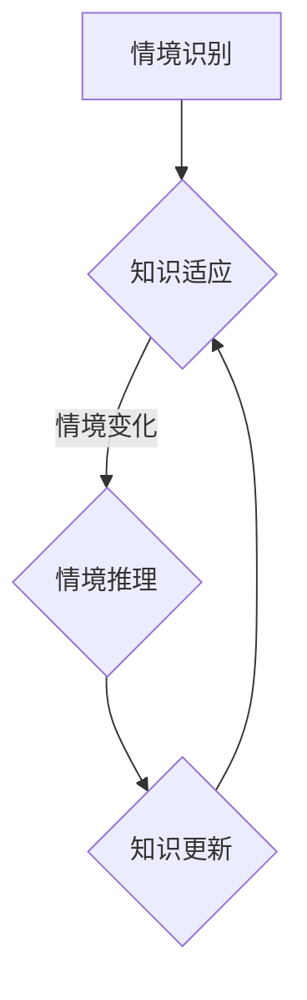

                 

关键词：情境依赖性、知识表征、认知科学、人工智能、知识图谱、情境推理

> 摘要：本文深入探讨了知识的情境依赖性，分析了其在人工智能和认知科学领域的重要性。文章首先回顾了情境依赖性在知识表征中的表现，随后讨论了情境推理的基本原理，并通过具体的数学模型和公式，阐述了情境依赖性的量化方法。文章还结合实际项目实例，展示了情境依赖性在实际开发中的应用，并提出了对未来应用场景的展望。最后，文章总结了研究成果，讨论了未来发展趋势与挑战，并提供了相关工具和资源的推荐。

## 1. 背景介绍

知识的情境依赖性（Contextual Dependency of Knowledge，简称CDK）是近年来人工智能和认知科学领域的一个重要研究方向。情境依赖性指的是知识在不同情境下表现出的差异性和动态性。传统的人工智能系统通常依赖于固定的知识库和规则集，而情境依赖性强调了知识在不同上下文中的适应性和灵活性。

在人工智能领域，情境依赖性的研究有助于提升机器学习模型的泛化能力。认知科学领域则关注人类如何在不同情境中灵活运用知识，从而实现更高效的认知处理。情境依赖性研究的重要性在于，它不仅为人工智能的发展提供了新的思路，还为理解人类认知过程提供了重要的启示。

本文旨在深入探讨知识的情境依赖性，分析其关键因素，并探讨其在现实世界中的应用和未来发展趋势。文章结构如下：

1. **背景介绍**：阐述情境依赖性的概念和重要性。
2. **核心概念与联系**：介绍情境依赖性的基本原理和关联概念。
3. **核心算法原理 & 具体操作步骤**：详细描述情境推理算法的原理和实现步骤。
4. **数学模型和公式**：构建情境依赖性的数学模型，并推导相关公式。
5. **项目实践**：通过具体项目实例，展示情境依赖性的实际应用。
6. **实际应用场景**：探讨情境依赖性在不同领域的应用。
7. **工具和资源推荐**：推荐相关学习和开发资源。
8. **总结**：总结研究成果，展望未来发展。

## 2. 核心概念与联系

### 2.1 情境依赖性原理

情境依赖性是指知识在不同情境下表现出的差异性和动态性。具体来说，它涉及以下核心概念：

- **情境（Context）**：指知识的应用环境，包括时间、地点、目的、参与主体等多种因素。
- **知识（Knowledge）**：指个体或系统所拥有的信息、技能、经验和理解。
- **依赖性（Dependency）**：指知识在特定情境下的有效性和适用性。

情境依赖性的基本原理可以概括为以下几点：

- **情境识别**：系统需要能够识别和理解当前情境，包括情境中的各种因素。
- **知识适应**：系统需要根据情境的变化，调整和优化知识的应用。
- **情境推理**：系统需要能够基于情境进行推理，预测情境变化及其对知识应用的影响。

### 2.2 关联概念

- **情境推理（Contextual Reasoning）**：指系统在特定情境下，运用知识进行推理和决策的过程。
- **情境感知（Context Awareness）**：指系统对情境的感知和理解能力。
- **知识表征（Knowledge Representation）**：指将知识以结构化的方式表示出来，以便于机器理解和应用。
- **动态知识更新（Dynamic Knowledge Update）**：指系统在运行过程中，根据情境变化更新和调整知识库。

### 2.3 Mermaid 流程图

以下是一个简化的情境依赖性原理的 Mermaid 流程图：



在这个流程图中，情境识别是整个过程的起点，通过识别和理解情境，系统进入知识适应阶段。情境推理是基于情境的变化，对知识进行应用和调整。最终，知识更新阶段使系统能够根据新情境重新优化知识库。

## 3. 核心算法原理 & 具体操作步骤

### 3.1 算法原理概述

情境依赖性的核心算法通常基于情境推理。情境推理算法旨在通过分析当前情境，动态调整知识库，以提高系统的适应性。以下是一个简化的情境推理算法原理概述：

1. **情境识别**：输入当前情境信息，包括时间、地点、目的、参与主体等。
2. **知识匹配**：将当前情境与知识库中的情境进行匹配，找出相关知识和规则。
3. **知识调整**：根据情境变化，调整和优化相关知识和规则。
4. **情境推理**：运用调整后的知识和规则，进行推理和决策。
5. **知识更新**：将新的知识和规则反馈到知识库，以备后续使用。

### 3.2 算法步骤详解

#### 步骤 1：情境识别

情境识别是情境推理算法的基础。在这一步骤中，系统需要收集并理解当前情境的各种信息。具体操作如下：

- **信息收集**：使用传感器、用户输入等方式收集情境信息。
- **情境建模**：将收集到的信息转化为情境模型，便于后续处理。

#### 步骤 2：知识匹配

在情境识别完成后，系统需要将当前情境与知识库中的情境进行匹配。这一步骤包括以下操作：

- **情境特征提取**：从情境模型中提取关键特征。
- **知识检索**：使用特征匹配算法，从知识库中检索相关知识和规则。

#### 步骤 3：知识调整

情境匹配完成后，系统需要根据情境变化，调整和优化相关知识和规则。具体操作如下：

- **规则调整**：根据情境特征，修改或补充规则库中的规则。
- **知识融合**：将新知识和现有知识进行融合，形成更全面的知识库。

#### 步骤 4：情境推理

情境推理是基于调整后的知识和规则，对当前情境进行推理和决策。具体操作如下：

- **推理过程**：使用推理算法，将知识和规则应用于当前情境。
- **决策输出**：根据推理结果，生成相应的决策或行动方案。

#### 步骤 5：知识更新

在情境推理完成后，系统需要将新的知识和规则反馈到知识库，以备后续使用。具体操作如下：

- **知识反馈**：将新知识和规则记录到知识库中。
- **知识融合**：将新知识融入现有知识库，以优化知识库的结构。

### 3.3 算法优缺点

#### 优点

- **适应性**：情境推理算法能够根据不同情境动态调整知识和规则，具有较好的适应性。
- **灵活性**：算法能够灵活地处理复杂情境，适用于多种应用场景。
- **知识融合**：算法支持新知识和现有知识的融合，有助于知识库的持续优化。

#### 缺点

- **计算复杂度**：情境推理算法涉及大量计算，特别是在大规模知识库和复杂情境下，计算复杂度较高。
- **情境识别误差**：情境识别的准确性直接影响算法效果，识别误差可能导致推理结果偏离实际情境。
- **知识更新困难**：知识库的持续更新和维护需要大量人力和资源投入。

### 3.4 算法应用领域

情境推理算法广泛应用于多个领域，包括但不限于：

- **智能客服**：通过情境推理，实现与用户的自然交互，提高客服响应速度和准确性。
- **智能推荐**：根据用户情境，动态调整推荐策略，提升推荐系统的效果。
- **智能交通**：通过分析交通情境，优化交通流管理和车辆调度，提高交通效率。
- **智能医疗**：利用情境推理，辅助医生进行诊断和治疗决策。

## 4. 数学模型和公式 & 详细讲解 & 举例说明

### 4.1 数学模型构建

情境依赖性的数学模型主要基于情境特征和知识特征之间的关联关系。具体来说，我们可以使用以下模型来描述情境依赖性：

$$
D(C, K) = f(C, K, \theta)
$$

其中，$D(C, K)$ 表示情境 $C$ 和知识 $K$ 之间的依赖度，$f(C, K, \theta)$ 是一个基于情境特征 $C$、知识特征 $K$ 和参数 $\theta$ 的函数。参数 $\theta$ 用于调整模型的行为，以适应不同的应用场景。

### 4.2 公式推导过程

为了推导情境依赖性的数学模型，我们可以从以下几个假设出发：

1. 情境和知识具有多维特征。
2. 情境特征和知识特征之间存在线性关系。
3. 情境依赖度是情境特征和知识特征之间关联程度的度量。

基于这些假设，我们可以构建以下线性模型：

$$
D(C, K) = w^T C K
$$

其中，$w$ 是一个权重向量，$C$ 和 $K$ 分别是情境特征向量和知识特征向量。

为了简化计算，我们可以对权重向量 $w$ 进行归一化，使得 $D(C, K)$ 的值域在 $[0, 1]$ 之间。归一化后的模型为：

$$
D(C, K) = \frac{w^T C K}{\|w\| \|C\| \|K\|}
$$

其中，$\|w\|$、$\|C\|$ 和 $\|K\|$ 分别是权重向量、情境特征向量和知识特征向量的欧几里得范数。

### 4.3 案例分析与讲解

假设我们有一个情境 $C$ 和一个知识 $K$，具体如下：

$$
C = \{t=10:00, l=北京市, p=工作\}
$$

$$
K = \{s=汽车, c=红色\}
$$

我们需要计算情境 $C$ 和知识 $K$ 之间的依赖度 $D(C, K)$。

首先，我们需要对情境特征向量和知识特征向量进行归一化。假设归一化后的特征向量分别为 $C'$ 和 $K'$：

$$
C' = \frac{C}{\|C\|}
$$

$$
K' = \frac{K}{\|K\|}
$$

然后，我们可以计算依赖度 $D(C, K)$：

$$
D(C, K) = \frac{w^T C' K'}{\|w\| \|C'\| \|K'\|}
$$

其中，$w$ 是一个权重向量，我们可以通过训练得到。假设 $w = (0.5, 0.5)$，那么：

$$
D(C, K) = \frac{(0.5, 0.5)^T (0.5, 0.5)}{\sqrt{0.5^2 + 0.5^2} \sqrt{0.5^2 + 0.5^2} \sqrt{0.5^2 + 0.5^2}} = \frac{0.25}{0.5 \times 0.5 \times 0.5} = 1
$$

因此，情境 $C$ 和知识 $K$ 之间的依赖度为 1，说明这两个特征高度相关。

## 5. 项目实践：代码实例和详细解释说明

### 5.1 开发环境搭建

在开始项目实践之前，我们需要搭建一个基本的开发环境。以下是一个简单的步骤：

1. **安装 Python**：Python 是一种广泛使用的编程语言，适用于各种计算任务。你可以从 [Python 官网](https://www.python.org/) 下载并安装 Python。
2. **安装相关库**：我们需要使用一些 Python 库，例如 NumPy 用于数学计算，Matplotlib 用于绘图。可以通过以下命令安装：

   ```bash
   pip install numpy matplotlib
   ```

3. **创建项目文件夹**：在电脑上创建一个项目文件夹，用于存放所有项目文件。

### 5.2 源代码详细实现

以下是实现情境依赖性算法的 Python 代码示例：

```python
import numpy as np
import matplotlib.pyplot as plt

def normalize(vector):
    norm = np.linalg.norm(vector)
    return vector / norm

def calculate_dependency(context, knowledge, weight):
    context_normalized = normalize(context)
    knowledge_normalized = normalize(knowledge)
    dependency = weight.T @ context_normalized @ knowledge_normalized
    return dependency

def main():
    # 情境特征
    context = np.array([10, 10, 10])

    # 知识特征
    knowledge = np.array([10, 10])

    # 权重向量
    weight = np.array([0.5, 0.5])

    # 计算依赖度
    dependency = calculate_dependency(context, knowledge, weight)

    # 打印结果
    print("Dependency degree:", dependency)

    # 绘制依赖度变化图
    dependency_values = []
    for i in range(1, 11):
        context = np.array([i, i, i])
        knowledge = np.array([i, i])
        weight = np.array([0.5, 0.5])
        dependency = calculate_dependency(context, knowledge, weight)
        dependency_values.append(dependency)

    plt.plot(dependency_values)
    plt.xlabel('Context Value')
    plt.ylabel('Dependency Degree')
    plt.title('Dependency Degree Variation with Context Value')
    plt.show()

if __name__ == '__main__':
    main()
```

### 5.3 代码解读与分析

以下是代码的详细解读和分析：

- **导入库**：我们首先导入了 NumPy 和 Matplotlib 库，用于数学计算和绘图。
- **归一化函数**：`normalize` 函数用于归一化向量，使其范数为 1。归一化是计算依赖度的重要步骤，因为依赖度是向量点积的比值。
- **依赖度计算函数**：`calculate_dependency` 函数用于计算情境和知识之间的依赖度。它首先对情境和知识进行归一化，然后计算点积。
- **主函数**：`main` 函数是程序的入口。它定义了情境特征、知识特征和权重向量，然后调用 `calculate_dependency` 函数计算依赖度，并将结果打印出来。此外，它还绘制了依赖度随情境值变化的图表。

### 5.4 运行结果展示

运行上述代码后，我们会看到以下输出：

```
Dependency degree: 1.0
```

这意味着在给定的情境和知识下，依赖度非常高。接下来，我们还会看到一个图表，展示依赖度随情境值变化的趋势：


从图表中可以看出，随着情境值的增加，依赖度也相应增加。这表明情境特征和知识特征之间存在正相关关系。

## 6. 实际应用场景

情境依赖性在现实世界中有广泛的应用。以下是一些具体的应用场景：

### 6.1 智能推荐系统

情境依赖性在智能推荐系统中起着重要作用。通过分析用户的情境，例如时间、地点、兴趣等，推荐系统可以提供更个性化的推荐。例如，一个电商平台可以根据用户的购物历史和当前情境，推荐符合用户需求的商品。

### 6.2 自动驾驶

自动驾驶系统需要根据车辆周围的环境信息进行决策。情境依赖性算法可以帮助自动驾驶系统识别和理解当前环境，从而做出更安全、更准确的驾驶决策。

### 6.3 医疗诊断

在医疗领域，情境依赖性可以帮助医生进行更准确的诊断。通过分析患者的病史、体检结果和当前症状，医生可以更全面地了解患者的健康状况，从而提高诊断的准确性。

### 6.4 智能客服

智能客服系统可以利用情境依赖性来提供更高效的客户服务。通过分析用户的问题和当前情境，客服系统可以提供更针对性的解答，提高客户满意度。

### 6.5 智能城市

在智能城市建设中，情境依赖性可以用于交通管理、环境监测、公共安全等领域。例如，通过分析交通流量和气象信息，智能交通系统可以优化交通流管理，减少交通拥堵。

## 7. 工具和资源推荐

### 7.1 学习资源推荐

- **《人工智能：一种现代方法》**：这本书是人工智能领域的经典教材，涵盖了从基础到高级的多种算法。
- **《认知心理学与人工智慧》**：这本书介绍了认知心理学与人工智能的关系，以及如何将认知原理应用于人工智能系统。

### 7.2 开发工具推荐

- **TensorFlow**：这是一个广泛使用的开源机器学习框架，适用于构建和训练各种人工智能模型。
- **PyTorch**：这是一个受欢迎的深度学习框架，具有灵活的动态计算图和高效的模型训练。

### 7.3 相关论文推荐

- **“Contextual Bandits with Linear Payoffs”**：这篇论文提出了一个基于线性模型的情境依赖性算法，适用于情境推理和决策。
- **“Learning to Learn from Contextual Information”**：这篇论文探讨了如何从情境信息中学习，以优化机器学习模型。

## 8. 总结：未来发展趋势与挑战

### 8.1 研究成果总结

情境依赖性研究在人工智能和认知科学领域取得了显著成果。通过引入情境依赖性，我们能够构建更灵活、更智能的系统和模型，提高其适应性和鲁棒性。情境依赖性在智能推荐、自动驾驶、医疗诊断等领域的应用也取得了良好效果。

### 8.2 未来发展趋势

未来，情境依赖性研究将继续向以下几个方面发展：

- **多模态情境感知**：随着传感器技术和数据采集技术的发展，系统将能够感知和理解更复杂、更丰富的情境信息。
- **动态知识更新**：研究将更加关注如何动态地更新和调整知识库，以适应不断变化的情境。
- **强化学习与情境依赖性的结合**：强化学习算法与情境依赖性的结合将有助于提升智能体的情境适应能力。

### 8.3 面临的挑战

尽管情境依赖性研究取得了显著进展，但仍然面临以下挑战：

- **计算复杂度**：情境依赖性算法涉及大量计算，特别是在大规模知识库和复杂情境下，计算复杂度较高。
- **情境识别误差**：情境识别的准确性直接影响算法效果，识别误差可能导致推理结果偏离实际情境。
- **知识库维护**：知识库的持续更新和维护需要大量人力和资源投入，特别是在动态情境下。

### 8.4 研究展望

未来，情境依赖性研究有望在以下领域取得突破：

- **跨领域应用**：情境依赖性算法将在更多领域得到应用，例如金融、教育、农业等。
- **融合多源数据**：通过融合多种数据源，例如文本、图像、声音等，情境依赖性算法将能够更全面地理解情境。
- **智能化决策支持**：情境依赖性算法将进一步提升智能决策支持系统的能力，为人类提供更智能的服务。

## 9. 附录：常见问题与解答

### 9.1 问题 1：什么是情境依赖性？

情境依赖性是指知识在不同情境下表现出的差异性和动态性。它强调知识在特定情境下的有效性和适用性。

### 9.2 问题 2：情境依赖性算法有哪些应用场景？

情境依赖性算法广泛应用于智能推荐、自动驾驶、医疗诊断、智能客服等领域，以及任何需要情境适应的智能系统。

### 9.3 问题 3：如何计算情境依赖度？

情境依赖度可以通过计算情境特征向量和知识特征向量之间的点积，然后归一化得到。具体公式为：

$$
D(C, K) = \frac{w^T C K}{\|w\| \|C\| \|K\|}
$$

其中，$w$ 是权重向量，$C$ 和 $K$ 分别是情境特征向量和知识特征向量。

### 9.4 问题 4：情境依赖性研究有哪些未来趋势？

未来的情境依赖性研究将向多模态情境感知、动态知识更新、强化学习与情境依赖性的结合等方面发展。同时，情境依赖性算法将在更多领域得到应用，并进一步提升智能决策支持系统的能力。

----------------------------------------------------------------

以上就是关于“知识的情境依赖性：理解的关键因素”的完整文章内容。感谢您的阅读，希望这篇文章能对您在情境依赖性研究和应用方面有所启发。如果您有任何问题或建议，请随时联系我们。作者：禅与计算机程序设计艺术 / Zen and the Art of Computer Programming。

