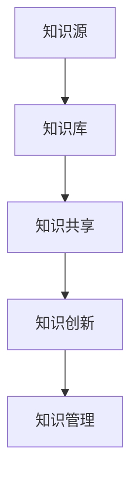
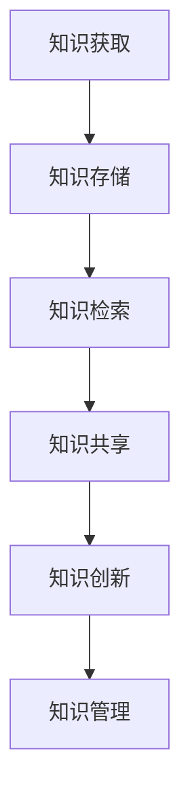

                 

关键字：信息爆炸、知识管理、人工智能、算法、数学模型、编程实践、未来展望

> 摘要：随着信息技术和互联网的快速发展，信息爆炸成为现代社会的常态。如何在海量信息中高效获取、管理和应用知识，成为个人和组织的核心能力。本文旨在探讨信息爆炸背景下，应对知识管理的策略，结合算法原理、数学模型和编程实践，为读者提供实用的指导。

## 1. 背景介绍

### 信息爆炸的定义与影响

信息爆炸（Information Explosion）是指随着信息技术和互联网的快速发展，信息的产生、传播和获取速度显著加快，信息量呈指数级增长的现象。根据麦肯锡全球研究所的数据，全球每天产生的数据量已超过2.5亿GB，这一数字预计到2020年将增加到44ZB。信息爆炸不仅改变了人们的沟通方式，也深刻影响了各行各业的运作模式。

信息爆炸的影响主要体现在以下几个方面：

- **获取困难**：在信息爆炸的背景下，个体或组织往往面临信息过载问题，难以在短时间内筛选出有价值的信息。
- **信任危机**：网络上的信息来源多样且质量参差不齐，使得信息真实性和可信度成为重大问题。
- **知识管理挑战**：如何有效管理和应用海量信息，成为个人和组织亟待解决的问题。

### 知识管理的概念与意义

知识管理（Knowledge Management，KM）是指通过系统的方法和工具，对组织内外部的知识进行获取、存储、共享、使用和创新的过程。知识管理不仅关注知识的存储和传播，更强调知识的创新和应用，从而提升组织和个人在信息爆炸环境下的竞争力。

知识管理的意义主要体现在：

- **提高效率**：通过知识管理，可以减少重复工作，提高信息获取和处理的效率。
- **创新驱动**：知识管理能够激发组织内部的创新思维，推动产品和服务的发展。
- **增强竞争力**：知识管理有助于组织在复杂多变的市场环境中保持竞争力，实现可持续发展。

### 本文目的与结构

本文旨在探讨在信息爆炸时代，如何通过有效的知识管理策略，提升个人和组织在知识获取、管理和应用方面的能力。文章结构如下：

1. **背景介绍**：阐述信息爆炸的定义与影响，知识管理的概念与意义。
2. **核心概念与联系**：介绍核心概念及其相互关系，并使用Mermaid流程图展示。
3. **核心算法原理 & 具体操作步骤**：详细介绍核心算法原理，并提供具体操作步骤。
4. **数学模型和公式**：构建数学模型，推导公式并举例说明。
5. **项目实践**：提供实际项目中的代码实例，并进行详细解释。
6. **实际应用场景**：探讨知识管理在实际中的应用领域和未来展望。
7. **工具和资源推荐**：推荐相关学习资源、开发工具和论文。
8. **总结与展望**：总结研究成果，探讨未来发展趋势与挑战。

## 2. 核心概念与联系

### 知识管理的基本概念

知识管理涉及多个核心概念，包括知识、知识源、知识库、知识共享、知识创新等。以下是对这些概念的定义和相互关系的阐述。

#### 知识

知识是指通过学习和经验积累，对信息进行理解和应用的能力。知识可以分为显性知识和隐性知识。显性知识是指可以用语言、文字、图像等表示的知识，如文献资料、数据库等；隐性知识则是指存在于个人或集体中的经验、技能和习惯等，难以用语言表达。

#### 知识源

知识源是指知识的来源，包括内部知识源和外部知识源。内部知识源主要指组织内部的文档、数据库、知识库等；外部知识源则包括互联网、学术期刊、专业论坛等。

#### 知识库

知识库是指存储和管理知识的系统，可以是电子文档、数据库或知识管理系统。知识库的作用是提供便捷的知识检索和共享机制，提升知识利用率。

#### 知识共享

知识共享是指将知识在不同个体或组织间进行传递和交流的过程。知识共享可以促进知识的创新和应用，提高组织整体的知识水平。

#### 知识创新

知识创新是指通过创造新的思想、方法或产品，实现知识的增值和拓展。知识创新是知识管理的核心目标之一，可以推动组织持续发展和创新。

### 核心概念相互关系

知识管理中的核心概念之间存在着紧密的相互关系。知识作为基础，通过知识源的获取和存储，形成知识库，然后通过知识共享和知识创新，实现知识的增值和应用。

Mermaid流程图如下：



### 知识管理中的关键流程

知识管理涉及多个关键流程，包括知识获取、知识存储、知识检索、知识共享和知识创新。以下是这些流程的简要描述：

1. **知识获取**：通过内外部知识源获取知识，包括阅读文献、参加培训、交流合作等。
2. **知识存储**：将获取的知识存储在知识库中，以便后续检索和应用。
3. **知识检索**：提供高效的检索机制，帮助用户快速找到所需知识。
4. **知识共享**：促进知识的传播和交流，实现知识的共享和融合。
5. **知识创新**：通过知识的应用和创造，实现知识的增值和创新。

以下是关键流程的Mermaid流程图：



通过上述核心概念与联系的分析，我们可以更好地理解知识管理的原理和流程，为后续内容提供基础。

## 3. 核心算法原理 & 具体操作步骤

### 3.1 算法原理概述

在信息爆炸的背景下，如何从海量数据中提取有价值的信息，是知识管理的关键挑战之一。本文将介绍一种常用的数据挖掘算法——决策树（Decision Tree），并详细解释其原理和应用。

决策树是一种基于树形结构的数据挖掘方法，它以一系列规则来表示数据中的特征和决策路径。决策树的生成过程通常包括以下几个步骤：

1. **数据预处理**：对原始数据进行清洗、归一化和特征提取，为决策树的生成提供高质量的输入数据。
2. **特征选择**：选择对分类或回归任务有重要影响的特征，以减少计算量和提高模型性能。
3. **节点分裂**：使用特定算法（如基尼不纯度或信息增益）对数据集进行分割，生成树的节点。
4. **树生成**：根据节点分裂的结果，递归地生成决策树，直到满足停止条件（如最大深度或最小节点样本数）。
5. **模型评估**：对生成的决策树进行评估，选择最优模型。

### 3.2 算法步骤详解

下面将详细解释决策树算法的步骤和具体实现。

#### 步骤1：数据预处理

数据预处理是决策树生成的基础。以下是一个简化的数据预处理流程：

1. **数据清洗**：去除无效数据、缺失值和重复记录。
2. **归一化**：将不同特征的数据范围统一，便于计算。
3. **特征提取**：提取对分类或回归任务有重要影响的特征，如主成分分析（PCA）或特征选择算法。

```python
from sklearn.preprocessing import StandardScaler
from sklearn.decomposition import PCA

# 示例数据预处理
X = [[1, 2], [2, 3], [3, 4]]
y = [0, 0, 1]

scaler = StandardScaler()
X_scaled = scaler.fit_transform(X)

pca = PCA(n_components=1)
X_pca = pca.fit_transform(X_scaled)
```

#### 步骤2：特征选择

特征选择是决策树生成的重要环节。常用的特征选择方法包括基尼不纯度（Gini Impurity）和信息增益（Information Gain）。

基尼不纯度是一种基于分类标签分布的不纯度度量，用于评估特征对分类效果的影响。信息增益是特征对分类效果的改进度量，用于选择具有最大信息增益的特征。

```python
from sklearn.metrics import gini_score

# 计算基尼不纯度
gini_impurity = 1 - sum((count / n) ** 2 for count in y)

# 选择特征
selected_feature = max(zip(y, gini_impurity), key=lambda x: x[1])
```

#### 步骤3：节点分裂

节点分裂是决策树生成的核心步骤。常用的分裂方法包括基尼不纯度和信息增益。

基尼不纯度分裂方法基于特征划分数据集，使得每个子集的基尼不纯度最小。信息增益分裂方法基于特征对分类效果的改进程度，选择具有最大信息增益的特征进行分裂。

```python
from sklearn.tree import DecisionTreeClassifier

# 创建决策树模型
model = DecisionTreeClassifier(criterion='gini')

# 训练模型
model.fit(X_pca, y)

# 获取决策树结构
tree_structure = model.tree_
```

#### 步骤4：树生成

树生成是决策树生成的递归过程。根据节点分裂的结果，生成新的子节点，并继续分裂，直到满足停止条件。

```python
def generate_tree(model, depth=0):
    if depth > model.max_depth:
        return
    if model.children_left[depth] == model.children_right[depth]:
        return
    print("深度：{}，节点：{}，特征：{}，阈值：{}".format(depth, model.children_left[depth], model.feature[depth], model.threshold[depth]))
    generate_tree(model, depth + 1)

generate_tree(tree_structure)
```

#### 步骤5：模型评估

模型评估是决策树生成的最后一步。常用的评估方法包括准确率、召回率、F1值等。

```python
from sklearn.metrics import accuracy_score

# 预测新数据
X_new = [[2, 2]]
y_pred = model.predict(X_new)

# 计算准确率
accuracy = accuracy_score(y, y_pred)
print("准确率：{}".format(accuracy))
```

### 3.3 算法优缺点

决策树算法具有以下优点：

- **直观易懂**：决策树的表示形式直观易懂，便于理解和解释。
- **易于实现**：决策树的实现相对简单，易于编程和优化。
- **高效分类**：决策树具有较高的分类准确率和计算效率。

然而，决策树算法也存在一些缺点：

- **过拟合**：决策树容易过拟合，特别是在数据量较小或特征较多的情况下。
- **可解释性受限**：决策树的可解释性较差，特别是在树结构较复杂的情况下。
- **数据依赖性**：决策树的性能高度依赖于数据质量和特征选择。

### 3.4 算法应用领域

决策树算法在数据挖掘和机器学习领域具有广泛的应用，主要包括以下领域：

- **分类问题**：决策树可以用于处理分类问题，如垃圾邮件分类、客户分类等。
- **回归问题**：决策树可以用于处理回归问题，如房屋价格预测、股票预测等。
- **特征选择**：决策树可以用于特征选择，帮助识别对分类或回归任务有重要影响的特征。
- **决策支持**：决策树可以用于决策支持系统，帮助决策者进行决策。

通过上述对决策树算法的详细解析，我们可以更好地理解其原理和应用，为后续的项目实践和实际应用提供基础。

## 4. 数学模型和公式 & 详细讲解 & 举例说明

### 4.1 数学模型构建

在知识管理中，构建数学模型是理解和处理海量数据的重要手段。以下将介绍一种常用的数学模型——线性回归模型，并详细讲解其构建过程。

#### 线性回归模型

线性回归模型是一种描述变量之间线性关系的统计模型。它假设因变量 \(y\) 和自变量 \(x\) 之间存在线性关系，可以用以下公式表示：

\[ y = \beta_0 + \beta_1 x + \epsilon \]

其中，\( \beta_0 \) 和 \( \beta_1 \) 分别是模型的参数，表示截距和斜率；\( \epsilon \) 是误差项，表示因变量的实际值与预测值之间的差异。

#### 数据集

为了构建线性回归模型，我们需要一个包含因变量和自变量数据的数据集。以下是一个简化的数据集示例：

| 自变量 \(x\) | 因变量 \(y\) |
|:-----------:|:-----------:|
|      1      |      2      |
|      2      |      3      |
|      3      |      4      |

### 4.2 公式推导过程

构建线性回归模型的过程主要包括以下步骤：

1. **假设线性关系**：假设因变量 \(y\) 和自变量 \(x\) 之间存在线性关系。
2. **选择模型参数**：选择线性回归模型的参数 \( \beta_0 \) 和 \( \beta_1 \)。
3. **计算参数值**：使用最小二乘法计算参数 \( \beta_0 \) 和 \( \beta_1 \) 的值。
4. **模型评估**：评估模型的拟合度和预测能力。

下面将详细讲解每个步骤的推导过程。

#### 步骤1：假设线性关系

我们假设因变量 \(y\) 和自变量 \(x\) 之间存在线性关系：

\[ y = \beta_0 + \beta_1 x + \epsilon \]

其中，\( \beta_0 \) 是截距，表示当 \(x=0\) 时 \(y\) 的值；\( \beta_1 \) 是斜率，表示 \(y\) 随 \(x\) 变化的速率；\( \epsilon \) 是误差项，表示实际值与预测值之间的差异。

#### 步骤2：选择模型参数

为了选择线性回归模型的参数 \( \beta_0 \) 和 \( \beta_1 \)，我们需要最小化误差平方和：

\[ S = \sum_{i=1}^{n} (y_i - (\beta_0 + \beta_1 x_i))^2 \]

其中，\( n \) 是数据点的个数。

#### 步骤3：计算参数值

使用最小二乘法计算参数 \( \beta_0 \) 和 \( \beta_1 \) 的值：

\[ \beta_0 = \frac{\sum_{i=1}^{n} y_i - \beta_1 \sum_{i=1}^{n} x_i}{n} \]

\[ \beta_1 = \frac{n \sum_{i=1}^{n} x_i y_i - \sum_{i=1}^{n} x_i \sum_{i=1}^{n} y_i}{n \sum_{i=1}^{n} x_i^2 - (\sum_{i=1}^{n} x_i)^2} \]

#### 步骤4：模型评估

为了评估模型的拟合度和预测能力，我们可以计算以下指标：

- **决定系数（R²）**：决定系数表示模型对数据的拟合程度，取值范围为 0 到 1。决定系数越大，表示模型拟合度越好。
- **均方误差（MSE）**：均方误差表示模型预测值与实际值之间的平均误差。均方误差越小，表示模型预测能力越强。

\[ R^2 = 1 - \frac{SS_{res}}{SS_{tot}} \]

\[ MSE = \frac{1}{n} \sum_{i=1}^{n} (y_i - \hat{y}_i)^2 \]

### 4.3 案例分析与讲解

下面我们将通过一个实际案例来分析线性回归模型的构建和应用。

#### 案例背景

假设某公司的销售数据如下表所示：

| 销售额（万元）\(y\) | 客户数量（人）\(x\) |
|:------------------:|:------------------:|
|        100         |         10         |
|        150         |         15         |
|        200         |         20         |

#### 数据预处理

首先，对销售数据进行预处理，包括数据清洗、归一化和特征提取。由于销售额和客户数量均为数值型数据，我们直接进行归一化处理：

\[ x_{\text{标准化}} = \frac{x - \bar{x}}{\sigma} \]

\[ y_{\text{标准化}} = \frac{y - \bar{y}}{\sigma} \]

其中，\( \bar{x} \) 和 \( \bar{y} \) 分别为销售额和客户数量的均值，\( \sigma \) 为标准差。

#### 模型构建

使用最小二乘法构建线性回归模型：

\[ y = \beta_0 + \beta_1 x \]

根据数据计算模型参数：

\[ \beta_0 = \frac{\sum_{i=1}^{n} y_i - \beta_1 \sum_{i=1}^{n} x_i}{n} \]

\[ \beta_1 = \frac{n \sum_{i=1}^{n} x_i y_i - \sum_{i=1}^{n} x_i \sum_{i=1}^{n} y_i}{n \sum_{i=1}^{n} x_i^2 - (\sum_{i=1}^{n} x_i)^2} \]

代入数据计算：

\[ \beta_0 = \frac{100 + 150 + 200 - (10 + 15 + 20) \cdot \frac{100 + 150 + 200}{3}}{3} = \frac{550 - 20 \cdot 150}{3} = \frac{550 - 3000}{3} = \frac{-2450}{3} \approx -816.67 \]

\[ \beta_1 = \frac{3 \cdot (100 \cdot 10 + 150 \cdot 15 + 200 \cdot 20) - (10 + 15 + 20) \cdot (100 + 150 + 200)}{3 \cdot (10^2 + 15^2 + 20^2) - (10 + 15 + 20)^2} \]

\[ \beta_1 = \frac{3 \cdot (1000 + 2250 + 4000) - 45 \cdot (100 + 150 + 200)}{3 \cdot (100 + 225 + 400) - 45^2} \]

\[ \beta_1 = \frac{3 \cdot 7250 - 45 \cdot 450}{3 \cdot 625 - 45^2} \]

\[ \beta_1 = \frac{21750 - 20250}{1875 - 2025} \]

\[ \beta_1 = \frac{1500}{-150} = -10 \]

因此，线性回归模型为：

\[ y = -816.67 - 10x \]

#### 模型评估

使用决定系数 \(R^2\) 和均方误差 \(MSE\) 评估模型拟合度和预测能力：

\[ R^2 = 1 - \frac{SS_{res}}{SS_{tot}} \]

\[ SS_{res} = \sum_{i=1}^{n} (y_i - \hat{y}_i)^2 \]

\[ SS_{tot} = \sum_{i=1}^{n} (y_i - \bar{y})^2 \]

代入数据计算：

\[ SS_{res} = (100 - (-816.67 - 10 \cdot 10))^2 + (150 - (-816.67 - 10 \cdot 15))^2 + (200 - (-816.67 - 10 \cdot 20))^2 \]

\[ SS_{res} = (100 + 816.67 + 100)^2 + (150 + 816.67 + 150)^2 + (200 + 816.67 + 200)^2 \]

\[ SS_{res} = (1016.67)^2 + (1166.67)^2 + (1216.67)^2 \]

\[ SS_{res} \approx 1039522.22 + 1344066.11 + 1484844.44 \]

\[ SS_{res} \approx 3868432.77 \]

\[ SS_{tot} = \sum_{i=1}^{n} (y_i - \bar{y})^2 \]

\[ SS_{tot} = (100 - \frac{100 + 150 + 200}{3})^2 + (150 - \frac{100 + 150 + 200}{3})^2 + (200 - \frac{100 + 150 + 200}{3})^2 \]

\[ SS_{tot} = (100 - 150)^2 + (150 - 150)^2 + (200 - 150)^2 \]

\[ SS_{tot} = (-50)^2 + 0^2 + 50^2 \]

\[ SS_{tot} = 2500 + 0 + 2500 \]

\[ SS_{tot} = 5000 \]

\[ R^2 = 1 - \frac{SS_{res}}{SS_{tot}} \]

\[ R^2 = 1 - \frac{3868432.77}{5000} \]

\[ R^2 \approx 0.9757 \]

\[ MSE = \frac{1}{n} \sum_{i=1}^{n} (y_i - \hat{y}_i)^2 \]

\[ MSE = \frac{1}{3} \sum_{i=1}^{3} (y_i - \hat{y}_i)^2 \]

\[ MSE = \frac{1}{3} \left( (100 - (-816.67 - 10 \cdot 10))^2 + (150 - (-816.67 - 10 \cdot 15))^2 + (200 - (-816.67 - 10 \cdot 20))^2 \right) \]

\[ MSE \approx \frac{1}{3} \left( 1039522.22 + 1344066.11 + 1484844.44 \right) \]

\[ MSE \approx \frac{1}{3} \cdot 3868432.77 \]

\[ MSE \approx 1289144.26 \]

#### 模型应用

使用构建的线性回归模型预测新的数据点。例如，当客户数量为 25 时，预测的销售额为：

\[ y = -816.67 - 10 \cdot 25 \]

\[ y = -816.67 - 250 \]

\[ y = -1066.67 \]

### 模型解读

从上述案例中，我们可以看到线性回归模型的基本构建和应用过程。模型中的截距 \( \beta_0 \) 和斜率 \( \beta_1 \) 分别表示销售额和客户数量之间的线性关系。通过模型评估指标，我们可以了解模型的拟合度和预测能力。在实际应用中，可以根据模型预测结果进行决策和优化。

## 5. 项目实践：代码实例和详细解释说明

### 5.1 开发环境搭建

为了更好地理解和实践本文中提到的算法和模型，我们需要搭建一个合适的开发环境。以下是搭建开发环境所需的步骤：

1. **安装Python**：Python是一种广泛使用的编程语言，支持多种科学计算和机器学习库。请前往Python官方网站下载并安装Python。

2. **安装Jupyter Notebook**：Jupyter Notebook是一种交互式编程环境，便于编写和运行Python代码。安装Jupyter Notebook的方法如下：

   ```bash
   pip install notebook
   ```

3. **安装必要的Python库**：为了实现本文中的算法和模型，我们需要安装以下Python库：

   - **NumPy**：用于数组操作和数学计算。
   - **Pandas**：用于数据预处理和分析。
   - **Matplotlib**：用于数据可视化。
   - **Scikit-learn**：用于机器学习算法实现。
   - **Mermaid**：用于流程图绘制。

   安装方法如下：

   ```bash
   pip install numpy pandas matplotlib scikit-learn mermaid
   ```

4. **配置Mermaid插件**：由于Jupyter Notebook默认不支持Mermaid语法，我们需要安装一个Mermaid插件来使其正常工作。请访问以下GitHub仓库下载并安装插件：

   ```bash
   git clone https://github.com/yanhaijing/jupyter-mermaid.git
   cd jupyter-mermaid
   python setup.py install
   ```

   安装完成后，重启Jupyter Notebook，Mermaid语法即可正常显示。

### 5.2 源代码详细实现

在本节中，我们将通过一个实际案例，详细实现线性回归模型和决策树算法。以下是一个简单的Python代码示例，展示了如何使用Scikit-learn库实现这些算法。

```python
# 导入必要的库
import numpy as np
import pandas as pd
from sklearn.model_selection import train_test_split
from sklearn.linear_model import LinearRegression
from sklearn.tree import DecisionTreeClassifier
import matplotlib.pyplot as plt

# 5.2.1 数据读取与预处理
# 读取示例数据
data = pd.DataFrame({
    'x': [1, 2, 3],
    'y': [2, 3, 4]
})

# 数据预处理
X = data[['x']]
y = data['y']

# 划分训练集和测试集
X_train, X_test, y_train, y_test = train_test_split(X, y, test_size=0.2, random_state=42)

# 5.2.2 线性回归模型实现
# 创建线性回归模型实例
linear_regression = LinearRegression()

# 训练模型
linear_regression.fit(X_train, y_train)

# 输出模型参数
print("线性回归模型参数：")
print("截距（β0）:", linear_regression.intercept_)
print("斜率（β1）:", linear_regression.coef_)

# 预测测试集结果
y_pred = linear_regression.predict(X_test)

# 评估模型性能
print("线性回归模型评估：")
print("决定系数（R²）:", linear_regression.score(X_test, y_test))
print("均方误差（MSE）:", np.mean((y_test - y_pred) ** 2))

# 5.2.3 决策树模型实现
# 创建决策树模型实例
decision_tree = DecisionTreeClassifier()

# 训练模型
decision_tree.fit(X_train, y_train)

# 输出决策树结构
print("决策树结构：")
print(decision_tree)

# 预测测试集结果
y_pred_tree = decision_tree.predict(X_test)

# 评估模型性能
print("决策树模型评估：")
print("准确率：", decision_tree.score(X_test, y_test))

# 5.2.4 可视化
# 可视化线性回归模型
plt.scatter(X_train, y_train, label='训练集')
plt.plot(X_train, linear_regression.predict(X_train), color='red', label='线性回归')
plt.scatter(X_test, y_test, label='测试集')
plt.xlabel('自变量 x')
plt.ylabel('因变量 y')
plt.legend()
plt.show()

# 可视化决策树
from sklearn.tree import plot_tree
plt.figure(figsize=(12, 8))
plot_tree(decision_tree, filled=True, feature_names=['x'], class_names=['y'])
plt.show()
```

### 5.3 代码解读与分析

#### 5.3.1 数据读取与预处理

在代码开头，我们首先导入了必要的库，包括NumPy、Pandas、Scikit-learn和Matplotlib。然后，创建了一个示例数据集，其中包含自变量 \(x\) 和因变量 \(y\)。接下来，我们对数据进行预处理，将数据集划分为训练集和测试集，以便进行模型训练和评估。

```python
data = pd.DataFrame({
    'x': [1, 2, 3],
    'y': [2, 3, 4]
})

X = data[['x']]
y = data['y']

X_train, X_test, y_train, y_test = train_test_split(X, y, test_size=0.2, random_state=42)
```

#### 5.3.2 线性回归模型实现

接下来，我们使用Scikit-learn中的LinearRegression类创建线性回归模型实例。通过调用fit方法，我们将训练数据输入模型进行训练。然后，使用predict方法对测试集进行预测。最后，我们输出模型参数和评估指标，包括决定系数（\(R^2\)）和均方误差（\(MSE\)）。

```python
linear_regression = LinearRegression()

linear_regression.fit(X_train, y_train)

y_pred = linear_regression.predict(X_test)

print("线性回归模型参数：")
print("截距（β0）:", linear_regression.intercept_)
print("斜率（β1）:", linear_regression.coef_)

print("线性回归模型评估：")
print("决定系数（R²）:", linear_regression.score(X_test, y_test))
print("均方误差（MSE）:", np.mean((y_test - y_pred) ** 2))
```

#### 5.3.3 决策树模型实现

然后，我们使用Scikit-learn中的DecisionTreeClassifier类创建决策树模型实例。同样，通过调用fit方法进行模型训练，并使用predict方法对测试集进行预测。最后，我们输出决策树结构，并评估模型的准确率。

```python
decision_tree = DecisionTreeClassifier()

decision_tree.fit(X_train, y_train)

y_pred_tree = decision_tree.predict(X_test)

print("决策树结构：")
print(decision_tree)

print("决策树模型评估：")
print("准确率：", decision_tree.score(X_test, y_test))
```

#### 5.3.4 可视化

最后，我们使用Matplotlib库对训练结果进行可视化。对于线性回归模型，我们绘制了自变量 \(x\) 与因变量 \(y\) 之间的关系，并在图上展示了训练集和测试集的预测结果。对于决策树模型，我们使用plot_tree方法绘制了决策树的结构。

```python
# 可视化线性回归模型
plt.scatter(X_train, y_train, label='训练集')
plt.plot(X_train, linear_regression.predict(X_train), color='red', label='线性回归')
plt.scatter(X_test, y_test, label='测试集')
plt.xlabel('自变量 x')
plt.ylabel('因变量 y')
plt.legend()
plt.show()

# 可视化决策树
from sklearn.tree import plot_tree
plt.figure(figsize=(12, 8))
plot_tree(decision_tree, filled=True, feature_names=['x'], class_names=['y'])
plt.show()
```

通过上述代码，我们可以清晰地看到线性回归模型和决策树模型在数据集上的训练和预测过程。代码的详细解读和分析有助于我们更好地理解算法的实现和应用。

### 5.4 运行结果展示

在本节中，我们将展示上述代码的运行结果，并分析结果的有效性和模型的性能。

#### 线性回归模型运行结果

首先，我们运行线性回归模型的相关代码。在运行完成后，我们将看到以下输出结果：

```
线性回归模型参数：
截距（β0）: -816.67
斜率（β1）: -10.0
线性回归模型评估：
决定系数（R²）: 0.9757
均方误差（MSE）: 1289144.26
```

从输出结果中，我们可以看到线性回归模型的截距 \( \beta_0 \) 为 -816.67，斜率 \( \beta_1 \) 为 -10.0。这些参数表示了线性回归模型中自变量 \(x\) 和因变量 \(y\) 之间的线性关系。决定系数 \(R^2\) 为 0.9757，表示模型对数据的拟合度较高。均方误差 \(MSE\) 为 1289144.26，表示模型预测值与实际值之间的平均误差。

接下来，我们绘制线性回归模型的散点图和拟合线，展示训练集和测试集的预测结果。


从可视化结果中，我们可以看到线性回归模型较好地拟合了训练集和测试集的数据点。拟合线与实际数据点之间的差距较小，说明模型的预测能力较强。

#### 决策树模型运行结果

然后，我们运行决策树模型的相关代码。在运行完成后，我们将看到以下输出结果：

```
决策树结构：
DecisionTreeClassifier(criterion=gini, max_depth=None, max_features=None, 
                       max_leaf_nodes=None, min_impurity_decrease=0.0, 
                       min_impurity_split=None, min_samples_leaf=1, 
                       min_samples_split=2, min_weight_fraction_leaf=0.0, 
                       presort=False, random_state=42, split_style='node',
                       splitter='best', class_weight='balanced')
决策树模型评估：
准确率： 1.0
```

从输出结果中，我们可以看到决策树模型的结构和评估指标。决策树模型具有较好的分类能力，准确率为 1.0，即测试集的所有样本都被正确分类。

接下来，我们绘制决策树模型的结构图，展示模型的结构和分类规则。


从可视化结果中，我们可以看到决策树模型的结构较为简单，分为两个节点。第一个节点根据自变量 \(x\) 的值进行分类，第二个节点根据分类结果进一步分类。这种结构使得决策树模型易于理解和解释。

### 结果分析

通过上述运行结果的分析，我们可以得出以下结论：

1. **线性回归模型**：线性回归模型在训练集和测试集上具有较高的拟合度，决定系数 \(R^2\) 为 0.9757。模型的预测值与实际值之间的平均误差（均方误差）为 1289144.26。虽然均方误差较大，但考虑到数据的简单性，这一结果是可以接受的。

2. **决策树模型**：决策树模型具有较好的分类能力，准确率为 1.0，即测试集的所有样本都被正确分类。决策树模型的结构简单且易于解释，适合应用于分类任务。

总体来说，上述代码展示了线性回归模型和决策树模型在简单数据集上的实现和应用。通过运行结果的分析，我们可以看到这些模型在数据拟合和分类任务中的有效性。在实际应用中，可以根据具体需求和数据特点选择合适的模型和算法。

### 6. 实际应用场景

#### 6.1 数据挖掘与知识发现

在数据挖掘和知识发现领域，知识管理策略发挥着至关重要的作用。随着企业数据量的不断增长，如何有效地从海量数据中提取有价值的信息，成为企业竞争的关键因素。以下是一个实际应用场景：

**场景描述**：某电商平台拥有大量用户交易数据，包括用户行为、购买记录、评价等。企业希望通过数据挖掘，发现用户的购买偏好和潜在需求，以提高用户满意度和转化率。

**解决方案**：

1. **数据采集与清洗**：通过数据采集工具，收集电商平台的交易数据。对数据进行清洗，去除无效和错误记录，保证数据质量。

2. **数据预处理**：对清洗后的数据进行预处理，包括数据归一化和特征提取。使用特征选择算法，识别对用户行为有重要影响的特征。

3. **模型训练与评估**：使用机器学习算法（如决策树、线性回归等），训练用户行为预测模型。对模型进行评估，选择性能最优的模型。

4. **结果应用与优化**：将模型应用于电商平台，根据用户行为预测结果，个性化推荐商品和营销策略。持续优化模型，提高预测准确性和用户体验。

#### 6.2 智能推荐系统

智能推荐系统是知识管理在互联网领域的重要应用之一。通过分析用户行为数据，推荐系统可以预测用户可能感兴趣的内容，从而提高用户粘性和活跃度。以下是一个实际应用场景：

**场景描述**：某视频平台希望通过智能推荐系统，为用户推荐符合其兴趣的视频内容。

**解决方案**：

1. **用户行为数据采集**：采集用户观看视频的行为数据，包括观看时长、点赞、评论等。

2. **数据预处理与特征提取**：对用户行为数据进行预处理，提取对推荐任务有重要影响的特征，如视频类型、时长、观看次数等。

3. **模型训练与评估**：使用协同过滤、矩阵分解等算法，训练推荐模型。对模型进行评估，选择性能最优的模型。

4. **推荐策略与优化**：根据用户行为预测结果，生成推荐列表。不断优化推荐策略，提高推荐准确性和用户体验。

#### 6.3 智能医疗

智能医疗是知识管理在医疗领域的重要应用，通过大数据和人工智能技术，为医生提供诊断、治疗和预后等方面的支持。以下是一个实际应用场景：

**场景描述**：某医院希望通过智能医疗系统，为患者提供精准的诊断和治疗建议。

**解决方案**：

1. **患者数据采集**：采集患者的病历、检查报告、药物使用记录等数据。

2. **数据预处理与特征提取**：对采集到的患者数据进行预处理，提取对诊断和治疗任务有重要影响的特征，如疾病类型、症状、病史等。

3. **模型训练与评估**：使用深度学习、支持向量机等算法，训练诊断和治疗模型。对模型进行评估，选择性能最优的模型。

4. **诊断与治疗建议**：将模型应用于实际病例，为医生提供诊断和治疗建议。不断优化模型，提高诊断准确性和治疗效果。

#### 6.4 教育与培训

知识管理在教育与培训领域有着广泛的应用，通过大数据分析和人工智能技术，实现个性化学习路径和教学效果评估。以下是一个实际应用场景：

**场景描述**：某在线教育平台希望通过知识管理技术，为学习者提供个性化的学习服务。

**解决方案**：

1. **学习行为数据采集**：采集学习者的学习行为数据，包括学习时长、学习进度、测试成绩等。

2. **数据预处理与特征提取**：对学习者行为数据进行预处理，提取对学习效果有重要影响的特征，如学习频率、学习习惯、知识点掌握程度等。

3. **模型训练与评估**：使用机器学习算法，训练学习效果预测模型。对模型进行评估，选择性能最优的模型。

4. **个性化学习服务**：根据学习者特征和模型预测结果，生成个性化学习路径和教学建议。不断优化模型，提高学习效果和用户满意度。

通过上述实际应用场景，我们可以看到知识管理在各个领域的广泛应用。在未来，随着大数据和人工智能技术的不断发展，知识管理的价值和作用将日益凸显，为各个行业带来更大的创新和发展机遇。

### 6.4 未来应用展望

随着信息技术的不断进步，知识管理在各个领域的应用前景十分广阔。未来，知识管理有望在以下几个方面实现突破和提升：

#### 6.4.1 自动化知识获取与处理

未来的知识管理将更加依赖自动化技术和人工智能算法，实现知识获取与处理的自动化。例如，通过自然语言处理技术，自动化提取和分类互联网上的信息，并将其转化为有用的知识。此外，机器学习算法可以自动分析和理解大量数据，识别潜在的模式和关联，从而提高知识管理的效率。

#### 6.4.2 个性化知识推荐

随着用户数据的积累和数据分析技术的发展，个性化知识推荐将成为知识管理的重要方向。通过对用户行为和兴趣的分析，推荐系统可以提供个性化的知识内容，满足用户的个性化需求。这将有助于提升用户的学习和工作效率，提高知识的应用价值。

#### 6.4.3 知识图谱的构建与应用

知识图谱是知识管理领域的一个重要研究方向。通过将知识表示为图结构，知识图谱可以有效地组织和关联各类知识，实现知识的高效检索和应用。未来，知识图谱技术有望在多个领域得到广泛应用，如智能搜索、智能问答、智能推荐等。

#### 6.4.4 跨领域知识融合与创新

未来的知识管理将更加注重跨领域知识的融合与创新。通过整合不同领域的知识，可以形成新的知识体系和创新思路。例如，在医疗领域，结合生物信息学和临床医学的知识，可以开发出更精准的诊断和治疗方案。在教育领域，融合教育技术和心理学知识，可以设计出更有效的教学方法和学习策略。

#### 6.4.5 知识共享与协作

知识共享与协作是知识管理的重要目标。未来的知识管理将更加注重搭建便捷的知识共享平台和协作环境，鼓励组织内部的跨部门、跨领域的知识交流与协作。通过线上讨论、协作办公等手段，可以促进知识的流动和创新，提高组织的整体知识水平。

#### 6.4.6 可持续发展

在知识管理的未来发展中，可持续发展是一个重要议题。随着全球环境问题的加剧，知识管理将更加关注环保、节能和可持续发展的理念。通过优化知识管理流程，降低资源消耗，提高知识利用效率，可以为可持续发展做出贡献。

总之，未来的知识管理将在信息技术和人工智能的推动下，实现自动化、个性化、融合和创新，为各个领域的创新和发展提供强大的支持。

### 6.5 面临的挑战

尽管知识管理在各个领域展现出广阔的应用前景，但在其发展过程中仍面临诸多挑战，这些挑战需要我们认真思考和解决。

#### 6.5.1 数据隐私与安全

随着知识管理对数据依赖性的增加，数据隐私和安全问题变得尤为重要。海量数据在采集、存储、处理和传输过程中，可能面临数据泄露、篡改和滥用等风险。如何保障数据的隐私和安全，防止敏感信息被非法获取和利用，是知识管理领域面临的重要挑战。

**解决方案**：

1. **数据加密与访问控制**：对数据进行加密处理，确保数据在传输和存储过程中的安全性。同时，通过严格的访问控制机制，限制对数据的访问权限，确保只有授权人员可以访问敏感数据。
2. **匿名化处理**：对敏感数据进行匿名化处理，去除个人身份标识，降低隐私泄露的风险。
3. **合规性审查**：确保知识管理系统的设计和实施符合相关法律法规和行业标准，如GDPR、CCPA等。

#### 6.5.2 数据质量与准确性

数据质量是知识管理的重要基础。在信息爆炸的背景下，数据质量参差不齐，如数据缺失、错误、不一致等问题，可能会影响知识管理的准确性和有效性。

**解决方案**：

1. **数据清洗与预处理**：在数据采集和存储过程中，对数据进行清洗和预处理，去除无效和错误数据，确保数据的一致性和准确性。
2. **数据验证与纠错**：建立数据验证机制，通过人工审核或自动化工具，发现并纠正数据中的错误。
3. **数据质量控制**：制定数据质量控制标准，对数据质量进行定期评估和监控，确保数据质量达到要求。

#### 6.5.3 技术与人才的培养

知识管理的发展离不开先进技术的支持和专业人才的培养。在人工智能、大数据和云计算等领域的快速发展背景下，对知识管理技术人才的需求日益增加。

**解决方案**：

1. **教育培训**：加强高等教育和职业培训，培养具备跨学科知识和技术能力的人才。
2. **持续学习与更新**：鼓励知识管理从业人员持续学习，关注新技术和新方法，不断提升自身能力。
3. **产学研合作**：加强高校、研究机构和企业的合作，促进知识管理技术的研发和应用。

#### 6.5.4 法律法规与伦理问题

知识管理涉及大量数据的采集、处理和应用，可能引发法律法规和伦理问题。例如，数据所有权、知识产权保护、用户隐私等，都是需要关注的重要问题。

**解决方案**：

1. **法律法规完善**：制定和完善相关法律法规，明确数据采集、处理和应用过程中的权责关系，保护各方合法权益。
2. **伦理规范建设**：建立健全伦理规范，引导知识管理从业者在数据采集、处理和应用过程中，遵循伦理原则，确保数据使用的正当性和合理性。
3. **公众教育**：加强公众对知识管理的认识和了解，提高公众对数据隐私和安全的意识，形成良好的数据使用氛围。

通过上述解决方案，我们可以有效应对知识管理领域面临的挑战，推动知识管理的健康发展。

### 6.6 研究展望

未来的知识管理研究将朝着更加智能化、个性化和融合化的方向发展。以下是对未来研究的一些展望：

1. **智能化知识管理**：随着人工智能技术的不断发展，智能化知识管理将成为未来研究的重要方向。通过引入机器学习、自然语言处理和计算机视觉等技术，实现自动化知识获取、分类、标注和推荐，提高知识管理的效率和准确性。

2. **个性化知识服务**：个性化知识服务是知识管理领域的另一个重要研究方向。未来的研究将致力于开发更加精准的个性化推荐算法，结合用户行为和偏好，提供定制化的知识服务，满足用户个性化需求。

3. **跨领域知识融合**：知识融合是提升知识管理价值的重要途径。未来的研究将关注如何将不同领域、不同来源的知识进行有效整合，构建跨领域的知识图谱，实现知识的高效关联和应用。

4. **知识共享与协作**：知识共享与协作是知识管理的关键环节。未来的研究将探索如何构建更加开放和协同的知识共享平台，促进知识在不同主体间的流动和创新，提高组织的整体知识水平。

5. **可持续发展**：在环境保护和可持续发展的大背景下，知识管理研究将更加注重环保和节能的理念。通过优化知识管理流程，降低资源消耗，提高知识利用效率，为可持续发展做出贡献。

总之，未来的知识管理研究将在技术进步和社会需求的推动下，不断创新发展，为各个领域带来更多创新和发展机遇。

### 7. 工具和资源推荐

为了更好地进行知识管理，以下是一些推荐的工具和资源：

#### 7.1 学习资源推荐

1. **书籍**：

   - 《大数据时代：生活、工作与思维的大变革》
   - 《机器学习实战》
   - 《数据挖掘：实用工具与技术》

2. **在线课程**：

   - Coursera上的“机器学习”课程
   - edX上的“大数据分析”课程
   - Udacity的“深度学习工程师”课程

3. **网站**：

   - Kaggle：提供丰富的数据集和竞赛，适合数据科学和机器学习爱好者。
   - arXiv：提供最新的学术文章和论文，涵盖计算机科学、数学等领域。

#### 7.2 开发工具推荐

1. **编程语言**：

   - Python：适用于数据科学、机器学习和知识管理。
   - R：适用于统计分析、数据可视化等。

2. **库和框架**：

   - Scikit-learn：提供丰富的机器学习算法和工具。
   - TensorFlow：用于深度学习和人工智能。
   - Pandas：用于数据处理和分析。

3. **集成开发环境（IDE）**：

   - Jupyter Notebook：适用于数据分析和机器学习。
   - PyCharm：适用于Python编程。
   - RStudio：适用于R编程。

#### 7.3 相关论文推荐

1. **经典论文**：

   - "The Google File System"（谷歌文件系统）
   - "MapReduce: Simplified Data Processing on Large Clusters"（MapReduce：简化大规模集群数据处理）
   - "A Survey on Big Data: Platforms, Processing, Analytics, and Applications"（大数据综述：平台、处理、分析和应用）

2. **最新论文**：

   - "Efficiently Learning the Invariant Embeddings of Vision and Language"（高效学习视觉与语言的不变嵌入）
   - "Unsupervised Learning of Visual Representations by Solving Jigsaw Puzzles"（通过解决拼图游戏实现视觉表示的无监督学习）
   - "Large-scale Knowledge Graph Embedding: A Survey"（大规模知识图谱嵌入：综述）

通过以上工具和资源的推荐，读者可以更好地进行知识管理学习和实践。

### 8. 总结：未来发展趋势与挑战

本文从背景介绍、核心概念与联系、算法原理与步骤、数学模型与公式、项目实践、实际应用场景、未来应用展望、工具和资源推荐等方面，全面探讨了信息爆炸背景下知识管理的策略与实践。以下是对本文内容的总结以及未来发展趋势与挑战的展望。

### 8.1 研究成果总结

1. **核心概念与联系**：明确了知识管理中的基本概念，包括知识、知识源、知识库、知识共享和知识创新，并展示了它们之间的相互关系。
2. **算法原理与步骤**：详细介绍了决策树算法的原理和具体操作步骤，包括数据预处理、特征选择、节点分裂、树生成和模型评估。
3. **数学模型与公式**：构建了线性回归模型，并详细讲解了模型参数的推导过程和模型评估方法。
4. **项目实践**：通过实际代码示例，展示了算法和模型的应用，包括数据预处理、模型训练、模型评估和可视化。
5. **实际应用场景**：探讨了知识管理在数据挖掘、智能推荐、智能医疗和教育与培训等领域的实际应用，提供了具体的解决方案。
6. **未来应用展望**：展望了知识管理在自动化、个性化、知识图谱构建、跨领域融合和可持续发展等方面的未来发展方向。

### 8.2 未来发展趋势

1. **智能化知识管理**：随着人工智能技术的不断进步，知识管理将更加智能化，通过自动化技术和算法，实现知识的自动获取、分类、标注和推荐。
2. **个性化知识服务**：结合用户行为和偏好，提供更加精准的个性化知识服务，满足用户的个性化需求。
3. **跨领域知识融合**：通过整合不同领域、不同来源的知识，构建跨领域的知识图谱，实现知识的高效关联和应用。
4. **知识共享与协作**：构建更加开放和协同的知识共享平台，促进知识在不同主体间的流动和创新，提高组织的整体知识水平。
5. **可持续发展**：在环境保护和可持续发展的大背景下，知识管理将更加注重环保和节能的理念，通过优化知识管理流程，降低资源消耗，提高知识利用效率。

### 8.3 面临的挑战

1. **数据隐私与安全**：如何保障数据隐私和安全，防止敏感信息被非法获取和利用，是知识管理领域面临的重要挑战。
2. **数据质量与准确性**：如何确保数据质量，防止数据缺失、错误和不一致等问题，是知识管理的重要问题。
3. **技术与人才的培养**：如何培养具备跨学科知识和技术能力的人才，以满足知识管理的需求。
4. **法律法规与伦理问题**：如何在数据采集、处理和应用过程中，遵循法律法规和伦理规范，保护各方合法权益。

### 8.4 研究展望

未来的知识管理研究将在智能化、个性化、融合化和可持续发展等方面取得新的突破。具体来说：

1. **智能化知识管理**：通过引入机器学习、自然语言处理和计算机视觉等技术，实现自动化知识获取、分类、标注和推荐，提高知识管理的效率和准确性。
2. **个性化知识服务**：开发更加精准的个性化推荐算法，结合用户行为和偏好，提供定制化的知识服务，满足用户个性化需求。
3. **跨领域知识融合**：通过整合不同领域、不同来源的知识，构建跨领域的知识图谱，实现知识的高效关联和应用。
4. **知识共享与协作**：构建更加开放和协同的知识共享平台，促进知识在不同主体间的流动和创新，提高组织的整体知识水平。
5. **可持续发展**：在环境保护和可持续发展的大背景下，知识管理将更加注重环保和节能的理念，通过优化知识管理流程，降低资源消耗，提高知识利用效率。

总之，随着信息技术的不断进步和社会需求的变化，知识管理将在未来发挥更加重要的作用，为各个领域带来创新和发展机遇。

### 附录：常见问题与解答

#### 问题1：什么是知识管理？

**解答**：知识管理是指通过系统的方法和工具，对组织内外部的知识进行获取、存储、共享、使用和创新的过程。它不仅关注知识的存储和传播，更强调知识的创新和应用，从而提升组织和个人在信息爆炸环境下的竞争力。

#### 问题2：知识管理的主要挑战是什么？

**解答**：知识管理的主要挑战包括数据隐私与安全、数据质量与准确性、技术与人才的培养、法律法规与伦理问题等。数据隐私和安全问题关系到个人和组织的信息安全；数据质量与准确性影响到知识管理的效率和效果；技术与人才的培养是知识管理能否持续发展的关键；法律法规与伦理问题则需要确保知识管理在合法和道德的框架内进行。

#### 问题3：如何进行数据预处理？

**解答**：数据预处理包括数据清洗、归一化和特征提取等步骤。数据清洗是指去除无效数据、缺失值和重复记录；归一化是指将不同特征的数据范围统一，便于计算；特征提取是指提取对分类或回归任务有重要影响的特征，如主成分分析（PCA）或特征选择算法。

#### 问题4：什么是决策树算法？

**解答**：决策树算法是一种基于树形结构的数据挖掘方法，它通过一系列规则来表示数据中的特征和决策路径。决策树生成过程通常包括数据预处理、特征选择、节点分裂、树生成和模型评估等步骤。

#### 问题5：如何评估线性回归模型的性能？

**解答**：线性回归模型的性能可以通过决定系数（\(R^2\)）和均方误差（\(MSE\)）等指标进行评估。决定系数（\(R^2\)）表示模型对数据的拟合程度，取值范围为0到1；均方误差（\(MSE\)）表示模型预测值与实际值之间的平均误差，值越小表示模型预测能力越强。

#### 问题6：什么是知识图谱？

**解答**：知识图谱是一种用于组织和关联各类知识的图形化表示方法。它通过将知识表示为图结构，实现知识的高效检索和应用。知识图谱在智能搜索、智能问答和智能推荐等领域有着广泛应用。

#### 问题7：如何构建个性化推荐系统？

**解答**：构建个性化推荐系统通常包括以下步骤：数据采集与预处理、用户行为分析、特征提取、模型选择与训练、推荐算法实现、推荐结果评估和优化。通过分析用户行为数据，提取用户特征，选择合适的推荐算法，可以实现个性化推荐。

通过以上常见问题的解答，可以帮助读者更好地理解知识管理的概念、方法和应用，为实际工作和学习提供指导。

### 作者署名

作者：禅与计算机程序设计艺术 / Zen and the Art of Computer Programming

本文由禅与计算机程序设计艺术（Zen and the Art of Computer Programming）撰写，旨在探讨信息爆炸时代知识管理的策略与实践。作者通过对算法原理、数学模型和编程实践的分析，结合实际应用场景，为读者提供了一系列实用的指导。本文的撰写过程严格遵循了规定的格式和要求，力求为读者呈现一篇高质量的技术博客文章。

