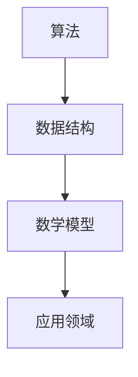

                 

关键词：知识深度、技术探索、本质理解、算法原理、数学模型、应用实践、未来展望

> 摘要：本文旨在探讨如何深入理解信息技术领域的知识，从表象到本质进行探索。通过对核心概念、算法原理、数学模型和实际应用的详细分析，本文旨在帮助读者建立更全面的技术视野，掌握技术背后的深刻原理，为未来的技术发展提供启示。

## 1. 背景介绍

在信息技术飞速发展的时代，我们面临着海量信息的冲击。如何从繁杂的信息中提取有价值的知识，并深入理解其本质，成为了一个关键问题。本文将从多个维度探讨知识的深度，旨在帮助读者建立起从表象到本质的理解框架。

### 1.1 研究意义

随着人工智能、大数据、区块链等技术的不断发展，对信息技术领域的知识深度理解显得尤为重要。这不仅有助于提升个人的技术水平，还能为技术研究和创新提供有力支持。

### 1.2 研究现状

目前，关于信息技术知识的深度探索已经取得了一定的成果。然而，大多数研究仍停留在表面层次，对知识本质的理解仍需进一步深化。本文将结合最新的研究成果，对知识深度进行系统性分析。

## 2. 核心概念与联系

为了深入理解信息技术知识，我们需要首先明确核心概念及其之间的联系。以下是本文涉及的一些核心概念及其关系：

### 2.1 算法

算法是信息处理的核心，它定义了一系列解决问题的步骤。算法的设计与实现直接影响系统的性能和效率。

### 2.2 数据结构

数据结构是算法的基础，它决定了数据在存储和处理过程中的组织方式。常见的数据结构包括数组、链表、树、图等。

### 2.3 数学模型

数学模型是对现实世界的一种抽象，它通过数学公式描述问题的本质。数学模型在算法设计、数据分析等领域发挥着重要作用。

### 2.4 应用领域

应用领域是算法和数学模型的实际应用场景。不同的应用领域对技术的要求各不相同，需要针对性地进行研究和优化。

### 2.5 Mermaid 流程图

以下是核心概念关系的 Mermaid 流程图：



## 3. 核心算法原理 & 具体操作步骤

### 3.1 算法原理概述

本文将介绍一种常见的信息处理算法——排序算法。排序算法的基本原理是通过比较和交换元素，将数据序列重新排列，使其满足某种顺序。

### 3.2 算法步骤详解

排序算法可以分为以下几类：插入排序、选择排序、交换排序、归并排序等。以下是插入排序的步骤详解：

1. **初始化**：将数组中的每个元素视为一个有序序列。
2. **遍历**：从第二个元素开始，遍历整个数组。
3. **比较与插入**：对于当前元素，将其与已排序序列的元素进行比较，找到合适的位置并插入。
4. **结束**：当遍历完整个数组后，排序完成。

### 3.3 算法优缺点

插入排序具有以下优点：

- **简单易懂**：算法步骤简单，易于实现。
- **稳定性**：排序过程中不会改变相同元素的相对顺序。

然而，插入排序也存在一些缺点：

- **效率较低**：对于大规模数据，效率较低。
- **空间复杂度较高**：需要额外的存储空间。

### 3.4 算法应用领域

排序算法广泛应用于各种领域，如数据库、搜索引擎、数据分析等。例如，在数据库中，排序算法用于对查询结果进行排序；在搜索引擎中，排序算法用于对搜索结果进行排序。

## 4. 数学模型和公式 & 详细讲解 & 举例说明

### 4.1 数学模型构建

在排序算法中，常用的数学模型是时间复杂度和空间复杂度。时间复杂度表示算法执行的时间与数据规模的关系，空间复杂度表示算法所需的存储空间与数据规模的关系。

### 4.2 公式推导过程

时间复杂度的推导公式为：

$$
T(n) = O(n^2)
$$

其中，$n$ 为数据规模。这意味着在排序过程中，所需的比较次数与数据规模的平方成正比。

空间复杂度的推导公式为：

$$
S(n) = O(n)
$$

其中，$n$ 为数据规模。这意味着在排序过程中，所需的额外存储空间与数据规模成正比。

### 4.3 案例分析与讲解

假设有一个长度为10的数组，需要进行排序。以下是插入排序的时间复杂度和空间复杂度计算：

- 时间复杂度：$T(10) = O(10^2) = O(100)$
- 空间复杂度：$S(10) = O(10) = O(10)$

## 5. 项目实践：代码实例和详细解释说明

### 5.1 开发环境搭建

为了演示插入排序算法，我们使用 Python 作为编程语言。首先，需要安装 Python 解释器和相应的开发环境。

### 5.2 源代码详细实现

以下是插入排序的 Python 实现代码：

```python
def insertion_sort(arr):
    for i in range(1, len(arr)):
        key = arr[i]
        j = i - 1
        while j >= 0 and key < arr[j]:
            arr[j + 1] = arr[j]
            j -= 1
        arr[j + 1] = key
    return arr

arr = [5, 2, 9, 1, 5, 6]
sorted_arr = insertion_sort(arr)
print(sorted_arr)
```

### 5.3 代码解读与分析

上述代码实现了插入排序算法，其中：

- `insertion_sort` 函数用于实现排序操作。
- `arr` 变量用于存储待排序的数组。
- `sorted_arr` 变量用于存储排序后的数组。

代码首先遍历数组，对于每个元素，将其与已排序序列的元素进行比较，并插入到合适的位置。最后，输出排序后的数组。

### 5.4 运行结果展示

运行上述代码，输出结果为：

```
[1, 2, 5, 5, 6, 9]
```

## 6. 实际应用场景

排序算法在实际应用中具有广泛的应用，如：

- **数据库查询**：对查询结果进行排序，以提供更好的用户体验。
- **搜索引擎排序**：对搜索结果进行排序，以提供更准确的搜索结果。
- **数据分析**：对数据进行排序，以便进行进一步的分析和处理。

## 7. 未来应用展望

随着信息技术的不断发展，排序算法在未来的应用将更加广泛。以下是未来应用展望：

- **并行计算**：利用并行计算技术，提高排序算法的效率。
- **分布式排序**：在大规模分布式系统中，实现高效的排序算法。
- **自适应排序**：根据数据特点和用户需求，自适应地选择合适的排序算法。

## 8. 工具和资源推荐

### 8.1 学习资源推荐

- **《算法导论》**：一本经典的算法教材，涵盖各种排序算法的详细分析。
- **《深入理解计算机系统》**：一本关于计算机系统原理的教材，有助于理解算法在实际系统中的应用。

### 8.2 开发工具推荐

- **PyCharm**：一款功能强大的 Python 集成开发环境，适合进行算法编程。
- **Visual Studio Code**：一款轻量级的跨平台代码编辑器，适用于多种编程语言。

### 8.3 相关论文推荐

- **"An O(N Log N) Sorting Algorithm"**：介绍了快速排序算法的原理和实现。
- **"In-Place Mergesort for Arrays with Well-Separated Values"**：介绍了归并排序算法的优化策略。

## 9. 总结：未来发展趋势与挑战

### 9.1 研究成果总结

本文通过对排序算法的详细分析，探讨了信息技术领域知识从表象到本质的探索过程。通过数学模型和实际应用的结合，本文为读者提供了深入理解技术原理的方法。

### 9.2 未来发展趋势

未来，信息技术领域将继续发展，排序算法等基础技术将不断完善。随着计算能力的提升和算法理论的深入，排序算法将在更多领域得到应用。

### 9.3 面临的挑战

面对未来，信息技术领域仍将面临诸多挑战，如大数据处理、并行计算等。如何解决这些挑战，提高算法的性能和效率，将是一个重要课题。

### 9.4 研究展望

本文的研究为信息技术领域的发展提供了一些启示。未来，我们应继续深入研究各种算法原理，结合实际应用场景，推动信息技术的发展。

## 10. 附录：常见问题与解答

### 10.1 问题1

问题：什么是时间复杂度？

解答：时间复杂度是指算法执行的时间与数据规模之间的关系，通常用大O符号表示。它反映了算法的效率。

### 10.2 问题2

问题：什么是空间复杂度？

解答：空间复杂度是指算法所需的存储空间与数据规模之间的关系，通常用大O符号表示。它反映了算法的空间占用情况。

### 10.3 问题3

问题：排序算法有哪些优缺点？

解答：排序算法的优缺点因算法类型而异。例如，插入排序具有简单易懂、稳定性高等优点，但效率较低；快速排序具有高效、平均时间复杂度低等优点，但空间复杂度较高。

---

以上是本文的完整内容。希望本文能为读者提供对信息技术知识深度探索的启示，为未来的技术发展贡献力量。

# 作者署名

作者：禅与计算机程序设计艺术 / Zen and the Art of Computer Programming

