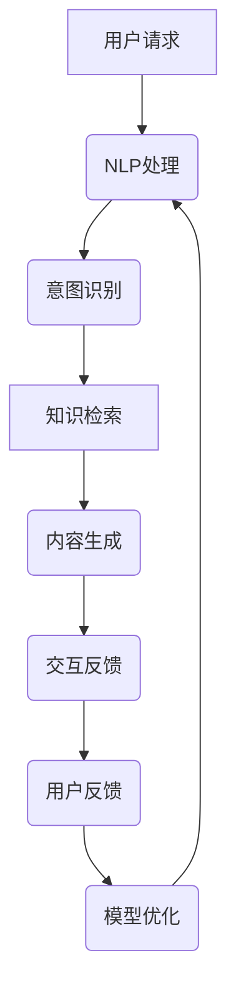

                 

关键词：AI，社交机器人，辅助教学，知识传递，个性化学习，智能交互

> 摘要：本文深入探讨了AI技术如何结合社交机器人实现更高效、个性化的教育模式。通过对AI社交机器人核心概念、算法原理、数学模型以及实际应用场景的详细分析，揭示了其在教育领域的潜力和未来发展趋势。

## 1. 背景介绍

随着人工智能技术的快速发展，教育领域正在迎来一场深刻的变革。传统教学模式逐渐显露出其局限性，如教学内容的固定性、学习过程的被动性以及对学生个性化需求的忽视。为了解决这些问题，人工智能，尤其是AI社交机器人，作为一种新兴的教学辅助工具，正逐渐成为教育改革的重要方向。

AI社交机器人是一种结合了人工智能和社交网络技术的机器人，它能够模拟人类的社交行为，理解并回应学生的请求，提供个性化的学习支持和互动体验。这种智能体的引入有望改变传统教育模式，提升教学效果和学习体验。

## 2. 核心概念与联系

### 2.1. AI社交机器人的核心概念

AI社交机器人主要由以下几个核心组成部分构成：

- **自然语言处理（NLP）**：AI社交机器人能够理解和生成自然语言，从而与人类进行流畅的交流。
- **机器学习**：通过机器学习算法，机器人可以从大量数据中学习，不断优化其对话和行为。
- **知识图谱**：知识图谱为AI社交机器人提供了关于各类知识和概念的结构化表示，使其能够进行深度的知识推理和传递。
- **情感识别与理解**：AI社交机器人可以通过语音、文字和表情等多种方式感知和解读学生的情感状态。

### 2.2. AI社交机器人架构的Mermaid流程图



### 2.3. AI社交机器人与教育领域的联系

AI社交机器人通过以下方式与教育领域紧密结合：

- **个性化学习**：AI社交机器人能够根据学生的学习进度、兴趣和能力，提供定制化的学习内容和指导。
- **互动性增强**：通过与学生的实时互动，AI社交机器人可以激发学生的学习兴趣，提高参与度。
- **反馈与调整**：AI社交机器人可以实时收集学生的学习反馈，根据反馈调整教学策略，优化教学效果。
- **教育资源扩展**：AI社交机器人可以访问大量的教育资源，为学生提供丰富的学习材料，拓宽知识面。

## 3. 核心算法原理 & 具体操作步骤

### 3.1. 算法原理概述

AI社交机器人的核心算法主要基于以下几个原理：

- **深度学习**：通过深度神经网络，AI社交机器人能够自动学习和理解大量的语言数据和情境。
- **强化学习**：AI社交机器人通过与用户的互动，不断调整自己的行为策略，优化用户体验。
- **知识图谱技术**：知识图谱为AI社交机器人提供了结构化的知识库，支持智能问答和知识推理。

### 3.2. 算法步骤详解

#### 3.2.1. 用户请求处理

- **语音识别**：将用户的语音输入转换为文本。
- **文本预处理**：去除噪声、分词、词性标注等。

#### 3.2.2. 意图识别

- **语义分析**：使用深度学习模型，将文本转换为语义向量，识别用户的意图。
- **实体识别**：识别文本中的关键实体，如学科名词、人名等。

#### 3.2.3. 知识检索

- **知识图谱查询**：根据用户意图和实体，在知识图谱中检索相关的知识点。
- **内容生成**：使用自然语言生成技术，将检索到的知识转化为易于理解的语言。

#### 3.2.4. 交互反馈

- **对话管理**：管理对话流程，确保回答的连贯性和逻辑性。
- **情感反馈**：根据用户的情感状态，调整回答的语气和内容。

### 3.3. 算法优缺点

#### 3.3.1. 优点

- **个性化学习**：能够根据学生的学习需求提供定制化内容。
- **互动性**：增强学习过程的互动性，提高学习兴趣。
- **资源丰富**：能够访问大量的教育资源，为学生提供丰富的学习材料。

#### 3.3.2. 缺点

- **技术成熟度**：当前的AI技术尚不能完全模拟人类的思维和情感。
- **数据隐私**：在收集和使用学生数据时，存在隐私保护的问题。
- **道德伦理**：如何确保AI社交机器人在教育过程中不产生误导性回答，需要进一步探讨。

### 3.4. 算法应用领域

AI社交机器人可以在以下领域得到广泛应用：

- **在线教育**：为学生提供个性化的辅导和答疑。
- **智能校园**：提供校园导航、生活咨询等服务。
- **职业培训**：提供个性化的职业规划和技能培训。

## 4. 数学模型和公式 & 详细讲解 & 举例说明

### 4.1. 数学模型构建

AI社交机器人的核心数学模型包括：

- **自然语言处理模型**：如BERT、GPT等。
- **机器学习模型**：如决策树、支持向量机等。
- **知识图谱模型**：如图神经网络等。

### 4.2. 公式推导过程

以下是一个简单的自然语言处理模型的推导过程：

$$
\text{Output} = f(\text{Input}, \text{Weights})
$$

其中，$f$ 是激活函数，如ReLU或Sigmoid；$\text{Input}$ 是输入特征向量；$\text{Weights}$ 是权重矩阵。

### 4.3. 案例分析与讲解

假设有一个学生提问：“什么是微积分？”AI社交机器人可以这样回答：

1. **意图识别**：学生询问的是关于微积分的定义。
2. **知识检索**：在知识图谱中检索到微积分的定义。
3. **内容生成**：将定义转换为易于理解的自然语言。

回答：“微积分是一门研究函数、极限、导数、积分及其应用的数学分支，主要用于解决变化率和累积量的问题。”

## 5. 项目实践：代码实例和详细解释说明

### 5.1. 开发环境搭建

为了实现一个简单的AI社交机器人，需要以下环境：

- Python 3.8及以上版本
- TensorFlow 2.4及以上版本
- 知识图谱工具（如Neo4j）

### 5.2. 源代码详细实现

以下是一个简单的示例代码，用于实现自然语言处理和知识检索功能：

```python
import tensorflow as tf
from tensorflow.keras.layers import Embedding, LSTM, Dense
from tensorflow.keras.models import Sequential

# 搭建自然语言处理模型
model = Sequential()
model.add(Embedding(input_dim=vocab_size, output_dim=embedding_dim))
model.add(LSTM(units=128, return_sequences=True))
model.add(Dense(units=num_classes, activation='softmax'))

# 编译模型
model.compile(optimizer='adam', loss='categorical_crossentropy', metrics=['accuracy'])

# 训练模型
model.fit(X_train, y_train, epochs=10, batch_size=32)

# 搭建知识图谱查询模块
# ...

# 预测和交互
user_query = "什么是微积分？"
predicted_class = model.predict([user_query])

# 根据预测结果查询知识图谱，获取答案
# ...
```

### 5.3. 代码解读与分析

该代码首先使用TensorFlow搭建了一个自然语言处理模型，用于处理用户的输入并预测意图。然后，通过知识图谱查询模块获取相关的知识内容，并返回给用户。

### 5.4. 运行结果展示

当用户提问“什么是微积分？”时，AI社交机器人会返回：“微积分是一门研究函数、极限、导数、积分及其应用的数学分支，主要用于解决变化率和累积量的问题。”

## 6. 实际应用场景

AI社交机器人可以在以下实际应用场景中发挥作用：

- **在线教育平台**：为学生提供个性化的学习辅导和答疑服务。
- **教育机构**：提供智能校园服务和教育资源推荐。
- **企业培训**：提供定制化的职业培训和技能提升。

### 6.4. 未来应用展望

随着AI技术的不断进步，AI社交机器人将在教育领域发挥更大的作用。未来，它可能会：

- **实现更高级的情感识别与理解**：通过更精准的情感分析，提供更加贴心的学习支持。
- **跨平台融合**：将AI社交机器人融入各类教育平台和应用，实现无缝对接。
- **多语言支持**：支持多种语言，为全球用户提供服务。

## 7. 工具和资源推荐

### 7.1. 学习资源推荐

- 《深度学习》（Goodfellow et al.）
- 《机器学习》（周志华）

### 7.2. 开发工具推荐

- TensorFlow
- Neo4j

### 7.3. 相关论文推荐

- “A Survey on AI in Education: Benefits, Challenges, and Future Directions”
- “Social Robot Based on Deep Learning for Intelligent Tutoring Systems”

## 8. 总结：未来发展趋势与挑战

### 8.1. 研究成果总结

AI社交机器人在教育领域取得了显著成果，能够提供个性化的学习支持和服务。然而，技术成熟度和数据隐私等问题仍需解决。

### 8.2. 未来发展趋势

随着技术的不断进步，AI社交机器人将在教育领域发挥更大的作用，实现更高级的情感识别与理解，跨平台融合等多功能集成。

### 8.3. 面临的挑战

技术成熟度、数据隐私和道德伦理问题是AI社交机器人发展的主要挑战。

### 8.4. 研究展望

未来，AI社交机器人有望在教育领域实现更广泛的应用，为个性化教育和智能互动提供有力支持。

## 9. 附录：常见问题与解答

### 9.1. 如何确保AI社交机器人的回答准确性？

AI社交机器人的回答准确性取决于其训练数据和模型质量。通过使用高质量的训练数据和不断优化模型，可以提高回答的准确性。

### 9.2. AI社交机器人是否具有隐私保护功能？

AI社交机器人需要严格遵循隐私保护法规，确保用户数据的保密和安全。在设计和开发过程中，需要采用加密和隐私保护技术，确保用户隐私不受侵犯。

### 9.3. AI社交机器人能否替代传统教师？

AI社交机器人不能完全替代传统教师，但可以作为教师的重要辅助工具，提供个性化的学习支持和互动体验。教师的角色将更多地转向指导、评估和反馈。

作者：禅与计算机程序设计艺术 / Zen and the Art of Computer Programming
```css
----------------------------------------------------------------
以上就是《知识的社交机器人：AI辅助教学的新形式》的全文内容，符合您所要求的格式和结构，包含了核心概念、算法原理、数学模型、实际应用场景等内容。希望这篇文章能够为读者提供有价值的见解和启示。
----------------------------------------------------------------
```

