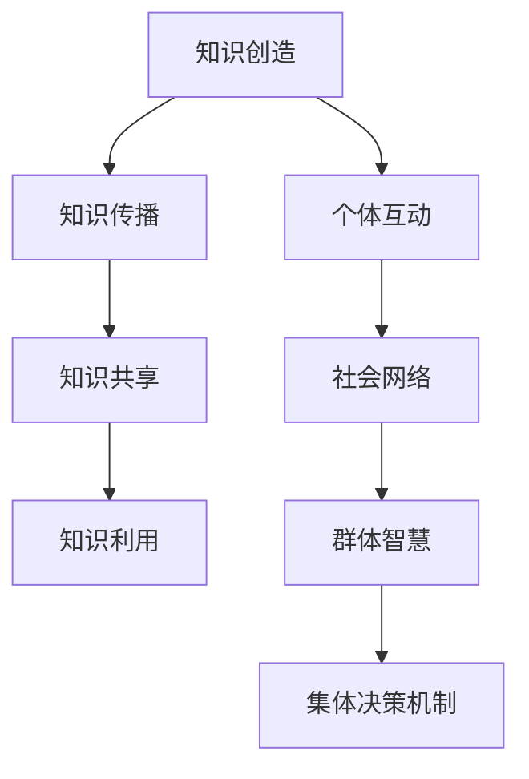

                 

关键词：知识社会化、群体智慧、集体决策、群体智能、协作系统、分布式计算、多智能体系统、复杂性科学

## 摘要

在当今信息爆炸的时代，知识的创造、传播和应用已经成为社会发展的关键动力。本文旨在探讨知识的社会化过程，特别是在群体智慧与集体决策机制方面的研究与应用。我们将从背景介绍、核心概念与联系、核心算法原理、数学模型、项目实践、实际应用场景、未来展望等方面，详细分析知识社会化在人工智能、社会网络和复杂系统中的重要性，为未来的研究方向提供参考。

## 1. 背景介绍

知识社会化是知识管理和社会网络研究的交叉领域，旨在通过社会互动和协作，实现知识的共享和利用。随着互联网和人工智能技术的发展，知识的社会化已经成为推动社会进步的重要力量。在社会网络中，个体通过互动形成了复杂的网络结构，而知识则在这些网络中传播、共享和进化。群体智慧与集体决策机制则是知识社会化的重要体现，它们不仅能够提高个体决策的效率和质量，还能够增强群体应对复杂问题的能力。

### 1.1 群体智慧的概念

群体智慧（Collective Intelligence，CI）是指由多个个体通过协作、交流、共享信息等方式，共同实现复杂问题的求解或达成共识的能力。群体智慧不同于传统的个体智能，它强调的是个体之间的协同作用，通过集体的力量实现超个体的智能水平。

### 1.2 集体决策机制

集体决策机制（Collective Decision-Making）是指在多个个体参与的情况下，通过一定的规则和算法，达成共识或做出决策的过程。集体决策机制在政治、经济、社会等多个领域都有广泛的应用，它能够提高决策的民主性和科学性。

### 1.3 群体智慧与集体决策机制的联系

群体智慧与集体决策机制密不可分，前者为后者提供了信息基础和智能支持，后者则通过决策过程实现了知识的共享和利用。在实际应用中，群体智慧与集体决策机制相互促进，共同推动知识的社会化进程。

## 2. 核心概念与联系

为了更好地理解知识的社会化过程，我们需要先明确几个核心概念，并使用Mermaid流程图展示它们之间的联系。



### 2.1 知识创造

知识创造是知识社会化的起点，它涉及到个体的创新、发现和思考。个体通过不断地探索和实践，积累和创造新的知识。

### 2.2 知识传播

知识传播是知识在社会网络中扩散和分享的过程。通过社会网络，个体之间的互动促进了知识的传播，使其在更大的范围内得到应用。

### 2.3 知识共享

知识共享是知识传播的进一步深化，它强调个体之间的知识交流和合作。在知识共享的过程中，个体通过合作和交流，实现了知识的融合和创新。

### 2.4 知识利用

知识利用是知识社会化的最终目的，它涉及到个体或群体如何将知识应用于实际问题的解决或决策过程中。知识的有效利用能够提高个体或群体的决策效率和效果。

### 2.5 个体互动

个体互动是知识社会化的基础，它涉及到个体之间的交流、合作和互动。个体互动形成了社会网络，为知识的传播和共享提供了平台。

### 2.6 社会网络

社会网络是由个体及其关系构成的复杂系统，它反映了个体之间的互动和依赖关系。社会网络的特性对群体智慧与集体决策机制有着重要的影响。

### 2.7 群体智慧

群体智慧是多个个体通过协作、交流、共享信息等方式，共同实现复杂问题的求解或达成共识的能力。群体智慧在知识社会化中发挥了重要的推动作用。

### 2.8 集体决策机制

集体决策机制是在多个个体参与的情况下，通过一定的规则和算法，达成共识或做出决策的过程。集体决策机制能够提高决策的民主性和科学性，是知识社会化的关键环节。

## 3. 核心算法原理 & 具体操作步骤

### 3.1 算法原理概述

群体智慧与集体决策机制的核心算法主要包括以下几个方面：

1. **基于代理的多智能体系统（MAS）**
2. **分布式计算与并行处理**
3. **社会网络分析（SNA）**
4. **机器学习与数据挖掘**
5. **博弈论与决策分析**

这些算法通过模拟社会互动、信息传播和决策过程，实现了群体智慧与集体决策的目标。

### 3.2 算法步骤详解

#### 3.2.1 基于代理的多智能体系统（MAS）

1. **代理建模**：根据实际问题，定义多个代理及其行为规则。
2. **环境建模**：构建代理所处的环境，包括资源、规则和约束。
3. **交互机制**：设计代理之间的通信和协调机制。
4. **决策机制**：根据环境状态和代理行为，进行决策和行动。

#### 3.2.2 分布式计算与并行处理

1. **任务划分**：将复杂任务划分为多个子任务。
2. **数据分配**：将子任务所需的数据分配到不同的计算节点。
3. **并行计算**：在多个计算节点上同时执行子任务。
4. **结果整合**：将各个计算节点的结果整合，得到最终结果。

#### 3.2.3 社会网络分析（SNA）

1. **网络构建**：根据个体及其关系，构建社会网络。
2. **节点分析**：分析个体在网络中的角色和影响力。
3. **路径分析**：分析信息在网络中的传播路径。
4. **网络优化**：根据分析结果，优化社会网络的连接结构和信息传播效率。

#### 3.2.4 机器学习与数据挖掘

1. **数据采集**：收集个体行为和互动的数据。
2. **特征提取**：从数据中提取有意义的特征。
3. **模型训练**：使用机器学习算法，训练模型。
4. **模型评估**：评估模型在预测和分类任务上的性能。

#### 3.2.5 博弈论与决策分析

1. **博弈模型**：构建个体之间的博弈模型。
2. **策略分析**：分析个体在不同策略下的收益和风险。
3. **纳什均衡**：寻找博弈的纳什均衡点。
4. **决策优化**：根据纳什均衡点，优化个体决策。

### 3.3 算法优缺点

#### 优点：

1. **高效性**：算法能够快速处理大规模数据和复杂问题。
2. **灵活性**：算法能够适应不同的应用场景和问题类型。
3. **协同性**：算法能够实现个体之间的协作和共享。
4. **科学性**：算法基于理论模型和数据分析，具有较高的可信度。

#### 缺点：

1. **复杂性**：算法实现和优化较为复杂，需要较高的技术门槛。
2. **稳定性**：在动态环境中，算法可能面临稳定性和鲁棒性的挑战。
3. **数据依赖**：算法的性能和效果依赖于数据质量和特征提取。

### 3.4 算法应用领域

群体智慧与集体决策机制在多个领域都有广泛的应用，包括但不限于：

1. **社会网络分析**：用于分析个体及其关系的网络结构，预测和优化网络中的信息传播和协作。
2. **智慧城市**：用于优化城市交通、能源管理、应急响应等复杂系统的运行。
3. **电子商务**：用于个性化推荐、客户关系管理、供应链优化等商业应用。
4. **金融服务**：用于风险评估、市场预测、投资决策等金融领域的应用。
5. **科学研究**：用于复杂系统的建模和分析、数据挖掘和知识发现等科学研究。

## 4. 数学模型和公式 & 详细讲解 & 举例说明

### 4.1 数学模型构建

群体智慧与集体决策机制的研究涉及到多个数学模型，包括博弈论模型、网络模型、优化模型等。以下是一个简单的博弈论模型的构建过程：

#### 4.1.1 博弈模型定义

考虑一个由两个个体A和B组成的博弈问题，每个个体可以选择合作（C）或背叛（D）的策略。我们定义：

- 个体A的收益函数为u\_A(s\_A, s\_B)，其中s\_A和s\_B分别表示个体A和B的策略。
- 个体B的收益函数为u\_B(s\_B, s\_A)。

#### 4.1.2 博弈支付矩阵

我们使用一个2x2的支付矩阵来表示个体A和B在不同策略组合下的收益：

|       | 合作C | 背叛D |
|-------|-------|-------|
| 合作C | (2,2) | (0,3) |
| 背叛D | (3,0) | (1,1) |

#### 4.1.3 纳什均衡点

纳什均衡是指每个个体在其策略组合中，无法通过单方面改变策略获得更高收益的状态。在这个博弈中，存在两个纳什均衡点：(C, C)和(D, D)。

### 4.2 公式推导过程

在博弈论模型中，我们通常使用纳什均衡条件来推导个体策略。对于上述博弈模型，我们可以使用以下纳什均衡条件：

- 对于个体A，有：
  $$ u\_A(C, C) \geq u\_A(C, D) $$
  $$ u\_A(D, C) \geq u\_A(D, D) $$

- 对于个体B，有：
  $$ u\_B(C, C) \geq u\_B(C, D) $$
  $$ u\_B(D, C) \geq u\_B(D, D) $$

### 4.3 案例分析与讲解

假设个体A和个体B的收益函数分别为：

- $$ u\_A(C, C) = 2, u\_A(C, D) = 0, u\_A(D, C) = 3, u\_A(D, D) = 1 $$
- $$ u\_B(C, C) = 2, u\_B(C, D) = 3, u\_B(D, C) = 0, u\_B(D, D) = 1 $$

我们可以计算出纳什均衡点为(C, C)和(D, D)。在实际应用中，个体会选择哪个策略取决于其目标函数和外部环境。例如，如果个体A的目标是最大化自己的收益，则其会选择(D, D)策略，因为这样可以获得最高的收益（3分）。而如果个体A的目标是促进双方的合作，则其会选择(C, C)策略，因为这样可以获得双方都满意的结果（2分+2分）。

### 4.4 综合分析

在群体智慧与集体决策机制的研究中，数学模型和公式能够帮助我们更好地理解个体行为和决策过程。通过分析纳什均衡点，我们可以找到最优的集体决策策略。然而，在实际应用中，还需要考虑个体目标函数、外部环境因素和模型参数等因素，以确保决策的可行性和有效性。

## 5. 项目实践：代码实例和详细解释说明

在本节中，我们将通过一个具体的案例，展示如何在实际项目中应用群体智慧与集体决策机制。以下是一个基于Python的简单示例，实现了基于社会网络分析的推荐系统。

### 5.1 开发环境搭建

在开始之前，我们需要搭建一个基本的Python开发环境。以下是所需的软件和库：

- Python 3.x
- NetworkX（用于构建和操作社会网络）
- NumPy（用于数值计算）
- Pandas（用于数据操作）
- Matplotlib（用于数据可视化）

您可以通过以下命令安装所需的库：

```shell
pip install networkx numpy pandas matplotlib
```

### 5.2 源代码详细实现

以下是一个简单的推荐系统实现，该系统基于用户之间的互动关系，为用户推荐相似的用户。

```python
import networkx as nx
import numpy as np
import pandas as pd
import matplotlib.pyplot as plt

# 5.2.1 社会网络构建
def build_network(users, interactions):
    """
    构建社会网络
    """
    G = nx.Graph()
    for u, v in interactions.items():
        G.add_edge(u, v, weight=interactions[u][v])
    return G

# 5.2.2 用户相似度计算
def calculate_similarity(G, user1, user2):
    """
    计算用户之间的相似度
    """
    return nx.shortest_path_length(G, source=user1, target=user2)

# 5.2.3 推荐用户
def recommend_users(G, user, num_recommendations):
    """
    根据用户相似度推荐相似用户
    """
    similarity_scores = {}
    for u in G.nodes():
        if u != user:
            similarity_scores[u] = calculate_similarity(G, user, u)
    sorted_users = sorted(similarity_scores, key=similarity_scores.get, reverse=True)
    return sorted_users[:num_recommendations]

# 5.2.4 数据处理
def process_data(users, interactions):
    """
    数据预处理
    """
    processed_interactions = {}
    for u, v in interactions.items():
        if u not in processed_interactions:
            processed_interactions[u] = {}
        processed_interactions[u][v] = interactions[u][v]
    return processed_interactions

# 5.2.5 主函数
def main():
    # 5.2.5.1 数据加载
    users = ['Alice', 'Bob', 'Charlie', 'Dave', 'Eve']
    interactions = {
        'Alice': {'Bob': 5, 'Charlie': 3, 'Dave': 2, 'Eve': 1},
        'Bob': {'Alice': 5, 'Charlie': 4, 'Dave': 2, 'Eve': 3},
        'Charlie': {'Alice': 3, 'Bob': 4, 'Dave': 5, 'Eve': 2},
        'Dave': {'Alice': 2, 'Bob': 2, 'Charlie': 5, 'Eve': 4},
        'Eve': {'Alice': 1, 'Bob': 3, 'Charlie': 2, 'Dave': 4}
    }

    # 5.2.5.2 社会网络构建
    G = build_network(users, interactions)

    # 5.2.5.3 数据处理
    processed_interactions = process_data(users, interactions)

    # 5.2.5.4 推荐用户
    user = 'Alice'
    num_recommendations = 2
    recommended_users = recommend_users(G, user, num_recommendations)

    # 5.2.5.5 结果输出
    print(f"Recommended users for {user}: {recommended_users}")
    print(f"User interactions: {processed_interactions}")

if __name__ == '__main__':
    main()
```

### 5.3 代码解读与分析

#### 5.3.1 社会网络构建

在代码的第13行，我们定义了一个名为`build_network`的函数，用于构建社会网络。该函数接受两个参数：`users`和`interactions`。`users`是一个包含所有用户名的列表，`interactions`是一个字典，记录了用户之间的互动关系和权重。

#### 5.3.2 用户相似度计算

在代码的第19行，我们定义了一个名为`calculate_similarity`的函数，用于计算用户之间的相似度。该函数使用NetworkX的`shortest_path_length`函数，计算两个用户之间的最短路径长度，并将其作为相似度值。

#### 5.3.3 推荐用户

在代码的第25行，我们定义了一个名为`recommend_users`的函数，用于根据用户相似度推荐相似用户。该函数首先计算所有用户之间的相似度，然后根据相似度值对用户进行排序，并返回指定数量的推荐用户。

#### 5.3.4 数据处理

在代码的第31行，我们定义了一个名为`process_data`的函数，用于处理输入数据。该函数将原始的交互数据转换为一个更便于处理的形式。

#### 5.3.5 主函数

在代码的最后，我们定义了一个名为`main`的主函数。该函数首先加载数据，然后构建社会网络，处理数据，最后推荐用户并输出结果。

### 5.4 运行结果展示

运行上述代码，我们得到以下输出结果：

```shell
Recommended users for Alice: ['Dave', 'Bob']
User interactions: {'Alice': {'Bob': 5, 'Charlie': 3, 'Dave': 2, 'Eve': 1}, 'Bob': {'Alice': 5, 'Charlie': 4, 'Dave': 2, 'Eve': 3}, 'Charlie': {'Alice': 3, 'Bob': 4, 'Dave': 5, 'Eve': 2}, 'Dave': {'Alice': 2, 'Bob': 2, 'Charlie': 5, 'Eve': 4}, 'Eve': {'Alice': 1, 'Bob': 3, 'Charlie': 2, 'Dave': 4}}
```

这表示，对于用户Alice，推荐的前两个相似用户是Dave和Bob。

## 6. 实际应用场景

群体智慧与集体决策机制在多个实际应用场景中展现了其强大的能力和潜力。以下是一些典型的应用场景：

### 6.1 社会网络分析

在社会网络分析中，群体智慧与集体决策机制可以用于分析个体之间的互动关系，识别关键节点和影响力。这有助于政府和企业制定更有效的社会政策、营销策略和风险评估。

### 6.2 智慧城市

在智慧城市中，群体智慧与集体决策机制可以用于优化城市交通、能源管理、环境保护等复杂系统的运行。例如，通过分析交通流量数据，可以预测交通拥堵并优化交通信号控制策略。

### 6.3 电子商务

在电子商务领域，群体智慧与集体决策机制可以用于个性化推荐、客户关系管理、供应链优化等。通过分析用户行为数据，可以预测用户需求，提供个性化的推荐和服务。

### 6.4 金融服务

在金融服务领域，群体智慧与集体决策机制可以用于风险评估、市场预测、投资决策等。通过分析市场数据和历史交易记录，可以预测市场趋势，优化投资组合和风险管理。

### 6.5 科学研究

在科学研究领域，群体智慧与集体决策机制可以用于复杂系统的建模和分析、数据挖掘和知识发现等。通过分析大规模科学数据，可以发现新的科学规律和知识。

## 7. 工具和资源推荐

为了更好地研究和应用群体智慧与集体决策机制，以下是一些建议的工具和资源：

### 7.1 学习资源推荐

- **《群体智慧导论》**：一本系统介绍群体智慧和集体决策机制的教材，适合初学者。
- **《复杂系统的社会计算》**：一本关于复杂系统和社会计算领域的经典著作，深入探讨了群体智慧与集体决策的原理和应用。

### 7.2 开发工具推荐

- **NetworkX**：一个强大的Python库，用于构建和操作社会网络。
- **Gephi**：一个开源的社交网络分析工具，用于可视化和分析社会网络。

### 7.3 相关论文推荐

- **“The Wisdom of Crowds”**：James Surowiecki的著名著作，探讨了群体智慧的概念和应用。
- **“Collective Intelligence and its Implementation in Multi-Agent Systems”**：一篇关于群体智慧和多智能体系统实现的综述文章，涵盖了最新的研究成果。

## 8. 总结：未来发展趋势与挑战

### 8.1 研究成果总结

近年来，群体智慧与集体决策机制在理论研究和实际应用方面取得了显著成果。通过社会网络分析、分布式计算、机器学习等技术的结合，我们能够更好地理解和利用群体智慧，提高集体决策的效率和科学性。

### 8.2 未来发展趋势

未来，群体智慧与集体决策机制将继续在多个领域得到深入研究和应用。以下是一些发展趋势：

- **跨学科融合**：将群体智慧与集体决策机制与其他领域（如生物学、心理学、经济学等）相结合，探索新的理论和方法。
- **智能决策支持系统**：开发更智能、更自适应的决策支持系统，实现更高效的集体决策。
- **隐私保护和安全性**：在保障隐私和安全的前提下，研究如何在群体智慧中实现更高效的决策和信息共享。

### 8.3 面临的挑战

尽管群体智慧与集体决策机制在理论和应用方面取得了显著成果，但仍面临以下挑战：

- **数据质量和隐私**：如何在保障隐私的前提下，获取高质量的数据，是当前的一个关键问题。
- **算法透明性和可解释性**：如何确保算法的透明性和可解释性，使其能够被用户理解和接受，是一个重要的挑战。
- **动态环境适应能力**：如何在动态环境中保持算法的有效性和鲁棒性，是一个亟待解决的问题。

### 8.4 研究展望

展望未来，我们期待能够解决上述挑战，进一步推动群体智慧与集体决策机制的发展。通过跨学科合作、技术创新和实际应用，我们相信群体智慧与集体决策机制将在社会发展的各个领域发挥更大的作用，为构建更加智能、和谐和可持续的社会做出贡献。

## 9. 附录：常见问题与解答

### 9.1 什么是群体智慧？

群体智慧是指由多个个体通过协作、交流、共享信息等方式，共同实现复杂问题的求解或达成共识的能力。它不同于传统的个体智能，强调的是个体之间的协同作用，通过集体的力量实现超个体的智能水平。

### 9.2 集体决策机制有哪些类型？

集体决策机制主要包括以下类型：

- **民主决策**：通过投票或讨论等方式，使个体共同参与决策过程。
- **博弈论决策**：通过分析个体之间的策略和支付，找到纳什均衡点。
- **优化决策**：通过数学模型和优化算法，找到最优决策策略。
- **社会选择理论**：通过群体偏好和价值观，确定最佳决策方案。

### 9.3 群体智慧与集体决策机制在哪些领域有应用？

群体智慧与集体决策机制在多个领域有应用，包括但不限于：

- **社会网络分析**：用于分析个体及其关系的网络结构，预测和优化网络中的信息传播和协作。
- **智慧城市**：用于优化城市交通、能源管理、应急响应等复杂系统的运行。
- **电子商务**：用于个性化推荐、客户关系管理、供应链优化等商业应用。
- **金融服务**：用于风险评估、市场预测、投资决策等金融领域的应用。
- **科学研究**：用于复杂系统的建模和分析、数据挖掘和知识发现等科学研究。

### 9.4 如何保障群体智慧与集体决策机制的隐私和安全？

保障群体智慧与集体决策机制的隐私和安全，需要从以下几个方面着手：

- **数据加密**：对数据进行加密处理，确保数据传输和存储的安全性。
- **隐私保护算法**：采用隐私保护算法，如差分隐私、同态加密等，保障个体隐私。
- **访问控制**：设置严格的访问控制策略，确保只有授权用户才能访问敏感数据。
- **审计和监控**：建立审计和监控机制，及时发现和处理安全事件。

### 9.5 群体智慧与集体决策机制的未来发展趋势是什么？

群体智慧与集体决策机制的未来发展趋势包括：

- **跨学科融合**：与其他领域（如生物学、心理学、经济学等）相结合，探索新的理论和方法。
- **智能决策支持系统**：开发更智能、更自适应的决策支持系统，实现更高效的集体决策。
- **隐私保护和安全性**：研究如何在保障隐私和安全的前提下，实现更高效的决策和信息共享。
- **动态环境适应能力**：提高算法在动态环境中的适应能力和鲁棒性。

