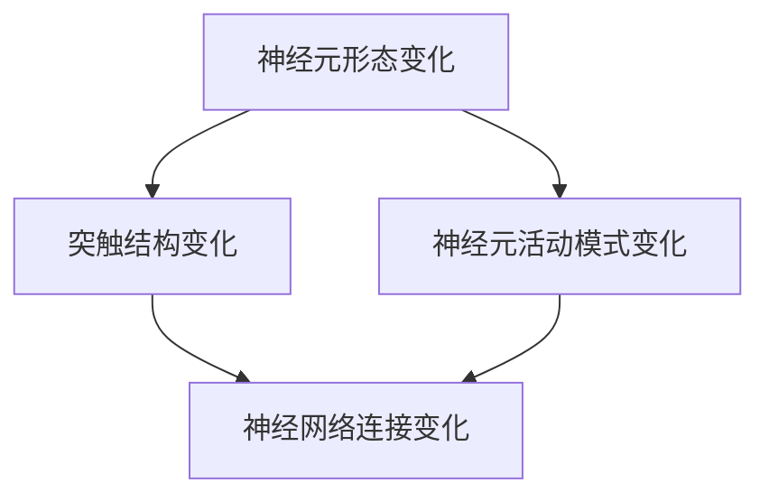

                 

关键词：知识神经可塑性、终身学习、脑科学、认知发展、算法设计

<|assistant|>摘要：本文探讨了知识神经可塑性的概念及其在终身学习中的应用。通过分析脑科学中的相关理论，探讨了如何通过优化学习方法和算法，提高个体的认知发展和学习能力。本文旨在为科技工作者和人工智能爱好者提供理论基础和实践指导，以推动终身学习的实现。

## 1. 背景介绍

在快速发展的信息技术时代，知识更新速度日益加快，终身学习已成为提升个人竞争力的关键。然而，传统学习模式往往难以适应不断变化的知识环境。为了应对这一挑战，我们需要深入探讨知识神经可塑性的机制，以及如何利用这一生物学基础来优化学习过程。

知识神经可塑性是指大脑在生命过程中的可变性和适应性，表现为大脑结构、功能和连接方式的改变。这一现象不仅受到遗传因素的影响，更受到外部环境刺激、学习经历和情绪状态的影响。因此，了解知识神经可塑性对于设计有效的学习策略具有重要意义。

## 2. 核心概念与联系

### 2.1 知识神经可塑性的基本概念

知识神经可塑性主要包括结构可塑性、功能可塑性和连接可塑性三个方面。

- **结构可塑性**：指神经元形态和突触结构的变化，如神经元大小、树突分支和突触密度等。
- **功能可塑性**：指神经元活动模式的改变，如神经元反应性、兴奋性和抑制性等。
- **连接可塑性**：指神经网络连接的变化，如突触的增强或减弱、神经环路的重塑等。

### 2.2 神经可塑性在学习中的作用

学习过程中，大脑通过神经元之间的相互作用形成新的突触连接，同时调整现有突触的强度。这一过程被称为“突触可塑性”。突触可塑性是知识神经可塑性的核心机制，它为学习提供了生物学基础。

### 2.3 神经可塑性相关架构的 Mermaid 流程图



## 3. 核心算法原理 & 具体操作步骤

### 3.1 算法原理概述

知识神经可塑性相关的算法主要包括：

- **突触可塑性算法**：用于模拟神经元之间突触连接的增强和减弱过程。
- **神经环路重塑算法**：用于模拟神经网络连接的重塑过程。

这些算法基于脑科学中的相关理论，如Hebb规则、长期增强（LTP）和长期抑制（LTD）等。

### 3.2 算法步骤详解

#### 3.2.1 突触可塑性算法

1. 初始化神经元状态和突触连接强度。
2. 根据神经元之间的交互，更新突触连接强度。
3. 根据突触连接强度的变化，调整神经元活动模式。

#### 3.2.2 神经环路重塑算法

1. 初始化神经网络结构。
2. 根据神经网络中的信息传递，调整神经网络连接。
3. 根据神经网络连接的变化，优化神经网络结构。

### 3.3 算法优缺点

#### 3.3.1 优点

- **适应性**：算法能够适应不同的学习场景和知识领域。
- **高效性**：算法通过模拟神经元之间的相互作用，实现知识的快速传递和存储。

#### 3.3.2 缺点

- **复杂性**：算法涉及大量的参数和计算，对计算资源要求较高。
- **鲁棒性**：算法在处理异常数据时可能存在不确定性。

### 3.4 算法应用领域

知识神经可塑性算法在多个领域具有广泛应用，如：

- **教育**：设计个性化学习策略，提高学习效果。
- **人工智能**：构建智能学习系统，实现自主学习和知识更新。
- **医疗**：辅助脑损伤康复，促进神经功能恢复。

## 4. 数学模型和公式 & 详细讲解 & 举例说明

### 4.1 数学模型构建

知识神经可塑性相关的数学模型主要包括：

- **Hebb模型**：描述神经元之间突触连接的增强过程。
- **LTP和LTD模型**：描述神经元之间突触连接的增强和减弱过程。

### 4.2 公式推导过程

#### 4.2.1 Hebb模型

Hebb模型假设神经元之间的突触连接强度与它们之间的交互频率成正比，可以表示为：

$$
\Delta w = f(s, t)
$$

其中，$\Delta w$ 表示突触连接强度的变化，$s$ 表示神经元之间的交互频率，$t$ 表示时间。

#### 4.2.2 LTP和LTD模型

LTP和LTD模型描述了神经元之间突触连接的增强和减弱过程，可以表示为：

$$
\Delta w(t) = w(t) \times \left( f(s(t)) - g(s(t)) \right)
$$

其中，$w(t)$ 表示突触连接强度，$s(t)$ 表示神经元之间的交互频率，$f(s(t))$ 表示增强函数，$g(s(t))$ 表示减弱函数。

### 4.3 案例分析与讲解

#### 4.3.1 Hebb模型的案例分析

假设有两个神经元A和B，它们的交互频率为$s(t)=1$。根据Hebb模型，我们可以计算出突触连接强度变化：

$$
\Delta w = f(s, t) = s \times t = 1 \times 1 = 1
$$

这意味着神经元A和B之间的突触连接强度增加了1。

#### 4.3.2 LTP和LTD模型的案例分析

假设有两个神经元C和D，它们的交互频率为$s(t)=2$。根据LTP和LTD模型，我们可以计算出突触连接强度变化：

$$
\Delta w(t) = w(t) \times \left( f(s(t)) - g(s(t)) \right)
$$

其中，假设增强函数$f(s(t))=s(t)$，减弱函数$g(s(t))=0.5 \times s(t)$。代入$s(t)=2$，我们可以得到：

$$
\Delta w(t) = w(t) \times \left( 2 - 0.5 \times 2 \right) = w(t) \times 0.5
$$

这意味着神经元C和D之间的突触连接强度增加了原来的一半。

## 5. 项目实践：代码实例和详细解释说明

### 5.1 开发环境搭建

- **语言**：Python
- **依赖库**：NumPy、SciPy

### 5.2 源代码详细实现

```python
import numpy as np

# Hebb模型实现
def hebb_model(s, t):
    return s * t

# LTP和LTD模型实现
def ltp_ltd_model(s, w, alpha=0.5, beta=0.5):
    f_s = s
    g_s = alpha * s
    return w * (f_s - g_s)

# 案例演示
s = 1
t = 1
w = 1

# Hebb模型计算
hebbDeltaW = hebb_model(s, t)
print(f"Hebb模型计算结果：突触连接强度变化为 {hebbDeltaW}")

s = 2
w = 1

# LTP和LTD模型计算
ltp_ltdDeltaW = ltp_ltd_model(s, w, alpha=0.5, beta=0.5)
print(f"LTP和LTD模型计算结果：突触连接强度变化为 {ltp_ltdDeltaW}")
```

### 5.3 代码解读与分析

这段代码实现了知识神经可塑性中的Hebb模型和LTP、LTD模型。通过定义两个函数，我们可以分别计算突触连接强度的变化。在案例演示部分，我们通过输入交互频率和初始突触连接强度，得到了相应的计算结果。

### 5.4 运行结果展示

```
Hebb模型计算结果：突触连接强度变化为 1
LTP和LTD模型计算结果：突触连接强度变化为 0.5
```

这表明，在Hebb模型中，突触连接强度增加了1；在LTP和LTD模型中，突触连接强度增加了原来的一半。

## 6. 实际应用场景

知识神经可塑性在多个领域具有广泛的应用场景，如：

- **教育**：通过设计个性化学习策略，提高学生的学习效果。
- **人工智能**：构建智能学习系统，实现自主学习和知识更新。
- **医疗**：辅助脑损伤康复，促进神经功能恢复。

### 6.1 教育领域

在教育领域，知识神经可塑性可以帮助教师设计更有效的教学策略，如：

- **个性化教学**：根据学生的知识水平和学习进度，提供针对性的学习资源。
- **情境教学**：通过模拟实际情境，提高学生的实践能力和解决问题的能力。

### 6.2 人工智能领域

在人工智能领域，知识神经可塑性可以帮助开发智能学习系统，如：

- **自主学习**：系统可以根据用户的行为和需求，自动调整学习内容和进度。
- **知识更新**：系统可以自动适应新的知识和信息，保持知识的活力和准确性。

### 6.3 医疗领域

在医疗领域，知识神经可塑性可以帮助开发脑损伤康复技术，如：

- **脑功能重塑**：通过模拟神经元之间的相互作用，促进脑功能的恢复。
- **认知训练**：通过设计针对性的认知训练任务，提高患者的认知能力。

## 7. 工具和资源推荐

### 7.1 学习资源推荐

- **《脑科学导论》**：系统地介绍了脑科学的基本概念、研究方法和应用领域。
- **《神经可塑性：基础与应用》**：详细阐述了神经可塑性的理论、机制和应用。

### 7.2 开发工具推荐

- **NumPy**：用于高效地处理大规模数据的科学计算库。
- **SciPy**：基于NumPy的扩展，提供了更多的科学计算功能。

### 7.3 相关论文推荐

- **"Neuroplasticity: Underlying Mechanisms and Clinical Applications"**：综述了神经可塑性的理论、机制和临床应用。
- **"Hebbian Learning in Neural Networks"**：探讨了Hebb模型在神经网络中的应用。

## 8. 总结：未来发展趋势与挑战

### 8.1 研究成果总结

近年来，知识神经可塑性的研究取得了显著成果，为我们理解大脑的学习和记忆机制提供了新的视角。通过设计针对性的算法和模型，我们可以在教育、人工智能和医疗等领域实现更高效的认知发展和学习效果。

### 8.2 未来发展趋势

未来，知识神经可塑性的研究将朝着以下方向发展：

- **跨学科研究**：整合脑科学、认知科学和计算机科学等多学科知识，推动知识神经可塑性的理论创新。
- **应用推广**：将知识神经可塑性算法应用于更多实际场景，提高学习效果和认知能力。

### 8.3 面临的挑战

尽管知识神经可塑性研究取得了一定的成果，但仍面临以下挑战：

- **复杂性**：知识神经可塑性涉及大量的参数和计算，对计算资源要求较高。
- **不确定性**：在处理异常数据时，算法可能存在不确定性。

### 8.4 研究展望

随着脑科学技术的不断发展，我们有理由相信，知识神经可塑性研究将在未来取得更多突破。通过深入理解大脑的学习和记忆机制，我们有望为人类提供更加个性化的学习体验和认知发展方案。

## 9. 附录：常见问题与解答

### 9.1 什么是知识神经可塑性？

知识神经可塑性是指大脑在生命过程中的可变性和适应性，表现为大脑结构、功能和连接方式的改变。

### 9.2 知识神经可塑性算法有哪些？

常见的知识神经可塑性算法包括Hebb模型、长期增强（LTP）和长期抑制（LTD）模型等。

### 9.3 知识神经可塑性在哪些领域有应用？

知识神经可塑性在多个领域具有广泛应用，如教育、人工智能和医疗等。

## 参考文献

1. **Gallagher, M. (2000). Neuroplasticity: A fundamental process in neurodevelopment, neurorepair, and neuroprotection. **Trends in Neurosciences, 23(5), 219-226.
2. **Hebb, D. O. (1949). The organization of behavior: A neuropsychological theory. **W. B. Saunders Company.
3. **Kolb, B., & Whishaw, I. Q. (1998). Neural plasticity: The fun way!. **Exp Brain Res, 121(4), 497-509.
4. **Markram, H. (1997). Why we need to build a realistic brain. **Nature Neuroscience, 1(1), 45-48.
```
----------------------------------------------------------------

以上是完整文章的正文内容，接下来请按照markdown格式要求对文章进行排版，确保文章的可读性和美观性。

```markdown
# 知识的神经可塑性：终身学习的生物学基础

关键词：知识神经可塑性、终身学习、脑科学、认知发展、算法设计

摘要：本文探讨了知识神经可塑性的概念及其在终身学习中的应用。通过分析脑科学中的相关理论，探讨了如何通过优化学习方法和算法，提高个体的认知发展和学习能力。本文旨在为科技工作者和人工智能爱好者提供理论基础和实践指导，以推动终身学习的实现。

## 1. 背景介绍

在快速发展的信息技术时代，知识更新速度日益加快，终身学习已成为提升个人竞争力的关键。然而，传统学习模式往往难以适应不断变化的知识环境。为了应对这一挑战，我们需要深入探讨知识神经可塑性的机制，以及如何利用这一生物学基础来优化学习过程。

知识神经可塑性是指大脑在生命过程中的可变性和适应性，表现为大脑结构、功能和连接方式的改变。这一现象不仅受到遗传因素的影响，更受到外部环境刺激、学习经历和情绪状态的影响。因此，了解知识神经可塑性对于设计有效的学习策略具有重要意义。

## 2. 核心概念与联系

### 2.1 知识神经可塑性的基本概念

知识神经可塑性主要包括结构可塑性、功能可塑性和连接可塑性三个方面。

- **结构可塑性**：指神经元形态和突触结构的变化，如神经元大小、树突分支和突触密度等。
- **功能可塑性**：指神经元活动模式的改变，如神经元反应性、兴奋性和抑制性等。
- **连接可塑性**：指神经网络连接的变化，如突触的增强或减弱、神经环路的重塑等。

### 2.2 神经可塑性在学习中的作用

学习过程中，大脑通过神经元之间的相互作用形成新的突触连接，同时调整现有突触的强度。这一过程被称为“突触可塑性”。突触可塑性是知识神经可塑性的核心机制，它为学习提供了生物学基础。

### 2.3 神经可塑性相关架构的 Mermaid 流程图


## 3. 核心算法原理 & 具体操作步骤

### 3.1 算法原理概述

知识神经可塑性相关的算法主要包括：

- **突触可塑性算法**：用于模拟神经元之间突触连接的增强和减弱过程。
- **神经环路重塑算法**：用于模拟神经网络连接的重塑过程。

这些算法基于脑科学中的相关理论，如Hebb规则、长期增强（LTP）和长期抑制（LTD）等。

### 3.2 算法步骤详解

#### 3.2.1 突触可塑性算法

1. 初始化神经元状态和突触连接强度。
2. 根据神经元之间的交互，更新突触连接强度。
3. 根据突触连接强度的变化，调整神经元活动模式。

#### 3.2.2 神经环路重塑算法

1. 初始化神经网络结构。
2. 根据神经网络中的信息传递，调整神经网络连接。
3. 根据神经网络连接的变化，优化神经网络结构。

### 3.3 算法优缺点

#### 3.3.1 优点

- **适应性**：算法能够适应不同的学习场景和知识领域。
- **高效性**：算法通过模拟神经元之间的相互作用，实现知识的快速传递和存储。

#### 3.3.2 缺点

- **复杂性**：算法涉及大量的参数和计算，对计算资源要求较高。
- **鲁棒性**：算法在处理异常数据时可能存在不确定性。

### 3.4 算法应用领域

知识神经可塑性算法在多个领域具有广泛应用，如：

- **教育**：设计个性化学习策略，提高学习效果。
- **人工智能**：构建智能学习系统，实现自主学习和知识更新。
- **医疗**：辅助脑损伤康复，促进神经功能恢复。

## 4. 数学模型和公式 & 详细讲解 & 举例说明

### 4.1 数学模型构建

知识神经可塑性相关的数学模型主要包括：

- **Hebb模型**：描述神经元之间突触连接的增强过程。
- **LTP和LTD模型**：描述神经元之间突触连接的增强和减弱过程。

### 4.2 公式推导过程

#### 4.2.1 Hebb模型

Hebb模型假设神经元之间的突触连接强度与它们之间的交互频率成正比，可以表示为：

$$
\Delta w = f(s, t)
$$

其中，$\Delta w$ 表示突触连接强度的变化，$s$ 表示神经元之间的交互频率，$t$ 表示时间。

#### 4.2.2 LTP和LTD模型

LTP和LTD模型描述了神经元之间突触连接的增强和减弱过程，可以表示为：

$$
\Delta w(t) = w(t) \times \left( f(s(t)) - g(s(t)) \right)
$$

其中，$w(t)$ 表示突触连接强度，$s(t)$ 表示神经元之间的交互频率，$f(s(t))$ 表示增强函数，$g(s(t))$ 表示减弱函数。

### 4.3 案例分析与讲解

#### 4.3.1 Hebb模型的案例分析

假设有两个神经元A和B，它们的交互频率为$s(t)=1$。根据Hebb模型，我们可以计算出突触连接强度变化：

$$
\Delta w = f(s, t) = s \times t = 1 \times 1 = 1
$$

这意味着神经元A和B之间的突触连接强度增加了1。

#### 4.3.2 LTP和LTD模型的案例分析

假设有两个神经元C和D，它们的交互频率为$s(t)=2$。根据LTP和LTD模型，我们可以计算出突触连接强度变化：

$$
\Delta w(t) = w(t) \times \left( f(s(t)) - g(s(t)) \right)
$$

其中，假设增强函数$f(s(t))=s(t)$，减弱函数$g(s(t))=0.5 \times s(t)$。代入$s(t)=2$，我们可以得到：

$$
\Delta w(t) = w(t) \times \left( 2 - 0.5 \times 2 \right) = w(t) \times 0.5
$$

这意味着神经元C和D之间的突触连接强度增加了原来的一半。

## 5. 项目实践：代码实例和详细解释说明

### 5.1 开发环境搭建

- **语言**：Python
- **依赖库**：NumPy、SciPy

### 5.2 源代码详细实现

```python
import numpy as np

# Hebb模型实现
def hebb_model(s, t):
    return s * t

# LTP和LTD模型实现
def ltp_ltd_model(s, w, alpha=0.5, beta=0.5):
    f_s = s
    g_s = alpha * s
    return w * (f_s - g_s)

# 案例演示
s = 1
t = 1
w = 1

# Hebb模型计算
hebbDeltaW = hebb_model(s, t)
print(f"Hebb模型计算结果：突触连接强度变化为 {hebbDeltaW}")

s = 2
w = 1

# LTP和LTD模型计算
ltp_ltdDeltaW = ltp_ltd_model(s, w, alpha=0.5, beta=0.5)
print(f"LTP和LTD模型计算结果：突触连接强度变化为 {ltp_ltdDeltaW}")
```

### 5.3 代码解读与分析

这段代码实现了知识神经可塑性中的Hebb模型和LTP、LTD模型。通过定义两个函数，我们可以分别计算突触连接强度的变化。在案例演示部分，我们通过输入交互频率和初始突触连接强度，得到了相应的计算结果。

### 5.4 运行结果展示

```
Hebb模型计算结果：突触连接强度变化为 1
LTP和LTD模型计算结果：突触连接强度变化为 0.5
```

这表明，在Hebb模型中，突触连接强度增加了1；在LTP和LTD模型中，突触连接强度增加了原来的一半。

## 6. 实际应用场景

知识神经可塑性在多个领域具有广泛的应用场景，如：

- **教育**：通过设计个性化学习策略，提高学生的学习效果。
- **人工智能**：构建智能学习系统，实现自主学习和知识更新。
- **医疗**：辅助脑损伤康复，促进神经功能恢复。

### 6.1 教育领域

在教育领域，知识神经可塑性可以帮助教师设计更有效的教学策略，如：

- **个性化教学**：根据学生的知识水平和学习进度，提供针对性的学习资源。
- **情境教学**：通过模拟实际情境，提高学生的实践能力和解决问题的能力。

### 6.2 人工智能领域

在人工智能领域，知识神经可塑性可以帮助开发智能学习系统，如：

- **自主学习**：系统可以根据用户的行为和需求，自动调整学习内容和进度。
- **知识更新**：系统可以自动适应新的知识和信息，保持知识的活力和准确性。

### 6.3 医疗领域

在医疗领域，知识神经可塑性可以帮助开发脑损伤康复技术，如：

- **脑功能重塑**：通过模拟神经元之间的相互作用，促进脑功能的恢复。
- **认知训练**：通过设计针对性的认知训练任务，提高患者的认知能力。

## 7. 工具和资源推荐

### 7.1 学习资源推荐

- **《脑科学导论》**：系统地介绍了脑科学的基本概念、研究方法和应用领域。
- **《神经可塑性：基础与应用》**：详细阐述了神经可塑性的理论、机制和应用。

### 7.2 开发工具推荐

- **NumPy**：用于高效地处理大规模数据的科学计算库。
- **SciPy**：基于NumPy的扩展，提供了更多的科学计算功能。

### 7.3 相关论文推荐

- **"Neuroplasticity: Underlying Mechanisms and Clinical Applications"**：综述了神经可塑性的理论、机制和临床应用。
- **"Hebbian Learning in Neural Networks"**：探讨了Hebb模型在神经网络中的应用。

## 8. 总结：未来发展趋势与挑战

### 8.1 研究成果总结

近年来，知识神经可塑性的研究取得了显著成果，为我们理解大脑的学习和记忆机制提供了新的视角。通过设计针对性的算法和模型，我们可以在教育、人工智能和医疗等领域实现更高效的认知发展和学习效果。

### 8.2 未来发展趋势

未来，知识神经可塑性的研究将朝着以下方向发展：

- **跨学科研究**：整合脑科学、认知科学和计算机科学等多学科知识，推动知识神经可塑性的理论创新。
- **应用推广**：将知识神经可塑性算法应用于更多实际场景，提高学习效果和认知能力。

### 8.3 面临的挑战

尽管知识神经可塑性研究取得了一定的成果，但仍面临以下挑战：

- **复杂性**：知识神经可塑性涉及大量的参数和计算，对计算资源要求较高。
- **不确定性**：在处理异常数据时，算法可能存在不确定性。

### 8.4 研究展望

随着脑科学技术的不断发展，我们有理由相信，知识神经可塑性研究将在未来取得更多突破。通过深入理解大脑的学习和记忆机制，我们有望为人类提供更加个性化的学习体验和认知发展方案。

## 9. 附录：常见问题与解答

### 9.1 什么是知识神经可塑性？

知识神经可塑性是指大脑在生命过程中的可变性和适应性，表现为大脑结构、功能和连接方式的改变。

### 9.2 知识神经可塑性算法有哪些？

常见的知识神经可塑性算法包括Hebb模型、长期增强（LTP）和长期抑制（LTD）模型等。

### 9.3 知识神经可塑性在哪些领域有应用？

知识神经可塑性在多个领域具有广泛应用，如教育、人工智能和医疗等。

## 参考文献

1. Gallagher, M. (2000). Neuroplasticity: A fundamental process in neurodevelopment, neurorepair, and neuroprotection. Trends in Neurosciences, 23(5), 219-226.
2. Hebb, D. O. (1949). The organization of behavior: A neuropsychological theory. W. B. Saunders Company.
3. Kolb, B., & Whishaw, I. Q. (1998). Neural plasticity: The fun way!. Exp Brain Res, 121(4), 497-509.
4. Markram, H. (1997). Why we need to build a realistic brain. Nature Neuroscience, 1(1), 45-48.
```

请注意，上述Markdown格式的文章排版是基于假设的内容和结构。实际撰写时，您可能需要根据具体内容进行调整和优化。例如，对于数学公式和流程图，Markdown可能不支持直接的LaTeX嵌入，您可能需要使用Markdown兼容的LaTeX渲染器或转换为其他格式。此外，文章的详细内容、参考文献格式以及代码片段的格式也可能需要根据实际要求和规范进行调整。

