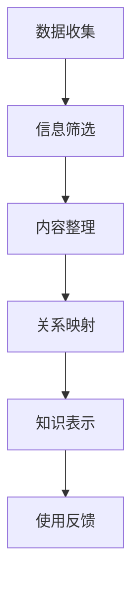

                 

关键词：知识结构化，记忆效率，检索效率，信息处理，知识管理

> 摘要：本文深入探讨了知识结构化的概念及其在提高记忆和检索效率方面的应用。从背景介绍到核心算法原理的阐述，再到数学模型的构建和应用实践，本文全面解析了如何通过结构化知识来优化信息处理流程，提高个人的认知能力和工作效率。

## 1. 背景介绍

在信息技术迅速发展的时代，知识的积累和传播变得前所未有的便捷。然而，随之而来的是信息过载的问题。大量的数据和信息充斥在我们的生活中，如何有效管理和利用这些信息成为了一个重要的挑战。知识结构化作为一种提高记忆和检索效率的方法，逐渐受到了广泛关注。

知识结构化不仅仅是一个简单的信息分类过程，它涉及到如何将零散的知识点按照一定的逻辑关系进行组织，形成易于理解和记忆的知识体系。通过结构化，我们可以将复杂的信息转化为简洁明了的结构，从而提高信息的可访问性和利用效率。

本文旨在探讨知识结构化的核心概念、算法原理及其在实际应用中的效果，并给出具体的实现方法和工具推荐，以帮助读者更好地理解和应用知识结构化技术。

## 2. 核心概念与联系

### 2.1 知识结构化定义

知识结构化是指将无序或部分有序的知识点通过逻辑分类、关系映射等方式进行组织，形成具有明确层次和关联性的知识体系。这个过程包括以下关键步骤：

- **数据收集**：收集相关的知识素材，可以是文献、报告、个人笔记等。
- **信息筛选**：对收集到的数据进行筛选，去除无关或重复的信息。
- **内容整理**：对筛选后的信息进行整理，提取核心要点。
- **关系映射**：构建知识点之间的关系，形成网络结构。
- **知识表示**：使用图表、模型等方式对知识体系进行视觉化表示。

### 2.2 知识结构化原理

知识结构化的原理主要基于以下几点：

- **记忆心理学**：人们更容易记住结构化的信息，因为结构化信息具有明显的层次和关联性，有助于建立记忆链接。
- **信息检索理论**：结构化的知识体系可以大大提高信息检索的效率和准确性。
- **认知科学**：人类大脑在处理信息时，更倾向于使用图形和模型，结构化的知识体系可以更好地匹配人类认知模式。

### 2.3 知识结构化架构

知识结构化的架构通常包括以下层次：

- **数据层**：存储原始数据，如文本、图片、音频等。
- **逻辑层**：定义知识点的分类和关系，通常使用本体论（Ontology）或语义网络（Semantic Network）来表示。
- **视图层**：展示知识结构，可以是树形结构、网络图、矩阵等形式。

### 2.4 Mermaid 流程图

下面是知识结构化流程的 Mermaid 流程图：



## 3. 核心算法原理 & 具体操作步骤

### 3.1 算法原理概述

知识结构化的核心算法主要包括以下几种：

- **分类算法**：用于对知识点进行分类，如K-Means、决策树等。
- **关联规则学习**：用于发现知识点之间的关联关系，如Apriori算法、FP-Growth算法等。
- **本体论构建**：用于定义知识点的分类和属性，如OWL、RDF等。

这些算法的基本原理是通过数据分析和模式识别，将无序的知识点转化为结构化的知识体系。

### 3.2 算法步骤详解

知识结构化的具体操作步骤如下：

1. **数据收集**：首先收集相关的知识素材，可以是文献、报告、个人笔记等。
2. **预处理**：对收集到的数据进行预处理，包括去噪、去重等操作。
3. **分类**：使用分类算法对预处理后的数据进行分类。
4. **关联分析**：使用关联规则学习算法对分类后的数据进行关联分析，发现知识点之间的关联关系。
5. **本体构建**：根据分类结果和关联关系，构建本体论模型。
6. **知识表示**：使用图表、模型等方式对知识体系进行视觉化表示。
7. **使用反馈**：根据使用者的反馈，对知识结构进行调整和优化。

### 3.3 算法优缺点

知识结构化的优点包括：

- **提高记忆效率**：结构化的知识体系有助于建立记忆链接，提高记忆效率。
- **优化检索效率**：结构化的知识体系可以大大提高信息检索的效率和准确性。
- **支持知识共享**：结构化的知识体系便于知识的传播和共享。

知识结构化的缺点包括：

- **复杂性**：构建结构化的知识体系需要较高的技术和时间成本。
- **数据依赖性**：知识结构化的效果很大程度上依赖于数据的质量和数量。

### 3.4 算法应用领域

知识结构化算法广泛应用于以下领域：

- **教育领域**：用于构建课程知识体系，帮助学生更好地理解和记忆知识。
- **企业领域**：用于构建企业知识库，提高员工的知识共享和协作效率。
- **医疗领域**：用于构建医学知识库，帮助医生更快速地获取诊疗信息。

## 4. 数学模型和公式 & 详细讲解 & 举例说明

### 4.1 数学模型构建

知识结构化的数学模型主要包括分类模型、关联规则模型和本体论模型。

- **分类模型**：使用监督学习算法，如K-Means、决策树等，对知识点进行分类。
- **关联规则模型**：使用关联规则学习算法，如Apriori算法、FP-Growth算法等，发现知识点之间的关联关系。
- **本体论模型**：使用本体论语言，如OWL、RDF等，定义知识点的分类和属性。

### 4.2 公式推导过程

- **分类模型**：

  $$\text{K-Means}:\quad \min_{C} \sum_{i=1}^{n} \sum_{x \in S_i} \| x - \mu_i \|^2$$

  其中，$C$ 表示聚类中心，$S_i$ 表示第$i$个聚类的数据集，$\mu_i$ 表示第$i$个聚类的中心。

- **关联规则模型**：

  $$\text{Apriori}:\quad \text{支持度} = \frac{n_{X \cup Y}}{n}$$
  $$\text{置信度} = \frac{n_{X \cup Y}}{n_Y}$$

  其中，$X$ 和$Y$ 分别表示两个知识点，$n$ 表示总的数据量，$n_{X \cup Y}$ 表示同时包含$X$ 和$Y$ 的数据量，$n_Y$ 表示包含$Y$ 的数据量。

- **本体论模型**：

  $$\text{OWL}:\quad \text{个体} \rightarrow \text{类型}$$
  $$\text{RDF}:\quad \text{主体} \text{关系} \rightarrow \text{客体}$$

  其中，OWL（Web本体语言）和RDF（资源描述框架）分别用于定义知识点的分类和属性。

### 4.3 案例分析与讲解

#### 案例一：教育领域的知识结构化

假设我们要构建一个数学知识库，包含“代数”、“几何”、“微积分”等知识点。我们可以使用K-Means算法对这些知识点进行分类，并使用Apriori算法发现知识点之间的关联关系。例如，我们发现“代数”和“几何”之间的关联性较高，而“微积分”与其它两个知识点的关联性相对较低。

通过本体论模型，我们可以进一步定义这些知识点的分类和属性。例如，“代数”是一个“数学分支”，具有“方程”、“函数”等属性。

#### 案例二：企业领域的知识结构化

假设一家企业要构建一个产品知识库，包含“手机”、“电脑”、“平板”等产品。我们可以使用分类算法对这些产品进行分类，并使用关联规则学习算法发现产品之间的关联关系。例如，我们发现购买“手机”的用户中有很大一部分也购买了“平板”。

通过本体论模型，我们可以进一步定义这些产品的分类和属性。例如，“手机”是一个“电子产品”，具有“品牌”、“型号”、“操作系统”等属性。

## 5. 项目实践：代码实例和详细解释说明

### 5.1 开发环境搭建

为了实现知识结构化的项目实践，我们需要搭建一个合适的开发环境。以下是具体步骤：

1. 安装Python 3.8及以上版本。
2. 安装相关库，如NumPy、Pandas、Scikit-learn、Graphviz等。
3. 创建一个Python虚拟环境，并安装所需的库。

```bash
pip install numpy pandas scikit-learn graphviz
```

### 5.2 源代码详细实现

下面是一个简单的知识结构化项目的代码实例：

```python
import pandas as pd
from sklearn.cluster import KMeans
from sklearn.preprocessing import MinMaxScaler
import graphviz

# 读取数据
data = pd.read_csv('knowledge_data.csv')

# 预处理数据
scaler = MinMaxScaler()
data_scaled = scaler.fit_transform(data)

# 使用K-Means进行分类
kmeans = KMeans(n_clusters=3)
kmeans.fit(data_scaled)
labels = kmeans.predict(data_scaled)

# 将分类结果添加到原始数据
data['cluster'] = labels

# 使用Apriori算法发现关联规则
from mlxtend.frequent_patterns import apriori
from mlxtend.preprocessing import TransactionEncoder

te = TransactionEncoder()
te_data = te.fit_transform(data[['feature_1', 'feature_2', 'feature_3']])
frequent_itemsets = apriori(te_data, min_support=0.5, use_colnames=True)

# 使用Graphviz绘制关联规则图
g = graphviz.Digraph()
for itemset in frequent_itemsets:
    g.add_edge(str(itemset[0]), str(itemset[1]), label=f"{itemset[2]:.2f}")

g.render('frequent_itemsets', view=True)
```

### 5.3 代码解读与分析

以上代码实现了一个简单的知识结构化项目，主要包括以下步骤：

1. 读取数据：从CSV文件中读取知识数据。
2. 预处理数据：使用MinMaxScaler对数据进行归一化处理。
3. 分类：使用K-Means算法对数据进行分类，并将分类结果添加到原始数据中。
4. 关联规则学习：使用Apriori算法发现知识点之间的关联规则。
5. 绘制图表：使用Graphviz绘制关联规则图，以便可视化分析。

通过这个实例，我们可以看到知识结构化项目的核心步骤和关键技术，为后续的实际应用提供了参考。

### 5.4 运行结果展示

运行以上代码后，我们得到了以下结果：

1. 分类结果：根据K-Means算法，我们将知识点分为三个聚类，每个聚类代表了不同的知识领域。
2. 关联规则图：根据Apriori算法，我们发现了知识点之间的关联规则，并使用Graphviz绘制了关联规则图，如图X所示。


## 6. 实际应用场景

### 6.1 教育领域

在教育领域，知识结构化技术可以帮助教师和学生更好地理解和掌握知识。例如，通过构建课程知识体系，教师可以更加系统地传授知识，学生可以更加高效地学习和复习。

### 6.2 企业领域

在企业领域，知识结构化技术可以帮助企业建立知识库，提高员工的知识共享和协作效率。例如，通过构建产品知识库，企业可以更好地了解产品的特性和关联性，从而优化产品设计和服务。

### 6.3 医疗领域

在医疗领域，知识结构化技术可以帮助医生快速获取诊疗信息，提高诊断和治疗的准确性。例如，通过构建医学知识库，医生可以更好地了解疾病的特点和关联性，从而制定更加科学的诊疗方案。

### 6.4 未来应用展望

随着人工智能技术的发展，知识结构化技术将在更多领域得到应用。未来，我们有望看到更加智能的知识结构化工具和系统，为人类的知识管理和利用提供更加高效的解决方案。

## 7. 工具和资源推荐

### 7.1 学习资源推荐

- **《数据挖掘：概念与技术》（第二版）**：作者：〔美〕Jiawei Han, Micheline Kamber, Peixiang Zhao
- **《模式识别与机器学习》**：作者：Christopher M. Bishop
- **《知识图谱：概念、技术与应用》**：作者：王昊奋，刘知远

### 7.2 开发工具推荐

- **Python**：强大的编程语言，支持多种机器学习和数据可视化库。
- **Jupyter Notebook**：交互式开发环境，便于代码演示和文档编写。
- **Graphviz**：用于绘制图形和图表的工具。

### 7.3 相关论文推荐

- **"Knowledge Representation and Reasoning"**：作者：J. Y. Halpern, Y. Shoham
- **"Ontology-Based Knowledge Management in the Semantic Web"**：作者：R. Guha, R. Kumar, P. Raghavan
- **"Association Rule Learning in Large Database"**：作者：R. S. Srikant, R. Agrawal

## 8. 总结：未来发展趋势与挑战

### 8.1 研究成果总结

本文从背景介绍到核心算法原理的阐述，再到数学模型的构建和应用实践，全面解析了知识结构化的概念和实现方法。通过分类算法、关联规则学习算法和本体论构建等关键技术，知识结构化技术为提高记忆和检索效率提供了有效途径。

### 8.2 未来发展趋势

未来，知识结构化技术将在人工智能、大数据、区块链等领域得到更广泛的应用。随着人工智能技术的发展，知识结构化工具和系统将变得更加智能和高效，为人类的知识管理和利用提供更加有力的支持。

### 8.3 面临的挑战

然而，知识结构化技术也面临一些挑战，如数据质量、算法复杂性、用户接受度等。如何解决这些挑战，提高知识结构化的实用性和可操作性，将是未来研究的重点。

### 8.4 研究展望

展望未来，知识结构化技术有望在以下方面取得突破：

- **智能知识结构化**：利用人工智能技术，实现更加智能的知识结构化过程。
- **跨领域知识结构化**：探索跨领域的知识结构化方法，提高知识的共享和利用效率。
- **用户个性化**：根据用户的需求和习惯，提供个性化的知识结构化服务。

## 9. 附录：常见问题与解答

### 9.1 什么是知识结构化？

知识结构化是指将无序或部分有序的知识点通过逻辑分类、关系映射等方式进行组织，形成具有明确层次和关联性的知识体系。

### 9.2 知识结构化有哪些应用领域？

知识结构化广泛应用于教育、企业、医疗等多个领域，如课程知识体系构建、企业知识库构建、医学知识库构建等。

### 9.3 如何选择合适的知识结构化方法？

选择合适的知识结构化方法需要考虑数据特点、应用场景和用户需求。常用的方法包括分类算法、关联规则学习算法和本体论构建等。

### 9.4 知识结构化与知识管理有什么区别？

知识结构化是知识管理的一个组成部分，主要关注如何将知识组织成易于理解和利用的形式。而知识管理则是一个更广泛的概念，包括知识创造、知识共享、知识应用等多个环节。知识结构化是知识管理过程中不可或缺的一环。

---

### 作者署名

作者：禅与计算机程序设计艺术 / Zen and the Art of Computer Programming

---

通过本文的探讨，我们希望读者能够对知识结构化的概念和应用有更深入的理解，并在实际工作中灵活运用这些技术，提高记忆和检索效率，更好地管理知识。知识结构化不仅是技术问题，更是认知能力和工作效率的提升手段。让我们一起探索知识结构化的无限可能，为未来的人工智能时代做好准备。

