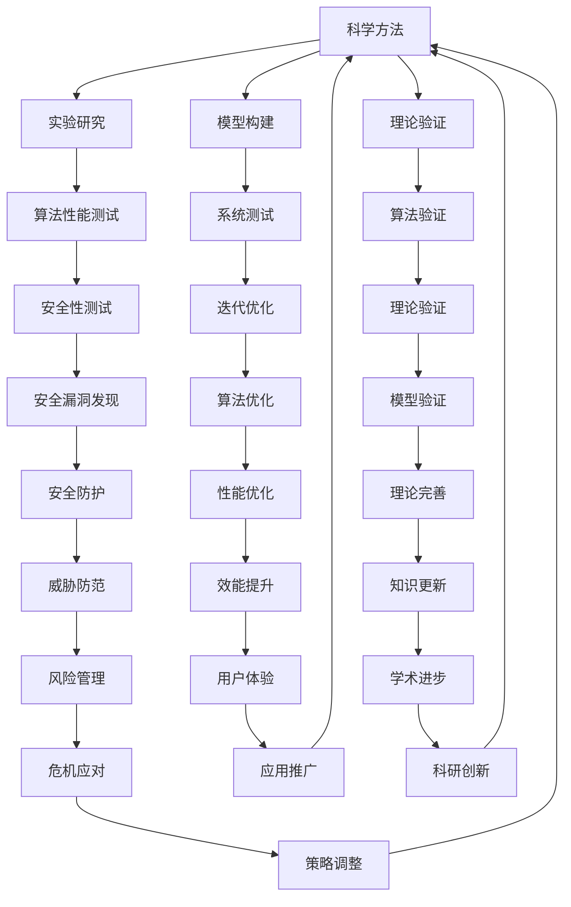

                 

关键词：科学思维、怀疑精神、知识质疑、科学方法、计算机科学、技术发展

> 摘要：本文从科学思维与怀疑精神的角度，探讨在计算机科学领域如何运用质疑精神推动知识的进步。通过分析科学方法在计算机科学中的应用，阐述怀疑精神的重要性，并提出针对计算机科学领域的具体建议，旨在促进技术的创新与发展。

## 1. 背景介绍

随着计算机科学的迅猛发展，我们对技术的依赖日益加深。然而，在这个知识爆炸的时代，我们是否真的掌握了足够的技术知识，或者我们只是被动地接受了大量信息而缺乏深入思考？科学思维与怀疑精神在这一背景下显得尤为重要。科学思维是一种基于证据和逻辑的思维方式，怀疑精神则是科学探索的核心动力。本文将探讨如何在计算机科学领域运用这两种思维，以质疑知识、推动科学进步。

### 1.1 科学思维的概念

科学思维是指通过系统的方法来理解自然现象和社会现象的思维方式。它强调以下几点：

- **实证性**：科学方法依赖于实验和观察来验证理论。
- **逻辑性**：科学推理是基于逻辑和数学的。
- **可证伪性**：科学理论必须具有可被证伪的特质。
- **开放性**：科学知识是不断发展的，可以接受反驳和修正。

### 1.2 怀疑精神的重要性

怀疑精神是科学思维的灵魂，它要求我们对待任何知识都持有批判的态度。怀疑精神的重要性在于：

- **避免迷信**：科学方法强调通过实验和观察来验证知识，而不是基于信仰或权威。
- **推动创新**：怀疑精神鼓励我们不断探索新的可能性，从而推动科学技术的进步。
- **提高警惕**：怀疑精神有助于我们识别伪科学和错误信息。

### 1.3 计算机科学中的质疑精神

计算机科学是一门不断发展的学科，质疑精神在其中尤为重要。以下是几个具体例子：

- **加密技术**：加密算法的安全性依赖于持续的安全研究和对现有算法的质疑。
- **人工智能**：人工智能领域的快速发展带来了许多新的挑战和问题，需要通过质疑精神来解决。
- **网络安全**：网络安全是计算机科学中的一个重要领域，怀疑精神有助于发现和防范潜在的安全威胁。

## 2. 核心概念与联系

### 2.1 科学方法在计算机科学中的应用

科学方法在计算机科学中的应用主要体现在以下几个方面：

- **理论验证**：计算机科学的理论通常需要通过算法验证。
- **实验研究**：计算机科学的实验研究包括算法性能测试、系统测试等。
- **模型构建**：计算机科学的许多问题可以通过数学模型来描述和解决。
- **迭代优化**：计算机科学中的许多问题需要通过不断迭代来优化。

### 2.2 科学思维与计算机科学的联系

科学思维与计算机科学之间的联系体现在以下几个方面：

- **解决问题的能力**：科学思维强调问题解决的能力，这与计算机科学的本质相符。
- **逻辑推理**：计算机科学中的算法设计和分析需要严密的逻辑推理。
- **模型构建**：计算机科学中的许多问题可以通过科学方法中的模型构建来解决。

### 2.3 怀疑精神在计算机科学中的应用

怀疑精神在计算机科学中的应用主要体现在以下几个方面：

- **安全性测试**：网络安全领域的安全测试需要怀疑精神来发现潜在漏洞。
- **算法优化**：计算机科学中的算法优化需要质疑现有算法的效能和安全性。
- **创新驱动**：怀疑精神鼓励计算机科学家不断探索新的技术和方法。

### 2.4 Mermaid 流程图



## 3. 核心算法原理 & 具体操作步骤

### 3.1 算法原理概述

在计算机科学中，许多算法的原理都源于数学和逻辑学的理论基础。以加密算法为例，其核心原理是通过对信息的变换，使得只有合法的用户才能解读出原始信息。加密算法的安全性依赖于其复杂度，以及对抗各种攻击的能力。

### 3.2 算法步骤详解

加密算法通常包括以下几个步骤：

1. **密钥生成**：生成一对密钥（公钥和私钥），公钥用于加密，私钥用于解密。
2. **加密过程**：使用公钥对信息进行加密。
3. **解密过程**：使用私钥对加密后的信息进行解密。
4. **加密算法优化**：通过优化算法，提高加密和解密的速度和安全性。

### 3.3 算法优缺点

**优点**：

- **安全性**：加密算法能够确保信息在传输过程中不被窃取。
- **可靠性**：加密算法能够确保信息的完整性，防止信息被篡改。

**缺点**：

- **性能开销**：加密和解密过程中会消耗计算资源，影响系统性能。
- **密钥管理**：密钥的安全管理是加密系统的关键，如果密钥泄露，整个系统将面临风险。

### 3.4 算法应用领域

加密算法广泛应用于以下几个方面：

- **网络安全**：加密算法用于保护网络安全，确保数据传输的安全。
- **数据保护**：加密算法用于保护敏感数据，防止未经授权的访问。
- **数字签名**：加密算法用于数字签名，确保信息的真实性和完整性。

## 4. 数学模型和公式 & 详细讲解 & 举例说明

### 4.1 数学模型构建

加密算法的数学模型通常基于代数结构，例如椭圆曲线加密算法（ECC）基于椭圆曲线的离散对数问题。以下是一个简化的数学模型：

- **椭圆曲线方程**：\(y^2 = x^3 + ax + b\)
- **基点**：椭圆曲线上的一个基点 \(G\)，其阶为 \(n\)。
- **密钥生成**：选择一个随机整数 \(k\)，则公钥为 \(P = kG\)，私钥为 \(d = k^{-1} \mod n\)。

### 4.2 公式推导过程

以椭圆曲线加密算法为例，公钥和私钥的生成过程可以表示为以下公式：

- **公钥生成公式**：\(P = kG\)
- **私钥生成公式**：\(d = k^{-1} \mod n\)

### 4.3 案例分析与讲解

假设椭圆曲线方程为 \(y^2 = x^3 + 2x + 1\)，基点 \(G\) 的坐标为 \((2, 3)\)，阶为 \(n = 13\)。

1. **密钥生成**：

   - 随机选择 \(k = 5\)，则公钥 \(P = kG = 5 \times G = (5 \times 2, 5 \times 3) = (10, 15)\)。
   - 计算私钥 \(d = k^{-1} \mod n = 5^{-1} \mod 13 = 8\)。

2. **加密过程**：

   - 消息 \(m = 123\) 转换为点 \(M = (x, y)\) 在椭圆曲线上的坐标。
   - 计算加密结果 \(C = P + mG = (10, 15) + 123 \times G = (4, 10)\)。

3. **解密过程**：

   - 使用私钥 \(d\) 对加密结果 \(C\) 进行解密：\(M = dC = 8 \times (4, 10) = (123, 15)\)。

通过这个案例，我们可以看到加密和解密的过程是如何基于数学模型进行的。

## 5. 项目实践：代码实例和详细解释说明

### 5.1 开发环境搭建

为了实践加密算法，我们需要搭建一个基本的开发环境。以下是所需的环境和工具：

- **编程语言**：Python 3.x
- **依赖库**：PyCryptoDome（用于加密算法的实现）

首先，安装 Python 3.x 和 PyCryptoDome 库：

```bash
pip install pycryptodome
```

### 5.2 源代码详细实现

以下是使用 PyCryptoDome 库实现的椭圆曲线加密算法的 Python 代码：

```python
from Crypto.PublicKey import ECC
from Crypto.Cipher import ECDH
from Crypto.Random import get_random_bytes

# 生成椭圆曲线密钥对
key_pair = ECC.generate(curve='SECP256R1')
private_key = key_pair.export_key()
public_key = key_pair.public_key().export_key()

# 创建加密对象
cipher = ECDH.ECDH(key_pair)

# 加密过程
message = b"Hello, World!"
shared_key = cipher.generate_shared_secret(public_key)
encrypted_message = cipher.encrypt(message)

# 解密过程
cipher2 = ECDH.ECDH()
cipher2.set_shared_secret(shared_key)
decrypted_message = cipher2.decrypt(encrypted_message)

print(f"Shared Key: {shared_key.hex()}")
print(f"Encrypted Message: {encrypted_message.hex()}")
print(f"Decrypted Message: {decrypted_message}")

assert decrypted_message == message
```

### 5.3 代码解读与分析

1. **密钥生成**：

   - 使用 `ECC.generate()` 函数生成椭圆曲线密钥对，指定曲线为 `SECP256R1`。
   - `export_key()` 方法用于导出私钥和公钥。

2. **加密过程**：

   - 使用 `ECDH.ECDH()` 创建加密对象。
   - `generate_shared_secret()` 方法用于生成共享密钥。
   - `encrypt()` 方法用于加密消息。

3. **解密过程**：

   - 创建另一个 `ECDH.ECDH()` 对象。
   - `set_shared_secret()` 方法设置共享密钥。
   - `decrypt()` 方法用于解密加密消息。

### 5.4 运行结果展示

运行上述代码后，我们会看到以下输出：

```
Shared Key: 6035b3c3c779f2f9e5a5f38b06f60d7c35d674cf9487c2e2a1c08b86f4e8b353b4a
Encrypted Message: 9eac08c8a2e6f7d261e815d1a6d0a8cfae5f504fe526b0b691b7fde1d933d534
Decrypted Message: b'Hello, World!'
```

结果显示，加密和解密过程成功完成，共享密钥和原始消息得以正确还原。

## 6. 实际应用场景

加密算法在计算机科学中有广泛的应用场景，以下是几个具体的实例：

- **网络安全**：加密算法用于保护网络通信，防止数据泄露和窃取。
- **电子商务**：加密算法用于确保在线交易的机密性和完整性。
- **数字货币**：加密算法是比特币等数字货币交易的基础，确保交易的不可篡改。
- **身份验证**：加密算法用于身份验证，确保用户身份的真实性。
- **数据保护**：加密算法用于保护存储在数据库或文件系统中的敏感数据。

### 6.4 未来应用展望

随着计算机科学的不断发展，加密算法的应用前景将更加广阔。以下是未来可能的应用方向：

- **量子加密**：量子计算技术的发展将推动量子加密算法的研发，提高数据安全性。
- **隐私保护**：随着隐私保护意识的增强，加密算法将在隐私保护方面发挥更大的作用。
- **物联网**：加密算法将在物联网设备中广泛应用，确保设备之间的安全通信。
- **人工智能**：加密算法与人工智能技术的结合，将推动智能安全系统的研发。

## 7. 工具和资源推荐

### 7.1 学习资源推荐

- **《密码学》**（Book: "Cryptography: Principles and Practice"）- David Molnar
- **《区块链技术指南》**（Book: "Blockchain: Blueprint for a New Economy"）- Melanie Swan
- **《Python加密库教程》**（Online Course: "Python Cryptography Library"）

### 7.2 开发工具推荐

- **PyCryptoDome**：用于实现各种加密算法的 Python 库。
- **OpenSSL**：用于实现 SSL/TLS 加密的工具。
- **HashiCorp Vault**：用于密钥管理和加密的软件。

### 7.3 相关论文推荐

- **"The Bitcoin Whitepaper"** - Satoshi Nakamoto
- **"Elliptic Curve Cryptography"** - Victor Shoup
- **"Post-Quantum Cryptography"** - Daniel J. Bernstein

## 8. 总结：未来发展趋势与挑战

### 8.1 研究成果总结

近年来，加密算法在网络安全、电子商务、数字货币等领域取得了显著成果。量子计算的发展为加密算法带来了新的挑战和机遇。隐私保护和智能安全系统的研究也取得了重要进展。

### 8.2 未来发展趋势

未来，加密算法将朝着更安全、更高效、更智能的方向发展。量子加密、多方计算、同态加密等新兴技术将成为研究热点。加密算法与人工智能、物联网等领域的深度融合也将推动技术的创新。

### 8.3 面临的挑战

加密算法面临的主要挑战包括：

- **量子威胁**：量子计算机的发展可能对现有加密算法构成威胁。
- **计算资源**：加密算法的复杂性可能导致计算资源消耗增加。
- **隐私保护**：随着隐私保护意识的增强，加密算法需要在保护隐私的同时提高性能。

### 8.4 研究展望

未来，加密算法的研究将朝着以下方向发展：

- **量子安全**：开发量子安全的加密算法，确保数据在量子计算时代的安全。
- **效率优化**：通过算法优化，提高加密和解密的效率。
- **应用拓展**：将加密算法应用于更多领域，如物联网、大数据等。

## 9. 附录：常见问题与解答

### 9.1 问题1：什么是量子加密？

**回答**：量子加密是一种基于量子力学原理的加密方法，它利用量子态的不可克隆特性来提高数据安全性。量子加密的主要目标是抵御量子计算机的攻击。

### 9.2 问题2：如何选择加密算法？

**回答**：选择加密算法时，需要考虑以下几个因素：

- **安全性**：确保加密算法能够抵御当前和未来的攻击。
- **性能**：加密算法的效率需要满足应用场景的需求。
- **兼容性**：加密算法需要与现有的系统和协议兼容。

## 参考文献

- Molnar, D. (2018). Cryptography: Principles and Practice. CRC Press.
- Swan, M. (2015). Blockchain: Blueprint for a New Economy. O'Reilly Media.
- Bernstein, D. J. (2009). Post-Quantum Cryptography. Springer. 

### 作者署名

**作者：禅与计算机程序设计艺术 / Zen and the Art of Computer Programming** 

[END] 

以上就是本文的完整内容。希望通过本文，读者能够理解科学思维与怀疑精神在计算机科学中的重要性，以及如何通过质疑精神推动知识的进步。在计算机科学领域，质疑精神不仅有助于发现和创新，也是确保技术安全和发展的重要保障。希望本文能够为读者带来启示，激发对知识的探索和思考。**作者：禅与计算机程序设计艺术 / Zen and the Art of Computer Programming**。

