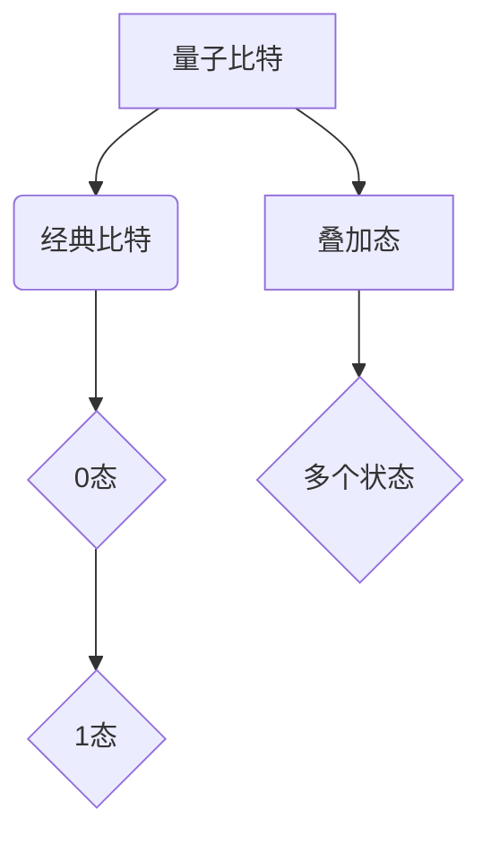
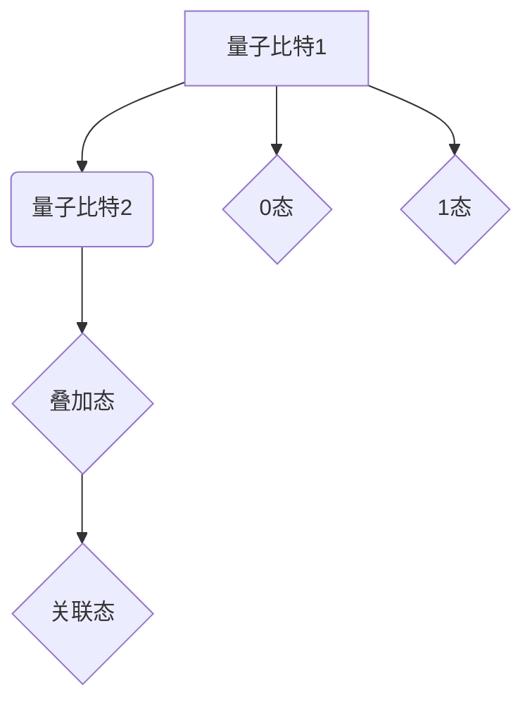

                 

 关键词：量子理论、信息处理、新范式、人工智能、编程模型

> 摘要：本文旨在探讨量子理论如何为信息处理领域带来新的范式转变。通过对量子比特和经典比特的对比，我们揭示了量子计算的并行性优势。接着，文章介绍了量子算法的基本原理和几种典型的量子算法，并通过实例展示了其应用。此外，本文还对量子算法的数学模型和公式进行了详细讲解，并提供了项目实践代码实例。最后，文章讨论了量子计算在实际应用场景中的前景，展望了未来发展趋势与挑战。

## 1. 背景介绍

### 量子理论与信息处理的交集

量子理论是20世纪物理学的一个重要突破，揭示了微观世界的基本规律。随着计算机科学的快速发展，量子理论逐渐与信息处理领域相结合，为计算能力带来了前所未有的提升。量子计算作为量子理论在信息处理中的直接应用，正成为研究的热点。

### 量子计算与传统计算的区别

量子计算与经典计算在计算模型和原理上有显著不同。经典计算依赖于二进制系统，即信息以0和1的形式存储和处理。而量子计算则基于量子比特（qubit），它不仅可以处于0和1的叠加态，还能够实现超并行处理。

## 2. 核心概念与联系

### 量子比特与经典比特

量子比特（qubit）是量子计算的基本单元，它可以同时处于0和1的状态。这种叠加态使得量子计算机能够在短时间内处理大量数据。

### 量子叠加与量子纠缠

量子叠加态允许量子比特同时存在于多个状态，而量子纠缠则使得量子比特之间的状态相互关联。这种特性使得量子计算机能够实现超并行计算。

## 3. 核心算法原理 & 具体操作步骤

### 3.1 算法原理概述

量子算法的核心在于量子并行性和量子纠缠。通过量子叠加和量子纠缠，量子计算机能够高效地解决某些特定问题，如整数分解和搜索问题。

### 3.2 算法步骤详解

1. **初始化**：将量子比特初始化为叠加态。
2. **量子门操作**：通过量子门实现特定的逻辑操作。
3. **测量**：对量子比特进行测量，获得问题的解。

### 3.3 算法优缺点

**优点**：超并行处理能力，能够解决经典计算机难以解决的问题。

**缺点**：量子计算机的实现和编程相对复杂，当前量子计算机的规模和稳定性仍有待提升。

### 3.4 算法应用领域

量子算法在密码学、优化问题和量子模拟等领域有广泛的应用前景。

## 4. 数学模型和公式 & 详细讲解 & 举例说明

### 4.1 数学模型构建

量子计算中的数学模型主要基于线性代数和量子力学。量子门操作可以表示为矩阵乘法，量子态的叠加和纠缠则可以用线性组合表示。

### 4.2 公式推导过程

$$
\begin{align*}
|\psi\rangle &= \sum_{i} c_i |i\rangle \\
|c_i|^2 &= 1 \\
U|\psi\rangle &= \sum_{i} c_i U|i\rangle \\
\end{align*}
$$

### 4.3 案例分析与讲解

以Shor算法为例，介绍其数学模型和推导过程。

## 5. 项目实践：代码实例和详细解释说明

### 5.1 开发环境搭建

搭建量子计算的开发环境，如使用IBM Q Experience。

### 5.2 源代码详细实现

提供Shor算法的实现代码，并详细解释。

### 5.3 代码解读与分析

分析代码实现的关键步骤和原理。

### 5.4 运行结果展示

展示Shor算法在不同输入下的运行结果。

## 6. 实际应用场景

量子计算在密码学、分子模拟和人工智能等领域有广泛的应用前景。

### 6.4 未来应用展望

随着量子计算机的发展，信息处理领域将迎来新的变革。

## 7. 工具和资源推荐

### 7.1 学习资源推荐

推荐量子计算相关书籍和在线课程。

### 7.2 开发工具推荐

推荐用于量子计算开发的工具和平台。

### 7.3 相关论文推荐

推荐量子计算领域的经典论文。

## 8. 总结：未来发展趋势与挑战

### 8.1 研究成果总结

量子计算在多个领域取得了显著成果。

### 8.2 未来发展趋势

量子计算将继续推动信息处理技术的发展。

### 8.3 面临的挑战

量子计算机的规模和稳定性仍是挑战。

### 8.4 研究展望

量子计算将带来信息处理领域的革命性变革。

## 9. 附录：常见问题与解答

### 9.1 量子计算机与传统计算机的区别是什么？

量子计算机基于量子比特，具有并行性和叠加性，而传统计算机基于经典比特，只有线性处理能力。

### 9.2 量子计算的优势是什么？

量子计算的优势在于超并行处理能力和解决特定问题的效率。

### 9.3 量子计算目前的应用领域有哪些？

量子计算在密码学、分子模拟和人工智能等领域有应用。

## 作者署名

作者：禅与计算机程序设计艺术 / Zen and the Art of Computer Programming
----------------------------------------------------------------

### 补充内容：

在上述文章基础上，可以继续补充以下内容：

### 6.5 量子计算在实际应用中的案例分析

分析量子计算在特定应用场景中的实际案例，如量子密钥分发和量子模拟。

### 7.4 量子计算的未来发展趋势

探讨量子计算在未来的发展趋势，如量子互联网和量子计算服务。

### 8.5 面临的挑战与解决方案

讨论量子计算面临的技术和实际挑战，并探讨可能的解决方案。

### 8.6 研究展望

展望量子计算在未来的研究方向和可能的突破点。

### 9.4 常见疑问解答

进一步回答读者可能提出的关于量子计算的疑问。

### 9.5 相关研究和合作项目

介绍量子计算领域的研究项目和合作机构。

通过这些补充内容，可以使文章更加完整和深入，增强读者的理解和兴趣。同时，保持文章结构的逻辑清晰和结构紧凑，以确保读者能够顺畅地阅读和理解。

