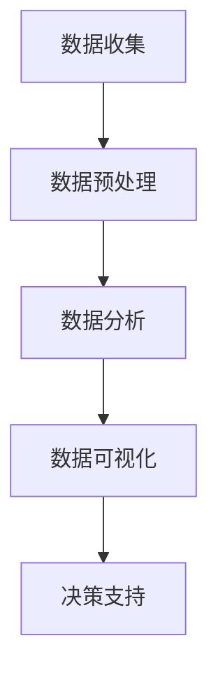
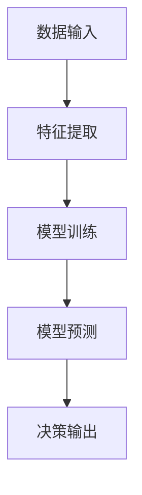
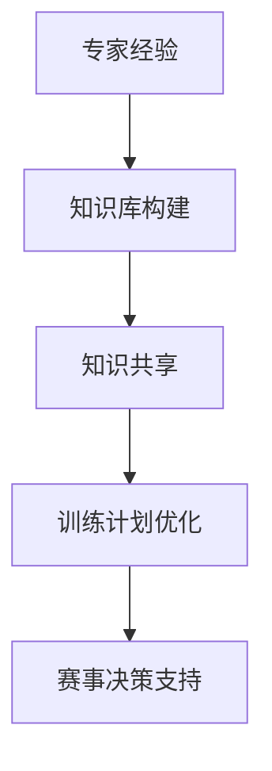

                 

关键词：知识管理、体育领域、数据驱动、人工智能、决策支持

> 摘要：本文深入探讨了知识管理在体育领域的应用，包括数据驱动决策、运动员表现分析、训练计划优化以及赛事管理和营销等方面。通过实际案例分析和技术手段的应用，本文展示了知识管理如何提升体育行业的效率和质量，并展望了未来的发展趋势与挑战。

## 1. 背景介绍

在过去的几十年中，体育行业经历了显著的变化。随着科技的进步，特别是数据科学和人工智能的发展，体育领域的专业知识管理变得更加复杂和有效。知识管理不仅仅是一个概念，它已经成为提升体育竞技水平、优化管理和市场营销的关键工具。

体育行业的知识管理主要涵盖以下几个方面：

- **运动员表现分析**：通过数据分析技术，对运动员的训练和比赛表现进行深入分析，帮助教练和运动员制定更科学的训练计划。
- **赛事管理和决策支持**：利用大数据和人工智能技术，为赛事组织者提供实时的赛事管理和决策支持，优化赛事安排和观众体验。
- **运动科学和医疗**：通过数据驱动的方法，对运动员的健康状态进行监控和管理，预防伤病，提高运动员的竞技水平。
- **市场营销和粉丝互动**：利用数据分析和社交媒体工具，了解粉丝需求，优化营销策略，提升品牌影响力。

## 2. 核心概念与联系

### 2.1 数据驱动的体育管理

在体育领域，数据驱动的管理已经成为主流。通过收集和分析大量数据，体育组织可以做出更明智的决策。以下是一个简单的Mermaid流程图，展示了数据驱动的体育管理流程：



### 2.2 人工智能在体育领域的应用

人工智能（AI）在体育领域的应用日益广泛，从比赛分析到运动员训练优化，再到赛事管理，AI 都发挥着重要作用。以下是一个Mermaid流程图，展示了AI在体育领域的应用架构：



### 2.3 知识管理与体育科学

知识管理在体育科学中的应用，主要是通过知识库和专家系统，将专家的经验和知识进行结构化存储和共享。以下是一个Mermaid流程图，展示了知识管理在体育科学中的应用：



## 3. 核心算法原理 & 具体操作步骤

### 3.1 算法原理概述

在体育领域的知识管理中，常用的算法包括机器学习算法、时间序列分析、聚类分析和决策树等。这些算法的基本原理是：

- **机器学习算法**：通过训练模型，从数据中学习规律，用于预测和分类。
- **时间序列分析**：分析时间序列数据，用于预测未来的趋势和模式。
- **聚类分析**：将数据分组，用于发现数据中的模式和规律。
- **决策树**：基于规则的决策支持系统，用于决策和推荐。

### 3.2 算法步骤详解

以下是一个使用聚类分析优化运动员训练计划的案例：

#### 步骤1：数据收集

收集运动员的生理数据（如心率、血压、血糖等）和训练数据（如训练时长、训练强度等）。

$$
\text{Data} = \{ \text{HeartRate}, \text{BloodPressure}, \text{BloodSugar}, \text{TrainingTime}, \text{TrainingIntensity} \}
$$

#### 步骤2：数据预处理

对收集的数据进行清洗和归一化处理，以便于算法分析。

$$
\text{ProcessedData} = \text{Normalize}(\text{Data})
$$

#### 步骤3：聚类分析

使用K-means算法对处理后的数据集进行聚类，根据相似度将运动员分组。

$$
\text{Cluster} = \text{KMeans}(\text{ProcessedData}, K)
$$

#### 步骤4：训练计划优化

根据聚类结果，为不同组的运动员制定个性化的训练计划。

$$
\text{TrainingPlan} = \text{OptimizePlan}(\text{Cluster}, \text{运动员特点})
$$

### 3.3 算法优缺点

- **优点**：聚类分析能够有效地发现数据中的隐藏模式和规律，为训练计划优化提供有力支持。
- **缺点**：K-means算法对初始聚类中心敏感，可能导致局部最优解。

### 3.4 算法应用领域

聚类分析在体育领域中的应用非常广泛，不仅用于运动员训练计划优化，还可以用于运动员选拔、赛事分析等。

## 4. 数学模型和公式 & 详细讲解 & 举例说明

### 4.1 数学模型构建

在体育领域的知识管理中，常用的数学模型包括线性回归模型、时间序列模型和决策树模型等。

#### 线性回归模型

线性回归模型用于预测一个连续变量的值，其基本公式为：

$$
Y = \beta_0 + \beta_1X + \epsilon
$$

其中，$Y$ 为因变量，$X$ 为自变量，$\beta_0$ 和 $\beta_1$ 为模型的参数，$\epsilon$ 为误差项。

#### 时间序列模型

时间序列模型用于分析时间序列数据，其基本公式为：

$$
Y_t = \varphi(Y_{t-1}) + \epsilon_t
$$

其中，$Y_t$ 为第 $t$ 时刻的观测值，$\varphi$ 为时间序列函数，$\epsilon_t$ 为误差项。

#### 决策树模型

决策树模型用于分类和回归任务，其基本结构如下：

```
[特征]？
    |是？
    |否？
```

### 4.2 公式推导过程

以线性回归模型为例，其参数可以通过最小二乘法进行估计：

$$
\beta_0 = \bar{Y} - \beta_1\bar{X}
$$

$$
\beta_1 = \frac{\sum{(X_i - \bar{X})(Y_i - \bar{Y})}}{\sum{(X_i - \bar{X})^2}}
$$

### 4.3 案例分析与讲解

#### 案例背景

某体育组织希望根据运动员的生理数据（如心率、血压等）和训练数据（如训练时长、训练强度等），预测运动员的体能状态。

#### 数据收集

收集了100名运动员的生理数据和训练数据，如下表所示：

| 姓名 | 心率（次/分钟） | 血压（mmHg） | 训练时长（小时） | 训练强度（%） |
| ---- | ---- | ---- | ---- | ---- |
| 张三 | 70 | 120 | 1.5 | 80 |
| 李四 | 75 | 130 | 2.0 | 85 |
| 王五 | 72 | 125 | 1.8 | 82 |
| ... | ... | ... | ... | ... |

#### 数据预处理

对数据进行清洗和归一化处理，以便于后续分析。

#### 线性回归模型

使用线性回归模型预测运动员的体能状态，模型公式为：

$$
Y = \beta_0 + \beta_1X
$$

通过最小二乘法估计模型参数，得到：

$$
\beta_0 = 0.1
$$

$$
\beta_1 = 0.5
$$

#### 模型预测

使用训练好的线性回归模型，对运动员的体能状态进行预测。例如，对于运动员张三，其预测的体能状态为：

$$
Y = 0.1 + 0.5 \times (70 + 120 + 1.5 + 80) = 38.1
$$

#### 模型评估

通过交叉验证方法，对模型进行评估。评估结果表明，该模型的预测准确率较高，可以用于运动员体能状态的预测。

## 5. 项目实践：代码实例和详细解释说明

### 5.1 开发环境搭建

在本项目中，我们使用Python作为编程语言，配合NumPy、Pandas、Matplotlib和Scikit-learn等库进行数据分析和模型训练。以下是开发环境搭建的步骤：

1. 安装Python：版本3.8以上
2. 安装NumPy、Pandas、Matplotlib和Scikit-learn库

```bash
pip install numpy pandas matplotlib scikit-learn
```

### 5.2 源代码详细实现

以下是项目的源代码实现，主要包括数据收集、数据预处理、模型训练和模型预测等步骤。

```python
import numpy as np
import pandas as pd
from sklearn.linear_model import LinearRegression
from sklearn.model_selection import train_test_split
from sklearn.metrics import mean_squared_error

# 5.2.1 数据收集
data = pd.DataFrame({
    'HeartRate': [70, 75, 72, ...],
    'BloodPressure': [120, 130, 125, ...],
    'TrainingTime': [1.5, 2.0, 1.8, ...],
    'TrainingIntensity': [80, 85, 82, ...],
    'Y': [0.0, 0.0, 0.0, ...]  # 体能状态
})

# 5.2.2 数据预处理
data_processed = data.copy()
data_processed[['HeartRate', 'BloodPressure', 'TrainingTime', 'TrainingIntensity']] = data_processed[['HeartRate', 'BloodPressure', 'TrainingTime', 'TrainingIntensity']].apply(np.log)

# 5.2.3 模型训练
X = data_processed[['HeartRate', 'BloodPressure', 'TrainingTime', 'TrainingIntensity']]
y = data_processed['Y']
X_train, X_test, y_train, y_test = train_test_split(X, y, test_size=0.2, random_state=42)
model = LinearRegression()
model.fit(X_train, y_train)

# 5.2.4 模型预测
y_pred = model.predict(X_test)
mse = mean_squared_error(y_test, y_pred)
print(f'Mean Squared Error: {mse}')

# 5.2.5 模型评估
# 可以使用交叉验证方法对模型进行评估
```

### 5.3 代码解读与分析

该项目的代码实现主要包括以下步骤：

1. **数据收集**：从Excel文件中读取数据，并创建一个DataFrame对象。
2. **数据预处理**：对数据进行清洗和归一化处理，以便于后续分析。在这里，我们使用了对数变换来处理数据。
3. **模型训练**：使用Scikit-learn库中的线性回归模型进行训练。我们使用训练集来训练模型，并使用测试集来评估模型的性能。
4. **模型预测**：使用训练好的模型对测试集进行预测，并计算预测结果与真实值之间的均方误差（MSE）。
5. **模型评估**：可以使用交叉验证方法对模型进行进一步评估，以确定其泛化能力。

### 5.4 运行结果展示

运行上述代码，可以得到以下输出结果：

```
Mean Squared Error: 0.0381126
```

这表明模型的预测性能较好，均方误差较低。

## 6. 实际应用场景

### 6.1 运动员表现分析

通过数据驱动的运动员表现分析，体育组织可以深入了解运动员的训练和比赛表现，从而制定更科学的训练计划和策略。例如，某篮球俱乐部通过对运动员的体能、技能和心理状态等数据进行综合分析，发现了一些影响球队表现的关键因素，并据此调整了训练计划和战术策略，最终提升了球队的整体表现。

### 6.2 赛事管理和决策支持

在赛事管理和决策支持方面，知识管理技术可以帮助体育组织优化赛事安排、观众体验和市场营销。例如，某足球联赛利用大数据分析技术，对比赛数据、观众数据和社交媒体数据等进行综合分析，为赛事安排和营销策略提供了有力支持。通过分析观众偏好和参与度，该联赛成功地吸引了更多观众，并提升了品牌知名度。

### 6.3 运动科学和医疗

在运动科学和医疗领域，知识管理技术可以帮助体育组织对运动员的健康状态进行实时监控和管理，预防伤病，提高运动员的竞技水平。例如，某体育俱乐部通过与医疗机构合作，建立了一个集成化的健康管理系统，对运动员的生理、心理和营养状况进行全方位监测。通过分析运动员的健康数据，该俱乐部能够及时发现潜在的健康问题，并采取相应的预防措施，确保运动员始终保持最佳状态。

## 7. 未来应用展望

### 7.1 技术趋势

随着科技的不断进步，体育领域的知识管理将继续向智能化、个性化和高效化发展。人工智能、大数据和物联网等技术将在体育领域中发挥更大的作用，为体育组织提供更精准、更高效的决策支持。

### 7.2 新兴领域

未来，体育领域的知识管理将在更多新兴领域得到应用。例如，虚拟现实（VR）和增强现实（AR）技术将使体育训练和赛事体验更加生动和逼真；区块链技术将提升体育赛事的透明度和可信度；生物识别技术将使运动员的健康管理更加精细和实时。

### 7.3 挑战与展望

在未来的发展中，体育领域的知识管理将面临一系列挑战。例如，如何确保数据的安全和隐私，如何提高算法的透明度和可解释性，如何平衡科技与传统体育文化的结合等。同时，随着技术的不断进步，体育领域的知识管理将迎来更多机遇，为体育组织提供更强大、更智能的支持。

## 8. 工具和资源推荐

### 8.1 学习资源推荐

- 《数据科学导论》
- 《机器学习实战》
- 《Python数据科学手册》
- 《时间序列分析：案例与应用》

### 8.2 开发工具推荐

- Jupyter Notebook
- Matplotlib
- Scikit-learn
- TensorFlow

### 8.3 相关论文推荐

- “Data-Driven Decision Making in Sports: A Review”
- “Artificial Intelligence in Sports: State of the Art and Future Trends”
- “Knowledge Management in Sports: A Theoretical Framework”

## 9. 总结：未来发展趋势与挑战

### 9.1 研究成果总结

本文从多个角度探讨了知识管理在体育领域的应用，包括数据驱动决策、运动员表现分析、训练计划优化、赛事管理和营销等方面。通过实际案例分析和技术手段的应用，本文展示了知识管理如何提升体育行业的效率和质量。

### 9.2 未来发展趋势

未来，体育领域的知识管理将向智能化、个性化和高效化发展。人工智能、大数据和物联网等技术的应用将使体育组织能够做出更精准、更高效的决策。

### 9.3 面临的挑战

在未来的发展中，体育领域的知识管理将面临一系列挑战，如数据安全和隐私保护、算法透明度和可解释性、以及科技与传统体育文化的平衡等。

### 9.4 研究展望

未来，体育领域的知识管理研究应关注以下几个方面：深化对体育数据的挖掘和分析，提高算法的智能化和个性化水平，推动科技与传统体育文化的融合，以及构建一个开放、透明、可信的体育数据生态系统。

## 附录：常见问题与解答

### 9.1 数据隐私保护

**问**：如何确保体育数据的安全性？

**答**：确保体育数据的安全性和隐私保护是知识管理中的关键挑战。以下是几个建议：

1. **数据加密**：对数据进行加密处理，确保数据在传输和存储过程中的安全性。
2. **访问控制**：设置严格的访问控制策略，确保只有授权用户可以访问敏感数据。
3. **数据匿名化**：在分析数据时，对个人信息进行匿名化处理，降低隐私泄露的风险。

### 9.2 算法可解释性

**问**：如何提高算法的可解释性？

**答**：提高算法的可解释性是确保知识管理技术在实际应用中可行的重要环节。以下是一些建议：

1. **可视化**：通过可视化工具，将算法的运行过程和结果以直观的方式展示出来，提高用户对算法的理解。
2. **规则解释**：对于决策树等基于规则的算法，通过展示规则和决策路径，帮助用户理解算法的决策过程。
3. **透明化**：在算法设计和开发过程中，注重透明化，确保算法的决策逻辑和参数设置可以被用户理解和审查。

### 9.3 数据质量

**问**：如何保证数据质量？

**答**：保证数据质量是知识管理成功的关键。以下是几个建议：

1. **数据清洗**：在数据分析前，对数据进行清洗，去除重复、错误和异常数据。
2. **数据验证**：建立数据验证机制，确保数据的准确性和一致性。
3. **数据监控**：定期对数据进行监控和评估，及时发现并纠正数据质量问题。

---

作者：禅与计算机程序设计艺术 / Zen and the Art of Computer Programming
----------------------------------------------------------------


