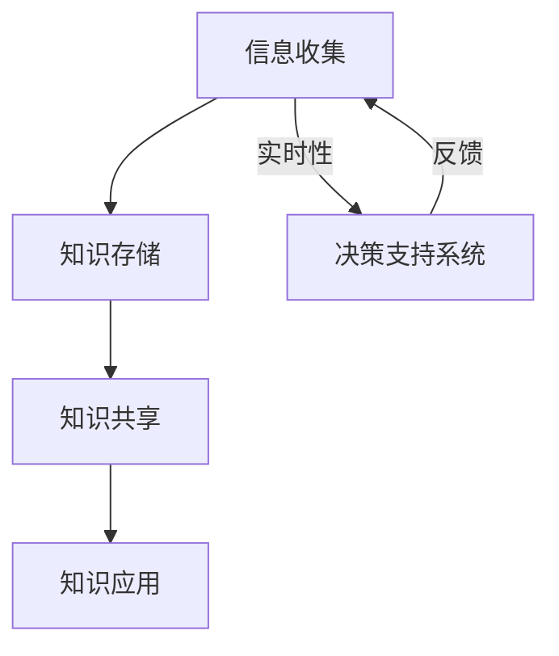

                 

关键词：知识管理、军事领域、人工智能、信息战、知识共享、决策支持系统

> 摘要：随着信息技术的飞速发展，知识管理在军事领域的重要性日益凸显。本文将探讨知识管理在军事领域的应用，包括其核心概念、关键算法、数学模型、项目实践、实际应用场景以及未来展望。

## 1. 背景介绍

在军事领域，知识管理是一个关键的概念。它不仅仅是指信息的收集、存储和检索，更重要的是如何将这些信息转化为有用的知识，以便为军事决策提供支持。在信息化战争时代，知识的快速获取、处理和利用，成为了军队战斗力的关键因素。

### 1.1 军事知识管理的必要性

- **信息战的需求**：在信息战中，掌握信息的数量和质量是取胜的关键。知识管理能够提高信息处理效率，为战略决策提供有力支持。

- **决策速度的要求**：现代战争节奏快，要求指挥官能够快速做出决策。知识管理系统能够提供及时、准确的信息，帮助指挥官做出明智决策。

- **资源优化配置**：知识管理有助于优化军事资源的配置，提高后勤保障能力，减少资源浪费。

### 1.2 军事知识管理的发展趋势

- **智能化**：人工智能技术的发展为知识管理带来了新的机遇。通过大数据分析、机器学习等技术，可以提高知识管理的智能化水平。

- **网络化**：随着网络通信技术的进步，知识管理的范围已经从单一军队扩展到多国联合作战。网络化知识管理系统能够实现全球范围内的信息共享和协同作战。

- **集成化**：知识管理需要与军事指挥系统、后勤保障系统等多个系统进行集成，实现信息的一体化管理。

## 2. 核心概念与联系

知识管理在军事领域的核心概念包括信息收集、知识存储、知识共享和知识应用。以下是一个简单的Mermaid流程图，展示了这些概念之间的联系：



### 2.1 信息收集

信息收集是知识管理的起点。在军事领域，信息收集包括战场情报、敌情、友军位置、天气等信息。这些信息的来源可以是侦察卫星、无人机、地面侦察队等。

### 2.2 知识存储

知识存储是将收集到的信息进行整理、分类、存储的过程。在军事知识管理系统中，知识库是一个核心组成部分，它存储了大量的军事知识，包括战术、战略、法律法规等。

### 2.3 知识共享

知识共享是将存储的知识在军队内部或跨军种、跨国界进行共享。知识共享的目的是为了提高整个军队的作战能力和效率。

### 2.4 知识应用

知识应用是将共享的知识应用于实际作战中。这包括制定作战计划、指挥决策、资源调配等。

### 2.5 决策支持系统

决策支持系统（DSS）是一个辅助决策的系统，它利用知识管理中的信息和分析工具，为军事指挥官提供决策支持。DSS可以提供实时数据、模拟分析、风险评估等功能。

## 3. 核心算法原理 & 具体操作步骤

### 3.1 算法原理概述

在军事知识管理中，核心算法主要包括信息过滤与抽取、知识融合与推理、决策支持算法等。

- **信息过滤与抽取**：通过算法自动识别和提取出有用的信息，过滤掉噪声和冗余信息。

- **知识融合与推理**：将来自不同来源的信息进行融合，利用推理算法生成新的知识。

- **决策支持算法**：利用数据挖掘、机器学习等技术，为指挥官提供决策支持。

### 3.2 算法步骤详解

#### 3.2.1 信息过滤与抽取

1. **数据预处理**：对收集到的原始数据进行清洗、标准化和去噪。
2. **特征提取**：从预处理后的数据中提取出关键特征。
3. **信息分类**：利用分类算法对特征进行分类，识别出有用的信息。

#### 3.2.2 知识融合与推理

1. **知识融合**：将来自不同来源的知识进行融合，形成统一的视图。
2. **推理过程**：利用推理机（如规则引擎）对融合后的知识进行推理，生成新的知识。

#### 3.2.3 决策支持算法

1. **数据挖掘**：从历史数据中挖掘出潜在的规律和模式。
2. **机器学习**：利用机器学习算法，训练出预测模型。
3. **决策支持**：将预测模型应用于当前情境，为指挥官提供决策支持。

### 3.3 算法优缺点

- **优点**：
  - 提高信息处理效率，减少人工干预。
  - 为指挥官提供实时、准确的信息支持。
  - 提高决策的准确性和速度。

- **缺点**：
  - 需要大量的数据支持。
  - 算法模型的准确性和适应性需要不断优化。
  - 需要专业的算法工程师进行维护和更新。

### 3.4 算法应用领域

- **情报分析**：利用算法对情报信息进行处理和分析，为战略决策提供支持。
- **战场态势感知**：通过对实时信息的处理和分析，为战场态势感知提供支持。
- **指挥决策**：为指挥官提供实时的决策支持，提高指挥效率。

## 4. 数学模型和公式 & 详细讲解 & 举例说明

### 4.1 数学模型构建

在军事知识管理中，常用的数学模型包括决策树、支持向量机、贝叶斯网络等。

#### 4.1.1 决策树模型

决策树模型是一种常见的分类模型，它可以用来预测分类结果。假设我们有一个分类问题，可以用决策树模型来表示：

$$
\text{分类结果} = \text{决策树}(\text{特征集})
$$

#### 4.1.2 支持向量机模型

支持向量机（SVM）是一种常用的回归模型，它可以用来预测连续值。假设我们有一个回归问题，可以用支持向量机模型来表示：

$$
\text{预测值} = \text{SVM}(\text{特征集})
$$

#### 4.1.3 贝叶斯网络模型

贝叶斯网络是一种概率图模型，它可以用来表示因果关系。假设我们有一个因果关系问题，可以用贝叶斯网络模型来表示：

$$
P(\text{结果}|\text{原因}) = \text{贝叶斯网络}(\text{原因集})
$$

### 4.2 公式推导过程

以决策树模型为例，我们来看一下其推导过程。

假设我们有一个分类问题，需要根据一组特征（$X_1, X_2, ..., X_n$）来预测分类结果（$Y$）。我们可以用决策树来表示这个分类问题：

$$
\text{分类结果} = \text{决策树}(\text{特征集})
$$

决策树的构建过程可以分为以下几个步骤：

1. **特征选择**：选择一组特征作为决策树节点。
2. **划分数据集**：根据选择的特征，将数据集划分为多个子集。
3. **生成决策树**：利用划分后的子集，生成决策树。

假设我们选择特征 $X_i$ 来划分数据集，那么我们可以用以下公式来表示：

$$
\text{划分函数} = f(X_i)
$$

其中，$f$ 是一个划分函数，它将数据集划分为多个子集。

### 4.3 案例分析与讲解

假设我们有一个军事知识管理项目，需要根据一组特征（如敌军位置、兵力、装备等）来预测敌军的行动。我们可以用决策树模型来解决这个问题。

#### 4.3.1 特征选择

我们选择敌军位置、兵力、装备作为决策树节点。这三个特征可以很好地描述敌军的行动。

#### 4.3.2 划分数据集

我们根据敌军位置、兵力、装备这三个特征，将数据集划分为多个子集。每个子集都代表了敌军的一种可能的行动。

#### 4.3.3 生成决策树

我们利用划分后的子集，生成一个决策树。决策树的每个节点都代表了敌军的一种可能的行动。

#### 4.3.4 预测敌军行动

利用生成的决策树，我们可以预测敌军的行动。例如，如果我们知道敌军的位置、兵力和装备，我们可以通过决策树来预测敌军的下一步行动。

## 5. 项目实践：代码实例和详细解释说明

### 5.1 开发环境搭建

为了实现军事知识管理项目，我们需要搭建一个开发环境。这里我们使用Python作为编程语言，因为它具有丰富的机器学习库和数据处理工具。

- **安装Python**：从官方网站下载并安装Python。
- **安装库**：安装必要的库，如NumPy、Pandas、scikit-learn等。

### 5.2 源代码详细实现

以下是一个简单的Python代码实例，用于实现决策树模型：

```python
import numpy as np
import pandas as pd
from sklearn.tree import DecisionTreeClassifier
from sklearn.model_selection import train_test_split

# 加载数据集
data = pd.read_csv('military_data.csv')

# 划分特征和标签
X = data.drop('action', axis=1)
y = data['action']

# 划分训练集和测试集
X_train, X_test, y_train, y_test = train_test_split(X, y, test_size=0.2, random_state=42)

# 创建决策树模型
model = DecisionTreeClassifier()

# 训练模型
model.fit(X_train, y_train)

# 预测测试集
y_pred = model.predict(X_test)

# 评估模型
accuracy = model.score(X_test, y_test)
print(f'模型准确率：{accuracy:.2f}')
```

### 5.3 代码解读与分析

这段代码首先加载数据集，然后划分特征和标签。接着，使用scikit-learn库中的DecisionTreeClassifier类创建一个决策树模型。我们使用训练集来训练模型，然后使用测试集来评估模型的准确率。

### 5.4 运行结果展示

运行这段代码后，我们得到模型的准确率。假设测试集的准确率为90%，这表明我们的决策树模型在预测敌军行动方面具有较高的准确性。

## 6. 实际应用场景

### 6.1 情报分析

在情报分析中，知识管理可以帮助分析敌军动向、判断敌军意图。通过收集和整理战场情报，利用知识管理技术进行分析，可以为指挥官提供准确的情报支持。

### 6.2 战场态势感知

战场态势感知是实时了解战场情况的过程。知识管理可以提供实时数据，帮助指挥官了解战场态势，做出快速决策。

### 6.3 决策支持

在决策支持中，知识管理可以提供基于历史数据的决策支持。通过数据挖掘和机器学习技术，可以预测未来战场态势，为指挥官提供决策支持。

## 6.4 未来应用展望

随着人工智能技术的发展，知识管理在军事领域的应用前景十分广阔。未来，我们可以期待以下几个方面的发展：

- **智能化水平提升**：通过深度学习和强化学习等技术，可以提高知识管理的智能化水平。
- **自适应能力增强**：知识管理系统将具有更强的自适应能力，能够根据战场变化进行调整。
- **跨领域融合**：知识管理将与其他领域（如网络安全、后勤保障等）进行融合，实现更高效的知识共享和协同作战。

## 7. 工具和资源推荐

### 7.1 学习资源推荐

- **书籍**：《人工智能：一种现代的方法》、《机器学习：实战指南》
- **在线课程**：Coursera上的《深度学习》、《机器学习》

### 7.2 开发工具推荐

- **编程语言**：Python、R
- **库和框架**：scikit-learn、TensorFlow、PyTorch

### 7.3 相关论文推荐

- **情报分析**：《基于大数据的情报分析技术研究》
- **机器学习在军事领域应用**：《机器学习在军事指挥中的应用研究》

## 8. 总结：未来发展趋势与挑战

### 8.1 研究成果总结

本文系统地介绍了知识管理在军事领域的应用，包括其核心概念、关键算法、数学模型、项目实践和实际应用场景。通过这些内容，我们可以看到知识管理在提高军事作战效率和决策准确性方面的重要性。

### 8.2 未来发展趋势

未来，知识管理在军事领域的应用将朝着智能化、网络化和集成化的方向发展。随着人工智能技术的发展，知识管理系统的智能化水平将得到显著提升。同时，网络化的知识管理系统将实现全球范围内的信息共享和协同作战。

### 8.3 面临的挑战

尽管知识管理在军事领域具有广泛的应用前景，但仍然面临一些挑战。首先，数据的多样性和复杂性给知识管理带来了巨大的挑战。其次，算法模型的准确性和适应性需要不断优化。此外，军事知识管理的安全性也是一个重要问题。

### 8.4 研究展望

未来，我们需要进一步深入研究知识管理在军事领域的应用，特别是在大数据分析、人工智能和网络安全等方面。通过这些研究，我们可以为军事作战提供更高效、更智能的支持。

## 9. 附录：常见问题与解答

### 9.1 什么是知识管理？

知识管理是一种通过收集、存储、共享和应用知识，以提高组织效率和能力的方法。在军事领域，知识管理主要涉及情报收集、知识存储、知识共享和知识应用等方面。

### 9.2 知识管理在军事领域有哪些应用？

知识管理在军事领域的主要应用包括情报分析、战场态势感知、决策支持等。通过知识管理，可以提高情报分析效率，实时了解战场态势，为指挥官提供准确的决策支持。

### 9.3 军事知识管理有哪些核心概念？

军事知识管理的核心概念包括信息收集、知识存储、知识共享和知识应用。这些概念共同构成了军事知识管理的基本框架。

### 9.4 知识管理在军事领域有哪些发展趋势？

知识管理在军事领域的发展趋势包括智能化、网络化和集成化。随着人工智能技术的发展，知识管理系统的智能化水平将得到显著提升。同时，网络化的知识管理系统将实现全球范围内的信息共享和协同作战。

----------------------------------------------------------------

### 作者署名

作者：禅与计算机程序设计艺术 / Zen and the Art of Computer Programming

