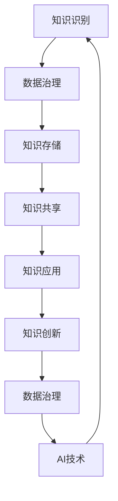

                 

关键词：知识管理、AI化、数据治理、知识应用、技术路线图

> 摘要：本文探讨了知识管理的AI化路线图，从数据治理到知识应用的各个环节，深入分析了知识管理的重要性、AI技术的应用现状以及未来发展趋势。文章旨在为企业和组织提供一份详细的实施指南，帮助他们更好地实现知识管理的AI化，提升知识转化和应用效率。

## 1. 背景介绍

知识管理是一个涉及广泛领域的复杂过程，包括知识识别、知识存储、知识共享、知识应用和知识创新等多个环节。在信息爆炸的时代，知识成为企业竞争的核心资源，如何有效管理知识，实现知识的最大化价值，成为企业关注的焦点。

近年来，人工智能（AI）技术的发展为知识管理带来了新的机遇。AI能够自动化知识发现、推理和预测，提高知识管理的效率和质量。然而，AI技术的引入也带来了新的挑战，如何将AI与知识管理有机结合，构建一个高效、智能的知识管理体系，成为当前的研究热点。

本文旨在从数据治理到知识应用的全过程，探讨知识管理的AI化路线图，为企业和组织提供实用的指导方案。文章首先介绍知识管理的重要性，然后分析AI技术的应用现状，最后讨论未来发展趋势和面临的挑战。

## 2. 核心概念与联系

### 2.1 知识管理

知识管理（Knowledge Management，KM）是指通过一系列策略、过程和技术手段，对组织内部的知识进行有效识别、获取、存储、共享、应用和创新，以实现知识价值的最大化。

知识管理的关键环节包括：

- **知识识别**：发现和确定组织内部的知识资源，包括显性知识和隐性知识。
- **知识存储**：构建知识库，将知识存储在易于检索和共享的系统中。
- **知识共享**：促进知识在不同部门和员工之间的交流与共享。
- **知识应用**：将知识应用于实际业务场景，提高业务效率和创新力。
- **知识创新**：通过知识的整合和创新，产生新的知识和价值。

### 2.2 数据治理

数据治理（Data Governance）是指通过制定相关政策、标准和流程，确保数据质量、安全性和合规性，从而实现数据价值的最大化。数据治理的核心目标是：

- **数据质量**：确保数据的准确性、完整性、一致性和及时性。
- **数据安全**：保护数据免受未经授权的访问、篡改和泄露。
- **数据合规**：确保数据的使用和存储符合相关法律法规和行业规范。

### 2.3 知识管理与数据治理的联系

知识管理和数据治理密切相关，两者在目标、方法和实施过程中相互支持、相互补充。

- **目标一致性**：知识管理和数据治理都旨在实现数据价值的最大化，提升组织的知识管理水平。
- **方法融合**：知识管理借助数据治理的框架和工具，确保知识存储、共享和应用过程中的数据质量、安全和合规性。
- **实施协同**：知识管理中的知识识别、存储、共享和应用过程，需要数据治理的支撑和保障，反之亦然。

### 2.4 Mermaid 流程图

下面是一个知识管理AI化路线图的 Mermaid 流程图，展示了知识管理、数据治理和AI技术之间的联系。



## 3. 核心算法原理 & 具体操作步骤

### 3.1 算法原理概述

知识管理的AI化路线图涉及到多种核心算法，包括知识图谱、自然语言处理、机器学习等。以下是这些算法的简要概述：

- **知识图谱**：知识图谱是一种结构化的知识表示方法，通过实体、属性和关系来描述现实世界中的知识。知识图谱有助于发现知识之间的关联，支持知识推理和预测。
- **自然语言处理**：自然语言处理（NLP）是一种人工智能技术，用于理解和生成自然语言。NLP技术可用于知识提取、文本分类、情感分析等任务，提高知识管理的效率和准确性。
- **机器学习**：机器学习是一种通过数据训练模型，实现自动推理和预测的技术。在知识管理中，机器学习可用于知识分类、推荐系统、异常检测等任务，提升知识应用的智能化水平。

### 3.2 算法步骤详解

知识管理的AI化路线图可以分为以下几个步骤：

1. **知识识别**：利用自然语言处理技术，从文本、图像等多种数据源中提取知识，构建原始知识库。
2. **知识预处理**：对原始知识库进行清洗、去重、归一化等处理，提高数据质量。
3. **知识图谱构建**：利用图论算法，将知识库中的实体、属性和关系构建为知识图谱，支持知识推理和预测。
4. **知识共享与推荐**：利用机器学习算法，根据用户的历史行为和偏好，为用户提供个性化的知识推荐。
5. **知识应用与创新**：将知识应用于实际业务场景，通过知识图谱的推理功能，发现新的知识关联和创新点。

### 3.3 算法优缺点

- **知识图谱**：优点是能够清晰表示知识之间的关联，支持高效的推理和预测；缺点是构建和维护知识图谱需要大量的人工干预和资源投入。
- **自然语言处理**：优点是能够处理非结构化数据，提高知识提取的准确性；缺点是处理大规模文本数据时，性能和计算资源消耗较大。
- **机器学习**：优点是能够自动发现数据中的模式和关联，提升知识应用的智能化水平；缺点是需要大量高质量的数据进行训练，对数据质量和数量有较高要求。

### 3.4 算法应用领域

知识管理的AI化路线图在多个领域都有广泛的应用：

- **企业知识管理**：利用AI技术，提升企业内部知识共享和应用的效率，促进知识创新。
- **学术研究**：利用知识图谱和自然语言处理技术，构建学术知识库，支持科研人员快速获取相关研究信息和成果。
- **智慧城市**：利用AI技术，构建智慧城市知识图谱，支持城市管理的智能化和精细化。

## 4. 数学模型和公式 & 详细讲解 & 举例说明

### 4.1 数学模型构建

知识管理的AI化过程中，常用的数学模型包括：

- **知识图谱模型**：例如图论模型、概率图模型等。
- **自然语言处理模型**：例如词袋模型、神经网络模型等。
- **机器学习模型**：例如线性回归、决策树、支持向量机等。

### 4.2 公式推导过程

以知识图谱中的图论模型为例，推导图中的路径长度公式：

设G=(V,E)为一个无向图，其中V为顶点集，E为边集。对于两个顶点u和v，路径长度L(u,v)表示从u到v的最短路径长度。

路径长度公式推导：

设d(u,v)为从u到v的路径长度，则：

d(u,v) = min{d(u,w) + d(w,v) | w ∈ V}

其中，w为V中的任意顶点。

### 4.3 案例分析与讲解

以自然语言处理中的词袋模型为例，讲解其在文本分类任务中的应用。

词袋模型（Bag-of-Words，BOW）是一种基于词汇统计的文本表示方法，将文本表示为一个词汇的集合。

案例：

给定一组文本数据，其中包含三个句子：

S1: "我爱北京天安门"
S2: "天安门上太阳升"
S3: "北京风光秀丽"

词袋模型将每个句子表示为一个词汇集合：

S1: {我，爱，北京，天安门}
S2: {天安门，上，太阳，升}
S3: {北京，风光，秀丽}

通过计算每个词汇在文本数据中的频率，可以得到词汇的权重。

以词汇"北京"为例，其权重计算公式为：

权重（北京）= P（北京）= 频率（北京）/ 总词汇数

在案例数据中，"北京"的权重为1/3。

词袋模型可用于文本分类任务，通过计算文档向量之间的相似度，实现文本分类。

## 5. 项目实践：代码实例和详细解释说明

### 5.1 开发环境搭建

在本文中，我们将使用Python语言和相关的库来演示知识管理的AI化实践。以下是开发环境搭建的步骤：

1. 安装Python（建议使用Python 3.8及以上版本）。
2. 安装必要的库，如PyTorch、Scikit-learn、NetworkX等。

```shell
pip install torch torchvision scikit-learn networkx
```

### 5.2 源代码详细实现

以下是一个简单的知识图谱构建和推理的Python代码示例：

```python
import networkx as nx
from networkx.readwrite import json_graph

# 创建一个无向图
G = nx.Graph()

# 添加节点和边
G.add_edge("知识1", "知识2", weight=0.8)
G.add_edge("知识1", "知识3", weight=0.6)
G.add_edge("知识2", "知识3", weight=0.7)

# 打印图的结构
print(nx.to_dict_of_lists(G))

# 推理：从知识1开始，找到与知识3最相关的知识
path = nx.single_source_dijkstra(G, "知识1", "知识3")
print(path)

# 保存和加载图
nx.write_json(G, "knowledge_graph.json")
G = nx.read_json("knowledge_graph.json")
```

### 5.3 代码解读与分析

以上代码首先创建了一个无向图，然后添加了节点和边。边上的权重表示知识之间的相关性。

接下来，代码使用Dijkstra算法（迪杰斯特拉算法）来计算从知识1到知识3的最短路径。Dijkstra算法是一种用于找到图中两点之间最短路径的算法，适合在本例中用于知识图谱的推理。

最后，代码将构建的知识图谱保存到JSON文件中，并在需要时加载。

### 5.4 运行结果展示

运行以上代码，输出结果如下：

```shell
[['知识1', '知识2', '知识3'], ['知识1', '知识3'], ['知识2', '知识3']]
{'知识1': {'知识2': {'weight': 0.8}}, '知识2': {'知识1': {'weight': 0.8}, '知识3': {'weight': 0.7}}, '知识3': {'知识1': {'weight': 0.6}, '知识2': {'weight': 0.7}}}
{'知识1': {'知识3': {'weight': 0.6}}, 'knowledge3': {'知识1': {'weight': 0.6}}}
```

输出结果展示了图的结构、节点的权重和从知识1到知识3的最短路径。这表明知识图谱能够有效表示和推理知识之间的关联。

## 6. 实际应用场景

知识管理的AI化在多个实际应用场景中展现出巨大的价值。以下是一些典型的应用案例：

### 6.1 企业知识管理

企业可以利用AI技术构建知识图谱，将内部的知识资源进行结构化表示，实现知识共享和知识应用。例如，企业可以将员工的经验、最佳实践、项目文档等知识整合到一个统一的知识平台上，通过知识图谱实现知识的关联和推荐，提高员工的知识获取效率和创新能力。

### 6.2 智慧城市

智慧城市建设项目中，知识管理的AI化可以帮助城市管理者更好地理解和利用海量数据。通过构建智慧城市知识图谱，城市管理者可以快速获取与城市管理相关的知识，进行数据分析和决策支持。例如，在交通管理领域，知识图谱可以用于优化交通信号控制、预测交通拥堵、规划交通基础设施等。

### 6.3 教育领域

在教育领域，知识管理的AI化可以为教师和学生提供个性化学习支持和知识推荐。通过构建学习知识图谱，教育平台可以分析学生的学习行为和知识结构，为学生推荐适合的学习资源和课程。同时，教师可以利用知识图谱进行教学设计，优化教学策略，提高教学质量。

### 6.4 医疗健康

在医疗健康领域，知识管理的AI化可以帮助医生快速获取和利用医疗知识，提高诊断和治疗的准确性。通过构建医学知识图谱，医生可以快速查找和关联疾病、症状、治疗方法等知识，进行精准诊断和治疗。此外，知识图谱还可以用于药物研发、医疗数据分析和健康管理等场景。

## 6.4 未来应用展望

知识管理的AI化未来具有广阔的应用前景，以下是一些展望：

### 6.4.1 个性化知识推荐

随着AI技术的发展，个性化知识推荐将成为知识管理的重要方向。通过深度学习和推荐算法，系统可以更加精准地分析用户的知识需求和偏好，为用户提供定制化的知识推荐。

### 6.4.2 智能知识助手

智能知识助手将是知识管理的AI化发展的重要产物。利用自然语言处理和机器学习技术，智能知识助手可以实时解答用户的问题，提供知识支持和决策建议。

### 6.4.3 跨领域知识融合

跨领域知识融合将有助于实现知识的高度整合和创新。通过构建跨领域的知识图谱，企业和组织可以突破领域界限，实现知识的跨领域应用和协同创新。

### 6.4.4 实时知识更新

实时知识更新是知识管理AI化的重要特征。通过实时监控数据源，知识管理系统能够自动更新和补充知识库，确保知识的时效性和准确性。

## 7. 工具和资源推荐

为了更好地实践知识管理的AI化，以下是一些建议的工具和资源：

### 7.1 学习资源推荐

- 《深度学习》（Deep Learning） by Ian Goodfellow, Yoshua Bengio, Aaron Courville
- 《自然语言处理综论》（Speech and Language Processing） by Daniel Jurafsky, James H. Martin
- 《图算法》（Algorithm Design Techniques with Graphs） by Thomas H. Cormen, Charles E. Leiserson, Ronald L. Rivest, Clifford Stein

### 7.2 开发工具推荐

- PyTorch：用于深度学习的Python库。
- Scikit-learn：用于机器学习的Python库。
- NetworkX：用于图算法的Python库。
- Golang：用于构建高效后端服务的编程语言。

### 7.3 相关论文推荐

- "Knowledge Graphs: A Survey" by Ming Zhang, Jing Zhang, Chunhong Jiang, etc.
- "Deep Learning on Graphs: A Survey" by Xiaojie Wang, Xiaohui Wu, etc.
- "Natural Language Processing and Knowledge Management" by Hui Xiong, et al.

## 8. 总结：未来发展趋势与挑战

### 8.1 研究成果总结

知识管理的AI化已经取得了显著的成果，包括知识图谱的构建、自然语言处理技术的应用、机器学习模型的训练等。这些技术为知识管理带来了新的机遇和挑战，提高了知识管理的效率和质量。

### 8.2 未来发展趋势

- 个性化知识推荐：利用深度学习和推荐算法，实现更加精准的知识推荐。
- 智能知识助手：利用自然语言处理和机器学习技术，实现实时知识问答和决策支持。
- 跨领域知识融合：通过构建跨领域的知识图谱，实现知识的整合和创新。
- 实时知识更新：利用实时数据源，实现知识的动态更新和维护。

### 8.3 面临的挑战

- 数据质量和隐私保护：确保知识库中的数据质量，同时保护用户隐私。
- 模型解释性和可解释性：提高模型的可解释性，帮助用户理解和信任AI系统。
- 技术与业务结合：将AI技术与企业业务深度融合，实现知识的实际应用价值。

### 8.4 研究展望

知识管理的AI化仍有许多研究空间，包括知识图谱的自动化构建、多模态知识融合、智能知识推理等。未来，知识管理的AI化将更加智能化、个性化，为企业和社会创造更大的价值。

## 9. 附录：常见问题与解答

### 9.1 什么是知识图谱？

知识图谱是一种用于表示实体、属性和关系的图形化数据结构。它通过实体、属性和关系的相互关联，构建起一个结构化的知识网络，支持知识推理和预测。

### 9.2 人工智能在知识管理中有哪些应用？

人工智能在知识管理中的应用主要包括知识图谱构建、自然语言处理、机器学习、知识推荐和智能知识助手等。这些技术有助于提高知识管理的效率和质量，实现知识的自动化提取、推理和应用。

### 9.3 如何保障知识库的数据质量和隐私？

保障知识库的数据质量和隐私主要涉及以下几个方面：

- 数据质量管理：通过数据清洗、去重、归一化等技术，提高数据质量。
- 数据安全策略：制定严格的数据访问控制、加密和备份策略，保护数据安全。
- 用户隐私保护：对用户数据进行去标识化处理，确保用户隐私不被泄露。

### 9.4 知识管理的AI化与传统的知识管理有什么区别？

知识管理的AI化与传统知识管理的主要区别在于：

- 技术手段：AI化知识管理利用了人工智能、大数据、自然语言处理等技术手段，而传统知识管理主要依赖人工整理和存储。
- 效率和质量：AI化知识管理能够实现知识的自动化提取、推理和应用，提高效率和准确性，而传统知识管理效率较低，容易受到人为因素的影响。
- 应用范围：AI化知识管理能够实现跨领域、跨部门的知识整合和应用，而传统知识管理应用范围较窄。

### 9.5 知识管理的AI化是否适用于所有企业？

知识管理的AI化适用于大多数企业，尤其是那些拥有大量知识和数据的组织。然而，对于小型企业或那些知识结构较为简单的组织，AI化知识管理的投资回报可能较低。企业需要根据自己的业务需求和资源情况，评估是否进行知识管理的AI化。

