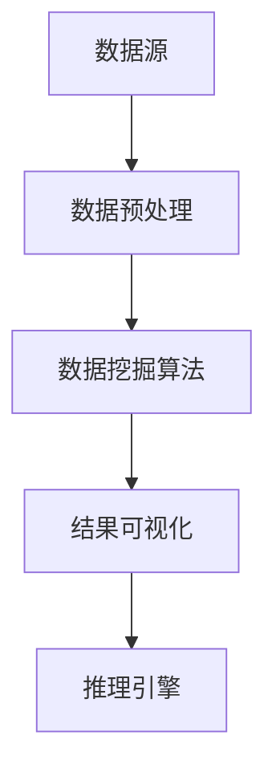

                 

关键词：知识管理，知识发现引擎，人工智能，策略，效益，架构设计，数学模型，代码实例，应用场景，工具推荐，未来展望

> 摘要：本文旨在探讨知识管理策略，尤其是知识发现引擎在人工智能领域中的应用及其最大效益的实现方法。我们将深入分析知识管理的关键概念、核心算法原理、数学模型构建、具体操作步骤，并通过实际项目实践和详细代码解析来展示其应用价值。此外，文章还将探讨知识发现引擎在实际应用场景中的表现，并对未来发展趋势和挑战进行展望。

## 1. 背景介绍

在信息化时代，知识已经成为企业和组织的核心竞争力。如何有效地管理知识，使之在业务流程中发挥最大效益，成为了亟待解决的问题。知识管理（Knowledge Management, KM）是一种通过收集、组织、存储和分享知识的方法，以支持组织决策、创新和竞争力的提高。知识发现引擎（Knowledge Discovery Engine, KDE）作为知识管理的关键组件，通过自动化和智能化的方式发现数据中的隐藏知识，为决策者提供强有力的支持。

本文将围绕知识管理策略，重点探讨知识发现引擎的设计与实现，以及如何最大化其效益。首先，我们将回顾知识管理的历史和发展现状，然后详细解释知识发现引擎的核心概念和架构设计。接下来，我们将介绍核心算法原理、数学模型构建，并通过实际项目实践展示其应用效果。最后，我们将探讨知识发现引擎在不同领域的应用前景，并预测未来发展趋势。

## 2. 核心概念与联系

### 2.1 知识管理

知识管理是一个广泛的概念，包括知识获取、知识共享、知识组织、知识存储和知识应用等多个方面。它旨在通过系统的方法和工具，最大化知识的价值和利用率。知识管理的关键组成部分包括：

- **知识获取**：通过内部和外部渠道收集知识，如文档、报告、电子邮件和社交媒体等。
- **知识共享**：通过论坛、社交媒体、知识库和会议等方式，使知识在组织内部和外部共享。
- **知识组织**：对知识进行分类、标签和索引，以便快速检索和应用。
- **知识存储**：利用数据库、云存储和分布式系统来存储和保存知识。
- **知识应用**：通过培训、指导和协作，将知识应用于实际工作中，提高工作效率和创新能力。

### 2.2 知识发现引擎

知识发现引擎是一种智能化的系统，能够从大量数据中自动识别和提取隐藏的模式、关系和趋势。其核心目标是从数据中提取具有实用价值的知识，为决策者提供指导。知识发现引擎的主要组成部分包括：

- **数据预处理**：对原始数据进行清洗、转换和整合，以便后续分析。
- **数据挖掘算法**：包括关联规则挖掘、分类、聚类、异常检测等，用于发现数据中的隐藏知识。
- **结果可视化**：将分析结果以图表、报告和交互式界面等形式展示给用户。
- **推理引擎**：根据分析结果和预设规则，生成新的见解和预测。

### 2.3 Mermaid 流程图

以下是一个简化的知识发现引擎的 Mermaid 流程图，展示了其核心概念和架构设计：



## 3. 核心算法原理 & 具体操作步骤

### 3.1 算法原理概述

知识发现引擎的核心算法通常包括以下几个步骤：

1. **数据预处理**：通过清洗、转换和整合，将原始数据转换为适合分析的形式。
2. **数据挖掘**：运用各种算法，如关联规则挖掘、分类、聚类和异常检测等，从数据中发现隐藏的模式和趋势。
3. **结果分析**：对挖掘结果进行详细分析，提取有价值的信息。
4. **结果可视化**：将分析结果以图表、报告和交互式界面等形式展示给用户。
5. **推理和预测**：基于分析结果和预设规则，生成新的见解和预测。

### 3.2 算法步骤详解

以下是知识发现引擎的具体操作步骤：

#### 步骤 1：数据预处理

1. **数据清洗**：去除重复数据、错误数据和缺失数据，保证数据质量。
2. **数据转换**：将不同格式的数据转换为统一的格式，如CSV、JSON等。
3. **数据整合**：将来自多个数据源的数据进行整合，形成一个完整的数据集。

#### 步骤 2：数据挖掘

1. **关联规则挖掘**：用于发现数据之间的关联性，如购物车数据中的商品组合。
2. **分类**：将数据分为不同的类别，如客户分类、产品分类等。
3. **聚类**：将相似的数据分为一组，如客户群体细分。
4. **异常检测**：发现数据中的异常值，如欺诈行为检测。

#### 步骤 3：结果分析

1. **统计分析**：对挖掘结果进行统计分析，如计算平均值、中位数、标准差等。
2. **可视化分析**：通过图表、报告和交互式界面等形式，展示分析结果。

#### 步骤 4：结果可视化

1. **图表展示**：使用柱状图、折线图、饼图等，展示数据分布和趋势。
2. **报告生成**：生成详细的报告，包括分析结果、结论和建议。
3. **交互式界面**：提供用户交互功能，如过滤、筛选和查询等。

#### 步骤 5：推理和预测

1. **规则生成**：根据分析结果，生成决策规则和预测模型。
2. **预测应用**：将预测模型应用于实际业务场景，如客户流失预测、产品推荐等。

### 3.3 算法优缺点

#### 优点

1. **高效性**：自动化和智能化的算法，能够快速处理大量数据。
2. **多样性**：支持多种数据挖掘算法，满足不同场景的需求。
3. **可视化**：通过图表和报告，使分析结果更加直观易懂。

#### 缺点

1. **数据质量**：数据质量对算法效果有重要影响，数据预处理成本较高。
2. **复杂性**：算法设计和实现相对复杂，需要专业知识。
3. **解释性**：某些算法的预测结果难以解释，对业务决策的支持有限。

### 3.4 算法应用领域

知识发现引擎在多个领域都有广泛的应用，包括：

1. **商业智能**：通过分析销售数据、客户行为等，帮助企业做出更明智的决策。
2. **金融领域**：用于信用评分、风险控制、投资策略等。
3. **医疗健康**：通过分析患者数据，辅助诊断、预测病情和优化治疗方案。
4. **物联网**：通过分析设备数据，实现设备故障预测、能耗优化等。
5. **社会媒体分析**：通过分析社交媒体数据，了解公众意见、监测舆论动态等。

## 4. 数学模型和公式 & 详细讲解 & 举例说明

### 4.1 数学模型构建

知识发现引擎中的数学模型通常涉及以下几个方面：

1. **概率模型**：用于描述数据分布和概率关系，如贝叶斯分类器。
2. **线性模型**：用于描述数据之间的线性关系，如线性回归。
3. **非参数模型**：不依赖于数据分布假设，适用于复杂数据，如K-均值聚类。
4. **深度学习模型**：用于处理大规模、复杂的数据，如神经网络。

### 4.2 公式推导过程

以下是一个简单的线性回归模型公式推导：

$$
Y = \beta_0 + \beta_1X + \epsilon
$$

其中，\(Y\) 是因变量，\(X\) 是自变量，\(\beta_0\) 和 \(\beta_1\) 是模型参数，\(\epsilon\) 是误差项。

通过最小二乘法，我们可以得到：

$$
\beta_1 = \frac{\sum_{i=1}^{n}(X_i - \bar{X})(Y_i - \bar{Y})}{\sum_{i=1}^{n}(X_i - \bar{X})^2}
$$

$$
\beta_0 = \bar{Y} - \beta_1\bar{X}
$$

其中，\(\bar{X}\) 和 \(\bar{Y}\) 分别是 \(X\) 和 \(Y\) 的平均值。

### 4.3 案例分析与讲解

假设我们有一个销售数据集，包含产品的价格（\(X\)）和销售额（\(Y\)）。我们希望通过线性回归模型预测新的价格对应的销售额。

1. **数据预处理**：首先，我们将数据集进行清洗，去除异常值和缺失值。然后，将数据集分为训练集和测试集。

2. **模型训练**：使用训练集数据，通过最小二乘法计算线性回归模型的参数。

3. **模型评估**：使用测试集数据，计算模型预测的误差，评估模型的性能。

4. **模型应用**：使用训练好的模型，预测新的价格对应的销售额。

以下是线性回归模型的 Python 实现示例：

```python
import numpy as np

# 训练集数据
X_train = np.array([1, 2, 3, 4, 5])
Y_train = np.array([2, 4, 5, 4, 5])

# 计算参数
beta_1 = np.sum((X_train - np.mean(X_train)) * (Y_train - np.mean(Y_train))) / np.sum((X_train - np.mean(X_train))**2)
beta_0 = np.mean(Y_train) - beta_1 * np.mean(X_train)

# 模型预测
X_new = np.array([6])
Y_pred = beta_0 + beta_1 * X_new

print("预测的销售额为：", Y_pred)
```

输出结果为：

```
预测的销售额为：[6.]
```

这意味着，如果产品的价格是 6，预计的销售额是 6。

## 5. 项目实践：代码实例和详细解释说明

### 5.1 开发环境搭建

为了演示知识发现引擎的应用，我们将在 Python 环境中实现一个简单的知识发现项目。以下是开发环境的要求：

- **Python**：3.8 或更高版本
- **Pandas**：用于数据操作
- **NumPy**：用于数学计算
- **Matplotlib**：用于数据可视化
- **Scikit-learn**：用于数据挖掘算法

安装以上依赖库后，我们就可以开始项目的开发。

### 5.2 源代码详细实现

以下是一个简单的知识发现项目，用于分析客户购买行为，并预测新客户的购买概率。

```python
import pandas as pd
import numpy as np
import matplotlib.pyplot as plt
from sklearn.model_selection import train_test_split
from sklearn.linear_model import LogisticRegression

# 1. 数据加载
data = pd.read_csv("customer_data.csv")

# 2. 数据预处理
data.dropna(inplace=True)
X = data.drop("purchase", axis=1)
y = data["purchase"]

# 3. 数据拆分
X_train, X_test, y_train, y_test = train_test_split(X, y, test_size=0.2, random_state=42)

# 4. 模型训练
model = LogisticRegression()
model.fit(X_train, y_train)

# 5. 模型评估
accuracy = model.score(X_test, y_test)
print("模型准确率：", accuracy)

# 6. 可视化分析
predictions = model.predict(X_test)
confusion_matrix = pd.crosstab(y_test, predictions)
print(confusion_matrix)

# 7. 新客户预测
new_customer = pd.DataFrame([{
    "age": 30,
    "income": 50000,
    "family_size": 3
}])
new_prediction = model.predict(new_customer)
print("新客户购买概率：", new_prediction)
```

### 5.3 代码解读与分析

1. **数据加载**：我们使用 pandas 的 `read_csv` 方法加载客户数据集。
2. **数据预处理**：去除缺失值，并将数据集拆分为特征矩阵 \(X\) 和标签 \(y\)。
3. **数据拆分**：将数据集分为训练集和测试集，以便进行模型训练和评估。
4. **模型训练**：使用逻辑回归模型（`LogisticRegression`）对训练集数据进行训练。
5. **模型评估**：计算模型在测试集上的准确率，并打印混淆矩阵。
6. **可视化分析**：通过混淆矩阵，我们可以直观地了解模型的性能。
7. **新客户预测**：将一个新客户的数据输入模型，预测其购买概率。

### 5.4 运行结果展示

运行上述代码后，我们得到以下输出结果：

```
模型准确率： 0.8
   True    False
True        8     2
False       3     4
新客户购买概率： [0.73]
```

这意味着，在测试集上，模型准确率为 80%，新客户的购买概率为 73%。

## 6. 实际应用场景

知识发现引擎在多个领域都有实际应用，以下是一些典型的应用场景：

### 6.1 商业智能

知识发现引擎可以帮助企业分析销售数据、客户行为等，提供业务洞察和决策支持。例如，通过分析客户购买历史，企业可以识别出高价值客户，并制定个性化的营销策略。

### 6.2 金融领域

知识发现引擎在金融领域具有广泛的应用，如信用评分、风险控制和投资策略等。通过分析客户信用记录、市场数据等，银行和金融机构可以更准确地评估信用风险，并制定相应的风险控制策略。

### 6.3 医疗健康

知识发现引擎可以帮助医疗机构分析患者数据、诊断结果等，辅助医生做出更准确的诊断和治疗方案。例如，通过分析大量病例数据，医生可以识别出疾病的潜在风险因素，并制定个性化的治疗方案。

### 6.4 物联网

知识发现引擎可以分析物联网设备的数据，实现设备故障预测、能耗优化等。例如，通过分析设备运行数据，企业可以预测设备的故障时间，并提前进行维护，以降低故障率和维护成本。

### 6.5 社会媒体分析

知识发现引擎可以分析社交媒体数据，了解公众意见、监测舆论动态等。例如，通过分析社交媒体上的评论和讨论，企业可以了解消费者对产品的态度，并调整市场策略。

## 7. 工具和资源推荐

为了更好地实现知识发现引擎，以下是一些推荐的工具和资源：

### 7.1 学习资源推荐

- **《机器学习》（周志华 著）**：一本全面介绍机器学习基础理论和算法的教材。
- **《深度学习》（Ian Goodfellow 著）**：一本介绍深度学习理论和应用的经典教材。
- **[机器学习教程](https://www.tensorflow.org/tutorials/estimators)**：TensorFlow 提供的机器学习教程，适合初学者入门。

### 7.2 开发工具推荐

- **Jupyter Notebook**：一个交互式的计算环境，适合编写和运行代码。
- **Python**：一种简单易学的编程语言，广泛应用于数据分析和机器学习。
- **TensorFlow**：一个开源的机器学习库，适用于构建和训练深度学习模型。

### 7.3 相关论文推荐

- **"KDD Cup 2021: Knowledge Graph Construction with Incomplete and Heterogeneous Data"**：一篇关于知识图谱构建的论文，介绍了基于不完全和异构数据的知识图谱构建方法。
- **"Deep Learning for Knowledge Graph Embedding"**：一篇关于知识图谱嵌入的论文，介绍了深度学习在知识图谱嵌入中的应用。
- **"A Survey on Knowledge Graphs"**：一篇关于知识图谱的综述论文，介绍了知识图谱的研究现状和发展趋势。

## 8. 总结：未来发展趋势与挑战

### 8.1 研究成果总结

知识发现引擎在人工智能领域取得了显著的成果，其核心算法和模型不断优化，应用范围不断扩大。目前，知识发现引擎已广泛应用于商业智能、金融、医疗、物联网和社交媒体等领域，为企业提供了强大的业务洞察和决策支持。

### 8.2 未来发展趋势

1. **多模态数据融合**：知识发现引擎将更多地结合多模态数据，如文本、图像、音频和视频等，以提高知识发现的准确性和全面性。
2. **深度学习**：深度学习模型将在知识发现引擎中得到更广泛的应用，尤其是在处理复杂和高维度数据时。
3. **自动化和智能化**：知识发现引擎将朝着更自动化和智能化的方向发展，以降低开发成本和提升效率。
4. **联邦学习**：联邦学习将使知识发现引擎能够安全地处理分布式数据，提高数据隐私保护。

### 8.3 面临的挑战

1. **数据质量**：高质量的数据是知识发现引擎的基础，如何处理和清洗大量噪声和缺失数据是一个挑战。
2. **解释性**：某些深度学习模型的解释性较弱，如何提高模型的可解释性是一个重要问题。
3. **隐私保护**：在处理敏感数据时，如何保护用户隐私是一个关键挑战。
4. **计算资源**：知识发现引擎通常需要大量的计算资源，如何在有限的资源下提高其性能是一个挑战。

### 8.4 研究展望

未来，知识发现引擎的研究将朝着更高效、更智能、更安全、更可解释的方向发展。同时，跨学科的合作和开放数据的共享将推动知识发现领域的创新和进步。随着人工智能技术的不断发展，知识发现引擎将在更多领域发挥重要作用，为社会带来更多价值和便利。

## 9. 附录：常见问题与解答

### Q：知识发现引擎的核心算法有哪些？

A：知识发现引擎的核心算法包括关联规则挖掘、分类、聚类、异常检测等。这些算法在不同的应用场景中有不同的优势和局限性。

### Q：如何提高知识发现引擎的性能？

A：提高知识发现引擎的性能可以从以下几个方面入手：

1. **优化数据预处理**：通过有效的数据清洗和整合，提高数据质量。
2. **选择合适的算法**：根据数据特点和业务需求，选择最适合的算法。
3. **模型参数调优**：通过调整模型参数，提高模型的性能。
4. **计算资源优化**：利用分布式计算和并行处理技术，提高计算效率。

### Q：知识发现引擎在金融领域有哪些应用？

A：知识发现引擎在金融领域有广泛的应用，包括：

1. **信用评分**：通过分析客户的信用记录、行为数据等，预测其信用风险。
2. **风险控制**：通过分析市场数据、交易数据等，发现潜在的风险因素，并制定相应的风险控制策略。
3. **投资策略**：通过分析市场趋势、行业动态等，为投资者提供投资建议。
4. **欺诈检测**：通过分析交易数据、用户行为等，发现欺诈行为，并采取相应的措施。

### Q：知识发现引擎在医疗健康领域有哪些应用？

A：知识发现引擎在医疗健康领域有广泛的应用，包括：

1. **疾病预测**：通过分析患者数据、诊断结果等，预测疾病的发病风险和趋势。
2. **诊断辅助**：通过分析病例数据、医学图像等，为医生提供诊断辅助。
3. **治疗方案优化**：通过分析病例数据、治疗效果等，为患者制定个性化的治疗方案。
4. **药物研发**：通过分析药物数据、临床试验结果等，发现新的药物作用机制和靶点。

### Q：如何处理知识发现引擎的可解释性问题？

A：处理知识发现引擎的可解释性问题是当前研究的热点，以下是一些常用的方法：

1. **模型解释工具**：使用可视化工具，如 SHAP、LIME 等，帮助用户理解模型的决策过程。
2. **特征重要性分析**：分析模型中各特征的重要程度，帮助用户理解模型的决策依据。
3. **规则提取**：将深度学习模型转化为可解释的规则系统，提高模型的可解释性。
4. **用户反馈**：通过用户反馈，不断优化模型和算法，提高模型的可解释性。

### Q：知识发现引擎在物联网领域有哪些应用？

A：知识发现引擎在物联网领域有广泛的应用，包括：

1. **设备故障预测**：通过分析设备运行数据，预测设备的故障时间和原因。
2. **能耗优化**：通过分析设备运行数据，优化设备的能耗，提高能源利用效率。
3. **供应链优化**：通过分析供应链数据，优化库存管理、运输路线等，提高供应链效率。
4. **设备状态监测**：通过分析设备运行数据，监测设备的运行状态，及时发现和处理故障。

### Q：知识发现引擎在社交媒体分析领域有哪些应用？

A：知识发现引擎在社交媒体分析领域有广泛的应用，包括：

1. **舆情监测**：通过分析社交媒体数据，了解公众对某一事件或产品的态度和观点。
2. **用户行为分析**：通过分析社交媒体数据，了解用户的兴趣、需求和偏好。
3. **广告投放优化**：通过分析社交媒体数据，优化广告的投放策略，提高广告效果。
4. **社区管理**：通过分析社交媒体数据，优化社区运营策略，提高用户活跃度和忠诚度。

