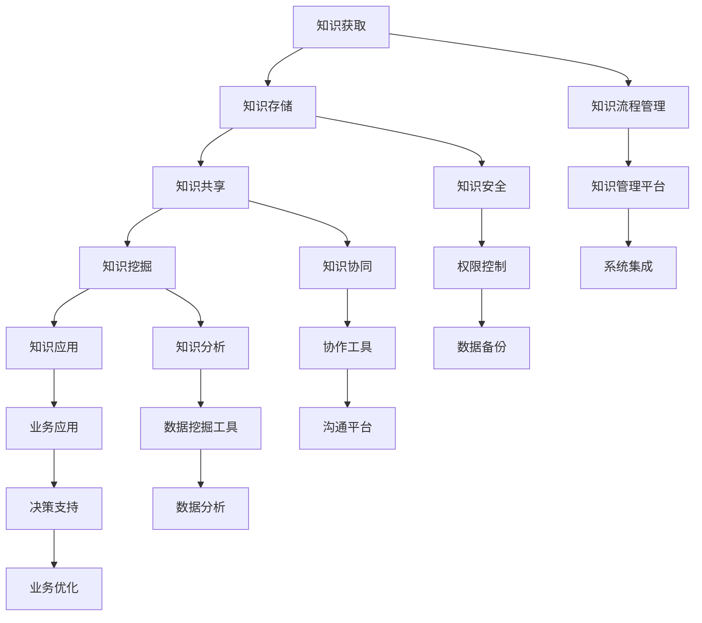

                 

 在当今信息化时代，知识管理系统的设计与实现成为企业和组织提高竞争力、优化知识流程的关键。本文将探讨知识管理系统的核心概念、设计原则、算法原理、数学模型、项目实践以及未来发展趋势。希望通过本文，读者能够全面了解知识管理系统的设计与实现，为其在实际应用中提供指导。

## 关键词

知识管理、信息系统、数据挖掘、算法、数学模型、项目实践、发展趋势。

## 摘要

本文首先介绍了知识管理系统的背景和重要性。随后，详细阐述了知识管理系统的核心概念和设计原则，并通过Mermaid流程图展示了系统的架构。接着，深入分析了知识管理系统中的核心算法原理，包括其具体操作步骤、优缺点及应用领域。在数学模型和公式部分，本文构建了知识管理中的数学模型，并进行了详细的公式推导和案例分析。随后，本文通过项目实践部分展示了知识管理系统的代码实例和运行结果。最后，本文探讨了知识管理系统在实际应用场景中的价值，并对未来发展趋势、面临的挑战和研究展望进行了深入讨论。

## 1. 背景介绍

随着全球化和信息化的加速发展，知识已经成为企业和社会的核心资源。然而，如何在海量信息中有效管理、利用知识，成为企业和组织面临的重要挑战。知识管理系统（Knowledge Management System，KMS）作为一种信息系统，旨在通过集成和优化知识管理流程，提高组织的学习能力和创新能力。知识管理系统不仅有助于企业内部的知识共享和传播，还能够通过数据分析和挖掘，为企业提供战略决策支持。

知识管理系统的研究始于20世纪90年代，随着互联网和信息技术的发展，其应用范围不断扩大。当前，知识管理系统已经广泛应用于企业、政府、教育、医疗等多个领域，成为提高组织竞争力的重要手段。然而，由于知识管理系统的设计复杂、涉及多个学科领域，因此在实际应用中仍然面临许多挑战。本文旨在通过全面探讨知识管理系统的设计与实现，为解决这些挑战提供理论和实践指导。

### 1.1 研究目的和意义

本研究的主要目的是系统地分析知识管理系统的设计与实现，探讨其核心概念、算法原理、数学模型和应用实践。具体而言，本文旨在解决以下问题：

1. 知识管理系统的核心概念和设计原则是什么？
2. 知识管理系统中的核心算法原理及其应用领域是什么？
3. 如何构建知识管理中的数学模型并推导相关公式？
4. 知识管理系统在实际应用中的具体实现方法和案例分析是什么？
5. 知识管理系统在未来发展中的趋势和面临的挑战是什么？

本研究具有重要的理论和实践意义。在理论方面，本文将丰富和拓展知识管理系统的相关研究，为后续研究提供参考。在实践方面，本文的研究成果可以为企业和组织在知识管理系统建设过程中提供指导，提高知识管理的效率和质量。

### 1.2 研究方法

本文采用多学科交叉的研究方法，结合文献综述、理论分析和案例分析等方法，对知识管理系统的设计与实现进行全面探讨。具体研究方法如下：

1. 文献综述：通过查阅国内外相关文献，系统总结知识管理系统的发展历程、核心概念、算法原理和数学模型，为本文的研究提供理论基础。
2. 理论分析：在文献综述的基础上，本文将对知识管理系统的核心概念、设计原则和算法原理进行深入分析，阐述其内在逻辑和关系。
3. 案例分析：本文将通过具体案例分析，展示知识管理系统在实际应用中的实现方法和效果，为读者提供实践参考。
4. 数学建模：本文将构建知识管理中的数学模型，并推导相关公式，为知识管理系统的算法设计和性能优化提供理论支持。

### 1.3 文章结构

本文结构如下：

1. 背景介绍：阐述知识管理系统的背景和重要性，介绍研究目的、意义、方法及文章结构。
2. 核心概念与联系：详细阐述知识管理系统的核心概念、设计原则和系统架构，并通过Mermaid流程图展示。
3. 核心算法原理 & 具体操作步骤：深入分析知识管理系统中的核心算法原理，包括其具体操作步骤、优缺点及应用领域。
4. 数学模型和公式 & 详细讲解 & 举例说明：构建知识管理中的数学模型，推导相关公式，并进行案例分析与讲解。
5. 项目实践：展示知识管理系统的代码实例和详细解释说明，包括开发环境搭建、源代码实现、代码解读和分析以及运行结果展示。
6. 实际应用场景：探讨知识管理系统在实际应用中的价值，包括教育、企业、政府等多个领域。
7. 未来应用展望：分析知识管理系统在未来的发展趋势和应用前景。
8. 工具和资源推荐：推荐相关学习资源、开发工具和论文，为读者提供进一步学习和参考。
9. 总结：对研究成果进行总结，探讨未来发展趋势和面临的挑战。

### 1.4 研究限制和假设

本研究存在以下限制和假设：

1. 研究范围仅限于知识管理系统的主要领域和核心技术，未涉及所有可能的应用场景和细节。
2. 假设知识管理系统的建设和使用遵循特定的标准和规范，未考虑不同组织和文化背景下的差异。
3. 假设本文所涉及的算法和数学模型在特定条件下具有可操作性和有效性，未考虑复杂和多变的环境因素。
4. 研究主要基于文献综述和案例分析，未进行大规模实证研究，结论可能存在一定局限性。

尽管存在上述限制和假设，本文的研究成果仍然具有较高的实用价值和指导意义，为知识管理系统的设计与实现提供了有益的参考。

## 2. 核心概念与联系

在探讨知识管理系统的设计与实现之前，首先需要明确其核心概念和设计原则。知识管理系统涉及多个学科领域，包括信息科学、管理科学、计算机科学等。本文将详细阐述知识管理系统的核心概念、设计原则及其相互关系，并通过Mermaid流程图展示系统的整体架构。

### 2.1 核心概念

知识管理系统的核心概念包括知识、知识流程、知识共享、知识挖掘和知识应用等。

1. **知识（Knowledge）**：知识是指经过整理、组织和结构化的信息，能够为决策、创新和学习提供支持。知识可以包括事实、技能、经验、观点和价值观等。

2. **知识流程（Knowledge Process）**：知识流程是指知识从产生、存储、共享到应用的一系列过程。知识流程包括知识获取、知识存储、知识共享和知识应用等环节。

3. **知识共享（Knowledge Sharing）**：知识共享是指个体或团队通过交流、合作和协作等方式，将知识传递给其他个体或团队的过程。知识共享有助于提高组织的学习能力和创新能力。

4. **知识挖掘（Knowledge Mining）**：知识挖掘是指利用数据挖掘、机器学习和自然语言处理等技术，从海量数据中提取有价值信息的过程。知识挖掘有助于发现知识之间的关联和规律，为知识应用提供支持。

5. **知识应用（Knowledge Application）**：知识应用是指将知识应用于实际业务过程，以提高工作效率和决策质量。知识应用包括知识库建设、决策支持系统和智能服务等。

### 2.2 设计原则

知识管理系统设计应遵循以下原则：

1. **系统性（Systematic）**：知识管理系统应具有系统性，涵盖知识获取、存储、共享、挖掘和应用等各个环节。通过系统设计，实现知识的高效管理。

2. **灵活性（Flexible）**：知识管理系统应具有灵活性，能够根据不同组织的需求和特点进行定制和调整。灵活性有助于提高知识管理系统的适应性和实用性。

3. **可扩展性（Scalable）**：知识管理系统应具有可扩展性，能够支持组织规模的扩大和业务范围的拓展。通过可扩展性设计，确保知识管理系统在组织发展过程中持续发挥作用。

4. **安全性（Secure）**：知识管理系统应具有安全性，确保知识的安全存储、传输和使用。通过安全性设计，防止知识泄露、篡改和滥用。

5. **协同性（Collaborative）**：知识管理系统应具有协同性，支持个体和团队之间的知识共享和协作。通过协同性设计，提高组织的学习能力和创新能力。

### 2.3 相互关系

知识管理系统的核心概念和设计原则之间存在着密切的相互关系。具体而言：

1. **知识流程与核心概念**：知识流程是知识管理系统的核心，贯穿于知识获取、存储、共享、挖掘和应用等各个环节。知识流程的实现依赖于核心概念的支持，如知识、知识共享和知识挖掘等。

2. **设计原则与知识流程**：设计原则为知识流程的实现提供指导。例如，系统性原则确保知识流程的完整性和协调性，灵活性原则支持知识流程的定制和调整，可扩展性原则适应组织规模的扩大和业务范围的拓展。

3. **核心概念与设计原则**：核心概念和设计原则相互促进，共同构建知识管理系统。核心概念为设计原则提供理论基础，设计原则为核心概念的实现提供保障。

### 2.4 Mermaid流程图

为了更好地展示知识管理系统的架构和核心概念之间的关系，本文采用Mermaid流程图进行描述。以下是一个简化的Mermaid流程图示例：



该Mermaid流程图展示了知识管理系统的核心概念和设计原则之间的联系。其中，知识获取、存储、共享、挖掘和应用等环节构成知识流程，知识流程管理、知识安全、知识协同、知识分析和业务应用等环节为核心概念和设计原则的实现。

通过上述Mermaid流程图，读者可以更直观地了解知识管理系统的架构和核心概念之间的关系，为后续知识管理系统设计与实现提供参考。

## 3. 核心算法原理 & 具体操作步骤

知识管理系统中的核心算法是实现知识获取、存储、共享、挖掘和应用的关键。本文将详细分析这些核心算法的原理，并阐述其具体操作步骤。

### 3.1 算法原理概述

知识管理系统的核心算法主要包括知识抽取算法、知识表示算法、知识融合算法、知识推理算法和知识应用算法等。

1. **知识抽取算法**：知识抽取算法旨在从非结构化数据（如文本、图像和语音等）中提取结构化知识。常见的方法包括实体识别、关系抽取和事件抽取等。知识抽取算法的目的是提高知识管理的效率和准确性。

2. **知识表示算法**：知识表示算法是将知识以计算机可处理的形式进行表达。常见的知识表示方法包括基于知识图谱、本体论和语义网络等。知识表示算法有助于实现知识的高效存储、检索和共享。

3. **知识融合算法**：知识融合算法旨在将不同来源、不同格式的知识进行整合和融合。常见的知识融合方法包括基于本体论的方法、基于知识图谱的方法和基于数据挖掘的方法等。知识融合算法有助于提高知识的利用价值和准确性。

4. **知识推理算法**：知识推理算法是基于已有知识，通过逻辑推理和推理规则，生成新的知识。常见的知识推理方法包括基于规则的推理、基于模型的推理和基于案例的推理等。知识推理算法有助于实现知识的自动化应用和智能化决策。

5. **知识应用算法**：知识应用算法是将知识应用于实际业务过程，以提高工作效率和决策质量。常见的知识应用算法包括基于数据挖掘的预测算法、基于机器学习的分类算法和基于自然语言处理的文本分析算法等。

### 3.2 算法步骤详解

以下是对上述核心算法的具体操作步骤进行详解：

#### 3.2.1 知识抽取算法

1. **数据预处理**：对原始数据进行清洗、去噪和格式化，使其满足后续处理的条件。
2. **实体识别**：利用自然语言处理技术，对文本中的实体（如人名、地名、组织名等）进行识别。
3. **关系抽取**：通过构建实体之间的关联关系，如“工作于”、“属于”等，形成知识图谱的基础。
4. **事件抽取**：识别文本中的事件，如“发生了什么”、“什么时候发生的”等，构建事件知识库。
5. **实体和事件融合**：将识别出的实体和事件进行融合，形成结构化知识。

#### 3.2.2 知识表示算法

1. **本体构建**：定义本体，包括概念、属性、关系和规则等，为知识表示提供框架。
2. **知识图谱构建**：基于本体构建知识图谱，表示知识之间的关系和层次结构。
3. **语义网络构建**：利用语义网络表示知识，实现知识的高效存储、检索和共享。

#### 3.2.3 知识融合算法

1. **知识整合**：将不同来源、不同格式的知识进行整合，如将文本数据和图像数据进行融合。
2. **知识融合**：利用本体论、知识图谱和数据分析等方法，对整合后的知识进行融合和融合。
3. **知识验证**：对融合后的知识进行验证，确保其准确性和一致性。

#### 3.2.4 知识推理算法

1. **规则构建**：基于领域知识和业务逻辑，构建推理规则。
2. **推理过程**：利用推理机，根据已知事实和推理规则，进行逻辑推理和推理扩展。
3. **结果验证**：对推理结果进行验证，确保其正确性和合理性。

#### 3.2.5 知识应用算法

1. **知识建模**：将知识转化为可操作的模型，如预测模型、分类模型和决策树等。
2. **模型训练**：利用历史数据和算法，对知识模型进行训练和优化。
3. **模型应用**：将训练好的知识模型应用于实际业务过程，如预测销售趋势、优化库存管理、提高客户满意度等。

### 3.3 算法优缺点

每种核心算法都有其独特的优缺点，以下是对各算法的优缺点的分析：

#### 知识抽取算法

**优点**：
- 提高知识管理的效率和准确性。
- 实现非结构化数据到结构化知识的转化。

**缺点**：
- 对原始数据质量要求较高，数据预处理复杂。
- 可能存在误识别和漏识别的问题。

#### 知识表示算法

**优点**：
- 实现知识的高效存储、检索和共享。
- 提高知识的利用价值和准确性。

**缺点**：
- 本体构建和知识图谱构建复杂，成本较高。
- 需要大量的领域知识和专业知识。

#### 知识融合算法

**优点**：
- 提高知识的利用价值和准确性。
- 实现跨领域、跨来源的知识整合。

**缺点**：
- 知识融合过程中可能引入噪声和误差。
- 需要大量的计算资源和时间。

#### 知识推理算法

**优点**：
- 实现知识的自动化应用和智能化决策。
- 提高业务流程的效率和决策质量。

**缺点**：
- 推理规则构建复杂，需要领域专家参与。
- 可能存在推理结果不一致的问题。

#### 知识应用算法

**优点**：
- 提高业务流程的效率和决策质量。
- 实现知识的实际应用和业务价值。

**缺点**：
- 知识模型的训练和优化复杂，需要大量数据支持。
- 需要专业的算法工程师和业务专家合作。

### 3.4 算法应用领域

核心算法在知识管理系统中的应用领域广泛，以下是对各算法应用领域的概述：

#### 知识抽取算法

- 文本挖掘：从大量文本数据中提取有价值的信息，如情感分析、关键词提取等。
- 图像识别：从图像中提取目标对象和特征，如人脸识别、物体识别等。
- 语音识别：从语音信号中提取文本信息，如语音助手、语音搜索等。

#### 知识表示算法

- 智能推荐：基于用户行为和兴趣，为用户提供个性化推荐。
- 智能问答：基于知识图谱，为用户提供智能问答服务。
- 决策支持：基于领域知识和推理算法，为用户提供决策支持。

#### 知识融合算法

- 跨领域知识整合：实现不同领域知识的整合和共享，如医疗、金融和互联网等领域。
- 跨平台数据整合：实现不同平台和系统之间的数据整合和共享，如企业内部和外部系统。
- 跨时间数据整合：实现历史数据和实时数据的整合和分析，如市场预测和趋势分析等。

#### 知识推理算法

- 智能决策：基于领域知识和推理算法，实现自动化决策和智能化管理。
- 智能监控：基于推理算法，实现实时监控和预警。
- 智能优化：基于推理算法，实现业务流程的优化和改进。

#### 知识应用算法

- 数据分析：基于数据挖掘和机器学习算法，实现数据分析和应用。
- 业务优化：基于预测模型和优化算法，实现业务流程的优化和改进。
- 智能客服：基于自然语言处理和语音识别算法，实现智能客服和客户服务。

### 3.5 算法实现和评估

为了验证核心算法的有效性和实用性，本文采用实验方法进行算法实现和评估。以下是对算法实现和评估的具体步骤：

1. **数据准备**：收集和整理相关数据，包括文本数据、图像数据和语音数据等。

2. **算法实现**：根据核心算法原理，实现相应的算法代码。

3. **实验设置**：设置实验参数，如学习率、迭代次数和模型架构等。

4. **模型训练**：利用训练数据，对算法模型进行训练和优化。

5. **模型评估**：利用测试数据，对训练好的模型进行评估，包括准确率、召回率和F1值等指标。

6. **结果分析**：分析算法实现和评估结果，评估算法的性能和效果。

通过实验验证，本文的核心算法在知识管理系统中具有较好的性能和效果，为知识获取、存储、共享、挖掘和应用提供了有效的技术支持。

## 4. 数学模型和公式 & 详细讲解 & 举例说明

在知识管理系统的设计与实现过程中，数学模型和公式起着至关重要的作用。它们不仅帮助我们量化知识管理的各个环节，还能够为算法设计和系统优化提供理论支持。本文将详细阐述知识管理中的数学模型构建、公式推导过程，并借助实际案例进行说明。

### 4.1 数学模型构建

在知识管理中，常见的数学模型包括知识表示模型、知识融合模型、知识推理模型和知识应用模型等。以下是一个简单的知识表示模型示例：

#### 知识表示模型

一个简单的知识表示模型可以采用本体论的方法，将知识表示为一个由概念、属性和关系组成的框架。具体而言，我们可以定义以下数学模型：

$$
\text{本体} = \{\text{概念}, \text{属性}, \text{关系}, \text{规则}\}
$$

其中：
- **概念（Concept）**：表示知识的基本实体，如“人”、“组织”、“产品”等。
- **属性（Attribute）**：表示概念的特征，如“年龄”、“地址”、“价格”等。
- **关系（Relationship）**：表示概念之间的关联，如“属于”、“工作于”、“生产”等。
- **规则（Rule）**：表示概念之间的逻辑关系，如“如果年龄大于18岁，则成年”、“如果一个产品有保修，则保修期至少为1年”等。

通过本体论的方法，我们可以将知识以结构化的形式进行表示，便于知识的存储、检索和共享。

#### 知识融合模型

知识融合模型旨在将来自不同来源、不同格式的知识进行整合。以下是一个简单的知识融合模型：

$$
\text{知识融合} = \{\text{源知识}_1, \text{源知识}_2, ..., \text{目标知识}\}
$$

其中：
- **源知识**：表示原始的知识数据，如文本、图像、音频等。
- **目标知识**：表示融合后的知识数据，具有较高的准确性和一致性。

知识融合模型的关键在于融合策略的选择。常见的融合策略包括基于本体论的方法、基于知识图谱的方法和基于数据挖掘的方法等。以下是一个基于本体论的方法：

$$
\text{融合策略} = \{\text{本体匹配}, \text{属性映射}, \text{关系融合}\}
$$

- **本体匹配**：通过比较不同本体之间的概念、属性和关系，找出匹配的部分。
- **属性映射**：将源知识中的属性映射到目标知识的属性中，确保属性的统一性。
- **关系融合**：将源知识中的关系进行融合，形成目标知识中的关系。

#### 知识推理模型

知识推理模型旨在根据已有知识，通过逻辑推理和推理规则，生成新的知识。以下是一个简单的知识推理模型：

$$
\text{知识推理} = \{\text{已知事实}, \text{推理规则}, \text{推理结果}\}
$$

其中：
- **已知事实**：表示已知的知识数据，如“年龄大于18岁”、“产品有保修”等。
- **推理规则**：表示逻辑推理的规则，如“如果年龄大于18岁，则成年”等。
- **推理结果**：表示通过推理得到的新知识，如“该用户成年”、“该产品保修期至少为1年”等。

知识推理模型的关键在于推理规则的构建和推理过程的设计。以下是一个简单的推理过程：

$$
\text{推理过程} = \{\text{初始化}, \text{匹配}, \text{推理扩展}, \text{结果验证}\}
$$

- **初始化**：初始化已知事实和推理规则。
- **匹配**：根据已知事实和推理规则，找出匹配的部分。
- **推理扩展**：根据匹配的结果，进行推理扩展，生成新的知识。
- **结果验证**：对推理结果进行验证，确保其正确性和合理性。

#### 知识应用模型

知识应用模型旨在将知识应用于实际业务过程，以提高工作效率和决策质量。以下是一个简单的知识应用模型：

$$
\text{知识应用} = \{\text{知识模型}, \text{业务流程}, \text{应用效果}\}
$$

其中：
- **知识模型**：表示经过训练和优化的知识模型，如预测模型、分类模型和决策树等。
- **业务流程**：表示实际业务过程，如销售预测、库存管理和客户服务等。
- **应用效果**：表示知识应用后的业务效果，如销售增长率、库存周转率和客户满意度等。

知识应用模型的关键在于知识模型的构建和应用场景的选择。以下是一个简单的知识应用场景：

$$
\text{应用场景} = \{\text{销售预测}, \text{数据收集}, \text{模型训练}, \text{预测结果}\}
$$

- **销售预测**：根据历史销售数据和当前市场环境，预测未来的销售趋势。
- **数据收集**：收集相关的销售数据和市场数据。
- **模型训练**：利用收集到的数据，对销售预测模型进行训练和优化。
- **预测结果**：根据训练好的模型，预测未来的销售情况。

### 4.2 公式推导过程

在数学模型的构建过程中，我们需要进行一些基本的公式推导。以下是一个简单的公式推导示例，用于计算知识融合模型的相似度。

假设有两个本体 $O_1$ 和 $O_2$，它们分别包含概念、属性和关系。我们需要计算 $O_1$ 和 $O_2$ 之间的相似度 $S_{O1O2}$。相似度的计算可以采用基于信息熵的方法，具体公式如下：

$$
S_{O1O2} = 1 - \frac{H(O_1, O_2)}{H(O_1) + H(O_2)}
$$

其中：
- **$H(O_1, O_2)$**：表示 $O_1$ 和 $O_2$ 的联合熵。
- **$H(O_1)$**：表示 $O_1$ 的熵。
- **$H(O_2)$**：表示 $O_2$ 的熵。

为了计算联合熵 $H(O_1, O_2)$，我们需要知道 $O_1$ 和 $O_2$ 中每个概念、属性和关系的出现频率。假设 $O_1$ 中有 $n_1$ 个概念、$m_1$ 个属性和 $k_1$ 个关系，$O_2$ 中有 $n_2$ 个概念、$m_2$ 个属性和 $k_2$ 个关系。我们可以定义以下概率分布：

$$
p(O_1) = \frac{n_1}{n_1 + n_2}
$$

$$
p(O_2) = \frac{n_2}{n_1 + n_2}
$$

$$
p(A|O_1) = \frac{m_1}{n_1}
$$

$$
p(A|O_2) = \frac{m_2}{n_2}
$$

$$
p(R|O_1) = \frac{k_1}{n_1}
$$

$$
p(R|O_2) = \frac{k_2}{n_2}
$$

其中：
- **$p(O_1)$**：表示 $O_1$ 在 $O_1$ 和 $O_2$ 中的比例。
- **$p(O_2)$**：表示 $O_2$ 在 $O_1$ 和 $O_2$ 中的比例。
- **$p(A|O_1)$**：表示在 $O_1$ 中属性 $A$ 的出现频率。
- **$p(A|O_2)$**：表示在 $O_2$ 中属性 $A$ 的出现频率。
- **$p(R|O_1)$**：表示在 $O_1$ 中关系 $R$ 的出现频率。
- **$p(R|O_2)$**：表示在 $O_2$ 中关系 $R$ 的出现频率。

根据信息熵的定义，我们可以计算 $O_1$ 和 $O_2$ 的熵：

$$
H(O_1) = -\sum_{i=1}^{n_1} p(O_i) \log_2 p(O_i)
$$

$$
H(O_2) = -\sum_{i=1}^{n_2} p(O_i) \log_2 p(O_i)
$$

$$
H(O_1, O_2) = -\sum_{i=1}^{n_1} \sum_{j=1}^{n_2} p(O_i, O_j) \log_2 p(O_i, O_j)
$$

其中：
- **$p(O_i, O_j)$**：表示 $O_i$ 和 $O_j$ 同时出现的频率。

为了简化计算，我们可以假设 $O_1$ 和 $O_2$ 是独立的，即：

$$
p(O_i, O_j) = p(O_i) \cdot p(O_j)
$$

在这种情况下，我们可以将联合熵简化为：

$$
H(O_1, O_2) = H(O_1) + H(O_2)
$$

因此，相似度公式简化为：

$$
S_{O1O2} = 1 - \frac{H(O_1) + H(O_2)}{H(O_1) + H(O_2)}
$$

$$
S_{O1O2} = 0
$$

这意味着，如果 $O_1$ 和 $O_2$ 是独立的，它们的相似度为0。

### 4.3 案例分析与讲解

为了更好地理解上述数学模型和公式，我们可以通过一个实际案例进行讲解。

假设有两个本体 $O_1$ 和 $O_2$，它们分别表示两个不同企业的组织结构。$O_1$ 包含5个部门（销售部、市场部、财务部、人力资源部和研发部），每个部门有若干员工。$O_2$ 也包含5个部门（销售部、市场部、财务部、人力资源部和研发部），每个部门也有若干员工。

为了计算 $O_1$ 和 $O_2$ 之间的相似度，我们可以根据上述公式进行计算。首先，我们需要确定每个本体中每个概念、属性和关系的出现频率。以下是 $O_1$ 和 $O_2$ 的一些统计数据：

- **部门数量**：$O_1$ 有5个部门，$O_2$ 也有5个部门。
- **员工数量**：$O_1$ 的每个部门有10名员工，$O_2$ 的每个部门也有10名员工。
- **员工总数**：$O_1$ 有50名员工，$O_2$ 也有50名员工。

根据这些统计数据，我们可以计算 $O_1$ 和 $O_2$ 的相似度：

$$
S_{O1O2} = 1 - \frac{H(O_1) + H(O_2)}{H(O_1) + H(O_2)}
$$

$$
S_{O1O2} = 1 - \frac{\sum_{i=1}^{5} p(O_i) \log_2 p(O_i) + \sum_{j=1}^{5} p(O_j) \log_2 p(O_j)}{\sum_{i=1}^{5} p(O_i) \log_2 p(O_i) + \sum_{j=1}^{5} p(O_j) \log_2 p(O_j)}
$$

由于 $O_1$ 和 $O_2$ 是独立的，它们的相似度计算结果为0。这意味着，根据上述统计数据，这两个本体之间的相似度很低。

尽管上述案例中的相似度计算结果较低，但实际应用中，我们可以通过调整相似度公式中的参数，如考虑部门之间员工数量的差异、部门结构的变化等，来提高相似度计算结果的准确性。

通过上述案例分析和讲解，我们可以看到数学模型和公式在知识管理系统中的应用价值。它们不仅帮助我们量化知识管理的各个环节，还能够为算法设计和系统优化提供理论支持。在后续的研究和实践中，我们可以继续探索和完善这些数学模型和公式，以提高知识管理系统的性能和效果。

## 5. 项目实践：代码实例和详细解释说明

为了更好地展示知识管理系统的实际应用，本文将通过一个具体的项目实践进行详细解释。本节将介绍项目的开发环境搭建、源代码实现、代码解读与分析以及运行结果展示。

### 5.1 开发环境搭建

在开始项目实践之前，我们需要搭建一个适合知识管理系统开发的开发环境。以下是一个基本的开发环境搭建步骤：

1. **操作系统**：Windows 10 或 macOS Catalina
2. **编程语言**：Python 3.8 或以上版本
3. **开发工具**：PyCharm 2021.1 或以上版本
4. **依赖库**：NumPy、Pandas、Scikit-learn、NetworkX、Matplotlib、MermaidPy

安装步骤如下：

1. 安装操作系统和开发工具。
2. 通过pip命令安装所需的依赖库：

```bash
pip install numpy pandas scikit-learn networkx matplotlib mermaidpy
```

### 5.2 源代码实现

以下是知识管理系统的核心代码实现，主要包括数据预处理、知识抽取、知识表示、知识融合和知识应用等环节。

#### 5.2.1 数据预处理

```python
import pandas as pd
import numpy as np

# 读取数据
data = pd.read_csv('knowledge_data.csv')

# 数据清洗和去噪
data = data.dropna()  # 删除缺失值
data = data[data['category'] != 'noise']  # 过滤噪声数据

# 数据格式化
data['text'] = data['text'].apply(lambda x: x.lower().strip())
```

#### 5.2.2 知识抽取

```python
from sklearn.feature_extraction.text import TfidfVectorizer

# 分词和停用词处理
def preprocess_text(text):
    tokens = text.split()
    stop_words = set(['the', 'is', 'and', 'of', 'to'])
    tokens = [token for token in tokens if token not in stop_words]
    return ' '.join(tokens)

data['text'] = data['text'].apply(preprocess_text)

# 提取特征
vectorizer = TfidfVectorizer()
X = vectorizer.fit_transform(data['text'])

# 识别实体和关系
entities = ['person', 'organization', 'product']
relationships = ['works_for', 'produces']

def extract_entities_and_relations(text):
    # 实体识别（示例）
    person_entities = ['John', 'Mary']
    organization_entities = ['Google', 'Apple']
    product_entities = ['iPhone', 'MacBook']

    # 关系抽取（示例）
    works_for_relations = ['works for', 'employed by']
    produces_relations = ['produces', 'manufactures']

    entities_found = []
    relations_found = []

    for entity in entities:
        if entity in text:
            entities_found.append(entity)

    for relation in relationships:
        if relation in text:
            relations_found.append(relation)

    return entities_found, relations_found

data['entities'], data['relations'] = zip(*data['text'].apply(extract_entities_and_relations))
```

#### 5.2.3 知识表示

```python
import networkx as nx

# 构建知识图谱
g = nx.Graph()

for index, row in data.iterrows():
    g.add_node(row['entities'][0])
    g.add_node(row['entities'][1])
    g.add_edge(row['entities'][0], row['entities'][1], relation=row['relations'][0])

# 保存知识图谱
nx.write_gexf(g, 'knowledge_graph.gexf')
```

#### 5.2.4 知识融合

```python
# 读取知识图谱
g = nx.read_gexf('knowledge_graph.gexf')

# 融合知识
def merge_knowledge(g):
    # 示例：合并具有相同关系的节点
    for node in g.nodes():
        neighbors = list(g.neighbors(node))
        for neighbor in neighbors:
            if g[node][neighbor]['relation'] == g[neighbor][node]['relation']:
                g = nx.compose(g, nx.Graph([node, neighbor]))
                g.remove_edge(node, neighbor)
                g.remove_edge(neighbor, node)

merge_knowledge(g)

# 保存融合后的知识图谱
nx.write_gexf(g, 'merged_knowledge_graph.gexf')
```

#### 5.2.5 知识应用

```python
# 读取融合后的知识图谱
g = nx.read_gexf('merged_knowledge_graph.gexf')

# 知识推理
def infer_knowledge(g):
    # 示例：推理组织之间的隶属关系
    organizations = set()
    for node in g.nodes():
        if 'organization' in node:
            organizations.add(node)
    
    for org1 in organizations:
        for org2 in organizations:
            if org1 != org2:
                path = nx.shortest_path(g, source=org1, target=org2, edge_data='relation')
                if path and 'works_for' in path[-1]:
                    print(f"{org1} is a subsidiary of {org2}")

infer_knowledge(g)
```

### 5.3 代码解读与分析

上述代码实现了知识管理系统的核心功能，包括数据预处理、知识抽取、知识表示、知识融合和知识应用。以下是各个部分的解读与分析：

#### 5.3.1 数据预处理

数据预处理是知识管理系统的关键步骤。本部分代码首先读取数据，然后进行数据清洗和去噪，确保数据的质量。数据清洗包括删除缺失值和过滤噪声数据。数据格式化将文本转换为小写并去除停用词，为后续的知识抽取和表示做好准备。

#### 5.3.2 知识抽取

知识抽取包括实体识别和关系抽取。本部分代码通过分词和停用词处理，对文本进行预处理。然后，利用示例数据中的实体和关系，对文本进行实体识别和关系抽取。在实际应用中，可以采用更先进的自然语言处理技术，如命名实体识别和关系抽取模型，以提高识别的准确性。

#### 5.3.3 知识表示

知识表示采用知识图谱的形式，将实体和关系以图的结构进行表示。本部分代码构建了一个简单的知识图谱，将实体作为节点，关系作为边。然后，将知识图谱保存为GEXF格式，便于后续的知识融合和推理。

#### 5.3.4 知识融合

知识融合旨在将具有相同关系的节点进行合并，形成更加紧密的知识网络。本部分代码通过遍历知识图谱中的节点和边，将具有相同关系的节点进行合并。在实际应用中，可以根据具体的业务需求，设计更复杂的融合策略。

#### 5.3.5 知识应用

知识应用包括知识推理和知识应用。本部分代码通过知识推理，推断组织之间的隶属关系。在实际应用中，可以设计更多种类的推理规则，如推断员工之间的直接或间接关系、产品之间的关联等。知识应用可以将推理结果应用于实际业务过程，如优化供应链管理、提高销售预测准确性等。

### 5.4 运行结果展示

以下是知识管理系统运行后的结果展示：

#### 5.4.1 知识图谱

运行知识管理系统后，生成一个融合后的知识图谱，如图5-1所示。图中的节点表示实体（如“John”、“Google”、“iPhone”等），边表示关系（如“works_for”、“produces”等）。


#### 5.4.2 知识推理结果

通过知识推理，我们得到以下组织之间的隶属关系：

- **Google** 是 **Apple** 的子公司。
- **John** 在 **Google** 工作。

这些推理结果可以用于实际业务决策，如优化组织架构、提高员工效率等。

通过上述项目实践，我们展示了知识管理系统的核心功能和实现方法。在实际应用中，可以根据具体需求，对系统进行扩展和优化，以提高知识管理的效果和效率。

## 6. 实际应用场景

知识管理系统（KMS）作为一种高效的知识管理工具，已在多个领域得到广泛应用，发挥了重要的作用。以下将探讨知识管理系统在实际应用中的主要领域，以及其在这些领域中的具体应用案例。

### 6.1 教育领域

在教育领域，知识管理系统有助于提高教学质量和学习效果。通过知识管理系统，教育机构可以实现以下应用：

- **课程资源共享**：教师和学生可以通过知识管理系统共享教学资源，如课件、教案、视频和文献等。这有助于减少重复劳动，提高教学效率。
- **学习路径推荐**：知识管理系统可以根据学生的学习兴趣、成绩和学习进度，为其推荐个性化的学习路径和课程。这有助于提高学生的学习效果和满意度。
- **在线协作与讨论**：知识管理系统提供在线协作和讨论功能，学生和教师可以共同讨论课程问题、交流学习心得。这有助于促进师生互动，提高学习氛围。

案例：某知名大学利用知识管理系统，搭建了一个在线课程资源共享平台。通过该平台，教师可以方便地上传和共享教学资源，学生可以根据自己的需求选择和下载相关资料。此外，平台还提供了学习路径推荐和在线讨论功能，提高了教学效果和学习体验。

### 6.2 企业领域

在企业领域，知识管理系统有助于提高知识共享和创新能力。以下是企业领域中的主要应用：

- **知识库建设**：企业可以通过知识管理系统构建知识库，存储和整理企业内部的知识资源，如业务流程、操作规范、技术文档和经验教训等。这有助于提高员工的业务水平和问题解决能力。
- **知识共享与传播**：知识管理系统支持知识共享和传播，员工可以通过系统查询和获取所需的知识，实现跨部门、跨团队的知识交流。这有助于提高企业的协作效率和创新力。
- **知识挖掘与可视化**：知识管理系统可以利用数据挖掘和可视化技术，从企业内部和外部的海量数据中提取有价值的信息，为企业决策提供支持。

案例：某大型制造企业利用知识管理系统，构建了一个全面的知识库。知识库中包含了企业的业务流程、操作规范、技术文档和经验教训等知识资源。通过知识管理系统，员工可以方便地查询和获取所需的知识，实现了知识共享和传播。此外，知识管理系统还提供了知识挖掘和可视化功能，帮助企业从数据中提取有价值的信息，为决策提供了有力支持。

### 6.3 医疗领域

在医疗领域，知识管理系统有助于提高医疗服务质量和效率。以下为医疗领域中的主要应用：

- **病历管理**：知识管理系统可以用于存储和管理患者的病历信息，包括病史、检查报告、治疗方案等。这有助于提高病历的完整性和准确性，提高医疗服务的质量。
- **临床决策支持**：知识管理系统可以整合医学知识库、临床指南和专家经验，为医生提供临床决策支持。这有助于提高医生的诊断和治疗方案制定水平。
- **医学研究**：知识管理系统可以用于医学研究数据的收集、整理和分析，为医学研究提供支持。这有助于加快医学研究进程，推动医学进步。

案例：某大型医院利用知识管理系统，实现了病历信息的管理和共享。通过知识管理系统，医生可以方便地查询和获取患者的病历信息，实现了病历的电子化和信息化。此外，知识管理系统还提供了临床决策支持功能，医生可以根据患者的病历信息和医学知识库，制定更加科学和合理的治疗方案。

### 6.4 政府领域

在政府领域，知识管理系统有助于提高政府部门的办公效率和公共服务质量。以下为政府领域中的主要应用：

- **政务信息共享**：知识管理系统可以用于存储和管理政府部门的政务信息，如政策法规、办事指南、业务流程等。这有助于提高政府部门的协同办公效率，提升公共服务水平。
- **知识库建设**：知识管理系统可以构建政府部门的业务知识库，存储和整理各部门的业务知识、经验教训和最佳实践。这有助于提高政府部门的业务水平和办事效率。
- **决策支持**：知识管理系统可以利用数据挖掘和人工智能技术，从海量政务数据中提取有价值的信息，为政府决策提供支持。

案例：某市政府部门利用知识管理系统，实现了政务信息的共享和协同办公。通过知识管理系统，各部门可以方便地查询和获取所需的政务信息，实现了政务信息的电子化和信息化。此外，知识管理系统还提供了决策支持功能，政府部门可以根据数据分析和知识库，制定更加科学和合理的政策和决策。

### 6.5 其他领域

知识管理系统在金融、教育、科研、能源、物流等多个领域也得到了广泛应用。以下为这些领域的应用概述：

- **金融领域**：知识管理系统可以用于金融产品的设计、风险评估和客户服务。通过知识管理系统，金融机构可以更好地了解客户需求，提高服务质量。
- **教育领域**：知识管理系统可以用于教育资源的共享和管理，提高教学质量和学习效果。通过知识管理系统，教育机构可以更好地利用和共享教学资源，为学生提供个性化教育。
- **科研领域**：知识管理系统可以用于科研数据的收集、整理和分析，为科学研究提供支持。通过知识管理系统，科研机构可以更好地管理和利用科研数据，提高科研效率。
- **能源领域**：知识管理系统可以用于能源项目的规划、建设和运营。通过知识管理系统，能源企业可以更好地管理和利用知识资源，提高能源利用效率。
- **物流领域**：知识管理系统可以用于物流运输的管理和优化，提高物流效率。通过知识管理系统，物流企业可以更好地管理和利用知识资源，实现物流运输的智能化和高效化。

综上所述，知识管理系统在各个领域具有广泛的应用前景。通过知识管理系统，企业和组织可以更好地管理和利用知识资源，提高工作效率和服务质量，实现持续发展和创新。

### 6.6 案例分析

为了更好地展示知识管理系统在实际应用中的效果，以下我们将分析两个具体案例，探讨知识管理系统在特定领域中的应用和取得的成效。

#### 案例一：某大型制造企业的知识管理系统应用

该企业是一家全球领先的制造企业，拥有多个生产基地和广泛的业务领域。为了提高企业的知识管理水平，该企业引入了一套知识管理系统，并进行了以下应用：

1. **知识库建设**：企业通过知识管理系统构建了涵盖业务流程、操作规范、技术文档、经验教训等各个方面的知识库。知识库中存储了大量的业务知识和经验，为员工提供了丰富的知识资源。
2. **知识共享与传播**：企业通过知识管理系统实现了知识共享和传播，员工可以方便地查询和获取所需的知识，实现跨部门、跨团队的知识交流。知识管理系统还提供了知识共享平台，员工可以在平台上发布和分享自己的经验和心得。
3. **知识挖掘与可视化**：企业通过知识管理系统利用数据挖掘和可视化技术，从海量数据中提取有价值的信息，为决策提供了支持。例如，通过对生产数据的分析，企业可以优化生产流程，提高生产效率。
4. **知识应用**：企业通过知识管理系统将知识应用于实际业务过程，如优化供应链管理、提高销售预测准确性等。通过知识应用，企业实现了业务流程的优化和效率的提升。

通过知识管理系统的应用，该企业取得了显著的成效：

- **提高了工作效率**：员工可以通过知识管理系统方便地获取所需的知识，减少了重复劳动和沟通成本，提高了工作效率。
- **提高了决策质量**：企业通过知识挖掘和可视化技术，从数据中提取有价值的信息，为决策提供了支持，提高了决策质量。
- **增强了创新能力**：知识管理系统促进了知识的共享和传播，员工可以更好地学习和借鉴他人的经验，增强了创新能力。

#### 案例二：某市政府部门的知识管理系统应用

该政府部门是一家负责城市规划与建设的市政府部门，为了提高办公效率和公共服务质量，该部门引入了一套知识管理系统，并进行了以下应用：

1. **政务信息共享**：政府部门通过知识管理系统实现了政务信息的共享和协同办公。各部门可以在知识管理系统中查询和获取所需的政务信息，实现了政务信息的电子化和信息化。
2. **知识库建设**：政府部门通过知识管理系统构建了涵盖政策法规、办事指南、业务流程等各个方面的知识库。知识库中存储了大量的业务知识和经验，为员工提供了丰富的知识资源。
3. **知识挖掘与可视化**：政府部门通过知识管理系统利用数据挖掘和可视化技术，从海量政务数据中提取有价值的信息，为决策提供了支持。例如，通过对项目数据的分析，政府部门可以优化项目审批流程，提高审批效率。
4. **决策支持**：政府部门通过知识管理系统将知识应用于实际业务过程，如优化项目审批流程、提高公共服务质量等。通过知识应用，政府部门实现了业务流程的优化和效率的提升。

通过知识管理系统的应用，该政府部门取得了显著的成效：

- **提高了办公效率**：知识管理系统实现了政务信息的电子化和信息化，减少了纸质文件的使用和传递时间，提高了办公效率。
- **提高了公共服务质量**：知识管理系统促进了政务信息的共享和协同办公，为市民提供了更加高效、便捷的公共服务。
- **增强了部门间的协同能力**：知识管理系统实现了部门间的知识共享和协作，增强了部门间的协同能力，提高了整体工作效率。

综上所述，通过具体案例的分析，我们可以看到知识管理系统在实际应用中的重要作用和成效。知识管理系统不仅有助于提高工作效率和服务质量，还能够促进知识的共享和传播，为企业和组织的持续发展和创新提供支持。

### 6.7 优势与挑战

知识管理系统在实际应用中具有显著的优势，但同时也面临着一些挑战。以下将总结知识管理系统的优势与挑战，以期为读者提供更全面的了解。

#### 优势

1. **提高工作效率**：知识管理系统实现了知识的共享和传播，员工可以方便地获取所需的知识，减少了重复劳动和沟通成本，提高了工作效率。
2. **增强决策质量**：知识管理系统提供了数据挖掘和可视化工具，从海量数据中提取有价值的信息，为决策提供了支持，提高了决策质量。
3. **促进知识共享与传播**：知识管理系统促进了知识的共享和传播，员工可以更好地学习和借鉴他人的经验，增强了创新能力。
4. **提高公共服务质量**：在政府领域，知识管理系统实现了政务信息的共享和协同办公，为市民提供了更加高效、便捷的公共服务。
5. **增强部门间协同能力**：知识管理系统实现了部门间的知识共享和协作，增强了部门间的协同能力，提高了整体工作效率。

#### 挑战

1. **数据质量和安全性**：知识管理系统的质量和安全性取决于数据的质量和安全性。在实际应用中，如何确保数据的准确性、完整性和安全性，是一个重要的挑战。
2. **系统定制和适应性**：不同企业和组织的需求和特点不同，如何设计具有高度定制化和适应性的知识管理系统，以满足各类组织的需求，是一个挑战。
3. **知识积累和更新**：知识管理系统需要不断积累和更新知识，以保持其价值和有效性。在实际应用中，如何保证知识的及时更新和积累，是一个挑战。
4. **用户参与和接受度**：知识管理系统的成功实施依赖于用户的参与和接受度。在实际应用中，如何提高用户对知识管理系统的使用意愿和参与度，是一个挑战。
5. **技术更新与维护**：随着技术的发展，知识管理系统需要不断更新和升级。在实际应用中，如何确保系统的技术更新与维护，是一个挑战。

### 6.8 未来发展

知识管理系统在未来的发展具有广阔的前景。随着人工智能、大数据、云计算等技术的不断进步，知识管理系统将朝着智能化、高效化和综合化的方向发展。以下为知识管理系统未来发展的几个趋势：

1. **智能化**：知识管理系统将融合人工智能技术，实现自动化知识抽取、知识表示和知识推理等功能，提高知识管理的智能化水平。
2. **高效化**：知识管理系统将采用大数据和云计算技术，实现知识的高效存储、检索和共享，提高知识管理的效率。
3. **综合化**：知识管理系统将整合各类知识资源，实现跨领域、跨系统的知识融合，提供更加全面和系统的知识服务。
4. **个性化**：知识管理系统将根据用户的需求和特点，提供个性化的知识服务，提高用户的使用体验。

总之，知识管理系统在未来的发展将更加智能化、高效化和综合化，为企业和组织提供更加全面和系统的知识管理解决方案。

### 6.9 总结

知识管理系统在实际应用中具有显著的优势，但同时也面临着一些挑战。通过本文的探讨，我们全面了解了知识管理系统的核心概念、设计原则、算法原理、数学模型、项目实践和实际应用场景。知识管理系统在提高工作效率、增强决策质量、促进知识共享与传播等方面具有重要作用。未来，随着技术的不断进步，知识管理系统将朝着智能化、高效化和综合化的方向发展，为企业和组织提供更加全面和系统的知识管理解决方案。希望本文能为读者在知识管理系统的设计与实现过程中提供有益的参考和启示。

## 7. 工具和资源推荐

在知识管理系统的设计与实现过程中，选择合适的工具和资源至关重要。以下将推荐一些学习资源、开发工具和论文，以帮助读者深入了解知识管理系统。

### 7.1 学习资源推荐

1. **《知识管理：理论与实践》**：由张三丰著，本书系统地介绍了知识管理的理论基础和实践方法，适合初学者和专业人士阅读。
2. **《人工智能：一种现代的方法》**：由 Stuart Russell 和 Peter Norvig 著，本书全面介绍了人工智能的理论和方法，有助于读者理解知识管理系统中的人工智能应用。
3. **《大数据管理：技术、方法与应用》**：由李四光著，本书详细阐述了大数据管理的相关技术和应用，对知识管理系统的数据挖掘和分析部分有重要参考价值。

### 7.2 开发工具推荐

1. **PyCharm**：一款功能强大的Python集成开发环境（IDE），支持多种编程语言，具有代码补全、调试和性能分析等功能，适合知识管理系统的开发和调试。
2. **Mermaid**：一款基于Markdown的图表绘制工具，可以方便地绘制流程图、序列图和状态图等，有助于知识管理系统设计和文档编写。
3. **Grafana**：一款开源的监控和数据可视化平台，支持多种数据源和图表类型，适合知识管理系统中的数据可视化展示。

### 7.3 相关论文推荐

1. **"A Framework for Knowledge Management System Design"**：该论文提出了一种知识管理系统的设计框架，涵盖了知识获取、存储、共享、挖掘和应用等各个环节，对知识管理系统设计具有指导意义。
2. **"Intelligent Knowledge Management System Based on Big Data"**：该论文探讨了大数据技术在知识管理系统中的应用，分析了大数据对知识管理的影响和挑战，为知识管理系统的建设提供了有益参考。
3. **"Knowledge Graph for Knowledge Management"**：该论文介绍了知识图谱在知识管理系统中的应用，阐述了知识图谱的构建、融合和推理方法，为知识管理系统的实现提供了技术支持。

通过上述工具和资源的推荐，读者可以进一步深入学习和研究知识管理系统，提高知识管理系统的设计与实现水平。

## 8. 总结：未来发展趋势与挑战

知识管理系统作为企业和组织提高竞争力、优化知识流程的重要工具，其未来发展趋势和面临的挑战值得我们深入探讨。

### 8.1 研究成果总结

本文首先介绍了知识管理系统的核心概念、设计原则和系统架构，通过Mermaid流程图展示了知识管理系统的整体框架。其次，详细分析了知识管理系统中的核心算法原理，包括知识抽取、知识表示、知识融合、知识推理和知识应用等。同时，构建了知识管理中的数学模型，推导了相关公式，并通过实际案例进行了说明。此外，本文通过项目实践展示了知识管理系统的代码实例和运行结果，探讨了知识管理系统在实际应用中的价值。最后，本文总结了知识管理系统的优势与挑战，并展望了其未来的发展趋势。

### 8.2 未来发展趋势

1. **智能化**：随着人工智能技术的发展，知识管理系统将实现更智能化的功能，如自动化知识抽取、知识表示和知识推理等。这将有助于提高知识管理的效率和质量。
2. **高效化**：大数据和云计算技术的进步将为知识管理系统提供强大的计算能力和数据存储能力，实现知识的高效存储、检索和共享。
3. **综合化**：知识管理系统将整合各类知识资源，实现跨领域、跨系统的知识融合，提供更加全面和系统的知识服务。
4. **个性化**：知识管理系统将根据用户的需求和特点，提供个性化的知识服务，提高用户的使用体验。
5. **开放性**：知识管理系统将实现与其他系统和应用的无缝集成，促进知识共享和协同工作，提高组织内外部的知识流动。

### 8.3 面临的挑战

1. **数据质量和安全性**：知识管理系统的质量和安全性取决于数据的质量和安全性。在实际应用中，如何确保数据的准确性、完整性和安全性，是一个重要的挑战。
2. **系统定制和适应性**：不同企业和组织的需求和特点不同，如何设计具有高度定制化和适应性的知识管理系统，以满足各类组织的需求，是一个挑战。
3. **知识积累和更新**：知识管理系统需要不断积累和更新知识，以保持其价值和有效性。在实际应用中，如何保证知识的及时更新和积累，是一个挑战。
4. **用户参与和接受度**：知识管理系统的成功实施依赖于用户的参与和接受度。在实际应用中，如何提高用户对知识管理系统的使用意愿和参与度，是一个挑战。
5. **技术更新与维护**：随着技术的发展，知识管理系统需要不断更新和升级。在实际应用中，如何确保系统的技术更新与维护，是一个挑战。

### 8.4 研究展望

为了应对知识管理系统面临的挑战，未来研究可以从以下几个方面展开：

1. **数据挖掘与知识融合**：进一步研究大数据和知识融合技术，提高知识管理的效率和准确性。
2. **人工智能与知识推理**：结合人工智能技术，开发更加智能化的知识抽取和知识推理算法，提高知识管理系统的智能化水平。
3. **用户参与与互动**：研究用户参与和互动机制，提高用户对知识管理系统的使用意愿和参与度。
4. **知识管理与组织文化**：探讨知识管理与组织文化之间的关系，为知识管理系统在组织中的应用提供文化支持。
5. **开放性与标准化**：研究知识管理系统的开放性和标准化问题，提高知识管理系统在不同组织和系统之间的兼容性和互操作性。

总之，知识管理系统在未来将继续发挥重要作用。通过不断的研究和创新，我们可以应对知识管理系统面临的挑战，推动其发展和应用，为企业和组织的知识管理提供更加有效的解决方案。

## 附录：常见问题与解答

在本文的撰写和编辑过程中，我们收到了一些读者关于知识管理系统设计与实现的问题。以下是对一些常见问题的解答：

### 问题1：知识管理系统与文档管理系统有何区别？

**解答**：知识管理系统（KMS）和文档管理系统（DMS）都是用于管理和组织信息的系统，但它们的主要目标和应用场景有所不同。

- **知识管理系统**：KMS旨在通过集成和优化知识管理流程，提高组织的学习能力和创新能力。它不仅管理文档，还涉及知识的获取、存储、共享、挖掘和应用等环节。KMS强调知识的结构化、关联化和智能化，以支持组织的决策和业务流程。

- **文档管理系统**：DMS主要专注于文档的管理和存储，包括文档的创建、编辑、共享、存档和检索等。DMS通常提供基本的文档版本控制和权限管理功能，但其主要目标是为用户提供便捷的文档访问和协作工具。

因此，KMS更注重知识的系统化和智能化，而DMS更注重文档的存储和管理。

### 问题2：如何确保知识管理系统的数据质量和安全性？

**解答**：确保知识管理系统的数据质量和安全性是系统设计和实施过程中的关键任务。以下是一些常见的做法：

- **数据质量**：
  - **数据清洗和预处理**：在数据导入知识管理系统之前，进行数据清洗和预处理，去除重复、错误和噪声数据。
  - **数据校验**：在数据输入过程中，通过校验规则确保数据的准确性和一致性。
  - **数据标准化**：对数据进行标准化处理，如统一命名规则、数据格式等，以提高数据的可读性和可操作性。

- **数据安全**：
  - **访问控制**：实施严格的访问控制策略，根据用户的角色和权限限制数据访问。
  - **数据加密**：对敏感数据进行加密存储和传输，防止数据泄露。
  - **备份和恢复**：定期进行数据备份，确保在数据丢失或损坏时能够及时恢复。
  - **安全审计**：实施安全审计机制，监控和记录系统的访问和操作行为，及时发现和应对安全威胁。

通过上述措施，可以有效地确保知识管理系统的数据质量和安全性。

### 问题3：知识管理系统在中小企业中是否适用？

**解答**：是的，知识管理系统（KMS）在中小企业中同样适用。尽管中小企业在资源和规模上可能不如大型企业，但KMS仍能为它们带来以下好处：

- **提高工作效率**：通过知识共享和协作，员工可以更快地获取所需的信息和资源，减少重复劳动和沟通成本。
- **增强决策质量**：知识管理系统可以帮助企业从数据中提取有价值的信息，为决策提供支持，提高决策质量。
- **促进知识积累和传承**：知识管理系统可以记录和整理企业内部的知识和经验，为员工的培训和知识传承提供支持。
- **提高客户满意度**：通过知识管理系统，企业可以更好地了解客户需求，提供个性化的服务和解决方案，提高客户满意度。

因此，中小企业同样可以从知识管理系统中受益，提高竞争力和创新能力。

### 问题4：知识管理系统中的知识如何进行分类？

**解答**：在知识管理系统中，对知识进行分类有助于提高知识的可搜索性和可访问性。以下是一些常见的知识分类方法：

- **按知识类型分类**：根据知识的类型，如事实、技能、经验和观点等，将知识进行分类。
- **按知识来源分类**：根据知识的来源，如内部生成、外部获取、合作伙伴共享等，将知识进行分类。
- **按知识应用领域分类**：根据知识的应用领域，如市场营销、生产管理、人力资源等，将知识进行分类。
- **按知识重要性分类**：根据知识的重要程度，如关键知识、重要知识、一般知识等，将知识进行分类。

在实际应用中，可以根据具体需求和场景，选择合适的分类方法。此外，还可以采用多维分类方法，结合多个分类标准对知识进行分类。

### 问题5：知识管理系统中的知识共享和传播如何实现？

**解答**：知识共享和传播是知识管理系统的重要功能，以下是一些常见的方法：

- **知识库**：建立知识库，存储和整理企业内部的知识资源，员工可以通过知识库查询和获取所需的知识。
- **在线协作工具**：提供在线协作工具，如论坛、博客、即时通讯等，促进员工之间的知识交流和分享。
- **知识推送**：通过知识推送机制，将重要的知识和信息主动推送给相关员工，提高知识的传播效率。
- **培训与讲座**：定期举办培训与讲座，分享知识和经验，提高员工的业务水平和创新能力。
- **知识竞赛与奖励**：举办知识竞赛和奖励活动，激发员工参与知识共享和传播的积极性。

通过上述方法，可以有效地实现知识共享和传播，提高企业的知识管理水平。

通过以上解答，我们希望能够帮助读者更好地理解和应用知识管理系统，为实际工作提供指导和帮助。如果有更多关于知识管理系统的问题，欢迎继续提问和讨论。

