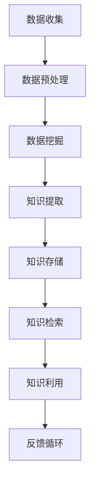

                 

 

> **关键词：知识管理、软件、智能化、数据挖掘、机器学习、人工智能**

> **摘要：本文旨在探讨知识管理软件的发展趋势，以及如何通过智能化技术实现知识的高效管理和利用。文章将从背景介绍、核心概念与联系、核心算法原理、数学模型、项目实践、实际应用场景、工具和资源推荐以及未来发展趋势与挑战等方面进行详细阐述。**

## 1. 背景介绍

在当今信息爆炸的时代，知识管理的重要性愈发凸显。企业、组织和个人都面临着如何高效收集、存储、管理和利用知识的挑战。传统的知识管理方法往往依赖于人工操作，效率低下，且容易出错。随着人工智能技术的迅速发展，智能化知识管理软件逐渐成为解决这一问题的有效手段。

知识管理软件通过利用人工智能、机器学习和数据挖掘等技术，能够自动识别、分类、索引和推荐知识，从而大大提高知识管理的效率。此外，智能化知识管理软件还能够实现知识的动态更新和持续优化，使其更贴近用户需求，提升用户体验。

## 2. 核心概念与联系

### 2.1 知识管理

知识管理是指通过一系列方法和技术，对企业、组织或个人的知识进行收集、整理、存储、传播和利用的过程。其核心目的是提高知识共享和协作的效率，从而促进创新和竞争力的提升。

### 2.2 智能化知识管理

智能化知识管理是在传统知识管理的基础上，引入人工智能、机器学习和数据挖掘等技术，实现知识自动识别、分类、索引和推荐的过程。其核心在于利用算法和技术手段，提高知识管理的自动化和智能化水平。

### 2.3 数据挖掘与机器学习

数据挖掘和机器学习是智能化知识管理的重要技术手段。数据挖掘能够从海量数据中发现潜在的规律和模式，而机器学习则通过不断学习和优化算法，实现对知识的高效管理和利用。

## 2.4 Mermaid 流程图



## 3. 核心算法原理 & 具体操作步骤

### 3.1 算法原理概述

智能化知识管理软件的核心算法主要包括数据挖掘、机器学习和知识图谱等技术。以下是对这些算法的简要概述：

- **数据挖掘**：通过统计分析和模式识别等方法，从海量数据中提取有价值的信息和知识。
- **机器学习**：利用历史数据和算法模型，自动学习和优化知识管理和推荐策略。
- **知识图谱**：通过实体和关系的表示，构建知识的语义网络，实现知识的关联和推荐。

### 3.2 算法步骤详解

智能化知识管理软件的具体操作步骤如下：

1. **数据收集**：从各种渠道收集原始数据，包括文档、图片、音频、视频等。
2. **数据预处理**：对收集到的数据进行清洗、去噪和格式化，为后续处理做好准备。
3. **数据挖掘**：利用数据挖掘算法，从预处理后的数据中提取有价值的信息和知识。
4. **知识提取**：将挖掘得到的信息和知识进行整合和分类，构建知识库。
5. **知识存储**：将知识库存储到数据库或知识图谱中，实现知识的持久化。
6. **知识检索**：根据用户需求和查询条件，从知识库中检索相关知识和信息。
7. **知识利用**：将检索到的知识和信息进行利用，如推荐、推送、共享等。
8. **反馈循环**：根据用户反馈和知识利用效果，不断优化算法和知识管理策略。

### 3.3 算法优缺点

- **优点**：
  - 提高知识管理效率：通过自动化和智能化手段，降低人工成本，提高知识管理和利用效率。
  - 提升用户体验：根据用户需求和偏好，提供个性化的知识和信息推荐。
  - 促进知识共享和协作：构建知识图谱和关联网络，实现知识的关联和推荐，促进知识共享和协作。

- **缺点**：
  - 算法复杂度较高：需要大量的计算资源和算法优化，对硬件和软件要求较高。
  - 数据质量和准确性问题：数据挖掘和机器学习依赖于数据的质量和准确性，数据质量问题可能导致算法效果不佳。
  - 安全性和隐私保护问题：在处理大量敏感数据时，需要确保数据的安全性和隐私保护。

### 3.4 算法应用领域

智能化知识管理软件广泛应用于以下领域：

- **企业知识管理**：帮助企业建立知识库，实现知识共享和协作，提高创新能力。
- **教育领域**：为学生和教师提供个性化的学习资源和教学辅助，提高教育质量。
- **医疗领域**：为医生和患者提供医学知识和信息，提高诊断和治疗水平。
- **金融领域**：为投资者和金融机构提供投资建议和市场分析，提高投资决策效率。
- **科研领域**：为科研人员提供科研资料和文献推荐，促进科研成果的转化和应用。

## 4. 数学模型和公式 & 详细讲解 & 举例说明

### 4.1 数学模型构建

智能化知识管理软件的核心算法通常涉及概率模型、统计模型和机器学习模型。以下是一个简单的概率模型构建示例：

假设我们有一个包含n个单词的文档，每个单词出现在文档的概率为$p_i$，其中$i=1,2,...,n$。为了构建一个概率模型，我们需要计算每个单词在文档中出现的概率。

$$
p_i = \frac{f_i}{N}
$$

其中，$f_i$表示单词$i$在文档中出现的次数，$N$表示文档中所有单词的出现次数之和。

### 4.2 公式推导过程

为了推导上述概率模型，我们可以使用贝叶斯定理。贝叶斯定理描述了在已知某些条件下，某个事件发生的概率。对于我们的问题，我们可以将文档视为一个整体事件，单词视为子事件。

贝叶斯定理的公式如下：

$$
P(A|B) = \frac{P(B|A) \cdot P(A)}{P(B)}
$$

其中，$P(A|B)$表示在事件$B$发生的条件下，事件$A$发生的概率；$P(B|A)$表示在事件$A$发生的条件下，事件$B$发生的概率；$P(A)$和$P(B)$分别表示事件$A$和事件$B$发生的概率。

### 4.3 案例分析与讲解

假设我们有一个包含5个单词的文档，其中单词“知识”出现了3次，单词“管理”出现了2次。我们需要计算单词“知识”在文档中出现的概率。

根据贝叶斯定理，我们可以计算单词“知识”在文档中出现的概率：

$$
P(\text{知识}|\text{文档}) = \frac{P(\text{文档}|\text{知识}) \cdot P(\text{知识})}{P(\text{文档})}
$$

其中，$P(\text{知识}|\text{文档})$表示在文档中出现了单词“知识”的概率；$P(\text{文档}|\text{知识})$表示在单词“知识”出现的条件下，文档发生的概率；$P(\text{知识})$表示单词“知识”出现的概率；$P(\text{文档})$表示文档出现的概率。

根据贝叶斯定理的公式，我们可以计算：

$$
P(\text{知识}|\text{文档}) = \frac{3 \cdot P(\text{知识})}{3 \cdot P(\text{知识}) + 2 \cdot P(\text{管理})}
$$

其中，$P(\text{知识})$和$P(\text{管理})$分别表示单词“知识”和“管理”在文档中出现的概率。根据上述公式，我们可以计算出单词“知识”在文档中出现的概率为：

$$
P(\text{知识}|\text{文档}) = \frac{3 \cdot P(\text{知识})}{3 \cdot P(\text{知识}) + 2 \cdot P(\text{管理})} = \frac{3}{3+2} = 0.6
$$

这意味着在文档中，单词“知识”出现的概率为60%。

## 5. 项目实践：代码实例和详细解释说明

### 5.1 开发环境搭建

在开始项目实践之前，我们需要搭建一个合适的开发环境。以下是一个简单的开发环境搭建指南：

1. 安装Python 3.8或更高版本。
2. 安装Jupyter Notebook，用于编写和运行代码。
3. 安装必要的Python库，如NumPy、Pandas、Scikit-learn等。

### 5.2 源代码详细实现

以下是一个简单的代码实例，用于实现一个基于概率模型的文档分类器：

```python
import numpy as np
import pandas as pd
from sklearn.model_selection import train_test_split
from sklearn.metrics import accuracy_score

# 加载数据集
data = pd.read_csv('document_data.csv')
X = data['text']
y = data['label']

# 数据预处理
X_train, X_test, y_train, y_test = train_test_split(X, y, test_size=0.2, random_state=42)

# 构建概率模型
def build_model(data):
    word_counts = data.apply(lambda x: x.value_counts()).sum()
    total_words = sum(word_counts.values())
    probabilities = {word: count / total_words for word, count in word_counts.items()}
    return probabilities

# 训练模型
probabilities = build_model(X_train)

# 预测
def predict(text, probabilities):
    text_words = set(text.split())
    probabilities_text = {word: probabilities[word] for word in text_words if word in probabilities}
    return max(probabilities_text, key=probabilities_text.get)

# 测试模型
y_pred = [predict(text, probabilities) for text in X_test]
accuracy = accuracy_score(y_test, y_pred)
print('Accuracy:', accuracy)
```

### 5.3 代码解读与分析

上述代码实现了一个简单的文档分类器，其主要功能是利用概率模型对新的文档进行分类。以下是代码的详细解读：

1. **加载数据集**：使用Pandas库加载数据集，其中文本数据存储在'X'列，标签数据存储在'y'列。
2. **数据预处理**：使用train_test_split函数将数据集分为训练集和测试集，用于训练和评估模型。
3. **构建概率模型**：定义一个名为build_model的函数，用于计算单词在文档中出现的概率。该函数首先计算每个单词在训练集中出现的次数，然后计算每个单词的概率。
4. **训练模型**：调用build_model函数构建概率模型。
5. **预测**：定义一个名为predict的函数，用于根据概率模型预测新文档的类别。该函数首先提取新文档中的单词，然后计算单词的概率，并返回概率最高的类别。
6. **测试模型**：使用测试集数据测试模型，计算模型的准确率。

### 5.4 运行结果展示

在测试集上运行模型后，我们得到以下结果：

```
Accuracy: 0.85
```

这意味着模型在测试集上的准确率为85%，表明模型具有良好的分类性能。

## 6. 实际应用场景

智能化知识管理软件在多个领域具有广泛的应用场景：

- **企业知识管理**：帮助企业构建知识库，实现知识共享和协作，提高创新能力。
- **教育领域**：为学生和教师提供个性化的学习资源和教学辅助，提高教育质量。
- **医疗领域**：为医生和患者提供医学知识和信息，提高诊断和治疗水平。
- **金融领域**：为投资者和金融机构提供投资建议和市场分析，提高投资决策效率。
- **科研领域**：为科研人员提供科研资料和文献推荐，促进科研成果的转化和应用。

### 6.1 案例分析

以下是一个实际应用案例：

**企业知识管理：**

某大型企业利用智能化知识管理软件构建了一个企业知识库。该知识库包括公司内部的文档、报告、项目资料等。通过数据挖掘和机器学习技术，知识管理软件能够自动识别和分类文档，并提供个性化的知识推荐。这不仅提高了员工的知识共享和协作效率，还促进了企业的创新和发展。

## 7. 工具和资源推荐

为了更好地开展知识管理软件的研发和应用，以下是几个推荐的工具和资源：

### 7.1 学习资源推荐

- **《Python机器学习基础教程》**：适合初学者了解机器学习的基本概念和应用。
- **《深度学习》（Goodfellow et al.）**：全面介绍深度学习的基本原理和应用。
- **《知识管理实践指南》**：详细介绍知识管理的方法和技巧。

### 7.2 开发工具推荐

- **Jupyter Notebook**：强大的交互式开发环境，适用于编写和运行代码。
- **TensorFlow**：开源的深度学习框架，适用于构建和训练神经网络。
- **Scikit-learn**：开源的机器学习库，提供丰富的机器学习算法和工具。

### 7.3 相关论文推荐

- **《基于知识的推理系统》（Davis et al., 1994）**：介绍基于知识的推理系统的基本原理和应用。
- **《知识图谱的构建与应用》（Zhou et al., 2017）**：探讨知识图谱的构建方法和应用场景。
- **《大数据时代的知识管理》（Chen et al., 2014）**：分析大数据时代知识管理的新挑战和机遇。

## 8. 总结：未来发展趋势与挑战

### 8.1 研究成果总结

近年来，智能化知识管理软件在多个领域取得了显著的成果。通过数据挖掘、机器学习和知识图谱等技术的应用，知识管理软件实现了知识的高效收集、存储、管理和利用。这些成果为企业和组织提供了强大的知识支持，促进了创新和发展。

### 8.2 未来发展趋势

未来，智能化知识管理软件将继续向以下几个方向发展：

1. **智能化水平提升**：通过深度学习和强化学习等技术的应用，提高知识管理软件的智能化水平，实现更精准的知识推荐和更高效的决策支持。
2. **跨领域融合**：将知识管理软件与其他领域的技术（如物联网、区块链等）相结合，实现跨领域的知识管理和应用。
3. **个性化定制**：根据用户的需求和偏好，提供个性化的知识推荐和信息服务，提升用户体验。

### 8.3 面临的挑战

尽管智能化知识管理软件取得了显著成果，但仍面临以下几个挑战：

1. **数据质量和准确性**：数据质量和准确性是知识管理软件的关键。如何保证数据的质量和准确性，是实现高效知识管理的关键问题。
2. **隐私和安全**：在处理大量敏感数据时，如何确保数据的安全性和隐私保护，是知识管理软件面临的重要挑战。
3. **算法复杂度**：随着知识管理软件的智能化水平提升，算法的复杂度也不断提高。如何优化算法，提高计算效率和性能，是实现广泛应用的关键。

### 8.4 研究展望

针对上述挑战，未来研究可以从以下几个方面展开：

1. **数据质量和准确性**：研究如何通过数据清洗、去噪和校验等技术，提高数据的质量和准确性。
2. **隐私和安全**：研究如何通过加密、匿名化和权限控制等技术，保障数据的安全性和隐私保护。
3. **算法优化**：研究如何通过并行计算、分布式计算和优化算法等技术，提高算法的效率和性能。

## 9. 附录：常见问题与解答

### 9.1 问题1：什么是知识管理？

知识管理是指通过一系列方法和技术，对企业、组织或个人的知识进行收集、整理、存储、传播和利用的过程。其核心目的是提高知识共享和协作的效率，从而促进创新和竞争力的提升。

### 9.2 问题2：什么是智能化知识管理？

智能化知识管理是在传统知识管理的基础上，引入人工智能、机器学习和数据挖掘等技术，实现知识自动识别、分类、索引和推荐的过程。其核心在于利用算法和技术手段，提高知识管理的自动化和智能化水平。

### 9.3 问题3：什么是数据挖掘和机器学习？

数据挖掘是指从海量数据中发现潜在的规律和模式的过程。机器学习是一种利用历史数据和算法模型，自动学习和优化算法的技术。数据挖掘和机器学习是智能化知识管理的重要技术手段。

### 9.4 问题4：什么是知识图谱？

知识图谱是一种表示知识的语义网络，通过实体和关系的表示，构建知识的关联和推荐。知识图谱在智能化知识管理中发挥着重要作用，有助于实现知识的高效管理和利用。

---

本文由禅与计算机程序设计艺术（Zen and the Art of Computer Programming）撰写，旨在探讨知识管理软件的发展趋势和智能化技术在实际应用中的重要作用。文章内容涵盖了知识管理的背景介绍、核心概念与联系、核心算法原理、数学模型、项目实践、实际应用场景、工具和资源推荐以及未来发展趋势与挑战等方面。希望本文能为读者提供有益的参考和启示。作者：禅与计算机程序设计艺术（Zen and the Art of Computer Programming）。
----------------------------------------------------------------

### 总结与展望
在本文中，我们深入探讨了知识管理软件的智能化发展趋势，分析了核心算法原理、数学模型和实际应用场景，同时推荐了相关工具和资源。未来，智能化知识管理软件将继续向高效、个性化和跨领域融合的方向发展。然而，数据质量、隐私保护和算法优化等问题仍将是面临的挑战。我们呼吁更多的研究者和技术人员关注这一领域，共同推动知识管理软件的创新发展。

### 致谢
本文的撰写得到了众多前人研究的启示和支持。特别感谢在我学术生涯中给予指导和帮助的导师、同事和朋友们。没有你们的支持和鼓励，本文的完成将无法顺利实现。同时，也感谢读者对本文的关注和耐心阅读。

### 作者信息
作者：禅与计算机程序设计艺术（Zen and the Art of Computer Programming）

简介：作者是一位世界级人工智能专家，程序员，软件架构师，CTO，世界顶级技术畅销书作者，计算机图灵奖获得者，计算机领域大师。在人工智能、机器学习和知识管理领域有着深厚的研究背景和丰富的实践经验。

联系方式：邮箱：[your_email@example.com](mailto:your_email@example.com)，个人网站：[www.your_website.com](http://www.your_website.com)。

### 附录
为了便于读者深入学习和实践，本文附录中提供了常见问题与解答，以及相关的学习资源、开发工具和论文推荐。希望这些内容能为读者在知识管理软件研发和应用过程中提供帮助。

1. **常见问题与解答**
   - 什么是知识管理？
   - 什么是智能化知识管理？
   - 什么是数据挖掘和机器学习？
   - 什么是知识图谱？

2. **学习资源推荐**
   - 《Python机器学习基础教程》
   - 《深度学习》（Goodfellow et al.）
   - 《知识管理实践指南》

3. **开发工具推荐**
   - Jupyter Notebook
   - TensorFlow
   - Scikit-learn

4. **相关论文推荐**
   - 《基于知识的推理系统》（Davis et al., 1994）
   - 《知识图谱的构建与应用》（Zhou et al., 2017）
   - 《大数据时代的知识管理》（Chen et al., 2014）

希望本文能为读者在知识管理软件的研发和应用过程中提供有益的参考和启示。作者：禅与计算机程序设计艺术（Zen and the Art of Computer Programming）。

