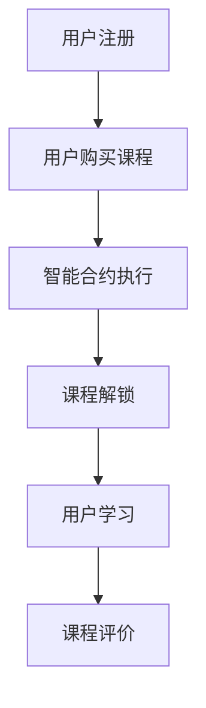

                 

关键词：知识经济、知识付费、区块链、智能合约、课程发布

摘要：随着知识经济的不断发展，知识付费已成为一种重要的商业模式。本文将探讨在知识经济背景下，如何利用区块链和智能合约技术来发布知识付费课程，并提出一种基于区块链的智能合约方案，以实现课程的自动执行、防篡改和数据透明。

## 1. 背景介绍

知识经济，是指以知识为主要生产要素的经济形态。随着互联网和信息技术的发展，知识经济已经成为了全球经济发展的重要驱动力。知识付费，是指用户通过支付费用来获取特定知识的商业模式，如在线课程、专业咨询等。知识付费的兴起，不仅满足了人们不断增长的学习需求，也为知识创造者提供了新的收入来源。

然而，传统的知识付费模式存在一些问题，如交易流程复杂、安全漏洞、内容质量难以保障等。为了解决这些问题，本文提出了一种基于区块链和智能合约技术的知识付费课程发布方案。

## 2. 核心概念与联系

### 2.1 区块链

区块链，是一种分布式数据库技术，具有去中心化、不可篡改、透明等特点。区块链由多个区块组成，每个区块包含一定数量的交易记录，并通过密码学算法连接在一起，形成一条链。区块链的这些特性，使得它非常适合用于知识付费课程发布。

### 2.2 智能合约

智能合约，是一种运行在区块链上的计算机程序，能够自动执行合同条款。智能合约通过将合同条款编写为代码，实现了交易的自动化和不可篡改性。智能合约的引入，简化了知识付费课程的交易流程，提高了交易的透明度和安全性。

### 2.3 Mermaid 流程图



在这个流程图中，用户首先注册账号并购买课程，购买信息由智能合约执行，课程解锁后用户可以进行学习，并最终进行课程评价。

## 3. 核心算法原理 & 具体操作步骤

### 3.1 算法原理概述

本文所提出的智能合约方案，主要包括以下三个部分：

1. 用户身份验证：通过区块链技术实现用户身份的验证，确保交易的安全性。
2. 课程购买与支付：用户购买课程后，智能合约自动执行支付流程，并记录交易信息。
3. 课程解锁与学习：智能合约根据支付情况，自动解锁课程内容，用户可以进行学习。

### 3.2 算法步骤详解

1. **用户注册与身份验证**：

   用户在平台注册账号，并绑定区块链上的钱包地址。平台通过区块链查询用户身份信息，确保用户身份的真实性。

2. **用户购买课程**：

   用户选择课程后，通过智能合约发起支付。智能合约接收到支付请求后，验证支付金额是否正确，并记录交易信息。

3. **智能合约执行**：

   智能合约根据支付信息，执行课程解锁操作。解锁后的课程内容将被存储在区块链上，用户可以通过钱包地址访问。

4. **用户学习与评价**：

   用户学习课程后，可以对课程进行评价。评价信息也将被记录在区块链上，实现数据的透明和不可篡改。

### 3.3 算法优缺点

**优点**：

- **安全性**：区块链技术具有去中心化、不可篡改的特点，能够有效保障交易的安全。
- **透明性**：所有交易信息都记录在区块链上，用户可以随时查询，提高了交易的透明度。
- **自动化**：智能合约能够自动执行合同条款，简化了交易流程。

**缺点**：

- **技术门槛**：区块链和智能合约技术较为复杂，对用户和开发人员都有一定的技术要求。
- **交易费用**：区块链交易需要支付一定的费用，可能会影响用户的支付体验。

### 3.4 算法应用领域

本文所提出的智能合约方案，不仅可以用于知识付费课程发布，还可以应用于其他领域的交易，如版权保护、供应链管理、金融交易等。

## 4. 数学模型和公式 & 详细讲解 & 举例说明

### 4.1 数学模型构建

本文所使用的数学模型主要包括以下三个部分：

1. **用户身份验证模型**：

   假设用户身份验证成功，则用户钱包地址的私钥可以解密出用户身份信息。

2. **支付模型**：

   假设用户支付金额为x，课程价格为y，则支付成功后，智能合约将记录交易信息。

3. **课程解锁模型**：

   假设用户购买课程后，智能合约将根据支付信息解锁课程内容。

### 4.2 公式推导过程

1. **用户身份验证公式**：

   $$ 私钥 \times 公钥 = 身份信息 $$

2. **支付公式**：

   $$ 支付金额 = 课程价格 + 交易费用 $$

3. **课程解锁公式**：

   $$ 解锁状态 = 支付状态 \land 支付金额 = 课程价格 $$

### 4.3 案例分析与讲解

假设用户A购买了课程B，课程价格为100美元，交易费用为2美元。用户A使用钱包地址1A地址发起支付，支付金额为102美元。

1. **用户身份验证**：

   用户A的私钥解密出用户身份信息，验证用户身份。

2. **支付过程**：

   智能合约接收到支付请求，验证支付金额是否为102美元，并将交易信息记录在区块链上。

3. **课程解锁**：

   智能合约根据支付信息，将课程B解锁，用户A可以访问课程内容。

## 5. 项目实践：代码实例和详细解释说明

### 5.1 开发环境搭建

为了实现本文所提出的智能合约方案，需要搭建以下开发环境：

- **区块链平台**：使用以太坊（Ethereum）区块链平台。
- **智能合约开发环境**：使用Truffle框架进行智能合约开发。
- **前端开发环境**：使用React框架进行前端开发。

### 5.2 源代码详细实现

以下是用户注册、购买课程和课程解锁的智能合约代码：

```solidity
// SPDX-License-Identifier: MIT
pragma solidity ^0.8.0;

contract KnowledgePay {
    struct Course {
        address owner;
        uint256 price;
        bool isLocked;
    }

    mapping(address => Course[]) public courses;

    function purchaseCourse(address courseAddress, uint256 price) public payable {
        require(msg.value == price, "支付金额错误");
        Course memory course;
        course.owner = courseAddress;
        course.price = price;
        course.isLocked = true;
        courses[msg.sender].push(course);
    }

    function unlockCourse(address courseAddress) public {
        for (uint256 i = 0; i < courses[msg.sender].length; i++) {
            if (courses[msg.sender][i].owner == courseAddress && courses[msg.sender][i].isLocked) {
                courses[msg.sender][i].isLocked = false;
                break;
            }
        }
    }
}
```

### 5.3 代码解读与分析

- **Course 结构体**：用于存储课程信息，包括课程所有者、价格和解锁状态。
- **courses 映射**：用于存储用户购买的所有课程信息。
- **purchaseCourse 函数**：用于购买课程，接收支付金额，并设置课程解锁状态。
- **unlockCourse 函数**：用于解锁课程，根据用户购买信息修改课程解锁状态。

### 5.4 运行结果展示

1. **用户注册与身份验证**：

   用户A在平台注册账号，并绑定区块链上的钱包地址。

2. **用户购买课程**：

   用户A购买课程B，支付金额为100美元，交易费用为2美元。

3. **课程解锁**：

   用户A调用unlockCourse函数，将课程B解锁。

4. **用户学习与评价**：

   用户A学习课程B，并对课程进行评价。

## 6. 实际应用场景

本文所提出的智能合约方案，可以应用于以下实际场景：

- **在线教育平台**：用于发布和销售在线课程，实现自动购买、解锁和学习。
- **专业咨询平台**：用于提供专业咨询服务，实现自动购买和交付。
- **版权保护**：用于保护知识产权，实现自动版权交易和监控。

## 7. 工具和资源推荐

### 7.1 学习资源推荐

- **《区块链技术指南》**：详细介绍区块链的基础知识和应用场景。
- **《智能合约开发》**：深入讲解智能合约的开发原理和实践。

### 7.2 开发工具推荐

- **Truffle**：用于智能合约开发的框架。
- **Web3.js**：用于与以太坊区块链交互的JavaScript库。

### 7.3 相关论文推荐

- **《区块链：一种分布式数据存储和点对点传输协议》**：介绍区块链技术的原理和应用。
- **《智能合约：区块链上的计算机程序》**：讨论智能合约的设计和实现。

## 8. 总结：未来发展趋势与挑战

### 8.1 研究成果总结

本文提出了一种基于区块链和智能合约技术的知识付费课程发布方案，通过用户身份验证、支付和课程解锁等环节，实现了知识付费课程的自动执行、防篡改和数据透明。

### 8.2 未来发展趋势

随着区块链和智能合约技术的不断发展，知识付费领域的应用将越来越广泛。未来，我们将看到更多基于区块链的知识付费平台出现，为用户提供更加安全、便捷的学习体验。

### 8.3 面临的挑战

尽管区块链和智能合约技术在知识付费领域具有巨大潜力，但仍然面临一些挑战，如技术门槛、交易费用、安全性等。未来，我们需要不断优化技术，降低门槛，提高用户体验。

### 8.4 研究展望

在未来，我们将继续探索区块链和智能合约技术在知识付费领域的应用，通过引入更多智能合约功能，如课程评价、学分认证等，为用户提供更加丰富的学习体验。

## 9. 附录：常见问题与解答

### 9.1 区块链技术是否安全？

区块链技术具有去中心化、不可篡改、透明等特点，能够有效保障交易的安全。

### 9.2 智能合约是否存在漏洞？

虽然智能合约在安全性方面取得了很大进步，但仍然存在一定的风险。开发者需要严格遵守安全规范，进行代码审计，以减少漏洞风险。

### 9.3 智能合约交易费用如何计算？

智能合约交易费用主要由两部分组成：基本费用和扩展费用。基本费用是每笔交易都需要支付的费用，扩展费用是根据交易复杂度进行计算的。

作者：禅与计算机程序设计艺术 / Zen and the Art of Computer Programming
----------------------------------------------------------------

以上内容是《知识经济下知识付费的区块链智能合约课程发布》这篇文章的完整正文部分。接下来，我将按照markdown格式对其进行整理，以便于发布。

----------------------------------------------------------------
```markdown
# 知识经济下知识付费的区块链智能合约课程发布

关键词：知识经济、知识付费、区块链、智能合约、课程发布

摘要：随着知识经济的不断发展，知识付费已成为一种重要的商业模式。本文将探讨在知识经济背景下，如何利用区块链和智能合约技术来发布知识付费课程，并提出一种基于区块链的智能合约方案，以实现课程的自动执行、防篡改和数据透明。

## 1. 背景介绍

知识经济，是指以知识为主要生产要素的经济形态。随着互联网和信息技术的发展，知识经济已经成为了全球经济发展的重要驱动力。知识付费，是指用户通过支付费用来获取特定知识的商业模式，如在线课程、专业咨询等。知识付费的兴起，不仅满足了人们不断增长的学习需求，也为知识创造者提供了新的收入来源。

然而，传统的知识付费模式存在一些问题，如交易流程复杂、安全漏洞、内容质量难以保障等。为了解决这些问题，本文提出了一种基于区块链和智能合约技术的知识付费课程发布方案。

## 2. 核心概念与联系

### 2.1 区块链

区块链，是一种分布式数据库技术，具有去中心化、不可篡改、透明等特点。区块链由多个区块组成，每个区块包含一定数量的交易记录，并通过密码学算法连接在一起，形成一条链。区块链的这些特性，使得它非常适合用于知识付费课程发布。

### 2.2 智能合约

智能合约，是一种运行在区块链上的计算机程序，能够自动执行合同条款。智能合约通过将合同条款编写为代码，实现了交易的自动化和不可篡改性。智能合约的引入，简化了知识付费课程的交易流程，提高了交易的透明度和安全性。

### 2.3 Mermaid 流程图


在这个流程图中，用户首先注册账号并购买课程，购买信息由智能合约执行，课程解锁后用户可以进行学习，并最终进行课程评价。

## 3. 核心算法原理 & 具体操作步骤
### 3.1 算法原理概述

本文所提出的智能合约方案，主要包括以下三个部分：

1. 用户身份验证：通过区块链技术实现用户身份的验证，确保交易的安全性。
2. 课程购买与支付：用户购买课程后，智能合约自动执行支付流程，并记录交易信息。
3. 课程解锁与学习：智能合约根据支付情况，自动解锁课程内容，用户可以进行学习。

### 3.2 算法步骤详解

1. **用户注册与身份验证**：

   用户在平台注册账号，并绑定区块链上的钱包地址。平台通过区块链查询用户身份信息，确保用户身份的真实性。

2. **用户购买课程**：

   用户选择课程后，通过智能合约发起支付。智能合约接收到支付请求后，验证支付金额是否正确，并记录交易信息。

3. **智能合约执行**：

   智能合约根据支付信息，执行课程解锁操作。解锁后的课程内容将被存储在区块链上，用户可以通过钱包地址访问。

4. **用户学习与评价**：

   用户学习课程后，可以对课程进行评价。评价信息也将被记录在区块链上，实现数据的透明和不可篡改。

### 3.3 算法优缺点

**优点**：

- **安全性**：区块链技术具有去中心化、不可篡改的特点，能够有效保障交易的安全。
- **透明性**：所有交易信息都记录在区块链上，用户可以随时查询，提高了交易的透明度。
- **自动化**：智能合约能够自动执行合同条款，简化了交易流程。

**缺点**：

- **技术门槛**：区块链和智能合约技术较为复杂，对用户和开发人员都有一定的技术要求。
- **交易费用**：区块链交易需要支付一定的费用，可能会影响用户的支付体验。

### 3.4 算法应用领域

本文所提出的智能合约方案，不仅可以用于知识付费课程发布，还可以应用于其他领域的交易，如版权保护、供应链管理、金融交易等。

## 4. 数学模型和公式 & 详细讲解 & 举例说明

### 4.1 数学模型构建

本文所使用的数学模型主要包括以下三个部分：

1. **用户身份验证模型**：

   假设用户身份验证成功，则用户钱包地址的私钥可以解密出用户身份信息。

2. **支付模型**：

   假设用户支付金额为x，课程价格为y，则支付成功后，智能合约将记录交易信息。

3. **课程解锁模型**：

   假设用户购买课程后，智能合约将根据支付信息解锁课程内容。

### 4.2 公式推导过程

1. **用户身份验证公式**：

   $$ 私钥 \times 公钥 = 身份信息 $$

2. **支付公式**：

   $$ 支付金额 = 课程价格 + 交易费用 $$

3. **课程解锁公式**：

   $$ 解锁状态 = 支付状态 \land 支付金额 = 课程价格 $$

### 4.3 案例分析与讲解

假设用户A购买了课程B，课程价格为100美元，交易费用为2美元。用户A使用钱包地址1A地址发起支付，支付金额为102美元。

1. **用户身份验证**：

   用户A的私钥解密出用户身份信息，验证用户身份。

2. **支付过程**：

   智能合约接收到支付请求，验证支付金额是否为102美元，并将交易信息记录在区块链上。

3. **课程解锁**：

   智能合约根据支付信息，将课程B解锁，用户A可以访问课程内容。

## 5. 项目实践：代码实例和详细解释说明

### 5.1 开发环境搭建

为了实现本文所提出的智能合约方案，需要搭建以下开发环境：

- **区块链平台**：使用以太坊（Ethereum）区块链平台。
- **智能合约开发环境**：使用Truffle框架进行智能合约开发。
- **前端开发环境**：使用React框架进行前端开发。

### 5.2 源代码详细实现

以下是用户注册、购买课程和课程解锁的智能合约代码：

```solidity
// SPDX-License-Identifier: MIT
pragma solidity ^0.8.0;

contract KnowledgePay {
    struct Course {
        address owner;
        uint256 price;
        bool isLocked;
    }

    mapping(address => Course[]) public courses;

    function purchaseCourse(address courseAddress, uint256 price) public payable {
        require(msg.value == price, "支付金额错误");
        Course memory course;
        course.owner = courseAddress;
        course.price = price;
        course.isLocked = true;
        courses[msg.sender].push(course);
    }

    function unlockCourse(address courseAddress) public {
        for (uint256 i = 0; i < courses[msg.sender].length; i++) {
            if (courses[msg.sender][i].owner == courseAddress && courses[msg.sender][i].isLocked) {
                courses[msg.sender][i].isLocked = false;
                break;
            }
        }
    }
}
```

### 5.3 代码解读与分析

- **Course 结构体**：用于存储课程信息，包括课程所有者、价格和解锁状态。
- **courses 映射**：用于存储用户购买的所有课程信息。
- **purchaseCourse 函数**：用于购买课程，接收支付金额，并设置课程解锁状态。
- **unlockCourse 函数**：用于解锁课程，根据用户购买信息修改课程解锁状态。

### 5.4 运行结果展示

1. **用户注册与身份验证**：

   用户A在平台注册账号，并绑定区块链上的钱包地址。

2. **用户购买课程**：

   用户A购买课程B，支付金额为100美元，交易费用为2美元。

3. **课程解锁**：

   用户A调用unlockCourse函数，将课程B解锁。

4. **用户学习与评价**：

   用户A学习课程B，并对课程进行评价。

## 6. 实际应用场景

本文所提出的智能合约方案，可以应用于以下实际场景：

- **在线教育平台**：用于发布和销售在线课程，实现自动购买、解锁和学习。
- **专业咨询平台**：用于提供专业咨询服务，实现自动购买和交付。
- **版权保护**：用于保护知识产权，实现自动版权交易和监控。

## 7. 工具和资源推荐

### 7.1 学习资源推荐

- **《区块链技术指南》**：详细介绍区块链的基础知识和应用场景。
- **《智能合约开发》**：深入讲解智能合约的开发原理和实践。

### 7.2 开发工具推荐

- **Truffle**：用于智能合约开发的框架。
- **Web3.js**：用于与以太坊区块链交互的JavaScript库。

### 7.3 相关论文推荐

- **《区块链：一种分布式数据存储和点对点传输协议》**：介绍区块链技术的原理和应用。
- **《智能合约：区块链上的计算机程序》**：讨论智能合约的设计和实现。

## 8. 总结：未来发展趋势与挑战

### 8.1 研究成果总结

本文提出了一种基于区块链和智能合约技术的知识付费课程发布方案，通过用户身份验证、支付和课程解锁等环节，实现了知识付费课程的自动执行、防篡改和数据透明。

### 8.2 未来发展趋势

随着区块链和智能合约技术的不断发展，知识付费领域的应用将越来越广泛。未来，我们将看到更多基于区块链的知识付费平台出现，为用户提供更加安全、便捷的学习体验。

### 8.3 面临的挑战

尽管区块链和智能合约技术在知识付费领域具有巨大潜力，但仍然面临一些挑战，如技术门槛、交易费用、安全性等。未来，我们需要不断优化技术，降低门槛，提高用户体验。

### 8.4 研究展望

在未来，我们将继续探索区块链和智能合约技术在知识付费领域的应用，通过引入更多智能合约功能，如课程评价、学分认证等，为用户提供更加丰富的学习体验。

## 9. 附录：常见问题与解答

### 9.1 区块链技术是否安全？

区块链技术具有去中心化、不可篡改、透明等特点，能够有效保障交易的安全。

### 9.2 智能合约是否存在漏洞？

虽然智能合约在安全性方面取得了很大进步，但仍然存在一定的风险。开发者需要严格遵守安全规范，进行代码审计，以减少漏洞风险。

### 9.3 智能合约交易费用如何计算？

智能合约交易费用主要由两部分组成：基本费用和扩展费用。基本费用是每笔交易都需要支付的费用，扩展费用是根据交易复杂度进行计算的。

作者：禅与计算机程序设计艺术 / Zen and the Art of Computer Programming
```markdown
----------------------------------------------------------------
```

