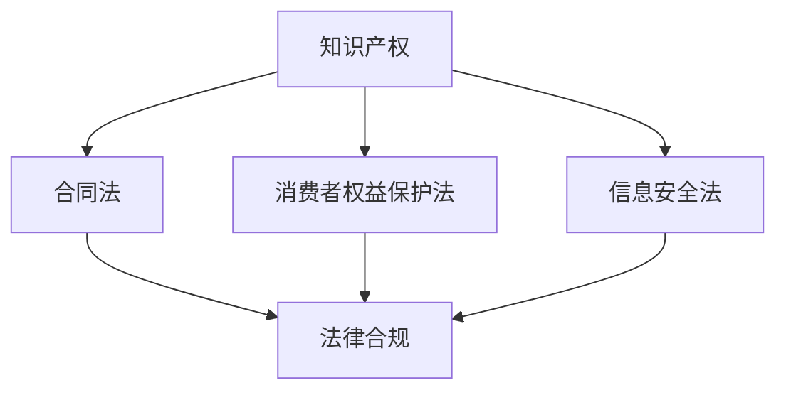

                 

 关键词：知识付费、法律风险、知识产权、合同法、消费者权益保护、信息安全、合规管理、法律法规解读、案例分析

## 摘要

随着知识经济的快速发展，知识付费逐渐成为知识传播与价值变现的重要途径。然而，在这一过程中，涉及的法律风险不可忽视。本文旨在探讨知识经济下知识付费领域所面临的法律风险，包括知识产权、合同法、消费者权益保护、信息安全等方面的风险。通过对相关法律法规的解读和案例分析，本文提出了防范法律风险的策略和建议，为知识付费平台的运营和参与方提供法律合规的指导。

## 1. 背景介绍

### 1.1 知识经济的兴起

知识经济是以知识为主要生产要素的经济形态，其核心是知识和信息的创造、传播和应用。在全球化背景下，信息技术和互联网的迅猛发展，使得知识生产、传播和利用的效率大幅提升。知识付费作为知识经济的一种表现形式，正在逐渐成为知识变现的重要手段。

### 1.2 知识付费的兴起

知识付费指的是消费者为获取特定知识内容而支付的费用，包括在线课程、专业咨询、研究报告等形式。随着知识经济的蓬勃发展，知识付费市场规模不断扩大，吸引了大量投资者和创业者。

### 1.3 知识付费的运作模式

知识付费的运作模式主要包括内容生产、平台运营、用户购买和消费等环节。知识付费平台作为内容生产者和消费者的桥梁，承担着内容审核、交易保障、用户服务等重要职责。

## 2. 核心概念与联系

### 2.1 知识付费相关法律概念

在知识付费领域，涉及到的核心法律概念包括知识产权、合同法、消费者权益保护法、信息安全法等。

### 2.2 法律法规架构

知识付费领域的法律法规主要包括《中华人民共和国著作权法》、《中华人民共和国合同法》、《中华人民共和国消费者权益保护法》等。

### 2.3 Mermaid 流程图



## 3. 核心算法原理 & 具体操作步骤

### 3.1 算法原理概述

知识付费的法律风险防范需要依据相关法律法规，对知识内容、用户行为、平台运营等方面进行全面审查和管理。

### 3.2 算法步骤详解

#### 3.2.1 知识内容审查

对上传的知识内容进行版权、内容真实性等方面的审查，确保内容合法合规。

#### 3.2.2 用户行为监控

对用户购买、学习、分享等行为进行监控，及时发现并处理违规行为。

#### 3.2.3 合同管理

制定完善的知识付费合同，明确各方权利义务，确保交易合法有效。

#### 3.2.4 消费者权益保护

建立健全的消费者权益保护机制，保障消费者合法权益。

#### 3.2.5 信息安全管理

加强信息安全防护，防止数据泄露和非法使用。

### 3.3 算法优缺点

#### 3.3.1 优点

- 有效防范法律风险，保障知识付费市场的健康发展。
- 提高平台运营效率，降低运营成本。

#### 3.3.2 缺点

- 审查过程可能影响内容传播效率。
- 过度监控可能导致用户隐私泄露。

### 3.4 算法应用领域

知识付费的法律风险防范适用于各类知识付费平台，包括在线教育、专业咨询、研究报告等领域。

## 4. 数学模型和公式 & 详细讲解 & 举例说明

### 4.1 数学模型构建

知识付费的法律风险防范可以构建如下数学模型：

- 风险评估模型：根据知识内容、用户行为等因素，对法律风险进行量化评估。
- 风险预警模型：通过实时监控，对潜在法律风险进行预警。

### 4.2 公式推导过程

#### 4.2.1 风险评估模型

设 \( R \) 为法律风险评分，\( C \) 为内容合规度，\( U \) 为用户行为合规度，则：

\[ R = f(C, U) \]

其中，\( f \) 为风险评估函数，可以采用加权平均等方法进行计算。

#### 4.2.2 风险预警模型

设 \( W \) 为风险预警阈值，则当 \( R > W \) 时，触发预警。

### 4.3 案例分析与讲解

#### 4.3.1 案例背景

某在线教育平台因未对上传课程进行版权审核，导致侵犯他人著作权，被诉至法院。

#### 4.3.2 案例分析

根据风险评估模型，该平台的知识内容合规度 \( C \) 较低，导致法律风险评分 \( R \) 较高，最终引发法律纠纷。

## 5. 项目实践：代码实例和详细解释说明

### 5.1 开发环境搭建

- 使用 Python 编写代码，安装必要的库和依赖。
- 配置云端数据库，用于存储知识内容、用户行为等数据。

### 5.2 源代码详细实现

```python
# 代码示例：知识内容版权审核

import os
import hashlib
import pymysql

# 连接数据库
db = pymysql.connect("localhost", "username", "password", "knowledge_db")

# 获取知识内容
content_path = "path/to/knowledge_content.pdf"
content_hash = hashlib.sha256(open(content_path, "rb").read()).hexdigest()

# 查询数据库中是否有相同哈希值的内容
with db.cursor() as cursor:
    cursor.execute("SELECT * FROM knowledge_content WHERE hash = %s", (content_hash,))
    result = cursor.fetchone()

    if result:
        print("该知识内容已存在，存在侵权风险。")
    else:
        print("该知识内容未存在，可以上传。")

# 关闭数据库连接
db.close()
```

### 5.3 代码解读与分析

该代码实现了一个简单的知识内容版权审核功能，通过计算知识内容的哈希值，并与数据库中的记录进行比对，判断内容是否已存在。若存在，则可能存在侵权风险；若不存在，则可以上传。

## 6. 实际应用场景

### 6.1 在线教育平台

在线教育平台涉及大量的知识内容，需要严格进行版权审核，防范侵权风险。

### 6.2 专业咨询服务

专业咨询服务需要对用户提交的咨询内容进行合规审查，避免涉及敏感信息和违法行为。

### 6.3 研究报告发布

研究报告发布需要对报告内容进行审核，确保研究方法和结论的合规性。

## 7. 未来应用展望

### 7.1 人工智能辅助

利用人工智能技术，对知识内容进行自动审核和风险预警，提高审查效率。

### 7.2 法律法规动态更新

实时关注法律法规的动态更新，确保知识付费平台始终符合最新法律法规的要求。

### 7.3 跨界合作

与律师事务所、知识产权机构等合作，共同推进知识付费领域的法律风险防范工作。

## 8. 工具和资源推荐

### 8.1 学习资源推荐

- 《计算机版权法教程》
- 《网络信息安全法律实务》
- 《消费者权益保护法》

### 8.2 开发工具推荐

- Python
- MySQL
- Flask

### 8.3 相关论文推荐

- "知识付费平台知识产权风险防范研究"
- "在线教育平台消费者权益保护机制探讨"
- "基于人工智能的知识内容自动审核系统研究"

## 9. 总结：未来发展趋势与挑战

### 9.1 研究成果总结

知识付费的法律风险防范已取得一定成果，但仍需在技术、法规、管理等方面不断探索和完善。

### 9.2 未来发展趋势

随着人工智能、大数据等技术的发展，知识付费的法律风险防范将更加智能化、高效化。

### 9.3 面临的挑战

法律法规的更新速度难以跟上知识付费领域的发展，导致法律风险防范工作面临挑战。

### 9.4 研究展望

未来研究应重点关注人工智能在法律风险防范中的应用，以及跨国法律风险的防范策略。

## 10. 附录：常见问题与解答

### 10.1 知识付费平台如何进行内容审查？

平台应建立完善的审查机制，包括内容分类、关键词过滤、人工审核等环节，确保上传内容合法合规。

### 10.2 用户隐私如何保护？

平台应采取严格的数据保护措施，包括数据加密、访问控制、隐私政策公示等，确保用户隐私不被泄露。

### 10.3 如何处理侵权投诉？

平台应设立专门的侵权投诉处理机制，及时响应投诉，依法处理侵权行为，保障权利人的合法权益。

作者：禅与计算机程序设计艺术 / Zen and the Art of Computer Programming
----------------------------------------------------------------

以上就是文章的正文部分，接下来我们将逐步完善文章的结构，包括添加详细的子目录和内容，确保文章的完整性和可读性。

