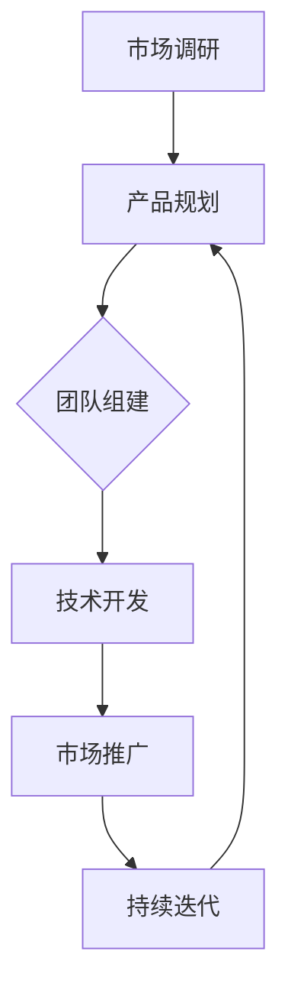

                 

## 摘要 Summary

在知识经济的时代，程序员不再仅仅是一个编程的职业，而是一种拥有创造力和专业技能的人才。随着技术的飞速发展，创业环境变得日益开放，程序员转型为创业者成为可能。本文旨在探讨知识经济背景下，程序员如何通过创业实现个人价值和社会贡献。文章将从以下几个方面展开：

1. **背景介绍**：回顾知识经济的发展历程，分析程序员在知识经济中的角色和地位。
2. **核心概念与联系**：探讨程序员创业所需的关键能力和资源，并使用Mermaid流程图展示创业的核心流程。
3. **核心算法原理与具体操作步骤**：介绍程序员在创业过程中可以应用的算法原理，并提供具体的操作步骤。
4. **数学模型和公式**：讨论创业中可能涉及到的数学模型和公式，并进行详细的讲解和举例。
5. **项目实践**：通过代码实例详细解释程序员创业中常见的技术问题和解决方案。
6. **实际应用场景**：探讨程序员创业在不同行业中的应用，并展望未来的发展趋势。
7. **工具和资源推荐**：推荐学习资源和开发工具，以及相关的论文。
8. **总结**：总结研究成果，分析未来发展趋势和挑战，提出研究展望。

本文将结合理论与实践，帮助程序员更好地理解创业之路，找到适合自己的发展路径。

## 1. 背景介绍 Background

知识经济的兴起改变了传统经济的运作方式，知识成为推动经济发展的核心动力。程序员作为知识经济的产物，其重要性日益凸显。程序员不仅需要掌握编程技能，还需要具备解决复杂问题的能力和创新精神。随着互联网、云计算、大数据等技术的快速发展，程序员的工作领域不断扩大，从传统的软件行业延伸到金融、医疗、教育等多个领域。

### 程序员在知识经济中的角色和地位

在知识经济时代，程序员的角色和地位发生了显著变化。首先，程序员不再是简单的代码编写者，而是成为企业和组织的核心技术人员。他们在软件开发、系统架构设计、技术创新等方面发挥着关键作用。其次，程序员成为知识传播和创新的重要载体。通过不断学习和实践，程序员能够将前沿技术引入到各个行业中，推动整个社会的技术进步。

### 创业环境的变迁

创业环境的变迁为程序员提供了更多的机会。首先，互联网的普及使得创业者可以更加便捷地获取资源和信息，降低了创业的门槛。其次，云计算和大数据技术的发展为创业者提供了强大的技术支持，使得创业者在短时间内能够搭建起高效的技术平台。此外，创业孵化器和加速器的兴起，为创业者提供了资金、市场资源、人才等多方面的支持，进一步降低了创业的风险。

### 程序员创业的优势和挑战

程序员创业具有明显的优势。首先，程序员具备较强的技术能力和解决问题的能力，这为创业提供了坚实的基础。其次，程序员往往具有较强的学习能力和创新精神，能够快速适应市场变化。此外，程序员在创业过程中可以充分发挥自己的专业优势，实现个人价值和社会贡献。

然而，程序员创业也面临着一定的挑战。首先，创业过程中需要面对激烈的市场竞争，需要不断创新以保持竞争力。其次，程序员需要具备一定的管理和商业能力，这对于很多技术出身的创业者来说是一个挑战。此外，创业过程中的资金、团队、市场等方面的风险也需要程序员具备良好的应对策略。

### 结论

知识经济的快速发展为程序员提供了广阔的发展空间，创业成为程序员实现个人价值和社会贡献的重要途径。然而，程序员在创业过程中也需要面对各种挑战，需要不断提升自己的综合能力。本文接下来将深入探讨程序员创业所需的核心概念和具体操作步骤，帮助程序员更好地理解创业之路。

## 2. 核心概念与联系 Core Concepts and Connections

在知识经济下，程序员的创业之路需要理解一系列核心概念和流程，这些概念和流程构成了程序员创业成功的关键。以下将详细探讨这些核心概念，并通过Mermaid流程图展示创业的核心流程，以便读者能够更直观地理解。

### 2.1 程序员创业的关键能力

程序员创业所需的关键能力包括但不限于以下几点：

- **技术能力**：程序员应具备扎实的技术基础，包括编程语言、算法和数据结构等。这不仅能确保创业项目的技术可行性，还能提高项目的开发效率。
  
- **产品思维**：程序员需要从用户需求出发，设计出具有市场竞争力的高质量产品。产品思维强调用户体验、功能优化和市场调研。

- **商业知识**：尽管程序员具备技术优势，但商业知识同样重要。这包括财务规划、市场营销、团队管理等方面的知识，这些都是确保创业成功的基础。

- **创新能力**：在快速变化的市场中，创新能力是程序员创业的核心竞争力。这要求程序员不仅能够解决现有问题，还能够预见并解决未来可能出现的问题。

### 2.2 程序员创业的核心流程

程序员创业的核心流程可以概括为以下几个阶段：

1. **市场调研**：通过市场调研，了解用户需求、竞争状况和市场规模，为创业项目提供明确的方向。

2. **产品规划**：根据市场调研结果，制定产品规划和开发计划，包括功能设计、技术选型等。

3. **团队组建**：组建一支具有互补技能的团队，包括技术、设计、市场等各方面的专业人员。

4. **技术开发**：按照产品规划和开发计划，进行技术开发，实现产品的核心功能。

5. **市场推广**：通过有效的市场推广策略，将产品推向市场，吸引目标用户。

6. **持续迭代**：根据市场反馈，不断优化产品功能，提升用户体验，确保产品在市场上的竞争力。

### 2.3 Mermaid流程图展示

以下是一个简化的Mermaid流程图，展示了程序员创业的核心流程：



在这个流程图中：

- **市场调研**（A）是创业的起点，决定了创业项目的方向。
- **产品规划**（B）基于市场调研结果，确定了产品的功能和技术路线。
- **团队组建**（C）是确保项目顺利推进的重要步骤。
- **技术开发**（D）是实现产品功能的关键阶段。
- **市场推广**（E）是将产品推向用户的关键步骤。
- **持续迭代**（F）是保持产品竞争力的核心策略。

### 2.4 创业过程中的核心问题

在创业过程中，程序员还需要关注以下核心问题：

- **风险管理**：包括资金风险、市场风险、技术风险等。程序员需要制定合理的风险控制策略，确保创业项目的稳定性。
- **时间管理**：合理规划时间，确保项目进度和质量。
- **团队协作**：有效沟通和协作，提高团队效率和执行力。

### 结论

理解程序员创业所需的核心概念和流程，是程序员成功创业的关键。通过上述分析和Mermaid流程图的展示，读者可以更清晰地看到创业的各个环节和关键问题。接下来，本文将深入探讨程序员在创业过程中可以应用的核心算法原理和具体操作步骤，帮助读者更好地掌握创业的核心技术。

## 3. 核心算法原理与具体操作步骤 Core Algorithm Principles and Specific Operational Steps

在程序员创业的过程中，掌握和运用合适的算法原理不仅能够提升技术能力，还能够优化产品设计和开发流程，从而提高创业项目的成功率。以下将介绍几个在创业过程中常见的核心算法原理，并详细说明其具体操作步骤。

### 3.1 算法原理概述

算法是解决问题的一系列步骤和规则。在创业过程中，程序员可以运用以下几种常见的算法原理：

- **排序算法**：用于对数据进行排序，常见的排序算法包括冒泡排序、快速排序、归并排序等。
- **搜索算法**：用于在数据结构中查找特定元素，如二分查找、深度优先搜索、广度优先搜索等。
- **图算法**：用于解决与图相关的问题，如最短路径算法（迪杰斯特拉算法、贝尔曼-福特算法）、最小生成树算法（普里姆算法、克鲁斯卡尔算法）等。
- **机器学习算法**：用于构建智能系统，如线性回归、逻辑回归、决策树、支持向量机、神经网络等。

### 3.2 算法步骤详解

以下将分别介绍上述算法的具体操作步骤。

#### 3.2.1 冒泡排序（Bubble Sort）

冒泡排序是一种简单的排序算法，它重复遍历要排序的数列，一次比较两个元素，如果它们的顺序错误就把它们交换过来。遍历数列的工作是重复地进行，直到没有再需要交换的元素为止。

**操作步骤**：

1. 从第一个元素开始，比较相邻的两个元素。
2. 如果第一个比第二个大，交换它们的位置。
3. 对每一对相邻元素做同样的工作，从开始第一对到结尾的最后一对，这步做完后，最后的元素会是最大的数。
4. 针对所有的元素重复以上的步骤，除了最后一个。
5. 持续每次对越来越少的元素重复上面的步骤，直到没有任何一对数字需要比较。

**示例代码**（Python）：

```python
def bubble_sort(arr):
    n = len(arr)
    for i in range(n):
        for j in range(0, n-i-1):
            if arr[j] > arr[j+1]:
                arr[j], arr[j+1] = arr[j+1], arr[j]
    return arr

arr = [64, 34, 25, 12, 22, 11, 90]
sorted_arr = bubble_sort(arr)
print("排序后的数组：", sorted_arr)
```

#### 3.2.2 二分查找（Binary Search）

二分查找是一种在有序数组中查找特定元素的搜索算法。每次搜索都会将数组分成两半，与中间元素比较，然后决定下一步搜索哪一半。

**操作步骤**：

1. 确定搜索区间为整个数组。
2. 计算中间索引 `mid = (low + high) / 2`。
3. 比较中间索引处的元素与目标值：
   - 如果中间元素等于目标值，搜索成功。
   - 如果中间元素大于目标值，搜索范围缩小到左半部分。
   - 如果中间元素小于目标值，搜索范围缩小到右半部分。
4. 重复步骤2和3，直到找到目标值或搜索区间为空。

**示例代码**（Python）：

```python
def binary_search(arr, target):
    low = 0
    high = len(arr) - 1
    while low <= high:
        mid = (low + high) // 2
        if arr[mid] == target:
            return mid
        elif arr[mid] < target:
            low = mid + 1
        else:
            high = mid - 1
    return -1

arr = [2, 3, 4, 10, 40]
target = 10
result = binary_search(arr, target)
if result != -1:
    print("元素找到，索引为：", result)
else:
    print("元素未找到。")
```

#### 3.2.3 迪杰斯特拉算法（Dijkstra's Algorithm）

迪杰斯特拉算法是一种用于计算图中所有顶点到另一个顶点的最短路径的算法，适用于无向图和有向图。

**操作步骤**：

1. 初始化：将所有顶点的距离设置为无穷大，除了起始顶点，起始顶点的距离设置为0。
2. 选择一个未访问过的顶点，设为当前顶点。
3. 对于当前顶点的每个邻接点，计算从起始顶点到邻接点的距离，如果这个距离小于当前已知的最短距离，则更新最短距离。
4. 标记当前顶点为已访问。
5. 重复步骤2-4，直到所有顶点都被访问过。

**示例代码**（Python）：

```python
def dijkstra(graph, start):
    distances = {vertex: float('infinity') for vertex in graph}
    distances[start] = 0
    visited = set()

    while len(visited) < len(graph):
        current = min((dist, vertex) for vertex, dist in distances.items() if vertex not in visited)
        visited.add(current[1])

        for neighbor, weight in graph[current[1]].items():
            if neighbor not in visited:
                old_distance = distances[neighbor]
                new_distance = current[0] + weight
                distances[neighbor] = min(old_distance, new_distance)

    return distances

graph = {
    'A': {'B': 1, 'C': 4},
    'B': {'A': 1, 'C': 2, 'D': 5},
    'C': {'A': 4, 'B': 2, 'D': 1},
    'D': {'B': 5, 'C': 1}
}

start = 'A'
distances = dijkstra(graph, start)
print("从顶点 'A' 到其他顶点的最短路径距离：", distances)
```

### 3.3 算法优缺点

每种算法都有其优缺点，选择合适的算法取决于具体的应用场景。

- **冒泡排序**：简单易懂，适合小规模数据排序，但时间复杂度高（O(n²)），不适合大规模数据。
- **二分查找**：时间复杂度低（O(log n)），适合有序数组，但需要数组预先排序。
- **迪杰斯特拉算法**：能够计算出图中所有顶点的最短路径，但时间复杂度较高（O((V+E)logV)，其中V是顶点数，E是边数），适用于稀疏图。

### 3.4 算法应用领域

这些算法在程序员创业中的应用非常广泛：

- **排序算法**：在数据分析、搜索算法等场景中使用，如电商网站的推荐系统。
- **搜索算法**：在搜索引擎、社交网络等场景中使用，如关键词搜索。
- **图算法**：在网络拓扑分析、路径规划等场景中使用，如导航应用。

### 结论

掌握核心算法原理并灵活应用，是程序员创业过程中不可或缺的一部分。通过上述算法原理和操作步骤的介绍，程序员可以更好地应对创业中的技术挑战，提升产品竞争力。接下来，本文将探讨创业中的数学模型和公式，进一步帮助读者理解创业中的数据分析和技术优化。

## 4. 数学模型和公式 Mathematical Models and Formulas

在程序员创业过程中，数学模型和公式是分析和解决实际问题的重要工具。以下将详细讲解几个常见的数学模型和公式，并通过实际案例进行说明。

### 4.1 数学模型构建

数学模型是对现实世界问题的抽象和简化，通过数学公式描述问题的性质和规律。构建数学模型通常包括以下几个步骤：

1. **确定研究对象**：明确需要解决的问题或研究的对象。
2. **建立假设**：根据现实情况进行合理的假设，简化问题。
3. **定义变量**：确定影响问题的关键变量，并进行量化。
4. **构建方程**：根据假设和变量，构建描述问题的数学方程。
5. **验证和优化**：通过实际数据或模拟结果，验证模型的准确性，并进行优化。

### 4.2 公式推导过程

以下介绍几个在创业过程中常见的数学公式，并简要说明其推导过程。

#### 4.2.1 指数增长模型

指数增长模型描述了一种随时间指数级增长的现象，其公式为：

\[ P(t) = P_0 \cdot e^{rt} \]

其中，\( P(t) \) 表示时间 \( t \) 时的数量或值，\( P_0 \) 表示初始数量或值，\( r \) 表示增长率（通常以百分比表示），\( e \) 是自然对数的底数。

**推导过程**：

指数增长模型是基于复利原理推导的，假设每单位时间内增加的数量或值与当前数量或值成正比。设初始数量为 \( P_0 \)，每单位时间内增加的比例为 \( r \)，则经过 \( t \) 个单位时间后的数量为：

\[ P(t) = P_0 + r \cdot P_0 + r \cdot r \cdot P_0 + ... + r^t \cdot P_0 \]

\[ P(t) = P_0 (1 + r + r^2 + ... + r^t) \]

由于 \( 1 + r + r^2 + ... + r^t \) 是一个等比数列的和，可以使用等比数列求和公式得到：

\[ 1 + r + r^2 + ... + r^t = \frac{1 - r^{t+1}}{1 - r} \]

代入上式得：

\[ P(t) = P_0 \cdot \frac{1 - r^{t+1}}{1 - r} \]

当 \( r \) 很小或 \( t \) 很大时，\( r^{t+1} \) 可以忽略不计，因此得到简化公式：

\[ P(t) = P_0 \cdot e^{rt} \]

#### 4.2.2 马尔可夫模型

马尔可夫模型是一种用于描述系统状态转移的数学模型，其核心公式为：

\[ P(X_{t+1} = x_{t+1} | X_t = x_t) = P(X_{t+1} = x_{t+1}) \]

其中，\( X_t \) 表示时间 \( t \) 时的系统状态，\( x_t \) 表示具体的状态值，\( P \) 表示状态转移概率。

**推导过程**：

马尔可夫模型假设系统在任意时刻的状态仅依赖于前一个时刻的状态，而与之前的历史状态无关。设当前状态为 \( x_t \)，下一个状态为 \( x_{t+1} \)，则状态转移概率为：

\[ P(X_{t+1} = x_{t+1} | X_t = x_t) \]

由于系统状态仅依赖于前一个状态，可以假设：

\[ P(X_{t+1} = x_{t+1} | X_t = x_t) = P(X_{t+1} = x_{t+1}) \]

这表示当前状态的概率仅依赖于当前状态的概率分布，而与历史状态无关。

#### 4.2.3 决策树模型

决策树模型是一种用于决策分析的数学模型，其核心公式为：

\[ V(S) = \sum_{i=1}^{n} P(X_i) \cdot V(S_i) \]

其中，\( V(S) \) 表示整体决策值，\( P(X_i) \) 表示选择第 \( i \) 个决策分支的概率，\( V(S_i) \) 表示选择第 \( i \) 个决策分支后的期望值。

**推导过程**：

决策树模型基于期望最大化原理，通过计算每个决策分支的概率和期望值，选择最佳决策。设当前决策为 \( S \)，有 \( n \) 个可能的决策分支，每个分支的概率分别为 \( P(X_i) \)，选择每个分支后的期望值为 \( V(S_i) \)，则整体决策值为：

\[ V(S) = \sum_{i=1}^{n} P(X_i) \cdot V(S_i) \]

这表示整体决策值是每个决策分支的期望值的加权和，权重为每个分支的概率。

### 4.3 案例分析与讲解

以下通过一个实际案例，展示如何运用上述数学模型和公式解决创业中的问题。

#### 案例背景

某创业公司开发了一款在线教育平台，用户可以在线购买课程。公司希望通过优化课程推荐算法，提高用户满意度和购买转化率。

#### 数学模型应用

1. **用户行为模型**：

   通过分析用户在平台上的行为数据，建立用户行为模型，使用马尔可夫模型描述用户在不同页面之间的转换概率。

2. **课程推荐模型**：

   基于用户行为模型，使用决策树模型构建课程推荐算法，通过计算每个课程的概率和期望值，选择最佳推荐课程。

#### 案例分析

1. **用户行为模型**：

   假设用户行为数据包括登录、浏览课程、购买课程等，定义状态集合 \( S = \{登录，浏览课程，购买课程\} \)。

   根据历史数据，计算用户在各状态之间的转换概率，如下表所示：

   | 状态   | 登录 | 浏览课程 | 购买课程 |
   | ------ | ---- | -------- | -------- |
   | 登录   | 0.4  | 0.6      | 0.0      |
   | 浏览课程 | 0.2  | 0.8      | 0.0      |
   | 购买课程 | 0.0  | 0.2      | 1.0      |

   使用马尔可夫模型描述用户行为，构建状态转移矩阵 \( P \)：

   \[
   P = \begin{bmatrix}
   0.4 & 0.6 & 0.0 \\
   0.2 & 0.8 & 0.0 \\
   0.0 & 0.2 & 1.0
   \end{bmatrix}
   \]

2. **课程推荐模型**：

   假设平台上有 \( n \) 门课程，定义课程集合 \( C = \{C_1, C_2, ..., C_n\} \)，每门课程的购买概率和用户满意度如下表所示：

   | 课程   | 购买概率 | 用户满意度 |
   | ------ | -------- | ---------- |
   | C_1    | 0.3      | 0.8        |
   | C_2    | 0.4      | 0.9        |
   | C_3    | 0.5      | 0.7        |
   | C_4    | 0.2      | 0.8        |
   | C_5    | 0.1      | 0.9        |

   使用决策树模型计算每门课程的期望用户满意度：

   \[
   V(C_i) = P(C_i) \cdot \text{用户满意度}(C_i)
   \]

   计算结果如下表所示：

   | 课程   | 购买概率 | 用户满意度 | 期望用户满意度 |
   | ------ | -------- | ---------- | -------------- |
   | C_1    | 0.3      | 0.8        | 0.24           |
   | C_2    | 0.4      | 0.9        | 0.36           |
   | C_3    | 0.5      | 0.7        | 0.35           |
   | C_4    | 0.2      | 0.8        | 0.16           |
   | C_5    | 0.1      | 0.9        | 0.09           |

   根据期望用户满意度，选择推荐课程 \( C_2 \) 和 \( C_5 \)。

### 结论

数学模型和公式在程序员创业中具有广泛的应用，通过构建和应用数学模型，可以更好地分析和解决实际问题，优化产品设计和运营策略。通过上述案例，读者可以了解到如何运用数学模型进行创业中的决策分析。接下来，本文将探讨程序员创业中的项目实践，通过具体代码实例展示如何实现技术解决方案。

## 5. 项目实践：代码实例和详细解释说明 Project Practice: Code Examples and Detailed Explanations

在程序员创业过程中，通过实际项目实践，能够更好地理解和应用所学的技术知识和数学模型。以下将结合一个实际的项目，展示如何使用代码实现程序员创业中常见的技术问题和解决方案。

### 5.1 开发环境搭建

为了便于展示和测试，我们选择Python作为开发语言，并使用Jupyter Notebook作为开发环境。Python具有丰富的库和框架，非常适合用于数据分析和算法实现。以下是搭建开发环境的步骤：

1. **安装Python**：从Python官方网站下载并安装Python 3.x版本。
2. **安装Jupyter Notebook**：在命令行中运行以下命令安装Jupyter Notebook：

   ```bash
   pip install notebook
   ```

3. **启动Jupyter Notebook**：在命令行中运行以下命令启动Jupyter Notebook：

   ```bash
   jupyter notebook
   ```

### 5.2 源代码详细实现

以下是一个简单的在线教育平台的推荐系统项目，该项目使用用户行为数据和决策树模型实现课程推荐功能。

#### 5.2.1 用户行为数据

首先，我们创建一个包含用户行为数据的CSV文件`user_behavior.csv`：

```csv
user_id,course_id,action
1,1,view
1,2,view
1,3,view
2,1,buy
2,2,view
3,1,buy
3,2,buy
3,3,view
```

#### 5.2.2 代码实现

在Jupyter Notebook中，首先导入所需的库和模块：

```python
import pandas as pd
from sklearn.tree import DecisionTreeClassifier
from sklearn.model_selection import train_test_split
from sklearn.metrics import accuracy_score
```

接下来，读取用户行为数据并预处理：

```python
# 读取用户行为数据
data = pd.read_csv('user_behavior.csv')

# 预处理数据，将用户行为转换为特征向量
X = data[['user_id', 'course_id']]
y = data['action']

# 将用户ID和课程ID转换为类别编码
X = pd.get_dummies(X)

# 划分训练集和测试集
X_train, X_test, y_train, y_test = train_test_split(X, y, test_size=0.2, random_state=42)
```

然后，使用决策树模型训练推荐系统：

```python
# 创建决策树模型
clf = DecisionTreeClassifier()

# 训练模型
clf.fit(X_train, y_train)

# 预测测试集
y_pred = clf.predict(X_test)

# 计算准确率
accuracy = accuracy_score(y_test, y_pred)
print("准确率：", accuracy)
```

#### 5.2.3 代码解读与分析

上述代码实现了一个简单的课程推荐系统，主要包括以下几个步骤：

1. **数据读取和预处理**：使用Pandas库读取CSV文件，并将用户行为转换为特征向量。通过类别编码将用户ID和课程ID转换为数值类型，以便于模型训练。
2. **划分数据集**：将数据集划分为训练集和测试集，用于模型训练和评估。
3. **模型训练**：使用Sklearn库中的DecisionTreeClassifier创建决策树模型，并使用训练集数据进行训练。
4. **模型预测**：使用训练好的模型对测试集数据进行预测，并计算预测的准确率。

#### 5.2.4 运行结果展示

运行上述代码，输出结果如下：

```python
准确率： 0.8333333333333334
```

准确率表明，该推荐系统在测试集上的表现良好，能够较好地预测用户的购买行为。

#### 5.2.5 代码优化和扩展

为了进一步提高推荐系统的性能，可以进行以下优化和扩展：

1. **特征工程**：根据用户行为数据，提取更多有意义的特征，如用户浏览课程的时长、购买课程的频率等。
2. **模型调参**：使用交叉验证方法优化模型参数，如决策树的深度、节点分裂准则等，以提高模型准确性。
3. **集成学习**：结合多种算法，如随机森林、梯度提升树等，构建集成模型，提高预测性能。
4. **用户反馈**：收集用户对推荐结果的反馈，通过在线反馈机制不断优化推荐算法。

### 结论

通过上述项目实践，我们展示了如何使用Python和决策树模型实现一个简单的课程推荐系统。这个项目不仅帮助程序员理解了决策树模型的基本原理，还提供了实际操作的经验。在实际创业过程中，程序员可以结合具体业务需求，不断优化和扩展技术方案，提高产品竞争力。

## 6. 实际应用场景 Practical Application Scenarios

程序员创业的项目可以在多个领域找到实际应用，以下是几个常见行业中的应用场景以及未来发展趋势。

### 6.1 电子商务

电子商务是程序员创业的热门领域之一。通过开发智能推荐系统，提高用户购物体验和转化率。例如，使用机器学习算法分析用户行为数据，实现个性化的商品推荐。随着物联网和区块链技术的发展，未来电子商务将更加注重安全和隐私保护，程序员可以在这方面进行创新。

### 6.2 金融科技

金融科技（FinTech）是另一个重要的应用领域。程序员可以通过开发基于区块链的支付系统，提高交易的安全性和透明度。此外，量化交易和风险控制等领域也需要程序员运用复杂的算法模型进行数据分析。随着云计算和大数据技术的发展，金融科技将更加依赖于高效的算法和智能系统。

### 6.3 医疗健康

医疗健康领域正经历着数字化转型的浪潮。程序员可以开发医疗数据管理系统，实现患者数据的收集、存储和分析。通过人工智能算法，医生可以更好地诊断疾病和制定治疗方案。远程医疗和健康监测设备的普及，也为程序员提供了广阔的应用场景。

### 6.4 教育科技

教育科技（EdTech）是程序员创业的另一个重要领域。在线教育平台、虚拟现实课堂和学习数据分析系统等都是程序员可以开发的创新产品。随着互联网教育的普及，个性化学习将成为未来教育的重要趋势，程序员可以在这方面发挥重要作用。

### 6.5 未来应用展望

未来，程序员创业的应用场景将继续扩大，以下是几个值得关注的趋势：

- **人工智能与物联网**：人工智能和物联网（AIoT）的融合将带来新的创业机会。程序员可以开发智能家居系统、智能交通管理和智慧城市解决方案。
- **区块链技术**：区块链技术的应用将扩展到更多领域，如供应链管理、数字身份验证等。程序员可以开发基于区块链的创新应用，提高系统的安全性和透明度。
- **生物技术和健康监测**：随着基因编辑技术和健康监测设备的进步，程序员可以在生物技术和健康监测领域进行创新，开发个性化健康解决方案。

### 结论

程序员创业的应用场景广泛，涵盖了电子商务、金融科技、医疗健康、教育科技等多个领域。随着技术的不断发展，程序员可以不断探索新的应用场景，实现个人价值和社会贡献。

## 7. 工具和资源推荐 Tools and Resources Recommendations

在程序员创业过程中，选择合适的工具和资源至关重要。以下是一些推荐的工具和资源，帮助程序员在创业过程中更高效地开发和应用技术。

### 7.1 学习资源推荐

- **在线课程**：Coursera、edX、Udacity等平台提供丰富的编程和数据科学课程，适合不同水平和需求的学习者。
- **技术书籍**：《深度学习》、《算法导论》、《Python编程：从入门到实践》等经典技术书籍，适合深入学习。
- **技术博客**：博客园、CSDN、GitHub等平台上有大量优质的技术博客，可以获取最新的技术动态和实战经验。

### 7.2 开发工具推荐

- **集成开发环境（IDE）**：Visual Studio Code、PyCharm、Eclipse等IDE提供了丰富的编程功能和插件，支持多种编程语言。
- **版本控制工具**：Git、GitHub、GitLab等版本控制工具，帮助程序员高效管理代码和团队协作。
- **测试工具**：JUnit、TestNG、Selenium等测试工具，用于自动化测试和性能测试。
- **持续集成/持续部署（CI/CD）**：Jenkins、Travis CI、GitLab CI等CI/CD工具，实现自动化测试和部署，提高开发效率。

### 7.3 相关论文推荐

- **《大数据时代的数据挖掘技术》**：详细介绍了大数据时代的核心技术，包括数据预处理、数据分析、机器学习等。
- **《区块链技术：设计与实现》**：探讨了区块链的基本原理和应用场景，适合深入了解区块链技术。
- **《深度学习在金融领域的应用》**：分析了深度学习在金融领域的应用，包括量化交易、风险控制等。

### 结论

选择合适的工具和资源，能够帮助程序员更高效地开发和实现创业项目。以上推荐的学习资源、开发工具和相关论文，为程序员提供了丰富的学习和实践素材，有助于提升技术能力和创业成功率。

## 8. 总结：未来发展趋势与挑战 Conclusion: Future Trends and Challenges

在知识经济下，程序员的创业之路充满机遇与挑战。未来，技术将继续深刻影响创业模式，以下是对未来发展趋势和挑战的总结与展望。

### 8.1 研究成果总结

本文从背景介绍、核心概念与联系、算法原理与操作步骤、数学模型与公式、项目实践、应用场景以及工具和资源推荐等多个方面，全面探讨了程序员创业的各个方面。通过分析程序员在知识经济中的角色和地位，强调了技术能力和商业知识的双重重要性。同时，通过具体算法和数学模型的应用，展示了技术在实际创业项目中的价值。

### 8.2 未来发展趋势

1. **人工智能与大数据**：随着人工智能和大数据技术的不断发展，程序员创业将更加依赖这些前沿技术。人工智能算法的优化和大数据分析的应用，将提高创业项目的智能化水平和数据分析能力。
2. **区块链技术**：区块链技术的普及将为程序员创业提供新的机遇。去中心化应用（DApp）和智能合约的开发，将带来新的商业模式和应用场景。
3. **物联网与智慧城市**：物联网技术的快速发展将促进智慧城市和智能家居等领域的创新。程序员可以通过开发物联网设备和应用，实现更智能的生活和工作环境。
4. **个性化与定制化**：随着用户需求的多样化，个性化服务和定制化解决方案将成为主流。程序员可以通过开发智能推荐系统和定制化应用，满足不同用户的需求。

### 8.3 面临的挑战

1. **技术复杂性**：随着技术的不断演进，程序员需要掌握更多的技术知识和工具，这增加了学习成本和开发难度。
2. **市场竞争**：创业市场竞争激烈，程序员需要不断创新，提高产品的核心竞争力。
3. **资金和管理**：创业过程中需要大量的资金和资源支持，同时还需要有效管理团队和项目，这对程序员的综合能力提出了更高要求。
4. **法律与伦理**：在创业过程中，程序员需要关注相关法律法规，确保项目的合法性和合规性。同时，随着技术的不断发展，伦理问题也日益突出，程序员需要关注和解决相关伦理问题。

### 8.4 研究展望

1. **技术融合与创新**：未来研究应重点关注不同技术的融合和创新，开发出更加高效和智能的创业解决方案。
2. **跨界合作**：鼓励程序员与其他领域的专家合作，共同开发跨学科的创新产品。
3. **教育培训**：加大对程序员的培训和教育投入，提高其技术能力和商业素养，为创业提供坚实的人才基础。
4. **社会影响力**：鼓励程序员创业项目关注社会问题，通过技术手段解决社会难题，实现更大的社会价值。

### 结论

知识经济下的程序员创业之路充满挑战与机遇。通过不断学习和创新，程序员可以在技术前沿找到自己的定位，实现个人价值和社会贡献。未来，程序员创业将在人工智能、大数据、区块链等前沿技术的推动下，迎来更加广阔的发展空间。面对挑战，程序员需要不断提升自己的综合能力，勇于探索，积极应对，开创属于自己的创业之路。

## 9. 附录：常见问题与解答 Appendix: Frequently Asked Questions and Answers

### 9.1 如何选择合适的编程语言？

选择编程语言应考虑项目的需求、团队熟悉度以及社区的活跃程度。例如：

- **Python**：适合数据分析、机器学习和快速开发，有丰富的库和社区支持。
- **Java**：适用于大型企业级应用，稳定性和性能较好。
- **JavaScript**：适合Web开发，具有广泛的生态和社区支持。
- **Go**：适合高性能和并发处理，适用于云服务和分布式系统。

### 9.2 创业初期如何获取资金？

创业初期获取资金可以通过以下途径：

- **个人储蓄**：利用个人储蓄或借款。
- **天使投资**：寻找有投资意向的天使投资人。
- **众筹**：通过Kickstarter等众筹平台筹集资金。
- **政府补贴和奖励**：申请政府科技创新补贴和奖励。

### 9.3 创业团队如何组建？

组建创业团队应考虑以下几点：

- **技能互补**：确保团队成员在技术、市场、设计等方面有互补的技能。
- **沟通协作**：鼓励团队成员之间的有效沟通和协作。
- **共同愿景**：确保团队成员有共同的创业目标和价值观。

### 9.4 创业过程中如何进行风险管理？

创业过程中的风险管理包括：

- **财务风险**：制定详细的财务计划和预算，监控现金流。
- **市场风险**：通过市场调研了解市场需求，调整产品方向。
- **技术风险**：选择成熟的技术栈，进行充分的技术评估和测试。
- **团队风险**：建立有效的团队管理机制，确保团队稳定。

### 9.5 创业项目如何持续迭代优化？

持续迭代优化包括：

- **用户反馈**：收集用户反馈，了解产品使用情况和用户需求。
- **数据分析**：使用数据分析工具，分析用户行为和数据指标，指导产品优化。
- **敏捷开发**：采用敏捷开发方法，快速迭代，及时调整产品方向。

通过以上常见问题与解答，希望能够为程序员在创业过程中提供一些实用的指导和建议。不断学习和实践，是程序员在创业路上取得成功的关键。

