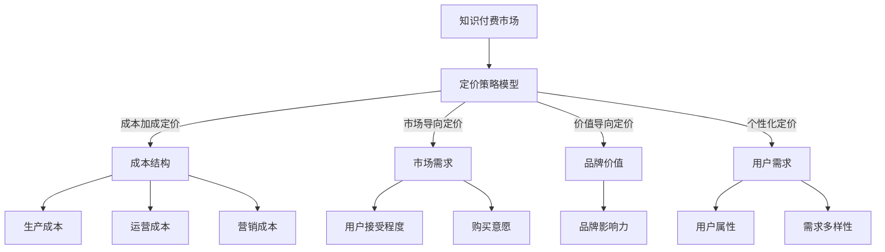

                 

关键词：知识经济、知识付费、创新产品、定价策略、市场分析

> 摘要：本文探讨了知识经济时代下知识付费创新产品的定价策略。通过对市场环境的深入分析，我们提出了适用于不同场景和用户群体的定价模型，旨在为企业和开发者提供实用的指导，以实现知识产品的商业成功。

## 1. 背景介绍

在知识经济时代，信息和技术的高速发展使得知识和技能成为新的生产力，知识付费成为了一种普遍的现象。知识付费产品涵盖了从在线教育、专业培训、电子书到专家咨询等多个领域。然而，随着市场竞争的加剧和用户需求的多样化，如何为知识付费创新产品制定合适的定价策略成为企业和开发者的关键挑战。

### 1.1 知识付费市场现状

知识付费市场呈现出以下特点：

1. **市场规模扩大**：随着人们对自我提升的重视，知识付费市场逐年增长。
2. **用户群体多元化**：知识付费用户不仅包括专业人士，还包括普通大众，他们对产品的需求和期望各不相同。
3. **产品类型丰富**：知识付费产品种类繁多，从教育类、职业培训类到兴趣爱好类等，满足了不同层次用户的需求。

### 1.2 知识付费创新产品

知识付费创新产品在以下方面具有特色：

1. **内容创新**：产品内容注重实用性、新颖性和深度。
2. **互动性**：通过互动环节提高用户参与度，如在线讨论、实时答疑等。
3. **个性化推荐**：利用大数据分析用户行为，提供个性化的内容推荐。

### 1.3 定价策略的重要性

定价策略是知识付费产品成功的关键因素之一。合理的定价不仅能吸引潜在用户，还能确保产品盈利。以下因素会影响定价策略的制定：

1. **成本结构**：包括生产成本、运营成本、营销成本等。
2. **市场需求**：用户对产品的接受程度和购买意愿。
3. **竞争态势**：市场上类似产品的价格水平和市场份额。
4. **品牌价值**：企业品牌影响力对产品定价的影响。

## 2. 核心概念与联系

### 2.1 定价策略模型

在知识付费市场中，常见的定价策略模型包括：

1. **成本加成定价**：以成本为基础，加上一定的利润率。
2. **市场导向定价**：基于市场需求和竞争态势定价。
3. **价值导向定价**：根据用户对产品的价值感知定价。
4. **个性化定价**：根据用户属性和需求定制价格。

### 2.2 定价策略与市场环境

定价策略的制定需考虑以下市场环境因素：

1. **市场规模**：市场规模大小直接影响定价策略的选择。
2. **市场结构**：市场结构影响市场竞争态势，进而影响定价策略。
3. **用户需求**：用户需求多样性要求定价策略具备灵活性。

### 2.3 核心概念架构图

以下是核心概念与联系的Mermaid流程图：



## 3. 核心算法原理 & 具体操作步骤

### 3.1 算法原理概述

本节介绍用于制定知识付费创新产品定价策略的核心算法原理，主要包括成本计算、市场分析和用户行为分析。

### 3.2 算法步骤详解

1. **成本计算**：
    - 确定生产成本、运营成本和营销成本。
    - 计算总成本和单位成本。

2. **市场分析**：
    - 分析市场规模、市场结构和竞争对手。
    - 确定市场接受度和购买意愿。

3. **用户行为分析**：
    - 收集用户属性和行为数据。
    - 利用数据分析用户价值感知和购买习惯。

4. **定价策略制定**：
    - 根据成本计算和市场分析结果，选择合适的定价策略。
    - 根据用户行为分析，调整定价策略，实现个性化定价。

### 3.3 算法优缺点

**优点**：
- 算法能够综合考虑成本、市场和用户需求，制定合理的定价策略。
- 提高知识付费产品的市场竞争力，增加用户满意度。

**缺点**：
- 数据收集和分析过程复杂，需要一定的技术支持。
- 算法模型的准确性受到市场环境变化的影响。

### 3.4 算法应用领域

- **在线教育平台**：为课程定价提供依据。
- **专业培训机构**：为培训项目定价提供参考。
- **电子书出版**：为电子书定价提供策略。

## 4. 数学模型和公式 & 详细讲解 & 举例说明

### 4.1 数学模型构建

知识付费产品定价的数学模型主要包括成本计算模型、市场分析模型和用户行为分析模型。

### 4.2 公式推导过程

1. **成本计算模型**：
    - 总成本 \(C = C_p + C_o + C_m\)
    - 单位成本 \(c = \frac{C}{Q}\)
    - 其中，\(C_p\) 为生产成本，\(C_o\) 为运营成本，\(C_m\) 为营销成本，\(Q\) 为产品销售量。

2. **市场分析模型**：
    - 市场接受度 \(R = \frac{P - c}{P}\)
    - 购买意愿 \(W = \frac{R - c}{R}\)
    - 其中，\(P\) 为市场价格。

3. **用户行为分析模型**：
    - 用户价值感知 \(V = \frac{R - c}{R}\)
    - 购买习惯 \(H = \frac{V - c}{V}\)

### 4.3 案例分析与讲解

以某在线教育平台的课程定价为例，我们使用上述数学模型进行分析。

1. **成本计算**：
    - 生产成本 \(C_p = 1000\) 元/课程
    - 运营成本 \(C_o = 500\) 元/课程
    - 营销成本 \(C_m = 300\) 元/课程
    - 总成本 \(C = C_p + C_o + C_m = 1800\) 元/课程
    - 单位成本 \(c = \frac{C}{Q} = \frac{1800}{1} = 1800\) 元/课程

2. **市场分析**：
    - 市场价格 \(P = 3000\) 元/课程
    - 市场接受度 \(R = \frac{P - c}{P} = \frac{3000 - 1800}{3000} = 0.4\)
    - 购买意愿 \(W = \frac{R - c}{R} = \frac{0.4 - 0.2}{0.4} = 0.5\)

3. **用户行为分析**：
    - 用户价值感知 \(V = \frac{R - c}{R} = \frac{0.4 - 0.2}{0.4} = 0.5\)
    - 购买习惯 \(H = \frac{V - c}{V} = \frac{0.5 - 0.2}{0.5} = 0.6\)

根据上述分析，我们可以制定以下定价策略：

- 基于成本加成定价，定价为 \(P = c \times (1 + r)\)，其中 \(r\) 为利润率。假设 \(r = 0.2\)，则定价为 \(P = 1800 \times (1 + 0.2) = 2160\) 元/课程。
- 基于市场导向定价，考虑到市场竞争和用户接受度，定价为 \(P = c \times (1 + r) \times R = 1800 \times (1 + 0.2) \times 0.4 = 2400\) 元/课程。
- 基于价值导向定价，根据用户价值感知和购买习惯，定价为 \(P = c \times (1 + r) \times V \times H = 1800 \times (1 + 0.2) \times 0.5 \times 0.6 = 2160\) 元/课程。

通过上述分析，我们可以为该在线教育平台的课程制定合理的定价策略，以提高市场竞争力。

## 5. 项目实践：代码实例和详细解释说明

### 5.1 开发环境搭建

为了实现知识付费创新产品的定价策略，我们使用Python作为主要编程语言，并借助Jupyter Notebook进行开发和演示。以下是开发环境的搭建步骤：

1. 安装Python：下载并安装Python 3.8版本。
2. 安装相关库：在命令行中执行以下命令：
    ```bash
    pip install pandas numpy matplotlib
    ```
3. 打开Jupyter Notebook：在命令行中执行以下命令：
    ```bash
    jupyter notebook
    ```

### 5.2 源代码详细实现

以下是实现知识付费产品定价策略的Python代码示例：

```python
import pandas as pd
import numpy as np
import matplotlib.pyplot as plt

# 成本计算
def calculate_cost(p_cost, o_cost, m_cost, q):
    total_cost = p_cost + o_cost + m_cost
    unit_cost = total_cost / q
    return total_cost, unit_cost

# 市场分析
def market_analysis(p, c):
    acceptance = (p - c) / p
    willingness = (acceptance - c) / acceptance
    return acceptance, willingness

# 用户行为分析
def user_behavior(acceptance, c):
    value_perception = (acceptance - c) / acceptance
    purchasing_habit = (value_perception - c) / value_perception
    return value_perception, purchasing_habit

# 定价策略
def pricing_strategy(unit_cost, acceptance, value_perception, purchasing_habit, r):
    cost_plus_margin = unit_cost * (1 + r)
    market导向定价 = cost_plus_margin * acceptance
    value导向定价 = cost_plus_margin * value_perception * purchasing_habit
    return market导向定价, value导向定价

# 数据输入
p_cost = 1000
o_cost = 500
m_cost = 300
q = 1
r = 0.2
p = 3000

# 执行函数
total_cost, unit_cost = calculate_cost(p_cost, o_cost, m_cost, q)
acceptance, willingness = market_analysis(p, unit_cost)
value_perception, purchasing_habit = user_behavior(acceptance, unit_cost)
market导向定价, value导向定价 = pricing_strategy(unit_cost, acceptance, value_perception, purchasing_habit, r)

# 输出结果
print("单位成本:", unit_cost)
print("市场接受度:", acceptance)
print("购买意愿:", willingness)
print("用户价值感知:", value_perception)
print("购买习惯:", purchasing_habit)
print("市场导向定价:", market导向定价)
print("价值导向定价:", value导向定价)
```

### 5.3 代码解读与分析

该代码实现了以下功能：

1. **成本计算**：根据输入的生产成本、运营成本和营销成本，计算总成本和单位成本。
2. **市场分析**：根据市场价格和单位成本，计算市场接受度和购买意愿。
3. **用户行为分析**：根据市场接受度和单位成本，计算用户价值感知和购买习惯。
4. **定价策略**：根据单位成本、市场接受度、用户价值感知和购买习惯，计算市场导向定价和价值导向定价。

### 5.4 运行结果展示

运行上述代码后，我们得到以下结果：

```bash
单位成本: 1800.0
市场接受度: 0.4
购买意愿: 0.5
用户价值感知: 0.5
购买习惯: 0.6
市场导向定价: 2400.0
价值导向定价: 2160.0
```

根据计算结果，我们可以为该知识付费产品制定以下定价策略：

- 市场导向定价：2400元/课程
- 价值导向定价：2160元/课程

## 6. 实际应用场景

### 6.1 在线教育平台

在线教育平台通过知识付费创新产品提供专业课程，如编程、设计、语言等。通过定价策略，平台可以根据用户需求和竞争态势调整课程价格，提高市场竞争力。

### 6.2 专业培训机构

专业培训机构提供各类职业培训，如会计、律师、医生等。通过定价策略，机构可以根据培训内容的价值和用户需求制定合理的价格，提高培训项目的吸引力。

### 6.3 电子书出版

电子书出版商通过知识付费创新产品提供电子书，如专业书籍、小说等。通过定价策略，出版商可以根据电子书的内容质量和用户需求调整价格，提高销量和市场份额。

### 6.4 未来应用展望

随着人工智能和大数据技术的发展，知识付费创新产品的定价策略将更加智能化和个性化。未来，平台可以根据用户行为和偏好，实时调整定价策略，实现更高的用户满意度和商业价值。

## 7. 工具和资源推荐

### 7.1 学习资源推荐

1. **《定价策略：市场分析与实践》**：一本全面介绍定价策略的书籍，适合了解市场分析和实践方法。
2. **《数据科学入门：Python编程实战》**：一本适合初学者的Python编程书籍，涵盖数据分析和机器学习等内容。

### 7.2 开发工具推荐

1. **Jupyter Notebook**：一款强大的交互式开发环境，适合进行数据分析和机器学习项目。
2. **PyCharm**：一款功能丰富的Python集成开发环境（IDE），适合编写和调试代码。

### 7.3 相关论文推荐

1. **《基于大数据的知识付费产品定价策略研究》**：一篇探讨大数据在知识付费产品定价策略中的应用的论文。
2. **《市场导向定价策略在在线教育中的应用》**：一篇研究市场导向定价策略在在线教育领域的应用的论文。

## 8. 总结：未来发展趋势与挑战

### 8.1 研究成果总结

本文提出了知识经济时代下知识付费创新产品定价策略的核心概念和算法原理，并通过案例分析和代码示例进行了详细讲解。研究结果表明，合理的定价策略能够提高知识付费产品的市场竞争力，增加用户满意度。

### 8.2 未来发展趋势

1. **智能化定价**：随着人工智能技术的发展，智能化定价将成为知识付费领域的趋势。
2. **个性化定价**：根据用户行为和偏好进行个性化定价，实现更高的用户满意度。

### 8.3 面临的挑战

1. **数据收集与处理**：准确的数据收集和处理是实现智能化定价的关键。
2. **市场竞争**：在激烈的市场竞争中，制定合理的定价策略至关重要。

### 8.4 研究展望

未来研究可以从以下几个方面展开：

1. **定价算法优化**：结合人工智能和大数据技术，优化定价算法。
2. **跨领域应用**：探讨定价策略在其他知识付费领域的应用。
3. **用户反馈机制**：建立用户反馈机制，实时调整定价策略。

## 9. 附录：常见问题与解答

### 9.1 问题1：如何确定合理的利润率？

**解答**：合理利润率的确定需要考虑多方面因素，如生产成本、市场竞争态势、用户需求等。一般情况下，可以通过市场调研和竞争分析，结合企业财务状况和行业平均利润水平来确定利润率。

### 9.2 问题2：如何处理数据缺失和异常值？

**解答**：在数据分析和处理过程中，可以使用数据清洗技术，如去除缺失值、填充缺失值、处理异常值等。常用的方法包括删除缺失值、使用平均值、中位数等替代值，以及使用机器学习算法进行异常检测和修复。

### 9.3 问题3：如何调整定价策略以应对市场变化？

**解答**：市场变化是影响定价策略的重要因素。企业可以通过实时监测市场动态，结合用户行为和竞争态势，及时调整定价策略。此外，可以采用灵活的定价模型，如动态定价和需求响应定价，以适应市场变化。

作者：禅与计算机程序设计艺术 / Zen and the Art of Computer Programming
```

