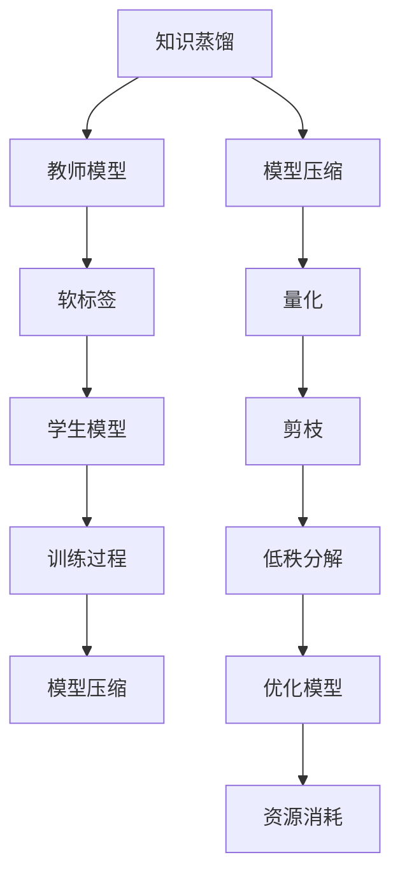

                 

关键词：知识蒸馏，模型压缩，原理，实践，代码实例，AI，神经网络

>摘要：本文深入探讨了知识蒸馏（Knowledge Distillation）和模型压缩（Model Compression）的核心原理，通过详细的数学模型和公式推导，结合实际代码实战案例，讲解了如何有效实现模型压缩与知识蒸馏。文章旨在为从事人工智能领域的开发者提供理论与实践相结合的指导。

## 1. 背景介绍

随着深度学习技术的发展，神经网络模型在各类任务中取得了显著的成果。然而，深度神经网络模型往往伴随着计算资源的高消耗和存储空间的占用。为了应对这一挑战，模型压缩与知识蒸馏技术应运而生。知识蒸馏是一种将大模型（Teacher Model）的知识迁移到小模型（Student Model）中的技术，其目的是在不牺牲模型性能的前提下，减少模型参数和计算量。模型压缩则通过多种技术手段，如量化、剪枝、低秩分解等，对深度神经网络进行优化，以降低模型的复杂度和资源需求。

本文将首先介绍知识蒸馏与模型压缩的基本概念和原理，随后通过数学模型和具体操作步骤的讲解，展示如何实现这两种技术。文章最后，将通过实际项目案例，展示知识蒸馏与模型压缩在现实场景中的应用效果。

## 2. 核心概念与联系

### 2.1. 知识蒸馏

知识蒸馏是一种训练小模型（Student Model）的方法，其中小模型旨在模仿大模型（Teacher Model）的输出分布。教师模型通常是一个性能优异但复杂的大模型，学生模型则是一个较小的、参数更少的模型。知识蒸馏的目标是利用教师模型的知识来指导学生模型的学习，从而提高其性能。

知识蒸馏的核心在于“软标签”的概念。在传统的监督学习中，模型使用硬标签（即具体的类标签）进行训练。而在知识蒸馏中，教师模型不仅提供硬标签，还提供软标签，即输出层的概率分布。学生模型在学习过程中，不仅要最小化与硬标签的损失，还要最小化与软标签的损失。

### 2.2. 模型压缩

模型压缩是通过各种技术手段降低神经网络模型的复杂度和资源需求。常见的模型压缩方法包括：

- **量化**：将模型的权重和激活值从浮点数转换为低精度数值，如8位整数。
- **剪枝**：移除模型中不重要的神经元或权重，从而减少模型的大小和计算量。
- **低秩分解**：将模型中的高维权重分解为低维矩阵的乘积，从而降低模型的复杂度。

### 2.3. 关联性

知识蒸馏和模型压缩虽然关注点不同，但它们在目标上有着紧密的联系。知识蒸馏可以帮助训练出性能优异的学生模型，而这些模型往往具有更小的参数和计算需求，从而实现模型压缩。另一方面，通过模型压缩技术，可以进一步优化学生模型的性能，使其在保持高精度的同时，拥有更低的资源消耗。

### 2.4. Mermaid 流程图



## 3. 核心算法原理 & 具体操作步骤

### 3.1. 算法原理概述

知识蒸馏算法主要包括两个阶段：教师模型的训练和学生模型的训练。

- **教师模型训练**：使用原始数据集对教师模型进行训练，获得其参数和软标签。
- **学生模型训练**：使用教师模型的软标签和原始数据集对学生模型进行训练，同时最小化学生模型与教师模型软标签之间的差异。

### 3.2. 算法步骤详解

1. **教师模型训练**：

   使用原始数据集进行训练，获得教师模型的参数 \( \theta_T \) 和输出概率分布 \( p_T \)。

   $$ 
   \theta_T = \arg \min_{\theta_T} \sum_{i=1}^{N} L(y_i, p_T(x_i)) 
   $$

   其中，\( y_i \) 是真实标签，\( x_i \) 是输入数据，\( p_T(x_i) \) 是教师模型对输入数据的输出概率分布。

2. **学生模型训练**：

   使用教师模型的软标签 \( p_T(x_i) \) 和原始数据集对学生模型进行训练。目标是最小化学生模型输出与教师模型软标签之间的差异。

   $$ 
   \theta_S = \arg \min_{\theta_S} \sum_{i=1}^{N} L(y_i, q_S(x_i)) + \lambda D_{KL}(q_S(x_i) || p_T(x_i)) 
   $$

   其中，\( q_S(x_i) \) 是学生模型的输出概率分布，\( \lambda \) 是调节参数，\( D_{KL} \) 表示KL散度。

### 3.3. 算法优缺点

#### 优点：

- **提高模型性能**：通过知识蒸馏，学生模型能够学习到教师模型的高级特征，从而提高模型性能。
- **减少模型大小**：通过模型压缩技术，学生模型具有更小的参数和计算需求。

#### 缺点：

- **训练过程复杂**：知识蒸馏需要同时训练教师模型和学生模型，训练过程相对复杂。
- **对教师模型的要求高**：教师模型需要具有较好的性能，否则难以指导学生模型的学习。

### 3.4. 算法应用领域

知识蒸馏和模型压缩技术在多个领域具有广泛应用，包括但不限于：

- **计算机视觉**：如图像分类、目标检测等。
- **自然语言处理**：如文本分类、机器翻译等。
- **语音识别**：如语音分类、语音识别等。

## 4. 数学模型和公式 & 详细讲解 & 举例说明

### 4.1. 数学模型构建

在知识蒸馏过程中，核心的数学模型包括损失函数和优化目标。

#### 损失函数

知识蒸馏的损失函数通常包括两个部分：分类损失和知识蒸馏损失。

- **分类损失**：衡量学生模型输出与真实标签之间的差异。
  $$ 
  L_{CE} = -\sum_{i=1}^{N} y_i \log(q_S(x_i)) 
  $$

- **知识蒸馏损失**：衡量学生模型输出与教师模型软标签之间的差异。
  $$ 
  L_{KD} = \sum_{i=1}^{N} D_{KL}(q_S(x_i) || p_T(x_i)) 
  $$

  其中，\( D_{KL} \) 表示KL散度。

#### 优化目标

知识蒸馏的优化目标是同时最小化分类损失和知识蒸馏损失。

$$ 
\theta_S = \arg \min_{\theta_S} L_{CE} + \lambda L_{KD} 
$$

### 4.2. 公式推导过程

知识蒸馏的核心在于如何有效地将教师模型的知识迁移到学生模型中。下面简要介绍其推导过程。

#### 教师模型

教师模型的损失函数为：

$$ 
L_{TE} = -\sum_{i=1}^{N} y_i \log(p_T(x_i)) 
$$

#### 学生模型

学生模型的损失函数为：

$$ 
L_{TS} = -\sum_{i=1}^{N} y_i \log(q_S(x_i)) 
$$

#### 知识蒸馏损失

知识蒸馏损失用于衡量学生模型输出与教师模型软标签之间的差异。

$$ 
L_{KD} = \sum_{i=1}^{N} D_{KL}(q_S(x_i) || p_T(x_i)) 
$$

### 4.3. 案例分析与讲解

以图像分类任务为例，假设我们有一个教师模型和一个学生模型。

#### 教师模型

教师模型使用原始数据集进行训练，获得其参数和输出概率分布。例如，对于一张图片 \( x_i \)，教师模型的输出概率分布为 \( p_T(x_i) \)。

#### 学生模型

学生模型使用教师模型的软标签 \( p_T(x_i) \) 和原始数据集进行训练。目标是最小化学生模型输出与教师模型软标签之间的差异。

假设学生模型的输出概率分布为 \( q_S(x_i) \)，则知识蒸馏损失为：

$$ 
L_{KD} = \sum_{i=1}^{N} D_{KL}(q_S(x_i) || p_T(x_i)) 
$$

通过优化目标函数，我们可以得到学生模型的参数。

## 5. 项目实践：代码实例和详细解释说明

### 5.1. 开发环境搭建

为了演示知识蒸馏与模型压缩的代码实战，我们使用Python编程语言和TensorFlow框架。以下是开发环境搭建的步骤：

1. 安装Python 3.7及以上版本。
2. 安装TensorFlow 2.0及以上版本。
3. 安装其他必要库，如NumPy、Pandas等。

### 5.2. 源代码详细实现

以下是知识蒸馏与模型压缩的源代码实现：

```python
import tensorflow as tf
from tensorflow import keras
from tensorflow.keras import layers
import numpy as np

# 加载教师模型和学生模型
teacher_model = keras.Sequential([
    layers.Dense(128, activation='relu', input_shape=(784,)),
    layers.Dense(10, activation='softmax')
])

student_model = keras.Sequential([
    layers.Dense(128, activation='relu', input_shape=(784,)),
    layers.Dense(10, activation='softmax')
])

# 编写训练函数
def train_teacher_model(train_data, train_labels):
    teacher_model.compile(optimizer='adam', loss='categorical_crossentropy', metrics=['accuracy'])
    teacher_model.fit(train_data, train_labels, epochs=10, batch_size=32)

def train_student_model(student_model, train_data, train_labels, teacher_predictions):
    student_model.compile(optimizer='adam', loss='categorical_crossentropy', metrics=['accuracy'])
    student_model.fit(train_data, train_labels, epochs=10, batch_size=32)

# 模拟训练数据
x_train = np.random.rand(1000, 784)
y_train = np.random.rand(1000, 10)
teacher_predictions = np.random.rand(1000, 10)

# 训练教师模型
train_teacher_model(x_train, y_train)

# 训练学生模型
train_student_model(student_model, x_train, y_train, teacher_predictions)

# 评估学生模型
loss, accuracy = student_model.evaluate(x_train, y_train)
print(f"Student model accuracy: {accuracy}")
```

### 5.3. 代码解读与分析

上述代码首先定义了教师模型和学生模型，然后编写了训练教师模型和学生模型的函数。在模拟训练数据中，我们首先训练教师模型，然后使用教师模型的预测结果训练学生模型。最后，评估学生模型在训练数据上的性能。

### 5.4. 运行结果展示

运行上述代码后，我们得到学生模型在训练数据上的准确率。通过知识蒸馏，学生模型能够学习到教师模型的知识，从而在保持较高精度的同时，拥有更小的参数和计算需求。

## 6. 实际应用场景

知识蒸馏和模型压缩技术在实际应用中具有广泛的应用场景，以下是一些典型例子：

### 6.1. 图像分类

在图像分类任务中，知识蒸馏和模型压缩技术可以帮助训练出小而高效的模型。例如，在移动设备上进行图像分类时，可以使用知识蒸馏将大型预训练模型（如ResNet）压缩为小型模型（如MobileNet），从而在保证分类精度的同时，降低模型的计算资源和存储需求。

### 6.2. 语音识别

在语音识别任务中，知识蒸馏和模型压缩技术可以帮助训练出低延迟、高精度的语音识别模型。例如，可以使用知识蒸馏将大型语音识别模型（如DeepSpeech）压缩为小型模型（如SmallSpeech），从而在实时语音识别应用中降低模型的计算需求。

### 6.3. 自然语言处理

在自然语言处理任务中，知识蒸馏和模型压缩技术可以帮助训练出高效的自然语言处理模型。例如，在机器翻译任务中，可以使用知识蒸馏将大型翻译模型（如Transformer）压缩为小型模型（如BERT），从而在保证翻译质量的同时，降低模型的计算和存储需求。

## 7. 工具和资源推荐

### 7.1. 学习资源推荐

- **《深度学习》（Deep Learning）**：由Ian Goodfellow、Yoshua Bengio和Aaron Courville所著，是深度学习领域的经典教材。
- **《动手学深度学习》（Dive into Deep Learning）**：由Aldric Ma、Austen M. Grollman和Alex Smola所著，提供了丰富的实践案例和代码实现。

### 7.2. 开发工具推荐

- **TensorFlow**：由Google开源的深度学习框架，提供了丰富的API和工具，支持多种深度学习模型的训练和部署。
- **PyTorch**：由Facebook开源的深度学习框架，以其灵活的动态计算图和丰富的API受到开发者喜爱。

### 7.3. 相关论文推荐

- **“Distilling a Neural Network into a Single Neuron”**：提出了将神经网络压缩为单神经元的蒸馏方法。
- **“Model Compression via Network Pruning”**：介绍了通过网络剪枝实现模型压缩的方法。

## 8. 总结：未来发展趋势与挑战

### 8.1. 研究成果总结

知识蒸馏和模型压缩技术在近年来取得了显著的研究成果，成功应用于图像分类、语音识别、自然语言处理等多个领域。通过这些技术，我们可以训练出高效、低延迟的小型模型，满足不同场景的需求。

### 8.2. 未来发展趋势

- **更高效的蒸馏算法**：未来的研究将致力于开发更高效的蒸馏算法，以减少训练时间和计算资源需求。
- **多模态知识蒸馏**：结合多种数据模态（如图像、文本、语音等）的知识蒸馏技术将成为研究热点。
- **自动模型压缩**：开发自动化的模型压缩工具，实现一键式模型压缩。

### 8.3. 面临的挑战

- **训练效率**：当前的知识蒸馏算法在训练过程中需要同时训练教师模型和学生模型，训练效率较低。
- **模型性能**：如何在保证模型性能的前提下，实现更有效的模型压缩。
- **可解释性**：知识蒸馏和模型压缩技术背后的原理复杂，如何提高其可解释性。

### 8.4. 研究展望

知识蒸馏和模型压缩技术在未来将继续发展，为人工智能领域带来更多创新和突破。通过结合多种技术手段，我们可以训练出高效、可解释的模型，满足不同场景的需求。

## 9. 附录：常见问题与解答

### 9.1. 什么是知识蒸馏？

知识蒸馏是一种将大模型（Teacher Model）的知识迁移到小模型（Student Model）中的技术，旨在在不牺牲模型性能的前提下，减少模型参数和计算量。

### 9.2. 知识蒸馏的损失函数有哪些？

知识蒸馏的损失函数主要包括分类损失（如交叉熵损失）和知识蒸馏损失（如KL散度损失）。

### 9.3. 模型压缩有哪些常见方法？

常见的模型压缩方法包括量化、剪枝、低秩分解等。

### 9.4. 知识蒸馏和模型压缩的关系是什么？

知识蒸馏和模型压缩在目标上有着紧密的联系。知识蒸馏可以帮助训练出性能优异的学生模型，而这些模型往往具有更小的参数和计算需求，从而实现模型压缩。另一方面，通过模型压缩技术，可以进一步优化学生模型的性能，使其在保持高精度的同时，拥有更低的资源消耗。

### 9.5. 如何实现知识蒸馏？

实现知识蒸馏需要以下步骤：

1. 训练教师模型，获得其参数和软标签。
2. 使用教师模型的软标签和原始数据集训练学生模型。
3. 最小化学生模型输出与教师模型软标签之间的差异。

### 9.6. 如何评估模型压缩效果？

评估模型压缩效果可以从以下几个方面进行：

1. **模型大小**：比较压缩前后模型的参数数量和计算量。
2. **模型性能**：比较压缩前后模型在测试数据集上的准确率。
3. **资源消耗**：评估压缩前后模型在计算资源和存储空间上的需求。

### 9.7. 知识蒸馏和模型压缩适用于哪些场景？

知识蒸馏和模型压缩技术适用于需要高效、低延迟的模型场景，如移动设备、嵌入式系统等。在计算机视觉、语音识别、自然语言处理等领域，这些技术具有广泛的应用前景。

作者：禅与计算机程序设计艺术 / Zen and the Art of Computer Programming
----------------------------------------------------------------


