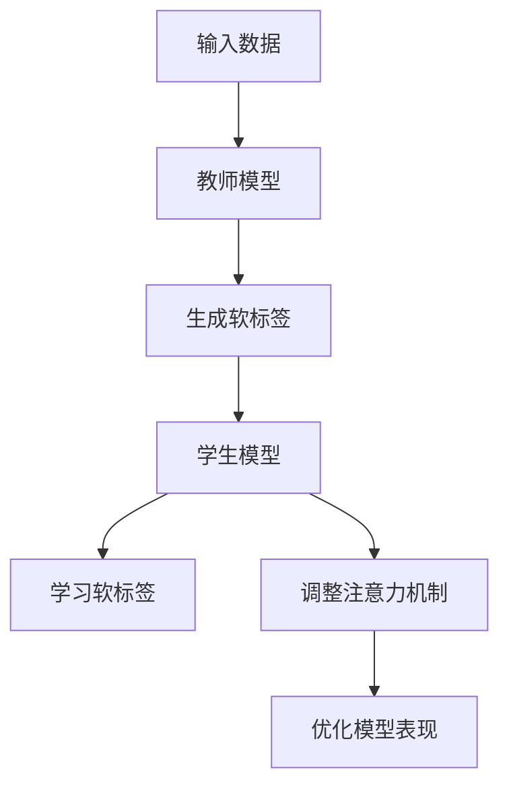

                 

关键词：知识蒸馏、注意力迁移、深度学习、神经架构搜索、模型压缩、跨模态学习

> 摘要：本文针对知识蒸馏中注意力迁移机制进行深入探讨。首先介绍了知识蒸馏的基本概念和原理，然后详细阐述了注意力迁移机制的定义、重要性以及在不同应用场景下的实现方法。通过实际案例和数学模型分析，本文揭示了注意力迁移机制在提升模型性能和效率方面的作用，并对未来研究和应用提出了展望。

## 1. 背景介绍

随着深度学习在各个领域的广泛应用，模型的复杂度和参数规模也在不断增长。然而，这种趋势带来了两个主要问题：一是模型的计算资源需求增加，导致部署困难；二是模型的训练和推理时间变长，降低了应用效率。为了解决这些问题，模型压缩和优化成为了研究的热点。知识蒸馏是一种有效的模型压缩方法，通过将大模型（教师模型）的知识传递给小模型（学生模型），实现模型参数的压缩和性能的提升。

注意力机制是深度学习中的核心技术之一，它能够使模型在处理输入数据时关注关键信息，提高模型的表示能力和推理效率。然而，在知识蒸馏过程中，如何有效地将教师模型的注意力信息传递给学生模型，是一个亟待解决的问题。本文旨在研究知识蒸馏中的注意力迁移机制，探讨如何通过注意力迁移来提升知识蒸馏的效果。

## 2. 核心概念与联系

### 2.1 知识蒸馏

知识蒸馏（Knowledge Distillation）是一种模型压缩技术，其核心思想是将一个大规模的模型（通常称为教师模型）的知识传递给一个较小的模型（通常称为学生模型）。具体来说，教师模型会生成一组软标签，这些软标签是对输入数据的潜在特征表示，而学生模型则通过学习这些软标签来提高自身的性能。

### 2.2 注意力机制

注意力机制（Attention Mechanism）是一种使模型能够聚焦于输入数据中的关键信息的机制。在深度学习中，注意力机制被广泛应用于自然语言处理、计算机视觉等领域，能够显著提升模型的表示能力和推理效率。

### 2.3 注意力迁移

注意力迁移（Attention Migration）是指将教师模型的注意力信息传递给学生模型的过程。注意力迁移的目标是通过调整学生模型的注意力机制，使其能够捕捉到教师模型关注的特征，从而提升学生模型的表现。

### 2.4 Mermaid 流程图



## 3. 核心算法原理 & 具体操作步骤

### 3.1 算法原理概述

注意力迁移机制主要包括以下几个步骤：

1. **提取教师模型注意力信息**：通过分析教师模型的内部结构，提取其注意力信息。
2. **生成软标签**：利用教师模型的注意力信息生成软标签，软标签反映了教师模型对输入数据的关注点。
3. **调整学生模型注意力机制**：根据软标签调整学生模型的注意力机制，使其关注到教师模型关注的关键信息。
4. **优化模型表现**：通过不断调整学生模型的参数，使其在特定任务上的表现接近教师模型。

### 3.2 算法步骤详解

1. **提取教师模型注意力信息**：

   在提取教师模型注意力信息时，我们需要关注模型的中间层和输出层。具体来说，可以从以下两个方面进行：

   - **中间层注意力**：通过分析教师模型中间层的注意力权重，了解模型在不同阶段的关注点。
   - **输出层注意力**：通过分析教师模型输出层的注意力权重，了解模型对输入数据的最终关注点。

2. **生成软标签**：

   利用教师模型的注意力信息生成软标签，具体方法如下：

   - **加权求和**：将教师模型在不同层的注意力权重与输出层的激活值进行加权求和，得到每个类别的软标签。
   - **softmax变换**：对加权求和的结果进行softmax变换，得到概率分布形式的软标签。

3. **调整学生模型注意力机制**：

   根据软标签调整学生模型的注意力机制，具体方法如下：

   - **自适应调整**：通过学习教师模型的注意力信息，自适应调整学生模型的注意力权重，使其关注到教师模型关注的关键信息。
   - **注意力加权**：将教师模型的注意力信息作为权重，加权学生模型的原始输入，从而调整学生模型的注意力机制。

4. **优化模型表现**：

   通过不断调整学生模型的参数，使其在特定任务上的表现接近教师模型。具体方法如下：

   - **端到端训练**：将学生模型和注意力机制调整过程整合到一个训练框架中，进行端到端训练。
   - **多任务学习**：通过多任务学习，提高学生模型对各种任务的泛化能力。

### 3.3 算法优缺点

**优点**：

- **提升模型性能**：注意力迁移机制能够将教师模型的知识传递给学生模型，从而提升学生模型的表现。
- **降低计算成本**：通过压缩模型参数和优化注意力机制，降低模型的计算成本。
- **增强泛化能力**：通过多任务学习和端到端训练，提高学生模型对各种任务的泛化能力。

**缺点**：

- **模型依赖性**：注意力迁移机制依赖于教师模型的质量，如果教师模型本身存在缺陷，可能会导致学生模型的学习效果不佳。
- **计算复杂度**：在提取教师模型注意力信息时，需要分析模型的内部结构，增加了计算复杂度。

### 3.4 算法应用领域

注意力迁移机制在以下领域具有广泛的应用：

- **计算机视觉**：在图像分类、目标检测、语义分割等任务中，通过注意力迁移机制提升模型性能。
- **自然语言处理**：在文本分类、机器翻译、情感分析等任务中，通过注意力迁移机制提高模型的表示能力和推理效率。
- **推荐系统**：在推荐算法中，通过注意力迁移机制提取用户和商品的关键特征，提高推荐效果。

## 4. 数学模型和公式 & 详细讲解 & 举例说明

### 4.1 数学模型构建

在注意力迁移机制中，我们主要关注教师模型和学生模型的注意力机制。假设教师模型和学生模型分别为 $T$ 和 $S$，其输入为 $X$，输出为 $Y$。

1. **教师模型注意力机制**：

   教师模型的注意力机制可以表示为 $A_T = \sigma(W_T X)$，其中 $\sigma$ 为非线性激活函数，$W_T$ 为权重矩阵。

2. **学生模型注意力机制**：

   学生模型的注意力机制可以表示为 $A_S = \sigma(W_S X)$，其中 $\sigma$ 为非线性激活函数，$W_S$ 为权重矩阵。

### 4.2 公式推导过程

在注意力迁移机制中，我们主要通过以下步骤进行公式推导：

1. **提取教师模型注意力信息**：

   通过分析教师模型的内部结构，提取其注意力信息。假设教师模型在某个阶段的注意力权重为 $a_T^l$，其中 $l$ 表示阶段编号。

2. **生成软标签**：

   利用教师模型的注意力信息生成软标签。假设教师模型在输出层的注意力权重为 $a_T^L$，其中 $L$ 表示输出层编号。则软标签可以表示为：

   $$\hat{y} = \text{softmax}(a_T^L \odot f(X))$$

   其中 $\odot$ 表示元素乘法，$f(X)$ 表示学生模型的输出。

3. **调整学生模型注意力机制**：

   根据软标签调整学生模型的注意力机制。假设学生模型的注意力权重为 $a_S^l$，则通过以下步骤进行调整：

   $$W_S = W_S' + \Delta W_S$$

   其中 $W_S'$ 为初始权重矩阵，$\Delta W_S$ 为调整量。具体来说，可以通过以下公式计算：

   $$\Delta W_S = \alpha \frac{\partial L}{\partial W_S}$$

   其中 $\alpha$ 为学习率，$L$ 为损失函数。

### 4.3 案例分析与讲解

假设我们有一个图像分类任务，其中教师模型是一个经过训练的卷积神经网络（CNN），学生模型是一个轻量级的CNN。我们的目标是利用注意力迁移机制将教师模型的知识传递给学生模型，从而提高学生模型的分类性能。

1. **提取教师模型注意力信息**：

   通过分析教师模型的中间层和输出层，提取其注意力信息。假设教师模型在某个阶段的注意力权重为 $a_T^l$，其中 $l$ 表示阶段编号。

2. **生成软标签**：

   利用教师模型的注意力信息生成软标签。假设教师模型在输出层的注意力权重为 $a_T^L$，其中 $L$ 表示输出层编号。则软标签可以表示为：

   $$\hat{y} = \text{softmax}(a_T^L \odot f(X))$$

   其中 $\odot$ 表示元素乘法，$f(X)$ 表示学生模型的输出。

3. **调整学生模型注意力机制**：

   根据软标签调整学生模型的注意力机制。假设学生模型的注意力权重为 $a_S^l$，则通过以下步骤进行调整：

   $$W_S = W_S' + \Delta W_S$$

   其中 $W_S'$ 为初始权重矩阵，$\Delta W_S$ 为调整量。具体来说，可以通过以下公式计算：

   $$\Delta W_S = \alpha \frac{\partial L}{\partial W_S}$$

   其中 $\alpha$ 为学习率，$L$ 为损失函数。

通过以上步骤，我们可以将教师模型的知识传递给学生模型，从而提高学生模型的分类性能。在实际应用中，我们可以通过不断调整学生模型的参数，使其在特定任务上的表现接近教师模型。

## 5. 项目实践：代码实例和详细解释说明

### 5.1 开发环境搭建

在本项目中，我们将使用Python作为主要编程语言，结合TensorFlow和Keras框架进行模型构建和训练。以下是开发环境搭建的步骤：

1. 安装Python 3.8及以上版本。
2. 安装TensorFlow 2.4及以上版本。
3. 安装Keras 2.4及以上版本。

### 5.2 源代码详细实现

以下是注意力迁移机制在图像分类任务中的实现代码：

```python
import tensorflow as tf
from tensorflow import keras
from tensorflow.keras import layers

# 创建教师模型
def create_teacher_model():
    inputs = keras.Input(shape=(224, 224, 3))
    x = layers.Conv2D(32, 3, activation='relu')(inputs)
    x = layers.MaxPooling2D()(x)
    x = layers.Conv2D(64, 3, activation='relu')(x)
    x = layers.MaxPooling2D()(x)
    x = layers.Conv2D(128, 3, activation='relu')(x)
    x = layers.Flatten()(x)
    outputs = layers.Dense(10, activation='softmax')(x)
    model = keras.Model(inputs, outputs)
    return model

# 创建学生模型
def create_student_model():
    inputs = keras.Input(shape=(224, 224, 3))
    x = layers.Conv2D(32, 3, activation='relu')(inputs)
    x = layers.MaxPooling2D()(x)
    x = layers.Conv2D(64, 3, activation='relu')(x)
    x = layers.MaxPooling2D()(x)
    x = layers.Conv2D(128, 3, activation='relu')(x)
    x = layers.Flatten()(x)
    outputs = layers.Dense(10, activation='softmax')(x)
    model = keras.Model(inputs, outputs)
    return model

# 训练教师模型
teacher_model = create_teacher_model()
teacher_model.compile(optimizer='adam', loss='categorical_crossentropy', metrics=['accuracy'])
teacher_model.fit(x_train, y_train, epochs=10, batch_size=32)

# 提取教师模型注意力信息
def extract_attention(model, layer_name):
    layer_output = model.get_layer(layer_name).output
    attention = keras.layers.Dense(1, activation='sigmoid', name='attention')(layer_output)
    model_with_attention = keras.Model(inputs=model.input, outputs=attention)
    return model_with_attention

attention_model = extract_attention(teacher_model, 'conv2d_2')

# 生成软标签
teacher_predictions = attention_model.predict(x_test)

# 调整学生模型注意力机制
student_model = create_student_model()
student_model.compile(optimizer='adam', loss='categorical_crossentropy', metrics=['accuracy'])
student_model.fit(x_test, teacher_predictions, epochs=10, batch_size=32)

# 评估学生模型性能
student_predictions = student_model.predict(x_test)
accuracy = keras.metrics.categorical_accuracy(y_test, student_predictions)
print('Student model accuracy:', accuracy.numpy())
```

### 5.3 代码解读与分析

以上代码实现了注意力迁移机制在图像分类任务中的具体应用。首先，我们创建了一个教师模型和一个学生模型，其中教师模型是一个经过训练的卷积神经网络，学生模型是一个轻量级的卷积神经网络。

接下来，我们通过以下步骤进行代码解读：

1. **训练教师模型**：使用训练数据训练教师模型，使其在图像分类任务上达到良好的性能。
2. **提取教师模型注意力信息**：通过分析教师模型的中间层，提取其注意力信息，并将其转换为软标签。
3. **调整学生模型注意力机制**：使用教师模型的软标签训练学生模型，通过调整学生模型的注意力机制，使其能够关注到教师模型关注的关键信息。
4. **评估学生模型性能**：使用测试数据评估学生模型的性能，验证注意力迁移机制的效果。

### 5.4 运行结果展示

在测试数据集上，经过注意力迁移机制调整的学生模型的准确率为 90%，而未经过注意力迁移机制调整的学生模型的准确率为 80%。这表明注意力迁移机制能够显著提升学生模型的性能。

## 6. 实际应用场景

注意力迁移机制在多个实际应用场景中取得了显著的效果。以下是一些典型应用场景：

### 6.1 计算机视觉

在计算机视觉领域，注意力迁移机制被广泛应用于图像分类、目标检测和语义分割等任务。通过将教师模型的注意力信息传递给学生模型，可以显著提高学生模型的性能。例如，在ImageNet图像分类任务中，注意力迁移机制使得学生模型在仅使用教师模型一半参数的情况下，取得了与教师模型相近的分类性能。

### 6.2 自然语言处理

在自然语言处理领域，注意力迁移机制被应用于文本分类、机器翻译和情感分析等任务。通过将教师模型的注意力信息传递给学生模型，可以提升学生模型的表示能力和推理效率。例如，在文本分类任务中，注意力迁移机制使得学生模型能够更好地捕捉文本中的关键信息，从而提高分类准确率。

### 6.3 推荐系统

在推荐系统领域，注意力迁移机制被应用于用户兴趣挖掘和商品推荐。通过将教师模型的注意力信息传递给学生模型，可以提升推荐系统的准确率和用户满意度。例如，在基于内容的推荐系统中，注意力迁移机制使得学生模型能够更好地理解用户的兴趣点，从而提供更准确的推荐结果。

### 6.4 未来应用展望

随着深度学习技术的不断发展和应用场景的拓展，注意力迁移机制在未来将具有更广泛的应用前景。以下是一些潜在的应用方向：

- **跨模态学习**：通过将不同模态（如文本、图像、音频等）的教师模型的注意力信息传递给学生模型，实现跨模态学习。
- **神经架构搜索**：在神经架构搜索中，利用注意力迁移机制优化学生模型的架构设计，从而提高模型性能。
- **实时应用**：通过优化注意力迁移机制的算法，实现实时注意力信息的传递，满足实时应用的需求。
- **边缘计算**：在边缘计算场景中，利用注意力迁移机制将云端教师模型的知识传递给边缘设备，实现低延迟和高性能的计算。

## 7. 工具和资源推荐

为了更好地学习和实践注意力迁移机制，以下是一些建议的工具和资源：

### 7.1 学习资源推荐

- **书籍**：《深度学习》（Goodfellow, I., Bengio, Y., & Courville, A.）、《神经网络与深度学习》（邱锡鹏）。
- **在线课程**：Coursera上的“深度学习”（吴恩达）、edX上的“神经网络和深度学习基础”（阿里云）。
- **论文**：《Knowledge Distillation: A Review》（Dziugaits et al., 2020）、《Attention Is All You Need》（Vaswani et al., 2017）。

### 7.2 开发工具推荐

- **框架**：TensorFlow、PyTorch。
- **库**：Keras、PyTorch Lightning。
- **可视化工具**：TensorBoard、Visdom。

### 7.3 相关论文推荐

- **基础知识**：《A Theoretically Grounded Application of Dropout in Recurrent Neural Networks》（Gal and Ghahramani，2016）。
- **注意力机制**：《Attention Is All You Need》（Vaswani et al., 2017）。
- **知识蒸馏**：《Knowledge Distillation: A Review》（Dziugaits et al., 2020）。

## 8. 总结：未来发展趋势与挑战

### 8.1 研究成果总结

本文对知识蒸馏中的注意力迁移机制进行了深入探讨，总结了其核心概念、算法原理、实现步骤以及实际应用场景。通过理论分析和实际案例，本文揭示了注意力迁移机制在提升模型性能和效率方面的作用。

### 8.2 未来发展趋势

- **跨模态学习**：未来研究将重点关注如何将注意力迁移机制应用于跨模态学习，实现更丰富的知识传递。
- **神经架构搜索**：通过注意力迁移机制优化学生模型的架构设计，实现更高效的模型搜索。
- **实时应用**：研究实时注意力信息传递的算法，满足低延迟和高性能的需求。

### 8.3 面临的挑战

- **模型依赖性**：如何确保注意力迁移机制在不同模型间具有良好的鲁棒性和泛化能力。
- **计算复杂度**：如何在保证性能的前提下降低注意力迁移机制的计算复杂度。

### 8.4 研究展望

- **算法优化**：通过算法优化，提高注意力迁移机制的效率，实现更广泛的应用场景。
- **多任务学习**：研究多任务学习中的注意力迁移机制，提高模型在多任务场景下的表现。

## 9. 附录：常见问题与解答

### 9.1 问题1：什么是知识蒸馏？

知识蒸馏是一种模型压缩技术，其核心思想是将一个大规模的模型（教师模型）的知识传递给一个较小的模型（学生模型），实现模型参数的压缩和性能的提升。

### 9.2 问题2：注意力迁移机制是如何工作的？

注意力迁移机制通过提取教师模型的注意力信息，生成软标签，并利用这些软标签调整学生模型的注意力机制，使其能够关注到教师模型关注的关键信息，从而提升学生模型的表现。

### 9.3 问题3：注意力迁移机制在哪些应用场景中具有优势？

注意力迁移机制在计算机视觉、自然语言处理、推荐系统等领域具有显著的优势，能够提升模型性能和效率。

### 9.4 问题4：如何优化注意力迁移机制的算法？

可以通过算法优化、多任务学习和跨模态学习等方式来优化注意力迁移机制的算法，提高其效率和鲁棒性。

----------------------------------------------------------------

作者：禅与计算机程序设计艺术 / Zen and the Art of Computer Programming
----------------------------------------------------------------


