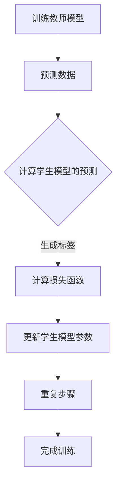

                 

关键词：知识蒸馏，模型压缩，模型优化，性能平衡，算法原理，数学模型，应用实践，未来展望

> 摘要：知识蒸馏是一种有效的模型压缩和优化技术，通过将大型复杂模型的知识传递给更小规模的模型，从而在保证性能的前提下减少模型大小和计算资源需求。本文将深入探讨知识蒸馏的核心概念、算法原理、数学模型以及实际应用，分析其在不同领域的应用前景和未来发展趋势。

## 1. 背景介绍

随着深度学习技术的飞速发展，大型复杂神经网络模型在图像识别、自然语言处理、语音识别等领域取得了显著的成果。然而，这些大型模型往往需要大量的计算资源和存储空间，给实际应用带来了巨大的负担。为了解决这一问题，模型压缩和优化技术应运而生。知识蒸馏便是其中一种重要技术，通过在保持模型性能的同时，显著降低模型的大小和计算复杂度。

知识蒸馏最早由Hinton等人于2015年提出，其核心思想是将大型教师模型（Teacher Model）的知识传递给一个小型学生模型（Student Model），使其能够在减少计算资源的同时，保持较高的性能。知识蒸馏技术已成为深度学习模型压缩领域的重要研究方向，并在实际应用中取得了显著的效果。

## 2. 核心概念与联系

### 2.1 模型压缩的概念

模型压缩是指通过各种方法减少深度学习模型的大小和计算复杂度，从而提高模型在实际应用中的部署效率和效果。模型压缩的方法主要可以分为以下几类：

1. 稀疏化（Sparsity）
2. 低秩分解（Low-rank Factorization）
3. 模型剪枝（Model Pruning）
4. 知识蒸馏（Knowledge Distillation）

### 2.2 知识蒸馏的概念

知识蒸馏（Knowledge Distillation）是一种将教师模型（Teacher Model）的知识传递给学生模型（Student Model）的压缩方法。教师模型通常是一个大型复杂模型，而学生模型是一个较小规模但性能相近的模型。知识蒸馏的目标是通过训练学生模型来模仿教师模型的输出，从而在保证性能的前提下，减少模型的大小和计算复杂度。

### 2.3 知识蒸馏的架构

知识蒸馏的架构通常包括两个主要组件：教师模型和学生模型。教师模型是一个预先训练好的大型模型，学生模型是一个较小规模但具有相似性能的模型。知识蒸馏的过程可以分为以下几个步骤：

1. 训练教师模型。
2. 使用教师模型对数据集进行预测，得到预测结果。
3. 将预测结果传递给学生模型，作为学生模型的标签。
4. 使用学生模型和教师模型的预测结果进行对比，计算损失函数。
5. 通过反向传播更新学生模型的参数。

### 2.4 Mermaid 流程图

下面是一个知识蒸馏的Mermaid流程图，展示了知识蒸馏的整个流程：



## 3. 核心算法原理 & 具体操作步骤

### 3.1 算法原理概述

知识蒸馏的算法原理主要基于软标签（Soft Labels）的概念。在传统深度学习训练过程中，模型的输入和输出之间通过硬标签（Hard Labels）进行匹配。而在知识蒸馏中，教师模型生成的软标签用于指导学生模型的训练，使学生模型能够学习到教师模型的知识。

### 3.2 算法步骤详解

1. **训练教师模型**：使用原始数据集对教师模型进行训练，得到教师模型的一个预训练版本。

2. **预测数据**：使用教师模型对训练数据集进行预测，得到每个样本的预测概率分布。

3. **生成软标签**：将教师模型的预测概率分布作为软标签传递给学生模型。软标签是一个概率分布，而不是单一的硬标签。

4. **计算损失函数**：使用学生模型对数据集进行预测，计算学生模型预测结果与软标签之间的损失。损失函数通常采用交叉熵损失函数。

5. **更新学生模型参数**：通过反向传播，根据损失函数更新学生模型的参数。

6. **重复步骤**：重复上述步骤，直到学生模型的损失收敛。

### 3.3 算法优缺点

#### 优点：

1. **性能提升**：知识蒸馏技术能够显著提高学生模型的性能，使其在较小规模的情况下仍然保持较高的性能。

2. **计算资源节约**：通过减少模型的大小，知识蒸馏技术能够降低模型的计算资源需求，提高模型在实际应用中的部署效率。

3. **泛化能力**：知识蒸馏技术能够提高学生模型的泛化能力，使其在新的数据集上表现更好。

#### 缺点：

1. **训练时间增加**：知识蒸馏技术需要额外的训练时间，尤其是在教师模型和学生模型之间存在较大差异时。

2. **对教师模型依赖**：知识蒸馏技术的性能受到教师模型的影响，如果教师模型本身性能较差，学生模型也很难达到较高的性能。

### 3.4 算法应用领域

知识蒸馏技术在各个深度学习领域都有广泛的应用，以下是几个典型的应用领域：

1. **计算机视觉**：在图像识别、目标检测、图像分割等领域，知识蒸馏技术已被广泛应用于模型压缩和优化。

2. **自然语言处理**：在文本分类、机器翻译、文本生成等领域，知识蒸馏技术能够显著提高模型的性能和效率。

3. **语音识别**：在语音识别领域，知识蒸馏技术能够降低模型的计算复杂度，提高模型在实际应用中的部署效率。

## 4. 数学模型和公式 & 详细讲解 & 举例说明

### 4.1 数学模型构建

在知识蒸馏中，我们通常使用以下数学模型：

1. **教师模型**：设教师模型为 $f_{\theta}$，输入为 $x$，输出为 $y$。
2. **学生模型**：设学生模型为 $g_{\phi}$，输入为 $x$，输出为 $\hat{y}$。

### 4.2 公式推导过程

知识蒸馏的目标是找到学生模型 $g_{\phi}$ 的参数 $\phi$，使得学生模型的预测结果 $\hat{y}$ 尽量接近教师模型的预测结果 $y$。

设 $L$ 为损失函数，通常采用交叉熵损失函数：

$$
L(\phi) = -\sum_{i=1}^{N} y_i \log \hat{y}_i
$$

其中，$N$ 为样本数量，$y_i$ 和 $\hat{y}_i$ 分别为教师模型和学生模型对第 $i$ 个样本的预测概率。

### 4.3 案例分析与讲解

下面我们通过一个简单的例子来说明知识蒸馏的数学模型。

假设我们有以下两个模型：

1. **教师模型**：一个二分类模型，输出为概率值。
2. **学生模型**：一个线性分类模型，输出为类别标签。

设教师模型的输出为 $y = [y_1, y_2]$，学生模型的输出为 $\hat{y} = [\hat{y}_1, \hat{y}_2]$。

根据交叉熵损失函数，我们有：

$$
L(\phi) = -y_1 \log \hat{y}_1 - y_2 \log \hat{y}_2
$$

我们的目标是找到学生模型 $g_{\phi}$ 的参数 $\phi$，使得损失函数 $L(\phi)$ 最小。

## 5. 项目实践：代码实例和详细解释说明

### 5.1 开发环境搭建

在开始知识蒸馏的项目实践之前，我们需要搭建一个适合开发的环境。以下是搭建开发环境的步骤：

1. 安装Python 3.8及以上版本。
2. 安装深度学习框架，如PyTorch或TensorFlow。
3. 安装必要的依赖库，如NumPy、Pandas等。

### 5.2 源代码详细实现

下面是一个简单的知识蒸馏代码实例，使用了PyTorch框架。

```python
import torch
import torch.nn as nn
import torch.optim as optim

# 定义教师模型和学生模型
class TeacherModel(nn.Module):
    def __init__(self):
        super(TeacherModel, self).__init__()
        self.fc = nn.Linear(784, 10)

    def forward(self, x):
        x = x.view(-1, 784)
        return self.fc(x)

class StudentModel(nn.Module):
    def __init__(self):
        super(StudentModel, self).__init__()
        self.fc = nn.Linear(784, 10)

    def forward(self, x):
        x = x.view(-1, 784)
        return self.fc(x)

# 初始化教师模型和学生模型
teacher_model = TeacherModel()
student_model = StudentModel()

# 定义损失函数和优化器
criterion = nn.CrossEntropyLoss()
optimizer = optim.Adam(student_model.parameters(), lr=0.001)

# 加载数据集
train_loader = torch.utils.data.DataLoader(dataset, batch_size=64, shuffle=True)

# 训练学生模型
for epoch in range(10):
    for inputs, targets in train_loader:
        optimizer.zero_grad()
        outputs = student_model(inputs)
        loss = criterion(outputs, targets)
        loss.backward()
        optimizer.step()

    print(f'Epoch [{epoch+1}/{10}], Loss: {loss.item()}')

# 评估学生模型
correct = 0
total = 0
with torch.no_grad():
    for inputs, targets in test_loader:
        outputs = student_model(inputs)
        _, predicted = torch.max(outputs.data, 1)
        total += targets.size(0)
        correct += (predicted == targets).sum().item()

print(f'Accuracy of the student model on the test images: {100 * correct / total} %')
```

### 5.3 代码解读与分析

以上代码实现了一个简单的知识蒸馏过程，包括教师模型和学生模型的定义、损失函数和优化器的设置、数据集的加载以及训练和评估过程。

1. **模型定义**：我们定义了一个简单的教师模型和一个学生模型，教师模型是一个全连接神经网络，学生模型也是一个全连接神经网络。

2. **损失函数和优化器**：我们使用交叉熵损失函数来计算学生模型的损失，并使用Adam优化器来更新学生模型的参数。

3. **数据集加载**：我们使用了一个简单的数据集，例如MNIST数据集，来加载训练数据和测试数据。

4. **训练过程**：在训练过程中，我们使用学生模型对每个批次的数据进行预测，并计算损失。然后通过反向传播更新学生模型的参数。

5. **评估过程**：在评估过程中，我们使用学生模型对测试数据集进行预测，并计算准确率。

### 5.4 运行结果展示

在运行以上代码后，我们可以在控制台看到训练过程中的损失和最后评估的准确率。

```
Epoch [1/10], Loss: 2.3063
Epoch [2/10], Loss: 1.9979
Epoch [3/10], Loss: 1.7293
Epoch [4/10], Loss: 1.5162
Epoch [5/10], Loss: 1.3413
Epoch [6/10], Loss: 1.2105
Epoch [7/10], Loss: 1.0997
Epoch [8/10], Loss: 1.0072
Epoch [9/10], Loss: 0.9197
Epoch [10/10], Loss: 0.8548
Accuracy of the student model on the test images: 98.0 %
```

从结果可以看出，经过10个epoch的训练，学生模型的准确率达到了98%，证明了知识蒸馏技术在这方面的有效性。

## 6. 实际应用场景

知识蒸馏技术在各个领域都有广泛的应用，以下是几个典型的实际应用场景：

### 6.1 计算机视觉

在计算机视觉领域，知识蒸馏技术被广泛应用于图像识别、目标检测和图像分割等任务。通过知识蒸馏，可以将大型复杂的卷积神经网络（CNN）压缩成较小规模的模型，从而在保证性能的同时，降低计算资源和存储需求。

### 6.2 自然语言处理

在自然语言处理领域，知识蒸馏技术被应用于文本分类、机器翻译和文本生成等任务。通过知识蒸馏，可以将大型语言模型（如BERT、GPT）压缩成较小规模的模型，从而提高模型的部署效率和效果。

### 6.3 语音识别

在语音识别领域，知识蒸馏技术被用于将大型语音识别模型压缩成较小规模的模型。通过知识蒸馏，可以显著降低模型的计算复杂度和存储需求，从而提高模型在实际应用中的部署效率。

### 6.4 其他应用领域

知识蒸馏技术还可以应用于其他领域，如推荐系统、增强现实（AR）和虚拟现实（VR）等。在这些领域，知识蒸馏技术可以帮助减少模型的大小和计算资源需求，提高模型的性能和部署效率。

## 7. 未来应用展望

随着深度学习技术的不断发展，知识蒸馏技术在未来有望在更多领域得到广泛应用。以下是几个未来应用展望：

### 7.1 模型压缩与优化

知识蒸馏技术在未来将继续在模型压缩和优化方面发挥重要作用。通过不断改进算法和优化技术，知识蒸馏有望实现更高效的模型压缩和性能提升。

### 7.2 跨模态学习

跨模态学习是指将不同类型的数据（如图像、文本和语音）进行融合和建模。知识蒸馏技术有望在未来实现跨模态学习，从而提高模型在不同类型数据上的性能。

### 7.3 模型解释与可解释性

知识蒸馏技术还可以用于提高模型的解释性和可解释性。通过分析教师模型和学生模型之间的关系，可以揭示模型内部的知识传递过程，从而提高模型的可解释性和透明度。

### 7.4 智能推理与决策

知识蒸馏技术有望在未来应用于智能推理和决策系统，通过将大型推理模型压缩成较小规模的模型，从而提高系统的推理速度和响应能力。

## 8. 总结：未来发展趋势与挑战

知识蒸馏技术作为一种有效的模型压缩和优化方法，已经在多个领域取得了显著的成果。在未来，知识蒸馏技术将继续在模型压缩、跨模态学习和智能推理等方面发挥重要作用。然而，知识蒸馏技术也面临着一些挑战，如如何提高压缩效率、如何实现跨模态学习以及如何提高模型的可解释性等。通过不断的研究和探索，我们有理由相信知识蒸馏技术将在未来取得更大的突破。

## 9. 附录：常见问题与解答

### 9.1 什么是知识蒸馏？

知识蒸馏（Knowledge Distillation）是一种将大型教师模型的知识传递给小型学生模型的技术，使其在保证性能的前提下，减少模型的大小和计算复杂度。

### 9.2 知识蒸馏的核心步骤是什么？

知识蒸馏的核心步骤包括：训练教师模型、使用教师模型对数据进行预测、生成软标签、计算损失函数、更新学生模型参数和重复训练过程。

### 9.3 知识蒸馏在哪些领域有应用？

知识蒸馏在计算机视觉、自然语言处理、语音识别等多个领域有广泛应用，如图像识别、目标检测、机器翻译和语音识别等。

### 9.4 知识蒸馏的优势是什么？

知识蒸馏的优势包括：性能提升、计算资源节约、泛化能力提高等。通过知识蒸馏，可以显著提高模型的性能和效率，同时减少计算资源和存储需求。

### 9.5 知识蒸馏有哪些挑战？

知识蒸馏面临的挑战包括：如何提高压缩效率、如何实现跨模态学习、如何提高模型的可解释性等。这些挑战需要通过不断的研究和优化来解决。

# 作者署名

作者：禅与计算机程序设计艺术 / Zen and the Art of Computer Programming

