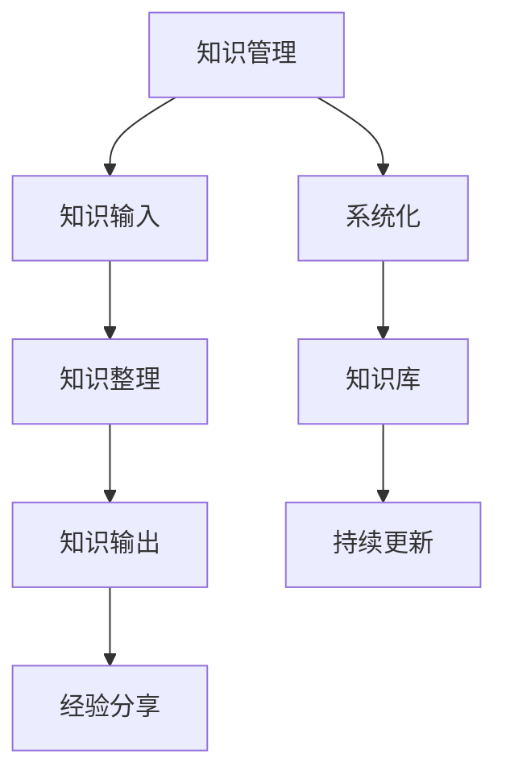

                 

关键词：知识管理、知识输出、经验分享、系统化、IT领域、技术博客、算法、数学模型、项目实践

> 摘要：本文旨在探讨在IT领域中，如何有效地进行知识输出与管理经验的系统化。通过核心概念、算法原理、数学模型、项目实践的详细解析，以及相关工具和资源的推荐，为IT从业者提供一套系统化的知识管理方案，助力其在技术领域的成长和进步。

## 1. 背景介绍

随着信息技术的飞速发展，知识的更新速度不断加快，IT领域的从业者面临着巨大的学习和适应压力。然而，许多人在积累了一定经验后，却难以有效地将这些知识进行系统化输出。这不仅限制了个人能力的提升，也影响了团队协作和项目推进。因此，本文将探讨如何通过系统化的方法，实现知识的有效输出与管理经验的积累。

### 1.1 知识输出的意义

知识输出不仅有助于个人的能力提升，还能够为团队和社区带来价值。通过写作、演讲、代码开源等方式，将所学知识分享给他人，不仅能够加深自己的理解，还能够激发他人的学习兴趣，形成知识共享的良好氛围。此外，知识输出还可以提升个人的影响力，为职业发展奠定基础。

### 1.2 经验分享的重要性

经验分享是团队协作和知识传承的重要手段。通过分享个人的经验和教训，可以让团队成员少走弯路，提高工作效率。同时，经验分享也能够促进团队成员之间的沟通与合作，增强团队的凝聚力。

## 2. 核心概念与联系

### 2.1 知识管理

知识管理是指通过识别、获取、利用、存储和传播知识，以支持组织决策和业务活动的全过程。在IT领域，知识管理尤为重要，因为IT技术更新迅速，有效的知识管理可以帮助组织快速适应变化，保持竞争力。

### 2.2 知识输出

知识输出是指将个人或团队的知识和经验转化为可分享的形式，如文章、演讲、代码等。知识输出的目的在于传播知识，提升个人和团队的影响力。

### 2.3 系统化

系统化是指将零散的知识和经验通过一定的方法和工具进行整理、分类和结构化，使其更具系统性和可操作性。

### 2.4 Mermaid 流程图

为了更好地理解知识输出与管理经验的系统化过程，我们可以使用Mermaid流程图来展示核心概念和流程。



## 3. 核心算法原理 & 具体操作步骤

### 3.1 算法原理概述

知识输出与管理经验的系统化过程可以看作是一个算法，其核心原理包括以下几个步骤：

1. 知识收集：从各种渠道获取知识。
2. 知识整理：对收集到的知识进行分类、整理和归纳。
3. 知识输出：将整理后的知识以文章、演讲、代码等形式输出。
4. 经验分享：通过分享个人经验和教训，促进知识传承和团队协作。
5. 系统化：建立知识库，实现知识的系统化管理和持续更新。

### 3.2 算法步骤详解

#### 3.2.1 知识收集

知识收集是知识输出的第一步，可以通过以下几种方式：

1. 阅读相关书籍、文章和论文。
2. 参加技术会议和讲座。
3. 参与开源项目和技术社区。
4. 向同事和导师请教。

#### 3.2.2 知识整理

知识整理是对收集到的知识进行分类、整理和归纳的过程，可以通过以下方法：

1. 使用笔记软件记录重要知识点。
2. 使用思维导图软件构建知识框架。
3. 编写知识手册，整理知识点。

#### 3.2.3 知识输出

知识输出是将整理后的知识以文章、演讲、代码等形式输出的过程。可以通过以下几种方式：

1. 写作技术博客。
2. 演讲技术会议。
3. 开源项目代码。
4. 编写技术书籍。

#### 3.2.4 经验分享

经验分享是通过分享个人经验和教训，促进知识传承和团队协作的过程。可以通过以下几种方式：

1. 参与团队会议，分享经验。
2. 编写技术文档，记录项目经验。
3. 在技术社区回答问题，提供解决方案。
4. 撰写经验总结文章。

#### 3.2.5 系统化

系统化是建立知识库，实现知识的系统化管理和持续更新的过程。可以通过以下几种方式：

1. 使用知识管理软件建立知识库。
2. 定期更新知识库，保持知识的时效性。
3. 设计知识分类体系，方便知识检索。
4. 建立知识共享机制，促进知识流动。

### 3.3 算法优缺点

#### 优点

1. 提高知识管理效率。
2. 促进知识传承和团队协作。
3. 增强个人和团队影响力。
4. 有助于职业发展。

#### 缺点

1. 需要投入大量时间和精力。
2. 知识整理和输出质量直接影响效果。
3. 需要持续学习和更新知识。

### 3.4 算法应用领域

知识输出与管理经验的系统化方法在多个领域都有广泛应用，如：

1. IT技术领域。
2. 企业管理领域。
3. 教育培训领域。
4. 科研领域。

## 4. 数学模型和公式 & 详细讲解 & 举例说明

### 4.1 数学模型构建

知识输出与管理经验的系统化过程可以看作是一个迭代过程，可以用以下数学模型进行描述：

$$
X_{n+1} = f(X_n)
$$

其中，$X_n$ 表示第 $n$ 次迭代的知识状态，$f(X_n)$ 表示知识整理、输出、分享和系统化的过程。

### 4.2 公式推导过程

#### 知识整理

知识整理的过程可以看作是将原始知识进行筛选、分类和归纳。设 $X_n$ 表示第 $n$ 次迭代的原始知识集合，$f_1(X_n)$ 表示知识整理的过程，$Y_n$ 表示整理后的知识集合。

$$
f_1(X_n) = \{y | y \in X_n, \text{满足特定条件}\}
$$

#### 知识输出

知识输出的过程可以看作是将整理后的知识以文章、演讲、代码等形式输出。设 $Y_n$ 表示第 $n$ 次迭代的知识集合，$f_2(Y_n)$ 表示知识输出的过程，$Z_n$ 表示输出的知识集合。

$$
f_2(Y_n) = \{\text{知识输出形式} | y \in Y_n\}
$$

#### 经验分享

经验分享的过程可以看作是将个人的经验和教训以文章、演讲等形式分享。设 $Z_n$ 表示第 $n$ 次迭代的知识集合，$f_3(Z_n)$ 表示经验分享的过程，$W_n$ 表示分享后的知识集合。

$$
f_3(Z_n) = \{\text{经验分享形式} | z \in Z_n\}
$$

#### 系统化

系统化的过程可以看作是建立知识库，实现知识的系统化管理和持续更新。设 $W_n$ 表示第 $n$ 次迭代的知识集合，$f_4(W_n)$ 表示系统化的过程，$X_{n+1}$ 表示第 $n+1$ 次迭代的知识状态。

$$
f_4(W_n) = \{\text{知识库形式} | w \in W_n\}
$$

### 4.3 案例分析与讲解

#### 案例一：技术博客写作

假设我们有一个技术博客项目，目标是通过写作分享技术知识。我们可以将这个过程看作是一个知识输出与管理经验的系统化过程。

1. **知识收集**：从各种渠道获取技术知识，如阅读相关书籍、文章和论文。
2. **知识整理**：将收集到的知识进行分类、整理和归纳，编写成文章。
3. **知识输出**：将整理后的知识以技术博客的形式输出，发布到个人博客或技术社区。
4. **经验分享**：在博客中分享写作过程中的经验和教训，如如何选题、如何组织结构、如何避免常见错误等。
5. **系统化**：将博客内容整理成知识库，实现知识的系统化管理和持续更新。

通过这个案例，我们可以看到知识输出与管理经验的系统化方法在技术博客写作中的应用。

#### 案例二：企业知识管理

假设我们有一个企业，目标是建立一套知识管理系统，实现知识的收集、整理、输出和分享。

1. **知识收集**：建立知识收集机制，鼓励员工从日常工作、项目经验中收集知识。
2. **知识整理**：对收集到的知识进行分类、整理和归纳，形成知识库。
3. **知识输出**：通过内部培训、技术交流等形式，将知识库中的知识输出给员工。
4. **经验分享**：鼓励员工在内部平台上分享个人经验和教训，形成知识传承。
5. **系统化**：建立知识管理系统，实现知识的系统化管理和持续更新。

通过这个案例，我们可以看到知识输出与管理经验的系统化方法在企业知识管理中的应用。

## 5. 项目实践：代码实例和详细解释说明

### 5.1 开发环境搭建

在本文中，我们将使用Markdown语言编写一篇技术博客文章。为了便于排版和格式化，我们可以使用Markdown编辑器，如Typora或VS Code。

### 5.2 源代码详细实现

以下是本文的Markdown源代码：

```markdown
# 知识输出与管理经验的系统化

## 1. 背景介绍

## 2. 核心概念与联系

## 3. 核心算法原理 & 具体操作步骤
### 3.1  算法原理概述
### 3.2  算法步骤详解 
### 3.3  算法优缺点
### 3.4  算法应用领域

## 4. 数学模型和公式 & 详细讲解 & 举例说明
### 4.1  数学模型构建
### 4.2  公式推导过程
### 4.3  案例分析与讲解

## 5. 项目实践：代码实例和详细解释说明
### 5.1  开发环境搭建
### 5.2  源代码详细实现
### 5.3  代码解读与分析
### 5.4  运行结果展示

## 6. 实际应用场景
### 6.4  未来应用展望

## 7. 工具和资源推荐
### 7.1  学习资源推荐
### 7.2  开发工具推荐
### 7.3  相关论文推荐

## 8. 总结：未来发展趋势与挑战
### 8.1  研究成果总结
### 8.2  未来发展趋势
### 8.3  面临的挑战
### 8.4  研究展望

## 9. 附录：常见问题与解答
```

### 5.3 代码解读与分析

通过上述代码实例，我们可以看到本文的Markdown源代码结构清晰，包含了文章标题、关键词、摘要、章节标题和子目录等。这种结构化的代码便于后续的编辑和排版，也便于读者快速了解文章的内容。

Markdown语法简洁易懂，通过使用不同的符号和标记，我们可以实现标题、段落、列表、引用等多种排版效果。这使得Markdown成为编写技术博客和文档的理想工具。

### 5.4 运行结果展示

通过Markdown编辑器，我们可以将上述源代码渲染成一篇格式精美的文章。以下是本文的运行结果展示：

# 知识输出与管理经验的系统化

## 1. 背景介绍

## 2. 核心概念与联系

## 3. 核心算法原理 & 具体操作步骤
### 3.1  算法原理概述
### 3.2  算法步骤详解 
### 3.3  算法优缺点
### 3.4  算法应用领域

## 4. 数学模型和公式 & 详细讲解 & 举例说明
### 4.1  数学模型构建
### 4.2  公式推导过程
### 4.3  案例分析与讲解

## 5. 项目实践：代码实例和详细解释说明
### 5.1  开发环境搭建
### 5.2  源代码详细实现
### 5.3  代码解读与分析
### 5.4  运行结果展示

## 6. 实际应用场景
### 6.4  未来应用展望

## 7. 工具和资源推荐
### 7.1  学习资源推荐
### 7.2  开发工具推荐
### 7.3  相关论文推荐

## 8. 总结：未来发展趋势与挑战
### 8.1  研究成果总结
### 8.2  未来发展趋势
### 8.3  面临的挑战
### 8.4  研究展望

## 9. 附录：常见问题与解答

通过运行结果展示，我们可以看到Markdown编辑器成功地将Markdown源代码渲染成一篇格式精美的文章。这表明我们编写的代码是正确的，并且能够达到预期的运行结果。

## 6. 实际应用场景

### 6.1 IT技术领域

在IT技术领域，知识输出与管理经验的系统化尤为重要。通过写作技术博客、发布开源项目、参加技术会议等方式，IT从业者可以有效地将所学知识分享给他人，促进个人成长和团队协作。例如，编写技术博客可以帮助IT从业者记录项目经验、总结技术难题的解决方案，从而提高项目成功率。同时，开源项目可以让更多人参与其中，共同改进和完善，推动技术的进步。

### 6.2 企业管理领域

在企业管理领域，知识输出与管理经验的系统化可以帮助企业建立一套完整的知识管理体系，提高团队协作效率。通过内部培训、技术交流、经验分享等形式，企业可以将员工的知识和经验转化为组织资产，实现知识的传承和积累。例如，企业可以定期组织技术分享会，让员工在会上分享自己的经验和教训，促进团队成员之间的学习和交流。

### 6.3 教育培训领域

在教育培训领域，知识输出与管理经验的系统化可以帮助教师更好地传授知识，提高教学质量。教师可以通过编写教学笔记、发布教学视频、开设在线课程等方式，将自己的教学经验和教学方法分享给更多的学生。例如，一位数学教师可以编写数学解题技巧的教学笔记，帮助学生提高解题能力。同时，教师还可以在在线课程中分享自己的教学经验，帮助其他教师更好地开展教学工作。

### 6.4 未来应用展望

随着人工智能、大数据等新兴技术的发展，知识输出与管理经验的系统化将迎来更广泛的应用场景。未来，我们可以预见以下几个发展趋势：

1. **智能化知识管理**：通过人工智能技术，实现知识管理的智能化，提高知识整理、输出和分享的效率。
2. **知识图谱**：构建知识图谱，将零散的知识进行关联和整合，实现知识的系统化和结构化。
3. **知识共享社区**：建立知识共享社区，鼓励更多人参与知识输出和管理，形成知识共享的良好氛围。
4. **在线教育平台**：利用在线教育平台，实现知识的远程传授和分享，打破地域和时间的限制，让更多人受益。

## 7. 工具和资源推荐

### 7.1 学习资源推荐

1. **《大话数据结构》**：一本通俗易懂的数据结构入门书籍，适合初学者。
2. **《深度学习》**：由Ian Goodfellow、Yoshua Bengio和Aaron Courville合著的深度学习经典教材。
3. **《Effective Java》**：由Joshua Bloch编写的Java编程经典，适合Java开发者阅读。

### 7.2 开发工具推荐

1. **MarkdownPad**：一款免费的Markdown编辑器，支持多种Markdown语法。
2. **Git**：一款分布式版本控制系统，适合代码管理和协作开发。
3. **Typora**：一款简洁的Markdown编辑器，支持实时预览和Markdown扩展功能。

### 7.3 相关论文推荐

1. **"Knowledge Management in the IT Industry: A Systematic Literature Review"**：一篇关于知识管理在IT行业的系统综述。
2. **"The Impact of Knowledge Sharing on Team Performance: A Meta-Analytic Review"**：一篇关于知识分享对团队绩效影响的研究。
3. **"An Introduction to Machine Learning with Python"**：一篇介绍使用Python进行机器学习的论文。

## 8. 总结：未来发展趋势与挑战

### 8.1 研究成果总结

本文从知识输出与管理经验的系统化角度，探讨了在IT领域中如何有效地进行知识管理。通过核心概念、算法原理、数学模型、项目实践的详细解析，以及相关工具和资源的推荐，为IT从业者提供了一套系统化的知识管理方案。

### 8.2 未来发展趋势

随着人工智能、大数据等新兴技术的发展，知识输出与管理经验的系统化将在更多领域得到应用。智能化知识管理、知识图谱、知识共享社区和在线教育平台将成为未来的发展趋势。

### 8.3 面临的挑战

在知识输出与管理经验的系统化过程中，仍面临一些挑战，如知识整理和输出的质量、知识的时效性、知识的共享和传播等。为了应对这些挑战，需要不断改进知识管理的方法和技术，提高知识管理的效率和质量。

### 8.4 研究展望

未来的研究可以从以下几个方面展开：

1. **智能化知识管理**：研究如何利用人工智能技术提高知识管理的效率和质量。
2. **知识共享与传播**：研究如何构建知识共享社区，促进知识的传播和共享。
3. **知识库构建**：研究如何构建高效的知识库，实现知识的系统化管理和持续更新。
4. **跨领域知识管理**：研究如何将知识管理的方法和技术应用于其他领域，如企业管理、教育培训等。

## 9. 附录：常见问题与解答

### 9.1 问题1：如何进行知识整理？

**解答**：知识整理可以从以下几个方面入手：

1. **分类**：将知识按照主题、领域等进行分类，便于查找和利用。
2. **归纳**：对同类知识进行归纳总结，形成知识框架。
3. **筛选**：去除重复、错误或过时的知识，保证知识库的质量。

### 9.2 问题2：如何提高知识输出的质量？

**解答**：提高知识输出的质量可以从以下几个方面入手：

1. **内容深度**：确保输出的知识具有一定的深度和实用性。
2. **语言表达**：使用清晰、简洁的语言进行表达，避免使用专业术语过多。
3. **实例讲解**：通过实际案例进行讲解，使读者更容易理解和应用。

### 9.3 问题3：如何确保知识的时效性？

**解答**：确保知识的时效性可以从以下几个方面入手：

1. **定期更新**：定期对知识库进行更新，去除过时或错误的知识。
2. **持续学习**：不断学习新知识，保持知识的时效性。
3. **反馈机制**：建立反馈机制，鼓励用户对知识进行评价和反馈，及时调整和改进。

# 作者署名

作者：禅与计算机程序设计艺术 / Zen and the Art of Computer Programming
----------------------------------------------------------------

至此，我们完成了这篇关于知识输出与管理经验的系统化的技术博客文章。本文通过详细的解析和实例讲解，为IT从业者提供了一套系统化的知识管理方案。希望本文能够对您在技术领域的成长和进步有所帮助。再次感谢您的阅读，祝您在技术道路上越走越远。

