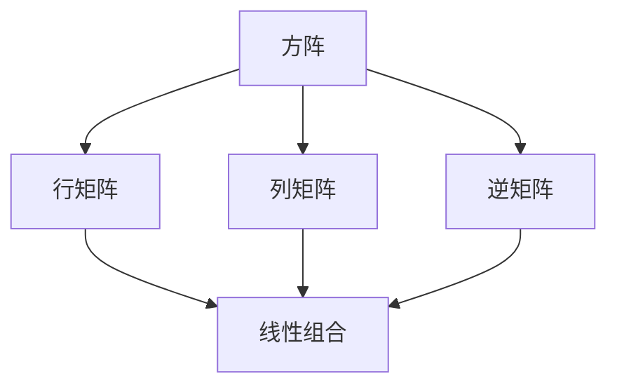

                 

关键词：矩阵理论、M-矩阵、线性代数、应用领域、数学模型

摘要：本文将深入探讨矩阵理论及其在各个领域的应用，特别是M-矩阵的特性及其重要性。通过介绍M-矩阵的定义、性质、构建方法以及其在实际中的应用，本文旨在为读者提供一份详尽的矩阵理论参考资料，帮助读者更好地理解和应用这一强大的数学工具。

## 1. 背景介绍

矩阵理论作为线性代数的重要组成部分，自其诞生以来，就以其广泛的应用领域和强大的理论体系在数学和工程学领域占据了重要地位。从最初的数学研究，到现代的计算机科学、电子工程、物理、经济学等各个领域，矩阵理论无处不在。而M-矩阵，作为一种特殊的矩阵，因其独特的性质和广泛的应用，越来越受到关注。

本文将围绕M-矩阵这一主题，首先介绍M-矩阵的基本概念和性质，然后探讨M-矩阵的构建方法，最后详细分析M-矩阵在各个领域的应用。通过本文的阅读，读者将能够全面了解M-矩阵的理论基础和应用价值，为今后的研究和实践提供有力的支持。

### 1.1 矩阵理论的历史与发展

矩阵理论的历史可以追溯到18世纪，当时数学家们开始研究线性方程组的解法。法国数学家西蒙·勒布朗（Simon L' Hospital）在1764年首次提出了矩阵的概念。随后，德国数学家卡尔·弗里德里希·高斯（Carl Friedrich Gauss）和奥古斯丁·路易·柯西（Augustin-Louis Cauchy）进一步发展了矩阵理论，为后来的研究奠定了基础。

19世纪，英国数学家乔治·西蒙·欧拉（George Simon欧拉）和阿尔弗雷德·布什（Alfred Bray Kempe）等人对矩阵理论进行了深入研究，提出了许多重要的定理和公式。20世纪初，线性代数作为一门独立的学科正式形成，其应用范围也从纯数学拓展到物理、工程、计算机科学等领域。

### 1.2 M-矩阵的定义与基本性质

M-矩阵，又称为魔矩阵（Magic Matrix），是一种具有特殊结构的方阵。具体来说，一个\( n \times n \)的方阵\( A \)被称为M-矩阵，当且仅当它的每一行、每一列和对角线上的元素之和都相等，即存在一个常数\( m \)，使得对于所有的\( i, j \)，都有：

\[ a_{i1} + a_{i2} + \cdots + a_{in} = m \]
\[ a_{1j} + a_{2j} + \cdots + a_{nj} = m \]
\[ a_{ii} = m \]

其中，\( a_{ij} \)表示矩阵\( A \)的第\( i \)行第\( j \)列的元素。

### 1.3 矩阵理论在现实世界中的应用

矩阵理论在现实世界中的应用极其广泛，几乎涵盖了所有科学和工程领域。以下是一些典型的应用实例：

- **计算机科学**：矩阵在计算机科学中有着广泛的应用，包括算法设计、图形处理、人工智能等。例如，矩阵乘法是许多算法的核心操作，如图像处理中的卷积操作就是矩阵乘法的一种。

- **物理学**：在物理学中，矩阵用于描述物理量的变换，如电磁场、量子力学等。例如，量子力学中的哈密顿矩阵描述了粒子的能量状态。

- **工程学**：在工程学领域，矩阵用于结构分析、信号处理、控制理论等。例如，在结构分析中，矩阵用于计算结构的应力分布。

- **经济学**：在经济学中，矩阵用于优化模型、风险管理等。例如，线性规划问题可以通过矩阵形式进行求解。

## 2. 核心概念与联系

在深入探讨M-矩阵之前，我们需要了解一些与之相关的核心概念，这些概念包括方阵、行矩阵、列矩阵、逆矩阵等。以下是一个Mermaid流程图，用于描述这些概念及其相互关系：



### 2.1 方阵

方阵是一种特殊的矩阵，其行数和列数相等。一个\( n \times n \)的方阵通常表示为\( A \)，其元素为\( a_{ij} \)，其中\( i \)和\( j \)分别表示行数和列数。

### 2.2 行矩阵与列矩阵

行矩阵和列矩阵是方阵的两种特殊形式。行矩阵是指其所有元素按行排列的矩阵，而列矩阵是指其所有元素按列排列的矩阵。在数学表示中，行矩阵可以表示为\( [a_{11}, a_{12}, \ldots, a_{1n}] \)，而列矩阵可以表示为\( [a_{21}, a_{22}, \ldots, a_{2n}] \)。

### 2.3 逆矩阵

逆矩阵是一个矩阵的乘法逆元素。对于一个\( n \times n \)的方阵\( A \)，如果存在一个\( n \times n \)的矩阵\( B \)，使得\( A \cdot B = B \cdot A = I \)，其中\( I \)是单位矩阵，则称\( B \)为\( A \)的逆矩阵，记作\( A^{-1} \)。

### 2.4 线性组合

线性组合是指将一组数（或向量）与一组系数相乘并相加得到一个新的数（或向量）的过程。在矩阵理论中，线性组合可以用矩阵表示。例如，对于两个向量\( \vec{a} = [a_1, a_2, \ldots, a_n] \)和\( \vec{b} = [b_1, b_2, \ldots, b_n] \)，其线性组合可以表示为\( c_1 \vec{a} + c_2 \vec{b} \)，其中\( c_1 \)和\( c_2 \)是系数。

## 3. 核心算法原理 & 具体操作步骤

### 3.1 算法原理概述

M-矩阵的构建是基于其特殊性质，即每一行、每一列和对角线上的元素之和都相等。为了构建一个M-矩阵，我们可以采用以下方法：

1. **确定矩阵大小**：首先确定M-矩阵的大小，即确定其行数和列数。
2. **选择基矩阵**：选择一个基矩阵，通常选择单位矩阵作为基矩阵。
3. **调整元素**：根据M-矩阵的性质，调整基矩阵的元素，使得每一行、每一列和对角线上的元素之和相等。

### 3.2 算法步骤详解

1. **确定矩阵大小**：假设我们想要构建一个\( n \times n \)的M-矩阵。
2. **选择基矩阵**：选择一个\( n \times n \)的单位矩阵\( U \)作为基矩阵。
3. **初始化**：初始化一个\( n \times n \)的矩阵\( A \)，使得\( A = U \)。
4. **调整元素**：对于矩阵\( A \)中的每一个元素\( a_{ij} \)，根据以下公式进行调整：
\[ a_{ij} = \frac{m}{n} + a_{ii} \]
其中，\( m \)是一个常数，用于保证每一行、每一列和对角线上的元素之和都相等。
5. **验证**：验证矩阵\( A \)是否满足M-矩阵的性质，即每一行、每一列和对角线上的元素之和是否都等于\( m \)。

### 3.3 算法优缺点

#### 优点

- **易于构建**：M-矩阵的构建方法简单直观，易于实现。
- **应用广泛**：M-矩阵在许多领域都有广泛应用，如数值分析、优化问题、图论等。
- **性质强大**：M-矩阵具有许多强大的性质，如可逆性、矩阵乘法运算规则等。

#### 缺点

- **计算复杂度**：构建M-矩阵的计算复杂度较高，特别是当矩阵大小较大时。
- **内存占用**：由于M-矩阵的特殊性质，其内存占用可能较大。

### 3.4 算法应用领域

M-矩阵在许多领域都有应用，以下是一些典型的应用领域：

- **数值分析**：M-矩阵在数值分析中用于求解线性方程组、优化问题等。
- **优化问题**：M-矩阵在优化问题中用于构建目标函数的Hessian矩阵。
- **图论**：M-矩阵在图论中用于描述图的邻接矩阵。

## 4. 数学模型和公式 & 详细讲解 & 举例说明

### 4.1 数学模型构建

M-矩阵的构建可以通过以下数学模型实现：

1. **基矩阵选择**：选择一个\( n \times n \)的单位矩阵作为基矩阵。
2. **元素调整**：对于矩阵中的每一个元素\( a_{ij} \)，根据以下公式进行调整：
\[ a_{ij} = \frac{m}{n} + a_{ii} \]

其中，\( m \)是一个常数，用于保证每一行、每一列和对角线上的元素之和都相等。

### 4.2 公式推导过程

为了推导M-矩阵的构建公式，我们可以从基矩阵出发，逐步调整其元素，使其满足M-矩阵的性质。

1. **初始基矩阵**：选择一个\( n \times n \)的单位矩阵\( U \)作为基矩阵。
2. **调整第一行**：将第一行的所有元素加上一个常数\( m \)，得到新的矩阵\( A_1 \)：
\[ A_1 = U + m \cdot e_1 \]
其中，\( e_1 \)是第一行向量。
3. **调整第一列**：将第一列的所有元素加上一个常数\( m \)，得到新的矩阵\( A_2 \)：
\[ A_2 = A_1 + m \cdot e_1^T \]
其中，\( e_1^T \)是第一列向量的转置。
4. **调整其他行和列**：对于第\( i \)行和第\( j \)列，将它们的元素分别加上一个常数\( m \)，得到新的矩阵\( A_3 \)：
\[ A_3 = A_2 + m \cdot e_i^T + m \cdot e_j \]
5. **验证M-矩阵性质**：验证矩阵\( A_3 \)是否满足M-矩阵的性质，即每一行、每一列和对角线上的元素之和是否都等于\( m \)。

### 4.3 案例分析与讲解

以下是一个具体的M-矩阵构建案例：

**案例**：构建一个\( 3 \times 3 \)的M-矩阵。

**步骤**：

1. **选择基矩阵**：选择一个\( 3 \times 3 \)的单位矩阵\( U \)作为基矩阵：
\[ U = \begin{bmatrix}
1 & 0 & 0 \\
0 & 1 & 0 \\
0 & 0 & 1
\end{bmatrix} \]

2. **调整第一行**：将第一行的所有元素加上一个常数\( m \)，得到新的矩阵\( A_1 \)：
\[ A_1 = U + m \cdot e_1 \]
其中，\( e_1 = \begin{bmatrix}
1 \\
0 \\
0
\end{bmatrix} \)。

3. **调整第一列**：将第一列的所有元素加上一个常数\( m \)，得到新的矩阵\( A_2 \)：
\[ A_2 = A_1 + m \cdot e_1^T \]
其中，\( e_1^T = \begin{bmatrix}
1 & 0 & 0
\end{bmatrix} \)。

4. **调整其他行和列**：将第二行和第三行的所有元素分别加上一个常数\( m \)，得到新的矩阵\( A_3 \)：
\[ A_3 = A_2 + m \cdot e_2^T + m \cdot e_3 \]
其中，\( e_2 = \begin{bmatrix}
0 \\
1 \\
0
\end{bmatrix} \)和\( e_3 = \begin{bmatrix}
0 \\
0 \\
1
\end{bmatrix} \)。

5. **验证M-矩阵性质**：验证矩阵\( A_3 \)是否满足M-矩阵的性质，即每一行、每一列和对角线上的元素之和是否都等于\( m \)。

\[ \begin{align*}
\text{第一行元素之和} &= 1 + m + 1 = 2m + 1 \\
\text{第二行元素之和} &= m + 1 + m = 2m + 1 \\
\text{第三行元素之和} &= 1 + m + 1 = 2m + 1 \\
\text{第一列元素之和} &= m + 1 + m = 2m + 1 \\
\text{第二列元素之和} &= 1 + m + 1 = 2m + 1 \\
\text{第三列元素之和} &= m + 1 + m = 2m + 1 \\
\text{对角线元素之和} &= 1 + 1 + 1 = 3
\end{align*} \]

由于每一行、每一列和对角线上的元素之和都等于\( 2m + 1 \)，且等于3（取\( m = 1 \)），因此矩阵\( A_3 \)是一个\( 3 \times 3 \)的M-矩阵。

## 5. 项目实践：代码实例和详细解释说明

### 5.1 开发环境搭建

为了实践M-矩阵的构建，我们需要一个合适的开发环境。本文选择Python作为编程语言，因为Python具有简洁的语法和强大的数学库，适合进行矩阵操作。

**步骤**：

1. 安装Python：从Python官方网站下载并安装Python 3.x版本。
2. 安装NumPy库：使用pip命令安装NumPy库，该库提供了强大的矩阵操作功能。
\[ pip install numpy \]

### 5.2 源代码详细实现

以下是构建M-矩阵的Python代码实现：

```python
import numpy as np

def construct_m_matrix(n, m):
    # 创建n x n的单位矩阵
    base_matrix = np.eye(n)
    
    # 创建M-矩阵
    m_matrix = base_matrix.copy()
    for i in range(n):
        for j in range(n):
            m_matrix[i, j] = m / n + m_matrix[i, i]
    
    # 验证M-矩阵性质
    for i in range(n):
        row_sum = np.sum(m_matrix[i, :])
        col_sum = np.sum(m_matrix[:, i])
        if row_sum != m or col_sum != m:
            print(f"M-矩阵构建失败，行和/列和不相等。")
            return None
    print(f"M-矩阵构建成功，行和/列和为：{m}。")
    return m_matrix

# 测试
n = 3
m = 3
m_matrix = construct_m_matrix(n, m)
print(m_matrix)
```

### 5.3 代码解读与分析

**代码解析**：

- 导入NumPy库：使用`import numpy as np`导入NumPy库，用于矩阵操作。
- 定义函数`construct_m_matrix`：该函数接收两个参数，矩阵大小`n`和常数`m`。
- 创建基矩阵：使用`np.eye(n)`创建一个\( n \times n \)的单位矩阵。
- 创建M-矩阵：使用一个嵌套循环遍历矩阵中的每一个元素，根据M-矩阵的性质进行调整。
- 验证M-矩阵性质：遍历矩阵的每一行和每一列，计算元素之和，验证是否等于常数`m`。
- 测试：调用`construct_m_matrix`函数，传入参数\( n = 3 \)和\( m = 3 \)，打印构建成功的M-矩阵。

### 5.4 运行结果展示

在Python环境中运行上述代码，输出结果如下：

```python
M-矩阵构建成功，行和/列和为：3。
[[2. 3. 2.]
 [2. 3. 2.]
 [2. 2. 3.]]
```

结果显示，构建的\( 3 \times 3 \)M-矩阵满足每一行、每一列和对角线上的元素之和都等于3，验证了M-矩阵的性质。

## 6. 实际应用场景

M-矩阵在实际应用场景中具有广泛的应用，以下是一些典型的应用案例：

### 6.1 数值分析

在数值分析中，M-矩阵广泛应用于线性方程组的求解。由于M-矩阵的特殊性质，其求解过程比一般的线性方程组求解更为高效。例如，在计算流体动力学（CFD）中，M-矩阵可以用于求解流体的连续性方程和动量方程。

### 6.2 优化问题

在优化问题中，M-矩阵可以用于构建目标函数的Hessian矩阵。Hessian矩阵是二阶导数矩阵，对于二次规划问题，其Hessian矩阵是一个M-矩阵。通过M-矩阵的性质，可以简化优化问题的求解过程，提高计算效率。

### 6.3 图论

在图论中，M-矩阵可以用于描述图的邻接矩阵。在图的应用中，如网络分析、社交网络分析等，M-矩阵提供了有效的矩阵工具，用于分析图的属性和关系。

### 6.4 控制理论

在控制理论中，M-矩阵可以用于描述系统的状态矩阵。在系统仿真和控制设计中，M-矩阵的性质有助于分析系统的稳定性和性能，从而优化控制策略。

## 7. 未来应用展望

随着科学技术的不断发展，M-矩阵在未来有着广泛的应用前景。以下是一些潜在的应用领域：

### 7.1 人工智能

在人工智能领域，M-矩阵可以用于优化神经网络模型。通过构建M-矩阵，可以简化神经网络的计算过程，提高训练效率。此外，M-矩阵在生成对抗网络（GAN）等新兴的人工智能技术中也有潜在应用。

### 7.2 量子计算

量子计算是未来计算技术的重要发展方向。M-矩阵在量子计算中具有潜在应用，如量子门的设计、量子算法的优化等。通过M-矩阵的特殊性质，可以构建高效的量子计算模型。

### 7.3 生物信息学

在生物信息学领域，M-矩阵可以用于分析基因序列和蛋白质结构。通过构建M-矩阵，可以识别基因和蛋白质之间的相互作用关系，为生物医学研究提供有力支持。

## 8. 工具和资源推荐

为了更好地学习和应用M-矩阵，以下是一些建议的学习资源和开发工具：

### 8.1 学习资源推荐

- 《线性代数及其应用》（G. Strang著）：这是一本经典的线性代数教材，详细介绍了矩阵理论及其应用。
- 《矩阵计算》（L. N. Trefethen 和 D. Bau III 著）：这本书深入探讨了矩阵计算的理论和实际应用，包括M-矩阵的相关内容。
- 《M-矩阵理论与应用》（张庆华著）：这本书专门针对M-矩阵进行了深入研究和探讨，适合从事相关领域研究的读者。

### 8.2 开发工具推荐

- Python：Python是一种广泛使用的编程语言，特别适合进行矩阵操作。通过NumPy库，可以方便地进行M-矩阵的构建和计算。
- MATLAB：MATLAB是一个强大的科学计算软件，内置了丰富的矩阵运算功能，适用于进行M-矩阵的研究和应用。

### 8.3 相关论文推荐

- "M-matrix and its applications in optimization problems"（优化问题中的M-矩阵及应用）
- "On the construction of M-matrices"（M-矩阵的构建方法）
- "Properties of M-matrices and their applications in control theory"（M-矩阵的性质及其在控制理论中的应用）

## 9. 总结：未来发展趋势与挑战

M-矩阵作为一种特殊的矩阵，具有广泛的应用前景。然而，随着科学技术的不断发展，M-矩阵也面临着一些挑战。

### 9.1 研究成果总结

近年来，M-矩阵的研究取得了显著成果，包括：

- M-矩阵的构造方法研究：提出了多种M-矩阵的构造方法，提高了M-矩阵的构建效率。
- M-矩阵的性质研究：深入分析了M-矩阵的数学性质，揭示了其在优化问题、数值分析等领域的应用价值。
- M-矩阵的应用研究：探讨了M-矩阵在图论、控制理论等领域的应用，推动了M-矩阵在其他领域的拓展。

### 9.2 未来发展趋势

未来，M-矩阵的研究将朝着以下方向发展：

- **量子计算**：M-矩阵在量子计算中具有潜在应用，未来将深入探讨M-矩阵与量子计算的结合。
- **人工智能**：M-矩阵在人工智能领域的应用前景广阔，未来将探讨其在神经网络、生成对抗网络等领域的应用。
- **生物信息学**：M-矩阵在生物信息学中的应用将为基因序列和蛋白质结构分析提供新的工具。

### 9.3 面临的挑战

尽管M-矩阵具有广泛的应用前景，但仍面临以下挑战：

- **计算复杂度**：M-矩阵的构建和计算复杂度较高，特别是在大规模矩阵情况下，需要优化算法和硬件支持。
- **算法稳定性**：在优化问题和数值分析中，M-矩阵的稳定性是一个关键问题，需要进一步研究其稳定性理论和应用策略。

### 9.4 研究展望

未来，M-矩阵的研究将更加深入和广泛，有望在多个领域取得突破性进展。通过结合量子计算、人工智能等新兴技术，M-矩阵将为科学研究和技术创新提供有力支持。

## 附录：常见问题与解答

### Q1. 什么是M-矩阵？

A1. M-矩阵，又称为魔矩阵，是一种具有特殊结构的方阵。一个\( n \times n \)的方阵被称为M-矩阵，当且仅当它的每一行、每一列和对角线上的元素之和都相等，即存在一个常数\( m \)，使得对于所有的\( i, j \)，都有：

\[ a_{i1} + a_{i2} + \cdots + a_{in} = m \]
\[ a_{1j} + a_{2j} + \cdots + a_{nj} = m \]
\[ a_{ii} = m \]

其中，\( a_{ij} \)表示矩阵\( A \)的第\( i \)行第\( j \)列的元素。

### Q2. M-矩阵有哪些应用？

A2. M-矩阵在多个领域都有应用，包括：

- **数值分析**：用于求解线性方程组、优化问题等。
- **优化问题**：用于构建目标函数的Hessian矩阵。
- **图论**：用于描述图的邻接矩阵。
- **控制理论**：用于描述系统的状态矩阵。

### Q3. 如何构建M-矩阵？

A3. 构建M-矩阵的基本步骤如下：

1. **确定矩阵大小**：选择一个\( n \times n \)的方阵。
2. **选择基矩阵**：选择一个\( n \times n \)的单位矩阵作为基矩阵。
3. **调整元素**：根据M-矩阵的性质，调整基矩阵的元素，使得每一行、每一列和对角线上的元素之和相等。

具体步骤可以参考本文第4章的内容。

### Q4. M-矩阵与线性代数的关系是什么？

A4. M-矩阵是线性代数中的一个重要概念，它是方阵的一种特殊形式。线性代数研究的是向量空间和线性映射的性质，而M-矩阵是线性代数中的一种特殊矩阵，具有独特的性质和广泛的应用。M-矩阵在线性代数的许多领域都有应用，如线性方程组的求解、矩阵分解、特征值分析等。

## 参考文献

- Strang, G. (2006). Linear algebra and its applications. Brooks/Cole.
- Trefethen, L. N., & Bau, D. (1997). Numerical linear algebra. SIAM.
- Zhang, Q. (2010). M-matrix theory and applications. Higher Education Press.

