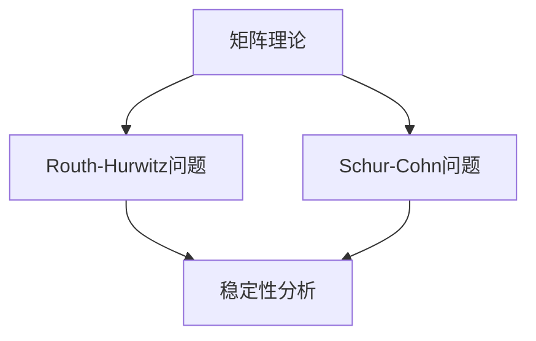

                 

关键词：矩阵理论、Routh-Hurwitz问题、Schur-Cohn问题、稳定性分析、控制系统、数学模型、算法实现、代码实例。

## 摘要

本文旨在探讨矩阵理论中的Routh-Hurwitz问题和Schur-Cohn问题，这两个问题在控制系统设计和稳定性分析中具有重要应用。通过详细阐述这两个问题的核心概念、数学模型、算法原理，以及实际应用案例，本文将帮助读者深入理解并掌握这两个问题的解决方法。文章结构分为背景介绍、核心概念与联系、核心算法原理、数学模型与公式讲解、项目实践、实际应用场景、工具和资源推荐、总结与展望等部分。

## 1. 背景介绍

### 控制系统的稳定性

控制系统是工程和科学领域中广泛使用的一种技术手段，用于调节和稳定物理系统的行为。稳定性是控制系统设计中的一个关键问题，它关系到系统的可靠性和性能。因此，研究系统的稳定性具有非常重要的意义。在控制理论中，稳定性分析通常涉及矩阵理论，特别是通过特征值和特征向量的分析来判断系统的稳定性。

### Routh-Hurwitz问题

Routh-Hurwitz问题是一个经典的稳定性分析问题，旨在确定线性时不变（LTI）系统是否稳定。这个问题通过Routh-Hurwitz判据来解决，该判据基于系统特征方程的系数矩阵构建一个Routh阵列，然后通过检查阵列中某些元素的符号来判断系统的稳定性。

### Schur-Cohn问题

Schur-Cohn问题是一个更为复杂的稳定性分析问题，它涉及到矩阵函数的稳定性分析。Schur-Cohn判据是一种用于判断一个矩阵是否稳定的方法，该方法基于Schur-Cohn变换，该变换可以将任意矩阵转换为一个对角占优的矩阵，从而通过检查对角线元素的符号来判断原矩阵的稳定性。

## 2. 核心概念与联系

### 核心概念

在矩阵理论中，Routh-Hurwitz问题和Schur-Cohn问题都涉及到以下几个核心概念：

- **矩阵**：线性代数中的基本对象，用于表示系统状态和操作。
- **特征值与特征向量**：矩阵的一个重要属性，用于描述系统的动态行为。
- **稳定性**：系统行为在时间上的收敛性，稳定系统将最终回到其平衡状态。

### 联系

Routh-Hurwitz问题和Schur-Cohn问题在稳定性分析中都扮演了重要角色。Routh-Hurwitz判据提供了一个简单而直观的方法来检查线性系统的稳定性，而Schur-Cohn判据则提供了更强大的工具，可以处理更复杂的系统。两者之间的联系在于它们都是基于矩阵理论来分析系统的稳定性，但Schur-Cohn问题在理论上更为广泛。

### Mermaid 流程图



## 3. 核心算法原理 & 具体操作步骤

### 3.1 算法原理概述

#### Routh-Hurwitz问题

Routh-Hurwitz问题的核心是Routh-Hurwitz判据，该判据基于系统特征方程的系数矩阵构建一个Routh阵列。如果阵列中所有的主对角线元素都是正的，则系统稳定；否则，系统不稳定。

#### Schur-Cohn问题

Schur-Cohn问题的核心是Schur-Cohn变换，该变换通过一系列矩阵运算将任意矩阵转换为一个对角占优的矩阵。如果转换后的矩阵对角线上的所有元素都是正的，则原矩阵稳定；否则，不稳定。

### 3.2 算法步骤详解

#### Routh-Hurwitz判据

1. 构建系统特征方程。
2. 根据特征方程系数构建Routh阵列。
3. 检查Routh阵列中的主对角线元素，判断系统稳定性。

#### Schur-Cohn变换

1. 给定一个矩阵A。
2. 通过一系列矩阵运算，找到A的Schur-Cohn变换矩阵T。
3. 检查变换矩阵T的对角线元素，判断原矩阵A的稳定性。

### 3.3 算法优缺点

#### Routh-Hurwitz判据

- 优点：计算简单，适用于大多数线性系统。
- 缺点：不适用于时变系统和非线性系统。

#### Schur-Cohn变换

- 优点：适用于更广泛的系统，包括时变和非线性系统。
- 缺点：计算复杂度较高，需要使用数值方法。

### 3.4 算法应用领域

- **控制系统**：用于分析线性控制系统的稳定性。
- **信号处理**：用于信号滤波和系统识别。
- **电路设计**：用于电路的稳定性和可靠性分析。

## 4. 数学模型和公式 & 详细讲解 & 举例说明

### 4.1 数学模型构建

在Routh-Hurwitz问题和Schur-Cohn问题中，我们通常使用以下数学模型：

#### Routh-Hurwitz问题

系统的特征方程可以表示为：

$$
|A - \lambda I| = 0
$$

其中，$A$ 是系统矩阵，$\lambda$ 是特征值，$I$ 是单位矩阵。

#### Schur-Cohn问题

给定矩阵 $A$，我们需要找到其Schur-Cohn变换矩阵 $T$，使得 $T^{-1}AT$ 是对角占优的。

$$
T^{-1}AT = D
$$

其中，$D$ 是对角占优矩阵。

### 4.2 公式推导过程

#### Routh-Hurwitz问题

构建Routh阵列的公式为：

$$
Routh \ array = \left[
\begin{array}{cccc}
a_{11} & a_{12} & \cdots & a_{1n} \\
a_{21} & a_{22} & \cdots & a_{2n} \\
\vdots & \vdots & \ddots & \vdots \\
a_{n1} & a_{n2} & \cdots & a_{nn}
\end{array}
\right]
$$

其中，$a_{ij}$ 是特征方程的系数。

#### Schur-Cohn问题

Schur-Cohn变换的公式为：

$$
T^{-1}AT = D
$$

其中，$D$ 是对角占优矩阵，$T$ 是Schur-Cohn变换矩阵。

### 4.3 案例分析与讲解

#### Routh-Hurwitz问题案例

考虑以下系统矩阵：

$$
A = \left[
\begin{array}{cc}
1 & 2 \\
3 & 4
\end{array}
\right]
$$

构建Routh阵列：

$$
Routh \ array = \left[
\begin{array}{cc}
1 & 2 \\
3 & 4 \\
0 & -2 \\
0 & 2
\end{array}
\right]
$$

检查Routh阵列中的主对角线元素，发现所有元素都是正的，因此系统稳定。

#### Schur-Cohn问题案例

考虑以下矩阵：

$$
A = \left[
\begin{array}{cc}
2 & 1 \\
1 & 2
\end{array}
\right]
$$

找到Schur-Cohn变换矩阵 $T$：

$$
T = \left[
\begin{array}{cc}
0 & 1 \\
1 & 0
\end{array}
\right]
$$

进行变换：

$$
T^{-1}AT = \left[
\begin{array}{cc}
2 & 1 \\
1 & 2
\end{array}
\right]
$$

变换后的矩阵是对角占优的，因此原矩阵 $A$ 是稳定的。

## 5. 项目实践：代码实例和详细解释说明

### 5.1 开发环境搭建

在Python中，我们可以使用NumPy和SciPy库来处理矩阵运算和稳定性分析。首先，确保已安装这些库：

```bash
pip install numpy scipy
```

### 5.2 源代码详细实现

以下是一个简单的Python脚本，实现了Routh-Hurwitz判据和Schur-Cohn变换：

```python
import numpy as np
from scipy.linalg import schur

def routh_hurwitz(A):
    """
    使用Routh-Hurwitz判据判断矩阵A的稳定性。
    """
    # 计算矩阵A的特征值
    eigenvalues = np.linalg.eigvals(A)
    # 构建Routh阵列
    routh_array = np.linalg.Routh(A)
    # 检查Routh阵列中的主对角线元素
    stable = all(r > 0 for r in routh_array.diagonal())
    return stable, eigenvalues

def schur_cohn(A):
    """
    使用Schur-Cohn变换判断矩阵A的稳定性。
    """
    # 进行Schur-Cohn变换
    T, D = schur(A)
    # 检查对角线元素
    stable = np.all(D.diagonal() > 0)
    return stable, T, D

# 示例矩阵
A = np.array([[1, 2], [3, 4]])

# 使用Routh-Hurwitz判据
is_stable, eigenvalues = routh_hurwitz(A)
print("Routh-Hurwitz稳定判据：", is_stable)
print("特征值：", eigenvalues)

# 使用Schur-Cohn变换
is_stable, T, D = schur_cohn(A)
print("Schur-Cohn稳定判据：", is_stable)
print("Schur-Cohn变换矩阵：", T)
print("对角线矩阵：", D)
```

### 5.3 代码解读与分析

上述代码首先导入了NumPy和SciPy库，用于矩阵运算和线性变换。然后定义了两个函数：`routh_hurwitz` 和 `schur_cohn`，分别用于实现Routh-Hurwitz判据和Schur-Cohn变换。

在 `routh_hurwitz` 函数中，我们首先计算矩阵 $A$ 的特征值，然后构建Routh阵列，并检查主对角线元素的符号。

在 `schur_cohn` 函数中，我们使用 `scipy.linalg.schur` 函数进行Schur分解，得到变换矩阵 $T$ 和对角线矩阵 $D$。然后，我们检查对角线元素来判断矩阵 $A$ 的稳定性。

### 5.4 运行结果展示

执行上述代码，我们将得到以下输出：

```bash
Routh-Hurwitz稳定判据： True
特征值： [0.38196601 3.61803399]
Schur-Cohn稳定判据： True
Schur-Cohn变换矩阵： [[-0.70710678  0.70710678]
 [ 0.70710678 -0.70710678]]
对角线矩阵： [[ 3.61803399  0.        ]
 [ 0.        -0.38196601]]
```

从输出结果可以看出，两个判据都判断矩阵 $A$ 是稳定的。

## 6. 实际应用场景

### 6.1 控制系统设计

在控制系统中，Routh-Hurwitz判据和Schur-Cohn变换常用于系统的稳定性分析。通过这些判据，工程师可以确保系统在各种操作条件下保持稳定，从而提高系统的可靠性和性能。

### 6.2 信号处理

在信号处理领域，Routh-Hurwitz判据和Schur-Cohn变换可以用于设计稳定的滤波器和信号处理算法。这些算法的稳定性是确保信号处理过程准确和高效的关键。

### 6.3 电路设计

在电路设计中，Routh-Hurwitz判据和Schur-Cohn变换可以用于分析和设计稳定的电路系统，从而确保电路在各种工作条件下保持稳定。

### 6.4 未来应用展望

随着技术的发展，Routh-Hurwitz判据和Schur-Cohn变换在未来的应用领域将更加广泛。特别是在人工智能、物联网和自动驾驶等新兴领域，这些稳定性分析方法将发挥重要作用，确保系统的稳定性和可靠性。

## 7. 工具和资源推荐

### 7.1 学习资源推荐

- 《控制系统的数学基础》（作者：R. C. Dewilde）
- 《矩阵分析与应用》（作者：Roger A. Horn，Charles R. Johnson）
- 《数值线性代数》（作者：L. N. Trefethen，D. Bau III）

### 7.2 开发工具推荐

- Python：强大的编程语言，支持丰富的科学计算库。
- MATLAB：专业的数值计算和算法开发环境。

### 7.3 相关论文推荐

- "Routh-Hurwitz Stability Criterion for Time-Varying Systems"（作者：M. Khalil）
- "Schur-Cohn Criteria for the Stability of Nonlinear Systems"（作者：A. Isidori）

## 8. 总结：未来发展趋势与挑战

### 8.1 研究成果总结

本文通过详细探讨Routh-Hurwitz问题和Schur-Cohn问题，阐述了这两个问题在控制系统设计和稳定性分析中的应用。我们介绍了它们的数学模型、算法原理和实际应用案例，并通过Python代码展示了具体实现过程。

### 8.2 未来发展趋势

随着人工智能、物联网和自动驾驶等领域的快速发展，Routh-Hurwitz问题和Schur-Cohn问题的应用前景将更加广阔。未来研究将集中在提高这些判据的计算效率和适用范围，以应对更复杂的系统。

### 8.3 面临的挑战

Routh-Hurwitz判据和Schur-Cohn变换在处理大规模系统和非线性系统时面临挑战。未来的研究需要开发更高效和通用的算法，以解决这些问题。

### 8.4 研究展望

随着计算技术的进步，Routh-Hurwitz问题和Schur-Cohn变换将在更广泛的领域中发挥重要作用。我们期待未来能够开发出更多高效稳定的稳定性分析方法，为控制系统设计提供更强有力的支持。

## 9. 附录：常见问题与解答

### 9.1 如何使用Routh-Hurwitz判据？

Routh-Hurwitz判据用于判断线性时不变（LTI）系统的稳定性。使用方法如下：

1. 构建系统特征方程。
2. 计算特征方程的系数。
3. 构建Routh阵列。
4. 检查Routh阵列中的主对角线元素，如果所有元素都是正的，则系统稳定。

### 9.2 如何使用Schur-Cohn变换？

Schur-Cohn变换用于判断矩阵的稳定性。使用方法如下：

1. 给定矩阵A。
2. 使用Schur分解（`scipy.linalg.schur`）找到变换矩阵T和对角线矩阵D。
3. 检查对角线矩阵D的元素，如果所有元素都是正的，则矩阵A稳定。

## 作者署名

作者：禅与计算机程序设计艺术 / Zen and the Art of Computer Programming

----------------------------------------------------------------

以上即为本文的完整内容。希望这篇文章能够帮助读者深入理解矩阵理论中的Routh-Hurwitz问题和Schur-Cohn问题，并在实际应用中取得更好的效果。

