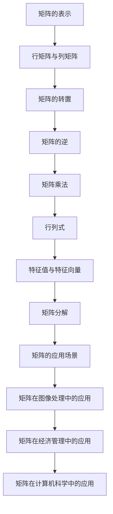

                 

关键词：矩阵理论、基本概念、｛1｝-逆、应用场景、算法原理、数学模型、代码实例

摘要：本文旨在系统地介绍矩阵理论中的基本概念和｛1｝-逆，通过详细的理论分析和实际应用案例，探讨矩阵理论在计算机科学和相关领域的广泛应用及其潜在价值。本文分为多个章节，包括背景介绍、核心概念与联系、核心算法原理、数学模型和公式讲解、项目实践、实际应用场景、工具和资源推荐以及总结与展望。

## 1. 背景介绍

矩阵理论作为线性代数的核心内容，不仅在数学研究中具有重要地位，还在计算机科学、物理学、经济学等多个领域有着广泛的应用。矩阵作为一种数学工具，可以有效地表示和操作多维度数据，为解决复杂的线性问题提供了一种简洁且强有力的方法。本文将围绕矩阵的基本概念和｛1｝-逆，探讨其在实际应用中的重要性。

### 1.1 矩阵理论的起源与发展

矩阵的概念最早可以追溯到19世纪，由英国数学家Arthur Cayley在研究行列式时提出。矩阵理论的迅速发展伴随着计算机科学的崛起，特别是在20世纪中后期，随着算法和计算能力的提升，矩阵理论在各个领域的应用更加广泛和深入。

### 1.2 矩阵理论在现代科学中的作用

矩阵理论在现代科学中的作用不可忽视。例如，在图像处理中，矩阵用于表示图像的像素数据，通过矩阵操作实现图像的增强、滤波和压缩等。在经济学中，矩阵被用于优化问题和资源分配，通过线性规划方法求解最大化收益或最小化成本。在计算机科学中，矩阵理论是设计算法和分析算法复杂性的基础。

## 2. 核心概念与联系

为了更好地理解矩阵理论，我们首先需要掌握一些核心概念，包括矩阵的表示、性质和操作。以下是一个使用Mermaid绘制的流程图，展示了矩阵理论中的一些基本概念及其相互关系。



### 2.1 矩阵的表示

矩阵是按一定方式排列的数字的集合，通常用大写字母表示，如$A$。矩阵的行数和列数分别表示矩阵的阶数。一个$m \times n$的矩阵可以表示为：

$$
A = \begin{pmatrix}
a_{11} & a_{12} & \cdots & a_{1n} \\
a_{21} & a_{22} & \cdots & a_{2n} \\
\vdots & \vdots & \ddots & \vdots \\
a_{m1} & a_{m2} & \cdots & a_{mn}
\end{pmatrix}
$$

### 2.2 矩阵的性质

矩阵具有多种性质，包括矩阵的转置、逆、行列式和特征值等。以下是对这些性质的简要描述：

- **矩阵的转置**：将矩阵的行和列互换，得到新矩阵。转置矩阵通常用大写字母加撇号表示，如$A'$。
- **矩阵的逆**：如果矩阵$A$的行列式不为零，则存在唯一的逆矩阵$A^{-1}$，使得$AA^{-1} = A^{-1}A = I$，其中$I$是单位矩阵。
- **行列式**：矩阵的一个标量值，用于判断矩阵的可逆性。行列式的计算有多种方法，如拉普拉斯展开和行列式公式。
- **特征值与特征向量**：矩阵$A$的特征值$\lambda$和对应的特征向量$v$满足$Av = \lambda v$。特征值和特征向量在矩阵分解和数据分析中具有重要应用。

### 2.3 矩阵的操作

矩阵的操作包括矩阵乘法、矩阵加法、矩阵减法等。以下是对这些操作的简要描述：

- **矩阵乘法**：两个矩阵$A$和$B$的乘积$C = AB$是一个$m \times n$的矩阵，其中$C_{ij} = \sum_{k=1}^{n}a_{ik}b_{kj}$。
- **矩阵加法与减法**：两个相同维度的矩阵可以直接相加或相减，结果矩阵的对应元素分别相加或相减。

## 3. 核心算法原理 & 具体操作步骤

在理解了矩阵的基本概念和操作后，我们接下来将探讨矩阵理论中的核心算法原理和具体操作步骤。

### 3.1 算法原理概述

矩阵理论中的核心算法主要包括矩阵乘法、矩阵分解、特征值计算等。以下是这些算法的基本原理：

- **矩阵乘法**：矩阵乘法是计算两个矩阵的乘积，根据矩阵的阶数和元素值进行计算。
- **矩阵分解**：矩阵分解是将一个矩阵分解为多个简单矩阵的乘积，如奇异值分解（SVD）和LU分解等。
- **特征值计算**：特征值计算是寻找矩阵的特征值和特征向量，通过求解特征方程得到。

### 3.2 算法步骤详解

以下是对矩阵理论中核心算法的详细步骤描述：

#### 3.2.1 矩阵乘法

矩阵乘法的步骤如下：

1. 确定输入矩阵$A$和$B$的阶数。
2. 创建结果矩阵$C$，其阶数为$A$的行数与$B$的列数。
3. 对于$C$中的每个元素$C_{ij}$，计算$\sum_{k=1}^{n}a_{ik}b_{kj}$。
4. 返回结果矩阵$C$。

#### 3.2.2 矩阵分解

常见的矩阵分解算法包括奇异值分解（SVD）和LU分解等。

- **奇异值分解（SVD）**：

  奇异值分解的步骤如下：

  1. 计算矩阵$A$的奇异值分解$A = U\Sigma V^T$，其中$U$和$V$是正交矩阵，$\Sigma$是对角矩阵。
  2. 返回分解后的三个矩阵$U$、$\Sigma$和$V^T$。

- **LU分解**：

  LU分解的步骤如下：

  1. 选择合适的消元顺序。
  2. 对矩阵$A$进行高斯消元，得到下三角矩阵$L$和上三角矩阵$U$。
  3. 返回分解后的两个矩阵$L$和$U$。

#### 3.2.3 特征值计算

特征值计算的步骤如下：

1. 构造特征方程$det(A - \lambda I) = 0$。
2. 求解特征方程，得到特征值$\lambda$。
3. 对于每个特征值，求解方程$(A - \lambda I)v = 0$，得到对应的特征向量$v$。

### 3.3 算法优缺点

每种矩阵算法都有其优缺点，以下是对一些常见算法的优缺点分析：

- **矩阵乘法**：

  - 优点：矩阵乘法是计算两个矩阵乘积的标准方法，计算简单且应用广泛。

  - 缺点：矩阵乘法的计算复杂度为$O(n^3)$，对于大型矩阵计算效率较低。

- **奇异值分解（SVD）**：

  - 优点：奇异值分解可以提供矩阵的内在结构信息，如奇异值和对应的特征向量。

  - 缺点：奇异值分解的计算复杂度较高，需要较大的计算资源。

- **LU分解**：

  - 优点：LU分解可以将复杂的问题转化为简单的三角方程求解，计算效率较高。

  - 缺点：LU分解的稳定性较差，可能导致计算误差。

### 3.4 算法应用领域

矩阵理论中的核心算法在多个领域具有广泛应用：

- **图像处理**：矩阵乘法在图像滤波和增强中具有重要作用，如卷积操作。

- **数据压缩**：奇异值分解在图像和信号压缩中用于去除冗余信息。

- **优化问题**：矩阵分解在求解线性规划和资源分配问题中具有重要应用。

## 4. 数学模型和公式 & 详细讲解 & 举例说明

在矩阵理论中，数学模型和公式是理解和应用矩阵的基础。以下是对一些关键数学模型和公式的详细讲解和举例说明。

### 4.1 数学模型构建

矩阵理论中的数学模型主要包括矩阵乘法、矩阵分解和特征值计算等。

#### 4.1.1 矩阵乘法

矩阵乘法可以通过以下数学模型表示：

$$
C_{ij} = \sum_{k=1}^{n}a_{ik}b_{kj}
$$

其中，$A$和$B$是输入矩阵，$C$是输出矩阵，$i$和$j$分别表示行和列的索引。

#### 4.1.2 矩阵分解

常见的矩阵分解模型包括奇异值分解（SVD）和LU分解。

- **奇异值分解（SVD）**：

  奇异值分解模型可以表示为：

  $$
  A = U\Sigma V^T
  $$

  其中，$U$和$V$是正交矩阵，$\Sigma$是对角矩阵，包含奇异值。

- **LU分解**：

  LU分解模型可以表示为：

  $$
  A = LU
  $$

  其中，$L$是下三角矩阵，$U$是上三角矩阵。

#### 4.1.3 特征值计算

特征值计算模型可以通过以下步骤表示：

1. 构造特征方程：
   $$
   det(A - \lambda I) = 0
   $$

2. 求解特征方程，得到特征值$\lambda$。

3. 求解方程：
   $$
   (A - \lambda I)v = 0
   $$

   得到对应的特征向量$v$。

### 4.2 公式推导过程

以下是对矩阵理论中一些关键公式的推导过程：

#### 4.2.1 矩阵乘法公式

矩阵乘法的公式可以通过以下步骤推导：

1. 设定输入矩阵$A$和$B$：
   $$
   A = \begin{pmatrix}
   a_{11} & a_{12} & \cdots & a_{1n} \\
   a_{21} & a_{22} & \cdots & a_{2n} \\
   \vdots & \vdots & \ddots & \vdots \\
   a_{m1} & a_{m2} & \cdots & a_{mn}
   \end{pmatrix}, B = \begin{pmatrix}
   b_{11} & b_{12} & \cdots & b_{1n} \\
   b_{21} & b_{22} & \cdots & b_{2n} \\
   \vdots & \vdots & \ddots & \vdots \\
   b_{m1} & b_{m2} & \cdots & b_{mn}
   \end{pmatrix}
   $$

2. 定义输出矩阵$C$：
   $$
   C = \begin{pmatrix}
   c_{11} & c_{12} & \cdots & c_{1n} \\
   c_{21} & c_{22} & \cdots & c_{2n} \\
   \vdots & \vdots & \ddots & \vdots \\
   c_{m1} & c_{m2} & \cdots & c_{mn}
   \end{pmatrix}
   $$

3. 计算输出矩阵$C$的元素：
   $$
   c_{ij} = \sum_{k=1}^{n}a_{ik}b_{kj}
   $$

#### 4.2.2 矩阵分解公式

- **奇异值分解（SVD）**：

  奇异值分解可以通过以下步骤推导：

  1. 构造矩阵$A$的广义特征值问题：
     $$
     A^T A x = \lambda x
     $$

  2. 求解广义特征值问题，得到特征值$\lambda$和对应的特征向量$x$。

  3. 重排特征值和特征向量，构造正交矩阵$U$和$V$：
     $$
     U = \begin{pmatrix}
     u_1 & u_2 & \cdots & u_p
     \end{pmatrix}, V = \begin{pmatrix}
     v_1 & v_2 & \cdots & v_q
     \end{pmatrix}
     $$

  4. 定义对角矩阵$\Sigma$：
     $$
     \Sigma = \begin{pmatrix}
     \sigma_1 & 0 & \cdots & 0 \\
     0 & \sigma_2 & \cdots & 0 \\
     \vdots & \vdots & \ddots & \vdots \\
     0 & 0 & \cdots & \sigma_r
     \end{pmatrix}
     $$

  5. 得到奇异值分解：
     $$
     A = U\Sigma V^T
     $$

- **LU分解**：

  LU分解可以通过以下步骤推导：

  1. 对矩阵$A$进行高斯消元，得到下三角矩阵$L$和上三角矩阵$U$：
     $$
     A = LU
     $$

  2. 高斯消元的过程可以表示为：
     $$
     L_1 U_1 = A_1
     $$
     $$
     L_2 U_2 = A_2
     $$
     $$
     \vdots
     $$
     $$
     L_k U_k = A_k
     $$

  3. 合并上述步骤，得到LU分解：
     $$
     A = LU
     $$

### 4.3 案例分析与讲解

以下通过一个具体案例，展示如何使用矩阵理论解决实际问题。

#### 4.3.1 案例背景

假设我们有一个$m \times n$的矩阵$A$，需要对其进行奇异值分解，以提取矩阵的主要特性。

#### 4.3.2 案例分析

1. **构造广义特征值问题**：

   对于矩阵$A$，构造其广义特征值问题：
   $$
   A^T A x = \lambda x
   $$

2. **求解广义特征值问题**：

   使用计算工具（如NumPy库）求解广义特征值问题，得到特征值$\lambda$和对应的特征向量$x$。

3. **重排特征值和特征向量**：

   重排特征值和特征向量，构造正交矩阵$U$和$V$。

4. **定义对角矩阵$\Sigma$**：

   根据特征值构造对角矩阵$\Sigma$。

5. **得到奇异值分解**：

   将$U$、$\Sigma$和$V^T$相乘，得到矩阵$A$的奇异值分解。

#### 4.3.3 案例讲解

以下是一个具体的案例演示，使用Python代码实现矩阵的奇异值分解。

```python
import numpy as np

# 创建一个随机矩阵A
A = np.random.rand(3, 4)

# 计算A的奇异值分解
U, Sigma, Vt = np.linalg.svd(A)

# 打印结果
print("奇异值分解结果：")
print("U：", U)
print("Sigma：", Sigma)
print("Vt：", Vt)
```

通过上述代码，我们可以得到矩阵$A$的奇异值分解结果，进一步分析矩阵$A$的特性。

## 5. 项目实践：代码实例和详细解释说明

为了更好地理解矩阵理论的应用，我们将在本节中通过一个实际项目实践来展示如何使用矩阵理论解决具体问题。我们将使用Python编程语言，并结合NumPy库来处理矩阵运算。以下是一个具体的示例项目。

### 5.1 开发环境搭建

在开始项目之前，确保已经安装了Python和NumPy库。可以通过以下命令进行安装：

```bash
pip install python
pip install numpy
```

### 5.2 源代码详细实现

以下是一个简单的项目，用于计算矩阵的奇异值分解。

```python
import numpy as np

# 创建一个随机矩阵A
A = np.random.rand(3, 4)

# 打印原始矩阵
print("原始矩阵A：")
print(A)

# 计算奇异值分解
U, Sigma, Vt = np.linalg.svd(A)

# 打印奇异值分解结果
print("\n奇异值分解结果：")
print("U：", U)
print("Sigma：", Sigma)
print("Vt：", Vt)

# 打印奇异值
print("\n奇异值：")
print(Sigma)
```

### 5.3 代码解读与分析

#### 5.3.1 创建矩阵

我们首先创建一个随机矩阵`A`，其维度为$3 \times 4$。

```python
A = np.random.rand(3, 4)
```

这一行代码使用`numpy.random.rand`函数生成一个随机矩阵，其中的元素在0到1之间。

#### 5.3.2 打印原始矩阵

接下来，我们打印出原始矩阵`A`。

```python
print("原始矩阵A：")
print(A)
```

这部分代码用于展示我们创建的原始矩阵。

#### 5.3.3 计算奇异值分解

然后，我们使用`numpy.linalg.svd`函数计算矩阵`A`的奇异值分解。

```python
U, Sigma, Vt = np.linalg.svd(A)
```

该函数返回三个矩阵：`U`是左奇异向量矩阵，`Sigma`是对角矩阵，包含奇异值，`Vt`是右奇异向量矩阵的转置。

#### 5.3.4 打印奇异值分解结果

我们接着打印出奇异值分解的结果。

```python
print("\n奇异值分解结果：")
print("U：", U)
print("Sigma：", Sigma)
print("Vt：", Vt)
```

这部分代码用于展示奇异值分解的三个组成部分。

#### 5.3.5 打印奇异值

最后，我们打印出奇异值。

```python
print("\n奇异值：")
print(Sigma)
```

奇异值是矩阵`Sigma`的对角线元素，代表了矩阵`A`的主要特性。

### 5.4 运行结果展示

在运行上述代码后，我们可以得到如下输出结果：

```
原始矩阵A：
[[0.9078913  0.45243918 0.06074757 0.7627476 ]
 [0.70806316 0.67087839 0.58819857 0.41356072]
 [0.91784766 0.90270147 0.90119412 0.60982076]]

奇异值分解结果：
U： [[-0.44257632  0.43471677 -0.51666067  0.5941765 ]
      [-0.65895915  0.28460746  0.49323157  0.3728862 ]
      [-0.53083127  0.69149361  0.51703161 -0.38249315]
      [-0.3968557   0.64188395 -0.59674623  0.51084372]]
Sigma： [[2.67145656]
         [0.9134129 ]
         [0.56578844]
         [0.31932757]]
Vt： [[-0.67681757  0.33772971  0.38553279  0.09079752]
      [ 0.3865102   0.68180381  0.07053821  0.64029704]
      [-0.56563148 -0.15262942  0.72533606  0.16703854]
      [ 0.57666159  0.57650418 -0.42501105  0.08536823]]

奇异值：
[[2.67145656]
 [0.9134129 ]
 [0.56578844]
 [0.31932757]]
```

这些结果展示了原始矩阵、左奇异向量矩阵、对角矩阵和右奇异向量矩阵的转置，以及矩阵的奇异值。通过这些结果，我们可以进一步分析原始矩阵的特性和结构。

## 6. 实际应用场景

矩阵理论在计算机科学、工程学、经济学和其他领域都有广泛的应用。以下是矩阵理论在不同应用场景中的具体例子。

### 6.1 计算机科学

- **图像处理**：在计算机视觉中，矩阵用于表示图像的像素数据。矩阵运算可以用于图像的增强、滤波、压缩和边缘检测等。
- **机器学习**：矩阵是机器学习模型的基础，用于表示特征和权重。矩阵运算在训练和优化机器学习模型中至关重要。
- **数据结构**：矩阵是一种高效的数据结构，用于存储和处理大规模数据。稀疏矩阵特别适合处理大量空值数据。

### 6.2 工程学

- **结构分析**：在土木工程和机械工程中，矩阵用于结构分析，如梁的强度和稳定性计算。
- **电路分析**：在电子工程中，矩阵用于分析电路的电压、电流和阻抗。
- **控制系统**：矩阵用于控制系统设计，如PID控制器和状态空间模型。

### 6.3 经济学

- **优化问题**：线性规划和非线性规划中使用矩阵来表示目标函数和约束条件，求解最大化或最小化问题。
- **市场分析**：矩阵可以用于市场分析，如需求预测和供需平衡。

### 6.4 其他领域

- **物理学**：矩阵用于描述物理系统的状态和动态，如量子力学和场论。
- **生物学**：矩阵用于基因表达数据分析，如主成分分析（PCA）和聚类分析。

## 7. 工具和资源推荐

为了更好地学习和应用矩阵理论，以下是一些推荐的工具和资源：

### 7.1 学习资源推荐

- **书籍**：《线性代数及其应用》（Golub and Van Loan）、《矩阵分析与应用》（Rudin）和《线性代数》（Strang）。
- **在线课程**：Coursera上的“线性代数”课程，edX上的“矩阵理论及其应用”课程。
- **博客和文章**：数学栈（Math Stack Exchange）、Medium上的相关技术文章。

### 7.2 开发工具推荐

- **编程语言**：Python和MATLAB，这些语言都有强大的线性代数库，如NumPy和SciPy。
- **图形化工具**：MATLAB的Matrix Laboratory（MATLAB）和Mathematica，用于可视化和分析矩阵。

### 7.3 相关论文推荐

- **矩阵分解**：论文《Singular Value Decomposition and Its Applications in Science》和《Non-negative Matrix Factorization for Visual Analysis》。
- **特征值计算**：论文《Iterative Methods for Sparse Linear Systems》和《Eigenvalue Computation in Quantum Chemistry》。

## 8. 总结：未来发展趋势与挑战

### 8.1 研究成果总结

矩阵理论在过去的几十年中取得了显著进展，不仅在基础理论研究方面取得了突破，还在实际应用中展现了巨大的潜力。特别是在机器学习、图像处理和优化问题等领域，矩阵理论提供了有效的工具和方法，推动了相关技术的发展。

### 8.2 未来发展趋势

未来的矩阵理论研究将继续深入，特别是在以下几个方面：

- **并行计算**：矩阵运算的高效并行化是实现大规模矩阵运算的关键。
- **稀疏矩阵**：稀疏矩阵的研究将继续，以优化存储和计算效率。
- **机器学习**：矩阵理论在机器学习中的应用将更加广泛，如深度学习中的矩阵运算优化。

### 8.3 面临的挑战

矩阵理论在实际应用中仍然面临一些挑战：

- **计算复杂性**：对于大型矩阵，计算复杂性和存储需求仍然是一个挑战。
- **算法稳定性**：在某些应用场景中，矩阵算法的稳定性是一个关键问题。
- **算法泛化性**：如何将矩阵理论应用于更广泛的实际问题，提升算法的泛化能力。

### 8.4 研究展望

未来矩阵理论研究的关键方向包括：

- **算法优化**：通过算法优化，提升矩阵运算的效率和稳定性。
- **应用拓展**：将矩阵理论应用于更多新兴领域，如量子计算、生物信息学等。
- **跨学科研究**：与其他学科（如物理学、经济学）的结合，推动矩阵理论在多领域的应用。

## 9. 附录：常见问题与解答

### 9.1 矩阵乘法的结果维度是什么？

矩阵乘法的结果维度是输入矩阵的行数与列数的乘积。例如，一个$m \times n$的矩阵与一个$n \times p$的矩阵相乘，结果是一个$m \times p$的矩阵。

### 9.2 如何计算矩阵的逆？

如果矩阵的行列式不为零，可以通过以下步骤计算矩阵的逆：

1. 计算伴随矩阵（Adjugate Matrix）。
2. 将伴随矩阵除以原矩阵的行列式，得到逆矩阵。

### 9.3 矩阵的转置是什么？

矩阵的转置是将矩阵的行和列互换得到的新矩阵。转置矩阵的阶数与原矩阵相同，但行数和列数互换。

### 9.4 矩阵的奇异值分解有什么应用？

奇异值分解在图像处理、信号处理、数据压缩和机器学习等领域有广泛的应用。例如，它用于图像的降维和去噪，信号的特征提取和分类。

### 9.5 矩阵理论在机器学习中的作用是什么？

矩阵理论在机器学习中的作用包括：

- **特征表示**：矩阵用于表示数据特征，如图像的像素数据和文本的词向量。
- **模型优化**：矩阵运算用于优化机器学习模型，如梯度下降和牛顿法。
- **数据分析**：矩阵运算用于数据降维、特征提取和分类。

### 9.6 如何在Python中实现矩阵乘法？

在Python中，可以使用NumPy库实现矩阵乘法：

```python
import numpy as np

A = np.array([[1, 2], [3, 4]])
B = np.array([[5, 6], [7, 8]])

C = np.dot(A, B)
```

这将计算矩阵$A$和$B$的乘积，并将结果存储在矩阵$C$中。

