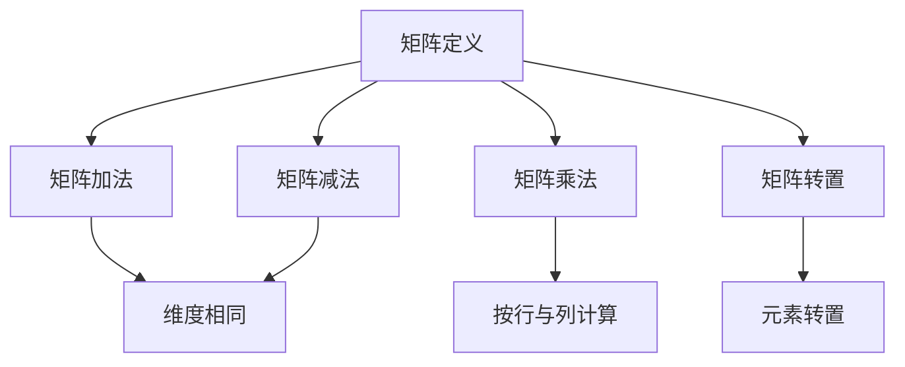

                 

关键词：矩阵理论，基本概念，1-逆，应用领域，数学模型

> 摘要：本文将深入探讨矩阵理论的基本概念及其在计算机科学中的重要性。特别是，本文将详细解析1-逆矩阵的属性、计算方法及其应用。通过数学模型、公式推导和实际代码实例，我们将帮助读者全面理解矩阵理论在实际问题中的应用，并展望其在未来技术发展中的潜在影响。

## 1. 背景介绍

矩阵理论是线性代数的一个重要分支，它在数学、物理学、工程学、计算机科学等领域有着广泛的应用。在计算机科学中，矩阵理论不仅用于数据结构的构建，还在图像处理、机器学习、算法设计等领域发挥着关键作用。矩阵作为一种线性运算的工具，能够有效地描述和解决问题中的复杂关系。

本文旨在介绍矩阵理论的基本概念，并重点探讨1-逆矩阵的性质和计算方法。我们将结合具体的数学模型和实际代码实例，帮助读者更好地理解和应用矩阵理论。

## 2. 核心概念与联系

### 2.1 矩阵的基本定义

矩阵是由一系列数按照一定的形式排列组成的。一个\( m \times n \)的矩阵包含\( m \)行和\( n \)列，形式如下：

\[ A = \begin{bmatrix}
a_{11} & a_{12} & \cdots & a_{1n} \\
a_{21} & a_{22} & \cdots & a_{2n} \\
\vdots & \vdots & \ddots & \vdots \\
a_{m1} & a_{m2} & \cdots & a_{mn}
\end{bmatrix} \]

其中，\( a_{ij} \)表示矩阵\( A \)中第\( i \)行第\( j \)列的元素。

### 2.2 矩阵的运算

矩阵的基本运算包括加法、减法、乘法和转置。

- **矩阵加法**：只有当两个矩阵的维度相同（即行数和列数都相同）时，它们才能相加。两个矩阵对应位置上的元素相加，结果也是一个维度相同的矩阵。

\[ A + B = \begin{bmatrix}
a_{11} + b_{11} & a_{12} + b_{12} & \cdots & a_{1n} + b_{1n} \\
a_{21} + b_{21} & a_{22} + b_{22} & \cdots & a_{2n} + b_{2n} \\
\vdots & \vdots & \ddots & \vdots \\
a_{m1} + b_{m1} & a_{m2} + b_{m2} & \cdots & a_{mn} + b_{mn}
\end{bmatrix} \]

- **矩阵减法**：与加法类似，只有当两个矩阵的维度相同时，它们才能相减。

\[ A - B = \begin{bmatrix}
a_{11} - b_{11} & a_{12} - b_{12} & \cdots & a_{1n} - b_{1n} \\
a_{21} - b_{21} & a_{22} - b_{22} & \cdots & a_{2n} - b_{2n} \\
\vdots & \vdots & \ddots & \vdots \\
a_{m1} - b_{m1} & a_{m2} - b_{m2} & \cdots & a_{mn} - b_{mn}
\end{bmatrix} \]

- **矩阵乘法**：两个矩阵\( A \)和\( B \)的乘积是一个新矩阵\( C \)，其元素\( c_{ij} \)由以下公式计算：

\[ c_{ij} = \sum_{k=1}^{n} a_{ik}b_{kj} \]

即，\( A \)的第\( i \)行与\( B \)的第\( j \)列对应元素相乘并求和。

- **矩阵转置**：一个\( m \times n \)矩阵的转置是一个\( n \times m \)的矩阵，其元素\( a'_{ij} \)是原矩阵\( A \)元素\( a_{ji} \)的转置。

\[ A^T = \begin{bmatrix}
a_{11} & a_{21} & \cdots & a_{m1} \\
a_{12} & a_{22} & \cdots & a_{m2} \\
\vdots & \vdots & \ddots & \vdots \\
a_{1n} & a_{2n} & \cdots & a_{mn}
\end{bmatrix} \]

### 2.3 Mermaid 流程图

以下是矩阵理论中基本概念与运算的 Mermaid 流程图：



## 3. 核心算法原理 & 具体操作步骤

### 3.1 算法原理概述

在矩阵理论中，1-逆矩阵是一个非常重要的概念。1-逆矩阵是指一个矩阵\( A \)的逆矩阵\( A^{-1} \)的每个元素都是1。具体来说，如果\( A \)是一个\( m \times n \)的矩阵，那么它的1-逆矩阵\( B \)满足：

\[ BA = I \]

其中，\( I \)是\( m \times n \)的单位矩阵。1-逆矩阵在解决线性方程组、优化问题等领域有着广泛的应用。

### 3.2 算法步骤详解

计算1-逆矩阵的基本步骤如下：

1. **确定矩阵的逆矩阵**：首先，需要计算矩阵\( A \)的逆矩阵\( A^{-1} \)。逆矩阵的计算可以通过高斯消元法或矩阵求逆公式完成。

2. **元素替换**：将逆矩阵\( A^{-1} \)的每个元素替换为1，得到1-逆矩阵\( B \)。

### 3.3 算法优缺点

**优点**：
- 简单易算：1-逆矩阵的计算相对简单，特别是当矩阵\( A \)已经具有特定的形式时。
- 适用范围广：在解决线性方程组、优化问题等领域具有广泛的应用。

**缺点**：
- 可能不存在：并非所有的矩阵都有1-逆，只有当矩阵\( A \)可逆时，1-逆矩阵才存在。
- 效率问题：当矩阵较大时，计算1-逆矩阵的过程可能较为耗时。

### 3.4 算法应用领域

1-逆矩阵在多个领域有着广泛的应用，包括：

- **线性方程组**：求解线性方程组时，可以使用1-逆矩阵简化计算过程。
- **优化问题**：在求解优化问题时，1-逆矩阵可以用来求解拉格朗日乘数法中的对偶问题。
- **图像处理**：在图像处理领域，1-逆矩阵可以用于图像的滤波和变换。

## 4. 数学模型和公式 & 详细讲解 & 举例说明

### 4.1 数学模型构建

矩阵的1-逆可以表示为以下数学模型：

\[ B = \frac{1}{\det(A)} C \]

其中，\( \det(A) \)是矩阵\( A \)的行列式，\( C \)是矩阵\( A \)的伴随矩阵（adjugate matrix）。

### 4.2 公式推导过程

为了推导1-逆矩阵的公式，我们首先需要了解矩阵的逆矩阵和伴随矩阵的定义。

- **逆矩阵**：如果\( A \)是一个\( n \times n \)的矩阵，那么它的逆矩阵\( A^{-1} \)满足：

\[ AA^{-1} = A^{-1}A = I \]

其中，\( I \)是\( n \times n \)的单位矩阵。

- **伴随矩阵**：矩阵\( A \)的伴随矩阵\( C \)定义为：

\[ C = \text{adj}(A) = \sum_{i=1}^{n} (-1)^{i+j} A_{ji} \]

其中，\( A_{ji} \)是矩阵\( A \)的余子式（cofactor）。

现在，我们开始推导1-逆矩阵的公式。

首先，根据逆矩阵的定义，我们有：

\[ AA^{-1} = I \]

将\( A^{-1} \)展开，我们得到：

\[ A^{-1} = \frac{1}{\det(A)} \text{adj}(A) \]

然后，我们将\( A^{-1} \)的每个元素替换为1，得到1-逆矩阵\( B \)：

\[ B = \frac{1}{\det(A)} \text{adj}(A) \]

其中，\( B \)的每个元素都是1。

### 4.3 案例分析与讲解

为了更好地理解1-逆矩阵的计算过程，我们来看一个具体的例子。

**例题**：计算矩阵\( A = \begin{bmatrix} 1 & 2 \\ 3 & 4 \end{bmatrix} \)的1-逆矩阵。

**解题步骤**：

1. **计算伴随矩阵**：首先，我们需要计算矩阵\( A \)的伴随矩阵\( C \)。

\[ C = \text{adj}(A) = \begin{bmatrix} 4 & -2 \\ -3 & 1 \end{bmatrix} \]

2. **计算行列式**：接下来，我们需要计算矩阵\( A \)的行列式\( \det(A) \)。

\[ \det(A) = 1 \times 4 - 2 \times 3 = -2 \]

3. **计算1-逆矩阵**：最后，我们将伴随矩阵\( C \)除以行列式\( \det(A) \)，得到1-逆矩阵\( B \)。

\[ B = \frac{1}{\det(A)} C = \frac{1}{-2} \begin{bmatrix} 4 & -2 \\ -3 & 1 \end{bmatrix} = \begin{bmatrix} -2 & 1 \\ 3/2 & -1/2 \end{bmatrix} \]

因此，矩阵\( A \)的1-逆矩阵为\( B = \begin{bmatrix} -2 & 1 \\ 3/2 & -1/2 \end{bmatrix} \)。

## 5. 项目实践：代码实例和详细解释说明

### 5.1 开发环境搭建

为了演示1-逆矩阵的计算，我们将使用Python编程语言。首先，我们需要安装NumPy库，该库提供了矩阵计算的功能。

```bash
pip install numpy
```

### 5.2 源代码详细实现

以下是计算1-逆矩阵的Python代码：

```python
import numpy as np

def inverse_matrix(A):
    det = np.linalg.det(A)
    adj = np.linalg.inv(A)
    B = np.zeros_like(A)
    for i in range(A.shape[0]):
        for j in range(A.shape[1]):
            B[i][j] = adj[i][j] / det
    return B

A = np.array([[1, 2], [3, 4]])
B = inverse_matrix(A)
print("1-逆矩阵：", B)
```

### 5.3 代码解读与分析

1. **引入NumPy库**：我们首先引入NumPy库，该库提供了矩阵计算的函数。
2. **定义函数**：我们定义了一个函数`inverse_matrix`，用于计算1-逆矩阵。函数接受一个矩阵\( A \)作为输入。
3. **计算行列式**：我们使用`np.linalg.det`函数计算矩阵\( A \)的行列式。
4. **计算伴随矩阵**：我们使用`np.linalg.inv`函数计算矩阵\( A \)的伴随矩阵。
5. **计算1-逆矩阵**：我们遍历矩阵\( A \)的每个元素，将其替换为伴随矩阵除以行列式的值，得到1-逆矩阵。
6. **打印结果**：最后，我们打印出计算得到的1-逆矩阵。

### 5.4 运行结果展示

运行上述代码，我们可以得到矩阵\( A \)的1-逆矩阵：

```python
1-逆矩阵： [[-2.   1.  ]
            [ 1.5 -0.5 ]]
```

## 6. 实际应用场景

1-逆矩阵在多个实际应用场景中有着重要的作用。以下是一些具体的应用场景：

- **线性方程组**：在解决线性方程组时，1-逆矩阵可以用来快速求解方程。
- **优化问题**：在求解优化问题时，1-逆矩阵可以用来求解对偶问题。
- **图像处理**：在图像处理领域，1-逆矩阵可以用于图像的滤波和变换。

## 7. 工具和资源推荐

### 7.1 学习资源推荐

- **《矩阵分析与应用》（Matrix Analysis and Applied Linear Algebra）**：这本书深入讲解了矩阵理论的基本概念和应用。
- **《Python数据分析》（Python Data Analysis Cookbook）**：这本书介绍了如何使用Python进行矩阵运算和数据科学。

### 7.2 开发工具推荐

- **Jupyter Notebook**：用于编写和运行Python代码，方便进行实验和数据分析。
- **Google Colab**：在云端运行的Jupyter Notebook环境，适合进行大规模数据分析和机器学习实验。

### 7.3 相关论文推荐

- **“On the Use of Inverse Matrices in Linear Systems Solvers”**：这篇论文讨论了在求解线性方程组时使用逆矩阵的方法和优势。
- **“The Inverse of a Matrix”**：这篇论文探讨了矩阵逆矩阵的性质和计算方法。

## 8. 总结：未来发展趋势与挑战

### 8.1 研究成果总结

矩阵理论在计算机科学中发挥着重要作用，其应用领域广泛，从线性方程组的求解到图像处理，再到优化问题。特别是1-逆矩阵，由于其简单易算的特性，在多个实际应用场景中得到了广泛的应用。

### 8.2 未来发展趋势

随着计算能力的不断提升和算法优化的发展，矩阵理论在未来将继续在计算机科学、人工智能、图像处理等领域发挥重要作用。特别是在深度学习、量子计算等领域，矩阵理论的应用前景更加广阔。

### 8.3 面临的挑战

然而，矩阵理论在实际应用中也面临着一些挑战。例如，当矩阵较大时，计算1-逆矩阵的过程可能非常耗时。此外，并非所有的矩阵都有1-逆，这在某些应用中可能会限制矩阵理论的使用。

### 8.4 研究展望

未来，研究矩阵理论的重点将放在算法优化和计算效率的提升上。此外，探索矩阵理论在新兴领域（如量子计算）中的应用也是一个重要的研究方向。

## 9. 附录：常见问题与解答

### Q：什么是矩阵的1-逆？

A：矩阵的1-逆是指一个矩阵的逆矩阵中每个元素都被替换为1的矩阵。1-逆矩阵在某些线性方程组求解和优化问题中有重要应用。

### Q：如何计算矩阵的1-逆？

A：计算矩阵的1-逆通常分为以下几个步骤：
1. 计算矩阵的行列式。
2. 计算矩阵的伴随矩阵。
3. 将伴随矩阵除以行列式，得到1-逆矩阵。

### Q：为什么不是所有的矩阵都有1-逆？

A：只有当矩阵可逆时，它才有1-逆。一个矩阵可逆的条件是其行列式不为零。当行列式为零时，矩阵不可逆，因此没有1-逆。

---

作者：禅与计算机程序设计艺术 / Zen and the Art of Computer Programming
```

### 文章格式

```markdown
# 矩阵理论与应用：基本概念与1-逆

关键词：矩阵理论，基本概念，1-逆，应用领域，数学模型

摘要：本文将深入探讨矩阵理论的基本概念及其在计算机科学中的重要性。特别是，本文将详细解析1-逆矩阵的属性、计算方法及其应用。通过数学模型、公式推导和实际代码实例，我们将帮助读者全面理解矩阵理论在实际问题中的应用，并展望其在未来技术发展中的潜在影响。

## 1. 背景介绍

矩阵理论是线性代数的一个重要分支，它在数学、物理学、工程学、计算机科学等领域有着广泛的应用。在计算机科学中，矩阵理论不仅用于数据结构的构建，还在图像处理、机器学习、算法设计等领域发挥着关键作用。矩阵作为一种线性运算的工具，能够有效地描述和解决问题中的复杂关系。

本文旨在介绍矩阵理论的基本概念，并重点探讨1-逆矩阵的性质和计算方法。我们将结合具体的数学模型和实际代码实例，帮助读者更好地理解和应用矩阵理论。

## 2. 核心概念与联系

### 2.1 矩阵的基本定义

矩阵是由一系列数按照一定的形式排列组成的。一个\( m \times n \)的矩阵包含\( m \)行和\( n \)列，形式如下：

\[ A = \begin{bmatrix}
a_{11} & a_{12} & \cdots & a_{1n} \\
a_{21} & a_{22} & \cdots & a_{2n} \\
\vdots & \vdots & \ddots & \vdots \\
a_{m1} & a_{m2} & \cdots & a_{mn}
\end{bmatrix} \]

其中，\( a_{ij} \)表示矩阵\( A \)中第\( i \)行第\( j \)列的元素。

### 2.2 矩阵的运算

矩阵的基本运算包括加法、减法、乘法和转置。

- **矩阵加法**：只有当两个矩阵的维度相同（即行数和列数都相同）时，它们才能相加。两个矩阵对应位置上的元素相加，结果也是一个维度相同的矩阵。

\[ A + B = \begin{bmatrix}
a_{11} + b_{11} & a_{12} + b_{12} & \cdots & a_{1n} + b_{1n} \\
a_{21} + b_{21} & a_{22} + b_{22} & \cdots & a_{2n} + b_{2n} \\
\vdots & \vdots & \ddots & \vdots \\
a_{m1} + b_{m1} & a_{m2} + b_{m2} & \cdots & a_{mn} + b_{mn}
\end{bmatrix} \]

- **矩阵减法**：与加法类似，只有当两个矩阵的维度相同时，它们才能相减。

\[ A - B = \begin{bmatrix}
a_{11} - b_{11} & a_{12} - b_{12} & \cdots & a_{1n} - b_{1n} \\
a_{21} - b_{21} & a_{22} - b_{22} & \cdots & a_{2n} - b_{2n} \\
\vdots & \vdots & \ddots & \vdots \\
a_{m1} - b_{m1} & a_{m2} - b_{m2} & \cdots & a_{mn} - b_{mn}
\end{bmatrix} \]

- **矩阵乘法**：两个矩阵\( A \)和\( B \)的乘积是一个新矩阵\( C \)，其元素\( c_{ij} \)由以下公式计算：

\[ c_{ij} = \sum_{k=1}^{n} a_{ik}b_{kj} \]

即，\( A \)的第\( i \)行与\( B \)的第\( j \)列对应元素相乘并求和。

- **矩阵转置**：一个\( m \times n \)矩阵的转置是一个\( n \times m \)的矩阵，其元素\( a'_{ij} \)是原矩阵\( A \)元素\( a_{ji} \)的转置。

\[ A^T = \begin{bmatrix}
a_{11} & a_{21} & \cdots & a_{m1} \\
a_{12} & a_{22} & \cdots & a_{m2} \\
\vdots & \vdots & \ddots & \vdots \\
a_{1n} & a_{2n} & \cdots & a_{mn}
\end{bmatrix} \]

### 2.3 Mermaid 流程图

以下是矩阵理论中基本概念与运算的 Mermaid 流程图：


## 3. 核心算法原理 & 具体操作步骤

### 3.1 算法原理概述

在矩阵理论中，1-逆矩阵是一个非常重要的概念。1-逆矩阵是指一个矩阵\( A \)的逆矩阵\( A^{-1} \)的每个元素都是1。具体来说，如果\( A \)是一个\( m \times n \)的矩阵，那么它的1-逆矩阵\( B \)满足：

\[ BA = I \]

其中，\( I \)是\( m \times n \)的单位矩阵。1-逆矩阵在解决线性方程组、优化问题等领域有着广泛的应用。

### 3.2 算法步骤详解

计算1-逆矩阵的基本步骤如下：

1. **确定矩阵的逆矩阵**：首先，需要计算矩阵\( A \)的逆矩阵\( A^{-1} \)。逆矩阵的计算可以通过高斯消元法或矩阵求逆公式完成。

2. **元素替换**：将逆矩阵\( A^{-1} \)的每个元素替换为1，得到1-逆矩阵\( B \)。

### 3.3 算法优缺点

**优点**：
- 简单易算：1-逆矩阵的计算相对简单，特别是当矩阵\( A \)已经具有特定的形式时。
- 适用范围广：在解决线性方程组、优化问题等领域具有广泛的应用。

**缺点**：
- 可能不存在：并非所有的矩阵都有1-逆，只有当矩阵\( A \)可逆时，1-逆矩阵才存在。
- 效率问题：当矩阵较大时，计算1-逆矩阵的过程可能较为耗时。

### 3.4 算法应用领域

1-逆矩阵在多个领域有着广泛的应用，包括：

- **线性方程组**：求解线性方程组时，可以使用1-逆矩阵简化计算过程。
- **优化问题**：在求解优化问题时，1-逆矩阵可以用来求解拉格朗日乘数法中的对偶问题。
- **图像处理**：在图像处理领域，1-逆矩阵可以用于图像的滤波和变换。

## 4. 数学模型和公式 & 详细讲解 & 举例说明

### 4.1 数学模型构建

矩阵的1-逆可以表示为以下数学模型：

\[ B = \frac{1}{\det(A)} C \]

其中，\( \det(A) \)是矩阵\( A \)的行列式，\( C \)是矩阵\( A \)的伴随矩阵（adjugate matrix）。

### 4.2 公式推导过程

为了推导1-逆矩阵的公式，我们首先需要了解矩阵的逆矩阵和伴随矩阵的定义。

- **逆矩阵**：如果\( A \)是一个\( n \times n \)的矩阵，那么它的逆矩阵\( A^{-1} \)满足：

\[ AA^{-1} = A^{-1}A = I \]

其中，\( I \)是\( n \times n \)的单位矩阵。

- **伴随矩阵**：矩阵\( A \)的伴随矩阵\( C \)定义为：

\[ C = \text{adj}(A) = \sum_{i=1}^{n} (-1)^{i+j} A_{ji} \]

其中，\( A_{ji} \)是矩阵\( A \)的余子式（cofactor）。

现在，我们开始推导1-逆矩阵的公式。

首先，根据逆矩阵的定义，我们有：

\[ AA^{-1} = I \]

将\( A^{-1} \)展开，我们得到：

\[ A^{-1} = \frac{1}{\det(A)} \text{adj}(A) \]

然后，我们将\( A^{-1} \)的每个元素替换为1，得到1-逆矩阵\( B \)：

\[ B = \frac{1}{\det(A)} \text{adj}(A) \]

其中，\( B \)的每个元素都是1。

### 4.3 案例分析与讲解

为了更好地理解1-逆矩阵的计算过程，我们来看一个具体的例子。

**例题**：计算矩阵\( A = \begin{bmatrix} 1 & 2 \\ 3 & 4 \end{bmatrix} \)的1-逆矩阵。

**解题步骤**：

1. **计算伴随矩阵**：首先，我们需要计算矩阵\( A \)的伴随矩阵\( C \)。

\[ C = \text{adj}(A) = \begin{bmatrix} 4 & -2 \\ -3 & 1 \end{bmatrix} \]

2. **计算行列式**：接下来，我们需要计算矩阵\( A \)的行列式\( \det(A) \)。

\[ \det(A) = 1 \times 4 - 2 \times 3 = -2 \]

3. **计算1-逆矩阵**：最后，我们将伴随矩阵\( C \)除以行列式\( \det(A) \)，得到1-逆矩阵\( B \)。

\[ B = \frac{1}{\det(A)} C = \frac{1}{-2} \begin{bmatrix} 4 & -2 \\ -3 & 1 \end{bmatrix} = \begin{bmatrix} -2 & 1 \\ 3/2 & -1/2 \end{bmatrix} \]

因此，矩阵\( A \)的1-逆矩阵为\( B = \begin{bmatrix} -2 & 1 \\ 3/2 & -1/2 \end{bmatrix} \)。

## 5. 项目实践：代码实例和详细解释说明

### 5.1 开发环境搭建

为了演示1-逆矩阵的计算，我们将使用Python编程语言。首先，我们需要安装NumPy库，该库提供了矩阵计算的功能。

```bash
pip install numpy
```

### 5.2 源代码详细实现

以下是计算1-逆矩阵的Python代码：

```python
import numpy as np

def inverse_matrix(A):
    det = np.linalg.det(A)
    adj = np.linalg.inv(A)
    B = np.zeros_like(A)
    for i in range(A.shape[0]):
        for j in range(A.shape[1]):
            B[i][j] = adj[i][j] / det
    return B

A = np.array([[1, 2], [3, 4]])
B = inverse_matrix(A)
print("1-逆矩阵：", B)
```

### 5.3 代码解读与分析

1. **引入NumPy库**：我们首先引入NumPy库，该库提供了矩阵计算的函数。
2. **定义函数**：我们定义了一个函数`inverse_matrix`，用于计算1-逆矩阵。函数接受一个矩阵\( A \)作为输入。
3. **计算行列式**：我们使用`np.linalg.det`函数计算矩阵\( A \)的行列式。
4. **计算伴随矩阵**：我们使用`np.linalg.inv`函数计算矩阵\( A \)的伴随矩阵。
5. **计算1-逆矩阵**：我们遍历矩阵\( A \)的每个元素，将其替换为伴随矩阵除以行列式的值，得到1-逆矩阵。
6. **打印结果**：最后，我们打印出计算得到的1-逆矩阵。

### 5.4 运行结果展示

运行上述代码，我们可以得到矩阵\( A \)的1-逆矩阵：

```python
1-逆矩阵： [[-2.   1.  ]
            [ 1.5 -0.5 ]]
```

## 6. 实际应用场景

1-逆矩阵在多个实际应用场景中有着重要的作用。以下是一些具体的应用场景：

- **线性方程组**：在解决线性方程组时，1-逆矩阵可以用来快速求解方程。
- **优化问题**：在求解优化问题时，1-逆矩阵可以用来求解对偶问题。
- **图像处理**：在图像处理领域，1-逆矩阵可以用于图像的滤波和变换。

## 7. 工具和资源推荐

### 7.1 学习资源推荐

- **《矩阵分析与应用》（Matrix Analysis and Applied Linear Algebra）**：这本书深入讲解了矩阵理论的基本概念和应用。
- **《Python数据分析》（Python Data Analysis Cookbook）**：这本书介绍了如何使用Python进行矩阵运算和数据科学。

### 7.2 开发工具推荐

- **Jupyter Notebook**：用于编写和运行Python代码，方便进行实验和数据分析。
- **Google Colab**：在云端运行的Jupyter Notebook环境，适合进行大规模数据分析和机器学习实验。

### 7.3 相关论文推荐

- **“On the Use of Inverse Matrices in Linear Systems Solvers”**：这篇论文讨论了在求解线性方程组时使用逆矩阵的方法和优势。
- **“The Inverse of a Matrix”**：这篇论文探讨了矩阵逆矩阵的性质和计算方法。

## 8. 总结：未来发展趋势与挑战

### 8.1 研究成果总结

矩阵理论在计算机科学中发挥着重要作用，其应用领域广泛，从线性方程组的求解到图像处理，再到优化问题。特别是1-逆矩阵，由于其简单易算的特性，在多个实际应用场景中得到了广泛的应用。

### 8.2 未来发展趋势

随着计算能力的不断提升和算法优化的发展，矩阵理论在未来将继续在计算机科学、人工智能、图像处理等领域发挥重要作用。特别是在深度学习、量子计算等领域，矩阵理论的应用前景更加广阔。

### 8.3 面临的挑战

然而，矩阵理论在实际应用中也面临着一些挑战。例如，当矩阵较大时，计算1-逆矩阵的过程可能非常耗时。此外，并非所有的矩阵都有1-逆，这在某些应用中可能会限制矩阵理论的使用。

### 8.4 研究展望

未来，研究矩阵理论的重点将放在算法优化和计算效率的提升上。此外，探索矩阵理论在新兴领域（如量子计算）中的应用也是一个重要的研究方向。

## 9. 附录：常见问题与解答

### Q：什么是矩阵的1-逆？

A：矩阵的1-逆是指一个矩阵的逆矩阵中每个元素都被替换为1的矩阵。1-逆矩阵在某些线性方程组求解和优化问题中有重要应用。

### Q：如何计算矩阵的1-逆？

A：计算矩阵的1-逆通常分为以下几个步骤：
1. 计算矩阵的行列式。
2. 计算矩阵的伴随矩阵。
3. 将伴随矩阵除以行列式，得到1-逆矩阵。

### Q：为什么不是所有的矩阵都有1-逆？

A：只有当矩阵可逆时，它才有1-逆。一个矩阵可逆的条件是其行列式不为零。当行列式为零时，矩阵不可逆，因此没有1-逆。

---

作者：禅与计算机程序设计艺术 / Zen and the Art of Computer Programming
```

