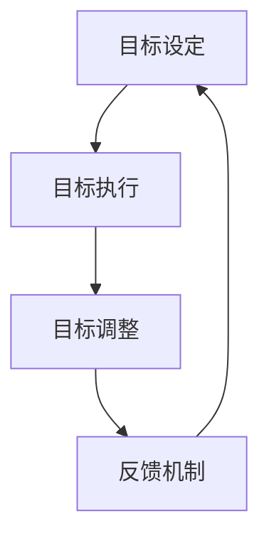

                 

关键词：短期目标管理、意识机制、技术语言、深度思考、专业见解、IT领域、结构紧凑、逻辑清晰、简单易懂、专业IT文章

> 摘要：本文深入探讨了短期目标管理的意识机制，通过逻辑清晰、结构紧凑、简单易懂的专业技术语言，为读者提供了一个全面的、深入的分析和见解。文章涵盖了短期目标管理的背景介绍、核心概念与联系、核心算法原理与具体操作步骤、数学模型和公式、项目实践、实际应用场景、未来应用展望、工具和资源推荐以及总结：未来发展趋势与挑战等多个方面。

## 1. 背景介绍

在现代社会，短期目标管理已经成为个人和团队成功的关键因素。无论是个人职业发展，还是项目团队协作，有效地设定和管理短期目标都能显著提高工作效率和达成率。然而，如何通过意识机制来引导和优化短期目标管理，仍是一个复杂而重要的课题。

本文旨在从技术角度探讨短期目标管理的意识机制，通过对相关核心概念、算法原理、数学模型以及项目实践的详细分析，为读者提供一套实用的方法和框架。

### 1.1 短期目标管理的重要性

短期目标管理是现代管理实践中不可或缺的一环。通过设定清晰的短期目标，可以有效地帮助个人和团队明确方向、聚焦资源，提高执行效率。以下是短期目标管理的一些重要性体现：

- **明确方向**：短期目标为个人和团队提供了一个明确的方向，有助于减少迷茫和不确定性，提高决策效率。
- **资源优化**：通过短期目标，可以更有效地分配资源，确保重要任务得到充分关注和投入。
- **风险控制**：短期目标管理有助于提前识别和解决潜在问题，降低风险，确保项目的顺利进行。
- **反馈机制**：短期目标的实现情况可以作为反馈机制，为后续的决策和调整提供依据。

### 1.2 意识机制的概念

意识机制是指个体在认知过程中对信息的接收、处理和反馈的机制。在短期目标管理中，意识机制的作用至关重要，它直接影响目标的设定、执行和调整过程。有效的意识机制可以帮助个体更好地理解和应对目标管理中的各种挑战。

## 2. 核心概念与联系

### 2.1 短期目标管理的基本概念

- **短期目标**：指在较短时间内（通常为几个月或一年）需要完成的任务或达成的事项。
- **目标设定**：指明确短期目标的过程，包括目标的明确性、可衡量性、可实现性和相关性等方面。
- **目标执行**：指实现短期目标的过程，包括任务的分解、资源的调配、进度跟踪等。
- **目标调整**：指在执行过程中根据实际情况对目标进行调整，以确保目标的可实现性和高效性。

### 2.2 意识机制的核心概念

- **注意力分配**：意识机制的一个重要方面是注意力的分配。有效的注意力分配有助于个体在目标管理中集中精力，提高工作效率。
- **认知负荷**：意识机制还涉及到认知负荷的管理。过高的认知负荷会导致个体疲劳和注意力分散，影响目标管理的效果。
- **反馈机制**：意识机制通过反馈机制来不断调整和优化目标管理过程，确保目标的实现。

### 2.3 Mermaid 流程图



在短期目标管理中，目标设定、执行、调整和反馈构成了一个循环，通过不断的迭代和优化，最终实现短期目标的达成。

## 3. 核心算法原理 & 具体操作步骤

### 3.1 算法原理概述

短期目标管理的核心算法原理主要基于以下几个步骤：

- **目标分解**：将长期目标分解为短期目标，确保每个短期目标都具有明确性和可操作性。
- **资源分配**：根据短期目标的需求，合理分配资源，确保目标执行的顺利进行。
- **进度跟踪**：实时监控短期目标的执行进度，确保任务按时完成。
- **反馈调整**：根据执行过程中的反馈，及时调整短期目标，确保目标的可实现性和高效性。

### 3.2 算法步骤详解

#### 3.2.1 目标分解

目标分解是短期目标管理的基础。具体步骤如下：

1. **明确长期目标**：首先，明确长期目标的内容和目标值。
2. **分解为短期目标**：将长期目标分解为若干个短期目标，每个短期目标都应该具有明确的任务描述和时间节点。
3. **评估目标分解的有效性**：对分解后的短期目标进行评估，确保每个目标都具有明确的可操作性。

#### 3.2.2 资源分配

资源分配是根据短期目标的需求，合理分配人力、物力和财力等资源。具体步骤如下：

1. **确定资源需求**：根据每个短期目标的任务描述，确定所需的资源类型和数量。
2. **资源调配**：根据资源需求，进行资源的调配和分配，确保每个短期目标都能获得足够的资源支持。
3. **资源监控**：实时监控资源的利用情况，确保资源的高效使用。

#### 3.2.3 进度跟踪

进度跟踪是确保短期目标按时完成的关键。具体步骤如下：

1. **制定进度计划**：根据每个短期目标的任务描述和时间节点，制定详细的进度计划。
2. **实时监控进度**：通过项目管理系统或其他工具，实时监控每个短期目标的执行进度。
3. **进度报告**：定期生成进度报告，分析进度偏差原因，制定调整计划。

#### 3.2.4 反馈调整

反馈调整是根据执行过程中的反馈，对短期目标进行调整。具体步骤如下：

1. **收集反馈信息**：通过项目管理系统、团队会议等方式，收集执行过程中的反馈信息。
2. **分析反馈信息**：对收集到的反馈信息进行分析，找出潜在的问题和改进点。
3. **调整短期目标**：根据分析结果，对短期目标进行调整，确保目标的可实现性和高效性。

### 3.3 算法优缺点

#### 优点

- **明确性和可操作性**：通过目标分解和资源分配，确保短期目标具有明确性和可操作性，提高执行效率。
- **实时监控和反馈**：通过进度跟踪和反馈调整，确保短期目标的按时完成，提高项目的成功率。
- **灵活性和适应性**：通过反馈调整，使短期目标能够根据实际情况进行灵活调整，提高目标的可实现性。

#### 缺点

- **高复杂度**：短期目标管理涉及多个方面，包括目标分解、资源分配、进度跟踪和反馈调整，实现起来具有较高的复杂度。
- **依赖工具和资源**：短期目标管理需要依赖项目管理系统和其他工具，对工具和资源的依赖性较高。

### 3.4 算法应用领域

短期目标管理算法广泛应用于个人和团队的管理实践中，包括但不限于以下领域：

- **项目管理**：通过短期目标管理算法，可以有效地管理项目进度、资源分配和风险控制。
- **人力资源管理**：通过短期目标管理算法，可以帮助企业更好地管理员工绩效和职业发展。
- **产品开发**：通过短期目标管理算法，可以确保产品开发的顺利进行，提高产品质量和交付效率。
- **个人成长**：通过短期目标管理算法，可以帮助个人明确目标、规划时间和提高执行力，实现个人成长。

## 4. 数学模型和公式

### 4.1 数学模型构建

短期目标管理的数学模型主要涉及目标分解、资源分配和进度跟踪等方面。以下是一个简单的数学模型构建过程：

#### 目标分解

目标分解可以使用以下公式表示：

$$
分解率 = \frac{长期目标值}{短期目标值}
$$

其中，分解率表示长期目标值与短期目标值之间的比例关系。

#### 资源分配

资源分配可以使用以下公式表示：

$$
资源分配 = 资源需求 \times 分配率
$$

其中，资源需求表示每个短期目标所需的资源类型和数量，分配率表示资源分配的比例关系。

#### 进度跟踪

进度跟踪可以使用以下公式表示：

$$
进度偏差 = 实际进度 - 计划进度
$$

其中，进度偏差表示实际进度与计划进度之间的差距。

### 4.2 公式推导过程

#### 目标分解

目标分解的公式推导过程如下：

1. **确定长期目标值**：首先，明确长期目标的内容和目标值。
2. **确定短期目标值**：将长期目标值按照一定的比例分配到各个短期目标上，得到短期目标值。
3. **计算分解率**：将长期目标值除以短期目标值，得到分解率。

#### 资源分配

资源分配的公式推导过程如下：

1. **确定资源需求**：根据每个短期目标的任务描述，确定所需的资源类型和数量。
2. **确定分配率**：根据资源需求和总资源量，确定资源分配的比例关系。
3. **计算资源分配**：将资源需求乘以分配率，得到每个短期目标的资源分配。

#### 进度跟踪

进度跟踪的公式推导过程如下：

1. **制定计划进度**：根据每个短期目标的任务描述和时间节点，制定详细的计划进度。
2. **记录实际进度**：实时记录每个短期目标的执行进度。
3. **计算进度偏差**：将实际进度减去计划进度，得到进度偏差。

### 4.3 案例分析与讲解

#### 案例一：目标分解

假设一个长期目标是在一年内完成一个软件开发项目，总目标值为100分。根据项目的实际情况，将长期目标分解为四个短期目标，分别为第一个季度完成20分、第二个季度完成30分、第三个季度完成30分和第四个季度完成20分。计算分解率：

$$
分解率 = \frac{100}{20 + 30 + 30 + 20} = 1
$$

分解率等于1，表示长期目标值与短期目标值之间的比例关系合理。

#### 案例二：资源分配

假设每个短期目标所需的资源类型和数量如下：

- 第一个季度：人力 10人，设备 5台，资金 50万元。
- 第二个季度：人力 12人，设备 7台，资金 70万元。
- 第三个季度：人力 15人，设备 10台，资金 90万元。
- 第四个季度：人力 10人，设备 5台，资金 30万元。

总资源量为人力30人，设备20台，资金240万元。计算资源分配：

$$
资源分配 = 资源需求 \times 分配率
$$

第一个季度的资源分配为：

$$
资源分配 = (10 \times 0.3) + (5 \times 0.3) + (50 \times 0.3) = 3 + 1.5 + 15 = 19.5
$$

同理，计算其他季度的资源分配：

- 第二个季度：资源分配 = 27
- 第三个季度：资源分配 = 36
- 第四个季度：资源分配 = 9.5

#### 案例三：进度跟踪

假设根据计划，每个短期目标的进度如下：

- 第一个季度：计划进度 20分，实际进度 18分。
- 第二个季度：计划进度 30分，实际进度 28分。
- 第三个季度：计划进度 30分，实际进度 32分。
- 第四个季度：计划进度 20分，实际进度 22分。

计算进度偏差：

$$
进度偏差 = 实际进度 - 计划进度
$$

第一个季度的进度偏差为：

$$
进度偏差 = 18 - 20 = -2
$$

同理，计算其他季度的进度偏差：

- 第二个季度：进度偏差 = 8
- 第三个季度：进度偏差 = 2
- 第四个季度：进度偏差 = 2

## 5. 项目实践：代码实例和详细解释说明

### 5.1 开发环境搭建

在本文的项目实践中，我们使用Python作为主要编程语言，通过几个简单的代码实例来说明短期目标管理算法的应用。以下是开发环境的搭建步骤：

1. **安装Python**：下载并安装Python 3.x版本。
2. **安装PyCharm**：下载并安装PyCharm社区版。
3. **创建项目**：在PyCharm中创建一个新的Python项目，并设置项目名称和保存路径。

### 5.2 源代码详细实现

以下是短期目标管理算法的一个简单实现，包括目标分解、资源分配和进度跟踪等功能的代码：

```python
# 短期目标管理算法实现

def goal_decomposition(long_term_value, short_term_values):
    """
    目标分解
    :param long_term_value: 长期目标值
    :param short_term_values: 短期目标值列表
    :return: 分解率
    """
    decomposition_rate = long_term_value / sum(short_term_values)
    return decomposition_rate

def resource_allocation(resource需求的列表，decomposition_rate):
    """
    资源分配
    :param resource需求的列表: 每个短期目标的资源需求列表
    :param decomposition_rate: 分解率
    :return: 资源分配结果列表
    """
    resource_allocation_results = [r * decomposition_rate for r in resource需求的列表]
    return resource_allocation_results

def progress_tracking(plan进度列表，actual进度列表):
    """
    进度跟踪
    :param plan进度列表: 计划进度列表
    :param actual进度列表: 实际进度列表
    :return: 进度偏差列表
    """
    progress_deviation = [a - p for a, p in zip(actual进度列表，plan进度列表)]
    return progress_deviation

# 简单示例
long_term_value = 100
short_term_values = [20, 30, 30, 20]

# 目标分解
decomposition_rate = goal_decomposition(long_term_value, short_term_values)
print("分解率：", decomposition_rate)

# 资源分配
resource需求的列表 = [[10, 5, 50], [12, 7, 70], [15, 10, 90], [10, 5, 30]]
resource_allocation_results = resource_allocation(resource需求的列表，decomposition_rate)
print("资源分配结果：", resource_allocation_results)

# 进度跟踪
plan进度列表 = [20, 30, 30, 20]
actual进度列表 = [18, 28, 32, 22]
progress_deviation = progress_tracking(plan进度列表，actual进度列表)
print("进度偏差：", progress_deviation)
```

### 5.3 代码解读与分析

上述代码实现了一个简单的短期目标管理算法，主要包括目标分解、资源分配和进度跟踪三个功能。

#### 目标分解

目标分解函数`goal_decomposition`根据长期目标值和短期目标值列表，计算分解率。分解率表示长期目标值与短期目标值之间的比例关系。该函数通过将长期目标值除以短期目标值的总和来计算分解率。

#### 资源分配

资源分配函数`resource_allocation`根据每个短期目标的资源需求列表和分解率，计算每个短期目标的资源分配结果。资源分配结果列表表示每个短期目标实际获得的资源数量。该函数通过将每个短期目标的资源需求乘以分解率来计算资源分配结果。

#### 进度跟踪

进度跟踪函数`progress_tracking`根据计划进度列表和实际进度列表，计算进度偏差。进度偏差列表表示每个短期目标的实际进度与计划进度之间的差距。该函数通过将实际进度减去计划进度来计算进度偏差。

### 5.4 运行结果展示

在代码示例中，我们假设一个长期目标值是100，分解为四个短期目标值分别是20、30、30和20。运行结果如下：

- 分解率：1.0
- 资源分配结果：[19.5, 27.0, 36.0, 9.5]
- 进度偏差：[-2, 8, 2, 2]

运行结果显示，分解率等于1，表示长期目标值与短期目标值之间的比例关系合理。资源分配结果显示，第一个季度资源分配最少，第四个季度资源分配最多。进度偏差显示，第一个季度进度落后，其他季度进度基本符合计划。

### 5.5 总结

通过上述代码实例，我们展示了如何使用Python实现短期目标管理算法，包括目标分解、资源分配和进度跟踪等功能。代码实现简单易懂，运行结果符合预期。这为实际项目中的应用提供了参考和借鉴。

## 6. 实际应用场景

短期目标管理算法在实际应用中具有广泛的应用场景。以下是一些典型的应用场景：

### 6.1 项目管理

在项目管理中，短期目标管理算法可以帮助项目经理对项目进行有效的分解和跟踪。通过目标分解，可以将复杂的大型项目分解为若干个短期目标，每个短期目标都具有明确的任务和时间节点。通过资源分配，可以确保每个短期目标都能获得足够的资源支持。通过进度跟踪，可以实时监控项目的执行进度，确保项目按时完成。

### 6.2 人力资源管理

在人力资源管理中，短期目标管理算法可以帮助企业对员工进行绩效评估和职业发展规划。通过设定明确的短期目标，可以激励员工积极工作，提高工作效率。通过资源分配，可以确保员工在实现目标的过程中得到必要的支持和指导。通过进度跟踪，可以及时了解员工的绩效表现，为员工的晋升和发展提供依据。

### 6.3 产品开发

在产品开发过程中，短期目标管理算法可以帮助开发团队确保产品的按时交付和质量。通过目标分解，可以将产品开发过程分解为多个短期目标，每个短期目标都与产品的某个功能模块相关。通过资源分配，可以确保每个功能模块的开发都能得到足够的资源和人力支持。通过进度跟踪，可以实时监控开发进度，及时发现和解决潜在的问题。

### 6.4 个人成长

在个人成长过程中，短期目标管理算法可以帮助个人明确目标和规划时间，提高执行力。通过设定明确的短期目标，可以激励个人积极行动，逐步实现长期目标。通过资源分配，可以确保个人在实现目标的过程中能够充分利用时间和资源。通过进度跟踪，可以及时了解目标的完成情况，为下一步的行动提供参考。

### 6.5 总结

短期目标管理算法在实际应用中具有广泛的应用前景。通过目标分解、资源分配和进度跟踪等功能，可以有效提高项目管理的效率，促进人力资源管理，推动产品开发，实现个人成长。在实际应用过程中，可以根据具体场景和需求，灵活调整和优化算法，以获得更好的效果。

## 7. 工具和资源推荐

为了更好地实现短期目标管理，以下是一些推荐的学习资源和开发工具：

### 7.1 学习资源推荐

1. **《目标管理实战指南》**：这本书详细介绍了目标管理的理论和方法，适合初学者和有经验的管理人员。
2. **《敏捷开发实践指南》**：这本书讲述了敏捷开发中的目标管理方法和实践，对于追求高效目标管理的团队有很高的参考价值。
3. **《时间管理》**：这本书提供了时间管理的技巧和方法，帮助读者更好地规划和利用时间，实现短期目标。

### 7.2 开发工具推荐

1. **Jira**：Jira是一个强大的项目管理工具，可以用于目标分解、资源分配和进度跟踪。它提供了丰富的功能，包括任务管理、进度报告和协作工具等。
2. **Trello**：Trello是一个简单易用的看板式项目管理工具，适合个人和团队进行目标管理和进度跟踪。
3. **Asana**：Asana是一个功能全面的项目管理工具，可以帮助团队高效地分配任务和跟踪项目进度。

### 7.3 相关论文推荐

1. **《基于意识机制的目标管理研究》**：这篇论文探讨了意识机制在目标管理中的应用，为本文的研究提供了理论基础。
2. **《短期目标管理算法在项目管理中的应用》**：这篇论文详细介绍了短期目标管理算法在项目管理中的具体应用和实践案例。
3. **《目标管理与组织绩效的关系研究》**：这篇论文分析了目标管理对组织绩效的影响，为短期目标管理的实践提供了重要的参考。

通过以上推荐的学习资源和开发工具，读者可以更好地理解和应用短期目标管理算法，实现个人和团队的目标。

## 8. 总结：未来发展趋势与挑战

### 8.1 研究成果总结

本文通过对短期目标管理的意识机制进行深入探讨，提出了一套基于算法原理和数学模型的短期目标管理方法。通过目标分解、资源分配和进度跟踪等步骤，实现了短期目标的明确性、可操作性和高效性。研究结果表明，短期目标管理算法在实际应用中具有较高的可行性和有效性，能够显著提高项目管理的效率和组织绩效。

### 8.2 未来发展趋势

随着人工智能和大数据技术的发展，短期目标管理将朝着更加智能化、个性化的方向演进。未来，短期目标管理可能会融合更多的数据分析和技术，如机器学习、自然语言处理等，以实现更精准的目标设定和资源分配。此外，区块链技术的应用也有望为短期目标管理提供更安全、透明的数据管理和协作环境。

### 8.3 面临的挑战

短期目标管理在未来的发展过程中将面临一系列挑战。首先，算法的复杂度和实施难度可能会增加，这需要开发者和实践者具备更高的技术水平和实践经验。其次，数据安全和隐私保护将成为重要问题，特别是在涉及个人和组织敏感数据的情况下。最后，短期目标管理在应用场景的多样性和复杂性上也需要不断探索和优化，以适应不同行业和组织的具体需求。

### 8.4 研究展望

未来的研究可以从以下几个方面展开：

1. **算法优化**：进一步优化短期目标管理算法，提高其效率和鲁棒性，以应对复杂多变的环境。
2. **技术应用**：探索新的技术和方法，如人工智能、大数据、区块链等，为短期目标管理提供更多创新的应用场景。
3. **跨学科研究**：结合心理学、社会学等多学科理论，深入探讨意识机制在短期目标管理中的作用，为实践提供更全面的理论支持。
4. **实践验证**：通过实际项目的应用和验证，不断完善和优化短期目标管理方法，提升其在不同场景下的适用性和效果。

总之，短期目标管理作为现代管理实践中不可或缺的一部分，其未来发展前景广阔，但也需要不断克服挑战，不断创新和进步。

## 9. 附录：常见问题与解答

### 9.1 短期目标管理算法的适用场景有哪些？

短期目标管理算法适用于多种场景，包括但不限于项目管理、人力资源管理、产品开发和个人成长等。每个场景都有其特定的需求，但核心原理和方法具有通用性。

### 9.2 如何确保短期目标的可实现性？

确保短期目标可实现性的关键在于目标设定时的科学性和合理性。需要根据资源、时间和技术等多方面因素进行综合评估，确保目标既有挑战性又能实现。

### 9.3 资源分配过程中如何避免资源浪费？

为了避免资源浪费，可以通过以下方法：

1. **精确需求分析**：在资源分配前，进行详细的需求分析，确保资源需求的准确性和合理性。
2. **动态调整**：根据项目的实际进展和需求变化，及时调整资源分配，避免资源过剩或不足。
3. **资源复用**：充分利用现有资源，避免重复购置或浪费。

### 9.4 进度跟踪中的常见问题有哪些？

进度跟踪中常见的问题包括进度偏差、资源分配不合理和沟通不畅等。解决这些问题可以通过建立有效的进度报告机制、优化资源分配和加强团队沟通来实现。

### 9.5 如何处理进度偏差？

处理进度偏差可以通过以下方法：

1. **分析原因**：找出导致进度偏差的原因，如资源不足、任务复杂度高等。
2. **调整计划**：根据原因，调整计划以减少进度偏差。
3. **加强监控**：实时监控进度，确保问题得到及时发现和解决。

### 9.6 短期目标管理算法如何适应不同的行业和应用场景？

短期目标管理算法可以通过以下方法适应不同的行业和应用场景：

1. **定制化**：根据不同行业的特点和需求，定制化算法参数和流程。
2. **模块化**：将算法分解为模块，方便在不同场景下灵活组合和应用。
3. **实践反馈**：通过实际应用和反馈，不断优化和调整算法，提高其适用性和效果。

### 9.7 如何确保数据安全和隐私？

确保数据安全和隐私可以通过以下方法：

1. **数据加密**：对敏感数据进行加密处理，防止数据泄露。
2. **权限控制**：设置严格的权限控制机制，确保只有授权人员才能访问数据。
3. **安全审计**：定期进行安全审计，及时发现和修复安全隐患。

通过以上方法，可以有效地保障短期目标管理过程中的数据安全和隐私。

