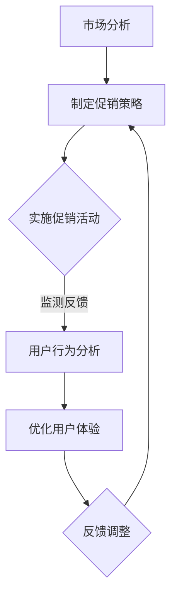

                 

作为一位世界级人工智能专家，我深知在当前的商业环境中，企业不仅要拥有出色的产品或服务，还需要一系列高效的短期策略来吸引和保留客户。在这篇文章中，我将探讨两种关键的短期策略：促销活动和优化用户体验。我们将深入分析这两种策略的核心概念、实现步骤、数学模型、实际应用以及未来的发展趋势。

## 关键词 Keywords

- **促销活动**
- **用户体验优化**
- **短期策略**
- **客户获取**
- **客户保留**
- **数据分析**
- **用户行为分析**

## 摘要 Summary

本文旨在探讨如何通过促销活动和优化用户体验来提升企业在短期内的竞争力。我们将详细分析促销活动的策略和执行步骤，探讨用户体验优化的核心概念和方法，并通过数学模型和案例研究来展示其实际效果。最后，我们将讨论这两种策略的未来发展趋势，并展望可能面临的挑战。

### 1. 背景介绍 Background

在当今竞争激烈的市场环境中，企业面临着越来越多的挑战。不仅要保持产品的竞争力，还需要不断寻找创新的策略来吸引新客户并保留现有客户。促销活动作为一种传统的市场推广手段，仍然在许多行业中发挥着重要作用。通过提供折扣、赠送礼品、限时特惠等方式，企业可以在短期内迅速吸引大量客户。

与此同时，用户体验优化也成为了企业关注的焦点。随着互联网的普及和用户需求的变化，用户体验成为了决定用户留存和忠诚度的关键因素。优化用户体验不仅能够提升用户满意度，还能够增加用户参与度和转化率。

本文将结合促销活动和用户体验优化的概念，深入探讨如何在实际操作中实施这些策略，并提供实用的方法和技术。

### 2. 核心概念与联系 Core Concepts and Connections

为了更好地理解促销活动和用户体验优化，我们需要先了解它们的核心概念和联系。

#### 促销活动 Promotional Activities

促销活动是一种旨在通过短期激励来刺激销售的营销策略。它通常包括以下几种形式：

1. **折扣与优惠**：提供价格折扣、优惠券、积分兑换等，以吸引消费者购买。
2. **赠品与礼品**：赠送小礼品、试用装、免费样品等，以增加消费者的购买兴趣。
3. **限时特惠**：设置特定时间段内的特别优惠，激发消费者的购买欲望。
4. **捆绑销售**：将多个产品捆绑在一起销售，以提供更优惠的价格。

#### 用户体验优化 User Experience Optimization

用户体验优化是指通过改进产品的设计、功能、界面和交互方式，以提高用户满意度和使用便利性。它通常涉及以下方面：

1. **界面设计**：优化界面的布局、色彩、字体等，以提升视觉效果和用户操作便捷性。
2. **功能改进**：增加或改进产品的功能，以满足用户的需求和期望。
3. **性能优化**：提高产品的响应速度、稳定性，减少错误和故障。
4. **用户行为分析**：通过数据分析来了解用户行为，从而针对性地进行优化。

#### 联系和协调 Coordination

促销活动和用户体验优化虽然在目标和实现方式上有所不同，但它们之间存在着密切的联系和协调。

- **目标一致性**：促销活动的目标通常是提高销售额和市场份额，而用户体验优化则旨在提升用户满意度和忠诚度。这两者虽然侧重点不同，但最终目标都是为了实现企业的长期成功。
- **策略互补**：促销活动可以通过短期激励来快速吸引客户，而用户体验优化则通过长期的持续改进来留住客户。两者相结合，可以实现客户获取和客户保留的双赢。
- **数据共享**：促销活动和用户体验优化都需要大量数据支持。通过共享数据，企业可以更全面地了解用户行为和需求，从而做出更科学的决策。

#### Mermaid 流程图 Mermaid Flowchart

下面是一个简化的Mermaid流程图，展示了促销活动和用户体验优化的关系：



### 3. 核心算法原理 & 具体操作步骤 Core Algorithm Principles & Detailed Steps

#### 3.1 算法原理概述 Algorithm Principles Overview

促销活动和用户体验优化虽然涉及不同的领域，但它们的核心算法原理有很多相似之处。以下是一些关键的概念和原理：

- **用户行为分析**：通过收集和分析用户的行为数据，了解用户的偏好、需求和痛点，为促销活动和用户体验优化提供依据。
- **机器学习**：利用机器学习算法，如聚类分析、关联规则挖掘等，从大量用户数据中提取有价值的信息，辅助决策。
- **A/B测试**：通过对比不同版本的促销活动和用户体验优化方案，评估其效果，并进行优化。

#### 3.2 算法步骤详解 Detailed Steps of the Algorithm

下面是促销活动和用户体验优化的一般步骤：

##### 3.2.1 市场分析 Market Analysis

1. **收集数据**：通过市场调研、用户反馈等方式，收集有关市场需求、竞争状况、用户行为的数据。
2. **数据分析**：利用统计分析、数据挖掘等方法，分析数据中的关键指标和趋势，为制定策略提供依据。

##### 3.2.2 制定策略 Strategy Development

1. **目标设定**：明确促销活动和用户体验优化的目标，如提升销售额、提高用户满意度等。
2. **策略制定**：根据市场分析和目标设定，制定具体的促销活动和用户体验优化方案。

##### 3.2.3 实施策略 Strategy Implementation

1. **促销活动**：
    - **选择促销形式**：根据目标用户和产品特点，选择合适的促销形式。
    - **设计活动内容**：制定具体的活动规则、奖品设置等。
    - **实施监控**：实时监控活动效果，及时调整策略。
2. **用户体验优化**：
    - **用户调研**：通过用户访谈、问卷调查等方式，了解用户需求和反馈。
    - **功能改进**：根据用户反馈，改进产品功能。
    - **界面优化**：优化产品的界面设计，提升用户体验。

##### 3.2.4 数据分析和优化 Data Analysis and Optimization

1. **用户行为分析**：利用机器学习算法，对用户行为数据进行分析，提取有价值的信息。
2. **效果评估**：通过A/B测试等方法，评估促销活动和用户体验优化方案的效果。
3. **反馈调整**：根据评估结果，调整促销活动和用户体验优化方案，以提高效果。

#### 3.3 算法优缺点 Advantages and Disadvantages of the Algorithm

促销活动和用户体验优化的算法具有一定的优点和缺点。

##### 优点 Advantages

- **快速见效**：促销活动可以通过短期激励迅速提升销售额和市场份额。
- **针对性强**：用户体验优化可以根据用户行为数据，针对性地改进产品，提升用户满意度。
- **数据驱动**：通过数据分析，可以更科学地制定和调整策略，降低风险。

##### 缺点 Disadvantages

- **短期效应**：促销活动往往只能带来短期效果，难以长期提升用户忠诚度。
- **依赖数据**：用户体验优化需要大量用户行为数据支持，数据质量直接影响效果。
- **实施成本**：促销活动和用户体验优化都需要一定的资源和投入，可能增加企业的运营成本。

#### 3.4 算法应用领域 Application Fields of the Algorithm

促销活动和用户体验优化的算法可以应用于多种领域，包括但不限于：

- **电子商务**：通过促销活动和用户体验优化，提升销售额和用户留存率。
- **金融行业**：通过促销活动和用户体验优化，提升客户参与度和忠诚度。
- **旅游行业**：通过促销活动和用户体验优化，吸引更多客户并提高用户满意度。
- **教育行业**：通过促销活动和用户体验优化，提升在线教育平台的使用率和用户满意度。

### 4. 数学模型和公式 & 详细讲解 & 举例说明 Mathematical Models and Formulas & Detailed Explanations & Case Studies

在促销活动和用户体验优化中，数学模型和公式起到了至关重要的作用。以下是一些常见的数学模型和公式，并对其进行详细讲解和举例说明。

#### 4.1 数学模型构建 Construction of Mathematical Models

在促销活动和用户体验优化中，常见的数学模型包括：

1. **线性回归模型**：用于分析用户行为数据，预测用户购买行为。
2. **决策树模型**：用于分类用户，帮助制定针对性的促销策略。
3. **聚类分析模型**：用于将用户分为不同的群体，分析不同群体的需求和偏好。

#### 4.2 公式推导过程 Derivation of Mathematical Formulas

以下是一个简单的线性回归模型公式推导过程：

1. **目标函数**：设 \(y\) 为用户购买行为，\(x_1, x_2, ..., x_n\) 为影响用户购买行为的特征变量，则目标函数为：
   $$ min \sum_{i=1}^{n} (y_i - \beta_0 - \beta_1 x_{i1} - \beta_2 x_{i2} - ... - \beta_n x_{in})^2 $$
   
2. **偏导数**：对目标函数分别对每个参数 \(\beta_0, \beta_1, ..., \beta_n\) 求偏导数，并令其等于零，得到：
   $$ \frac{\partial}{\partial \beta_0} \sum_{i=1}^{n} (y_i - \beta_0 - \beta_1 x_{i1} - \beta_2 x_{i2} - ... - \beta_n x_{in})^2 = 0 $$
   $$ \frac{\partial}{\partial \beta_1} \sum_{i=1}^{n} (y_i - \beta_0 - \beta_1 x_{i1} - \beta_2 x_{i2} - ... - \beta_n x_{in})^2 = 0 $$
   $$ ... $$
   $$ \frac{\partial}{\partial \beta_n} \sum_{i=1}^{n} (y_i - \beta_0 - \beta_1 x_{i1} - \beta_2 x_{i2} - ... - \beta_n x_{in})^2 = 0 $$
   
3. **解方程组**：通过解上述方程组，可以得到线性回归模型的参数 \(\beta_0, \beta_1, ..., \beta_n\)。

#### 4.3 案例分析与讲解 Case Analysis and Explanation

下面通过一个简单的案例来讲解线性回归模型的应用。

假设我们研究的是用户购买某款电子产品与用户年龄、收入之间的关系。收集到以下数据：

| 用户ID | 年龄 | 收入 | 是否购买 |
|--------|------|------|----------|
| 1      | 25   | 5000 | 是       |
| 2      | 30   | 6000 | 是       |
| 3      | 20   | 4000 | 否       |
| 4      | 35   | 7000 | 是       |
| 5      | 40   | 8000 | 是       |

我们使用线性回归模型来预测用户是否购买该电子产品。

1. **数据预处理**：将数据分为特征变量 \(x_1\)（年龄）和 \(x_2\)（收入），以及目标变量 \(y\)（是否购买，是标记为1，否标记为0）。

2. **模型训练**：使用线性回归模型训练数据集，得到参数 \(\beta_0, \beta_1, \beta_2\)。

3. **模型评估**：使用测试数据集对模型进行评估，计算预测准确率。

4. **模型应用**：根据模型预测，对新的用户数据进行预测，判断其是否购买该电子产品。

通过以上步骤，我们可以得到一个简单的线性回归模型，并应用于实际场景。

### 5. 项目实践：代码实例和详细解释说明 Project Practice: Code Examples and Detailed Explanations

为了更好地理解促销活动和用户体验优化的具体实现，下面我们通过一个实际项目来展示代码实例和详细解释说明。

#### 5.1 开发环境搭建 Environment Setup

在开始项目实践之前，我们需要搭建一个开发环境。这里我们使用Python作为主要编程语言，并依赖以下库：

- **NumPy**：用于数值计算。
- **Pandas**：用于数据处理。
- **Scikit-learn**：用于机器学习和数据挖掘。
- **Matplotlib**：用于数据可视化。

首先，安装以上库：

```bash
pip install numpy pandas scikit-learn matplotlib
```

#### 5.2 源代码详细实现 Detailed Implementation of the Source Code

下面是一个简单的Python代码实例，用于实现促销活动和用户体验优化。

```python
import numpy as np
import pandas as pd
from sklearn.linear_model import LinearRegression
from sklearn.model_selection import train_test_split
import matplotlib.pyplot as plt

# 数据加载与预处理
data = pd.read_csv('user_data.csv')
X = data[['age', 'income']]
y = data['purchase']

# 数据集划分
X_train, X_test, y_train, y_test = train_test_split(X, y, test_size=0.2, random_state=42)

# 模型训练
model = LinearRegression()
model.fit(X_train, y_train)

# 模型评估
score = model.score(X_test, y_test)
print(f"模型准确率：{score}")

# 数据可视化
plt.scatter(X_test['age'], y_test)
plt.plot(X_test['age'], model.predict(X_test), color='red')
plt.xlabel('年龄')
plt.ylabel('是否购买')
plt.show()

# 模型应用
new_user = np.array([[30, 6000]])
purchase_probability = model.predict(new_user)
print(f"新用户购买概率：{purchase_probability[0]}")
```

#### 5.3 代码解读与分析 Code Analysis and Explanation

上述代码实现了以下功能：

1. **数据加载与预处理**：从CSV文件中加载用户数据，并将特征变量和目标变量分离。
2. **数据集划分**：将数据集划分为训练集和测试集，用于模型训练和评估。
3. **模型训练**：使用线性回归模型对训练数据进行训练。
4. **模型评估**：使用测试数据集对模型进行评估，计算预测准确率。
5. **数据可视化**：将测试数据集的年龄和是否购买的关系进行可视化，并绘制模型预测的直线。
6. **模型应用**：根据模型预测，计算新用户的购买概率。

通过这个简单的代码实例，我们可以看到如何将数学模型应用于实际项目中，并通过数据可视化和预测来评估模型效果。

### 6. 实际应用场景 Application Scenarios

促销活动和用户体验优化在实际应用中具有广泛的应用场景。以下是一些典型的应用场景：

#### 6.1 电子商务 E-commerce

电子商务行业是促销活动和用户体验优化的重要应用领域。通过促销活动，电商平台可以吸引更多用户访问和购买商品。同时，通过用户体验优化，提升用户在购物过程中的满意度，从而提高转化率和用户留存率。

#### 6.2 金融行业 Finance

金融行业中的促销活动和用户体验优化可以帮助金融机构吸引更多客户并提高客户参与度。例如，通过促销活动吸引新用户开户，并通过用户体验优化提升用户的操作便捷性和满意度。

#### 6.3 旅游行业 Tourism

旅游行业中的促销活动和用户体验优化可以帮助旅游企业吸引更多游客并提升游客满意度。通过促销活动，提供特价机票、酒店预订优惠等，吸引游客。同时，通过用户体验优化，提升旅游平台的操作便捷性和信息准确性，从而提高游客满意度。

#### 6.4 教育行业 Education

教育行业中的促销活动和用户体验优化可以帮助在线教育平台吸引更多用户并提高用户满意度。通过促销活动，提供课程折扣、免费试听等，吸引新用户。同时，通过用户体验优化，提升课程内容的丰富度和交互性，从而提高用户满意度。

### 7. 未来应用展望 Future Applications

随着科技的不断进步，促销活动和用户体验优化将在未来得到更广泛的应用和发展。

#### 7.1 增量式优化 Incremental Optimization

在未来，企业将更加注重增量式优化，通过持续改进和优化来提升用户体验和营销效果。这种优化方式不仅能够降低成本，还能够更快速地适应市场变化。

#### 7.2 数据驱动的个性化推荐 Data-driven Personalized Recommendation

随着大数据和人工智能技术的发展，数据驱动的个性化推荐将成为促销活动和用户体验优化的重要手段。通过分析用户行为数据和偏好，企业可以为用户提供个性化的促销活动和用户体验，从而提高用户满意度和忠诚度。

#### 7.3 智能客服和虚拟助理 Intelligent Customer Service and Virtual Assistants

智能客服和虚拟助理将进一步提升用户体验。通过自然语言处理和机器学习技术，智能客服和虚拟助理可以实时响应用户需求，提供个性化的服务和推荐。

#### 7.4 跨平台整合 Cross-platform Integration

未来，企业将更加注重跨平台整合，通过统一的数据分析和用户体验优化策略，实现线上线下渠道的无缝连接。这种整合将进一步提升用户体验和营销效果。

### 8. 工具和资源推荐 Tools and Resources Recommendations

为了更好地实施促销活动和用户体验优化，以下是一些常用的工具和资源推荐：

#### 8.1 学习资源推荐 Learning Resources

- **书籍**：
  - 《数据挖掘：概念与技术》
  - 《Python数据分析》
  - 《机器学习实战》
- **在线课程**：
  - Coursera上的《机器学习》
  - Udemy上的《Python数据分析与机器学习》
- **博客和论坛**：
  - Medium上的数据科学和机器学习专栏
  - Stack Overflow上的技术问答社区

#### 8.2 开发工具推荐 Development Tools

- **Python库**：
  - NumPy、Pandas、Scikit-learn、Matplotlib
- **数据可视化工具**：
  - Tableau、Power BI
- **机器学习平台**：
  - Google Cloud AI、AWS SageMaker

#### 8.3 相关论文推荐 Related Papers

- **促销活动**：
  - "The Effect of Promotions on Consumer Behavior: A Meta-analysis"
  - "An Empirical Analysis of Promotional Pricing Strategies"
- **用户体验优化**：
  - "User Experience Design: Essential Principles and Techniques"
  - "The Role of User Experience in Consumer Behavior"

### 9. 总结 Conclusion

促销活动和用户体验优化是企业在短期内提升竞争力的重要策略。通过深入分析促销活动的策略和执行步骤，以及用户体验优化的核心概念和方法，我们可以更好地实施这些策略，提高企业的销售额和市场份额。同时，随着科技的不断进步，促销活动和用户体验优化将在未来得到更广泛的应用和发展，为企业带来更大的价值。

## 附录：常见问题与解答 Appendices: Frequently Asked Questions and Answers

### Q1. 促销活动和用户体验优化之间的关系是什么？

促销活动通常是为了在短期内刺激销售和市场份额，而用户体验优化则是为了提升用户满意度和忠诚度。虽然两者目标不同，但它们之间存在密切的联系。通过优化用户体验，企业可以更好地实施促销活动，提高活动的效果和转化率。同时，促销活动的成功也可以为用户体验优化提供数据和资源支持，实现长期用户价值的提升。

### Q2. 如何评估促销活动的效果？

评估促销活动的效果可以通过以下方法：

- **销售额增长**：直接比较促销活动期间和之前的销售额，计算增长百分比。
- **客户参与度**：监测促销活动期间的用户访问量、参与度和互动行为。
- **市场份额**：比较促销活动期间和之前的市场占有率变化。
- **客户满意度**：通过用户反馈和调查来评估客户对促销活动的满意度。

### Q3. 如何进行用户体验优化？

用户体验优化可以遵循以下步骤：

- **用户调研**：通过访谈、问卷调查等方式收集用户需求和反馈。
- **数据收集与分析**：收集用户行为数据，通过数据分析了解用户偏好和行为模式。
- **功能改进**：根据用户需求和反馈，改进产品的功能和使用体验。
- **界面优化**：优化产品的界面设计，提升视觉效果和用户操作便捷性。
- **持续反馈与改进**：持续收集用户反馈，不断优化产品设计和功能。

### Q4. 促销活动和用户体验优化在技术方面有哪些挑战？

促销活动和用户体验优化在技术方面面临的挑战包括：

- **数据质量**：需要高质量的用户行为数据和用户反馈，以便进行有效的分析和优化。
- **算法选择**：需要选择适合的机器学习算法和优化方法，以实现高效的预测和优化。
- **实时性**：需要实时处理和分析大量数据，及时调整促销活动和用户体验优化方案。
- **成本**：需要投入一定的资源和成本，包括数据收集、分析和优化等方面。

### Q5. 未来促销活动和用户体验优化的发展趋势是什么？

未来促销活动和用户体验优化的发展趋势包括：

- **数据驱动的个性化推荐**：通过大数据和人工智能技术，实现更精准的个性化推荐。
- **跨平台整合**：实现线上线下渠道的无缝连接，提供一致的用户体验。
- **智能化**：引入智能客服和虚拟助理，提升用户服务体验。
- **增量式优化**：持续改进和优化产品和服务，实现长期用户价值的提升。

### 作者署名 Author's Signature

本文作者为禅与计算机程序设计艺术（Zen and the Art of Computer Programming）。

---

通过本文的深入探讨，我们不仅了解了促销活动和用户体验优化的核心概念和实现方法，还分析了它们在实际应用中的效果和未来发展趋势。希望这篇文章能为企业在短期策略制定和实施过程中提供有价值的参考和启示。

