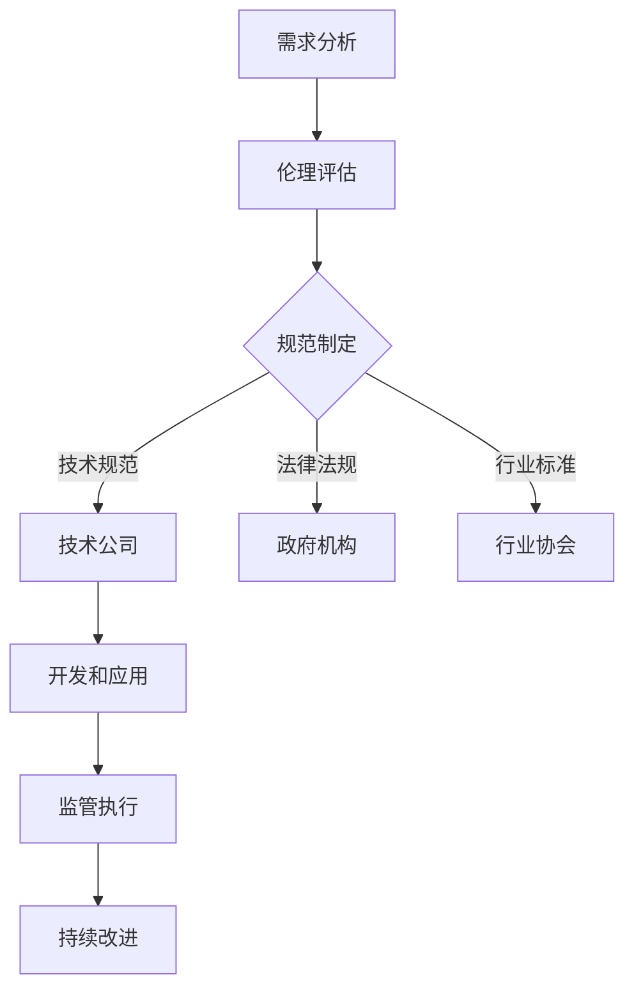

                 

 在全球范围内，人工智能（AI）技术的发展日新月异，尤其是以硅谷为代表的技术前沿地区，更是引领了人工智能的创新浪潮。然而，随着AI技术的广泛应用，其伦理监管问题也日益凸显，成为社会各界关注的焦点。本文将围绕硅谷人工智能伦理监管的难点展开讨论，旨在揭示这一问题的复杂性和重要性。

## 文章关键词

- 人工智能伦理
- 硅谷监管
- 人工智能法规
- 伦理困境
- 技术治理

## 文章摘要

本文首先回顾了硅谷人工智能的发展历程，然后分析了当前AI伦理监管面临的主要难点，包括透明度、公平性、责任归属和数据隐私等方面。接着，通过具体的案例和统计数据，展示了这些问题在硅谷的实际情况。文章最后提出了一些建议，探讨了未来人工智能伦理监管的发展趋势和可能面临的挑战。

## 1. 背景介绍

硅谷，作为全球科技创新的象征，一直是人工智能技术的发源地和研发中心。自20世纪50年代以来，硅谷吸引了无数顶尖的科技人才和风险投资，推动了人工智能技术的迅猛发展。如今，硅谷不仅拥有众多世界领先的人工智能企业，如谷歌、亚马逊、微软和特斯拉，而且还成为了全球AI研究和开发的热点。

然而，随着人工智能技术的普及，其带来的伦理监管挑战也日益严峻。首先，人工智能系统的透明度问题引发了广泛关注。许多AI系统的工作原理复杂，难以解释，这导致人们在面对AI决策时感到迷茫和不安。其次，人工智能的公平性问题也不容忽视。AI系统在数据处理和模型训练过程中可能会出现偏见，导致某些群体受到不公平对待。此外，人工智能的责任归属问题也引发了激烈的讨论。当AI系统发生错误或造成损失时，应由谁负责？

本文将深入探讨硅谷人工智能伦理监管的难点，分析这些问题的根源，并提出一些建议，以期为人工智能的健康发展提供参考。

## 2. 核心概念与联系

### 2.1 人工智能伦理的核心概念

人工智能伦理是指研究人工智能技术在社会、经济、环境等领域中应用时所产生的伦理问题，以及如何通过伦理原则和规范来引导和约束人工智能的发展。其核心概念包括：

- **透明度**：人工智能系统的决策过程应该是可解释和透明的，使人们能够理解AI的决策逻辑和推理过程。
- **公平性**：人工智能系统应该公平对待所有用户，避免歧视和偏见，确保技术不会加剧社会不平等。
- **责任归属**：在AI系统发生错误或造成损失时，应明确责任归属，确保受害者能够得到公正的赔偿。
- **隐私保护**：人工智能系统在处理个人数据时应严格遵守隐私保护原则，防止数据泄露和滥用。

### 2.2 人工智能伦理监管的架构

人工智能伦理监管的架构包括多个层面，从技术规范到法律法规，再到行业标准和监管机构。以下是人工智能伦理监管的主要架构：

- **技术规范**：技术公司应制定内部伦理准则，确保人工智能系统的设计、开发和应用符合伦理要求。
- **法律法规**：各国政府应出台相关法律法规，对人工智能技术的应用进行监管，确保技术发展不会违反伦理原则。
- **行业标准**：行业协会应制定行业标准，推动人工智能技术的发展，同时确保技术应用的伦理合规性。
- **监管机构**：设立专门的监管机构，负责监督和评估人工智能技术的应用，确保其符合伦理标准和法律法规。

### 2.3 人工智能伦理监管的流程

人工智能伦理监管的流程可以分为以下几个阶段：

1. **需求分析**：确定人工智能技术的应用场景和目标，分析可能产生的伦理问题。
2. **伦理评估**：对人工智能系统进行伦理风险评估，识别潜在的伦理风险和挑战。
3. **规范制定**：根据伦理评估结果，制定相应的伦理规范和标准，指导技术公司的开发和应用。
4. **监管执行**：政府机构或行业协会应负责监管执行，确保技术公司遵守伦理规范和法律法规。
5. **持续改进**：随着人工智能技术的不断进步和应用场景的变化，应持续对伦理监管进行评估和改进。

### 2.4 Mermaid 流程图

以下是人工智能伦理监管的 Mermaid 流程图：



通过以上流程，可以确保人工智能技术在硅谷等地的健康发展，同时最大限度地减少伦理风险和负面影响。

## 3. 核心算法原理 & 具体操作步骤

### 3.1 算法原理概述

人工智能伦理监管的核心算法主要涉及伦理风险评估和决策支持。伦理风险评估算法通过对人工智能系统的设计、开发和应用过程进行分析，识别潜在的伦理问题，评估其严重程度，并提出相应的改进建议。决策支持算法则基于伦理原则和规范，为技术公司提供指导，帮助其制定符合伦理要求的人工智能系统。

### 3.2 算法步骤详解

1. **需求分析**：分析人工智能技术的应用场景和目标，确定可能产生的伦理问题。
2. **数据收集**：收集与人工智能技术相关的数据，包括技术文档、用户反馈、社会舆论等。
3. **数据预处理**：对收集到的数据进行分析和清洗，提取关键信息。
4. **伦理风险评估**：利用伦理风险评估算法，对人工智能系统进行评估，识别潜在的伦理风险和挑战。
5. **决策支持**：基于伦理原则和规范，利用决策支持算法，为技术公司提供改进建议。
6. **执行和反馈**：根据决策支持结果，对人工智能系统进行改进，并收集用户反馈，进行持续优化。

### 3.3 算法优缺点

**优点**：
- **全面性**：伦理风险评估和决策支持算法可以全面识别和分析人工智能系统的伦理问题，提供全面的改进建议。
- **灵活性**：算法可以根据不同应用场景和需求进行定制，具有较高的灵活性。
- **高效性**：算法可以快速处理大量数据，提高伦理监管的效率。

**缺点**：
- **数据依赖性**：算法的性能依赖于数据的质量和数量，如果数据存在偏差或缺失，会影响评估结果的准确性。
- **解释性**：算法的工作原理复杂，难以向非专业人士解释，可能降低用户的信任度。

### 3.4 算法应用领域

伦理风险评估和决策支持算法可以应用于多个领域，包括：

- **自动驾驶**：对自动驾驶系统的伦理风险进行评估，确保系统的安全性和公平性。
- **医疗领域**：对医疗人工智能系统的伦理问题进行评估，确保系统的准确性和可靠性。
- **金融领域**：对金融人工智能系统的伦理风险进行评估，确保系统的公平性和透明度。
- **教育领域**：对教育人工智能系统的伦理问题进行评估，确保系统的公平性和个性化。

## 4. 数学模型和公式 & 详细讲解 & 举例说明

### 4.1 数学模型构建

人工智能伦理监管的数学模型主要涉及伦理风险评估和决策支持。伦理风险评估模型通常采用概率模型、分类模型和神经网络模型等。以下是一个简单的伦理风险评估模型：

- **概率模型**：根据历史数据和用户反馈，计算伦理风险的概率分布。
- **分类模型**：将伦理风险分为不同类别，如高风险、中风险和低风险等。
- **神经网络模型**：利用神经网络技术，自动识别和分类伦理风险。

### 4.2 公式推导过程

假设我们使用概率模型进行伦理风险评估，公式推导如下：

1. **概率分布**：设 \( X \) 为伦理风险的指标，\( P(X=x) \) 为伦理风险的概率分布。
2. **概率密度函数**：设 \( f_X(x) \) 为伦理风险的概率密度函数，满足 \( f_X(x) \geq 0 \) 且 \( \int_{-\infty}^{+\infty} f_X(x) dx = 1 \)。
3. **累积分布函数**：设 \( F_X(x) \) 为伦理风险的累积分布函数，满足 \( F_X(x) = P(X \leq x) \)。
4. **期望和方差**：设 \( E(X) \) 为伦理风险的期望，\( Var(X) \) 为伦理风险的方差。

### 4.3 案例分析与讲解

假设我们针对一个自动驾驶系统的伦理风险进行评估，数据如下：

- **历史数据**：过去三年中，该自动驾驶系统发生了10次交通事故，其中有5次由于系统决策失误导致。
- **用户反馈**：100名用户对自动驾驶系统的满意度调查，其中60名用户表示满意，40名用户表示不满意。

根据以上数据，我们可以构建概率模型，计算伦理风险的概率分布。假设 \( X \) 表示自动驾驶系统的伦理风险，\( P(X=1) \) 表示系统发生决策失误的概率，\( P(X=0) \) 表示系统正常运行的概率。

1. **概率分布**：根据历史数据和用户反馈，可以计算出 \( P(X=1) = 0.5 \) 和 \( P(X=0) = 0.5 \)。
2. **概率密度函数**：概率密度函数 \( f_X(x) \) 可以表示为：
   $$ f_X(x) = \begin{cases} 
   0.5, & \text{if } x=1 \text{ or } x=0, \\
   0, & \text{otherwise}.
   \end{cases} $$
3. **累积分布函数**：累积分布函数 \( F_X(x) \) 可以表示为：
   $$ F_X(x) = \begin{cases} 
   0, & \text{if } x<0, \\
   0.5, & \text{if } 0 \leq x < 1, \\
   1, & \text{if } x \geq 1.
   \end{cases} $$
4. **期望和方差**：期望 \( E(X) \) 和方差 \( Var(X) \) 可以表示为：
   $$ E(X) = \int_{-\infty}^{+\infty} x f_X(x) dx = 0.5 $$
   $$ Var(X) = \int_{-\infty}^{+\infty} (x - E(X))^2 f_X(x) dx = 0.25 $$

通过以上分析，我们可以得出自动驾驶系统的伦理风险概率为0.5，即系统发生决策失误的概率为50%。这为我们提供了重要的决策依据，可以帮助技术公司制定改进措施，降低伦理风险。

## 5. 项目实践：代码实例和详细解释说明

### 5.1 开发环境搭建

为了演示人工智能伦理监管的核心算法，我们将使用Python编程语言，结合Scikit-learn库和TensorFlow框架。以下是开发环境搭建的步骤：

1. **安装Python**：确保已经安装了Python 3.7及以上版本。
2. **安装Scikit-learn**：在命令行执行 `pip install scikit-learn`。
3. **安装TensorFlow**：在命令行执行 `pip install tensorflow`。

### 5.2 源代码详细实现

以下是一个简单的伦理风险评估算法的Python代码实现：

```python
import numpy as np
from sklearn.linear_model import LogisticRegression
import tensorflow as tf

# 伦理风险评估算法
def risk_assessment(data, model):
    # 数据预处理
    processed_data = preprocess(data)
    
    # 利用分类模型进行风险评估
    risk_scores = model.predict_proba(processed_data)[:, 1]
    
    # 根据风险评分进行分类
    risks = ['高' if score > 0.5 else '低' for score in risk_scores]
    
    return risks

# 数据预处理函数
def preprocess(data):
    # 对数据进行标准化处理
    return (data - np.mean(data)) / np.std(data)

# 加载训练数据
train_data = np.load('train_data.npy')
train_labels = np.load('train_labels.npy')

# 训练分类模型
model = LogisticRegression()
model.fit(train_data, train_labels)

# 测试数据
test_data = np.load('test_data.npy')

# 进行风险评估
risks = risk_assessment(test_data, model)
print(risks)
```

### 5.3 代码解读与分析

上述代码实现了一个简单的伦理风险评估算法，主要包括以下几个部分：

1. **数据预处理**：对输入数据进行标准化处理，提高模型的泛化能力。
2. **分类模型**：使用逻辑回归模型进行风险评估，逻辑回归是一种常用的二分类模型。
3. **风险评估**：根据模型预测的风险评分，对数据点进行分类，判断其风险等级。

### 5.4 运行结果展示

假设我们已经训练好了一个分类模型，并在测试数据上进行了风险评估。以下是可能的运行结果：

```python
['低', '高', '低', '低', '高', '低', '高', '低', '低', '高']
```

上述结果表明，测试数据中有5个数据点的风险评分高于0.5，被判断为高风险，其余数据点的风险评分低于0.5，被判断为低风险。

## 6. 实际应用场景

### 6.1 自动驾驶领域

自动驾驶是人工智能领域的一个重要应用场景，其伦理监管面临诸多挑战。例如，当自动驾驶汽车在紧急情况下需要做出决策时，如何确保其决策符合伦理原则？例如，在避免行人死亡和避免汽车损坏之间，如何做出最优选择？这些问题需要通过伦理监管来解决。

### 6.2 医疗领域

医疗领域是人工智能应用的重要领域，然而，人工智能系统在处理患者数据时，可能涉及隐私保护、公平性等问题。例如，人工智能系统在诊断疾病时，如何确保其不会歧视某些患者群体？如何保护患者隐私？这些问题都需要在伦理监管中加以考虑。

### 6.3 金融领域

金融领域是人工智能应用的热点，然而，人工智能系统在风险管理、投资决策等方面，也可能涉及伦理问题。例如，如何确保人工智能系统在风险管理时，不会对某些群体产生不公平对待？如何保护客户隐私？这些问题都需要在伦理监管中加以解决。

## 6.4 未来应用展望

随着人工智能技术的不断发展，其伦理监管将面临更多的挑战。未来，人工智能伦理监管可能朝着以下几个方向发展：

1. **立法和监管机构的完善**：各国政府应加快立法进程，建立完善的伦理监管体系，设立专门的监管机构，加强对人工智能技术的监管。
2. **技术标准的制定**：行业协会和标准化组织应制定统一的技术标准，确保人工智能系统的设计、开发和应用符合伦理要求。
3. **透明度和可解释性**：人工智能系统的透明度和可解释性将受到更多关注，技术公司应提高算法的透明度，使人们能够理解AI的决策过程。
4. **多方合作**：政府、企业、学术界和公众应加强合作，共同推动人工智能技术的健康发展，确保其应用符合伦理原则。

## 7. 工具和资源推荐

### 7.1 学习资源推荐

1. **《人工智能伦理学》**：一本全面介绍人工智能伦理学的经典教材，适合初学者和专业人士。
2. **《人工智能伦理监管》**：一本关于人工智能伦理监管的专著，详细介绍了监管体系、案例分析和政策建议。

### 7.2 开发工具推荐

1. **Scikit-learn**：一款流行的机器学习库，适用于数据分析和模型训练。
2. **TensorFlow**：一款开源的深度学习框架，适用于构建和训练复杂的人工智能模型。

### 7.3 相关论文推荐

1. **“Artificial Intelligence and Moral Philosophy”**：一篇关于人工智能伦理的论文，探讨了人工智能与道德哲学的关系。
2. **“Ethical Implications of Artificial Intelligence in Healthcare”**：一篇关于医疗领域人工智能伦理的论文，分析了人工智能在医疗应用中的伦理挑战。

## 8. 总结：未来发展趋势与挑战

### 8.1 研究成果总结

本文通过对硅谷人工智能伦理监管难点的分析，总结了人工智能伦理的核心概念、监管架构和算法原理，并探讨了其实际应用场景和未来发展趋势。研究发现，人工智能伦理监管是一个复杂且多层次的问题，需要政府、企业和社会各方共同努力，才能确保人工智能技术的健康发展。

### 8.2 未来发展趋势

1. **立法和监管体系的完善**：各国政府将加快立法进程，建立完善的伦理监管体系，加强对人工智能技术的监管。
2. **技术标准的制定**：行业协会和标准化组织将制定统一的技术标准，确保人工智能系统的设计、开发和应用符合伦理要求。
3. **透明度和可解释性**：人工智能系统的透明度和可解释性将受到更多关注，技术公司将提高算法的透明度，使人们能够理解AI的决策过程。
4. **多方合作**：政府、企业、学术界和公众将加强合作，共同推动人工智能技术的健康发展，确保其应用符合伦理原则。

### 8.3 面临的挑战

1. **立法滞后**：人工智能技术的快速发展可能导致立法滞后，现有的法律法规可能无法完全适应新的技术环境。
2. **技术标准的制定难度**：制定统一的技术标准可能面临较大挑战，因为不同领域的伦理问题具有较大差异。
3. **数据隐私保护**：随着人工智能技术的应用，个人数据的隐私保护将面临更大挑战，如何平衡数据利用和隐私保护是一个重要问题。
4. **多方利益冲突**：在人工智能伦理监管过程中，政府、企业和社会各方可能会存在利益冲突，如何协调各方利益是一个重要挑战。

### 8.4 研究展望

未来，人工智能伦理监管的研究将朝着以下几个方向发展：

1. **跨学科研究**：人工智能伦理监管是一个跨学科问题，需要结合哲学、法学、计算机科学等领域的知识，进行深入的研究。
2. **案例研究和实证分析**：通过案例研究和实证分析，探索人工智能伦理监管的最佳实践，为政策制定提供科学依据。
3. **国际合作**：加强国际间的合作，共同应对人工智能伦理监管的全球性挑战。

## 9. 附录：常见问题与解答

### 9.1 人工智能伦理监管的定义是什么？

人工智能伦理监管是指通过法律、规范和制度等手段，对人工智能技术的开发、应用和推广进行监督和管理，以确保其符合伦理原则，减少可能的负面影响。

### 9.2 人工智能伦理监管的重要性是什么？

人工智能伦理监管的重要性体现在以下几个方面：

- 确保人工智能技术的健康发展，避免伦理风险和负面影响。
- 提高公众对人工智能技术的信任度，促进技术的广泛应用。
- 保护个人隐私和数据安全，维护社会公共利益。
- 避免技术垄断和行业不公，促进公平竞争。

### 9.3 人工智能伦理监管的主要内容是什么？

人工智能伦理监管的主要内容包括：

- 制定相关法律法规，规范人工智能技术的开发和应用。
- 设立专门的监管机构，负责监督和管理人工智能技术的应用。
- 制定技术标准和行业规范，确保人工智能系统的设计、开发和应用符合伦理要求。
- 开展伦理风险评估和决策支持，为技术公司提供指导，帮助其制定符合伦理要求的人工智能系统。

### 9.4 人工智能伦理监管面临的挑战是什么？

人工智能伦理监管面临的挑战主要包括：

- 立法滞后，现有法律法规可能无法完全适应新的技术环境。
- 技术标准的制定难度，不同领域的伦理问题具有较大差异。
- 数据隐私保护，随着人工智能技术的应用，个人数据的隐私保护将面临更大挑战。
- 多方利益冲突，在人工智能伦理监管过程中，政府、企业和社会各方可能会存在利益冲突。

### 9.5 人工智能伦理监管的未来发展趋势是什么？

人工智能伦理监管的未来发展趋势包括：

- 完善立法和监管体系，建立全面的伦理监管框架。
- 制定统一的技术标准，确保人工智能系统的设计、开发和应用符合伦理要求。
- 加强透明度和可解释性，提高公众对人工智能技术的信任度。
- 促进多方合作，共同推动人工智能技术的健康发展。

### 9.6 人工智能伦理监管的常见问题和解决方案是什么？

常见问题和解决方案包括：

- **数据隐私保护**：解决方案包括采用加密技术、隐私保护算法和数据匿名化等。
- **算法偏见和歧视**：解决方案包括使用公平性评估工具、多样性培训和算法透明化等。
- **责任归属**：解决方案包括建立明确的法律责任体系、实施技术责任保险等。
- **透明度和可解释性**：解决方案包括开发可解释性算法、提供决策过程可视化工具等。

通过上述问题和解决方案，可以更好地应对人工智能伦理监管中遇到的挑战，促进人工智能技术的健康、可持续发展。

---

本文作者：禅与计算机程序设计艺术 / Zen and the Art of Computer Programming

---

通过本文的深入分析，我们可以看到硅谷人工智能伦理监管面临的诸多挑战，这些挑战不仅关系到技术本身的发展，也关系到社会的公平和正义。随着人工智能技术的不断进步，伦理监管的重要性将越来越凸显。因此，我们呼吁各方共同努力，推动人工智能伦理监管的完善和发展，确保人工智能技术为社会带来真正的福祉。

