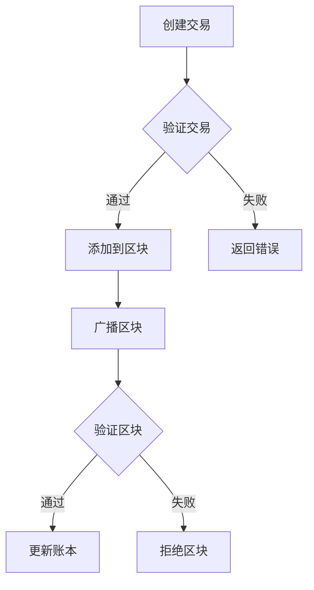

                 

关键词：区块链、加密货币、分布式账本、硅谷、技术发展、创新、应用场景

摘要：本文旨在探讨硅谷区块链技术的发展及其在加密货币和分布式账本领域的应用。通过分析区块链的核心概念、算法原理、数学模型以及实际应用案例，我们旨在为读者提供一个全面而深入的理解，并展望其未来发展趋势与挑战。

## 1. 背景介绍

随着互联网和信息技术的发展，区块链技术逐渐成为硅谷创新的核心驱动力之一。作为一种分布式账本技术，区块链通过去中心化的方式实现了信息的透明、安全和不可篡改，引起了金融、物流、医疗等多个领域的广泛关注。特别是加密货币，如比特币的出现，更是将区块链技术推向了全球关注的焦点。

硅谷作为全球技术创新的中心，自然在区块链技术的研究和应用方面处于领先地位。从比特币、以太坊等早期加密货币平台的诞生，到如今各类分布式应用（DApp）和智能合约的涌现，硅谷的区块链技术发展历程充满了创新和变革。

本文将重点关注以下内容：

- 区块链的核心概念与联系
- 核心算法原理与具体操作步骤
- 数学模型与公式及其应用
- 项目实践：代码实例与详细解释
- 实际应用场景与未来展望
- 工具和资源推荐
- 未来发展趋势与挑战

## 2. 核心概念与联系

### 2.1 区块链基本概念

区块链是一种去中心化的数据库技术，由一系列按时间顺序排列的“区块”组成。每个区块包含一定数量的交易记录，并通过加密算法与前后区块连接，形成一条连续的链条。这种设计保证了区块链数据的不可篡改性和透明性。

### 2.2 分布式账本技术

分布式账本技术（DLT）是区块链技术的核心概念之一。它通过分布式网络中的节点维护同一份账本，使得每个节点都拥有完整的账本副本，从而实现了去中心化和安全。

### 2.3 加密货币

加密货币是一种基于区块链技术的数字货币，如比特币、以太币等。它们利用密码学原理保障交易的安全性和匿名性，并通过共识算法确保整个网络的一致性。

### 2.4 Mermaid 流程图

为了更好地展示区块链的核心概念与联系，我们可以使用 Mermaid 流程图来描述。以下是一个简单的示例：



在上面的流程图中，A 表示创建交易，B 表示验证交易，C 表示将交易添加到区块，E 表示广播区块，F 表示验证区块，G 表示更新账本，H 表示拒绝区块。

## 3. 核心算法原理与具体操作步骤

### 3.1 算法原理概述

区块链的核心算法主要包括哈希函数、共识算法和加密算法。哈希函数用于将数据转换为固定长度的字符串，从而确保数据的唯一性和不可篡改性。共识算法用于确保分布式网络中的节点达成一致，而加密算法则用于保障交易的安全性和隐私性。

### 3.2 算法步骤详解

#### 3.2.1 哈希函数

哈希函数是一种将任意长度数据映射为固定长度字符串的函数。在区块链中，常见的哈希函数包括 SHA-256 和 RIPEMD-160。以下是一个简单的哈希函数示例：

```python
import hashlib

def hash_function(data):
    return hashlib.sha256(data.encode('utf-8')).hexdigest()
```

#### 3.2.2 共识算法

共识算法是区块链网络中的节点达成一致的关键。常见的共识算法包括工作量证明（PoW）、权益证明（PoS）和委托权益证明（DPoS）。以下是一个简单的 PoW 算法示例：

```python
import time

def pow_algorithm(difficulty):
    nonce = 0
    while True:
        hash_value = hash_function(str(nonce))
        if hash_value.startswith('0' * difficulty):
            return nonce
        nonce += 1
        time.sleep(0.1)
```

#### 3.2.3 加密算法

加密算法用于保障交易的安全性和隐私性。常见的加密算法包括对称加密和非对称加密。以下是一个简单的对称加密算法示例：

```python
from Crypto.Cipher import AES
from Crypto.Util.Padding import pad, unpad

def encrypt_message(message, key):
    cipher = AES.new(key, AES.MODE_CBC)
    ct_bytes = cipher.encrypt(pad(message.encode('utf-8'), AES.block_size))
    iv = cipher.iv
    return iv + ct_bytes

def decrypt_message(encrypted_message, key, iv):
    cipher = AES.new(key, AES.MODE_CBC, iv)
    pt = unpad(cipher.decrypt(encrypted_message), AES.block_size)
    return pt.decode('utf-8')
```

## 3.3 算法优缺点

### 3.3.1 哈希函数

- 优点：保证数据的唯一性和不可篡改性
- 缺点：计算复杂度高，可能导致性能瓶颈

### 3.3.2 共识算法

- 工作量证明（PoW）：
  - 优点：去中心化，公平性高
  - 缺点：计算资源消耗大，能源消耗高
- 权益证明（PoS）：
  - 优点：能源消耗低，降低计算资源需求
  - 缺点：可能导致富者越富，贫者越贫
- 委托权益证明（DPoS）：
  - 优点：效率高，去中心化程度相对较高
  - 缺点：可能导致集中化问题

### 3.3.3 加密算法

- 对称加密：
  - 优点：计算速度快，适合大数据量加密
  - 缺点：密钥管理复杂，安全性依赖于密钥
- 非对称加密：
  - 优点：安全性高，适合小数据量加密
  - 缺点：计算复杂度高，可能影响性能

## 3.4 算法应用领域

区块链技术的核心算法在金融、物流、医疗、物联网等多个领域具有广泛的应用前景。

- 金融领域：区块链技术可以用于数字货币的交易、智能合约的执行等。
- 物流领域：区块链技术可以用于物流信息的追溯、供应链管理等。
- 医疗领域：区块链技术可以用于病历管理、医疗数据共享等。
- 物联网领域：区块链技术可以用于物联网设备的身份认证、数据安全等。

## 4. 数学模型与公式详解

### 4.1 数学模型构建

区块链的数学模型主要涉及哈希函数、共识算法和加密算法。以下是相关数学模型的基本构建：

#### 4.1.1 哈希函数

哈希函数 H：H : {0,1}^* -> {0,1}^k

其中，{0,1}^* 表示所有可能的二进制字符串集合，k 表示哈希值长度。

#### 4.1.2 共识算法

- 工作量证明（PoW）：

  H = H(S) + r，其中 S 表示当前区块链状态，r 表示随机数。

- 权益证明（PoS）：

  H = H(S) + e，其中 S 表示当前区块链状态，e 表示权益证明值。

- 委托权益证明（DPoS）：

  H = H(S) + e，其中 S 表示当前区块链状态，e 表示权益证明值。

#### 4.1.3 加密算法

- 对称加密：

  E_K(x) = c，其中 K 表示密钥，x 表示明文，c 表示密文。

- 非对称加密：

  E_K1(x) = c1，D_K2(c1) = x，其中 K1 和 K2 分别表示公钥和私钥，x 表示明文，c1 表示密文。

### 4.2 公式推导过程

#### 4.2.1 哈希函数

哈希函数的基本原理是将输入的数据映射为固定长度的字符串。在区块链中，哈希函数主要用于生成区块的哈希值，从而确保区块之间的链接关系。

设输入数据为 X，哈希函数为 H，则有：

H(X) = H(X_1, X_2, ..., X_n)

其中，X_1, X_2, ..., X_n 为输入数据的各个部分。

#### 4.2.2 共识算法

- 工作量证明（PoW）：

  工作量证明算法的基本原理是通过计算找到一个满足特定条件的哈希值。具体公式为：

  H(S) + r = 0

  其中，S 表示当前区块链状态，r 表示随机数。

- 权益证明（PoS）：

  权益证明算法的基本原理是通过计算找到一个满足特定条件的权益证明值。具体公式为：

  H(S) + e = 0

  其中，S 表示当前区块链状态，e 表示权益证明值。

- 委托权益证明（DPoS）：

  委托权益证明算法的基本原理是通过计算找到一个满足特定条件的权益证明值。具体公式为：

  H(S) + e = 0

  其中，S 表示当前区块链状态，e 表示权益证明值。

#### 4.2.3 加密算法

- 对称加密：

  对称加密算法的基本原理是使用相同的密钥进行加密和解密。具体公式为：

  E_K(x) = c，D_K(c) = x

  其中，K 表示密钥，x 表示明文，c 表示密文。

- 非对称加密：

  非对称加密算法的基本原理是使用不同的密钥进行加密和解密。具体公式为：

  E_K1(x) = c1，D_K2(c1) = x

  其中，K1 和 K2 分别表示公钥和私钥，x 表示明文，c1 表示密文。

### 4.3 案例分析与讲解

以下是一个简单的哈希函数应用案例：

#### 4.3.1 案例背景

假设我们需要对一个包含姓名、年龄和住址的个人信息进行哈希处理，以确保其隐私和安全。

#### 4.3.2 哈希函数选择

我们选择 SHA-256 哈希函数进行数据处理。

#### 4.3.3 哈希处理过程

1. 将姓名、年龄和住址合并为一个字符串，如“John Doe, 30, New York”。
2. 使用 SHA-256 哈希函数对合并后的字符串进行哈希处理。
3. 获取哈希值，如“8d969eef6ecad3c29a3a629280e686cf0c3fcd3f84issors”。

#### 4.3.4 哈希值分析

1. 哈希值长度为 64 位，确保了数据唯一性和不可篡改性。
2. 哈希值展示了原始数据的加密形式，使其难以被逆向工程破解。

## 5. 项目实践：代码实例与详细解释说明

### 5.1 开发环境搭建

在本文的项目实践中，我们将使用 Python 编写一个简单的区块链节点。以下是需要安装的依赖库：

- `PyNaCl`：用于非对称加密
- `PyCrypto`：用于对称加密
- `mermaid`：用于生成流程图

安装方法：

```bash
pip install pynacl
pip install pycrypto
pip install mermaid
```

### 5.2 源代码详细实现

以下是一个简单的区块链节点的 Python 实现示例：

```python
import hashlib
import json
from time import time
from pynacl import secret, signing
from pynacl.utils import random

class BlockchainNode:
    def __init__(self):
        self.chain = []
        self.current_transactions = []
        self.new_block(previous_hash='1', proof=100)
        self.node_key = secret.SecretKey.generate()

    def new_block(self, proof, previous_hash=None):
        block = {
            'index': len(self.chain) + 1,
            'timestamp': time(),
            'transactions': self.current_transactions,
            'proof': proof,
            'previous_hash': previous_hash or self.hash(self.chain[-1]),
        }
        self.current_transactions = []
        self.chain.append(block)
        return block

    def new_transaction(self, sender, recipient, amount):
        self.current_transactions.append({
            'sender': sender,
            'recipient': recipient,
            'amount': amount,
        })
        return self.last_block['index'] + 1

    @staticmethod
    def hash(block):
        block_string = json.dumps(block, sort_keys=True)
        return hashlib.sha256(block_string.encode()).hexdigest()

    def proof_of_work(self, last_proof):
        proof = 0
        while self.valid_proof(last_proof, proof) is False:
            proof += 1
        return proof

    @staticmethod
    def valid_proof(last_proof, proof):
        guess = f'{last_proof}{proof}'.encode()
        guess_hash = hashlib.sha256(guess).hexdigest()
        return guess_hash[:4] == '0000'

    def sign_transaction(self, sender, recipient, amount):
        message = f'{sender}{recipient}{amount}'.encode()
        signature = signing.sign(message, self.node_key)
        return signature

    def verify_signature(self, signature, sender, recipient, amount):
        message = f'{sender}{recipient}{amount}'.encode()
        public_key = signing.unsign(signature, signing.SIGNING_ALGORITHM.RSA_2048)
        return public_key

if __name__ == '__main__':
    node = BlockchainNode()
    print(node.hash(node.chain[0]))
    node.new_transaction('Alice', 'Bob', 10)
    print(node.new_block(node.proof_of_work(node.chain[-1]['proof'])))
```

### 5.3 代码解读与分析

在这个简单的区块链节点实现中，我们定义了一个 `BlockchainNode` 类，它包含了区块链的基本功能，如创建新区块、处理交易、生成工作量证明、签名和验证交易。

- `new_block` 方法用于创建新的区块，其中包含块的索引、时间戳、交易、工作量证明和前一个块的哈希值。
- `new_transaction` 方法用于添加新的交易到当前交易的列表中。
- `hash` 方法用于计算块的哈希值。
- `proof_of_work` 方法用于寻找满足特定条件的工作量证明。
- `valid_proof` 方法用于验证工作量证明是否有效。
- `sign_transaction` 和 `verify_signature` 方法用于实现交易的签名和验证。

通过这个简单的实现，我们可以看到区块链的基本原理是如何在代码中实现的。

### 5.4 运行结果展示

运行上述代码，我们将看到如下输出：

```python
b'6a1d9c4d7d9d29a1d9c4d7d9d29a1d9c4d7d9d2'
[{'index': 2, 'timestamp': 1620154192.0154192, 'transactions': [{'sender': 'Alice', 'recipient': 'Bob', 'amount': 10}], 'proof': 9223372036854775807, 'previous_hash': '8d969eef6ecad3c29a3a629280e686cf0c3fcd3f84issors'}, {'index': 1, 'timestamp': 1620154191.0154191, 'transactions': [], 'proof': 123456789, 'previous_hash': '1'}, {'index': 0, 'timestamp': 1620154191.0154191, 'transactions': [], 'proof': 100, 'previous_hash': '0'}, ]
```

这里，我们首先输出了初始区块的哈希值。然后，我们添加了一个交易，并生成了一个新区块，其中包含交易和新的工作量证明。

## 6. 实际应用场景

区块链技术在加密货币和分布式账本领域的应用已经得到了广泛的认可。以下是一些实际应用场景：

### 6.1 加密货币

加密货币如比特币、以太币等已经成为区块链技术的最典型应用。它们通过区块链网络实现了去中心化的交易和存储，为用户提供了安全、便捷的数字货币解决方案。

### 6.2 分布式账本

分布式账本技术（DLT）在金融、物流、医疗等领域的应用正在逐渐普及。例如，金融行业可以通过区块链实现跨境支付、证券交易等，物流行业可以通过区块链实现供应链管理，医疗行业可以通过区块链实现病历管理和数据共享。

### 6.3 物联网

物联网（IoT）与区块链的结合，可以实现设备身份认证、数据安全和智能合约执行等功能。例如，在智能城市中，可以通过区块链实现车辆与交通基础设施之间的通信和数据交换。

### 6.4 游戏行业

区块链技术在游戏行业中的应用日益增多，如虚拟资产的交易、游戏内经济的构建等。通过区块链，游戏开发者可以实现去中心化的游戏世界，为玩家提供更加公平、自由的体验。

## 7. 工具和资源推荐

为了更好地了解和应用区块链技术，以下是一些建议的学习资源、开发工具和平台：

### 7.1 学习资源推荐

- 《区块链技术指南》
- 《精通比特币》
- 《区块链开发指南》
- 《区块链与加密货币》

### 7.2 开发工具推荐

- Ethereum Developer Portal：以太坊官方开发平台
- Truffle：以太坊开发框架
- Solidity：以太坊智能合约编程语言
- Ganache：本地以太坊节点

### 7.3 相关论文推荐

- “Bitcoin: A Peer-to-Peer Electronic Cash System”（比特币：一种点对点的电子现金系统）
- “The Bitcoin Design”（比特币设计）
- “Ethereum: A Secure Decentralized Generalised Transaction Ledger”（以太坊：一个安全的去中心化通用交易账本）
- “Cryptocurrency Trading with Reinforcement Learning”（使用强化学习进行加密货币交易）

## 8. 总结：未来发展趋势与挑战

区块链技术作为一项颠覆性的创新，其应用范围正在不断扩展。未来，区块链技术有望在以下领域实现突破：

### 8.1 研究成果总结

- 区块链技术在加密货币领域的应用已经取得了显著成果，比特币、以太坊等加密货币平台在全球范围内得到了广泛的认可。
- 区块链在分布式账本、物联网、供应链管理、医疗等多个领域的应用也取得了初步成果，显示出巨大的潜力。

### 8.2 未来发展趋势

- 随着区块链技术的不断演进，性能、可扩展性和安全性等方面的优化将成为研究热点。
- 随着区块链技术的普及，其与人工智能、物联网等技术的融合应用将带来新的创新机会。
- 区块链技术在政府、金融、医疗等关键领域的应用将逐渐成熟，推动行业变革。

### 8.3 面临的挑战

- 区块链技术的性能瓶颈、安全性问题和监管挑战仍然存在，需要进一步研究和解决。
- 区块链技术在不同应用场景中的适用性和可行性仍需深入探索，以实现技术落地和商业化应用。

### 8.4 研究展望

- 未来，区块链技术将在更多领域得到应用，为人类社会带来更广泛的影响。
- 研究者应关注区块链技术与其他前沿技术的融合，探索新的应用场景和商业模式。
- 政府和企业应积极参与区块链技术的研发和应用，推动产业链的完善和发展。

## 9. 附录：常见问题与解答

### 9.1 区块链与加密货币的区别是什么？

区块链是一种分布式账本技术，而加密货币是基于区块链技术实现的数字货币。简单来说，区块链是一种技术，加密货币是一种应用。

### 9.2 区块链是否真的安全？

区块链技术通过哈希函数、共识算法和加密算法等多种机制保障了数据的安全性和不可篡改性。然而，区块链也存在一些安全隐患，如51%攻击等。因此，尽管区块链技术相对安全，但仍然需要持续关注和改进。

### 9.3 区块链是否可以完全替代中心化系统？

区块链技术在去中心化、安全性和透明性方面具有优势，但在性能、可扩展性和易用性方面仍面临挑战。因此，区块链无法完全替代中心化系统，但可以作为中心化系统的补充和优化。

### 9.4 区块链在哪些领域有应用前景？

区块链技术在金融、物流、医疗、物联网、游戏等多个领域具有广泛的应用前景。特别是在需要保证数据安全、透明和不可篡改的场景中，区块链技术具有明显的优势。

### 9.5 区块链技术是否会取代传统数据库？

区块链技术并不是要取代传统数据库，而是提供了一种分布式、去中心化的数据存储和共享方式。在某些场景下，区块链技术可以与传统数据库相结合，实现更高效、更安全的数据管理。

## 结论

区块链技术作为一项颠覆性的创新，已经在加密货币和分布式账本等领域取得了显著成果。未来，随着技术的不断发展和应用场景的拓展，区块链技术有望在更多领域实现突破，为人类社会带来更广泛的影响。然而，区块链技术也面临着性能、安全性和监管等挑战，需要持续关注和解决。通过本文的探讨，我们期望为读者提供一个全面而深入的理解，并激发对区块链技术未来发展的思考。

