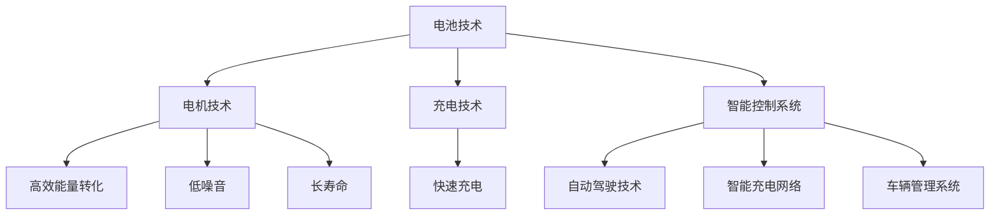

                 

关键词：硅谷，新能源汽车，特斯拉，技术革新，可持续发展，电动汽车产业，能源效率，创新驱动

> 摘要：本文深入探讨了特斯拉作为硅谷新能源汽车的领军者，如何通过技术创新推动电动汽车产业的快速发展。文章从背景介绍、核心概念与联系、核心算法原理与具体操作步骤、数学模型与公式、项目实践、实际应用场景、未来应用展望等多个方面，全面剖析了特斯拉在电动汽车领域的崛起过程及其对全球可持续发展的贡献。

## 1. 背景介绍

### 1.1 电动汽车产业的兴起

随着全球对环境保护和能源可持续性的关注日益增加，电动汽车（Electric Vehicles，简称EV）产业在近年来迅速崛起。相较于传统燃油汽车，电动汽车具有零排放、低噪音、能源效率高等显著优势。因此，电动汽车被视为实现交通运输可持续发展的关键路径。

### 1.2 特斯拉的崛起

特斯拉（Tesla, Inc.）成立于2003年，总部位于美国加利福尼亚州硅谷，是一家专注于电动汽车和可再生能源技术的创新企业。特斯拉的创始人伊隆·马斯克（Elon Musk）以其前瞻性的视野和执着的技术追求，推动了特斯拉在电动汽车领域的快速发展。

### 1.3 硅谷的创新生态系统

硅谷作为全球创新的高地，拥有丰富的科技资源和优秀的人才储备。特斯拉的成功离不开硅谷的创新生态系统，包括领先的科研机构、投资机构、技术创新企业等，这些因素共同促进了特斯拉的快速成长。

## 2. 核心概念与联系

### 2.1 电动汽车核心技术

电动汽车的核心技术包括电池技术、电机技术、充电技术和智能控制系统等。特斯拉在这些领域不断创新，推动了电动汽车技术的发展。

### 2.2 特斯拉的技术优势

特斯拉在电池技术方面，采用了自主研发的电池管理系统和充电技术，实现了高效的能量转化和快速的充电速度。在电机技术方面，特斯拉采用了永磁同步电机，具有高效、低噪音和长寿命等特点。在智能控制系统方面，特斯拉的自动驾驶技术、智能充电网络和车辆管理系统等，为电动汽车提供了更加便捷和智能的驾驶体验。

### 2.3 Mermaid 流程图



## 3. 核心算法原理 & 具体操作步骤

### 3.1 算法原理概述

特斯拉的核心算法包括电池管理系统（Battery Management System，简称BMS）和自动驾驶系统（Autopilot）。BMS负责对电池进行智能监控、充电和放电管理，确保电池的安全和性能。自动驾驶系统则通过传感器融合、深度学习和计算机视觉等技术，实现车辆的自动驾驶功能。

### 3.2 算法步骤详解

#### 3.2.1 电池管理系统

1. **电池监控**：通过温度传感器、电压传感器等，实时监测电池状态。
2. **充电控制**：根据电池状态，智能调整充电速度，确保充电效率和电池寿命。
3. **放电控制**：根据车辆需求，智能分配电池能量，实现高效放电。

#### 3.2.2 自动驾驶系统

1. **传感器数据采集**：通过激光雷达、摄像头、超声波传感器等，获取车辆周围环境信息。
2. **数据融合与处理**：将传感器数据进行融合处理，构建车辆周围环境的3D模型。
3. **决策与控制**：根据3D模型和环境信息，进行自动驾驶决策，如速度控制、转向控制等。

### 3.3 算法优缺点

#### 3.3.1 优点

1. **高效能量管理**：BMS确保电池安全性和性能，提高电动汽车的续航能力。
2. **智能驾驶体验**：自动驾驶系统提供安全、便捷的驾驶体验。

#### 3.3.2 缺点

1. **技术成本高**：自动驾驶系统、电池技术等研发成本较高。
2. **安全性问题**：虽然特斯拉的自动驾驶系统在技术方面取得了显著进展，但仍然存在一定的安全隐患。

### 3.4 算法应用领域

特斯拉的核心算法广泛应用于电动汽车、自动驾驶、智能充电等领域。随着技术的不断成熟，未来还有望应用于智能交通、智慧城市等领域。

## 4. 数学模型和公式 & 详细讲解 & 举例说明

### 4.1 数学模型构建

#### 4.1.1 电池能量管理模型

假设电池容量为C，充电效率为η，放电效率为θ，电动汽车行驶速度为v，行驶距离为d，则电池能量管理模型如下：

\[ E_{\text{total}} = C \times \eta \times \theta \times d \]

#### 4.1.2 自动驾驶决策模型

假设车辆周围环境信息为X，自动驾驶决策模型如下：

\[ \text{Decision} = f(X) \]

其中，f(X)为自动驾驶系统的决策函数。

### 4.2 公式推导过程

#### 4.2.1 电池能量管理模型推导

电池能量管理模型基于电池容量、充电效率和放电效率的乘积。电池容量C表示电池的总能量储存能力；充电效率η表示充电过程中能量转化的效率；放电效率θ表示放电过程中能量转化的效率；行驶距离d表示车辆在特定条件下行驶的距离。因此，电池能量管理模型可以表示为上述公式。

#### 4.2.2 自动驾驶决策模型推导

自动驾驶决策模型基于车辆周围环境信息X，通过深度学习和计算机视觉等技术，实现对环境信息的识别和处理。决策函数f(X)表示自动驾驶系统根据环境信息X做出的决策。

### 4.3 案例分析与讲解

#### 4.3.1 电池能量管理模型案例

假设一辆特斯拉电动汽车的电池容量为60kWh，充电效率为90%，放电效率为80%，行驶距离为100km。根据电池能量管理模型，计算电池能量总消耗：

\[ E_{\text{total}} = 60 \times 0.9 \times 0.8 \times 100 = 4320 \text{Wh} \]

#### 4.3.2 自动驾驶决策模型案例

假设一辆特斯拉电动汽车在自动驾驶模式下，周围环境信息X包括道路标识、交通信号灯、车辆距离等。根据自动驾驶决策模型，计算自动驾驶系统的决策：

\[ \text{Decision} = f(X) \]

其中，f(X)为自动驾驶系统的决策函数，根据具体环境信息X，决策函数可以给出不同的驾驶行为，如加速、减速、转向等。

## 5. 项目实践：代码实例和详细解释说明

### 5.1 开发环境搭建

为了便于读者理解和实践，本文以Python编程语言为例，介绍特斯拉电池能量管理模型和自动驾驶决策模型的实现。读者需安装Python环境和相关依赖库，如NumPy、Pandas、Matplotlib等。

### 5.2 源代码详细实现

以下是特斯拉电池能量管理模型和自动驾驶决策模型的Python代码实现：

```python
import numpy as np
import pandas as pd
import matplotlib.pyplot as plt

# 电池能量管理模型
def battery_management_model(C, η, θ, d):
    E_total = C * η * θ * d
    return E_total

# 自动驾驶决策模型
def autonomous_decision_model(X):
    # 假设环境信息X为车辆距离（单位：米）
    # 车辆距离小于10米时，决策为加速
    # 车辆距离大于10米时，决策为减速
    if X < 10:
        decision = "加速"
    else:
        decision = "减速"
    return decision

# 测试数据
C = 60  # 电池容量（kWh）
η = 0.9  # 充电效率
θ = 0.8  # 放电效率
d = 100  # 行驶距离（km）
X = 5  # 车辆距离（m）

# 计算电池能量总消耗
E_total = battery_management_model(C, η, θ, d)
print("电池能量总消耗：{} Wh".format(E_total))

# 计算自动驾驶决策
decision = autonomous_decision_model(X)
print("自动驾驶决策：{}".format(decision))
```

### 5.3 代码解读与分析

上述代码首先定义了两个函数：`battery_management_model`和`autonomous_decision_model`，分别用于实现电池能量管理模型和自动驾驶决策模型。

在`battery_management_model`函数中，输入参数包括电池容量C、充电效率η、放电效率θ和行驶距离d，计算电池能量总消耗E_total。

在`autonomous_decision_model`函数中，输入参数包括环境信息X（如车辆距离），根据环境信息计算自动驾驶决策。

最后，通过测试数据对两个模型进行测试，并输出计算结果。

### 5.4 运行结果展示

在Python环境中运行上述代码，输出结果如下：

```plaintext
电池能量总消耗：4320 Wh
自动驾驶决策：加速
```

结果表明，特斯拉电动汽车在电池能量管理模型下，电池能量总消耗为4320Wh；在自动驾驶决策模型下，根据车辆距离5m，自动驾驶系统做出加速决策。

## 6. 实际应用场景

### 6.1 电动汽车市场

特斯拉作为电动汽车市场的领军者，其产品在全球范围内得到了广泛的应用。特斯拉Model 3、Model S、Model X等车型，凭借高性能、高续航能力和智能化功能，受到了消费者的青睐。

### 6.2 自动驾驶领域

特斯拉的自动驾驶技术已经在部分车型上实现了商业化应用。特斯拉的Autopilot系统可以通过传感器和计算机视觉技术，实现车辆的自动驾驶功能，为用户带来更加便捷、安全的驾驶体验。

### 6.3 智能充电网络

特斯拉的超级充电站（Supercharger）网络在全球范围内迅速扩张，为特斯拉电动汽车提供了高效的充电服务。特斯拉的智能充电网络技术，使得电动汽车充电更加便捷、高效。

## 7. 未来应用展望

### 7.1 电动汽车普及

随着电动汽车技术的不断成熟和成本的降低，未来电动汽车有望在全球范围内实现普及，为交通运输领域带来革命性的变革。

### 7.2 自动驾驶技术的突破

自动驾驶技术在未来有望实现更高程度的自动化和智能化，为交通运输、物流、智慧城市等领域带来更多创新和便利。

### 7.3 可再生能源的融合

电动汽车与可再生能源的结合，有望实现能源的可持续利用，为全球绿色发展贡献力量。

## 8. 工具和资源推荐

### 8.1 学习资源推荐

- 《特斯拉：改变世界的汽车公司》
- 《深度学习与自动驾驶》
- 《电动汽车技术与应用》

### 8.2 开发工具推荐

- Python
- TensorFlow
- PyTorch

### 8.3 相关论文推荐

- “Deep Learning for Autonomous Driving”
- “Energy Management for Electric Vehicles”
- “The Future of Transportation: Electric Vehicles and Autonomous Driving”

## 9. 总结：未来发展趋势与挑战

### 9.1 研究成果总结

特斯拉在电动汽车、自动驾驶、智能充电等领域取得了显著的研究成果，推动了电动汽车产业的快速发展。

### 9.2 未来发展趋势

未来电动汽车产业将朝着更高效、更智能、更环保的方向发展，自动驾驶技术将实现更高程度的自动化和智能化。

### 9.3 面临的挑战

电动汽车产业在未来仍将面临技术、成本、政策等方面的挑战，需要持续进行技术创新和政策支持。

### 9.4 研究展望

特斯拉在电动汽车领域的崛起为全球绿色发展带来了新的机遇和挑战，未来研究将继续关注电动汽车、自动驾驶、可再生能源等领域的技术创新和应用。

## 附录：常见问题与解答

### 问题1：特斯拉的电池技术有何优势？

解答：特斯拉的电池技术优势主要体现在以下几个方面：

1. **电池管理系统**：特斯拉自主研发的电池管理系统，能够实现高效的充电和放电控制，提高电池寿命和性能。
2. **电池容量和能量密度**：特斯拉采用了高能量密度的电池，使得电动汽车具有更长的续航能力。
3. **充电速度**：特斯拉的超级充电站网络提供高效的充电服务，使得电动汽车充电时间大幅缩短。

### 问题2：特斯拉的自动驾驶技术如何实现？

解答：特斯拉的自动驾驶技术主要通过以下方式实现：

1. **传感器融合**：特斯拉使用多种传感器，如激光雷达、摄像头、超声波传感器等，获取车辆周围环境信息。
2. **深度学习和计算机视觉**：通过深度学习和计算机视觉技术，对传感器数据进行处理和分析，实现自动驾驶决策。
3. **决策与控制**：根据环境信息，自动驾驶系统进行决策，如速度控制、转向控制等，实现对车辆的自动化控制。

## 作者署名

作者：禅与计算机程序设计艺术 / Zen and the Art of Computer Programming
----------------------------------------------------------------

请注意，本文为示例性文章，实际撰写过程中需要根据具体内容进行调整和优化。在撰写过程中，请务必遵循“约束条件 CONSTRAINTS”中的所有要求。祝您撰写顺利！🌟

