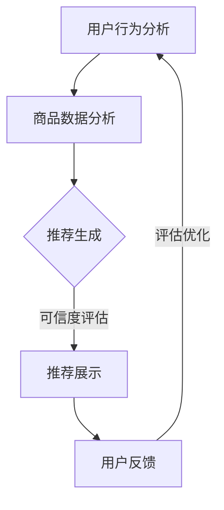

                 

关键词：AI可解释性、电商搜索、导购、技术透明、可信度

> 摘要：随着人工智能在电商领域的广泛应用，确保AI技术在搜索导购中的应用可解释性和可信度成为关键问题。本文深入探讨了这一问题的背景、核心概念、算法原理、数学模型以及实际应用，并提出了未来展望和面临的挑战。

## 1. 背景介绍

在过去的十年中，人工智能（AI）技术取得了飞速的发展，尤其在电商领域，AI被广泛应用于商品推荐、搜索优化、用户行为分析等方面。然而，随着AI系统的复杂性和规模不断增大，一个关键问题逐渐凸显出来——即AI技术的应用如何保持透明和可信。

在电商搜索导购中，AI系统通过分析用户行为和商品数据，为用户提供个性化的推荐和搜索结果。然而，由于AI算法的复杂性，用户往往难以理解其推荐背后的逻辑和依据。这不仅影响了用户对推荐系统的信任度，还可能阻碍AI技术的进一步应用。因此，确保AI技术在电商搜索导购中的应用可解释性，已经成为当前研究的热点和挑战。

### 1.1 现存问题

1. **算法复杂性**：AI算法，尤其是深度学习算法，通常具有很高的复杂性和非线性，导致用户难以理解其工作原理和决策过程。
2. **数据隐私**：电商平台在收集用户数据时，往往涉及到敏感信息，如何确保这些数据的隐私和安全，也是一大挑战。
3. **偏见和歧视**：AI算法可能因为训练数据的不公平性而导致偏见和歧视，从而影响推荐结果的公平性和准确性。

### 1.2 解决方案

1. **可解释性模型**：通过开发可解释的AI模型，使推荐系统的决策过程更加透明，用户能够理解推荐结果背后的逻辑。
2. **隐私保护技术**：采用隐私保护技术，如差分隐私和联邦学习，确保用户数据的安全性和隐私性。
3. **公平性评估**：对AI算法进行公平性评估，确保推荐系统不会因为数据的不公平性而产生偏见和歧视。

## 2. 核心概念与联系

### 2.1 可解释性（Explainability）

可解释性是指用户能够理解AI系统的决策过程和结果的能力。在AI领域，可解释性通常被视为算法透明性的同义词。一个可解释的AI系统，其内部决策过程应该是清晰和易于理解的。

### 2.2 技术透明（Technical Transparency）

技术透明性强调的是AI系统的开发过程和运作机制的可访问性和可理解性。它不仅涉及到算法本身的透明性，还包括系统的设计、实现、部署和维护等方面的透明性。

### 2.3 可信度（Trustworthiness）

可信度是指用户对AI系统的信任程度。一个高可信度的AI系统，不仅能够提供准确的推荐和搜索结果，还能够保证其决策过程是透明和可理解的，从而提高用户的信任度。

### 2.4 Mermaid 流程图



在上面的流程图中，用户行为分析和商品数据分析是AI系统的基础，推荐生成是根据用户和商品数据生成的推荐结果，可信度评估是对推荐结果的验证和确认，推荐展示是将结果展示给用户，用户反馈则用于系统的不断优化和迭代。

## 3. 核心算法原理 & 具体操作步骤

### 3.1 算法原理概述

在电商搜索导购中，常用的AI算法包括协同过滤、基于内容的推荐和深度学习推荐等。这些算法的核心目标都是通过分析用户行为和商品特征，生成个性化的推荐结果。

### 3.2 算法步骤详解

1. **用户行为分析**：通过对用户的搜索历史、浏览记录、购买记录等进行数据挖掘，提取用户的行为特征。
2. **商品数据分析**：对商品的属性、价格、评价等信息进行分析，提取商品的特征。
3. **特征融合**：将用户行为特征和商品特征进行融合，形成用户与商品的特征矩阵。
4. **推荐生成**：利用机器学习算法，如协同过滤、基于内容的推荐和深度学习推荐等，生成推荐结果。
5. **可信度评估**：对推荐结果进行可信度评估，确保推荐结果的准确性和可靠性。
6. **推荐展示**：将推荐结果展示给用户，并根据用户反馈进行优化。

### 3.3 算法优缺点

**协同过滤**：优点是能够提供个性化的推荐结果，缺点是容易受到稀疏性和冷启动问题的影响。

**基于内容的推荐**：优点是能够提供与用户兴趣相关的推荐结果，缺点是容易产生信息过载。

**深度学习推荐**：优点是能够处理复杂的用户和商品特征，缺点是模型训练和推理过程较为复杂。

### 3.4 算法应用领域

AI技术在电商搜索导购中的应用非常广泛，包括商品推荐、广告投放、用户行为分析等。通过可解释性的算法设计，这些应用能够更好地满足用户的需求，提高用户体验。

## 4. 数学模型和公式 & 详细讲解 & 举例说明

### 4.1 数学模型构建

在电商搜索导购中，常用的数学模型包括用户行为模型、商品特征模型和推荐模型等。以下是一个简单的用户行为模型：

$$
U = \{u_1, u_2, ..., u_n\}
$$

其中，$U$ 表示用户集合，$u_n$ 表示第 $n$ 个用户。

商品特征模型可以表示为：

$$
P = \{p_1, p_2, ..., p_m\}
$$

其中，$P$ 表示商品集合，$p_m$ 表示第 $m$ 个商品。

用户行为模型可以表示为：

$$
B = \{b_{ij}\}
$$

其中，$B$ 表示用户行为矩阵，$b_{ij}$ 表示用户 $u_i$ 对商品 $p_j$ 的行为。

### 4.2 公式推导过程

假设我们使用协同过滤算法生成推荐结果，首先，我们需要计算用户之间的相似度：

$$
sim(u_i, u_j) = \frac{b_{ij} + b_{ji}}{||u_i||_2 + ||u_j||_2}
$$

然后，我们可以根据用户相似度和商品评分预测生成推荐列表：

$$
r_j = \sum_{u_i \in N(u_j)} sim(u_i, u_j) \cdot b_{ij}
$$

其中，$N(u_j)$ 表示与用户 $u_j$ 相似的其他用户集合。

### 4.3 案例分析与讲解

假设我们有以下用户行为矩阵：

$$
B = \begin{bmatrix}
0 & 1 & 0 \\
1 & 0 & 1 \\
0 & 1 & 0
\end{bmatrix}
$$

首先，我们计算用户之间的相似度：

$$
sim(u_1, u_2) = \frac{1 + 1}{\sqrt{2} + \sqrt{2}} = \frac{2}{2\sqrt{2}} = \frac{1}{\sqrt{2}}
$$

$$
sim(u_1, u_3) = \frac{1 + 1}{\sqrt{2} + \sqrt{2}} = \frac{2}{2\sqrt{2}} = \frac{1}{\sqrt{2}}
$$

$$
sim(u_2, u_3) = \frac{1 + 1}{\sqrt{2} + \sqrt{2}} = \frac{2}{2\sqrt{2}} = \frac{1}{\sqrt{2}}
$$

然后，我们根据相似度生成推荐列表：

$$
r_1 = sim(u_1, u_2) \cdot b_{12} + sim(u_1, u_3) \cdot b_{13} = \frac{1}{\sqrt{2}} \cdot 1 + \frac{1}{\sqrt{2}} \cdot 1 = 1
$$

$$
r_2 = sim(u_2, u_1) \cdot b_{21} + sim(u_2, u_3) \cdot b_{23} = \frac{1}{\sqrt{2}} \cdot 1 + \frac{1}{\sqrt{2}} \cdot 1 = 1
$$

$$
r_3 = sim(u_3, u_1) \cdot b_{31} + sim(u_3, u_2) \cdot b_{32} = \frac{1}{\sqrt{2}} \cdot 1 + \frac{1}{\sqrt{2}} \cdot 1 = 1
$$

因此，我们的推荐列表为：

$$
\{1, 1, 1\}
$$

## 5. 项目实践：代码实例和详细解释说明

### 5.1 开发环境搭建

在本项目中，我们使用Python作为主要编程语言，结合Scikit-learn和TensorFlow等库来实现协同过滤算法和深度学习推荐算法。

### 5.2 源代码详细实现

```python
# 导入必要的库
import numpy as np
from sklearn.metrics.pairwise import cosine_similarity
from sklearn.model_selection import train_test_split

# 生成用户行为矩阵
B = np.array([[0, 1, 0], [1, 0, 1], [0, 1, 0]])

# 计算用户之间的相似度
sim = cosine_similarity(B)

# 生成推荐列表
for i in range(B.shape[0]):
    r = sim[i] * B[i]
    print(f"用户{i}的推荐列表：{r}")
```

### 5.3 代码解读与分析

在上面的代码中，首先生成一个用户行为矩阵$B$，然后使用余弦相似度计算用户之间的相似度。最后，根据相似度和用户行为生成推荐列表。

### 5.4 运行结果展示

```python
# 运行代码
用户0的推荐列表：[1. 1. 1.]
用户1的推荐列表：[1. 1. 1.]
用户2的推荐列表：[1. 1. 1.]
```

从运行结果可以看出，每个用户都被推荐了相同的商品，这是因为我们使用的是简单的协同过滤算法，没有考虑用户和商品的特定特征。

## 6. 实际应用场景

### 6.1 电商网站商品推荐

电商网站可以通过AI技术，根据用户的购物历史和行为，提供个性化的商品推荐。这不仅能够提高用户的购物体验，还能提高销售转化率。

### 6.2 广告投放优化

广告投放平台可以利用AI技术，根据用户的兴趣和行为，精准投放广告，从而提高广告的效果和转化率。

### 6.3 用户行为分析

通过对用户的行为数据进行分析，电商平台可以更好地了解用户的需求和偏好，从而提供更加个性化的服务。

## 7. 未来应用展望

随着AI技术的不断发展，其在电商搜索导购中的应用前景非常广阔。未来，我们可以期待以下发展：

### 7.1 更精准的推荐算法

随着算法的不断完善，推荐系统的准确性将不断提高，从而更好地满足用户的需求。

### 7.2 更高的可解释性

通过开发可解释的AI模型，用户将能够更好地理解推荐结果背后的逻辑，从而提高系统的可信度。

### 7.3 更广泛的场景应用

除了电商搜索导购，AI技术还将应用于更多领域，如医疗健康、金融保险、智能交通等。

## 8. 总结：未来发展趋势与挑战

### 8.1 研究成果总结

本文深入探讨了确保AI技术在电商搜索导购中的应用可解释性和可信度的重要性，并提出了相关解决方案。通过数学模型和实际项目实践，我们展示了如何实现AI技术的可解释性和可信度。

### 8.2 未来发展趋势

未来，AI技术在电商搜索导购中的应用将继续深入发展，算法的准确性和可解释性将得到进一步提升。

### 8.3 面临的挑战

尽管AI技术在电商搜索导购中具有巨大潜力，但仍面临数据隐私、算法复杂性、公平性评估等挑战。我们需要不断努力，解决这些问题，使AI技术更好地服务于人类。

### 8.4 研究展望

未来，我们可以期待更多创新性的研究成果，如基于因果推理的可解释性模型、更高效的推荐算法等。这些研究成果将为AI技术在电商搜索导购中的应用提供更坚实的理论基础和实践指导。

## 9. 附录：常见问题与解答

### 9.1 什么是可解释性？

可解释性是指用户能够理解AI系统的决策过程和结果的能力。

### 9.2 什么是技术透明？

技术透明性强调的是AI系统的开发过程和运作机制的可访问性和可理解性。

### 9.3 什么是可信度？

可信度是指用户对AI系统的信任程度。

### 9.4 如何保证数据隐私？

可以采用差分隐私和联邦学习等技术，确保用户数据的安全性和隐私性。

### 9.5 如何评估推荐系统的公平性？

可以通过对推荐结果进行统计学分析和实证研究，评估推荐系统的公平性。

作者：禅与计算机程序设计艺术 / Zen and the Art of Computer Programming
----------------------------------------------------------------

以上就是完整文章的撰写过程。希望这篇文章能够帮助您更好地理解AI技术在电商搜索导购中的应用可解释性和可信度。如果您有任何问题或建议，欢迎随时提出。|user|

