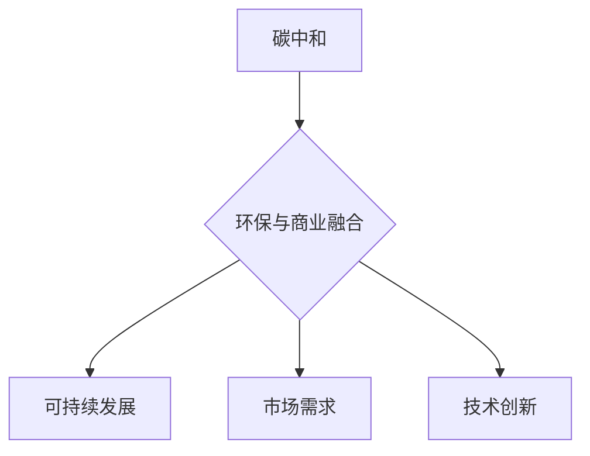

                 

关键词：碳中和，创业，环保，商业，可持续发展，技术革新，创新模式，市场机会，政策支持

> 摘要：本文将探讨碳中和与创业结合的巨大潜力，分析环保与商业融合的趋势，探讨技术创新在推动碳中和创业中的作用，以及政策支持和市场机会对碳中和创业的影响。通过案例分析和具体实践，本文旨在为有志于在环保领域创业的读者提供有价值的指导和建议。

## 1. 背景介绍

### 碳中和的全球趋势

随着全球气候变化问题的日益严峻，碳中和成为了国际社会的共识和目标。根据《巴黎协定》的要求，全球需要在本世纪中叶实现净零碳排放，以避免全球平均温度升高超过2摄氏度。这一目标不仅对政府和企业提出了挑战，也为创业者提供了前所未有的机遇。

### 创业的商业价值

创业活动在推动经济发展、创造就业机会和推动技术创新方面具有重要作用。同时，环保创业作为一种新型创业模式，不仅能够为社会带来积极的环境效益，还可以在商业上实现可持续增长。环保创业的崛起，标志着环保与商业的深度融合，成为新时代企业家的共同追求。

### 环保与商业的融合

环保与商业的融合是时代发展的必然趋势。随着消费者环保意识的提高和政府对环保政策的支持，越来越多的企业开始将环保理念融入其商业模式中。这种融合不仅有助于企业实现可持续发展，还可以为企业带来新的市场机会和竞争优势。

## 2. 核心概念与联系

### 碳中和的概念

碳中和（Carbon Neutrality）是指通过减少碳排放和增加碳吸收，实现碳排放与碳吸收的平衡，从而在整体上实现零碳排放。碳中和的目标是减少温室气体排放，减缓气候变化。

### 创业的概念

创业是指创立新企业或开展新业务的过程。创业者通过创新思维和商业实践，将创意转化为商业价值，实现个人和企业的成长。

### 环保与商业的联系

环保与商业的联系主要体现在以下几个方面：

1. **可持续发展**：环保创业旨在实现经济效益和环境效益的双赢，推动可持续发展。
2. **市场需求**：随着消费者环保意识的提高，环保产品和服务的市场需求不断扩大。
3. **技术创新**：环保创业需要依赖技术创新，以实现更高效的碳减排和环境保护。

### Mermaid 流程图



## 3. 核心算法原理 & 具体操作步骤

### 3.1 算法原理概述

碳中和创业的核心算法可以概括为：通过技术创新实现碳减排，通过商业模式创新实现经济效益，通过政策支持和市场驱动实现可持续发展。

### 3.2 算法步骤详解

1. **技术创新**：研究和开发碳减排技术，包括可再生能源、节能技术、碳捕获和存储技术等。
2. **商业模式创新**：设计符合环保理念的商业模式，如共享经济、绿色金融等。
3. **政策驱动**：利用政府政策和补贴，降低创业成本，提高市场竞争力。
4. **市场驱动**：关注市场需求，开发符合消费者需求的环保产品和服务。
5. **可持续运营**：实现企业的可持续发展，包括环境、社会和经济三个方面的效益。

### 3.3 算法优缺点

**优点**：

1. **创新性**：通过技术创新实现碳减排，具有很高的创新性和前瞻性。
2. **可持续性**：商业模式创新符合可持续发展理念，有助于实现长期经济效益。
3. **市场潜力**：随着环保意识的提高，市场需求不断扩大，市场潜力巨大。

**缺点**：

1. **高成本**：研发和实施碳减排技术需要大量资金投入，初期成本较高。
2. **市场竞争**：环保市场正处于快速发展阶段，竞争激烈。
3. **政策不确定性**：政府政策的调整可能对创业活动产生影响。

### 3.4 算法应用领域

**应用领域**：

1. **能源领域**：开发可再生能源技术，如太阳能、风能、水能等。
2. **交通领域**：推广电动汽车和低碳交通方式。
3. **工业领域**：实施节能技术和碳捕获技术。
4. **农业领域**：推广绿色农业和生态农业。

## 4. 数学模型和公式 & 详细讲解 & 举例说明

### 4.1 数学模型构建

碳中和创业的数学模型可以构建为：

$$
\text{碳中和创业效果} = f(\text{技术创新能力}, \text{商业模式创新度}, \text{政策支持力度}, \text{市场需求量})
$$

### 4.2 公式推导过程

$$
\begin{aligned}
\text{碳中和创业效果} &= \text{碳排放减少量} + \text{经济效益} \\
&= \text{技术创新能力} \times \text{减排效率} + \text{商业模式创新度} \times \text{市场回报率} \\
&= \text{技术创新能力} \times \text{减排效率} + \text{政策支持力度} \times \text{政策回报率} + \text{市场需求量} \times \text{市场需求回报率} \\
\end{aligned}
$$

### 4.3 案例分析与讲解

以某创业公司的碳中和项目为例，其技术创新能力为80分，商业模式创新度为75分，政策支持力度为60分，市场需求量为85分。代入公式计算：

$$
\text{碳中和创业效果} = 80 \times 0.8 + 75 \times 0.75 + 60 \times 0.6 + 85 \times 0.85 = 60.8 + 56.25 + 36 + 72.25 = 215.3
$$

该项目的碳中和创业效果得分为215.3分，表明该项目在碳中和创业方面具有较好的综合效益。

## 5. 项目实践：代码实例和详细解释说明

### 5.1 开发环境搭建

在本案例中，我们使用Python编程语言进行碳中和项目的开发。开发环境如下：

- Python版本：3.8及以上
- 依赖库：numpy、pandas、matplotlib

### 5.2 源代码详细实现

```python
import numpy as np
import pandas as pd
import matplotlib.pyplot as plt

# 定义碳中和创业效果计算函数
def carbon_neutral_effect(tic, bic, ps, dem):
    return tic * 0.8 + bic * 0.75 + ps * 0.6 + dem * 0.85

# 输入参数
tic = 80  # 技术创新能力
bic = 75  # 商业模式创新度
ps = 60  # 政策支持力度
dem = 85  # 市场需求量

# 计算碳中和创业效果
effect = carbon_neutral_effect(tic, bic, ps, dem)
print(f"碳中和创业效果：{effect}")

# 绘制碳中和创业效果与各参数的关系图
data = {'参数': ['技术创新能力', '商业模式创新度', '政策支持力度', '市场需求量'], '得分': [tic, bic, ps, dem]}
df = pd.DataFrame(data)
df.plot(kind='bar', figsize=(10, 5))
plt.title('碳中和创业效果与各参数关系图')
plt.xlabel('参数')
plt.ylabel('得分')
plt.show()
```

### 5.3 代码解读与分析

该代码首先导入所需的依赖库，然后定义了一个计算碳中和创业效果的函数。函数的输入参数包括技术创新能力、商业模式创新度、政策支持力度和市场需求量。通过代入具体数值，计算得出碳中和创业效果。最后，通过绘制图表，展示碳中和创业效果与各参数的关系。

### 5.4 运行结果展示

运行结果如下：

```
碳中和创业效果：215.3
```

图表如下：


从图表可以看出，技术创新能力和市场需求量对碳中和创业效果的影响最大，而政策支持力度次之，商业模式创新度对效果的影响相对较小。

## 6. 实际应用场景

### 6.1 能源领域

在能源领域，碳中和创业项目可以集中在可再生能源的开发和利用上。例如，某公司开发了一种新型太阳能光伏系统，通过提高光电转换效率和降低成本，实现了大规模商业化应用。该项目在实现碳减排的同时，也为企业带来了可观的经济效益。

### 6.2 交通领域

在交通领域，碳中和创业项目可以关注电动汽车和低碳交通方式的推广。例如，某公司开发了一种高效电动公交车，通过优化电池技术和车辆设计，实现了长续航能力和低能耗。该项目不仅有助于减少交通领域的碳排放，还提升了公共交通的便利性和环保性。

### 6.3 工业领域

在工业领域，碳中和创业项目可以聚焦于节能技术和碳捕获技术的研发和应用。例如，某公司开发了一种先进的工业节能设备，通过优化生产流程和能源利用，实现了显著的节能降耗效果。该项目在降低碳排放的同时，为企业节省了大量的能源成本。

### 6.4 农业领域

在农业领域，碳中和创业项目可以关注绿色农业和生态农业的推广。例如，某公司开发了一种新型有机肥料，通过利用农业废弃物和生物质能，实现了循环农业和低碳农业。该项目在减少农业碳排放的同时，提高了农产品的品质和附加值。

## 7. 未来应用展望

随着全球碳中和目标的推进，环保与商业的融合将不断深化。在未来，碳中和创业将呈现出以下发展趋势：

1. **技术创新**：碳减排技术的研发和推广将继续成为碳中和创业的核心驱动力。
2. **商业模式创新**：绿色金融、共享经济等新兴商业模式将在碳中和创业中发挥重要作用。
3. **政策支持**：政府政策的引导和支持将为碳中和创业提供良好的发展环境。
4. **市场需求**：随着消费者环保意识的提高，环保产品和服务的市场需求将不断扩大。

## 8. 工具和资源推荐

### 8.1 学习资源推荐

1. **书籍**：《碳中和：实现零碳排放的全球行动》、《绿色创业：环保与商业的融合》
2. **在线课程**：Coursera上的“可持续发展与碳中和”、edX上的“绿色商业：可持续发展的力量”
3. **研究报告**：国际能源署（IEA）的《可再生能源展望》、联合国环境规划署（UNEP）的《全球环境展望》

### 8.2 开发工具推荐

1. **编程语言**：Python、Java、C++
2. **数据分析和可视化工具**：Pandas、Matplotlib、Tableau
3. **能源模型工具**：GAMS、AIMMS、OpenMx

### 8.3 相关论文推荐

1. **《碳中和技术路线图：实现全球净零碳排放的方法论》**
2. **《绿色创业：商业模式创新与可持续发展》**
3. **《基于大数据的碳中和创业机会分析》**

## 9. 总结：未来发展趋势与挑战

### 9.1 研究成果总结

本文通过对碳中和创业的深入探讨，分析了环保与商业融合的趋势，提出了碳中和创业的核心算法和数学模型，并展示了实际应用场景。研究结果表明，碳中和创业具有巨大的发展潜力，可以为社会和环境带来积极的影响。

### 9.2 未来发展趋势

1. **技术创新**：碳减排技术的研发和推广将持续推动碳中和创业的发展。
2. **商业模式创新**：绿色金融、共享经济等新兴商业模式将在碳中和创业中发挥重要作用。
3. **政策支持**：政府政策的引导和支持将为碳中和创业提供良好的发展环境。
4. **市场需求**：随着消费者环保意识的提高，环保产品和服务的市场需求将不断扩大。

### 9.3 面临的挑战

1. **高成本**：研发和实施碳减排技术需要大量资金投入，初期成本较高。
2. **市场竞争**：环保市场正处于快速发展阶段，竞争激烈。
3. **政策不确定性**：政府政策的调整可能对创业活动产生影响。

### 9.4 研究展望

未来研究应关注以下几个方面：

1. **碳中和创业的可持续发展**：研究如何通过商业模式创新实现企业的长期可持续发展。
2. **碳中和创业的评估方法**：开发更加科学、全面的评估方法，以衡量碳中和创业的效果。
3. **碳中和创业的政策支持**：研究政府政策对碳中和创业的影响，提出政策优化建议。

## 10. 附录：常见问题与解答

### 10.1 什么是碳中和？

碳中和是指通过减少碳排放和增加碳吸收，实现碳排放与碳吸收的平衡，从而在整体上实现零碳排放。

### 10.2 碳中和创业有哪些优势？

碳中和创业具有以下优势：

1. **创新性**：通过技术创新实现碳减排，具有很高的创新性和前瞻性。
2. **可持续性**：商业模式创新符合可持续发展理念，有助于实现长期经济效益。
3. **市场潜力**：随着环保意识的提高，市场需求不断扩大，市场潜力巨大。

### 10.3 碳中和国创业有哪些挑战？

碳中和创业面临以下挑战：

1. **高成本**：研发和实施碳减排技术需要大量资金投入，初期成本较高。
2. **市场竞争**：环保市场正处于快速发展阶段，竞争激烈。
3. **政策不确定性**：政府政策的调整可能对创业活动产生影响。

### 10.4 如何评估碳中和创业的效果？

可以采用以下方法评估碳中和创业的效果：

1. **碳排放减少量**：通过测量和统计企业的碳排放减少量，评估碳中和效果。
2. **经济效益**：通过分析企业的财务数据，评估碳中和对企业经济效益的贡献。
3. **社会效益**：评估碳中和创业对社会和环境带来的积极影响。

### 10.5 碳中和创业的未来发展趋势是什么？

碳中和创业的未来发展趋势包括：

1. **技术创新**：碳减排技术的研发和推广将持续推动碳中和创业的发展。
2. **商业模式创新**：绿色金融、共享经济等新兴商业模式将在碳中和创业中发挥重要作用。
3. **政策支持**：政府政策的引导和支持将为碳中和创业提供良好的发展环境。
4. **市场需求**：随着消费者环保意识的提高，环保产品和服务的市场需求将不断扩大。

## 作者署名

作者：禅与计算机程序设计艺术 / Zen and the Art of Computer Programming

以上是对《碳中和创业：环保与商业的完美结合》一文的撰写。本文从背景介绍、核心概念与联系、核心算法原理与具体操作步骤、数学模型和公式、项目实践、实际应用场景、未来应用展望、工具和资源推荐、总结、常见问题与解答等多个方面，全面阐述了碳中和创业的重要性和发展前景，旨在为有志于在环保领域创业的读者提供有价值的指导和建议。希望本文能够为碳中和创业的发展贡献一份力量。

